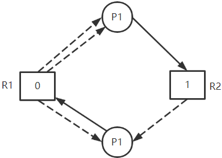
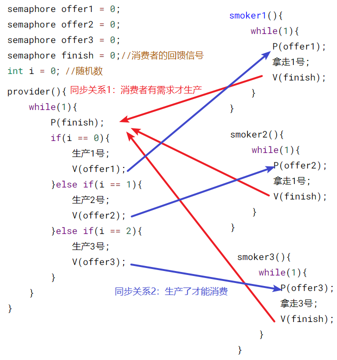

>   进程管理：进程是由于OS通过 **创建原语** 创建，运行所需的信息保存于 **PCB** 中，完成 **进程调度** 后，通过 **进程控制原语** ，进行 **进程状态切换**。
>
>   进程可以划分成更小的调度单位 **线程**，用来提高系统并行度

<!--more-->

# 2. 进程管理

>   为更好的描述和控制多道程序的并发执行，引入 **进程** 的概念

## 2.1 进程基本概念

### 2.1.1 进程

>   **进程是运行中的进程实体在某一时刻的快照**

-   同一程序，运行在不同的数据集上形成不同的进程
-   同一系统的进程（线程）由系统调用被用于不同的进程，仍是这一进程（线程）

>   **线程间有独立性也有相关性**

-   进程实体的一次运行，是系统进行**资源分配和调度**的一个独立单位
-   系统资源是有限的，各进程对共享资源互斥访问，相互制约

#### 进程 $\neq$ 程序


关联：进程是程序的一次执行过程

>   程序：存放于磁盘中的静态可执行文件
>
>   -   程序封闭性：运行结果取决于程序本身，不受外界影响

---

>   进程：在内存中运行的进程实体，是一个动态过程
>
>   -   进程执行速度不会改变执行结果

---

**单个进程某一时刻只能执行一个程序**

### 2.1.2 进程实体(进程映像)

进程实体=PCB+程序段+数据段

#### a. PCB

>   程序控制块是进程存在的唯一标识
>
>   描述进程的基本情况和运行状态：OS对进程管理工作所需的信息都保存在PCB中

组成：

-   进程描述信息

    PID：进程ID

    UID：进程归属的用户ID

-   进程控制和管理信息

    进程优先级

    进程当前状态

-   资源分配清单

    说明与该进程相关的内存地址空间或虚拟地址空间的使用情况

    所示用的IO设备信息

-   处理机相关信息

    CPU 中各寄存器的值

PCB的创建与销毁

-   PCB在进程创建时，由OS创建并常驻在内存，最后由OS回收

#### b. 程序段

>   指令集

多个进程可独立运行同一段程序

#### c. 数据段

>   进程运行期间的相关数据

数据

-   原始数据
-   中间结果
-   最终结果
-   局部变量
-   全局变量：全局变量是对同一进程而言，不同进程是不同的变量，没有关系，不可用于交换数据

### 2.1.3 进程特性

-   动态性

    进程的生命周期：创建，活动，暂停，终止

    **动态性时最基本特征**

-   并发性

    一段时间多个进程并发执行

-   独立性

    进程实体是一个能独立运行、获取资源和接受调度的基本单位

-   异步性

    进程按各自速度向不可预知的方向推进

    进程不可复现

### 2.1.4 进程的组织方式

即PCB的组织方式

##### 队列方式

>   按照进程状态不同，分为多个队列

OS持有各队列的指针

##### 索引方式

>   根据进程状态的不同，创建索引表

OS持有各索引表的指针

## 2.2 线程基本概念

>   引入进程：更好的描述和控制多道程序的并发执行
>
>   引入线程：
>
>   -   一个进程内，并发处理多个**事务**
>   -   减少程序在并发执行时，所付出的时空开销

支持线程的OS中：

-   **进程是系统资源（除CPU）的分配单位**
-   **线程是调度（处理机）的分配单位**

### 2.2.1 线程属性

-   线程可创建和撤销另一个线程

-   多核计算机中，各线程可占用不同的CPU

-   线程状态：就绪，阻塞，运行

-   同一进程的线程切换，不会引起进程切换

    不同进程中的线程切换，会引起进程切换

-   切换线程，系统开销小

### 2.2.2 多任务与多线程

#### a. 多任务

>   对于操作系统而言，可同时执行多个程序

#### b. 多线程

>   对同一程序而言，一个程序可执行多个线程，完成不同事务

### 2.2.3 线程与进程对比

<!-- prettier-ignore-start -->

|      | 调度(处理机分配)                                             | 资源分配                 | 地址空间和其他资源                                           | 通信                            | 并发性                                   | 切换开销                 |
| ---- | ------------------------------------------------------------ | ------------------------ | ------------------------------------------------------------ | ------------------------------- | ---------------------------------------- | ------------------------ |
| 进程 | 传统OS，进程是资源分配和调度的基本单位                       | 进程是拥有资源的基本单位 | 进程的地址空间独立                                           | 进程间通信需要同步与互斥机制    | 进程间的并发提高任务的并发度             | 需改变运行环境           |
| 线程 | 引入线程的OS，线程是调度的基本单位，进程是资源分配的基本单位 | 进程是拥有资源的基本单位 | 同一进程的线程间共享进程的资源，某进程内的线程对其他进程不可见 | 线程间共享存储，直接读/写数据段 | 多进程间的并发，多线程间的并发提高并发度 | 同一进程内线程切换开销小 |

<!-- prettier-ignore-end -->

### 2.2.4 线程实现方式

一段**代码逻辑**只有获得**运行机会**才能被CPU执行

#### a. 分类

##### 用户级线程（代码逻辑）

>   由应用程序完成线程管理的工作，线程的状态切换无需OS干预（在用户态完成），OS感受不到线程的存在

优点：

-   线程切换在用户空间完成
-   CPU不需要换态，系统开销小

缺点

-   并发度不高，一个用户级线程阻塞，整个进程阻塞
-   多线程无法在多核CPU上运行

##### 内核级线程（运行机会）

>   由OS完成线程管理工作，线程状态切换需要切换到 **内核态** 才能完成

**内核级线程才是调度的基本单位**

优点

-   并发能力强：一个线程被阻塞后，本进程的其他线程还可以运行
-   多线程可以在多核计算机上运行

缺点

-   线程切换需要OS内核完成
-   线程管理成本高

#### b. 线程模型

##### 一对一模型（纯内核级线程）

>   一个用户级线程映射到一个内核级线程。
>
>   每个用户进程都有与用户级线程同等数量的内核级线程


优点：

-   并发能力强：当一个线程被阻塞后，其他线程还可以继续执行
-   可以在多核CPU上运行

缺点

-   一个用户进程占用多个内核级线程
-   线程管理成本高，开销大：线程切换由OS完成，需要切换到内核态

##### 多对一模型（纯用户级线程）

>   多个用户线程映射到一个内核级线程
>
>   一个进程只能被分配到一个内核级线程


优点：

-   用户级线程切换在用户空间即可完成，不需要切换到内核态
-   线程管理的系统开销小，效率高

缺点

-   当一个用户级线程被阻塞后，整个进程都会被阻塞，并发度不高
-   多线程不能在多核CPU上运行

##### 多对多模型

>   n个用户线程映射到m个内核级线程 $n\ge m$ 
>
>   每个用户进程对应 m 个内核级线程


## 2.3 进程状态与进程调度

### 2.3.1 进程状态

#### a. 五状态模型


#### b. 进程状态切换条件


就绪->阻塞 进程自身做出的 **主动行为**

阻塞->就绪 不是进程自身控制 **被动行为**

---

运行->就绪：时间片用完；有优先级更高的进程抢占CPU

---

没有运行态的进程，一定没有阻塞态的进程

没有运行态的进程不代表没有进程，发生死锁时，所有进程都在阻塞态

#### c. 进程控制原语

>   进程控制的程序段，称为原语
>
>   通过相关的系统调用进入内核态，由内核态的CPU执行相应的程序段

原语具有原子性，用 `关中断` 和 `开中断` 这两个特权指令实现原子性


#### d. 调度与切换

调度是**决策行为**

-   解决 **给哪个** 的问题，资源分配原则

切换是**执行行为**

-   解决 **怎么给** 的问题，实际的分配行动：剥夺与分配

---

>   CPU模式切换与进程切换：区别在于是否改变运行环境（寄存器的值）

模式切换：在一个进程执行期间，因中断或异常进入内核态，执行完成后回到用户态

-   OS只需恢复进程进入内核态时的CPU现场，不涉及运行环境的改变

进程切换

-   一定涉及运行环境的改变

---

>   进程调度与进程切换

进程调度：从就绪队列中选一个进程

进程切换：

-   处理机的让渡
-   原进程现场的保存，将各寄存器的值保存到PCB中
-   新进程现场的恢复，根据PCB中信息恢复现场，如：PC，PSW，通用寄存器值，处理机现场

**进程调度与切换会带来系统开销，不是切换越频繁，并发度越高**

### 2.3.2 进程调度

>   调度：按某种算法从就绪队里中选择一个进程，分配CPU

调度是多道程序设计的基础

#### a. 基本概念

##### 作业

>   一个具体任务，一段程序

批处理系统中作业与进程的关系：**一个作业一个根进程**

1.  作业调度从后备队列中选择一个作业运行
2.  首先为该作业创建一个根进程
    -   OS执行作业解释程序，解释作业的说明书
    -   父进程在执行过程中动态创建多个子进程
3.  当父进程执行到 “撤出语句” 时，作业从运行态转换到完成态，将作业及相关结果送到输出井
4.  作业终止进程：输出作业结果；回收资源；清理现场

分时系统中作业与进程关系：**一个用户一个根进程**

-   作业：用户的一次上机交互过程

-   系统为每个终端创建一个进程

    进程执行解释程序

    每条终端命令，创建一个子进程执行

##### 挂起态

>   为提高内存利用率，将暂时不能运行的进程调到外存中等待

-   阻塞挂起
-   就绪挂起

挂起与阻塞都得不到CPU服务，但从运行态到阻塞态是进程映像留在内存中，到挂起态是将进程映像放入外存，主存中不存

#### b. 三种调度的对比

<!-- prettier-ignore-start -->

|                    | 做什么                                                       | 调度场所             | 发生频率 | 对进程状态的影响                         |
| ------------------ | ------------------------------------------------------------ | -------------------- | -------- | ---------------------------------------- |
| 作业调度(高级调度) | 从后备队列中选择一个作业，分配内存呢等必要资源，建立根进程<br />一个作业只发生一次调入，一次调出 | 外存->内存(面向作业) | 最低     | $无\rightarrow 创建态\rightarrow 就绪态$ |
| 内存调度(中级调度) | 从**挂起队列**中选择合适的进程将数据调回内存                 | 外存->内存(面向进程) | 中       | $挂起态\rightarrow就绪态$                |
| 进程调度(低级调度) | 从**就绪队列**中选择合适进程，分配处理机                     |                      | 高       | $就绪态\rightarrow运行态$                |

<!-- prettier-ignore-end -->

#### c. 进程调度时机

##### 需要进行进程调度的情况

当前进程 **主动放弃** 处理机

-   进程正常终止
-   运行过程发生异常终止
-   进程主动请求阻塞(等待IO)

当前进程 **被动放弃** 处理机

-   时间片用完
-   有更紧急的事件处理(IO中断)
-   有更高优先级的进程进入就绪队列

##### 不能进行进程调度的情况

在 **处理中断的过程** 中

当前进程在 **操作系统内核程序临界区**

当前进程在 **原子操作过程中**

#### d. 进程调度方式

>   有更高优先级的进程进入就绪队列，如何分配处理机

##### 非剥夺调度方式(非抢占方式)

>   只允许进程主动放弃处理机

-   无法及时处理紧急任务，适用于早期批处理系统

##### 剥夺式调度方式(抢占式)

>   可优先处理更紧急进程，也可让各进程按时间片轮流执行

-   适用于分时操作系统、实时操作系统

#### e. 进程调度算法

##### 性能评价指标

###### CPU利用率

$$
CPU利用率=\frac{忙碌时间}{总时间}
$$

如：某计算机只支持单道程序，某作业刚开始需要在CPU上执行5s，再在打印机上输出5s，之后再执行5s，才结束。CPU利用率，打印机利用率分别为多少

$CPU利用率=\frac{5+5}{5+5+5}=66.67%$

$打印机利用率=\frac{5}{15}=33.33%$

###### 系统吞吐率

>   单位时间CPU完成的作业数

$$
系统吞吐率=\frac{作业数量}{时长}
$$

如：某计算机系统处理10道作业，共花费100s，则系统吞吐率为

$系统吞吐率=\frac{10}{100}=0.1道/s$

###### 周转时间

>   从作业提交到系统到处理完成的时间
>
>   -   一次高级调度时间——在后备队列中等待时间
>   -   多次低级调度时间——在就绪队列中时间
>   -   运行时间
>   -   等待IO操作完成时间

$$
\begin{aligned}
&周转时间=t_{作业完成时刻}-t_{作业提交时刻}\\\\
&平均周转时间=\frac{各作业周转时间}{作业数}\\\\
&带权周转时间=\frac{作业周转时间}{系统为其服务时间}
\end{aligned}
$$

-   周转时间相同的作业，带权周转时间越小，用户满意度越高
-   实际运行时间相同的作业，周转时间越小，用户满意度越高

###### 等待时间

>   进程等待CPU的时间之和

进程等待时间：从进程建立开始计时，等待IO的时间不算等待时间

作业等待时间：进程等待时间+处于后备队列的时间

###### 响应时间

>   用户提交请求到首次产生响应的时间

##### FCFS先来先服务


##### SJF短作业优先


如：

| 进程  | 到达时间 | 运行时间 |
| ----- | -------- | -------- |
| $P_1$ | 0        | 7        |
| $P_2$ | 2        | 4        |
| $P_3$ | 4        | 1        |
| $P_4$ | 5        | 4        |

-   非抢占式短作业优先：每次调度选择当前已到达且运行时间最短的作业/进程

    调度顺序为：$P_1\rightarrow P_3 \rightarrow P_2\rightarrow P4$

    

-   最短剩余时间优先(抢占式短作业优先)

    调度顺序：$P_1\rightarrow P_2\rightarrow P_3\rightarrow P_2\rightarrow P4\rightarrow P_1$

    

##### 高响应比优先

>   非抢占式，只有当期运行的进程 **主动放弃CPU** 才需要调度。
>
>   首先计算所有进程的响应比，选响应比最高的进程上处理机


##### 优先级调度


就绪队列未必只有一个，可以按照不同优先级来组织

-   静态优先级：创建进程后，优先级不变
-   动态优先级：创建进程时，有一个初始值，之后根据情况动态调整优先级

通常

**系统进程优先级高于用户进程**

**前台进程优先级高于后台进程**

**操作系统更偏向IO型进程**

-   IO设备和CPU可以并行工作，若优先让IO繁忙的进程运行，则越有可能让IO设备今早投入工作，资源利用率、系统吞吐量都会得到提升

##### 时间片轮转


##### 多级反馈队列


### 2.3.3 题型

#### a. 调度算法

假设某计算机系统有4个进程，用时间片轮转调度算法进行调度，分别计算各进程的调度次序和平均周转时间

| 进程  | 到达时间 | 运行时间 |
| ----- | -------- | -------- |
| $P_1$ | 0        | 8        |
| $P_2$ | 1        | 4        |
| $P_3$ | 2        | 9        |
| $P_4$ | 3        | 5        |

P1用完前两个时间片被放到队尾，此时就绪队列为 $P_2\rightarrow P_3\rightarrow P_1$，取队头的P2调度
P2运行完两个时间片被放到队尾，此时就绪队为 $P_3\rightarrow P_1\rightarrow P_4\rightarrow P_2$，取队头的P3调度

......

| 进程  | 到达就绪队列时刻 | 预计执行时间 | 执行时间段                           | 周转时间 |
| ----- | ---------------- | ------------ | ------------------------------------ | -------- |
| $P_1$ | 0                | 8            | 0\~2；6\~8；14\~16；20\~22           | 22-0=22  |
| $P_2$ | 1                | 4            | 2\~4；10\~12                         | 12-1=11  |
| $P_3$ | 2                | 9            | 4\~6；12\~14；18\~20；23\~25；25\~26 | 26-2=24  |
| $P_4$ | 3                | 5            | 8\~10；16\~18；22\~23                | 23-3=20  |

平均周转时间=$\frac{22+11+24+20}{4}=19.25$

#### b. 甘特图

##### 1

某单CPU系统中有输入和输出设备各一台，3个并发执行的作业，每个作业输入、计算、输出时间内分别为 2ms、3ms和4ms，且按输入、计算、输出的顺序执行，则执行完3个作业最少需要的时间是


##### 2

某计算机系统有一个CPU，一台输入设备，一台打印机。进程A先获得CPU运行，进程B后运行。A：计算50ms，打印100ms，计算50ms，打印100ms。B：计算50ms，输入80ms，计算100ms


$$
\begin{aligned}
&CPU等待时间：100ms-150ms\\
&CPU利用率=\frac{300-(150-100)}{300}=0.833\\
&进程B的等待时间：0-50ms,180-200ms
\end{aligned}
$$

##### 3


## 2.4 死锁

### 2.4.1 基本概念

>   多个进程因竞争资源而造成的互相等待情况，若无外力作用，这些进程都无法向前推进

#### 死锁&饥饿&死循环异同

>   三者都是进程无法顺利向前推进的情况

|        | 涉及进程数量                     | 进程状态                                                     | 产生原因                         |
| ------ | -------------------------------- | ------------------------------------------------------------ | -------------------------------- |
| 死锁   | 至少两个或两个以上的进程发生死锁 | 所有进程都处于阻塞态                                         | 操作系统分配资源的策略不合理造成 |
| 饥饿   | 可能只有一个进程发生饥饿         | 发生饥饿的进程可能处于阻塞态(长期得不到系统资源)或就绪态(长期得不到处理机) | 操作系统分配资源的策略不合理造成 |
| 死循环 | 可能只有一个进程进入死循环       | 可能处于运行态                                               | 代码逻辑本身的问题               |

### 2.4.2 产生原因

>   对不可剥夺的资源的不合理分配，导致死锁

-   系统中有不可剥夺资源，且数量不足以使多个进程同时运行

-   进程的推进顺序不合法

    请求和释放资源的顺序不当

    信号量的使用不合法(同步关系不合理)

#### 死锁的必要条件

1.  互斥条件：资源是独占式
2.  不可剥夺：只能主动释放
3.  请求和保持：已经一些资源，在未得到所有资源不放弃已经有的资源
4.  循环等待：进程对资源的形成循环等待链

---

资源分配图含圈不一定造成死锁，同类资源数大于1

### 2.4.3 产生时间

当系统提出新的资源申请，且所有进程都进入阻塞态，系统才进入死锁

### 2.4.4 死锁的预防

>   **设置限制条件**，破坏四个必要条件中的一个

#### 破坏互斥条件

如：SPOOLing技术将打印机改造为共享设备

缺点

-   不是所有的资源都可从互斥资源变为共享资源
-   为了系统的安全需要互斥性

#### 破坏不剥夺条件

>   根据优先级，在OS协助下强行剥夺运行资源，或
>
>   主动释放资源

缺点

-   实现复杂
-   强行释放资源会造成现场丢失，先前的工作失效
-   增大系统开销，降低系统吞吐量

#### 破坏请求和保持

>   静态分配：进程运行前一次性将所有资源分配

如：哲学家模型，只有左右筷子都能拿到才能拿

缺点

-   资源利用率低
-   会造成饥饿现象

#### 破坏循环等待条件

>   顺序资源分配法
>
>   1.  给系统中的各资源编号，规定每个进程按编号递增的顺序请求资源，同类资源一次请求完成
>   2.  一个进程有了小资源采取申请大资源
>   3.  已持有大资源不能逆向请求小资源

如：哲学家减一可拿、编号：哲学家奇偶(拿到小的才能拿大的)

缺点：

-   不方便新增设备，编号固定
-   资源使用顺序和编号顺序可能不一致，造成资源浪费
-   编程麻烦

### 2.4.5 避免死锁

**动态分配资源，不进入不安全状态**

#### a. 安全序列

>   系统按照某种序列分配资源，每个进程都能完成

#### b. 安全状态

>   只要能找出一个安全序列，系统当前处于安全状态

-   系统处于安全状态，一定不会发生死锁
-   发生死锁一定不在安全状态
-   处于不安全状态不一定发生死锁

#### c. 银行家算法

>   避免系统进入不安全状态

##### 数据结构

设共有n个进程，争用m个资源

`Available[m]`:当前可用的资源数

`Max[n][m]`:每个进程对资源的最大需求

`Allocation[n][m]`：每个进程已经分配到的资源数

`Need[n][m]`：当前各进程还需要多少资源

`Request[m]`：某个进程请求向量

`work[m]`：Available的一个临时副本，保存进入安全性检测算法的剩余资源数

##### 步骤

现在已有进程Pi的资源请求向量 `Request_i[m]`。

1.  检查本次请求资源数量是否超过该进程所宣布的最大值 `Request_i[m] <= Need[i][m]` ，若成立，则下一步；若不成立，则报错

2.  检查系统中的可分配资源是否满足本次分配 `Request_i[m]<= Available[m]` ，若成立，则下一步；若不成立，则等待

3.  系统试探性分配，并修改相应的数据结构

    `Available[m] -= Request_i[m]`

    `Allocation[i][m] += Request_i[m]`

    `Need[i][m] -= Request_i[m]`

4.  系统执行安全性算法，检查此次资源分配后是否处于安全状态，若处于安全状态，才正式将资源分配给进程Pi。否则本次试探作废，恢复原先的数据结构，Pi等待。

    安全性算法：

    1.  初始化安全序列为空，`work[m]=Available[m]`

    2.  检查当前剩余可用资源是否可满足某个不在安全序列中的进程的最大需求量。 就是从`Need矩阵` 找一行满足 `Need[i][m]< work[m]` 

        将该进程加入安全序列。表示该进程获得所需资源后，可以执行完成，最后会将分配给他的资源释放。

        此时 `work[m]+=Allocation[i][m]` 。

        一直执行第2步，直至 最大需求量小于可分配资源量 不成立或者安全序列已满

    3.  如果此时安全序列包含所有进程，则存在安全序列，系统处于安全状态。否则，不存在安全序列。

### 2.4.6 死锁的检测和解除

>   进程发生死锁，OS的检测机构及时检测到死锁状态，采取相应措施解除死锁

#### a. 死锁检测算法

##### 资源分配图

两种结点

-   进程结点：一个进程
-   资源结点：一类资源，结点中数值表示该类资源的数量

两种边

-   $进程结点\rightarrow 资源结点$：表示进程想申请的资源数
-   $资源结点\rightarrow 进程结点$：表示已经为进程分配了几个资源


##### 资源分配图的简化

1.  从资源分配边删除几条就减少几点资源结点的数值

    

2.  请求资源结点为0的进程阻塞；请求资源结点有空闲的，分配资源并删除请求边，若满足该进程的所有需求，则归还其占有的全部资源

    

    

3.  重复进行第二步，若能消去所有边，则称该图是可以简化的

    

#### b. 死锁定理

若资源分配图不可简化，则系统进入了死锁状态

#### c. 死锁解除算法

##### 方法

**资源剥夺** ：挂起死锁进程，并抢占其资源

**撤销进程** ：撤销全部或部分已死锁进程

进程回退

-   **选择一个或多个死锁进程，回退到不死锁状态**
-   要记录历史信息，设置还原点

##### 选择进程原则

-   进程优先级
-   执行时间：时间即代价
-   剩余多少时间完成
-   资源使用量：占得多的撤
-   优先清理批处理，交互式用户可感知

## 2.5 进程的同步与互斥

多个进程并发执行，存在 **互斥** 与 **同步** 两种关系，其中进程间同步以 **信号量机制** 为底层原理实现，有一系列的 **同步互斥问题模型** 。由于PV操作散落在各个进程中，引入 **管程** 对信号量进行集中管理

### 2.5.1 基本概念

#### a. 同步

>   进程间的直接制约关系

-   解决程序的异步问题
-   让各并发进程按某种确定的工作次序推进

如：拓扑关系，逆拓扑关系

#### b. 互斥

>   进程间的间接制约关系

主要体现在各进程对临界资源的访问要互斥进行

-   临界资源：一个时间段内只允许一个进程使用的系统资源

    区分共享资源：一次可供多个进程使用

    如：公共队列属于临界资源；可重入代码属于共享资源

-   对临界资源的访问过程

    

-   进程请求临界资源的状态

    空闲让进：临界资源空闲，则给进程分配该临界资源

    忙则等待：已经获得使用权的进程不能被剥夺

    有限等待：不产生饥饿现象

    让权等待：进程不能进入临界区，立即释放处理机

##### 软件实现


##### 硬件实现

由于使用硬件实现，所以不允许被打断


### 2.4.2 信号量机制

#### a. OS通过原语对信号量操作

##### 原语

>   原子操作，执行过程不可中断

硬件上由 "开/关中断" 指令实现

##### PV原语

>   一组低级的进程通信原语

-   wait(S),P(S)

-   signal(S),V(S)

##### 信号量

>   表示系统中的某种资源

---

整型信号量

>   用整数表示资源数量

-   操作：初始化，P使用，V归还

    ```c++
    //某计算机系统有一台打印机
    int S = 1;//初始化信号量S，表示当前系统中可用的打印机资源数量
    
    void wait(int S){//相当于进入区
        while(S <= 0);//资源不够，则一直等待
        S=S-1;
    }
    
    void signal(int S){
        S=S+1;//使用完后，在退出区释放资源
    }
    
    进程P0:
    wait(S);		 //进入区，申请资源
    使用打印机资源;	//临界区，访问资源
    signal(S);		//退出区，释放资源
    ```

    没有遵循让权等待

---

记录型信号量

>   用资源队列记录P操作，若资源有空闲，从队列中取

```c++
//记录型信号量定义
typedef struct{
    int value;	//剩余资源数
    struct process *L;//想用该资源的进程队列
}semaphore;

//使用资源，通过P原语申请
void P(semaphore S){
    S.value--;
    if(S.value < 0)
        block(S.L);//将等待中的队列阻塞，释放处理机
}

//释放资源，通过V原语申请
void V(semaphore S){
    S.value--;
    if(S.value <= 0)
        wakeup(S.L);//当资源满足时，进入就绪队列，可分配处理机
}
```


#### b. 信号量机制实现互斥

1.  分析什么临界区需要互斥访问
2.  设置互斥信号量 `mutex=1` ，有几个互斥临界区设置几个互斥量
3.  在进入区申请访问权限 `P(mutex)`
4.  在退出区释放访问权限 `V(mutex)`

#### c. 信号量机制实现同步

原则

-   不同临界区，设置不同信号量
-   PV操作必须成对出现

步骤

1.  分析在什么地方需要 “同步关系”——先后关系

2.  划分临界区

3.  设置各临界区的信号量 `semaphore S = n;`

4.  前操作完成后，对相应的信号量 V操作

    后操作执行前，对相应的信号量 P操作

可以P的前提是之前V过，这就是同步关系

### 2.5.3 经典模型

#### a. 生产者消费者模型(同步)

特点

-   共享缓冲区，对缓冲区互斥访问
-   生产者只生产，消费者只消费
-   同步关系多

##### 单生产者-单消费者


代码实现


##### 单生产者-多消费者


代码实现



##### 多生产者-多消费者


代码实现


#### b. 读者-写者问题

##### 特点

-   读者不会改变缓冲区内容
-   多个读者可以访问同一文件
-   只有写者修改缓冲区内容

##### 分析


##### 读进程优先实现


会造成写进程的饥饿现象

##### 读写公平法

将运行机会抽象成一个互斥量，只有获得运行机会的才能运行，提高写进程的运行概率


#### c. 哲学家进餐问题

##### 特点

-   **一个运行进程需持有多个临界资源**

-   可能会造成 **死锁**

##### 关系分析

互斥关系：哲学家对哲学家间的筷子互斥访问

同步关系：凑齐所需资源的进程才能运行

##### 设置限制条件

**1. n个筷子，最多只有 n-1 个哲学家进餐**


如图：至少有一个进程可以拿到全部资源

-   破坏循环等待：请求资源不会形成环

```c++
semaphore chopsticks[5] = {1,1,1,1,1};
semaphore r = 4;

Pi(){
    while(1){
        P(r);
        P(chopsticks[i]);
        P(chopsticks[(i+1)%5]);
        eat();
        P(chopsticks[i]);
        P(chopsticks[(i+1)%5]);
        V(r);
        think();
    }
}
```

**2. 奇数号的先拿左边，偶数号的先拿右边**

**拿到才申请另一边**

-   破坏循环等待条件：请求资源不会形成环
-   破坏请求和保持条件

```c++
semaphore chopsticks[5] = {1,1,1,1,1};

Pi(){
    while(1){
        P(r);
        if(i&1){
            P(chopsticks[i]);
            P(chopsticks[(i+1)%5]);
            eat();
            P(chopsticks[i]);
       	 	P(chopsticks[(i+1)%5]);
        }else{
            P(chopsticks[(i+1)%5]);
            P(chopsticks[i]);
            eat();
            P(chopsticks[(i+1)%5]);
            P(chopsticks[i]);
        }
    }
}
```

**3. 左右都能拿才拿**

-   破坏请求并保持条件

```c++
semaphore chopsticks[5] = {1,1,1,1,1};
semaphore mutex = 1;

Pi(){
    while(1){
        P(mutex);
        P(chopsticks[i]);
        P(chopsticks[(i+1)%5]);
        V(mutex);
        eat();
        P(chopsticks[i]);
        P(chopsticks[(i+1)%5]);
        think();
    }
}
```

### 2.5.4 PV例题

#### a. 同步问题

>   这类问题主要研究先后关系，不涉及临界资源的访问

-   只有先做了一些事，才能触发另一些事
-   所以同步量初值为0

**1.** 面包师父有很多面包，由n个销售人员销售，每个顾客进店后取号，并且等待叫号，当一个销售人员空闲就叫下一个号。

同步关系：

-   取了号才能叫号
-   有服务需求才服务

```c++
semaphore num = 0;//拿到号码
semaphore service = 0;//等待服务

cobegin{
    process 顾客{
        进店;
        取号;
        V(num);//拿到号
        等待被叫号;
        P(service);//请求服务
    }
    
    process 销售{
        while(1){
            P(num);//有才叫号
            叫号;
            V(service);//提供服务
            提供服务;
        }
    }
}coend
```

**2.** 公共汽车上，驾驶员与售票员的配合如下


同步关系：

-   停车才开门
-   关门才启动

```c++
semaphore start = 0;//同步关系:关了车门才能启动
semaphore open = 0;//同步关系:停车才能开门

cobegin{
   process 驾驶员{
       P(start);//请求发车
       启动车辆;
       正常行车;
       到站停车;
       V(open);//可以开门
   } 
    
    process 售票员{
        关车门;
        V(start);
        售票;
        P(open);
        开车门;
    }
    
}coend
```

##### 前驱图

>   用同步有互斥，且进程间需要相互调用

三个合作进程P1，P2，P3，通过同一设备输入各自数据a,b,c，该输入设备必须互斥使用。第一个数据必须被P1读取，第二个数据必须被P2读取，第三个数据必须被P3读取，然后进行运算，最后由P1输出


互斥关系：

-   输入设备虽然只有一个，但输入设备的访问由先后顺序

同步关系

-   先输入数据，才能计算，即有了a，才能提供A，有了y才能输出y

```c++
semaphore Sa = 0,Sb=0,Sc=0;//输入a,b,c
semaphore Sz = 0,Sy = 0;//对计算结果的同步量
semaphore mutex = 1;//对输入设备的互斥访问

cobegin{
    process P1{
        P(mutex1);
        输入a;
        V(mutex2);
        V(Sa);//提供a
        P(Sb);
        x = a+b;
        P(Sy);
        P(Sz);
        输出x,y,z;
    }
    
    process P2{
        P(mutex2);
        输入b;
        V(mutex3);
        V(Sb);
        P(Sa);
        y = a*b;
        V(Sy);
    }
    
    process P3{
        P(mutex3);
        输入c;
        P(Sy);
        P(Sa);
        z = y+c-a;
        V(Sz);
    }
}coend
```

#### b. 生产者-消费者

##### 单生产者-单消费者

>   有互斥有同步关系

-   互斥资源

-   同步关系：

    有空位才能生产

    生产了才能消费

---

**1.** 三个进程P1、P2、P3互斥使用一个N个单位的缓冲区。P1生产一个正整数放入缓冲区；P2取奇数，用countodd()计数；P3取偶数，用counteven()计数

互斥关系

-   对缓冲区的访问是互斥的

同步关系

-   缓冲区不满才能生产
-   缓冲区不空才能消费

```c++
semaphore mutex = 1;//对缓冲取得访问
semaphore empty = N;//同步关系1：缓冲区不满才能生产
semaphore odd = 0;//同步关系2：生产了奇数才能消费奇数
semaphore even = 0;//同步关系3：生产了偶数才能消费偶数

cobegin{
    process 生产者P1{
        while(1){
            x = produce();
        P(empty);
        P(mutex);
        Put();
        V(mutex);
        if(x&1)
            V(odd);
        else
            V(even);
        }
    }
    
    process 消费者P2{
        while(1){
            P(odd);
            P(mutex);
            x = getOdd();
            V(mutex);
            V(empty);
            countOdd();
        }
    }
    ...
}coend
```

**2.** 设博物馆最多容纳500人，一个出入口，一次仅允许一个人通过。每个参观者：进门，参观，出门

互斥量

-   门：只能进或者出

同步量

-   博物馆不满，才能进
-   博物馆不空，才能出

```c++
semaphore mutex = 1;//对门的互斥访问
semaphore empty = 500;//不空

cobegin{
    参观者 Pi{
        P(empty);
        P(mutex);
        进门;
        V(mutex);
        参观;
        P(mutex);
        出门;
        V(mutex);
        V(empty);
    }
}coend
```

**3.** P，Q，R共享一个缓冲区，P-Q生产者-消费者，R既是生产者又是消费者

互斥关系

-   对缓冲区互斥访问

同步关系

-   缓冲区不满才能生产
-   缓冲区不空才能消费

```c++
semaphore mutex = 1;//互斥关系，缓冲区
semaphore full = 0;//同步关系1：不空才能消费
semaphore empty = 1;//同步关系2：不满才能生产

cobegin{
    process P{
        P(empty);
        P(mutex);
        存数据;
        V(mutex);
        V(full);
    }
    
    process Q{
        P(full);
        P(mutex);
        取数据;
        V(mutex);
        V(empty);
    }
    
    process R{
        if(empty){
            P(empty);
            P(mutex);
            存数据;
            V(mutex);
            V(full);
        }
        if(full){
            P(full);
            P(mutex);
            取数据;
            V(mutex);
            V(empty);
        }
    }
}coend
```

**4.** 某银行提供1个服务窗口和10个供顾客等待的座位。顾客到达银行时，若有空座位，则到取号机上领取一个号，等待叫号。取号机每次仅允许一位顾客使用。当营业员空闲时，通过叫号选取一位顾客，并为其服务。

同步关系：

-   有座位才去取号 `empty`
-   取到号才能被服务 `full`

互斥关系

-   服务的互斥 `service`
-   取号的互斥 `mutex`

```c++
semaphore empty = 10;//有空位才去取号
semaphore full = 0;//有顾客才去服务
semaphore mutex = 1;//互斥访问取号机
semaphore service = 1;//服务的互斥

cobegin{
    process 顾客(i){
        P(empty);
        P(mutex);
        取号;
        V(mutex);
        V(full);
        P(service);
        接收服务;
    }

	process 营业员{
        while(1){
            P(full);//有顾客才能服务
            V(empty);
            为顾客服务;
            V(service);
        }
    }
}coend
```

**5.**

互斥关系

-   只有一个理发师

同步关系

-   有空椅子，才坐
-   椅子上有人，才理发

```c++
semaphore  full = 0;//同步关系1：有顾客才理发
semaphore empty = n;//同步关系2：有空椅子才坐
semaphore mutex = 1;//互斥关系，只有一个正在理发的顾客

cobegin{
    process 顾客{
        if(empty != 0){
            P(empty);//椅子有空位才坐
            V(full);
            P(mutex);
            理发;
        }else
            离开;
    }
    
    process 理发师{
        P(full);//椅子上有人才理发
        V(empty);
        理发;
        V(mutex);
    }
}
```

**6.** 生产者与消费者共享1000个单位的环形缓冲区，当缓冲区未满，生产者可放入一个产品，当缓冲区不空，消费者可以从缓冲区取走一件产品。消费者从缓冲区连续取走10个产品后其他消费者才能取

互斥关系

-   对缓冲区的访问互斥
-   只有一个消费者有消费权

同步关系

-   缓冲区不满，生产者可以生产
-   缓冲区不空，消费者可以取

```c++
semaphore mutex = 1;//各进程互斥访问缓冲区
semaphore empty = 1000;//同步关系1：有空闲缓冲区才能生产
semaphore full = 0;//有产品才能取
semaphore mutex2 = 1;//

cobegin{
    process producer{
        生产一个产品;
        P(empty);
        P(mutex);
        把产品放入缓冲区;
        V(mutex);
        V(full);
    }
    
    process consumer{
        P(mutex2);
        for(int i = 0;i < 10;++i){
            P(full);
            P(mutex);
            从缓冲区取出一件产品;
            V(mutex);
            V(empty);
            消费产品
        }
        V(mutex);
    }
}coend
```

**7. ** 

互斥关系

-   对A邮箱互斥访问
-   对B邮箱互斥访问

同步关系

-   A邮箱不空才能取
-   B邮箱不满才能发放
-   B邮箱不空才能取
-   A邮箱不满才能发放


##### 多生产者

**1.** 两个车间分别生产A，B两种零件，装配车间将A,B组装成产品。两个生产车间生产零件后放入各自缓冲区F1，F2(容量都为10)。

```c++
semaphore empty1 = 10;//同步关系1：F1不满A可生产
semaphore empty2 = 10;//同步关系2：F2不满B可生产
semaphore full1 = 0;//同步关系3：F1不空A可取
semaphore full2 = 0;//同步关系4：F2不空B可取

cobegin{
    process A{
        while(1){
            P(empty1);
        	生产A;
            P(mutex1);
            将A放到F1上;
            V(mutex1);
            V(full1);
        }
    }
    
    process B{
        while(1){
            P(empty2);
            生产B;
            P(mutex2);
            将B放到F2上;
            V(mutex2);
            V(full2);
        }
    }
    
    process C{
        while(1){
       		P(full1);
            P(mutex1);
            从货架F1上取A;
            V(mutex1);
            V(empty1);
            P(full2);
            P(mutex2);
            从货架F2上取B;
            V(mutex2);
            V(empty1);
            将A与B组装成产品
        }
    }
}
```

**2.** 在一个仓库中存放A和B两种产品，每次只能存入一种产品，A产品数量-B产品数量<M，B产品数量-A产品数量<N

互斥关系

-   对仓库的访问

同步关系

-   A最多放M个
-   B最多放N个


**3.** 

互斥

-   对箱子的访问互斥

同步关系

-   有车轮才能取
-   有车架才能取
-   最多生产N-2个车架
-   最多生产N-1个车轮


**4.** 

互斥关系

-   水井互斥访问
-   水缸互斥访问

同步关系

-   拿到桶才能提水
-   水缸不满才能提水
-   水缸不空才能喝水

```c++
semaphore well = 1;//互斥访问水井
semaphore vat = 1;//互斥访问水井
semaphore empty = 10;//同步关系1：水缸不满才能提水
semaphore full = 0;//同步关系2：水缸不空才能瞌睡
semaphore pail = 3;//同步关系：拿到桶才能改变水缸的水

cobegin{
    process 老和尚{
        while(1){
            P(full);
            P(pail);
            P(vat);
            从水缸打一桶水;
            V(vat);
            V(empty);
            喝水;
            V(pail);
    }
        
    proccess 小和尚{
        while(1){
            P(empty);
            P(pail);
            P(well);
            从井中打一桶水;
            V(well);
            P(vat);
            将水倒入水缸中;
            V(vat);
            V(full);
            V(pail);
        }
    }
}
```

#### c. 读者-写者

-   读者可以同时并发
-   读写不能同时
-   没有读的才能写
-   **写的第一个上锁，最后一个解锁**

**1.** 有3个并发执行的线程 thread1,thread2和thread3，其伪代码

```c++
//复数的结构类型定义
typedef struct{
    float a;
    float b;
}cnum;
cnum x,y,z;

//复数之和
cnum add(cnum p,cnum q){
    cnum s;
    s.a = p.a+q.a;
    s.b = p.b+q.b;
    return s;
}

thread1{
    cnum w;
    w = add(x,y);
}
thread2{
    cnum w;
    w = add(y,z);
}
thread3{
    cnum w;
    w.a = 1;
    w.b = 1;
    z = add(z,w);
    y = add(y,w);
}
```

读写互斥

-   thread1和thread3对y的读写
-   thread2和thread3对y的读写
-   thread2和thread3对z的读写


**2.** 


读完才能写

同一文件可被多个进程同时读

多个写进程FCFS


读优先的做法

-   S：写互斥量
-   Si：读同步量

**3.** 


第一个读者负责上锁，最后一个读者负责解锁

相当于进程既可作读者又可作写者

```c++
int countSN = 0;//从S到N的汽车数量
int countNS = 0;//从N到S的汽车数量
semaphore mutexSN = 1;//SN方向的写锁
semaphore mutexNS = 1;//NS方向的写锁
semaphore bridge = 1;//临界区

cobegin{
    StoN{
        P(mutexSN);
        if(countSN == 0)
            P(bridge);
        countSN++;
        V(mutexSN);
        过桥;
        P(mutexSN);
        countSN--;
        if(countSN == 0)
            V(bridge);
        V(mutexSN);
    }
    
    NtoS{
        P(mutexNS);
        if(countNS == 0)
            P(bridge);
        countNS++;
        V(mutexNS);
        过桥;
        P(mutexNS);
        countNS--;
        if(countNS == 0)
            V(bridge);
        V(mutexNS);
    }
}
```

**4.**  在两地之间有一条路，中间有一个错车点，允许两辆车错车，但其余路段同一时刻只能有一辆车。


NN：读进程

TT：写进程

-   读进程和写进程分别最多有一个

-   T与N只能读或者写 
-   M读写可同时进行，也可只读只写

互斥资源

-   同向发车权限为一个互斥资源
-   T和N的使用权为分别为互斥资源

```c++
semaphore N2T = 1;
semaphore T2N = 1;
semaphore T = 1;
semaphore N = 1;

cobegin{
    process TT{
        P(T2N);//请求从T到N发车
        P(T);
        在T路段行车，进入错车点;
        V(T);
        V(N);
        在N路段行车;
        V(N);
        V(T2N);//到达N后可以有T2N的车
    }
    process NN{
        P(N2T);//请求从N到T发车
        P(N);
        在N路段行车，进入错车点;
        V(N);
        V(T);
        在T路段行车;
        V(T);
        V(N2T);//到达T后可以有N2T的车
    }
}coend
    
//没有同步关系    
semaphore N2T = 0;//该方向有车
semaphore T2N = 0;
semaphore T = 1;//互斥资源
semaphore N = 1;//互斥资源

process TT{
    P(T);
    V(T2N);
    在T路段行车，进入错车点;
    V(T);
    P(N);
    在N路段行车;
    V(N);
	//显然无法建立同步关系P(N2T)放哪，整个路段只有一辆车也是可以的
}
```

### 2.5.5 管程

#### a. 目的

引入管程解决临界区分散带来的管理和控制问题

#### b. 怎么做的

>   管程
>
>   -   资源管理程序：代表资源的数据结构+在这些数据结构上的操作
>
>   -   条件变量：阻塞原因定义为条件变量，每个条件变量保存了一个等待队列，用于记录因该条件变量阻塞的所有进程

1.  定义管程名
2.  管程中定义了共享数据，表示临界资源
3.  对共享数据结构的初始化语句
4.  对共享数据结构的操作
    -   x.wait()：进程阻塞，挂在阻塞队列的队尾；释放所占用管程，允许其他进程使用
    -   x.signal()：若因条件变量x阻塞的队列不空，则唤醒x的阻塞队列队首进程

#### c. 约定

-   管程的共享数据结构，只能被管程的过程访问
-   一个进程通过调用管程内的过程才能进入管程
-   一次只允许一个进程在管程中执行某个过程

## 2.6 进程间的通信

必须由内核参与实现进程间的通信

-   每个进程都有自己独立的编址空间，一个进程无法访问其他进程的地址空间

### 2.6.1 低级的通信方式——PV操作


### 2.6.2 高级通信方式

#### a. 共享内存区

>   OS提供用于共享使用的存储空间，同步互斥的工具

用户进程自行安排读写指令完成数据交换

##### 低级方式的共享

基于数据结构：但有格式限制和速度慢的缺点。

##### 高级方式的共享

基于存储区的共享

#### b.共享文件

>   利用OS提供的文件共享功能

需要信号量机制解决文件共享操作中的同步与互斥功能

#### c. 管道通信

>   管道：用于连接读写进程的一个共享文件，实质上是在内存中开辟一个固定大小的缓冲区

管道只采用半双工通信，某一时间段只实现单向传输

各进程要互斥地访问管道

数据以字符流的形式写入管道

-   管道写满，写进程的 `write()系统调用` 会被阻塞，等待读进程取走
-   当读进程**全部**取走后，管道为空，此时读进程的 `read()系统调用` 会被阻塞

**如果没写满，则不允许读；没读空，则不允许写**

#### d. 消息传递

>   进程间的数据交换以**格式化消息** 为单位。通过 发送消息/接收消息 两个原语进行数据交换

##### 消息组成

消息头：发送进程ID，接收进程ID，消息类型，消息长度

消息体

##### 消息传递方式

>   直接通信方式：消息直接挂在接收进程的消息缓冲队列上


>   间接通信方式：消息先发送到中间实体中(信箱)
