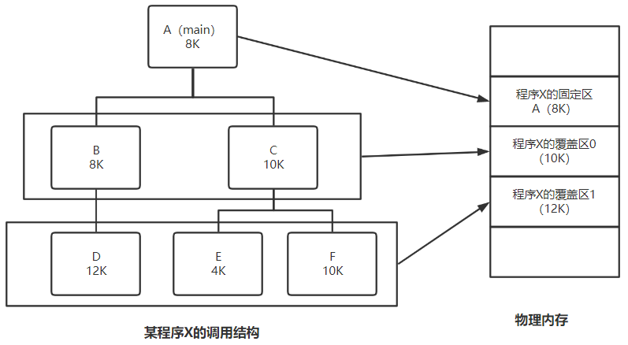

>   为更好的支持多到程序执行，提高系统的资源利用率，需要对内存进行管理
>
>   对内存的访问以块为单位，对内存的分配由采用的分配方式决定
>
>   编址空间位数取决于硬件访存能力，地址总线宽度

<!--more-->

# 3. 内存管理

>   操作系统对内存的划分和分配

## 3.1 基本概念

### 3.1.1 存储器的层次化结构

#### a. 主要思想

>   上一层是下一层的高速缓存，解决速度、容量、成本的矛盾

速度越慢的设备，CPU访问频率越低

在辅存中的数据只有调入主存才可被CPU访问

#### b. 三级存储系统

上一层存的是下一层数据的副本

##### Cache-主存

-   **解决CPU和主存速度不匹配问题**
-   **全部由硬件自动完成**
-   速度接近Cache，容量和价位仅仅主存
-   对任何程序员透明

##### 主存-辅存

-   **解决存储系统容量问题**
-   **将主存与辅存的一部分通过软/硬结合的技术形成虚拟存储器**
-   速度接近主存，容量和价位仅仅辅存
-   对应用程序员透明

### 3.1.2 内存管理功能

1.  逻辑地址到物理地址的转换

2.  内存的分配与回收

    -   连续分配管理方式

        单一连续分配

        固定分区分配

        动态分区分配

    -   非连续分配管理方式

        基本分页存储管理

        基本分段存储管理

        段页管理方式

3.  内存的扩容

    -   覆盖技术

    -   虚拟内存

        请求分页存储管理

4.  存储保护

### 3.1.3 一段代码载入内存的过程

#### 1. 预处理阶段

主要完成 `#` 后的各项内容到源文件的替换

-   `#ifdef` 完成条件编译内容的替换
-   `#include` ，将头文件内容拷贝到源文件
-   `#define` ，替换宏定义

完成后产生 `file1.i` 类型的文件

#### 2. 编译阶段

编译：完成语法和语义分析，然后生成中间代码 `file.s` 类型的汇编代码文件

汇编：通过汇编器，将汇编代码翻译成机器指令，生成 `file.o` 类型的二进制文件

#### 3. 链接阶段

>   将文件中调用的各种函数跟静态库和动态库连接，一起打包并形成可执行文件

##### 静态连接

>   **程序运行之前**，将各 `.o`文件 及其所需的库函数链接成一个完整的装入模块

##### 装入时动态链接

>   边装入内存边链接

##### 运行时动态链接

>   需要的 `.o` 模块才进行链接

便于修改和更新，实现`.o`模块的共享

动态链接与程序逻辑结构有关，**段式内存分配**

#### 4. 装入

##### 绝对装入

目标模块中的地址是内存的物理地址

逻辑地址与实际地址完全相同，适用于单道程序设计

##### 可重定位装入(静态重定位)

>   多个程序生成的多个目标模块，每个模块的地址单元从 `#0` 开始

静态重定位：地址变换在装入时一次完成

-   重定位：逻辑地址变为物理地址

特点

-   一次装入：**必须分配连续的内存空间**
-   **装入后不可移动**

##### 动态运行时装入(动态重定位)

>   地址转换在真正运行时才确定

由于存在装入后换出，所以目标模块的物理地址也会相应改变

特点

-   需要硬件支持（重定位寄存器）

    存放进程在内存中的起始地址

    整个系统只有一个重定位寄存器，处理器同一时刻只能执行一条指令

-   属于同一作业的目标模块可能分配到不连续的存储空间

-   只装入整个程序的部分代码即可运行，运行期间，根据需要动态申请内存

-   便于程序段的共享，提供远大于物理内存空间的逻辑地址空间

##### 装入方式对应的内存分配方式

### 3.1.4 交换技术提高程序道数

交换技术：指中级调度

#### a. 调度时机

多进程运行且内存不够时，发生中级调度

-   指标：缺页率过大

当系统符合低时，停止调度

#### b. 换入换出的对象

>   换出：将处于 **阻塞状态** 或 **在CPU调度中失去运行权利** 的程序从内存移到外存

-   处于IO状态的进程不能换出，否则会造成IO区的数据被新换入的进程占用，导致错误

>   换入：将准备好竞争CPU运行的 **挂起态** 进程从辅存移动到内存

#### c. 基本要求

-   交换需要备份，**PCB常驻内存**

-   确保每个进程执行时间比交换时间长

#### d. 空间支持

文件系统划分为文件区和对换区

- 文件区：追求存储密度，采用离散分配方式

-   对换区：追求交换速度，采用连续分配方式

## 3.2 地址转换

地址：用于标记某一存储单元，如按字节编址，则地址标记的是某一字节

>   将逻辑地址转换为物理地址

系统编程人员才知道内存管理的具体机制

应用程序员只知道逻辑地址

### 3.2.1 物理地址

>   内存中物理单元的集合

运行时， 指令执行和数据访问 都要通过物理地址从主存存取

### 3.2.2 逻辑地址

>   不同进程有独立的逻辑地址空间，映射到不同的内存物理地址

## 3.3 存储保护

>   保证各道作业在分配给各自的存储空间内运行，互不干扰
>
>   -   保护操作系统进程不受用户进程影响
>   -   保护用户进程不收其他用户进程影响

### 硬件支持

#### 界地址寄存器

存的内容是当前进程的逻辑地址范围

主要运算是 **比较** ，判断是否越界

#### 重定位寄存器(基址寄存器)

存的内容是最小物理地址值

主要运算是 **加** ，通过与界地址寄存器相加得到物理地址

## 3.4 内存分配与回收

内部碎片与外部碎片：

-   分配了但没用完，就是内部碎片；
-   外部碎片，所有分区外没分配的内存空间

只要存在 *固定* ，则一定会存在内部碎片，而 *动态* 的分配方式，会产生外部碎片

段页式——固定与动态同时存在，按固定处理

### 3.4.1 连续内存分配方式

>   连续内存分配，不需要记录映射表，相应的系统代价小

#### a. 单一连续分配

分为系统区与用户区

-   系统区：仅供操作系统使用，低地址部分

特点

-   无需内存保护：内存中永远只有一道程序

-   优点：

    简单，无需额外技术支持；

    **无外部碎片**；

    **可采用覆盖技术解决空间不足，交换技术提高作业道数**

-   缺点：只能用于单用户单任务操作系统；**有内部碎片**；存储器利用率低

##### 硬件支持

-   界地址寄存器、越界检查机构

#### b. 固定分区分配

>   将内存划分为若干大小固定的分区，每个分区只能装入一道程序

当分区大小相等时，适合一台计算机控制多个相同对象

##### 相关数据结构

分区说明表：用于实现各个分区的分配与回收

每个表项对应一个分区，通常按分区大小排列。

每个表项包括 对应分区的大小、起始地址、状态（是否已分配）

当有一个程序请求装入时，查分区说明表，如果有大小合适的分区，则修改状态

##### 特点

-   优点：**无外部碎片**
-   缺点：存在**内部碎片**；规定了分区大小，大程序无法装入，只能采用覆盖技术；

##### 硬件支持

-   界地址寄存器、越界检查机构
-   重定位寄存器
-   长度寄存器
-   动态地址转换机构

#### c. 动态(可变)分区分配

>   根据待装入进程实际大小建立分区

##### 相关数据结构

-   空闲分区表
-   空闲分区链

##### 特点

**存在外部碎片** ，无内部碎片

解决方案：紧凑

-   在重定位寄存器的支持下，OS不断进行进程的移动和整理

##### 分区分配(分区选择算法)

首次适应算法

>   将空闲分区按地址递增连接，分配内存时尽可能使用低地址部分的空闲分区
>
>   高地址留下大的空闲分区

优点：

-   综合性能最好
-   算法开销小，回收分区后不需要对空闲分区队列重新排序

缺点：低地址出现了较多的小空闲分区，增加查找开销

---

循环首次适应算法(邻近适应)

>   将空闲分区按地址递增连接，从上次查找结束的位置继续

优点：不用每次从低地址的小分区开始检索

缺点：不利于大进程，导致在高地址的大分区也被用完，分裂为小碎片

---

最佳适应算法

>   将空闲分区按容量递增连接

缺点：

-   产生较多外部碎片：会产生太小的，难以利用的碎片
-   算法开销大：回收分区后可能需要对空闲分区队列重新排序

---

最坏适应(最大适应)

>   将空闲分区按容量递减连接

缺点：

-   大内存块缺失，不利于大进程
-   算法开销大

---

**性能**：
$$
首次适应\ge 最佳适应 > 最大适应
$$

##### 分区的回收

相邻空闲空间合并

使用拼接技术合并空闲区

### 3.4.2 动态内存分配

>   需要额外的空间存储索引，数据存储密度低于连续存储

#### A. 基本分页存储管理

##### a. 概念

存储空间的单位：主存和进程划分为大小相等的块，作为主存的基本单位

-   以块为单位逐个申请主存中的块
-   进程按与主存大小相同的块划分，运行按块申请空间

页与页框

>   进程中的块称为页
>
>   内存中的块称为页框

-   页框号=页号=物理页号=物理块号

###### 页面大小

页面大小应为2的整数次幂，便于硬件处理

页面大小划分应适中

-   过小：

    页表过长，占用大量内存，不能充分利用访存的空间局部性提高命中率

    增加地址转换的开销，降低页面换入/换出的效率

-   过小

    平均页内碎片较大，降低内存利用率

    页面太大会使页面调入/调入时间较长

##### b. 特点

不会产生外部碎片

只有最后一个不完整的块申请内存时才会产生页内碎片

每个进程平均产生半个页的页内碎片

块相对于分区小很多

##### c. 支持机构

###### 页表

页表存放于内存中，本进程的PCB中

页表项连续存放，下标号对应的是逻辑空间的页号

页表项：页号与内存块号的映射

页表项大小的确定

-   一个页面刚好存储整数个页表项
-   页表项顺序连续存放在内存

页面大小：页面占用的存储空间 $=2^{页内地址位数}$

页表长度：页数 $=页号范围=2^{页号位数}$

页表项长度：一个页表项占用的存储空间 $=页号位数$

###### 寄存器支持

页表始地址存放于**页表基址寄存器中**：**页表功能**由一组专门的存储器实现，**较快的完成地址转换**

页表寄存器：**系统中只设置一个页表寄存器**，进程执行时，将页表始地址和页表长度放入页表寄存器

##### d. 逻辑地址结构

逻辑地址从 `#0` 开始

页号：逻辑页号

页内偏移地址：距离该页始地址的偏移量。由于动态内存分配中，逻辑页面大小=内存块大小，所以页内偏移量与内存块的块内偏移量相等

##### e. 分页管理的基本地址变换机构

两次访存

1.  访问页表
2.  根据物理地址访问数据或指令

##### f. 具有快表的地址变换机构

快表中存放的是页表的一部分副本

若快表未命中，则通过访问页表获取该逻辑地址对应的页表项后，要将副本存入快表

查询快表的速度比查询页表的速度快很多，由于局部性原理，快表的命中率达90%以上。

如：如访问一次快表耗时 $1\mu s$，访问一次内存耗时 $100\mu s$，快表命中率90%

-   未采用快表机制，访问一个逻辑地址需要 $100+100\mu s=200\mu s$
-   采用快表机制，访问一个逻辑地址 $(1+100)\times 0.9+(1+100+100)\times 0.1 = 111\mu s$
-   若支持快慢表同时查找，访问一个逻辑地址 $(1+100)\times 0.9 + (100+100)\times 0.1=110.9 \mu s$

##### g. 多级页表映射机构

###### 页表的问题与方案

问题：页表连续顺序存储，占用空间大。若一次性调入内存，则对页表的访问显然不满足局部性原理

解决：对页表建立索引表——多级页表

-   索引表指示某块页表的始地址，不用把所有页表都调入内存，只将有需要的部分调入

新问题：几级索引表就会增加几次访存

###### 地址结构

>   **各级页表大小不能超过一个页面**

如：按字节编制，40位逻辑地址，页面大小4KB，页表项大小4B，采用页式存储，需要几级页表，页面偏移量占几位？

$2^{页面偏移量位数}=页面大小\Rightarrow 页面偏移量位数=12位$

页号位数=40-12=28位

$总页面数=总页表项数=2^{页号位数}=2^{28}$

$一个页面可存放页表项个数=\frac{页面大小}{页表项大小}=\frac{2^{12}}{2^2}=2^{10}$

故需要3级页表

顶级页表最多占一个页面

###### 地址变换

1.  按照地址结构将逻辑地址拆分成三部分
2.  从PCB中读出页目录表始地址，再根据一级页号查页目录表，找到下一级页表在内存中的位置
3.  根据二级页表号查表，找到最终想访问的内存块号
4.  结合页内偏移量得到物理地址

#### B. 基本分段存储管理

引入目的

-   方便编程
-   分段保护和共享
-   动态增长和链接

##### a. 基本概念

>   分段：按用户进程中的自然段划分逻辑空间

-   **每段的地址空间从 `#0` 开始**，分配一段连续空间

-   段内地址连续，段间离散

##### b. 分页与分段的对比

##### c. 段表

>   逻辑空间与物理空间的映射表

段表项：`{段号|段长|本段在内存中的始地址}`

##### d. 逻辑地址的划分

段内地址：长度不定，可以知道每段的最大长度

段号：通过段号可以知道最多允许有多少个分段

##### e. 地址映射

物理地址的计算：

由于每段逻辑地址都是从#0开始，所以段基址向后偏移段内地址，就是物理存储单元

而页式中，每增加一个页号，地址空间会跳过一个页面空间的大小，所以物理页号需要乘页面大小

如：

##### f. 段的共享

>   多个作业段指向共享段的同一块物理空间实现
>
>   -   共享同一块存储空间，或通过动态链接方式 将所需的程序段映射到相关进程中

-   当一个作业正在从共享段读取时，必须防止另一个作业对共享段的修改

-   只有确保当前共享段没有任何进程使用时，才可释放本段
-   通过段的共享，可以减少程序段的调入/调出

###### 数据结构

设置共享段表，所有可共享的分段都由共享段表统一管理

-   共享进程计数器：当前共享段被几个进程共享
-   同一共享段在不同的进程中有不同的段号
-   同一共享段只有一个表项

###### 分配

对于第一个请求该共享段的进程，系统为该共享段分配一块内存区，将该共享段调入

同时将该块的始地址填入请求进程的段表

在共享段表中对相应该表项填写相关信息，并将count置1

###### 回收

释放该共享段占用的内存，将count减1

-   若count表项变为0，则需要系统回收共享段的物理内存及相关表项

##### g. 保护

###### 存取控制保护

###### 地址越界保护

段寄存器中段表长度>逻辑地址**段号**，发生越界中断

段表项中的段长> 逻辑地址中的**段内偏移**，发生越界中断

#### C. 段页管理方式

>   先分段再分页，所以回显访问段表，在访问页表

-   调入调出以页为基本传送单位

-   段长必须是页长的整数倍，段起点必须是某页起点

##### 分段分页优缺点

|            | 优点                                                         | 缺点                                                         |
| ---------- | ------------------------------------------------------------ | ------------------------------------------------------------ |
| 分页管理   | 内存空间利用率高，**不会产生外部碎片，有少量的内部碎片**     | 不方便按照逻辑对模块实现信息的共享和保护                     |
| 分段管理   | 段分界与程序的自然分界对应，具有逻辑独立性 便于多道程序共享和保护 | 如果段长过大，为其分配很大的连续空间会很不方便。 另外，**段式管理会产生外部碎片** |
| 段页式管理 | 兼具页式和段式内存管理的优点，可以实现共享和保护             | 地址映射至少需要两次查表才能访问数据存储单元                 |

##### 段页式地址结构

`{段号S|页号P|页内偏移量W}`

##### 支持机构

###### 段表和页表

一个进程只能有一个段表，可以有多个页表

段表项：`{段号|页表始地址|页表长度}`

页表项：`{页号|块号}`

###### 段表(页表)寄存器

>   指出段始地址+段表长度

-   在段表(页表)寻址时，作为重定位寄存器
-   判断是否越界，作为界寄存器

##### 地址映射机制

## 3.5 内存空间的扩充

>   利用虚拟化技术或者自动覆盖技术

### 3.5.1 覆盖技术

>   将用户空间划分成一个固定区和若干覆盖区，将活跃部分放入固定区，其余部分按调用关系分段，依次顺序调用

更新只涉及覆盖区，固定去会常驻内存

特点

-   允许部分装入即可运行

缺点

-   同时运行量大于主存容量时，不能运行

### 3.5.2 虚存

#### A. 基本概念

##### a. 传统存储管理方式的缺点

一次性：一个程序相关的进程必须全部装入内存才能运行

-   导致大作业无法装入内存
-   只有少数作业先运行，导致多道程序度下降

驻留性：作业装入内存，直至运行结束才会被换出

##### b. 虚存的概念&引入目的

>   程序不用全部装入即可运行，运行时动态调入数据，内存不够用时，换出数据

##### c. 虚存的特点

-   多次性：一个作业程序分多次调入内存
-   对换性：作业无需常驻内存，允许运行过程中，将作业换入，换出
-   虚拟性：从逻辑上扩充内存容量，使用户可使用容量大于实际容量

##### e. 原理

###### 程序文本->装入内存

>   在物理层面，应用程序员提交的程序和数据在操作系统管理下，先送入磁盘。当需要该作业时，由操作系统将当前运行所需部分调入主存

###### 局部性原理

>   时间局部性原理：由于程序中循环结构的存在，某条指令被执行后，一段时间又会被执行；某条数据被访问后，一段时间后又被访问

故采用高速缓存层次结构，将最近使用的指令和数据副本保存在高速缓存器(Cache)中

>   空间局部性原理：指令大部分按顺序存放、顺序执行，所以程序在一段时间内访问的地址集中在一定范围内

故采用较大的高速缓存，将预取机制集成到高速缓存的控制逻辑中

>   局部性原理的应用：快表；虚存

##### f. 虚存的功能

-   请求调页/段功能：当要访问的数据不在内存中，操作系统将需要部分所在页/段调入内存
-   页面置换功能：操作系统将暂时不用的内容换出到外存

##### g. 内存管理方式

>   建立在非连续内存分配方式上

##### h. 虚存的硬件支持

-   一定量的内存和外存
-   地址变换机构
-   页表机制
-   中断机构，产生缺页中断

##### i. 虚存的技术支持

###### 调入调出

交换与调入&调出都是在内存与外存间的信息交换

但交换

-   目的是为了提高多道程序度，
-   交换的是进程，
-   受内存物理容量的限制

调入调出的

-   目的是扩充内存空间，
-   调入调出的是页面或分段，
-   进程的地址映射不受内存的物理容量限制

###### 覆盖技术

>   覆盖程序段最大长度受内存容量限制

虚存最大长度不受内存物理容量限制，只受计算机地址结构限制（地址总线个数）

##### j. 虚存与Cache的异同

相同处

-   有容量、速度、价格梯度，提高系统性能
-   把数据分为小信息块，作为基本传递单位
-   都有地址映射，替换算法，更新策略
-   都依据局部性原理，将活跃数据存放在相对高速的部件中

#### B. 请求分页内存管理

##### a. 基本概念

###### 页面

>   一个程序(进程)在逻辑上被分为大小相等的 **页面**

分散的存放在主存的物理存储单元

###### 逻辑地址(虚地址)

>   `{逻辑页号|页内地址}`

-   逻辑页号：程序中的逻辑页号数
-   页内偏移：距离页面的始地址偏移量

>   每个程序的逻辑地址从 `#0` 开始

###### 物理地址(实地址)

>   `实页号|页内地址`

##### b. 存储空间

-   主存基本单位为块
-   进程基本单位为逻辑页

##### c. 进程需要的最小物理块数

由执行一条指令所涉及的页面数确定

##### d. 支持机构

###### 数据与程序的存放需要内存外存支持

###### 虚地址位数

>   虚存大小<内存容量+外存容量，虚存的容量变现为虚存地址位数

###### 页表

>   存储逻辑页号与主存块号的映射关系

在一个作业获得作业调度后，有了运行可能，则其页表始地址会存在根进程的PCB中，在该进程调度过程中，会将此页表始地址放入页表基址寄存器

页表项：`页号{内存块号|状态位|访问字段|修改位|外存地址}`

-   状态位：是否已调入内存
-   访问字段：可记录最近被访问过几次，或记录上次访问的时间，供置换算法选择页面换出
-   修改位：页面调入内存后是否修改过
-   外存地址：页面在外存的存放位置

###### 地址变换机构

>   映射：将逻辑地址变为物理地址

---

>   快表(TLB)：块表中存放页表项的副本
>
>   Cache中存储的是主存块的数据副本：加快对数据的访问

减少页表访问带来的访存次数，加快地址变换

-   快表存放于Cache中(SRAM)，页表存放于主存中(DRAM)
-   快表相联存储器，可以按地址访问

---

###### 缺页中断机构

一条指令的执行过程可能发生多次缺页中断

-   上限：页面访问序列长度
-   下限：页数（页面访问序列去重）

---

缺页中断属于 **内部中断**

-   内部中断(CPU内)

    **故障**：错误条件引起，可被修复

    陷入：主动放弃CPU，系统调用

    终止：不可回复，终止处理程序

-   外部中断(CPU外)

    I/O中断请求

    人工干预

---

中断过程

-   进程访问的页不再内存中，产生缺页中断

-   将缺页进程阻塞

-   操作系统缺页中断处理程度将所缺页调入内存

    若内存中没有空闲块，用置换算法换出某页

    若换出页被修改过，将其写回外存

-   恢复现场，将PC指向引起中断的指令，重新执行

-   从TLB中获取的物理地址访存相应页面，获取数据信息或指令

时间计算：一次TLB访问时间+一次内存访问时间+中断处理时间+调入后TLB访问时间+访存取数据或指令

##### e. 带TLB的访存过程

当页表项标记的某一页换出，则TLB中相应项也要删除

##### f. 页面分配

###### 驻留集

>   请求分页存储管理中给进程分配的物理块的集合

-   在采用了 **虚拟存储技术** 的系统中，驻留集大小一般 **小于** 进程的总大小
-   若驻留集太小，会导致缺页频繁，系统花费大量时间处理缺页，造成进程执行时间减少
-   若主流级太大，会使多道程序并发度下降，资源利用率降低，所以要选择合适的驻留集大小

###### 分配方式与置换方式

固定分配（驻留集大小不变）：操作系统为每个进程分配一组固定数目的物理块，在进程运行期间不再改变

可变分配（驻留集大小可变）：先为每个进程分配一定数目的物理块，在进程运行期间，可根据情况做适当的增加或减少

---

局部置换：发生缺页时，在自己的驻留集中选择进程置换

-   局部置换一定是固定分配，单个进程的驻留集不会发生改变

全局置换：将操作系统保留的空闲物理块分配给缺页的进程；也可将别的进程持有的物理块置换到外存，在分配给缺页进程

-   全局置换可以是可变分配也可以是固定分配

---

固定分配局部置换

>   单个进程物理块不变，从本进程的驻留集置换

缺点：

难以确定应为每个进程分配的物理块数

-   少则缺页频繁
-   多则降低多道程序度，系统资源利用率低

---

可变分配全局置换

>   先为每个进程分配一定数量的物理块，操作系统保持一个空闲物理块队列。
>
>   当某进程发生缺页时，从空闲物理块中分配一块给该进程
>
>   若无空闲物理块，则选择一个未锁定的页面换出到外存

-   换出的页面可能是任何进程，造成缺页率的增加

---

可变分配局部置换

>   刚开始为每个进程分配一定数量的物理块。当进程发生缺页时，只允许从该进程的驻留集中选择一个物理块

-   如果进程在运行中频繁地缺页，系统会为该进程多分配几个物理块，直至该进程缺页率适当
-   如果进程缺页率极地，则适当减少为该进程分配的物理块

##### g. 页面置换算法

分为局部置换（本进程中的页）和全局置换（系统中的页）
$$
缺页中断次数 \neq 页面置换次数
$$

###### 最佳置换算法(OPT)

>   将来最长时间不会用
>
>   由于无法预判进程的访问序列，仅具有理论意义

###### 先进先出算法(FIFO)

>   选择调入主存最长时间的页面——队列类算法

若增加页框数，缺页中断次数不一定增加，可能会减少

可能会产生Belady异常：所分配的物理块数增大而故障不减反增

###### 最近最久未使用算法(LRU)

>   每次淘汰的页面是最近最久未访问的页面——堆栈类算法

实现方法：页表中增加 `访问位` ，记录该页面距离上次访问经历的时间，每当要淘汰一个页面，选择该字段最大的页面

一个页表项：`{页号|内存块号|状态位|访问位|修改位|外存地址}`

特点：

-   算法性能好

-   需要寄存器和栈等硬件支持
-   需要硬件支持原因：需要对所有的页排序
-   当进程的访问序列没有重复时，变为FIFO算法

###### 时钟置换算法(Clock、NRU)

>   将页面设置成循环队列

一个页表项：`{页号|内存块号|状态位|访问位|修改位|外存地址}`

做法：

-   页表中增加 `访问位` ，若某个页面被访问。置1 `访问位=1`

-   当需要淘汰某个页面时，循环扫描各页面

    第一轮淘汰 `访问位=0` 的，并将扫描过的页面内 `访问位=0` 

    若第一轮没选中页面，则进行第二轮扫描

特点

-   实现简单
-   算法开销小，未考虑页面是否被修改

###### 改进Clock

>   在简单Clock基础上，优先淘汰未被修改的页面
>
>   -   未被修改的页面不需要写回外存，减少IO次数

访问标记

|           | 修改位m=0                   | 修改位m=1                   |
| --------- | --------------------------- | --------------------------- |
| 访问位u=0 | (0,0)最近未被访问，未被修改 | (0,1)最近没有访问，但修改过 |
| 访问位u=1 | (1,0)最近被访问过，但未修改 | (1,1)最近访问过，且修改过   |

过程

将所有可能被置换的页面排成一个循环队列

1.  第一轮：从当前位置开始扫描到第一个 (0,0) 的页面用于置换。——未访问，未修改

2.  第二轮：第一轮扫描失败，则查找第一个 (0,1) 的页面置换。——未访问，被修改

    本轮将所有扫描过的页面访问位置0

3.  第三轮：查找第一个(0,0) 的页面用于置换。——被访问，未修改

4.  第四轮：查找第一个(0,0)的页面用于置换——被访问，被修改

##### h. 调页策略

###### 调页时机

预调页策略：根据空间局部性原理，一次调入若干相邻页面比调入一个页面更高效

-   但如果调入的页面大多没有被访问，则很低效
-   主要**用于进程的首次调入**（运行前调入），由程序员指定调入部分

---

请求调页策略：进程在运行期间发现缺页，将所缺页面调入（运行时调入）

-   每次只能调入一页，而每次调页都需要磁盘的IO操作，造成较大的系统开销

##### i. 调查出页放哪

###### 系统有足够对换区

>   页面调入调出在对换区进行

OS将相关文件复制到对换区

###### 系统缺少对换区

>   不会被修改的文件直接从文件区调入，不接收换出
>
>   可能被修改的，换出到对换区，从对换区换入

###### UNIX换页区间

第一次调入的页面都从外存调入

曾经运行过但未被换出的页面，存放于对换区

##### j. 性能分析

###### 有效访问时间

>   访问页面所需的平均时间

1.  若访问页面在快表中，则只需访存一次——取数据

2.  若产生产生缺页中断

    快表命中率为p，内存读写周期为m，缺页率为f，缺页中断处理时间为t，则有效访问时间为 
    $$
    EAT=p\times m + (1-p-f)\times 2m + f\times(2m+t+m)
    $$

缺页中断处理时间

-   页面传输时间
-   进程现场恢复时间
-   仅考虑页面传送时间

影响缺页率的因素

-   分配给进程的物理块
-   页面本身大小
-   程序编址方法
-   页面置换算法

###### 抖动现象

>   频繁的页面调入调出行为：刚刚换入的页面马上要换出内存。刚刚换出的页面马上换入内存

主要原因：进程分配到的物理块太少

---

驻留集与工作集

驻留集：请求分页存储管理中给进程分配的内存块的集合

-   驻留集不能小于工作集大小，否则会出现抖动现象

工作集：某段时间间隔里，进程实际访问的页面集合

-   工作集可能小于驻留集大小
-   OS统计进程的工作集大小，根据工作集，根据工作集大小给进程分配若干物理块

