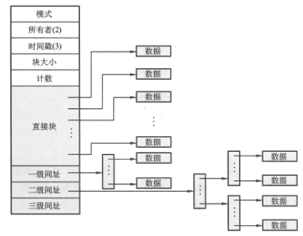
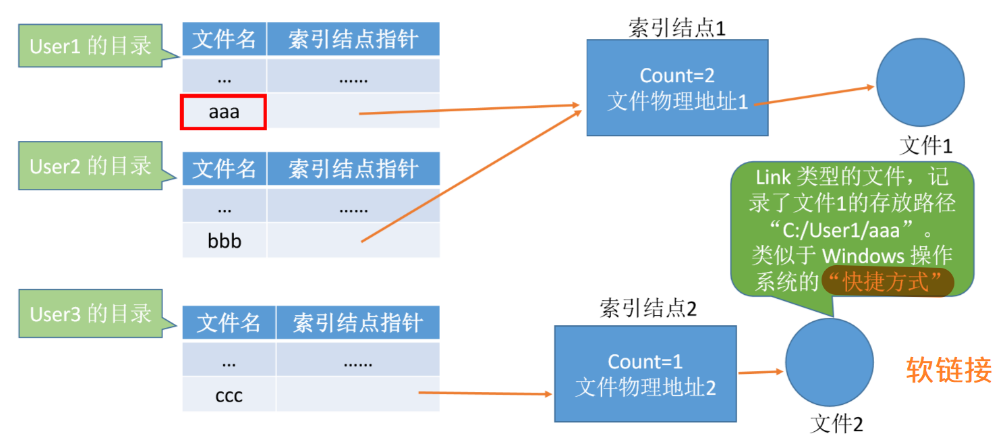

>   文件管理：研究计算机系统中，数据的组织方式
>

<!--more-->

# 4. 文件

>   以计算机硬盘为载体的存储在计算机上的信息集合

在用户进行**输入、输出**时，以文件为单位

-   在UNIX中，所有设备被看做特殊的文件

## 4.1 属性

-   文件名：同一目录下，文件名唯一

-   标识符：一个系统内，文件标识符唯一

-   类型：被不同类型的文件系统使用

-   位置

    文件的路径：用户使用

    外存地址：指向文件存放位置的指针，仅OS使用（用户不可见）

-   保护：对文件进行保护的访问控制信息

-   大小、时间、日期和用户标识

## 4.2 组成

数据项：文件系统中最低级的数据组织方式

-   基本数据项：描述一个对象某个属性的一个值
-   组合数据项：多个基本数据项组成

记录：一组相关的数据项集合

文件：一组相关信息的集合

-   记录式文件：由一组相似的记录组成

-   根据记录长度是否可变分为

    定长记录文件：不同记录的同一数据项有相同位置

    变长记录文件

## 4.3 文件的基本操作

 **读写前** 必须 **打开**，**读写后** 必须 **关闭**

### 4.3.1 创建

`create系统调用` ，参数为：

-   所需外存空间大小
-   文件名
-   文件存放路径

OS的工作

1.  在文件系统中为文件找物理空间——涉及文件存储空间管理
2.  在目录中为新文件创建对应的目录项——涉及目录结构

### 4.3.2 删除

`delete系统调用`，参数为：

-   文件存放路径
-   文件名

OS的工作

1.  在目录中找到文件对应的目录项
2.  根据目录项，回收文件占用的存储空间
3.  删除目录项

### 4.3.3 打开

`open系统调用` 参数：

-   文件存放路径
-   文件名
-   对文件的操作类型

OS工作

1.  根据文件路径找到文件名对应的目录项
2.  检查用户权限
3.  将目录项复制到内存中的 `打开文件表` 中，返回打开**文件表中的索引号**——文件描述符
4.  之后用户中再次访问该文件，无需查找目录

#### 打开文件表结构

##### 进程打开文件表

-   本进程所涉及的文件
-   `读写指针` ：记录该进程对文件的读/写操作进行的位置
-   `访问权限`：声明为 “只读” ，则该进程不能对文件进行写操作

##### 系统打开文件表

-   目前打开的所有文件信息
-   整个系统只有一张
-   `打开计数器`：记录当期系统，有多少个进程打开了此文件，若不为0，则无法删除

### 4.3.4 关闭

OS工作

1.  将打开文件表中的项删除
2.  回收分配给该文件的空间
3.  系统打开文件表中打开计数器减1

### 4.3.5 读

文件需要读入内存的原因：只有在内存中才能让CPU处理

`read系统调用` 参数：

-   文件描述符（打开文件表中的序号）

    一旦完成FCB在磁盘上的定位，系统将不再使用文件名

-   待读入的数据量

-   读入后数据存放在内存中的位置——`读指针`

### 4.3.6 写

`write系统调用` 参数

-   文件描述符：打开文件表中的序号
-   待写入的数据量
-   写回数据在内存中的存放位置

根据 `写指针` 与待写入的数据量，确定写入文件的内容

## 4.4 文件逻辑结构

>   文件内数据的组织方式，描述的是文件记录间的关系

### 4.4.1 无结构文件(流式文件)

>   以字节为单位，数据按顺序组织成记录
>
>   一个流式文件可视为一个字符流

-   有序相关信息项的集合
-   对记录的访问只能通过穷举搜索的方式
-   无明显逻辑结构

### 4.4.2 有结构文件

分为 **顺序文件** ，**索引文件** ，**索引顺序文件**

#### A. 顺序文件(线性表)

>   记录之间依次顺序排列

缺点：增加/删除记录困难

##### 若采用顺序存储结构

>   逻辑相邻，物理相邻

对于不定长记录：无法实现随机存取

对于变长记录：

-   设单个记录长度为L，则第i个记录存放的位置为 $i*L$

采用串结构：无法快速找到关键字对应的记录

-   按存入时间进行链接

采用顺序结构：可快速找到关键字对应的记录

-   按关键字顺序排序

##### 采用链式存储结构

>   逻辑相邻，物理存储位置不一定相邻

一定无法实现随机存取，只能从第一个记录依次向后查找

#### B. 索引文件

>   对可变长记录文件中的记录提取关键字，为每条记录创建定长的索引项，进而形成的定长记录的顺序文件

**一个文件以多个数据项为关键字建立不同的索引文件**

索引项：`{关键字|长度|指针}`

-   指针：指向记录的逻辑空间

适用于对信息处理的及时性要求高的场合

-   按关键字排序的索引文件，能提高信息的检索速度

#### C. 索引顺序文件

>   记录按某个标准分组，为每个分组建立索引项，记录该组的首地址

索引表：定长记录的串结构顺序文件

不需要按关键字排序，便于表项的插入和删除

索引项：`{该记录的关键字值|执行该记录的指针}`

多级索引顺序文件：当有 $a^n$ 个记录，每个索引表有 $a^{\frac{n}{t}}$ 个表项，需要建立t级索引

### 4.4.3 逻辑结构与物理结构

#### A. 用户用逻辑地址访问文件

从用户视角来看，整个文件是连续存放的

#### B. 物理结构(OS角度)

对于操作系统来说，一个文件就是磁盘块中存储的二进制数据，根据盘块的分配方式，组合这些二进制数据

## 4.5 文件的物理结构

>   一个文件在辅存上存放、链接、编目的方法

### 4.5.1 文件的分配方式

>   **一个文件**拥有的**磁盘块的组织方式**，相当于磁盘非空闲块的管理
>
>   **存放于FCB中**

#### 分配的基本单位

OS为文件分配空间以磁盘块为单位

-   磁盘块大小=内存块大小=页面大小

实际文件分配中，会将多个块并为一个簇，以簇为单位进行分配

#### A. 连续分配

>   一个文件在磁盘上占有一组连续的块

FCB中 `存放位置字段` ：起始物理块号+文件长度

优点：

-   支持顺序访问和直接访问：物理块号=起始地址+逻辑块号
-   顺序读写存取速度最快：读取多个磁盘块需要机械移动磁头，两个磁盘块相聚越远，移动代价越大

缺点：

-   不方便文件扩展：增加磁盘块需大量移动盘快
-   存在外部碎片，磁盘利用率低：紧凑的时间代价很大

#### B. 链式分配

##### a. 隐式链接

>   为一个文件分配的盘块，每个都有指向下一个盘块的指针（对用户透明）

FCB中 `存放位置字段` ：第一个盘块的指针+最后一个盘块的指针

地址映射

-   用户给出逻辑块号 `i`
-   OS找打相应的FCB
-   通过FCB的 `存放位置字段` 获取起始物理块指针，将前i-1块依次调入内存获得第i块的指针p，最后由指针p将第i块调入内存

优点

-   便于文件扩展
-   外存利用率高，不存在外部碎片

缺点

-   只支持顺序访问，不支持随机访问
-   链接指针占用空间，降低存储效率

##### b. 显示链接

>   FAT文件分配表：将链接文件的各物理块指针显式存放在一张表中
>
>   相当于静态链表

-   一个磁盘一张FAT
-   一个磁盘有多少个盘块就有多少个表项

地址映射

-   FAT在系统启动时调入并常驻内存
-   通过FAT表查找查找文件中第 i 个逻辑块对应的物理块
-   获得物理块的指针后，将第 i 块调入内存，而不需要将前 i-1 块都调入内存

优点

-   方便文件的扩展
-   外存利用率高，不存在外部碎片
-   支持随机访问
-   地址转换时，不需访问磁盘

缺点

-   文件分配表占用存储空间

#### C. 索引分配

数据块：存放数据

每个文件都有索引块：索引块中存的是文件名之外的信息，完成**文件目录的瘦身**

-   索引表(给本文件分配的磁盘块号一维数组)：逻辑块号与物理块号的映射

FCB中 `存放位置字段`：文件名+索引块号

##### 地址映射

1.  用户给出逻辑块号
2.  OS将相应的FCB调入内存
3.  根据FCB提供的索引块号，将索引块调入内存
4.  查索引表可知逻辑块号对应的物理块号——$O(1)$

##### 索引分配特点

优点：

-   支持顺序与随机访问
-   易于文件扩展

缺点

-   索引表占用存储空间
-   访问数据块需先读入索引块
-   采用链接方案，查找索引表需要多次磁盘I/O

##### 大文件分配

###### 链式索引

>   前一个索引表用一个索引项指向下一个索引表

FCB中 `存放位置字段` ：存放的是第一个索引块块号

由于只能顺序访问，所以效率低

###### 多层索引(类似多级页表)

**各级索引表的大小不能超过一个磁盘块**

FCB中 `存放位置字段` ：顶级索引块号

假设一个磁盘块大小为1KB，一个索引项占4B，则一个磁盘块最多存放256个索引项

若某文件使用两层索引，则文件的最大长度可以达到 $256*256*1KB=65536KB=64MB$

若访问1026号逻辑块，则 $1026/256=2,1026\%256=2$

-   因此，将一级索引表调入内存，查询4号表项，将其对应的二级索引表所在盘块调入内存
-   查询二级索引表的2号表项即可知道 1026 号逻辑块存放的磁盘块号了
-   将数据所在的磁盘块调入内存

即整个数据访问过程需要3次磁盘I/O

###### 混合索引

一个顶级索引表中，指向多种索引表

-   直接地址索引
-   一级间接索引
-   二级间接索引

根据各层索引结构计算文件的最大长度，各级索引表的大小，不能超过一个块的大小

索引方式磁盘I/O次数

-   顶级索引块是否调入内存
-   K层索引表，需要K+1次磁盘I/O

#### 磁盘I/O的次数计算

### 4.5.2 文件存储空间管理

>   **磁盘空闲块**管理，数据结构存放于**文件卷的目录区**

#### A. 文件存储器空间的划分

##### 文件&文件卷&物理盘

一个文件存储在一个文件卷中

一个文件卷与物理盘为多对多关系

##### 文件卷(逻辑卷)

**目录区**

-   用于存放文件管理的信息
-   存放：文件目录FCB、空闲表、位示图、超级块

**文件区**

-   存放文件的数据信息

##### 初始化

1.  划分目录区与文件区
2.  建立空闲空间管理表
3.  建立存放逻辑信息的超级块

#### B. 文件存储空间管理

##### FAT

FAT可也完成对空闲空间的管理

在为每个文件链接盘块时，也标记除了空闲盘块

##### 空闲表法(连续分配)

>   适用于为文件分配一块连续的存储空间
>
>   适用于**连续的盘块分配方式**

空闲表项：`{表项序号|该空闲区的第一个空闲块号|该区空闲盘块数}`

相应的盘块分配方法

-   首次适应：序号从小到大
-   最佳适应：空间从小到大
-   最坏适应：空间从大到小

盘块的回收：合并相邻空闲盘块表项

##### 空闲链表法

>   OS始终保持着链头和链尾指针
>
>   适用于 **离散的盘块分配方式**

###### 空闲盘块链

>   以盘块为单位组成一条空闲链

查找下一节点方式：每个盘块存放着下一空闲盘块的指针

盘块的分配方式：

-   从链头开始向后摘取
-   修改链头指针

盘块的回收

-   空闲盘块挂到链尾
-   修改链尾指针

###### 空闲盘区链

>   以盘区为单位组成一条空闲链，连续空闲盘块组成一个空闲盘区

查找下一节点方式：每个空闲盘区的第一个盘块记录下一盘区的指针以及本盘区的长度

盘块的分配

-   首次适应、最佳适应等算法，从链头找大小符合要求的空闲盘区分配给文件
-   若文件太大，则将多个盘区同时分配给同一文件
-   修改相应的链指针，盘区大小

盘块回收

-   若回收的的盘区与链中的盘区相邻，则合并为大的盘区
-   若回收的盘区孤立，则将回收的盘区挂在队尾

##### 位示图法

>   每个二进制位对应一个盘块，用一个字长的01串表示每个盘块的空闲情况
>
>   适用于 **离散与连续的盘块分配方式**

字号位号与盘块号的转换
$$
\begin{aligned}
&设盘块号为b，字号为i，位号为j，字长为n\\
&b\rightarrow \{i,j\}:i=\frac{b}{n}\quad j=b\%n\\
&{i,j}\rightarrow:b=n*i+j
\end{aligned}
$$
盘块的分配

-   顺序扫描位示图，找到K个相邻或不相邻的 "0"
-   计算对应的盘块号，将对应的盘块分配给一个文件
-   将位示图中已分配的盘块置 "1"

盘块的回收

-   由盘块号获得字号和位号
-   将回收的盘块置 "0"

##### 成组链接法

>   适合于大型文件系统

每组的第一个盘块记录顺序的n个空闲盘块数，为超级块。第二个盘块记录下一组的第一个盘块号

**每个分组的最大空闲块数固定**

如果是最后一个组，则将下一组的盘块号设置为特殊值

###### 空闲块的分配

-   假设请求1个空闲块

    

    摘下一个盘块，并修改可用盘块数量

-   请求100个盘块

    

    1.  检查第一个分组的块数是否足够 100=100
    2.  但第一个分组的第二个空闲块指向下一组的第一个空闲块（其中存放了下一分组的信息），所以需要将其中的信息复制到超级块的第一个空闲盘块，再进行分配

###### 空闲块的回收

第一个分组未满，回收后未达到一个分组的最大块数

1.  将回收的块链接到第一个分组
2.  修改超级块中的信息

---

假设一个分组最多100个空闲块，此时第一个分组已满，若有一个新块需要回收

1.  将超级块的信息复制到新回收的块
2.  让新回收的块成为分组的第一个分组

# 4. 文件管理

## 4.1 文件系统概述

### 4.1.1 功能

#### A. 用户角度

-   实现对文件的基本操作
-   实现对文件的按名访问
-   具有基本文件保护和共享

#### B. OS角度

-   完成与磁盘的信息交互
-   完成文件逻辑结构到物理结构的转换
-   组织文件在磁盘上的存放

### 4.1.1 文件系统组成

-   文件
-   与文件管理相关的软件
-   实时文件管理所需的数据结构

### 4.1.2 文件系统运行过程

OS启动时，会将根目录导入内存，并常驻内存

#### A. 访问目录文件

实质上是访问目录项(FCB)，若目录调入内存，需要一次磁盘I/O操作

#### B. 访问普通文件

1.  用户调用 `系统调用` ，提供参数

2.  根据文件路径查找对应的目录项

3.  检查用户权限，将FCB复制到系统的打开文件表

4.  根据FCB的地址，获得文件的第一个外存块

5.  根据 文件记录的组织方式，获取目标的逻辑地址（相对于文件起始位置的偏移量）

    -   顺序文件：定长记录文件可随机访问任一记录，并获取其在逻辑空间的地址
    -   索引文件：根据关键字可查得逻辑地址

6.  根据逻辑地址与磁盘块的大小，计算目标记录该文件占有的磁盘块

    OS对各类型文件的磁盘块分配方式不同

    

7.  得到物理块号后，由 **磁盘驱动程序** 转化为 `{柱面号|盘面号|扇区号}`，将二进制数据返回给内存

### 4.1.3 文件系统层次结构

#### A. 用户接口

>   向用户提供文件与目录相关的调用

-   文件的基本操作

#### B. 文件目录系统

>   管理文件目录
>
>   -   根据用户给出的文件路径找到相应的FCB或索引结点
>   -   将(文件表目录项)FCB读入内存，只知道文件的描述信息，所有和目录、目录项相关的管理工作都在本层完成

#### C. 存取控制验证模块

>   实现文件的保护：把用户的访问请求与FCB中指示的访问控制权限对比，验证合法性

#### D. 逻辑文件系统和文件缓冲区

逻辑文件系统：根据文件的逻辑结构将用户要访问的文件记录号转换成文件逻辑结构的逻辑块号

文件缓冲区：索引表调入内存后，存放的位置

#### E. 物理文件系统

>   逻辑块号转换成相应的物理块号

#### F. 辅助分配模块

>   负责文件存储空间的管理，负责分配和回收存储空间

先检测是否用相关需求才决定启动与否

#### G. 设备管理模块

>   直接与设备交互

## 4.2 目录结构

>   目录本身是一种有结构文件，每条记录对应于存放于该目录下的文件

-   目录结构保存在外存，需要时才被调入内存

### 4.2.1 文件控制块

>   存放文件控制需要的各种信息的数据结构

**FCB的有序集合为文件目录，一个FCB为文件目录项**

`文件描述信息(FCB)` 以目录项的形式保存在目录结构 `{文件名|存取权限|存放位置}`

-   基本信息：`{文件名|文件物理位置|文件逻辑结构|文件物理结构}`
-   存取控制信息：`文件存取权限`
-   使用信息

由FCB的表项实现文件名和文件物理位置间的映射

### 4.2.2 目录的基本操作

-   按名搜索文件
-   创建目录项
-   删除目录项
-   显示目录
-   修改目录项

### 4.2.3 目录实现

#### 线性列表

目录项 `{文件名|数据块指针}`

创建文件时，必须确保没有同名文件存在

#### 哈希表

>   根据文件名得到一个值，返回一个指向线性列表中元素的指针

优点

-   查找迅速
-   插入、删除简单

缺点

-   需要预备措施避免冲突
-   哈希表长度固定
-   哈希函数对表长依赖

### 4.2.4 目录查询

>   在磁盘上的搜索，需要不断地I/O操作

线性列表

-   查找时，依次与线性表的每个表项比较
-   可按文件名构成有序序列，折半查找减少时间开销

哈希表

-   迅速
-   但要避免冲突

### 4.2.5 多级目录结构

#### 单级目录结构

>   系统表中只有一张目录表，每个文件对应一个目录项

解决：按名存取

缺点

-   不适用于多用户OS
-   不允许文件重名，创建文件需要检查目录的所有表项，是否有重名

#### 两级目录结构

>   主文件目录：目录项记录用户名及相应用户文件目录的位置
>
>   用户文件目录：目录项记录用户名及相应用户文件目录的位置

解决：文件重名；可以增加访问限制，一定程度上保证文件安全

缺点

-   缺乏灵活性
-   不能对文件分类

#### 多级目录结构(树形)

>   文件路径：到目标文件的通路上，所有目录名与数据文件用 `/` 连接

解决：文件分类

缺点：不便于文件共享

#### 无环图目录结构

>   目录成为有向无环图：在树型目录结构基础上，增加指向同一结点的有向边

增加共享计数器：只有当前结点的共享计数器值为0才能删除

解决：文件共享

-   只存在一个真正的文件，任何改变都可被其他用户感知

### 4.2.6 UNIX采用的方式

#### 索引结点

原理：查找过程中，只需使用文件名，只有文件名匹配才需要获取文件的其他信息

找到文件名对应的目录项，将索引结点的调入内存，根据索引结点中的 `存放位置` 找到目标文件

-   通过减少单个目录项的空间，增加一个磁盘块中所含的目录项数量，进而减少磁盘I/O时间

#### 分配方式

索引分配

#### FCB

>   文件名+索引结点指针

索引结点指针

-   单个文件的最大可用空间=混合索引克可表示的地址空间\*磁盘块大小

直接地址：存放的是文件数据所在的盘块号；

-   适用于 `文件大小<直接地址空间*磁盘块大小`

多级索引：每增一级都是数量级上的提升

## 4.3 文件共享

### 4.3.1 概念

>   系统中只保存一份真实数据，一个用户修改，其他用户可以感知

区别于复制

-   对个文件副本
-   一个用户修改，其他用户不可感知

**共享的前提是有访问权限**

### 4.3.2 基于索引结点的共享(硬链接)

>   索引结点中设置一个 `链接计数器变量count` ，表示链接到本索引结点上的用户目录项数量

-   当用户删除该文件时，只是把用户目录中与该文件对应的目录项删除，且索引结点的count减1

-   当count=0时，才真正物理删除该文件

### 4.3.3 基于符号链的共享方式(软链接)

>   当访问共享文件时，操作系统判断为 `Link` 类型的文件，于是会根据其中记录的路径层层查找目录，最终找到文件目录表中的 `FCB` 

优点

-   网络共享文件时，只需提供文件所在机器的网络地址及在该机器中的文件路径

缺点

-   访问时，需多次磁盘 IO
-   符号链的索引结点要耗费一定的磁盘空间

### 4.3.4 文件保护

>   解决对文件的读、写、执行的许可问题

#### A. 口令保护

>   文件创建者提供口令，在FCB创建时，增加口令字段

优点

-   时间空间开销小

缺点

-   口令直接存储在系统内部，不安全

#### B. 密码保护

>   通过密钥对文件内容加密

优点

-   保密性强
-   节省存储空间，无需存储密钥

缺点：编码和译码要花费一定的时间

#### C. 访问控制

>   为每个文件(包括目录文件)增加一个访问控制列表ACL
>
>   -   规定每个用户名及其访问权限
>   -   必须按位规定

##### 精简的访问列表

拥有者：文件创建者

组

-   权限是赋予到组上的，要赋予某个文件权限，将其加入对应的组
-   系统需要管理分组信息

如果对某个目录进行访问控制，则这个目录下的所有文件都要有相同的访问控制权限

# 4. 磁盘管理

## 4.1 磁盘结构

### 4.1.1 基本概念

#### 磁盘

>   表面涂油磁性材质的金属或塑料圆盘构成的圆盘

#### 盘片

-   磁道：一个磁道划分为若干扇区

-   扇区：一个扇区称为一个盘块

    每个扇区存放的数据量相同

    最内侧磁道上扇区面积最小，数据密度最大

    磁盘存储能力受限于最内道的最大记录密度

-   磁头：所有石头固定在同一磁臂上

#### 柱面

>   多个盘面中，相对位置相同的磁道

### 4.1.2 从磁盘读写数据

1.  根据 `柱面号` 移动磁臂，让磁头指向指定柱面
2.  激活指定盘面对应的磁头
3.  磁盘转动，使目标删去在磁头下划过，完成对磁盘指定扇区的读/写

### 4.1.3 磁盘地址结构

`{柱面号|盘面号|扇区号}`

-   柱面号：选择磁道组
-   盘面号：选择盘面：定位到某一确定磁道
-   扇区号：定位到某一磁盘块

**为什么是柱面号在前**

切换柱面需要磁头的机械移动，而切换盘面，扇区不需要磁头的移动，因此将柱面放在高地址字段

### 4.1.4 磁盘分类

## 4.2 磁盘管理

### 4.2.1 磁盘初始化

#### 1. 低级格式化(物理格式化)

>   将磁盘的各个磁道划分为扇区

扇区：

-   头
-   尾
-   数据区域

管理扇区所需的数据结构：扇区校验码，扇区中数据是否发生错误

#### 2. 将磁盘分区

>   每个分区由若干柱面组成

#### 3. 逻辑格式化

>   创建文件系统
>
>   -   创建文件系统根目录
>   -   初始化存储空间管理

### 4.2.2 引导块

自举程序：计算机开机需要进行一系列初始化工作，这些初始化工作由 *自举程序* 完成

>   完整的自举程序存放在磁盘的启动块中，又称为引导块 、启动分区

-   拥有启动分区的磁盘称为 *启动磁盘或系统磁盘(C盘)*

#### Boot程序

>   自举装入程序

-   开机时，计算机先运行内存ROM区中的 *自举装入程序* ，通过执行该程序就可找到引导块
-   将引导块中的 *自举程序* 读入内存，完成初始化

### 4.2.3 坏块

>   坏块属于 *硬件故障* ，无法修复的。应该将坏块标记，以免错误地使用

**坏块对操作系统不透明**

-   对于**简单的磁盘**，可以在**逻辑格式化**时，对整个磁盘的坏块检查，表明哪些是坏块

-   对于复杂的磁盘，磁盘控制器(设备内部的硬件)会维护一个坏块链表，**在低级格式化(物理格式化)就将坏块链初始化**

#### 扇区备用

系统会保留一些备用扇区，用于替换坏块，这时坏块对操作系统透明

## 4.3 磁盘调度算法

### 4.3.1 磁盘I/O时间

**转速是磁盘的物理属性，无法优化**

#### A. 寻道时间

>   磁头移动到目标磁道的时间

-   根据柱面号选择柱面

$$
Ts=s+m\times n
$$

-   s：启动磁头臂时间
-   m：跨越一个磁道的时间
-   n：总共n个磁道

#### B. 延迟时间

>   旋转盘片，使磁头定位到目标扇区

-   根据扇区号将磁头移动到起始扇区

$$
设磁盘转速为r(转/s)，平均所需延迟时间T_R=\frac{1}{2}\times\frac{1}{r}
$$

-   $\frac{1}{r}$ 是转一圈需要的时间，找到目标扇区平均转半圈

##### 减少延迟时间的方案

优化前提：在实际中，读完一个扇区，磁头需处理一段时间，但磁头不断旋转

-   若逻辑上相邻的扇区在物理上也相邻，则可能需要很长的延迟时间

**盘面交替编号**

>   逻辑相邻的扇区在物理上有一定间隔，可以使读取连续逻辑扇区所需的延迟时间更小

**柱面错位命名**

#### C. 传输时间

$$
T_t=\frac{1}{r}\times\frac{b}{N}=\frac{b}{rN}
$$

-   每个磁道要可存N个字节,b字节的数据需要转 $\frac{b}{N}$ 圈，转一圈 $\frac{1}{r}$

### 4.3.2 调度算法

#### FCFS

-   优点：公平
-   缺点：请求访问磁道分散，寻道时间长

#### 最短寻找时间优先(SSTF)

>   优先处理此时与当前磁头最近的磁道

-   能保证每次寻道时间最短，但不能保证总体寻道时间最短

优点：性能较好；平均寻道时间段

缺点：可能产生 "饥饿" 现象

-   磁头可能在一个小区域内来回移动

#### 扫描算法(SCAN)电梯调度算法

>   只有磁头移动到最外侧的时候才能往内移动，移动到最内侧磁道的时候才能往外侧移动

$$
磁道移动道数=最外侧磁道号-当前磁道号+最外侧磁道号-访问的最小磁道号
$$

优点

-   平均寻道时间短
-   不会产生饥饿现象

缺点

-   只有达到最边上的磁道才能改变磁头移动方向

-   对于各个位置磁道的响应频率不平均

    刚处理了90号磁道，下次处理要很长时间；而响应了184号磁道，很快就能访问

##### 改进

>   LOOK调度算法

$$
磁道移动数=访问的最大磁道号-当前磁道号+最大磁道号-最小磁道号
$$

#### 循环扫描算法(C-SCAN)

>   当移动到最外侧磁道，快速返回到最内侧磁道过程不服务

$$
磁道移动数=最外侧磁道号-当前磁道号+最外侧-最内侧+终点磁道号-最内侧磁道号
$$

优点

-   各磁道的响应频率相等

缺点

-   只有到达最边上才能改变磁头移动方向

##### C-LOOK算法

>   如果磁头移动方向上没有访问请求了，就让磁头掉头

$$
磁道移动数=最大磁道号-当前磁道号+最大磁道号-最小磁道号+终点磁道号-最小磁道号
$$

