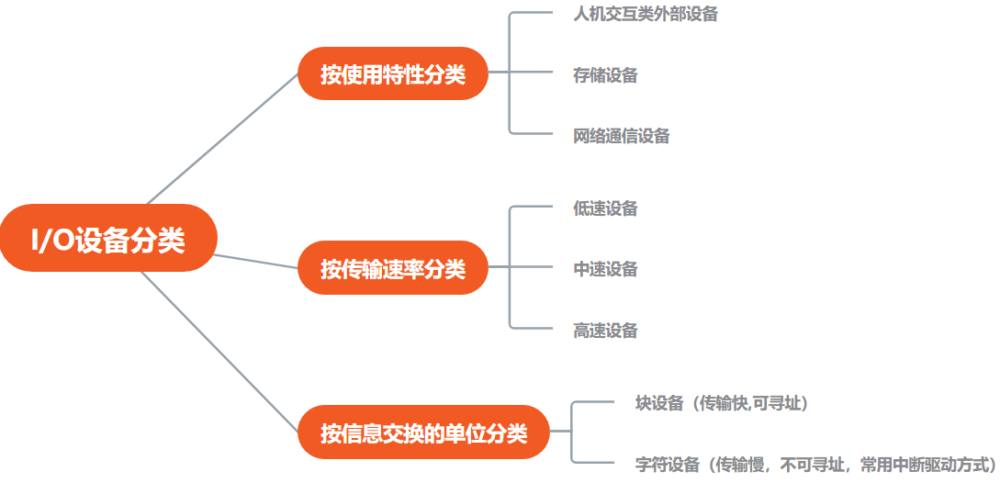
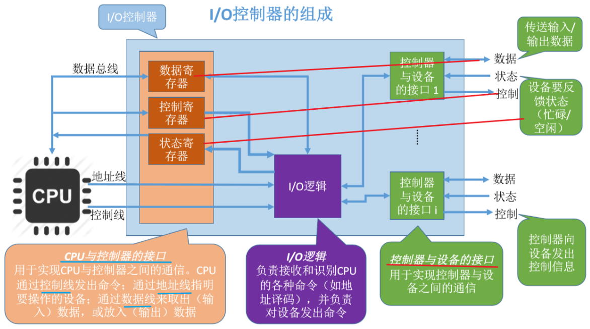
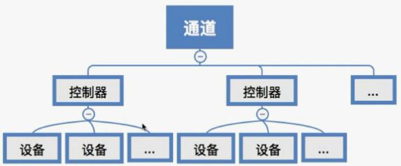

>   I/O设备
>
>   对I/O设备的控制方式
>
>   I/O管理

<!--more-->

# 5. I/O设备与管理

## 5.1 I/O设备

>   将数据输入/输出的计算机外部设备

### 5.1.1 分类

### 5.1.2 I/O设备的组成

>   机械部件+电子部件`I/O控制器(设备控制器)`

#### IO控制器

CPU无法直接控制设备的机械不见，需要电子部件作为中介

##### a. 功能

-   接受和识别CPU发出的命令

    I/O控制器中的控制寄存器，存放命令与参数

-   向CPU报告设备状态

    I/O控制器中的状态寄存器：记录I/O设备的当前状态

-   数据交互

    I/O控制器中会设置相应的数据寄存器：

    输出时，数据寄存器用于暂存CPU发来的数据；之后控制器传送给设备

    输入时，暂存设备发来的数据。之后CPU从数据寄存器中取走数据

-   地址识别

    类似于内存地址，为了区分设备控制器中的寄存器，需要给每个寄存器设置地址

##### b. 组成

-   一个I/O控制器可能对应多个设备

##### c. I/O控制器端口的编址方式

-   内存影映像I/O：寄存器地址占用内存地址的一部分
-   寄存器独立编址：I/O专用地址

## 5.2 I/O控制方式

### 5.2.1 程序查询方式

>   CPU不断查询IO控制器中的 *状态寄存器* ，在等待IO完成的过程中CPU需要不断轮询检查

#### 过程

以读操作为例

1.  CPU向设备控制器发出读指令，设备启动，修改状态寄存器的值为1，表示从设备读入数据
2.  轮询检查控制寄存器的状态，若状态位为1，说明设备还没有准备好要输入的数据，于是CPU会不断轮询
3.  输入设备准备好数据后，将数据传给设备控制器，并报告自身状态
4.  控制器将输入的数据放到数据寄存器中，并将状态位改为0
5.  CPU发现设备已就绪，即可将数据寄存器中的内容读入CPU寄存器中，再把寄存器中的内容放入内存

#### 特点

数据传送单位：一个字

数据流向：

-   读操作：I/O设备-->I/O设备控制器中的寄存器-->数据总线-->CPU寄存器-->内存
-   写操作：内存-->CPU寄存器-->数据总线-->I/O设备控制器中的寄存器-->I/O设备

优点：实现简单

缺点：CPU和IO设备只能串行工作，长期处于忙等状态，CPU利用率低

### 5.2.2 中断方式

>   在CPU发出读/写命令后，可将等待I/O的进程阻塞，先切换到别的进程执行。当I/O完成后，设备控制器向CPU发出一个中断信号，CPU检测到中断信号，保存当前进程的运行环境，转去执行中断处理程序处理该中断。
>
>   -   处理中断的过程：CPU从I/O控制器读一个字的数据传送到CPU寄存器，再写入主存。
>
>   中断处理完成后，CPU恢复等待I/O的进程的运行环境，继续执行

#### 特点

每次读/写一个字

中断的响应是在每个指令周期的末尾

数据流向：

-   读操作：I/O设备-->CPU-->内存
-   写操作：内存-->CPU-->I/O设备

优点

-   CPU与I/O设备可并行工作

缺点

-   每个字在I/O设备与内存之间的传输，都需要经过CPU。频繁的中断处理会消耗较多的CPU时间

### 5.2.3 DMA方式

>   直接存储器存取，用于块设备的I/O控制

#### DMA特点

-   基本传送单位是块

-   数据流向

    读操作：I/O设备->内存

    写操作：内存->I/O设备

-   所传送的数据是从设备直接送入内存，数据通路中不经过CPU

-   仅在传送一个或多个数据块的开始或结束时，才需要CPU干预，整块数据的传送实在DMA控制器的控制下完成的

#### DMA控制器组成

-   DR（数据寄存器）：暂存从设备到内存，或者从内存到设备的数据
-   MAR（内存地址寄存器）：在输入时，MAR表示数据应放到内存中的什么位置；输出时MAR表示要输出的数据放到内存中的什么位置
-   DC（数据计数器）：表示剩余要读/写的字节数
-   CR（命令/状态寄存器）：用于存放CPU发来的I/O命令，或设备的状态信息

#### DMA过程

CPU接收到I/O设备的DMA请求时，会给I/O控制器发出一条命令，启动DMA控制器，然后继续做其它工作

DMA控制器直接与存储器交互，传送整个数据块到DR。当数据传送完成后，DMA控制器发送一个中断信号给CPU，将DR中的数据转存到MAR指出的内存空间或者

#### 与中断方式对比

中断驱动方式在每个数据需要传输时，中断CPU。DMA方式则是在要求传送的一批数据全部传送结束才中断CPU；

中断驱动方式的数据传送是在中断处理时由CPU控制完成；DMA控制方式则是在DMA控制器的控制下完成

#### 不适用于离散的数据块

>   若要读/写多个离散存储的数据块，或将数据分别写到不同的内存区域，CPU需要发出多条I/O指令，需要多次中断处理才能完成

### 5.2.4 通道控制方式

通道指专门负责输入输出的处理机

#### 通道控制方式过程

1.  CPU向通道发出I/O指令，指明通道程序在内存中的位置，并指明要操作那个I/O设备，之后切换到其他进程
2.  通道执行内存中的通道程序（指明了要读入/写出多少数据，读/写的数据应放在内存的什么位置等信息）
3.  通道执行完规定的任务后，向CPU发出中断信号，之后CPU对中断处理

#### 特点

通道会根据CPU的只是执行相应的通道程序，只有完成一组数据块的读/写后才需要发出中断信号，请求CPU干预

每次读/写以一组数据块

优点：CPU、通道、I/O设备可并行工作，资源利用率很高

## 5.3 I/O管理

### 5.3.1 功能

-   状态跟踪：实时掌握外设状态信息
-   设备存取：实现对设备的存取操作
-   设备分配：设备的分配与回收
-   设备控制：设备的驱动，完成故障的中断处理

### 5.3.2 IO系统层次结构

### 5.3.1 用户层软件

实现与用户的接口：将用户请求翻译成格式化IO请求，通过 `系统调用` 请求内核服务

向上层提供库函数

#### A. SPOOLing技术(假脱机)

>   将一台物理设备逻辑上虚拟成多台设备，可将独占式设备改造成共享设备

##### a. 脱机技术

 批处理阶段引入了 **脱机输入/输出技术**

-   缓解了CPU与I/O设备的速度矛盾
-   即使CPU在忙碌，也可以提前将数据输入到磁带(辅存)中，之后主机可以从相对快速的辅存上读入数据，缓解了速度矛盾

##### b. 假脱机技术

>   用软件的方式模拟脱机技术，从磁盘I/O的速度远比向I/O外设的速度快

井：在磁盘上开辟两个存储区域，用于I/O设备数据的输入与输出

-   输入井：模拟脱机输入时的 *辅存* ，用于收容I/O设备输入的数据

-   输出井：模拟脱机输出时的 *辅存* ，用于收容用户进程输出的数据

实现SPOOLing技术，必须有 **多道程序设计的支持**

-   输入进程：模拟脱机输入中的 *外围控制机* 

-   输出进程：模拟脱机输出时的 *外围控制机* 

输入缓冲区：在输入进程的控制下，暂存从设备中输入的数据，之后转存到 *输入井* 中

输出缓冲区：在输出进程的控制下，暂存从 *输出井* 中送来的数据，之后传送到 *输出设备* 上

##### c. 共享打印机

当多个用户进程提出输出打印的请求时，系统会答应请求，但并不是真正把分配打印机，由脱机管理进程为每个进程做两件事

1.  在磁盘 *输出井* 中为进程申请一个空闲缓冲区（相当于分配一个逻辑设备），并将要打印的数据放入其中
2.  为用户进程申请一张空白的 *打印请求表* ，并将用户的打印请求填入表中（就是说明用户的打印数据存放位置），将该表挂在 *假脱机文件队列上*
3.  当打印机空闲时，输出进程会从文件队列的队头取出一张 *打印请求表* ，并根据表中的要求，将数据从 *输出井* 传送到 *输出缓冲区* ，再输出到打印机进行打印

### 5.3.2 设备独立性软件

>   用户程序与设备驱动器的统一接口

#### A. 功能

-   向上层提供系统调用
-   建立逻辑设备名到物理设备名的映射
-   根据设备类型选择相应的设备驱动程序
-   设备保护
-   设备的分配与回收
-   缓冲区管理

#### B. 逻辑设备表

>   为每个用户创建一张逻辑设备表，多用户可重名

-   确定逻辑设备对应的物理设备
-   找到物理设备对应的设备驱动程序

如：

| 逻辑设备名   | 物理设备名 | 驱动程序入口地址 |
| ------------ | ---------- | ---------------- |
| /dev/打印机1 | 3          | 1024             |
| /dev/打印机2 | 5          | 2046             |
| ...          | ...        | ...              |

-   I/O设备被当做一种特殊文件
-   不同类型I/O设备要有不同的驱动程序处理

#### C. 设备保护

>   设备被看做特殊文件，不同用户对设备访问权限不同

-   每个设备都有FCB
-   用户请求访问某个设备时，系统根据FCB中的信息判断访问权限

#### D. 设备的分配与回收

##### a. 总原则

-   充分发挥设备的使用效率
-   避免不合理分配方式造成的进程死锁

##### b. 考虑因素

###### 设备固有属性

独占设备

共享设备

-   可分配给多个进程(磁盘)
-   宏观上共享，微观上交替使用

虚拟设备

-   采用SPOOLing技术将独占式设备改为共享设备
-   同时分配给多个进程使用

###### 设备分配算法

###### 设备分配的安全性

**安全分配方式**

>   为一个进程分配一个设备后将进入阻塞状态，本次I/O完成后将进程唤醒

优点：破坏了 "请求并保持" ，不会造成死锁

缺点：对一个进程来说，CPU和IO只能串行工作

**不安全分配**

>   为一个进程分配设备后，进程继续执行，可以发出IO请求；IO不满足时，才阻塞

优点：效率高；计算任务和IO任务并行处理

缺点：有可能发生死锁

##### c. 分配策略

静态分配：进程运行前全部分配，结束后全部归还

动态分配

##### d. 设备分配管理中的数据结构

>   一个通道可控制多个设备控制器，一个设备控制器可控制多个设备

###### 系统设备表(SDT)

记录系统中全部设备的情况

###### 设备控制表(DCT)

每个设备一张设备控制表

###### 控制器控制表(COCT)

每个设备控制器一张控制器控制表

###### 通道控制表（CHCT）

每个通道一张通道控制表

OS根据通道控制表对通道进行操作

##### e. 设备分配步骤

>   设备及其控制器及通道都分配成功才算成功

1.  根据进程请求的 *物理设备名* 查找SDT（物理设备名是进程请求分配时提供的参数）
2.  根据SDT查找DCT，若 *设备* 忙碌则将进程PCB挂到 *设备等待队列* 中，不忙，则将设备分配给进程
3.  根据DCT找到COCT，若 *设备控制器* 忙则将进程PCB挂到 *控制器等待队列* 中，不忙，则将 *控制器* 分配给进程
4.  根据COCT查找CHCT，若 *通道* 忙碌则将进程PCB挂到 *通道等待队列* 中，不忙，则将通道分配给进程

缺点：

-   用户编程必须使用 `物理设备名` ，底层细节对用户不透明，不方便编程
-   若换了一个物理设备，则程序无法运行
-   若进程请求的物理设备正在忙碌，即使系统中还有同类型的设备，进程也必须阻塞等待

##### f. 设备分配改进方法

>   建立 *逻辑设备名与物理设备名* 的映射机制，用户编程使用的逻辑设备名（设备类型）

###### 逻辑设备表(LUT)

###### 分配步骤

1.  根据进程请求的 *逻辑设备名* 查找SDT
2.  查找SDT，找到用户进程 *指定的类型、且空闲* 的设备，将其分配给该进程。
3.  操作系统在逻辑设备表中新增一个表项
4.  根据DCT找到COCT，若控制器忙碌则将进程PCB挂到控制器等待队列中，不忙碌则将控制器分配
5.  根据COCT找到CHCT，若通道忙碌则将进程PCB挂到通道等待队列中，不忙碌则将通道分配各进程

#### E. 缓冲区管理

>   将内存作为缓冲区，屏蔽设备间数据交互的 单位大小和传输速度 的差异
>
>   *设备独立性* 的缓冲区管理就是组织管理好这些缓冲区

磁盘高速缓存：逻辑上属于磁盘，物理上是主流在内存中的盘块

-   缓冲区数据非空，不能向缓冲区冲入数据，只能从缓冲区取出数据
-   缓冲区为空，只能往缓冲区冲入数据，但只能充满才能从缓冲区取出数据

##### a. 缓冲区作用

-   缓和CPU和IO设备之间速度不匹配的问题
-   减少CPU的中断频率，放宽对CPU中断处理时间的限制
-   解决数据粒度不匹配问题
-   提高CPU和IO设备间的并行性

##### b. 引入缓冲区的工作策略

输出时

1.  CPU把要输出的数据快速地放到缓冲区中，之后可以做别的事情
2.  慢速的I/O设备可以慢慢从缓冲区取走数据

##### c. 缓冲管理策略

###### 单缓冲

>   一个缓冲区大小等于一个块大小

**T>C**

初始状态：工作区满，缓冲区空

故CPU处理数据，耗时C，同时块设备将数据读入到缓冲区耗时T。

由于T>C，故 *CPU* 处理完数据后暂时不能将下一块数据传送到工作区，必须 *等待缓冲区中冲满数据*

此时处理一块数据的 $平均用时=T+M$ 

**T<C**

初始状态：工作区满，缓冲区空

当 *缓冲区* 冲满数据后，必须 *等待* 工作区取走数据才能继续继续冲入数据

此时处理一块数据的 $平均用时=C+M$ 

**单缓冲区间的通信**

###### 双缓冲区

>   在主存中为其分配两个缓冲区

初始状态：工作区空，缓冲区1满，缓冲区2空

处理一个数据块平均耗时=MAX{T,C+M}

**T>C+M**

每处理一个数据块 $平均耗时=T$

**T<C+M**

设备输入数据块的速度要比处理机处理数据块的速度快，每处理一个数据块 $平均耗时=C+M$

**双缓冲区机器间的通信**

###### 循环缓冲区

>   将多个大小相等的缓冲区链接成一个循环队列

##### d. 缓冲池

###### 三个队列四个区

缓冲队列

-   空缓冲队列：没有存放数据的空闲缓冲区链接成队列
-   输入队列：用于存放设备输入数据的缓冲区队列
-   输出队列：用于存放输出数据的缓冲区队列

四个区

-   收容输入数据的工作缓冲区(hin)
-   提取输入数据的工作缓冲区(sin)
-   收容输出数据的工作缓冲区(hout)
-   提取输出数据的工作缓冲区(sout)

###### 输入进程请求输入数据

从 *空缓冲队列* 中取出一块作为 *收容输入数据的工作区(hin)* ，冲满数据后将缓冲区放入 *输入队列* 队尾

###### 计算进程取得一块输入数据

从输入队列中取得一块充满数据的缓冲区作为 *提取数据的工作缓冲区(sin)* 

缓冲区读完后，挂到空缓冲队列

###### 计算进程将数据输出到输出缓冲区

从空缓冲队列中取出一块作为 *收容输出数据的工作缓冲区(hout)* ，缓冲区冲满后挂到输出队列队尾

###### 输出进程请求输出数据

从输出队列中取得一块冲满的 *输出数据的工作区(sout)*

#### F. IO调度

>   用某种算法确定处理IO请求的顺序

如：磁盘调度

-   FCFS
-   最短道优先
-   SCAN算法

### 5.3.3 设备驱动程序

>   不同设备内部硬件特性不同
>
>   -   厂家需要提供与设备对应的驱动程序
>   -   每类设备一个设备驱动程序

功能

- 将上层抽象的IO命令转化为具体的操作指令，发送给设备控制器

设备驱动程序以一个独立进程存在

CPU只需执行设备对应的驱动程序，完成设置 *设备寄存器* ，检查设备的工作状态

### 5.3.4 中断处理程序

IO任务完成时，IO控制器会发出一个中断信号，系统根据中断信号类型找到对应的中断处理程序

