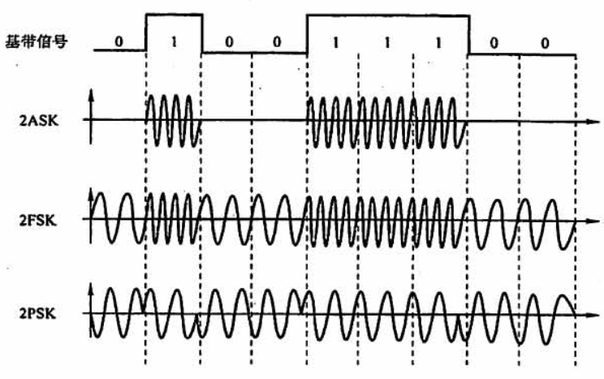

>   研究如何传输比特流，确定与传输媒体的接口有关的特性

<!--more-->

# 2. 物理层

## 2.1 通信基础

### 2.1.1 概念

#### a. 数据、信号、码元

>   数据：传送的信息

数据传输方式：

-   串行传输：多个比特按时间顺序传输（远距离通信）
-   并行传输：多个比特通过多条信道同时传输

---

>   信号：数据的电气或电磁表现
>
>   -   模拟数据(信号)：连续变化的数据(信号)
>
>   -   数字数据(信号)：取值为有限的离散数值的数据(信号)

---

>   码元：用一个固定时长的信号波形表示一位k进制数字

代表不同离散值的基本波形是数字通信中数字信号的计量单位

-   码元宽度：时长
-   k进制码元：固定时长内的信号，有k种波形

一码元可以携带多个bit信息

-   二进制：1码元1位 $2^1=2$
-   四进制：1码元2位 $2^2=4$
-   八进制：1码元3位 $2^3=8$

#### b. 信源、信道与信宿

数据通信：数字计算机或其他数字终端间的通信

>   信源：产生和发送数据的源头

信源发出的信息，需要通过变换器转换成适合于信道上传输的信号

---

>   信宿：接收数据的终点

通过信道的信号，先由反转换器转换成原始信息后发送给信宿

---

>   信道：信号的传输媒介

逻辑部件：表示某个方向传送信息的介质

##### 信道上的信号

基带信号：将数字信号直接用不同电压表示

-   基带传输适用于计算机内部设备或相邻设备间近距离传输，编码方式采用曼彻斯特编码、不归零编码

宽带信号：将基带信号调制称频分复用的模拟信号

-   频带传输：用数字信号对特定频率的载波进行调制，将其变为适合于传送的信号后再进行传送。可实现多路复用

-   宽带传输：当一条链路分为多个信道，每个信道携带不同的信号且不同信道的信号互不干扰，就成为宽带传输。

##### 信道分类

###### 传输信号的形式

模拟信道：传输模拟信号

数字信道：传输数字信号

###### 按传输介质

无线信道

有线信道

##### 通信双方交互方式

单工通信：只有一个方向的通信，只需要一个信道。如无线电广播，电视广播

半双工通信：通信双方都可以发送或接收信息，但任何一方不能同时发送和接收，需要两条信道

全双工通信：通信双方可同时发送和接收信号，需要两条信道

#### c. 速率、波特率、带宽

>   速率：数据的传输速率，表示单位时间内传输的数据量

码元传输速率（波特率）

-   表示单位时间内传输的码元个数，信号变化次数

-   单位波特/s，值只与码元宽度有关

信息传输速率（比特率）

-   单位时间内传输的二进制bit数

-   单位bit/s，值与码元宽度，码元进制数有关

    $k进制码元的波特率M\quad波特/s,对应的信息传输速率为Mk\quad bit/s$

>   带宽：单位时间内通过信道的数据量，单位bit/s或bps

### 2.1.2 传输率上限

#### a. 奈氏准则(奈奎斯定理)

>   在理想低通的信道中，极限码元传输率为2W波特

-   理想低通：没有噪声，带宽有限

-   W为带宽，单位为HZ

    注：2W=采样频率

推论：
$$
理想低通信道的极限数据传输率=2Wlog_2V
$$

-   V表示码元数量，即V进制码元

相关结论：

1.  码元传输率是有上限的，超过此上限会出现码间串扰

2.  信道的频带越宽，码元传输率越高，同时数据传输率越高

3.  奈氏准则对给出了码元传输率的限制，但未对一个码元表示多少个二进制位进行限制

    让一个码元携带更多bit，可以提高数据传输率

#### b. 香农定理

>   给出了带宽受限且有高斯噪声干扰的极限数据传输率
>   $$
>   信道极限数据传输率=Wlog_2(1+\frac{S}{N})
>   $$
>
>   -   W：信道带宽
>   -   $信噪比=10log_{10}\frac{S}{N}$

-   信噪比越大，信息的极限传输速率越高
-   只要信息的传输率低于信道的极限传输速率，就能找到某种方法实现无差别传输

### 2.1.3 编码与调制

>   调制：把数字数据变为模拟信号
>
>   编码：把模拟数据变为数字信号
>
>   -   具体用什么数字信号表示1，什么数字信号表示0

#### a. 数字数据变为数字信号

>   数字数据用于基带传输：不改变数字数据信号频率，直接传输数字数据

##### RZ（时钟周期与自同步？）

>   每个时钟周期中间都变低压

但要占带宽

-   **连续的0无法表示**

##### NRZ

>   一个周期全部用来传输数据，编码效率为 100%

NRZ 无自同步

-   **连续1，0无法表示**

需要单独的时钟线来确定多少连续的不变算一个信号

##### NRZ1

>   信号反转表示0，不变表示1

无自同步

-   **连续的1无法确定有多少个**

不损失传输带宽，编码效率100%

##### 曼彻斯特编码

>   一个码元分成两个相等的间隔
>
>   高->低：1
>
>   低->高：0

有时钟信号，可以自同步

编码率为50%

以太网采用曼彻斯特编码

##### 差分曼彻斯特编码

>   前半个码元与上一个码元后半部分相等：1
>
>   前半个码元与上一个码元后半部分不等：0

有时钟信号，可以实现自同步

#### b. \*数字数据调制为模拟信号

2ASK（二进制幅移键控）中用载波有振幅和无振幅表示数字数据的1和0

2FSK（频移键控）中用两种不同的频率分别表示数字数据1和0

2PSK（相移键控）中用相位0和 $\pi$ 表示数字数据1和0

#### c. 模拟数据变为数字信号

PCM（脉码调制）

**采样**

采样定理：采样频率是最大频率的2倍

对应于奈氏定理频率W的2倍

**量化**

**编码**

## 2.2 物理层

机械特性：定义物理连接的边界点。规定物理连接采用的规则、引线、引脚数量、排列情况

电气特性：规定传输二进制位时，线路上的电压高低

功能特性：指明某条线上出现某一电平表示何种意义，接口部件的信号线用途

规程特性：定义各条物理线路的工作规程和时序关系

### 2.2.1 物理层设备

## 传输介质

传输介质在物理层之下，传输介质不知道线路中的信号代表什么

物理层规定了电气特性，能够识别传送的比特流

>   端设备之间的物理通路

### 导向传输介质

#### 双绞线

STP（屏蔽双绞线）UTP（非屏蔽双绞线）

>   在局域网和电话网中普遍适用

模拟传输：用放大器放大衰减的信号

数字传输：中继器将失真的信号整形

#### 同轴电缆

>   用于传输速率高，距离远的环境

不同电阻的同轴电缆用于不同的传输形式

-   基带同轴电缆——局域网
-   宽带同轴电缆——有线电视系统

#### 光纤

单模光纤：适合远距离传输

多模光纤：适合近距离传输