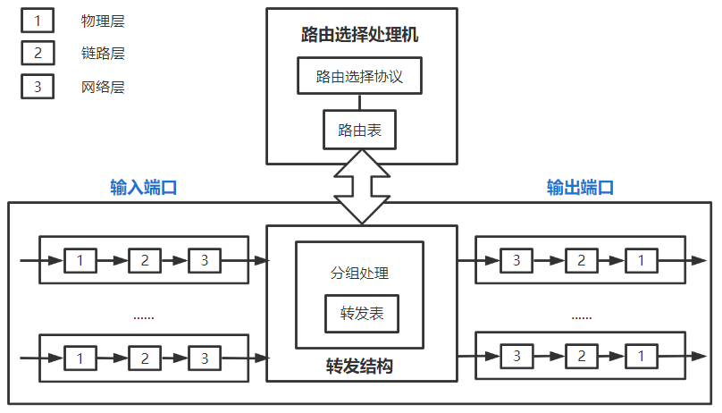
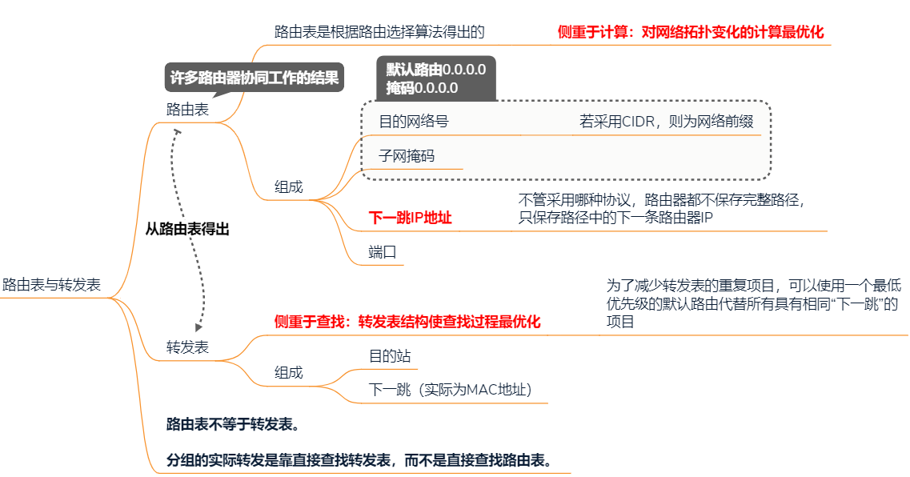
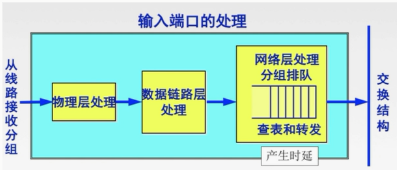
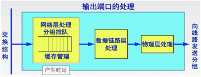
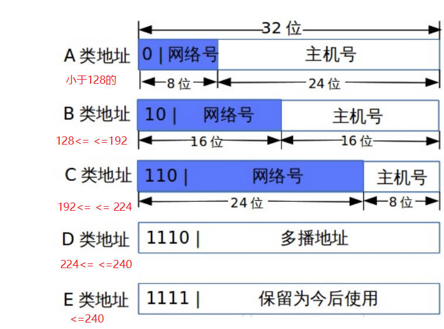
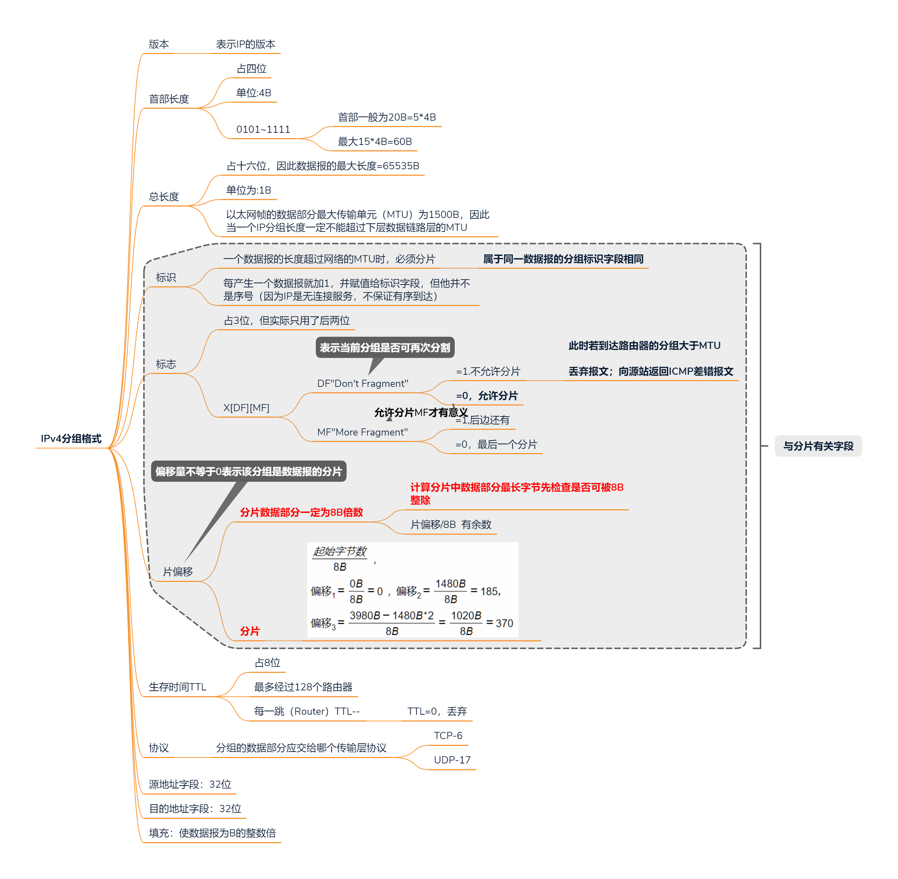
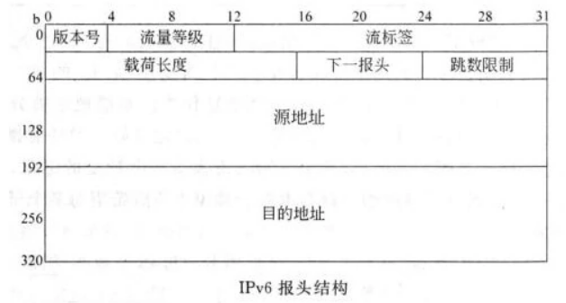
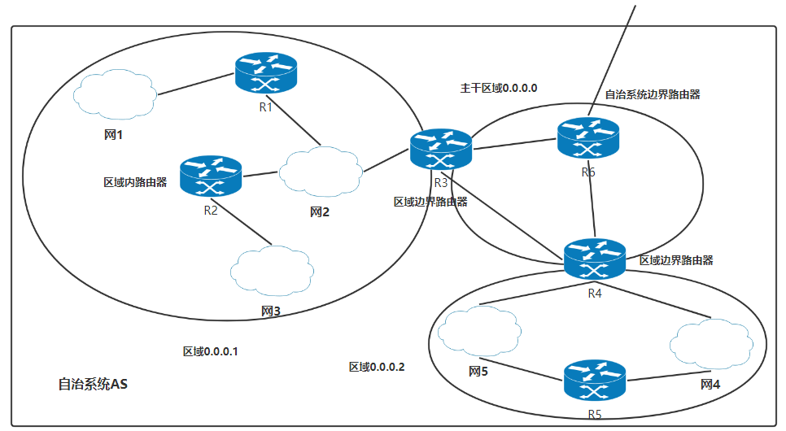
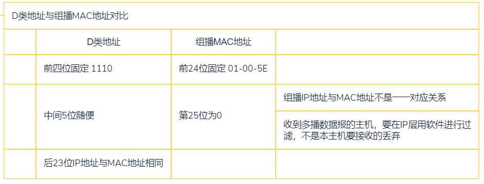

>   IP协议族是网络层是主要实现，主要完成数据报的转发与路由的计算
>
>   **网络层提供主机之间的逻辑通信**

尽最大努力交付

-   不保证IP数据报无差错，不重复

-   不保证数据报按顺序到达目的主机

-   不故意丢弃数据报

    丢弃数据报的情况：路由器检测出首部检验和有错；网络拥塞

<!--more-->

# 4. 网络层

## 4.1 功能

### 4.1.1 异构网络互联

>   将两个及以上的计算机网络，用一种或多种通信设备(中间设备)相互连接起来

-   物理层中继系统：中继器、集线器
-   数据链路层中继系统：网桥、交换机
-   网络层中继系统：路由器
-   网络层以上中继系统：网关

### 4.1.2 路由与转发

#### a. 分组转发

**仅涉及一个路由器**

>   路由器根据转发表将用户的IP数据报从合适的端口转发出去

#### b. 路由选择

**涉及很多路由器**

>   定期和相邻路由器交换路由信息而不断更新和维护路由表

具体做法：根据从各相邻路由器得到的关于网络拓扑变化情况，使用特定的路由选择协议，动态地改变所选择的路由，进而构造出整个路由表

### 4.1.3 复用和分用

复用：发送方不同协议的数据报都可以封装成IP数据报发送出去

分用：接收方的网络层剥去首部后把数据交付给相应的协议

### 4.1.4 拥塞控制

#### a. 拥塞

>   **全局性的问题**
>
>   网络中分组过多，每个结点都很忙
>
>   来不及接受分组，分组被大量丢弃

判断将进入拥塞状态的方法

-   轻度拥塞：网络负载增加，网络吞吐量增加不多
-   拥塞状态：随着网络负载的增大，网络吞吐量下降
-   死锁状态：网络负载继续增大，网络吞吐量下降到0

#### b. 拥塞控制

-   开环控制：设计网络前考虑周到，这是一种静态的预防方法
-   闭环控制：基于反馈环路，一种动态的方法

## 4.2 物理设备

Router：多输入/输出端口专用计算机

### 4.2.1 功能

-   连接不同网络
-   完成路由与转发
-   隔离广播域

### 4.2.2 数据的交付方式

#### a. 直接交付

在该路由器某一端口的**同一局域网**中

将分组中的目的IP与该路由器的各端口子网掩码相与，若是匹配，则查找ARP(IP与物理MAC地址映射表)缓存表，找到IP地址对应的MAC地址，直接交付

#### b. 间接交付

路由器按照转发表(路由表)指出的路由器，将数据报发给下一跳路由器

### 4.2.3 结构

#### a. 路由表与转发表

#### b. 路由选择处理机

- 根据路由协议构造路由表

- 定期和其他相邻路由器交换路由表，进而动态更新和维护路由表

#### c. 分组转发部分

##### 交换结构

>   根据转发表对分组进行处理，将从输入端口进入的分组从一个合适的端口转发出去

-   若是 `RIP/OSPF` 分组，传送给路由选择处理机
-   若是数据分组，查找转发表输出

三种交换方式

-   通过存储器交换
-   通过总线交换
-   通过互联网交换

##### 输入输出端口

路由器实现了网络模型的下三层：物理层、链路层和网络层

路由器可以对这三层协议的控制信息进行识别、分析和转换(对帧、报文可以拆开和包装)

-   物理层：接收bit流
-   链路层：根据链路层协议将bit流转换为帧
-   网络层：分组排队，查表和转发

从传输介质接收到一组电平，物理层处理后，变为一连串bit流

比特流经过链路层，识别到帧定界符后，将帧拆分成网络层数据报

经过网络层，根据目的地址，查找转发表，选择合适的输出端口，通过交换结构，逐层封装后通过输出端口输出

##### 分组转发过程

1.  从数据报中提取目的主机的IP地址D，得出其网络地址号N
2.  若网络N与路由器直连，则将数据报直接交付目的主机D，称为直接交付；否则间接交付
3.  若路由表中有目的地址为D的特定主机路由，则把数据传送给路由表所指明的下一跳路由器
4.  若路由表中有到达网络N的路由，则把数据报传送给路由表指明的下一跳路由器，否则执行下一步
5.  若路由表中有一个默认路由，则把数据报传送给路由表中所指明的默认路由，否则报告转发分组出错

## 4.3 网络编址

### 4.3.1 干什么的

>   一个IP地址标记一台主机(或路由器)和一条链路的接口

格式： `网络号.主机号:端口号`

在同一局域网上的主机或路由器的IP地址网络号相同，主机号一定不同

-   用转发器或网桥连接的若干LAN仍是同一个网络（同一个广播域）

一台主机MAC地址唯一，但当其连接到两个网络，必须有两个相应的IP地址，这两个IP地址是该主机在不同网络中的标识，网络号一定不相同

-   一台路由器必须的输入和输出端口必须各有一个IP地址

### 4.3.2 IPv4特殊的IP地址

网络号全0：表示本网络

主机号全0：表示本机或本网络

主机号全1：本网络广播地址

有网络号：能找到具体的网络

有主机号：能找到具体的主机

| 网络号 | 主机号    | 可作源地址? | 可作目的地址? | 用途                                                         |
| ------ | --------- | ----------- | ------------- | ------------------------------------------------------------ |
| 全0    | 特定值    | √           | ×             | 用于本网内通信，表示本网内的某个主机                         |
| 全0    | 全0       | √           | ×             | 表示本网络上的本机 不知道自己IP的情况下，用作填充源地址 是路由表中的默认路由。**作为目的地址，其子网掩码为0.0.0.0？** |
| 特定值 | 全0       | ×           | ×             | 表示本网络，用于表示一个局域网                               |
| 特定值 | 全1       | ×           | √             | 广播地址，可对指定网络的所有主机广播                         |
| 全1    | 全1       | ×           | √             | 广播地址，只能对本网的所有主机广播                           |
|        | 127.0.0.0 | √           | √             | 环回地址：表示主机本身，用于本地软件测试，不出现在任何网络中 |

问题：127开头的全部都是环回地址吗，还是只有127.0.0.0

### 4.3.3 一般的地址分类及个数

| 网络类别(字节-前缀) | 最大网络数            | 第一个网络号 | 最后一个网络号 | 每个网络中最大的主机数 |
| ------------------- | --------------------- | ------------ | -------------- | ---------------------- |
| A(1B-0)             | $2^{8-1}-2$           | 1            | 126            | $2^{24}-2$             |
| B(2B-10)            | $2^{16-2}-1=2^{14}-1$ | 128.1        | 128.255        | $2^{16}-2$             |
| C(3B-110)           | $2^{24-3}-1=2^{21}-1$ | 192.0.1      | 223.255.255    | $2^8-2$                |

A  类网络号 **-2**：**127**.x.x.x作为本地环回地址，**0**.x.x.x 表示网络号为 **0** 的网络

BC类网络号 **-1**：**128.0**.x.x表示网络号为 **128.0** 的网络

主机号 **-2**：主机号全0：表示本网络，主机号全1表示广播地址

### 4.3.4 子网划分

>   **网络数量 由少变多**

#### a. 思路

>   从主机号借用若干比特作为子网号，`IP地址={<网络号>,<子网号>,<主机号>}`
>
>   从一个IP地址本身无法判断是否进行了子网划分

如：一个单位按部门划分了子网，若有一个发往该单位的一台主机的数据，则先根据目的网络号找到该单位路由器，单位路由器按 目的网络号+子网号找到 目的主机所在的子网，在子网中找到目的主机

#### b. 子网掩码

>   若所在网络划分了子网，则为一台主机设置IP地址外还需要设置子网掩码
>
>   `子网掩码:网络号全1，借的主机位全1`

子网掩码告诉主机或路由器当前网络进行了子网划分， 
$$
子网号=IP地址\&(按位与)子网掩码=该IP地址所在的网段
$$

-   同属于一个子网的所有主机及路由器的端口必须有相同的子网号与子网掩码

>   使用子网掩码时，路由器的分组转发算法

1.  从收到的分组首部提取目的IP地址，记为D

2.  先判断是否为直接交付。

    对与路由器直接相连的网络逐个检查：用各网络的子网掩码和D按位与，得到子网号N看是否与该掩码的子网号匹配。

    若匹配则将分组直接交付，完成转发；否则执行下一步

3.  若路由表中的目的地址D与特定的主机路由匹配，则将分组转发给路由表中指明的下一跳路由器，否则执行下一步

4.  对路由表中的每一行($目的网络子网号\mid 子网掩码\mid 下一跳地址$)中的子网掩码与D按位与，得到结果N。

    若N与该行的目的网络地址匹配，则转发给对应的下一跳地址对应的路由器

    若否则执行下一步

5.  若路由表中有默认路由，则将分组转发给默认路由指明的路由器，否则报告分组转发出错

### 4.3.5 无分类编址CIDR

>   **网络数量 由多变少**

#### a. 思路

>   用网络前缀代替网络号与子网号
>
>   定义为：`{<网络前缀>,<主机号>}={网络号+子网号}`

表示方法：`IP地址/网络前缀位数`

构成超网(路由聚合)：一个路由器中，走一个接口的网络地址聚合成一个 `CIDR地址块` ，一个CIDR地址块可以表示很多地址

#### b. 最长前缀匹配

从匹配结果中选择具有最长网络前缀的路由，得到的路由越具体

#### c. CIDR路由表

线索二叉树，自上而下按层次进行查找

### 4.3.6 与IP地址相关的协议

#### a. ARP(地址解析协议)

**网络层协议：能看见IP地址**

**运行于主机**

##### 干啥的

>   ARP动态维护ARP映射表：每台主机都设有一个ARP高速缓存，存放本局域网上各主机到路由器的IP地址到MAC地址的映射

##### 怎么干

本局域网中的主机A收到一个IP分组后

先查找本机的ARP映射表，看表项中是否有与目的地址相同的IP地址

-   如果有，将此IP地址对应的硬件地址写入MAC帧，作为目的MAC地址
-   如果没有
    1.  **广播ARP请求帧(目的MAC地址为FF-FF-FF-FF-FF-FF的帧)**。
    2.  到达IP地址指定的主机B后，向主机A发送ARP相应分组，将主机B与MAC地址的映射返回。
    3.  主机A收到此响应后，更新MAC映射表。按查询到的硬件地址填充MAC帧的目的地址

---

使用ARP，本网络找目的主机的MAC地址；不同网络，找网关路由器的MAC地址

---

MAC帧的传输过程中，每一跳都要更新源MAC地址与目的MAC地址

-   **经过路由器才算一跳**

#### b. NAT(网络地址转换)

**传输层协议：能看见端口号**

**运行于边际路由器**

##### 干啥的

>   专用网内部的一些主机已经分配到了私网IP，若想和互联网上的主机通信，需要通过NAT路由器，将私网IP转换为公网IP，才能和互联网上的主机通信

-   NAT路由器：装有NAT软件，且至少有一个公网IP

##### 怎么干

路由器对目的地址是私网IP的，一律不转发

**通过NAT路由器时，需要将地址字段的私网IP替换为公网IP**

`私网IP:端口号->公网IP:端口号`

##### 约定的私网IP

#### c. DHCP(动态主机配置协议)

**应用层协议**：C/S模式

**基于UDP协议**：TCP需要建立连接，前提是知道IP地址，所以无法建立单播

**运行于主机**

##### 干啥的

>   给主机动态地分配IP地址，DHCP分配给DHCP客户的IP地址是临时的，称为租用期
>
>   由DHCP服务器决定租用期的时长

##### 怎么做

需要IP地址的主机称为客户机，DHCP服务器称为服务器

1.  DHCP客户机启动时就广播 `DHCP发现` 消息：为了找到网络中的DHCP服务器获得一个IP地址

    源地址：0.0.0.0

    目的地址：255.255.255.255

2.  DHCP服务器收到 `DHCP发现` 消息后，向网络中广播 `DHCP提供` 消息

    包含提供给客户机的IP地址和相关配置信息

    -   IP地址、默认网关、子网掩码、DNS名称及其IP地址

3.   DHCP客户机收到 `DHCP提供` 消息后，若接受配置信息，则广播 `DHCP请求` 消息向DHCP服务器请求分配IP地址

4.  DHCP服务器收到 `DHCP请求` 消息后，将IP地址分配给DHCP客户机

##### 注意点

1.  在DHCP获取IP地址前，通过广播方式传输消息，所以目的地址都是 `255.255.255.255`
2.  DHCP允许网络上存在多态DHCP服务器，DHCP客户机会选用最先到达的 `DHCP提供` 消息中提供的IP地址

### 4.3.7 移动IP

>   手机卡与基站的关系

#### a. 概念

##### 移动结点

>   具有唯一**永久的本地IP地址**的结点

-   从外网移动回本地时，辅地址改变或者撤销，而**主地址保持不变**

##### 归属代理(本地代理)

>   在归属网络中代表移动结点执行管理功能的实体

-   在本地网络链路上，每个移动结点必须有一个本地代理来维护它当前的IP地址信息

##### 外部代理

>   当移动结点移动到外地(另一个网络中)时，需要获得一个临时的辅地址(归属地主地址不变)

#### b. 通信过程

##### 工作在本地

按传统的TCP/IP协议通信(通过本地网的固有地址)

##### 漫游在外地

1.  获得外部代理的IP（转交地址）

    -   移动结点主动申请获得外部代理的转交代理

    -   外部代理以ICMP报文的方式广播转交地址

2.  移动结点向本地代理注册所在地的转交地址(外部代理IP)

3.  本地代理接收到请求时，将该移动结点的本地IP地址与转交地址绑定

    构建一条通向转交地址的隧道，将发往移动结点的分组通过隧道送到外部代理处

    返回注册响应

4.  外部代理接收到注册响应后，转发给移动结点

5.  移动结点开始通信

    **接收和发送的分组都要通过外部代理转交给本地代理路由器进行**

##### 从外地回本地

>   向本地代理注销转交地址

## 4.4 网络层数据传送单元

### 4.4.1 IPv4分组

#### a. 涉及长度的字段的单位

**偏8首4**

总长度——1B

偏移地址——8B

首部长度——4B

### 4.4.2 IPv6分组

#### a. 解决地址耗尽的问题

1.  采用无分类编址CIDR
2.  采用网络地址转换(NAT)节省全球IP
3.  **采用更大的地址空间——IPV6**

#### b. IPv6地址

**64bit**

表示方法：冒号十六进制

-   四位十六进制一段，中间用冒号分隔

缩写规则

-   段开始的零可以省略
-   段末尾的零不能省略
-   全0的段可以不写，但两段的冒号不能省 如：`xxxx:0000:xxxx:xxxx` 可表示为 `xxxx::xxxx:xxxx`

#### c. IPv6协议特点

1.  有更大的地址空间：IPV4——32位，IPV6——64位

2.  无首部检验和，减少每跳上的检验时间

3.  支持即插即用(自动配置)，无需DHCP

4.  IPV6首部长度固定为40B，IPV4首部长度为4B的整数倍

5.  IPV6只有在源站才能分片，中间结点放不下IPv6数据则直接丢弃

    IPV4协议，中间结点放不下可以分片

    都是在目的站点合并分片

#### d. 从IPv4到IPv6的过渡

##### 双栈协议

>   一部分主机(路由器)装有两个协议栈

##### 隧道技术

>   将整个IPv6数据报封装成IPv4数据报的数据部分，使得IPv6的报文可以在IPv6的隧道中传输

### 4.4.3 ICMP报文

**ICMP是网络层协议**：服务于网络层

**ICMP报文作为IP数据报的数据部分**

##### 干啥的

>   由于IP协议族不提供差错控制功能，所以使用ICMP（网际控制报文协议）让主机或路由器报告差错和异常情况

##### ICMP差错报告报文

>   用于目标主机或到目标主机路径上的路由器向源主机报告差错和异常情况

---

类型：

1.  终点不可达。数据不能交付。RIP16跳

2.  源点抑制。拥塞丢弃

3.  超时。TTL=0

    **路由器**收到TTL=0的报文，丢弃**该分组**，并返回ICMP超时报文

    **主机**收到TTL=0的报文，丢弃**该数据报的全部分组** ，向源站发送ICMP超时报文

4.  参数出错。首部检验和出错

5.  改变路由（重定向）。路由器收到报文后，把改变路由报文发送给主机，让主机知道下次应把数据报发送给另一个路由器

---

不发送ICMP差错报文的情况

1.  对ICMP的差错报文不再发送ICMP差错报文
2.  只对同一个数据报的第一个分片发送ICMP报文
3.  对具有组播地址的数据报不发送ICMP差错报文
4.  对具体的特殊地址(127.0.0.0或0.0.0.0)不发送ICMP差错报文

##### ICMP询问报文

类型

1.  回送请求和回答报文

    测试结点是否可达，了解相关状态

    Ping：测试两台主机连通性

2.  时间戳请求和回答报文

    时钟同步

    traceroute:用于跟踪分组经过的路由

### 4.4.4 IP数据报的三种传输方式

1.  单播(点对点)：单个目的地，发送一次IP报，用一个单播IP最为目的地址

2.  广播(点对不知道)：同一 广播域 或 局域网 内所有设备都可收到

    目的地址字段：

    -   IP：主机号全1
    -   MAC：FF-FF-FF-FF-FF-FF

3.  多播、组播(点对多点)：源主机一次发送单个分组到同一组的多个主机

    一个主机可归属于多个分组，同一主机上的多个进程有各自的组播地址

## 4.5 路由选择

### 4.5.1 基本概念

层次路由：路由选择必须按照**层次结构**的方式，一个层次即一个自治系统

#### a. 采用层次路由的原因

>   随着网络规模的扩大，路由表会相应扩大

-   空间：需要消耗更多的路由器缓冲区
-   时间：需要更多的CPU时间扫描路由
-   带宽：需要占更多的带宽交换状态信息

#### b. 自治系统

>   由一组路由器连接的局域网形成一个自治系统

区域：OSPF将一个自治系统按路由器连接的局域网划分成一个区域

在一个自治系统内的路由器必须连通

#### 自治系统的路由选择

自治系统内部的路由选择协议称为 内部网关协议(IGP)，共同度量确定分组在AS内部的路由，如：RIP，OSPF

自治系统间的路由选择协议称为 外部网关协议(EGP)，确定分组在AS间的路由，如：BGP

### 4.5.2 路由算法

#### a. 静态路由算法

>   网络管理员手工配置的路由信息

优点

-   在负载稳定，拓扑变化不大的网络中效果好

缺点

-   路由更新慢，不适用于大型网络

#### b. 动态路由算法

>   路由表项是通过相互连接的路由器之间彼此交换信息，按照一定的算法优化出来
>
>   -   路由信息定时更新，以适应不断变化的网络

优点

-   改善网络的性能
-   有助于流量控制

缺点

-   算法复杂
-   增加网络负载

分类

-   距离-向量算法：分散性，适用于小网络，应用协议：RIP，BGP

-   链路状态路由算法：全局性，适用于大网络，应用协议：OSPF

### 4.5.3 路由协议

|          | RIP                        | OSPF                                 | BGP                                        |
| -------- | -------------------------- | ------------------------------------ | ------------------------------------------ |
| 类型     | 内部                       | 内部                                 | 外部                                       |
| 路由算法 | 距离-向量                  | 链路状态                             | 路径-向量                                  |
| 传递协议 | UDP                        | IP                                   | TCP                                        |
| 路径选择 | 跳数最少                   | 代价最低                             | 较好，非最佳                               |
| 交换结点 | 和本结点相邻的路由器       | 网络中的所有路由器                   | 和本结点相邻的路由器                       |
| 交换内容 | 当前本路由器知道的全部信息 | 与本路由器相邻的所有路由器的链路状态 | 首次：整个路由表 非首次：有变化的部分 |

#### a. 路由信息协议RIP

**应用层协议**：使用UDP数据报

>   RIP是一种分布式基于距离-向量的路由选择协议，简单适用于小网络

跳数与连通

-   与本路由器直连的网络，其跳数（距离）为1，表现为可检测到网络的连通状态
-   距离16表示表示不可达

##### 距离-向量算法

路由表项：`目的网络N|距离d|下一跳X`

1.  **每隔30S和相邻路由器**交换全部路由信息，即**自己的路由表**
2.  本机收到地址为X的相邻路由器发来的RIP报，其中包含的RIP表项所有 `距离` 字段值加1，`下一跳` 为X
3.  设修改后的RIP报文中每个表项的目的网络为N，逐个执行如下步骤：
    1.  本机路由表中没有该项N，则将N添加到本机的路由表中
    2.  若N存在于本地路由表，且其下一跳地址为X，用最新的距离向量
    3.  若N存在与本地路由表，且其下一跳地址不为X，用最短的距离向量
4.  如果180S还没收到相邻路由器的路由更新表，则把此相邻路由记为不可达路由器，距离改为16

##### 协议内容

网络中的每个路由器都要维护从它自身到每个目的网络的最佳距离

-   经过若干次RIP广播后，所有路由器都知道整个IP网络的路由表，称RIP最终是收敛的

RIP认为好的路由就是通过的路由器数目最少，即跳数最少的路径，但不一定是传输时间最短

-   RIP一条路径最多包含15个路由器

**好消息传的快，坏消息传的慢**

-   网络出现故障，会出现慢收敛现象，可能导致路由回路

-   R1，R2到同一网络的距离是16，才知道网络不可达

在RIP中不支持子网掩码的RIP广播，所以RIP中每个网络的子网掩码必须相同

一个RIP报文中最多包含25个路由信息

-   RIP报文封装到UDP用户数据报的数据部分；端口520

#### b. 开放最短路径优先协议OSPF

**网络层协议**：使用IP数据报传输

>   使用分布式链路状态路由算法

链路状态

-   本路由器和哪些路由器相邻
-   该链路的 代价：费用，距离，时延

SPF：Dijkstra最短路径；代价最小

##### 与RIP协议区别

交换方式：洪泛

交换对象：本自治系统的所有路由器发送信息

交换信息：与本路由器相邻的所有路由器的链路状态

交换时间：只有当链路状态发生变化时

##### 原理

在一个站点路由器中，已知的链路状态信息被保存在 `链路状态数据库` 中，网络达到收敛状态后，就构造出 **全网的拓扑结构图**。本站据此用 `Dijkstra` 算法计算到每个目的网络的最短路径，在路由表中保存路径中下一跳路由器的地址

OSPF将自治系统划分成若干**区域**，只需要在区域内洪泛，在一个区域内部的路由器只知道本区域内的网络拓扑

##### 完整流程

1.  启动路由器，让每个路由器向其邻接路由器发送 `数据库描述分组`，给出已有的的链路状态摘要信息
2.  使用 `链路状态请求分组` 请求自己缺少的某些链路状态详细信息
3.  邻居收到的 `链路状态请求分组` 后，向对方发送 `链路状态更新分组` 
4.  收到 `链路状态更新分组` 后，更新链路状态，向邻居发送 `链路状态确认分组`
5.  这样就建立了全网同步的链路数据库
6.  各路由器根据自己的链路状态数据库，使用 `Dijkstra` 算法，计算到目的网络的最短路径，将路径上的下一跳路由器作为表项放入路由表
7.  当一个路由器的链路状态发生变化，该路由器使用 `链路状态更新分组` ，用洪泛法向全网发送链路状态。其他路由器接收到后，发送 `链路状态确认分组`进行确认

##### 特点

1.  每隔一段时间，就要刷新数据库中的链路状态
2.  每隔10S，相邻路由器交换一次 `问候分组` 
3.  一个路由器的链路状态只涉及相邻路由器的连通状态，所以与整个互联网的规模无关
4.  OSPF收敛快

#### c. 边界网关协议BGP

**应用层协议**：基于TCP

>   采用路径-向量路由选择协议

选择比较好的路由，不能兜圈子

##### 工作原理

各自治系统的网管至少选一个路由器作为该AS的 发言人。

一个BGP发言人与另一AS的BGP发言人建立TCP连接

在TCP连接的基础上交换BGP报文建立BGP会话

BGP会话建立后交换路路由信息

当所有BGP发言人都相互交换网络可达性的信息后，各BGP发言人就能找出到达各AS的较好路由

-   可达性信息：到达某个网络所要经过的一系列AS

 BGP刚运行时，BGP各邻站交换的是整个BGP路由表，但以后只需在发生变化时更新有变化部分

##### 特点

BGP支持CIDR，BGP路由表结构 `{目的网络前缀、下一跳路由器、到达该目的网络经过的AS序列}`

## 4.6 IP组播

>   组播数据包会被IP层路由器转发到组群成员所在的路由器，然后用以太网的组播功能把数据包送到组播成员的网卡接口

### 4.6.1 特点

1.  组播源点主机，只发送一份数据，只有在传送路径出现分叉，才将分组复制转发
    -   路径分叉：组播组中的主机若不在同一物理网络，需要组播路由器转发
2.  一定仅用UDP
3.  不提供可靠交付，“尽最大努力交付”
4.  组播地址只能用于目的地址

### 4.6.2 D类地址与组播地址

不是所有的D类地址都可作为组播地址

#### a. IP组播的两种情况

因特网范围的组播

局域网上的硬件组播：以太网的洪泛。一个节点发送的数据包会被以太网泛洪，导致每一个以太网网卡接口都会收到这个数据包。接口收到数据包后，并不马上交给节点CPU处理，而是进行MAC地址比较，如果数据包的目的MAC地址和接口的MAC地址一样，它才接受，把数据包交给计算机，否则就把数据包丢弃。

#### b. 协议

##### 因特网组管理协议IGMP

**让路由器知道组播组的成员信息**

>   使组播路由器知道本局域网上是否有主机参与或推出了组播组

工作阶段

1.  当某台主机加入新的组播组，该主机向组播组的组播地址发送一个IGMP报文，声明自己要成为该组的成员

    本地的组播路由器收到IGMP报文后，将组成员关系转发给因特网上的其他组播路由器

2.  本地组播路由器要周期性地探寻本地局域网上的主机，以便知道这些主机所在的组是否还活跃。只要组中有一台主机响应，则认为该组仍然活跃。如果连续几次探询，没有收到回应，则不再将该组的成员关系转发给其他组播路由器

##### 路由选择协议

>   组播路由器间协同工作：最低代价转发

找出以源主机为根结点的组播转发树

-   不同组播组，不同的组播转发树
-   同一组播组，不同的源点有不同的组播转发树

##### 路由算法

-   基于链路状态的路由选择
-   基于距离-向量的路由选择

