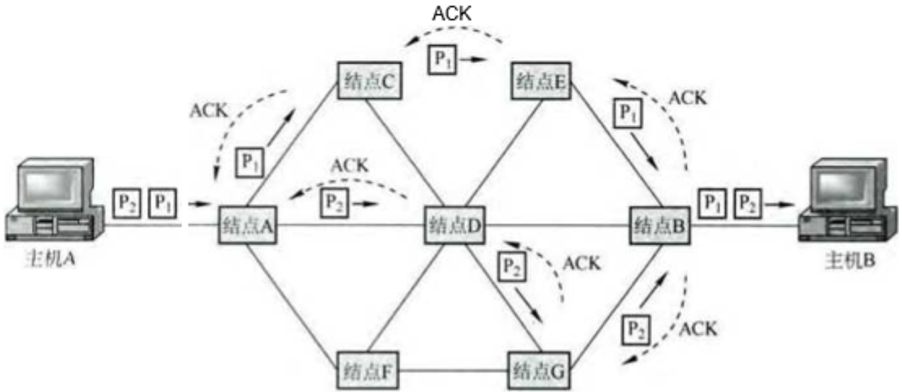
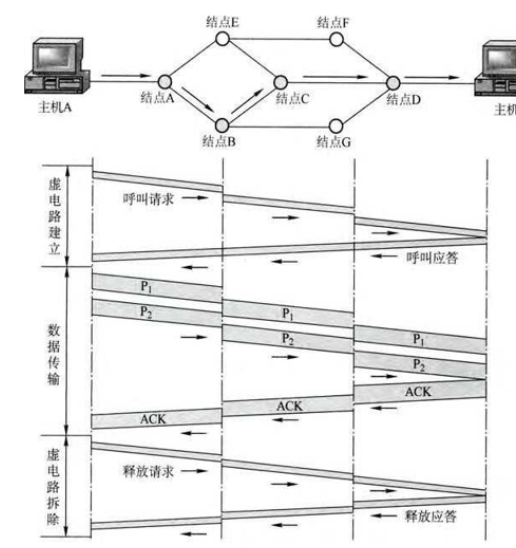
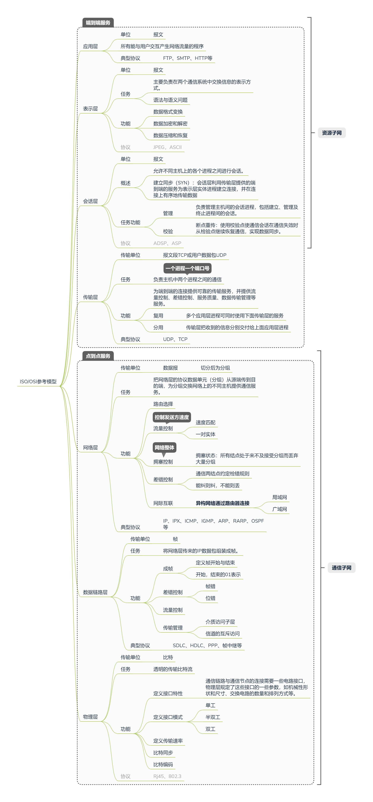
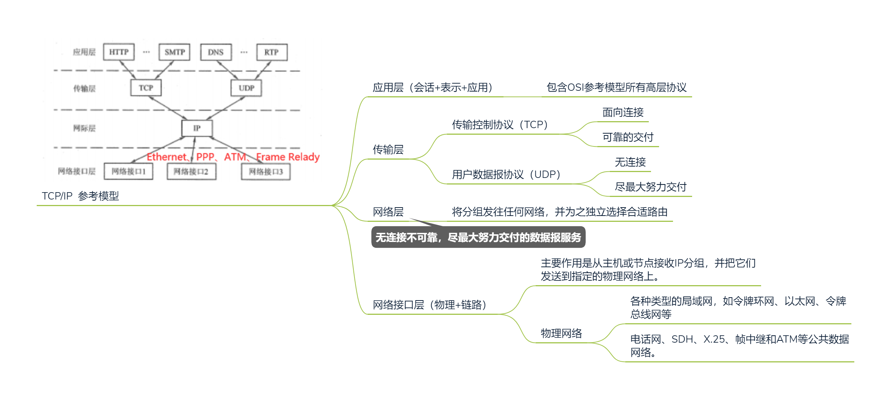
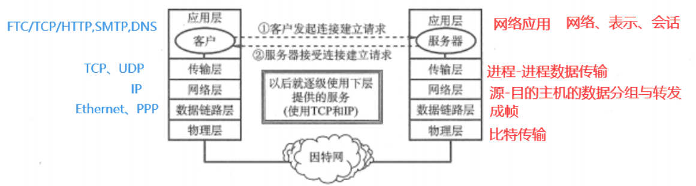
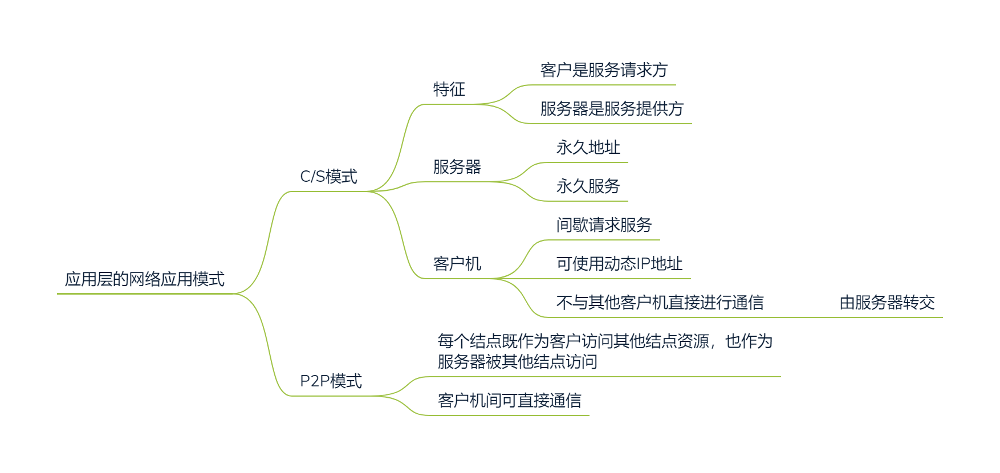

>   数据结构是内功在所有计算机软件中都会涉及，组成原理研究一台计算机怎么组织工作，操作系统研究怎么分配资源，计算机网络研究计算机间的信息交换。
>
>   先讨论网络的概念，再延伸到计算机网络

<!--more-->

# 1. 计网总述

## 1.1 概述

### 1.1.1 *标准化工作及相关组织

#### 标准化工作

1.  因特网草案
2.  建议标准(RFC)
3.  草案标准
4.  因特网标准

所有标准都以RFC形式发布

#### 主要的标准化组织

-   国际标准化组织ISO
-   国际电信联盟ITU
-   国际电气电子工程协会IEEE
-   因特网相关标准制定 IETF

### 1.1.2 功能

1.  数据通信
2.  资源共享
3.  提高可靠性
4.  负载均衡
5.  分布式处理

### 1.1.3 **性能指标**

#### 带宽(理论最大值)

>   表示网络的通信线路**最大**所能传送数据的能力，“最高数据率”

单位：bit/s

#### 吞吐量

>   单位时间内通过**整个通路**(整个网络、信道、端口...)的数据量

吞吐量(实际数据量) < 带宽(理论最大值)

#### 速率

>   网络上的主机在**某个信道上**传输数据的速率

单位：bps bit/s

#### 时延

>   数据(一个报文或分组)从网络(或链路)从一端传送到另一端的总时间

-   发送时延：发送端将分组的所有比特推向传输链路需要的时间

    $发送时延=\frac{分组长度}{信道宽度}$

-   传播时延：数据在信道中传播的时间

    $传播时延=\frac{信道长度}{传输速率}$

-   **往返时延RTT**：发送端发送数据开始，到接收到接收端的确认经历的时间

    $往返时延=2*传输时延$

一般忽略不计的时延

-   排队时延：分组进入路由器后，现在输入队列中排队等待处理
-   处理时延：数据在交换结点为存储转发而进行必要处理的花费的时间

#### 时延带宽积

>   在发送端发出第一个比特到接收端收到第一个数据时间里发送端连续发送的比特量

**链路上滞留的数据量**

$时延带宽积=传播时延\times 信道带宽$

## 1.2 网络的组成

### 1.2.1 概念组成部分

#### a. 硬件

-   主机（发送端，接收端系统）

-   通信链路（双绞线、光纤）
-   交换设备（交换器、路由器）
-   通信处理设备（网卡等）

#### b. 软件

实现资源共享的软件及方便用户使用的各种工具

#### c. 通信协议

>   **网络的核心**

### 1.2.2 功能组成部分

#### a. 通信子网

各种传输介质、通信设备和相关的网络协议，使得网络具有数据传输、存储、交换、控制功能

#### b. 资源子网

是实现资源共享功能的设备及其软件的集合，向网络用户提供共享其他计算机上的硬件、软件和数据资源

## 1.3 分类

### 1.3.1 根据分布范围

-   广域网（WAN）

    涉及交换技术、点对点网络

    广域网是因特网的核心

-   城域网（MAN）

    以太网

-   局域网（LAN）

    广播网络

-   个人区域网（PAN）

### 1.3.2 数据传输方式

根据是否采用**分组转发**和**路由机制**

-   广播式网络：网络中所有结点都能收到，目的地址匹配才会接收

-   点对点网络：只有目的结点才能收到，需要中间结点进行路由选择

### 1.3.3 拓扑结构

#### a. 星型网络

>   每个终端都用单独线路与中央设备相连
>
>   中央设备：交换机、路由器

优点：

-   便于集中控制和管理：端用户之间的通信必须经过中央设备

缺点：

-   成本高
-   可靠性差：中心结点对故障敏感

#### b. 总线型网络

>   用一根传输线路将计算机连接起来

优点：

-   便于组网
-   方便增减结点
-   节省线路

缺点

-   负载重时通信效率不高
-   总线上任意一处对故障敏感

#### c. 环状网络

>   所有计算机接口设备连接成一个环

特点

-   信号单向传输
-   令牌环网络

#### d. 网状网络

>   一般情况下，每个结点至少两条路径和其他结点链接

优点

-   可靠性高

缺点

-   控制复杂
-   线路成本高

多用于广域网中

### 1.3.4 交换技术

#### a. 电路交换网络

>   在进行数据传输前，两个结点必须先建立一条专用的物理线路（通信双方独占的线路，由通信双方间的交换设备和链路组成）。这一条通信线路在整个数据传输期间一直被独占，直至通信结束才释放。

传统电话网络就是典型的电路交换网络

分为三个阶段

1.  连接建立
2.  数据传输
3.  连接释放

优点

-   **通信时延小。**由于通信线路为通信双方专用，所以传输时延小，适用于传输大量数据

-   **有序传输。**不存在失序问题

-   适用范围广。既适用于模拟信号，也适用于数字信号传输

-   实时性强。通信双方间的物理通路一旦建立，双方可随时通信

-   控制简单

缺点

-   **建立连接时间长**。相对于计算机通信来说太长

-   **线路独占，信道利用率低**。
-   灵活性差。任何一点出现故障，必须重新建立连接
-   难以规格化。电路交换时，数据直达，不同类型、不同规格、不同速率的终端很难相互进行通信，也难以在通信过程中进行差错控制。

#### b. 报文交换网络

>   数据交换的单位是报文。
>
>   传输单位：报文
>
>   -   目标地址
>   -   源地址
>
>   传输方式：存储转发

电报通信网是典型的报文交换网络。

优点

-   无需建立连接。无连接建立时延

-   动态分配线路。当发送方把报文交给交换设备时，交换设备先存储整个报文，然后选择一条合适的路径传输数据

-   信道可靠新高。某条传输路径出现故障，可重新规划选择路径

-   信道利用率高。

-   提供多目标服务。一个报文可以同时发送给多个目的地址

缺点

-   产生转发时延。报文进入交换节点后，要经历存储、转发这一过程（接收报文、检验正确性、排队、发送时延）
-   消耗网络结点存储空间。

#### c. 分组交换

>   限制每次传输的数据块上限，网络结点根据控制信息把分组传送到下一结点。下一结点接收到分组后，暂时保存并排队等待传输，根据分组控制信息选择下一结点
>
>   传输单位：分组(Packet)
>
>   -   数据块
>   -   控制信息：源地址、目标地址、编号
>
>   传输方式：存储转发

优点：

-   无建立时延。
-   线路利用率高
-   简化存储管理（相对于报文交换）。分组长度固定，交换节点的缓冲区大小也固定
-   加速传输。同一报文的多个分组可以并行传输
-   减少出错概率和重发代价

缺点：

-   存在传输时延。

-   对交换结点的处理能力要求更高

-   需要传输额外的信息。每个小数据块要加上分组信息

-   可能出现失序、丢失、重复分组现象。接收端需对分组按编号进行排序

    虚电路，无失序，但存在呼叫建立，数据传输和电路释放过程

##### 分组交换网络分类

###### 数据报（无连接）

>   数据报的拆分：将通信子网用户的端系统发送的报文，根据协议拆分成若干分组，并在网络层加上地址、编号等控制信息后形成数据报分组
>
>   中间结点存储转发：中间结点存储分组一段时间，找到最佳路由后，尽快转发分组
>
>   -   分组可以走不同路径，也可按不同顺序到达目的结点

**传输过程**

1.  主机A将分组逐个发往与他直接相连的交换结点，交换结点缓存接收到的分组
2.  交换结点查找自己的转发表。
3.  网络中的其他结点收到分组后，类似转发分组

**特点**

1.  发送分组前不需要建立连接。发送方随时发送，结点随时接收

2.  收发双方不独占链路，信道利用率高

3.  尽最大努力交付，传输不保证可靠性。

4.  发送的分组要包含发送端和接收端的完整地址，以便独立传输

5.  分组在交换结点存储转发时，需要排队等待，带来一定的时延

    若当前交换结点通信量大或网络发生阻塞时，会根据情况丢弃分组

6.  对故障适应能力强：当某一链路出现故障，可相应更新转发表

###### 虚电路（面向连接）

数据报方式与电路交换方式结合

>   在分组发送前，在发送方和接收方建立一条逻辑上相连的虚电路
>
>   -   连接一旦建立，就固定了虚电路对应的物理路径
>
>   端系统每次建立虚电路时，选择一个未使用的虚电路号（区别本系统中的其他虚电路）。
>
>   分组的控制信息：分组号，源地址、校验信息，虚电路号等
>
>   虚电路网络中的每个中间结点：维护一张虚电路表，表项记录了打开的虚电路信息（接收链路和发送链路上的虚电路号 、前一节点、后一结点标识）
>
>   -   在数据传输过程中动态维护虚电路表

分为三个阶段：

1.  虚电路建立
2.  数据传输
3.  虚电路释放

步骤：

1.  主机A发出 *呼叫请求分组* ，主机B同意请求，发送 *呼叫应答分组* 予以确认
2.  虚电路建立后，主机A与主机B进行数据传输
3.  传送结束后，主机A通过发送 *释放请求分组* 来拆除虚电路，逐段断开整个连接

特点：

-   虚电路链路的建立和拆除需要时间，不适用于少量短分组，但对于长时间、频繁的数据交换效率高

-   虚电路了的路由选择体现在连接建立阶段

-   提供可靠的通信功能，保证每个分组有序到达

    具有流量控制功能，当接受方来不及接受数据时，可以通知发送方暂缓发送

-   对故障敏感。当已建立的链接某个结点或链路出现故障，则需要重新建立链接

-   分组首地址不包含目的地址，相对数据报方式开销小

##### 两种分组交换对比

<!-- prettier-ignore-start -->

|                    | 数据报服务                                 | 虚电路服务                                               |
| ------------------ | ------------------------------------------ | -------------------------------------------------------- |
| 连接建立           | 不需要                                     | 需要                                                     |
| 目的地址           | 每个分组保存完整目的地址                   | 仅在建立连接阶段使用，之后每个分组使用长度较短的虚电路号 |
| 路由选择           | 每个分组独立进行路由选择和转发             | 属于同一虚电路的分组按同一路由转发                       |
| 分组顺序           | 不保证分组的有序到达                       | 保证分组的有序到达                                       |
| 可靠性             | 不保证可靠通信，由主机保证                 | 保证可靠通信                                             |
| 对网络故障的敏感度 | 可选择未出故障的结点和链路                 | 所有经过故障结点的虚电路都不能工作                       |
| 差错处理和流量控制 | 用户主机进行流量控制，不保证数据报的可靠性 | 可由分组交换网负责                                       |

<!-- prettier-ignore-end -->

### 1.3.5 传输介质

-   有线网络

    双绞线、同轴电缆

-   无限网络

    蓝牙、微波、无线电等

### 同步异步

#### a. 同步通信

>   通信双方必须先建立同步，即双方的时钟要调整到一个频率。不停地发送和接收连续的同步比特流

#### b. 异步通信

>   在发送数据时，数据间的间隔是任意的。但接收端必须随时做好接收的准备。
>
>   发送端在任意时刻开始发送数据，因此必须增加开始位和结束位，以便接收端能找出一个数据的开始

## 1.4 计网体系结构

>   计算机网络体系结构：网络各层及其协议集合

### 1.4.1 \*分层原则

-   低耦合：各层都实现一种相对独立的功能，降低大系统的复杂度
-   界面清晰：各层之间界面自然清晰，易于理解，相互交流尽可能少
-   类似Java接口，定义独立于实现：各层功能的精确定义独立于具体的实现方法，可以采用最合适的技术来实现。
-   下层对上层透明，上层单向使用下层功能
-   促进标准化工作

### 1.4.2 层次结构

#### a. 相关概念

>   实体：任何可发送或接收信息的硬件或软件进程
>
>   对等层：不同机器上的同一层
>
>   对等实体：同一层上的实体
>
>   每一层都有自己要传送的数据单元，其名称、大小、含义也不同

---

>计算机网络中的报文——协议数据单元（PDU）：服务数据单元（SDU）+协议控制信息（PCI）

---

**计网中的三个重要概念**

>   服务：
>
>   下层为紧邻的上层提供功能调用（**垂直**）
>
>   分类：
>
>   -   面向连接服务和无连接服务
>   -   可靠服务和不可靠服务
>   -   有应答服务和无应答服务

---

>   协议：
>
>   1.  控制两个**对等实体(水平)**进行通讯的规则集合
>       -   语法：规定传输数据的格式
>       -   语义：规定要完成的功能（合适发出控制信息、完成何种控制动作、做出何种应答）
>       -   同步：规定执行操作的条件、时序关系（动作实现顺序的详细说明）
>
>   2.  下层协议对上层的服务用户是透明的

---

>   接口（服务接入点SAP）：
>
>   同一结点内相邻两层间交换信息的连接点

#### b. 层次的含义

1.  最高层面向用户提供服务，中间各层既是下一层服务的使用者又是上一层服务的提供者，最底层只提供服务是整个层次结构的基础

2.  相邻两层（不能跨层）

    上层通过接口单向调用下层服务，进而实现本层服务

    下层服务的实现细节对上层透明

    本层向上层提供服务（本层及其下各层的功能总和）

3.  两主机通信时，对等层在逻辑上有一条直接信道

### 1.4.3 参考模型

#### a. ISO/OSI参考模型

>   开放系统互联网络 参考模型Open System Interconnection Reference Model

#### b. TCP/IP参考模型

>   传输控制协议/网际互连协议 Transmission Controll Protocal /Internet Protocal

#### OSI与TCP/IP对比

**相同点**

1.  采用层次结构，各层功能大体相似。将庞大、复杂问题划分成若干范围小、简单的问题
2.  基于独立的协议栈
3.  可以解决异构网络互联。实现不同厂家生产的网络设备间的通信

**不同点**

1.  OSI精确定义服务、协议、接口概念。符合面向对象程序设计思想，TCP/IP没有明确区分

2.  OSI产生于协议发明前，通用性好

    TCP/IP 先出现协议，不会出现协议不能匹配模型情况，但不适用与非TCP/IP协议栈

3.  TCP/IP将IP协议作为单独一层，OSI在网络层下划分一个子层完成IP协议类似的功能

4.  TCP/IP，由于异构网的存在，所以网络层只有无连接，端到端通信的可靠性问题只在传输层解决

    |        | OSI             | TCP/IP          |
    | ------ | --------------- | --------------- |
    | 传输层 | 面向连接        | 无连接+面向连接 |
    | 网络层 | 无连接+面向连接 | 无连接          |

#### c. 五层模型

