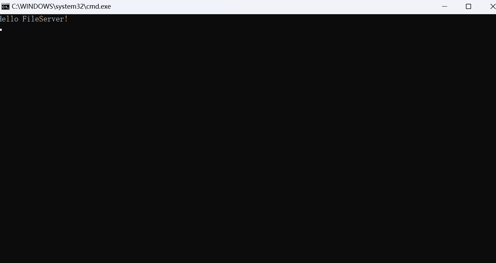
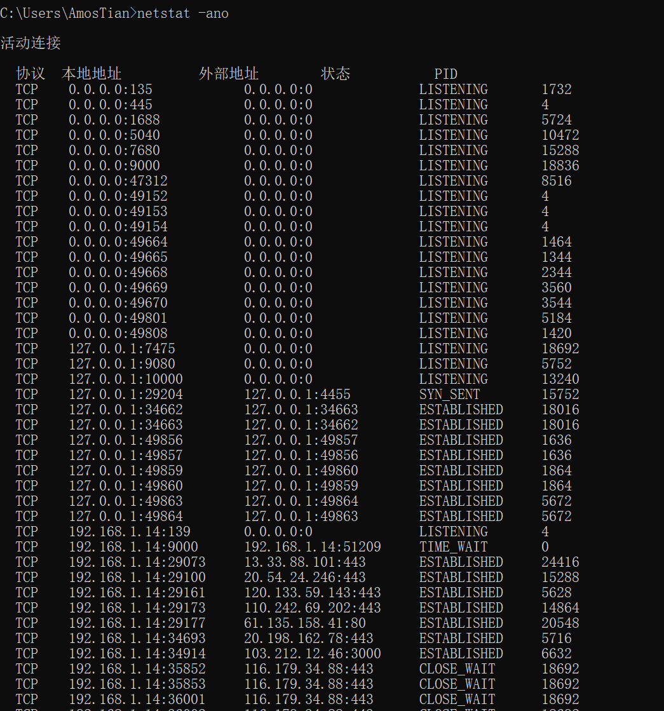
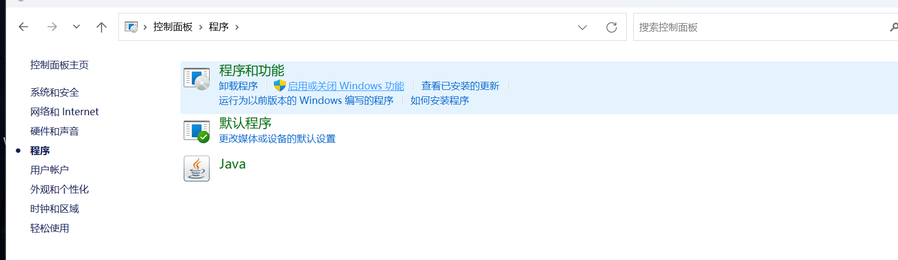
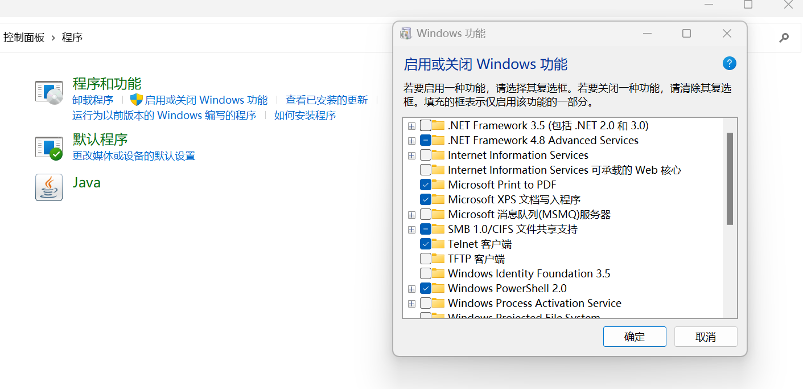
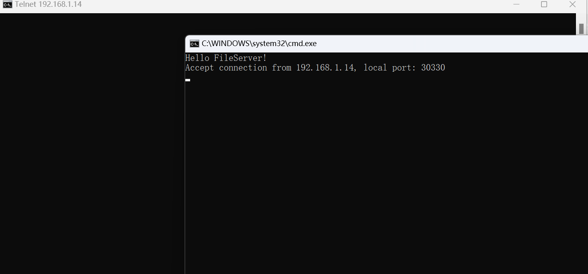

> 客户端程序

<!--more-->


## 编码

### 服务端连接程序

```cpp
#include <iostream>
#include <WinSock2.h>
#include <map>
#include <cstring>
using namespace std;
#pragma comment(lib,"ws2_32.lib")
DWORD WINAPI UserThread(LPVOID lpParameter);
bool SendFileData(SOCKET s,const char *fileName);

struct Client {
	SOCKET sock;
	char ip[16];
	unsigned short port;
	Client():sock(INVALID_SOCKET){}
	Client(SOCKET _s,const char *_ip,unsigned short _port):sock(_s),port(_port){
		strcpy(ip, _ip);
	}
};

map<SOCKET, Client> cmap; //全局的map

int main(int argc, char** argv) {
	cout << "Hello FileServer!\n";
	WSADATA wsa;
	//启动WSA
	int code = WSAStartup(MAKEWORD(2, 0), &wsa);
	if (code != 0) {
		return 1001;
	}
	//通过WSA创建套接字
	SOCKET sock = socket(AF_INET, SOCK_STREAM, IPPROTO_TCP);
	if (INVALID_SOCKET == sock) {
		WSACleanup();  
		return 1002;
	}
	//设置套接字属性
	unsigned short port = 9000;
	sockaddr_in serverAddr;
	memset(&serverAddr, 0, sizeof(serverAddr));
	serverAddr.sin_family = AF_INET;
	serverAddr.sin_addr.S_un.S_addr = INADDR_ANY; // 0 表示本机的全部IP地址
	serverAddr.sin_port = htons(port);
	code = bind(sock, (sockaddr*)&serverAddr, sizeof(serverAddr));//将端口与套接字绑定
	if (SOCKET_ERROR == code) {
		cout << "bind error!\n";
		closesocket(sock); WSACleanup(); return 1003;
	}

	code = listen(sock, SOMAXCONN);
	if (SOCKET_ERROR == code) {
		cout << "listen error!\n";
		closesocket(sock); WSACleanup(); return 1004;
	}

	SOCKET cs;
	sockaddr_in sd;
	bool flag = true;
	int len;
	while(flag){
		len = sizeof(sd);
		cs = accept(sock, (sockaddr*)&sd, &len);//返回一个用来和客户端连接的新套接字
		//addr表示客户套接字结构，len表示套接字长度
		if (INVALID_SOCKET == cs) { 
			cout << "accept failed!\n"; ::Sleep(2000); continue;
		}
		//显示请求客户端套接字
		printf("Accept connection from %s, local port: %u\n", inet_ntoa(sd.sin_addr), ntohs(sd.sin_port));
		Client client(cs, inet_ntoa(sd.sin_addr), ntohs(sd.sin_port));
		cmap[cs] = client;
		DWORD tid;
		CreateThread(0, 0, UserThread, (LPVOID)cs, 0, &tid);
	}

	closesocket(sock);
	WSACleanup();
	return 0;
}
DWORD WINAPI UserThread(LPVOID lpParameter) {
	SOCKET s = (SOCKET)lpParameter;
	bool flag = true;
	char buf[4096];
	int result;
	while (flag) {
		result = recv(s, buf, sizeof(buf), 0);
		if (SOCKET_ERROR == result) {
			//关闭这个套接字，从cmap中清除相关信息,结束线程
			closesocket(s);
			cmap.erase(s);
			flag = false;
			continue;
		} else if (0 == result) { //对方关闭了套接字
			closesocket(s);
			cmap.erase(s);
			flag = false;
			continue;
		} else {
			//要求客户端发送字符串
			buf[result] = '\0';
			Client c = cmap[s];
			if(INVALID_SOCKET == c.sock){
				cmap.erase(s);	flag = false;  continue;
			}
			printf("%s:%u => %s\n", c.ip, c.port, buf);
			if (strcmp(buf, "quit")) {
				closesocket(s);	cmap.erase(s);	flag = false; continue;
			}
			SendFileData(s, buf); //buf中只有主文件名，不含路径
		}
	}
	return 0;
}

bool SendFileData(SOCKET s, const char *fileName) {
	char path[512] = "D:\\fserver\\";
	strcat(path, fileName);
	FILE *fp = fopen(path, "rb");
	if (fp == NULL) {
		fp = fopen("D:\\fserver\\error.txt", "rb");
	}
	char buf[1024];
	int count;
	while((count=fread(buf,sizeof(char),sizeof(buf)/sizeof(char),fp))>0) {
		int offset=0;
		while (offset < count) {
			int k = send(s, buf+offset, count-offset, 0);
			offset += k;
			if (SOCKET_ERROR == k) {
				goto endsend;
			}
		}	
	}
endsend:
	fclose(fp);
	//closesocket(s); //用户获取一个文件后，服务器主动关闭连接
	//cmap.erase(s);
	return true;
}

```

### 启动服务器端监听：

```shell
netstat -ano #查看服务器列表
```





### 启动 `telnet` 客户端

控制面板





### telnet连接服务器端

```shell\
telnet 192.168.1.14 9000
```



