>   各层要实现的功能以及为实现这些功能指定的协议

<!--more-->

# 3. 链路层

>   链路：从一个结点到相邻结点的一段物理线路
>
>   数据链路：将实现协议的硬件和软件加到连路上构成数据链路
>
>   -   通信协议控制在链路上的数据传输

## 3.1 链路层功能

### 3.1.1 为网络层服务

提供三种服务

-   无确认的无连接服务

-   有确认的无连接服务

-   有确认的有连接服务

    有连接就一定要确认

### 3.1.2 链路管理

>   用于面向连接的服务，数据链路连接建立、维持和释放的过程

### 3.1.3 组帧、帧同步、透明传输

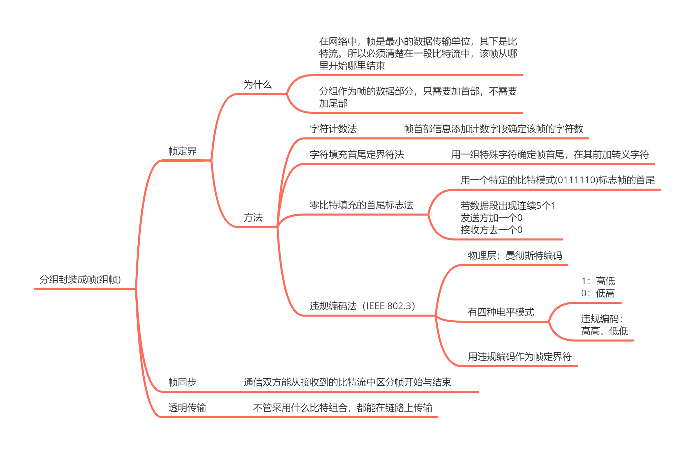

### 3.1.4 差错控制

>   **保证每一帧有且仅有一次正确地交付给接收方**

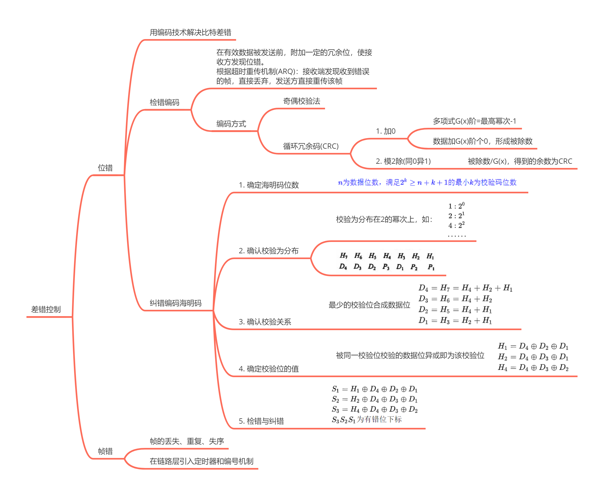

### 3.1.5 流量控制

>   限制发送方的数据流量，使其发送速率不超过接收方的接收能力
>
>   -   链路层：控制两结点间数据链路上的流量
>   -   运输层：从源端到目的端间的流量

流量控制需要反馈机制的支持，即发送方需知道什么情况下可以接着发送下一帧，什么情况下暂停发送等待反馈信息

#### 可靠传输

>   可靠传输：发送端发送啥，接收端接收啥
>
>   链路层的可靠传输与差错控制、流量控制是交织在一起的
>
>   -   在计算机网络中，数据的传输过程可能引起数据的丢失，出错等，因此一个可靠传输需要实现差错控制，确认和自动重传请求是实现差错控制的机制

确认：接收方向发送方反馈接收到正确的帧

超时重传：发一个帧启动相应的计时器，超时为收到确认，则发送方重发该帧

自动重传请求（ARQ）：接收方请求发送方重发出错帧的机制

### 3.1.6 介质访问控制

>   为使用介质的每个结点隔离同一信道上其他结点传输的信号

信道划分：把原来的一条广播信道，逻辑上分为几条用于结点间通信的互不干扰的信道

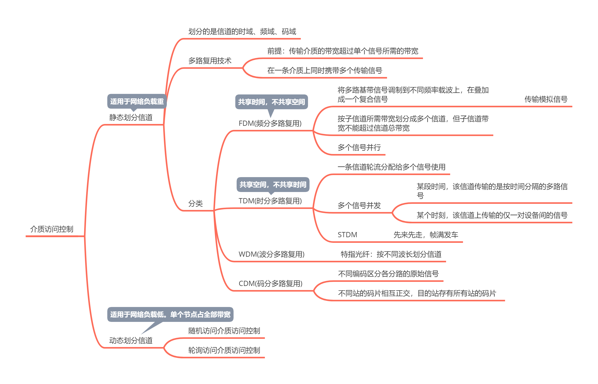

## 3.2 流量控制

>   流量控制基本基本方法是由接收方控制发送方的速率

### 3.2.1 原理

#### a. 停止-等待流量控制基本原理

发送方每发送一帧，都要等待接收方的应答信号，才能发送下一帧；接受方收到一帧，发送一个反馈信号，表示可以接受下一帧

#### b. 滑动窗口

>   发送窗口：发送方维护着一组连续的允许发送的帧的序号
>
>   接受窗口：接收方维护着一组连续的允许接受的帧的序号

发送方行为

-   发送方有可以发送的帧，才能发送
-   发送方每收到一个确认帧，发送窗口就向前滑一个帧
-   当发送窗口内没有可以发送的帧，发送方会停止发送，等待确认帧

接收方行为

-   接收方收到帧后，将窗口前移一，并发回确认帧

-   在接收方，落在接收窗口外的帧会被丢弃

**性质**

-   接收窗口为1时，可保证有序接收
-   在链路层的滑动窗口协议中，窗口大小是固定的

### 3.2.2 协议

#### a. 停等协议(单帧滑动窗口)

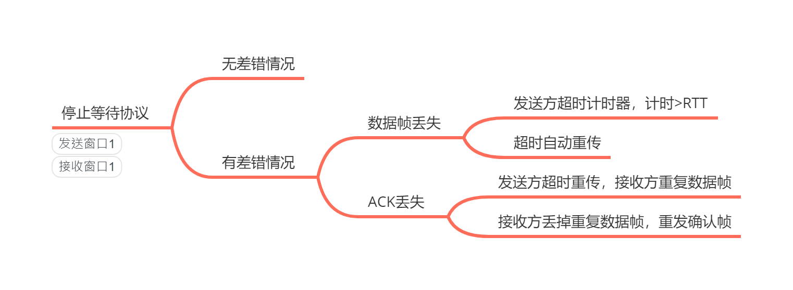

适用于网络传输可靠性差且分组易丢失的情况

#### b. 后退N帧协议GBN

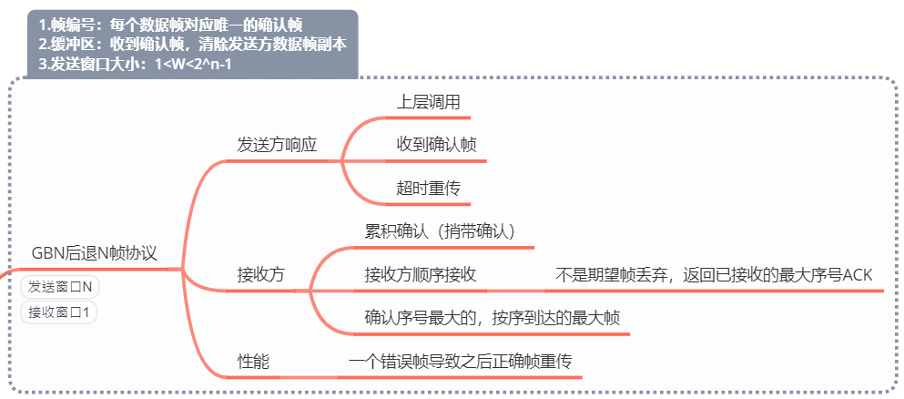

发送窗口大小 $1\le W_T \le 2^n-1$

-   帧的编号为 n bit，假设发送窗口大小为 $2^n$，当收到 $ACK_0$ 时，无法确认是首部的0号帧还是尾部的0号帧

#### c. 选择重传协议SR

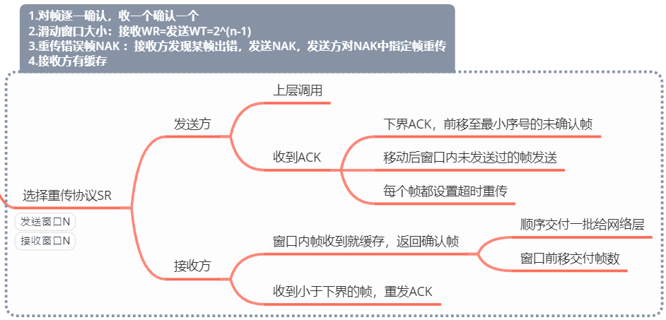

$接收窗口W_R+发送窗口W_T\le 2^n$ ，且 $接收窗口W_R\le 发送窗口W_T$ 发送窗口在接收窗口更新后才更新，故一般情况 $W_R=W_T$

#### 性能指标

$发送周期=发送时延+RTT$ ：开始发送数据到接收到第一个ACK

-   RTT：发送的数据的传播时延+ACK的传播时延

$信道利用率=\frac{发送时延}{发送周期}=\frac{\frac{发送数据量}{发送速率}}{发送周期}$ ：发送方在一个发送周期内发送数据的有效时间占发周期的比例

$信道吞吐率=信道利用率\times 发送方的发送速率$

$窗口数=\frac{发送周期}{单帧发送时延}$

## 3.3 介质访问控制

### 3.3.1 随机介质访问控制

>   介质由一个用户独占
>
>   胜者通过争用获得信道，从而获得发送信息的发送权

#### a. ALOHA协议

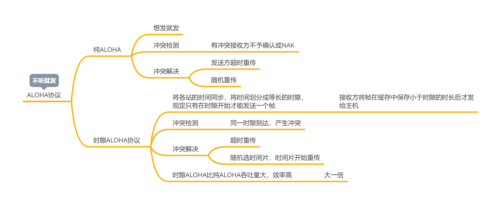

#### b. CSMA协议

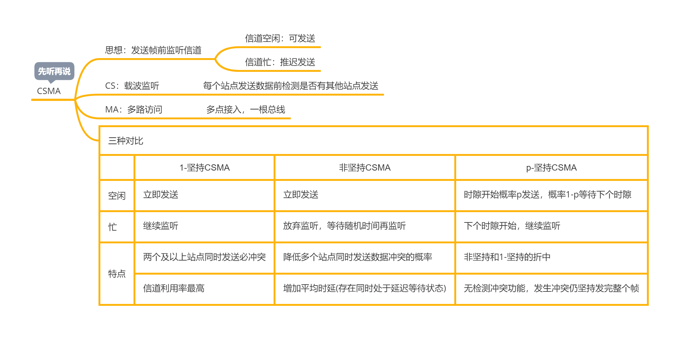

#### c. CSMA/CD
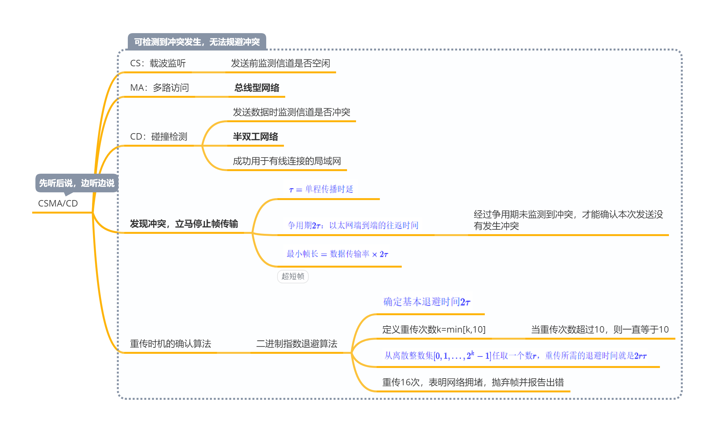

检测到冲突，立即停止发送

#### d. CSMA/CA

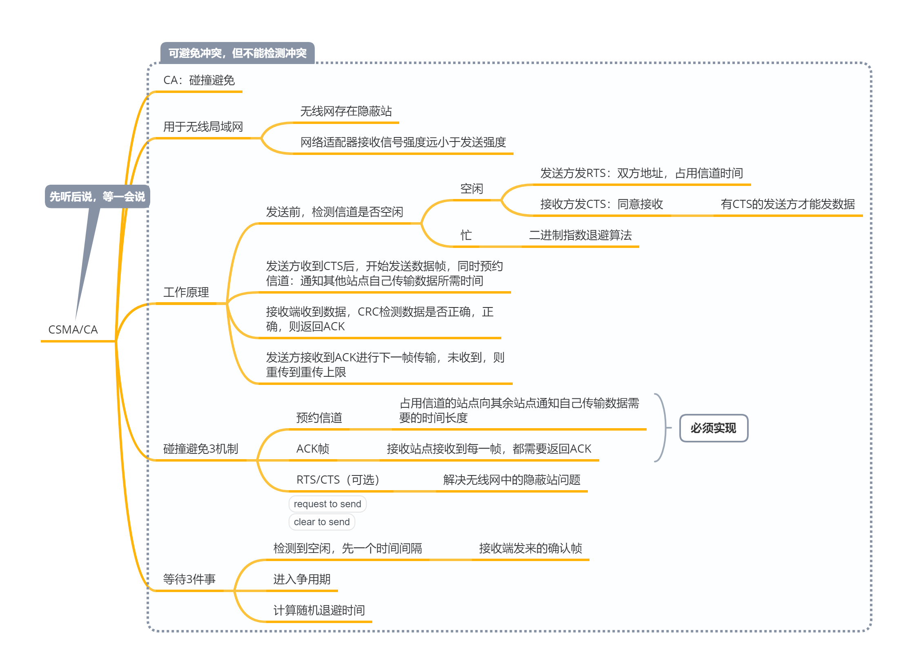

即使发生冲突，也要坚持发完

###  3.3.2 轮询介质访问控制

有差错检测，不产生冲突，独占带宽

## 3.4 局域网

### 3.4.1 局域网的概念

>   小范围，如一个学校一个公司，将各种计算机、外部设备和数据库系统通过连接介质互相连接起来

特点

-   一个单位拥有，地理范围和站点数都有限
-   所有站点共享总带宽
-   较低的时延和误码率
-   各站为平等关系
-   能进行广播和组播

分类：

-   以太网：802.3
-   令牌网：802.5
-   无线局域网：802.11

在IEEE802中，各结点间只有唯一的链路，不需要进行路由选择和流量控制，所以不设置网络层

#### a. 拓扑结构

星形

-   中心是控制中心，任两结点通信只需要两步
-   传输速度快
-   可靠性差
-   中心结点故障敏感

总线形

-   单点故障小
-   是常用的拓扑结构

环状结构

-   单点故障敏感

-   时延长

-   不便扩充

    拓扑建好，通信方向即确定

#### b. 传输介质

双绞线为主流传输介质；同轴电缆，光纤

#### c. 介质访问控制方式

总线形：CSMA/CD；令牌总线

环形：令牌环

### 3.4.2 IEEE802.3 

>   基带总线形局域网标准，描述MAC子层的实现方法
>
>   MAC子层：向上层屏蔽对物理层访问的差异，提供对物理层的同一访问接口

-   介质访问控制方式：CSMA/CD

-   信息以广播方式发送

-   无连接方式

-   尽最大努力交付数据，提供不可靠服务

    不对帧编号，不要求接收方发送确认

-   提供不可靠服务，尽最大努力交付

    只保证无差错接收，不提供流量控制

#### a. 以太网传输介质

xBASEy:

-   x表示传输速率，如10BASE表示10Mb/s
-   -T：对应UTP
-   -FL：光纤快啊FastLine(肯定不是这个含义，能记住就行)

| 参数     | 10BASE5      | 10BASE2      | 10BASE-T          | 100BASE-T                      | 10BASE-FL    | 10吉比特   |
| -------- | ------------ | ------------ | ----------------- | ------------------------------ | ------------ | ---------- |
| 传输介质 | 同轴电缆     | 同轴电缆     | UTP(非屏蔽双绞线) | STP双绞线                      | 光纤         | 光纤       |
| 拓扑结构 | 总线形       | 总线形       | 星形              | 星形                           | 点对点       |            |
| 编码方式 | 曼彻斯特编码 | 曼彻斯特编码 | 曼彻斯特编码      |                                | 曼彻斯特编码 |            |
|          |              |              |                   | 半双工:CSMA/CD 全双工不是 |              | 只有全双工 |

#### b. 网卡

>   用于主机与局域网的连接，网卡上装有处理器和存储器
>
>   网络适配器(Adapter)，网络接口卡(NIC)

功能

-   连接局域网、计算机和传输介质的接口
-   实现计算机与传输介质的物理连接和电信号匹配
-   组帧与拆帧
-   帧的发送与接收
-   介质访问控制
-   数据的编码解码（物理层性质，用于差错控制）
-   数据缓存（流量控制）

##### MAC地址

每块网卡都有唯一代码，**MAC地址48个bit** ：前24厂家地址

每个字节用 `-` 或 `:` 隔开：02-60-8c-e4-b1-21

以太网总线上是广播通信，网卡从网络上接收到一个帧，首先硬件检查MAC帧的目的MAC地址，若是本站的，则收下，不是则丢弃

#### c. 帧格式

MAC帧：前导码+以太网帧

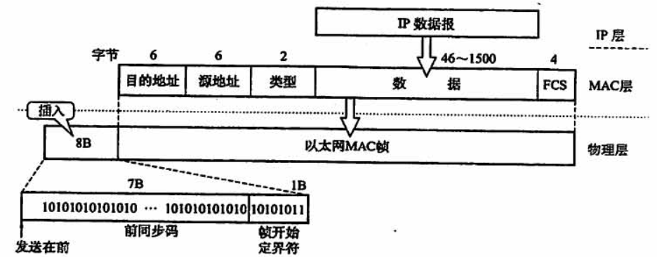

前导码

-   前：接收端与发送端时钟同步
-   后：帧开始定界符

MAC帧不需要帧结束定界符，以太网发送帧，各帧之间必须有一定间隙，所以其后到达的比特流一定属于一个MAC帧，不需要结束定界符

链路层上的以太网帧，必须加首部和尾部

---

地址字段(6+6B)：网卡的MAC地址

---

类型(2B)：指出数据域的数据交个哪个协议处理，网络层协议

---

数据(46-1500B)：

**最少46B**，由于CSMA/CD限制，以太网MAC帧数据部分最小为64B，最大1500B

---

校验码(4B):

目的地址+类型字段+数据字段，32位CRC校验

### 3.4.3 IEEE802.11

>   无线局域网的标准

介质访问控制：CSMA/CA

### 3.4.4 令牌环网

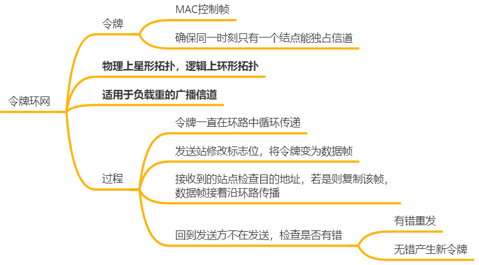

## 3.5 广域网

>   广域网是覆盖范围广长距离网络，任务是长距离运送主机发送的数据

组成：结点交换机+链路

讨论的两个问题

-   路由选择：搜索分组从某个结点到目的结点的最佳传输路由，构造路由表

-   分组转发：根据路由表构造转发表，通过转发表转发分组

### 3.5.1 与局域网异同

#### a. 联系

局域网通过广域网和另一个相隔很远的局域网通信，**广域网就是用交换机组成的更大的局域网**

广域网与局域网都是互联网的构件，从互联网角度，二者等价

连接到同一个局域网或广域网的主机在该网内通信时，只需使用其网络的物理地址

#### b. 区别

|          | 广域网                                                       | 局域网           |
| -------- | ------------------------------------------------------------ | ---------------- |
| 覆盖范围 | 很广，通常跨区域                                             | 较小             |
| 连接方式 | 结点间是点到点连接，通常一个广域网结点交换机和多个结点交换机连接 | 采用多点接入技术 |
| 通信方式 | 点对点                                                       | 广播式           |
| OSI层次  | 物理层，链路层，网络层                                       | 物理层，链路层   |
| 着重点   | 资源共享                                                     | 数据传输         |

### 3.5.2 协议

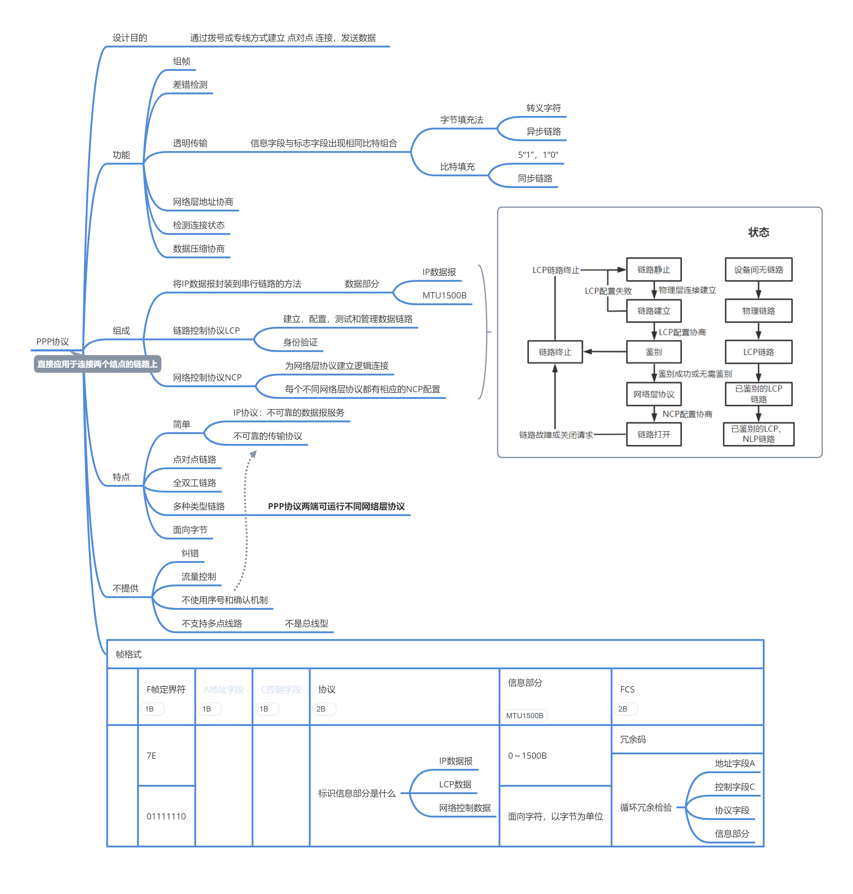

3P协议保证帧没有传输错，但不保证可靠传输

#### 3P协议与HDLC异同

相同点

- 都是全双工协议
- 透明传输
- 差错检测，无纠错

| 3P                                                           | HDLC                               |
| ------------------------------------------------------------ | ---------------------------------- |
| 面向字节                                                     | 面向字符                           |
| 有2B协议字段                                                 |                                    |
| 无帧编号 - 无确认机制 - 只保证无差错接收，端到端的差错检测由更高层负责 | 使用编号确认机制 实现可靠传输 |

## 3.6 链路层设备

### 3.6.1 冲突域与广播域

冲突域：同一冲突域中的每一个结点都能收到所有被发送的帧，即同一时间只能有一台设备发送的范围

广播域：同一广播域中的结点能收到任一设备发出的广播帧，即若一个站点发出一个广播信号，所有能收到这个信号的设备范围为一个广播域

### 3.6.2 网桥

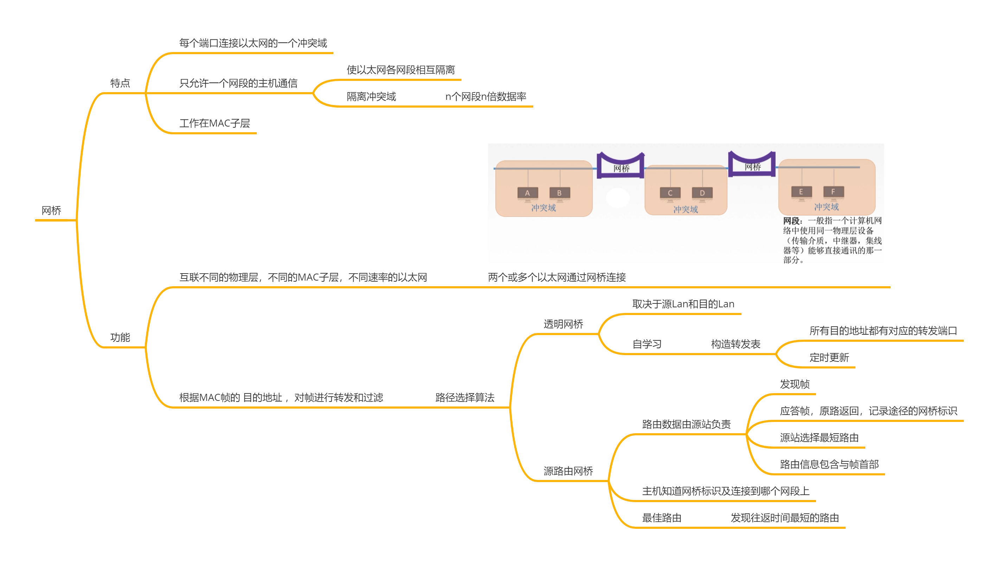

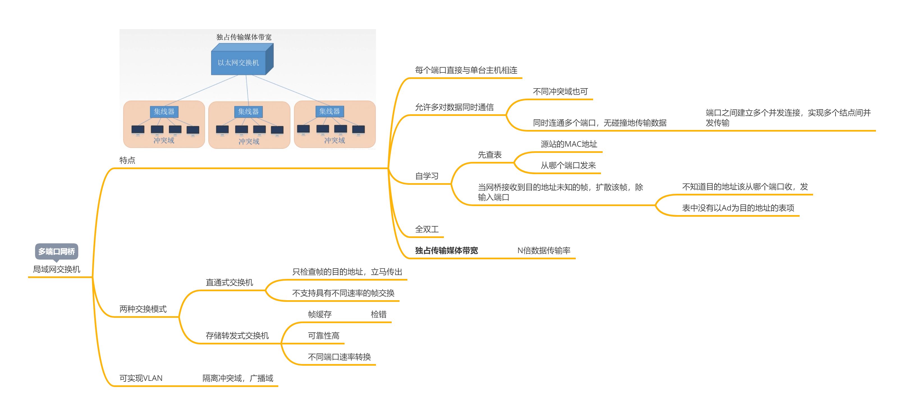