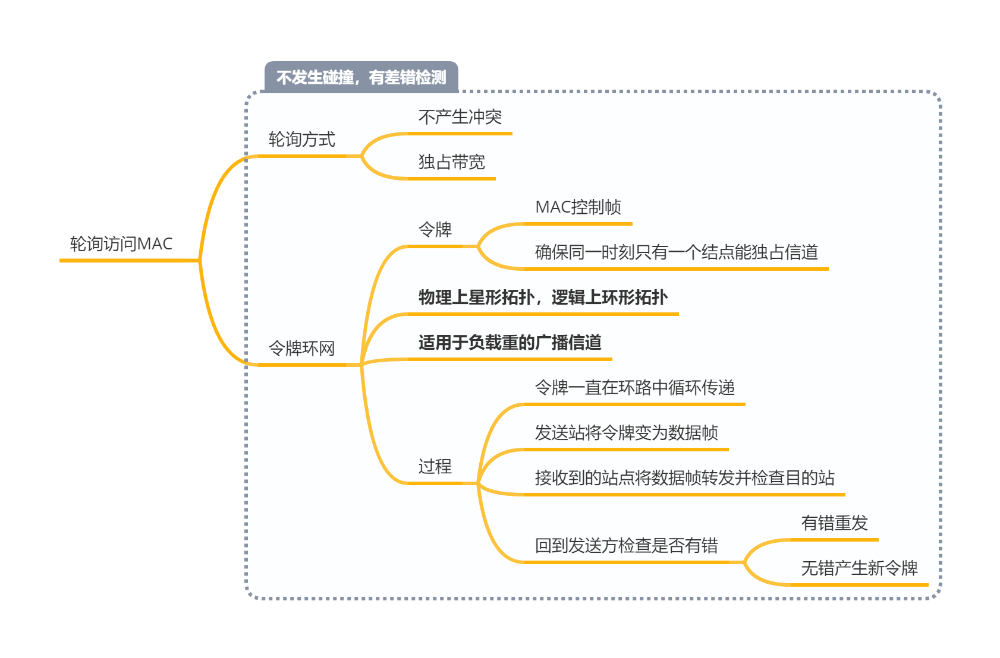

>   各层要实现的功能以及为实现这些功能指定的协议

<!--more-->

# 3. 链路层

>   链路：从一个结点到相邻结点的一段物理线路
>
>   数据链路：将实现协议的硬件和软件加到连路上构成数据链路
>
>   -   通信协议控制在链路上的数据传输

## 3.1 链路层功能

### 3.1.1 为网络层服务

提供三种服务

-   无确认的无连接服务

-   有确认的无连接服务

-   有确认的有连接服务

    有连接就一定要确认

### 3.1.2 链路管理

>   用于面向连接的服务，数据链路连接建立、维持和释放的过程

### 3.1.3 组帧、帧同步、透明传输

.png)

### 3.1.4 差错控制

>   **保证每一帧有且仅有一次正确地交付给接收方**

### 3.1.5 流量控制

>   限制发送方的数据流量，使其发送速率不超过接收方的接收能力
>
>   -   链路层：控制两结点间数据链路上的流量
>   -   运输层：从源端到目的端间的流量

流量控制需要反馈机制的支持，即发送方需知道什么情况下可以接着发送下一帧，什么情况下暂停发送等待反馈信息

#### 可靠传输

>   可靠传输：发送端发送啥，接收端接收啥
>
>   链路层的可靠传输与流量控制是交织在一起的

确认：接收方向发送方反馈接收到正确的帧

超时重传：发一个帧启动相应的计时器，超时为收到确认，则发送方重发该帧

自动重传请求（ARQ）：接收方请求发送方重发出错帧的机制

### 3.1.6 介质访问控制

>   为使用介质的每个结点隔离同一信道上其他结点传输的信号

信道划分：把原来的一条广播信道，逻辑上分为几条用于结点间通信的互不干扰的信道

## 3.2 流量控制

>   流量控制基本基本方法是由接收方控制发送方的速率

### 3.2.1 原理

#### a. 停止-等待流量控制基本原理

发送方每发送一帧，都要等待接收方的应答信号，才能发送下一帧；接受方收到一帧，发送一个反馈信号，表示可以接受下一帧

#### b. 滑动窗口

>   发送窗口：发送方维护着一组连续的允许发送的帧的序号
>
>   接受窗口：接收方维护着一组连续的允许接受的帧的序号

发送方行为

-   发送方有可以发送的帧，才能发送
-   发送方每收到一个确认帧，发送窗口就向前滑一个帧
-   当发送窗口内没有可以发送的帧，发送方会停止发送，等待确认帧

接收方行为

-   接收方收到帧后，将窗口前移一，并发回确认帧

-   在接收方，落在接收窗口外的帧会被丢弃

**性质**

-   接收窗口为1时，可保证有序接收
-   在链路层的滑动窗口协议中，窗口大小是固定的

### 3.2.2 协议

#### a. 停等协议(单帧滑动窗口)

#### b. 后退N帧协议GBN

发送窗口大小 $1\le W_T \le 2^n-1$

-   帧的编号为 n bit，假设发送窗口大小为 $2^n$，当收到 $ACK_0$ 时，无法确认是首部的0号帧还是尾部的0号帧

#### c. 选择重传协议SR

$接收窗口W_R+发送窗口W_T\le 2^n$ ，且 $接收窗口W_R\le 发送窗口W_T$ 发送窗口在接收窗口更新后才更新，故一般情况 $W_R=W_T$

#### 性能指标

$发送周期=发送时延+RTT$ ：开始发送数据到接收到第一个ACK

-   RTT：发送的数据的传播时延+ACK的传播时延

$信道利用率=\frac{发送时延}{发送周期}=\frac{\frac{发送数据量}{发送速率}}{发送周期}$ ：发送方在一个发送周期内发送数据的有效时间占发周期的比例

$信道吞吐率=信道利用率\times 发送方的发送速率$

$窗口数=\frac{发送周期}{单帧发送时延}$

## 3.3 介质访问控制

### 3.3.1 随机介质访问控制

>   介质由一个用户独占
>
>   胜者通过争用获得信道，从而获得发送信息的发送权

#### a. ALOHA协议

#### b. CSMA协议

#### c. CSMA/CD

#### d. CSMA/CA

802.11

###  3.3.2 轮询介质访问控制

## 3.4 局域网

### 3.4.1 局域网的概念

