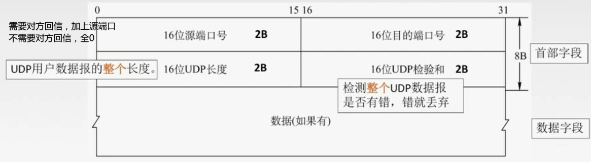
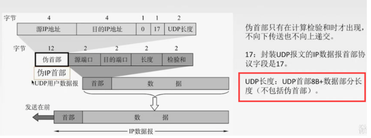
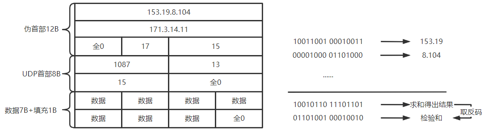
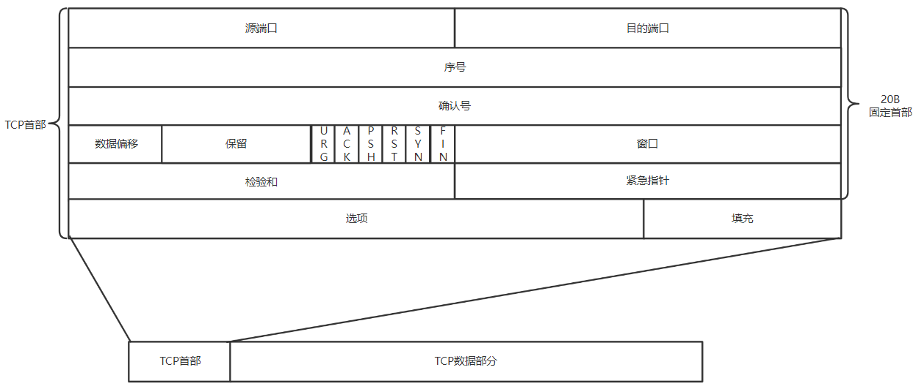
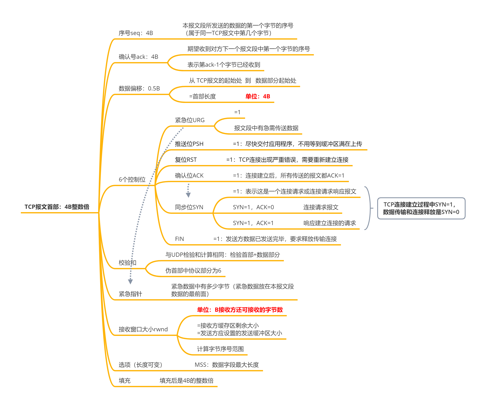
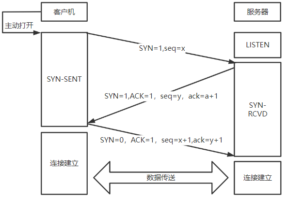
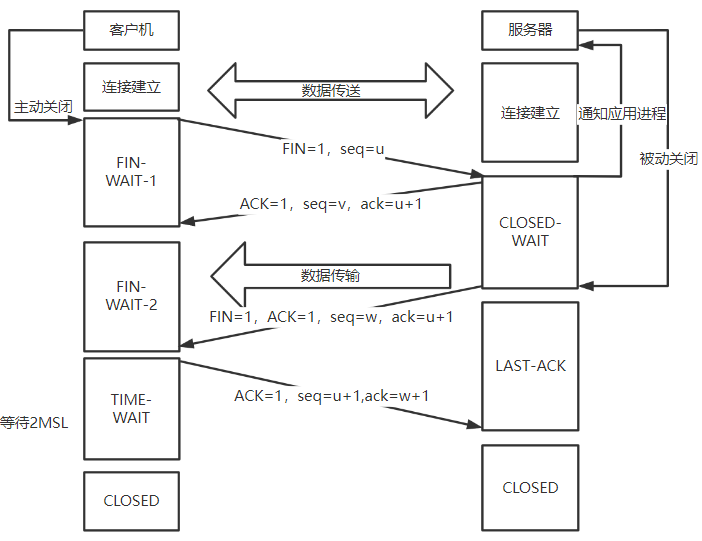
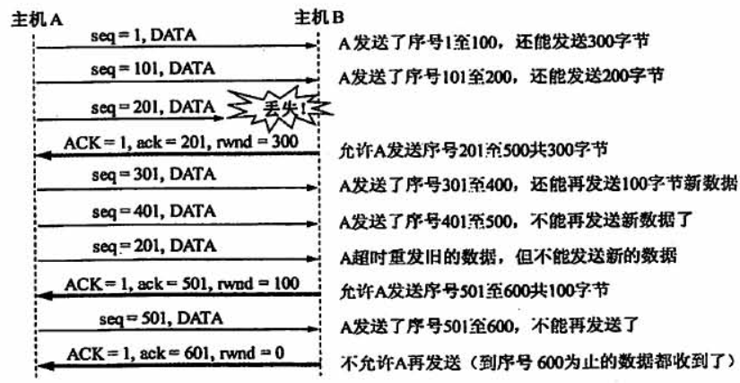
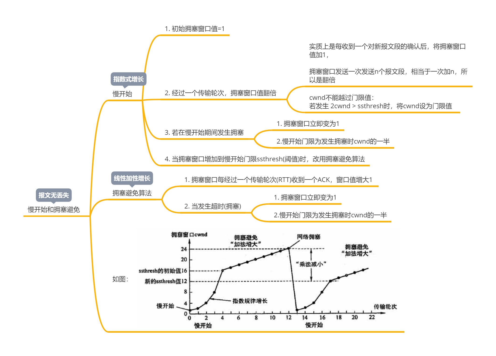
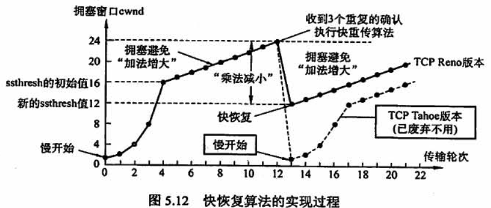

>   为运行在不同主机上的进程提供了逻辑通信
>
>   传输层提供 无连接服务和面向连接服务
>
>   为应用程序提供可靠的服务

<!--more-->

# 5. 传输层

## 5.1 传输层功能

1.  提供应用进程之间的逻辑通信（端到端的逻辑通信）

    应用进程看到的是两个实体之间有一条端到端的逻辑通信信道

2.  复用和分用

    复用：发送方不同应用进程可使用同一传输层协议传送数据

    分用：接收方的传输层在剥去报文的首部后能把这些数据正确交付到目的应用程序

3.  差错检测（首部+数据部分）

    网络层只检验首部

4.  提供两种不同服务：无连接服务和面向连接的服务

### 5.1.1 端口

#### a. 端口作用

-   通过端口让应用层的各种应用程序将数据交付给下层运输层
-   让运输层知道应该让其报文段中的数据向上通过端口交付给哪个应用程序进程

#### b. 端口号

端口号只识别本计算机应用层中的各进程

>   服务端使用的端口 $0-48\times 1024-1$

熟知端口

-   FTP：21
-   TFTP：69
-   TELNET(远程登录)：23
-   SMTP：25
-   DNS：53
-   HTTP：80
-   SNMP：161
-   POP3：110

>   客户使用的端口 $48\times 1024-2^{16}$

#### c. 套接字

>   在网络中采用发送方和接收方的套接字组合来识别端点

`{主机IP:端口号}` ：套接字表示一台主机和主机上的一个应用

### 5.1.2 无连接服务与面向连接服务

#### a. 面向连接服务

>   面向连接服务：通信双方通信前，需要建立连接，整个连接的情况一直被实时监控和管理。通信完成后释放连接

TCP：提供一条端到端的全双工可靠信道

-   不提供广播和多播服务
-   需要编号，确认，计时器，流量控制、拥塞控制、连接管理等保证可靠传输

TCP连接与网络层虚电路区别

-   TCP报文段在逻辑信道中传播，路由器不可见
-   虚电路是在路由器间建立的连接，各中间结点要保存虚电路的状态信息，且网络层一旦采用虚电路，则无法提供无连接服务

#### b. 无连接服务

>   无连接服务：指两个实体通信时，直接将信息发送到 “网络” 中，让该信息的传递在网上尽力送往目的地

UDP：提供无连接的不可靠信道

-   IP之上增加 多路复用 和 数据部分的错误检查

IP数据报与UDP数据报区别

-   IP数据报需要在网络层的路由器间存储转发
-   UDP数据报在端到端的逻辑信道中传播，UDP中的信息路由器看不到

## 5.2 UDP

>   适用于不可靠，无连接，时延小的网络环境，用与传输小文件
>
>   如：TFTP、DNS、SNMP

### 5.2.1 特点

1.  无连接：减少开销和发送数据之前的时延

2.  不可靠服务：最大努力交付

3.  面向报文：应用层要传送的数据一次性完整发完

    适用于一次性传输少量数据

4.  适用于实时应用

5.  UDP首部长度8B

### 5.2.2 UDP报文格式

端口号范围为 $0-2^{16}-1$ ，所以端口号长度为16位

-   分用时，若找不到对应的目的端口号，则丢弃报文，发送 `ICMP端口不可达` 报文

UDP长度：首部+数据部分（不包括伪首部）

#### 检验和的计算

**发送端**

1.  填上伪首部
2.  全0填充检验和字段
3.  **全0填充数据部分，使长度变为4B的整数倍**
4.  伪首部+首部+数据部分采用二进制反码求和
5.  把求得的结果取反码即为检验和

**接收端**

1.  填上伪首部
2.  伪首部+首部+数据部分采用二进制反码求和
3.  结果全1则无差错，否则丢弃数据报，或向应用层附上出错报告

## 5.3 TCP

>   保证目的主机的进程收到正确的有序报文
>
>   适用于可靠、面向连接、可以接受时延大的网络环境
>
>   应用于：文本传输协议(FTP)、超文本传输协议（HTTP）、远程登录（TELNET）

### 5.3.1 特点

-   面向连接

-   点对点。不提供组播，多播

-   可靠交付：数据无差错，不丢失，不重复且有序

-   全双工通信

    发送缓存：发送应用程序准备发送的数据 与 TCP已经发送但尚未收到确认的数据

    接收缓存：按需到达且尚未被读取的数据 与 不按序到达的数据

-   面向字节流

    TCP将应用程序的交付视为一连串的无结构字节流

### 5.3.2 TCP报文格式

### 5.3.3 TCP连接管理

#### a. 概念

建立连接时采用C/S方式

-   客户机主动发起连接请求
-   服务端被动等待连接

---

TCP工作方式为全双工

---

TCP连接的两个端点：TCP连接的端口称为套接字(IP+端口号)

#### b. TCP连接分为三个阶段

**连接由客户机发起，客户机收尾**

`SYN` 表示建立同步请求，只有在建立连接的请求时才是1

`FIN` 表示连接释放请求，只有在释放连接的请求时才是1

`ACK=1`表示确认报文，所以这是同时会有期望的报文序号 `ack`

##### 三次握手

1.  客户端发送 `连接请求报文段` ，无应用层数据

    SYN=1 ，ACK=0，seq=x（随机），

2.  **服务器端为该TCP连接分配缓存和变量**；向客户端返回 `确认报文段` ，允许连接，无应用层数据

    SYN=1，ACK=1，ack=x+1，seq=y(随机)

3.  **客户端为该TCP连接分配缓存和变量**，并向服务器返回确认的确认，可以携带应用层数据

    SYN=0，ACK=1，seq = x+1，ack=y+1

##### 数据传送

##### 四次挥手

1.  客户端发送 `连接释放报文` ，停止发送数据，主动关闭TCP连接

    `FIN=1，seq=u`

2.  服务端回送一个 `确认报文段` ，客户到服务器这个方向的连接就释放了——进入 *半关闭状态*

    `ACK=1,seq=v，ack=u+1`

3.  服务端发完数据，就发出 `连接释放报文段` ，主动关闭TCP连接

    `FIN=1,ACK=1,seq=w,ack=u+1`

4.  客户端回送一个 `确认报文段` ，并等待一端时间 *2MSL(最大报文段寿命)* 后，连接关闭

    `ACK=1，seq=u+1,ack=w+1`

###### 注意

-   第二次挥手后，客户机到服务器的连接单向关闭，不能再向服务器传送数据报文

    服务器到客户机方向的连接此时还未关闭

-   最快3次挥手，第2,3次挥手可以合并

-   客户机等待2MSL进入CLOSED状态

    保证客户机发的确认报文段能到达服务器，若第四次挥手发出的确认报文若丢失，加上重发到达客户机最长需要2MSL

    防止 已失效的连接请求报文段，经过2MSL后，本次连接产生的所有报文段内从网络中消失

### 5.3.4 TCP可靠传输

可靠：保证接收方从缓冲区中读出的字节流和发送方发出的字节流完全一样

#### 1. 校验（差错控制）

#### 2. 编号——流量控制，有序性

>   为本次连接的每个字节编号

**seq：本报文段发送的数据部分的第一个字节 在 本次连接中的序号**

#### 3. 确认——有序

确认号ack：期望收到下一个报文段的数据部分第一个字节的序号

累计确认方式：只确认数据流中第一个丢失字节为止的字节序号

#### 4. 重传

-   超时重传：每发送一个报文段，就对这个报文段设置一次计时器，计时器设置的重传时间到期还未收到确认，则重传这一报文段

    超时重传时间由自适应算法确定：记录每个报文段的RTT，计算加权平均往返时间RTTs，超时重传时间应略大于RTTs

    超时重传存在的问题：超时周期太长

-   冗余ACK(快速重传)

    冗余ACK：发送方再次确认某个顺序到达的报文段的ACK

    每当收到比期望序号大的失序报文段，就发送一个冗余ACK

### 5.3.5 流量控制

>   基于滑动窗口的流量控制机制，动态调整发送方窗口大小

发送窗口取 接收窗口rwnd与拥塞窗口cwnd 最小值

---

TCP的流量控制与SR类似，对已经收到的有序报文进行累计确认

接收方收到的失序报文会存放到接收缓存中

---

1.  接收方通过确认报文段首部的窗口字段将 rwnd 通知给发送方

2.  当接收窗口 rwnd=0 后，发送方不可发送，重置持续计数器
    -   持续计数器：从收到rwnd=0的TCP报文段开始计时
3.  达到计时周期，发送一个rwnd=0的探测报文段到对方
4.  接收方收到后将当前rwnd加到报文段中返回

### 5.3.6 TCP拥塞控制

#### a. 发生拥塞的条件

>   对 资源的需求总和 > 可用资源
>
>   -   链路带宽
>   -   结点缓存，处理机资源

#### b. 拥塞控制与流量控制

都是通过控制发送方的数据发送速率达到效果

| 流量控制                   | 拥塞控制                                                     |
| -------------------------- | ------------------------------------------------------------ |
| 点对点通信，知道发送方情况 | 全局性，接收方不知道哪的问题 涉及网络中所有结点，主机，路由器，所有降低网络性能的因素 |
| 接收端控制发送端           | 发送方根据检测到的网络状况自行调整                           |

#### c. 四种算法

##### 约定

数据单方向传输，一个发送数据，一个接收数据并回复响应

>   接收窗口 rwnd
>
>   **接收方** 根据当前缓冲区大小，许诺的最新窗口值
>
>   **反映接收方的接收容量**

---

>   拥塞窗口 cwnd
>
>   **发送方** 根据自己估算的**网络拥塞程度设置窗口值**
>
>   反映网络当前容量

拥塞窗口的值含义

单位为 MSS——最大报文段长度

---

>   $发送窗口的上限 =min\{接收窗口rwnd,拥塞窗口cwnd\}$

---

接收方有足够大的缓存空间，发送窗口的大小取决于拥塞窗口的大小，故总体来说，**发送窗口=拥塞窗口**

---

传输轮次：数值上等于往返时延RTT，发送一批报文段并收到确认的时间间隔

慢开始门限ssthresh：使用慢开始算法拥塞窗口的上限，最小值是2

##### 1. 慢开始和拥塞避免

##### 2. 快重传和快恢复

快重传：当**发送方收到三个重复的ACK报文**时，直接重传对方尚未收到的报文段，不必等待那个报文段设置的重传计时器超时

快恢复：当发送方收到三个重复的ACK报文时，将拥塞窗口、慢开始门限设置为当前拥塞窗口的一半；

