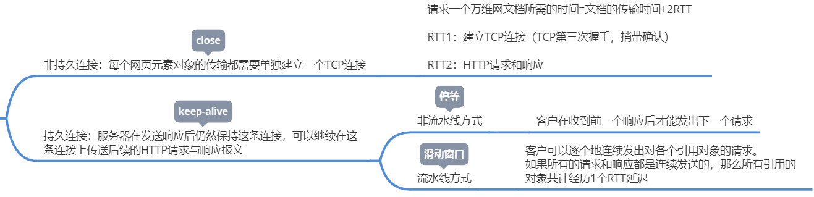

>   对应用程序的通信提供服务

<!--more-->

# 6. 应用层

## 6.0 网络应用模型

### 6.0.1 客户/服务器模型

服务器：提供计算服务的主机

-   服务器上运行的软件是专门用来提供某种服务的程序，可同时处理多个远程或本地请求

-   系统启动后，便不断运行，被动等待并接收来自客户机的请求
-   提供永久的服务，永久的访问地址

客户机：请求计算服务的主机

-   与服务器通信，使用服务器提供的服务
-   间歇性接入网络
-   不与其他客户机通信
-   可以使用动态IP

---

如：Web应用程序，总是打开的Web服务器服务于运行在客户机上的浏览器请求。当Web服务器收到客户机对某对象的请求后，向该客户机发送所请求的对象做出响应

#### A. 工作流程

1.  服务器处于 *接收请求* 状态
2.  客户机发出 *服务请求* ，并等待接收结果
3.  服务器收到请求后，分析请求，进行必要处理，得到结果返回给客户机

#### B. 常见的客户/服务器模型

-   Web应用
-   文件传输协议FTP
-   远程登录协议TELNET
-   电子邮件

### 6.0.2 P2P模型

>   在P2P模型中，任意一对计算机称为`对等方(Peer)`， 直接相互通信。

-   每个结点既作为客户访问其他结点的资源，也作为服务器提供资源给其他结点访问。

优点

-   减轻了服务器的计算压力，消除了对某个服务器的完全依赖，可以将任务分配到各个结点上，因此大大提高了系统效率和资源利用率
-   多个客户机之间可以直接共享文档
-   可扩展性好
-   网络健壮性强

缺点

-   在获取服务的同时，还要给其他结点提供服务，因此会占用较多的内存，影响整机速度	

## 6.1 DNS

>   Domain Name System 域名系统：把便于记忆的具有特定含义的主机名转换为便于机器处理的IP地址

**一个联机分布式的数据库系统**

应用模型：C/S模式

基于UDP：多次DNS请求放回相同的结果

域名与IP地址为多对多的关系

-   一个域名可以映射到多个IP上：处于不同网络中的主机，有两个IP地址、两个网卡，两个MAC地址，可使用同一域名
-   多个域名可指向不同主机IP地址

由 `层次域名空间、域名服务器、域名解析器` 三部分组成

### 6.1.1 域名空间

-   域名：采用层次树状结构的命名方法，任何连接到因特网的主机和路由器都有唯一的层次结构的名称

    级别低的写在最左边，级别最高的顶级域名写在最右边

-   域：命名空间一个可被管理的划分，每个域有不同组织管理，每个组织都可将他的域分为一定数目的子域

#### 顶级域名分类

-   国家顶级域名

-   通用顶级域名

-   基础结构域名

    `arpa`：反向域名，提供IP地址对应的域名

### 6.1.2 域名服务器

域名服务器：域名到IP地址的解析由运行在域名服务器上的程序完成

-   一个域名服务器管辖的范围称为区

    每个区有相应的权限服务器，用于保存该取区的所有主机的域名IP映射

-   域名服务器之间相互连接，当自己不知道域名对应的IP地址时，能知道去找哪些域名服务器

-   DNS使用了大量的域名服务器，以层次的方式组织。没有一台域名服务器具有因特网上所有主机的映射，而是分布在DNS中

#### A. 根域名服务器

所有根域名服务器都知道所有的顶级域名服务器的IP地址

13台根域名服务器是冗余服务器集群，可以提高安全性和可靠性

通常告诉 *本地域名服务器* 下一步该去找那个 *顶级域名服务器* 进行查询

#### B. 顶级域名服务器

管理在该顶级域名服务器注册的所有二级域名

#### C. 权限域名服务器

将域名转换为主机的IP地址

-   每台主机都必须在 *授权域名服务器(权限域名服务器)* 中登记

#### D. 本地域名服务器

接收主机发送的DNS查询请求报文和返回本机的IP地址

### 6.1.3 域名解析过程

域名解析：将域名映射称IP地址或把IP地址映射成域名的过程

当客户端需要域名时，通过本机的DNS客户端构造一个 *DNS请求报文* ，以 *UDP数据报* 方式发往 *本地域名服务器*

在本地域名服务器上，有定时更新的 *高速缓存* ：存储域名与IP地址的映射

-   当一个 *域名服务器* 收到 `DNS查询结果` 时，将该DNS信息缓存在 *高速缓存* 中

#### 递归查询方式

1.  如果 *本地主机* 所询问的 *本地域名服务器* 不知道被查询域名的IP地址，那么 *本地域名服务器* 以 `DNS客户` 的身份，向 *根域名服务器* 继续发出 `查询请求报文` 

2.  *本地域名服务器* 只需向 *根域名服务器* 发送一次 `查询请求` ，后面几次查询都是在各级域名服务器之间
3.  *本地域名服务器* 从 *根域名服务器* 得到了 `IP地址` ，最后返回给 *本地域名服务器* 在将查询结果转交给本地主机

会使根域名服务器负载过大，实际几乎不用

#### 迭代查询方式

1.  当 *根域名服务器* 收到 *本地域名服务器* 发出的 `迭代查询报文` 时，要么给出 `IP地址` ，要么告诉 *本地域名服务器* ：下一步向那个 *顶级域名服务器* 查询
2.  然后 *本地域名服务器* 向这个 *顶级域名服务器* 进行后续查询
3.  同样的，顶级域名服务器要么给出IP地址，要么告诉本地域名服务器，去查找那个 *权限域名服务器*
4.  *本地域名服务器* 获取 `IP地址` 后，将结果返回给主机DNS客户端

#### 域名解析过程

1.  *客户机* 向 *本地域名服务器* 发出 `DNS请求报文`
2.  *本地域名服务器* 收到请求后，查询 `本地高速缓存` ，若没有该记录，则以DNS客户机的身份向 *根域名服务器* 发出解析请求
3.  *根域名服务器* 收到请求后，判断该域名属于 `.com` 域，则将对应的 *顶级域名服务器* 的 `dns.com` IP地址返回给 *本地域名服务器* 
4.  *本地域名服务器* 向顶级域名服务器发送 `请求报文`
5.  *顶级域名服务器* 收到请求后，判断该域名属于 `baidu.com` 域，则将对应的 *权限域名服务器* `dns.baidu.com` 的IP地址返回给 *本地域名服务器*
6.  *本地域名服务器* 收到请求后，将查询结果返回给 *本地域名服务器*
7.  *本地域名服务器* 将查询结果保存在 `本地高速缓存` ，同时返回给 *客户机*

## 6.2 FTP协议

>   提供不同种类主机系统间的文件传输能力

-   应用层工作模型：C/S模型
-   FTP基于TCP方式
-   TFTP使用UDP方式

功能

-   提供不同种类主机系统间的文件传输能力
-   以用户权限管理的方式提供用户对远程FTP服务器上的文件管理能力

### 6.2.1 两种连接

#### A. 控制连接

>   建立在FTP服务器21号端口上的TCP连接，用于传输控制信息（连接请求、传送请求等） ，控制信息都是以7为ASCII传送

-   客户端发出的传送请求，通过控制连接发送给服务端的控制进程

-   控制连接在整个FTP会话期间保持打开状态

-   由于控制信息是分离的，所以FTP控制信息是 *带外传输* 的

#### B. 数据连接

>   数据连接用于连接 *客户端* 与 *服务器端数据传送进程*

-   数据传送进程 实际 完成文件的传送，在传送完毕后关闭 数据传送连接 并结束运行

-   使用FTP时，若要修改服务器上的文件，则需要先将此文件传送到本地主机，然后将修改后的文件副本传送会原服务器

### 6.2.2 建立过程

1.  主机请求建立到FTP服务器控制端口(21)的TCP连接，发送登录用户名和密码
2.  服务器返回登录成功信息。主机打开一个随机端口，将端口号发送给服务器
3.  服务器使用20端口建立一个TCP数据连接到主机打开的随机端口
4.  主机通过控制连接向服务器发送读写文件命令，通过数据连接可以进行文件共享

## 6.3 电子邮件

### 6.3.1 电子邮件格式

#### A. 信封

-   收件方邮箱地址
-   来自首部

#### B. 内容

-   首部
-   主体
    -   To：收件人邮箱名@邮箱所在的服务器域名
    -   Subject：主题
    -   From：发件人邮箱地址，由邮件系统自动填写

### 6.3.2 组成结构

异步通信方式，通信时不需要双方同时在场

发送方把邮件发送到收件人使用的邮件服务器，并放在其中的收件人邮箱中，收件人可以随时使用自己的邮件服务器进行读取

#### A. 用户代理UA

电子邮件客户端软件

#### B. 邮件服务器

-   发送和接收邮件
-   向发送人报告邮件传送情况

#### C. 邮件发送协议和读取协议

##### 邮件发送协议

*用户代理* 向 *代理邮件服务器* 或 *邮件服务器间* 发送邮件

-   SMTP

##### 邮件读取协议

*用户代理* 从 *邮件服务器* 读取邮件

-   POP3、IMAP

### 6.3.3 SMTP协议

>   控制两个SMTP进程交换信息
>
>   -   SMTP客户：发送邮件的邮件服务器进程
>   -   SMTP服务器：接收邮件的SMTP进程

应用层模型：C/S

基于TCP：端口号25

#### A. 三个阶段

1.  连接建立

    SMTP不使用中间邮件服务器，TCP连接在发送方和接收方的邮件服务器之间直接建立

    -   发送方将邮件发送到发送方邮件服务器的邮件缓存中
    -   SMTP客户每隔一端时间，对邮件缓存扫描一次。若有邮件则用25端口，与接收方的邮件服务器SMTP进程建立TCP连接
    -   连接建立后，接收方SMTP服务器发出 `220 Service ready(服务就绪)`。然后SMTP客户向SMTP服务器发送 `HELO命令` ，附上发送方的主机名

2.  邮件传送

    MAIL命令，接收邮件服务若有能力接收，器返回 `250 OK`

    SMTP客户端发送一个RCPT命令，确认接收方系统是否已经做好接收邮件的准备

    获得OK回答后，客户端使用DATA命令，表示要开始传输邮件内容

3.  连接释放

    SMTP客户发送 `QUIT命令`

    SMTP服务器返回的信息是 `221服务关闭` ，表示SMTP同意释放TCP连接

#### B. SMTP缺点

-   SMTP不能传送可执行文件或其他二进制文件
-   SMTP仅限传送7位ASCII码，不能传送其他非英语国家文字
-   SMTP服务器会拒绝超过一定长度的邮件

#### C. 多用途网络邮件扩充

>   MIMI增加了邮件主体的结构，并定义了传送非ASCII码的编码规则

### 6.3.4 POP3

>   邮局协议(Post Office Protocal)第三版本

应用层模型：C/S

-   接收方的邮件服务器运行POP服务器程序
-   接收方的用户代理运行POP客户程序

基于TCP：端口号110

采用 `Pull` 通信方式，当用户读取邮件时，用户代理向邮件服务器发出请求，拉取用户邮箱中的邮件

#### 两种工作方式

下载并保留：邮件仍保存在邮件服务器上，用户可再次从服务器上读取该邮件

下载并删除：邮件一旦被读取，就从邮件服务器上移除，用户不能再次从服务器上读取

### 6.3.5 IMAP

>   因特网报文存取协议，允许用户代理只获取报文的某些部分

-   IMAP客户程序打开IMAP服务器邮箱时，用户可看到邮件首部信息，只有打开具体邮件时，才传到主机上

应用层模型：C/S

基于TCP连接：端口号110

IMAP维持了会话用户的状态信息

## 6.4 WWW与HTTP协议

>   万维网是一个资料空间

-   所有可用的事物称为资源，资源由 `URL(统一资源定位符)` 标识

    这些资源通过 `超文本传输协议(HTTP)` 传送给使用者，通过单击链接来获取资源

-   万维网是因特网的主要部分，因特网是互联网中最大的一个，广域网与局域网都是互联网的构件

### 6.4.1 万维网组成

-   统一资源定位符(URL)：负责标识万维网上的各种文档，使每个文档在整个万维网范围有唯一的表示符URL

-   超文本传输协议（HTTP）：一个应用层协议，使用TCP连接进行可靠的传输，HTTP是万维网客户程序和服务器程序之间交互所必须严格遵守的协议

    `<协议>://<主机>:端口/路径`

-   超文本标记语言（HTML）：一种文档结构的标记语言，使用一些约定的标记对页面上的各种信息、格式进行描述

### 6.4.2 万维网工作流程

万维网以 `客户/服务器` 方式工作

`浏览器` 是在用户计算机上的 `万维网客户端程序` ，而 `万维网文档驻留的计算机` 运行 `服务器程序` ，称为 `万维网服务器`

---

客户程序向服务器程序发出请求，服务器程序向客户程序返回客户所要的文档

1.  Web用户使用浏览器与Web服务器建立连接，并发送浏览请求
2.  Web服务器把URL转换为文件路径，并返回信息给Web浏览器
3.  通信完成，关闭连接

### 6.4.3 HTTP协议

HTTP定义了 **浏览器怎样向万维网服务器请求万维网文档** 以及 **服务器怎样把文档传送给浏览器**

#### A. HTTP操作过程

1.  浏览器要访问HTTP时，先分析URL，完成对目标服务器的域名解析，获得IP地址
2.  浏览器通过TCP向服务器发送 `连接建立请求`
3.  每个万维网站点都有一个 *服务器进程* ，它不断监听TCP的端口 `80` ，当监听到 `连接请求` 后，便与浏览器建立连接
4.  TCP连接建立后，*浏览器* 向服务器发送 `请求获取某个 web页面的HTTP请求` 
5.   *服务器* 收到HTTP请求后，将 `构建所请求Web页的必需信息` ，并通过HTTP响应返回给浏览器
6.  *浏览器* 再将信息进行解释，然后将Web页 显示 给用户
7.  最后TCP连接释放

#### B. HTTP特点

##### 无状态

>   多次访问与第一次访问相同

Cookie：一个存储于用户主机的文本文件，用于唯一标识用户

-   Web服务器根据Cookie从数据库中查询该用户的活动记录

##### 无连接

>   通信双方在交换HTTP报文之前不需要先建立HTTP连接

-   HTTP不考虑数据在传输过程中被丢弃后，怎么重传

#### C. HTTP报文

面向文本：报文段中每个字段都是ASCII串

##### 请求方法

GET：读取由URL标识的信息

HEAD：读取由URL标识的信息首部

POST：向服务器添加信息

##### 状态码

1XX：通知信息，表示请求受到了或正在处理

2XX：表示成功

3XX：表示重定向

4XX：客户端错误

5XX：服务器错误

