>   计网中的一些问题

<!--more-->

## 1. 计算机通信

### 主机距离最近

一条网线两端分别连接两台主机

#### 多台主机

> 多台主机之间两两连接即可实现通信

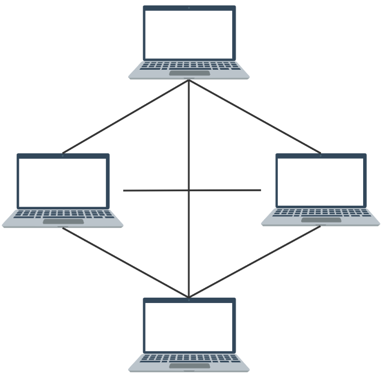

### 主机非常多

> 主机非常多时，两两连线不现实。出现集线器，主机只需要连接到集线器上，无需两两连线

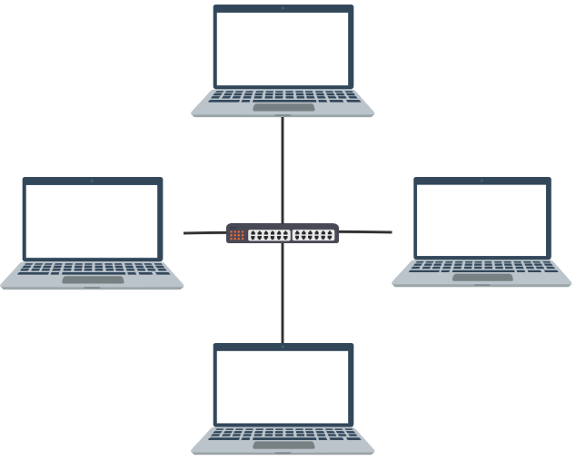

而集线器不隔离冲突域，所以A给C发送消息时，同一个集线器上的所有主机都会收到，主机通过消息中的目标主机地址（ `MAC地址` ）来判断本机是否接收该消息。

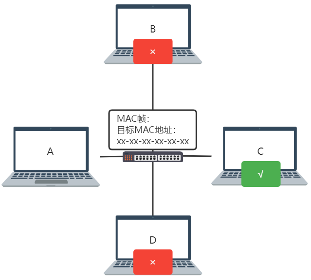

### 集线器线路占用问题

由于冲突域内是广播方式传播的，所要两台主机发送数据时，会占用该冲突域的所有线路。

且A-C发消息的同时，B-D发消息，则这些消息会叠加为不可读消息

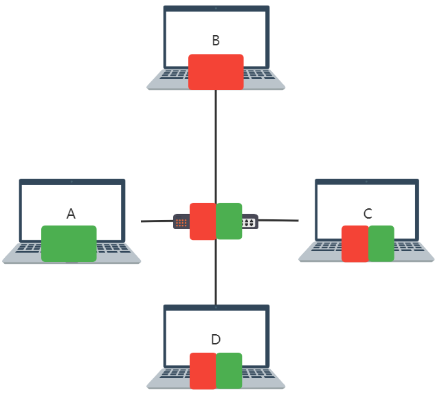

解决方案：

- 该冲突域主机禁止同时发送消息
- 不广播——交换机

### 交换机——隔离冲突域

消息发往交换机，交换机查找存储的转发表，找到目的MAC对应的端口，从指定端口发出，这样就避免了广播。

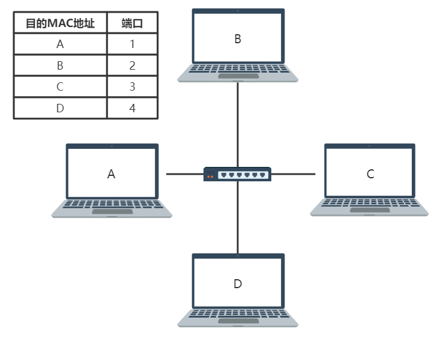

但这样的问题就是当主机数量过多，转发表会很大

解决方案：**转发表表项按分端口划分表项**

即将从同一端口转发消息的主机划分为一个分组（冲突域）

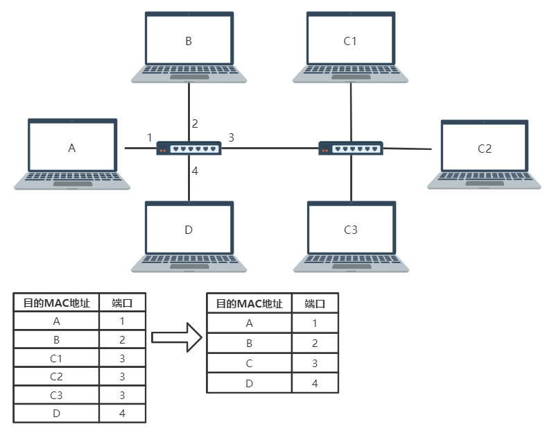

### 路由器——隔离广播域

在整个互联网中，路由器与交换机发挥的作用类似，将属于同一广播域的消息从同一端口转发。

根据目的主机的网络号，在转发表中找到相应的端口，将IP报从该端口发出

一个端口对应一个广播域

## 2. 广播域与冲突域的理解

1. **冲突域**中，每个结点都能接收到任意设备的 **所有消息**；**广播域** 中，每个结点都能接收到任意设备的 **广播消息**

   通常一个局域网为一个广播域

   - 集线器，中继器连接的为一个冲突域。
   - 网桥，交换机连接的为一个广播域，能隔离冲突域。
   - 广播域之间通过路由器连接（构成广域网），路由器能隔离广播域。

2. 冲突域基于物理层，广播域基于数据链路层

2. 广播域可以跨网段，冲突域只发生在同一网段

## 3. 物理设备与协议

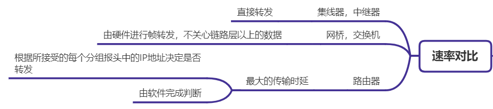

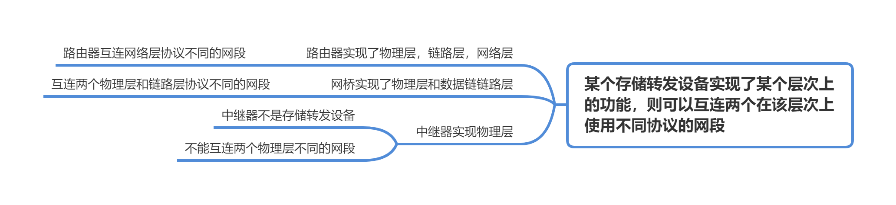

## 4. 可靠传输的问题

### 报文丢弃的情况

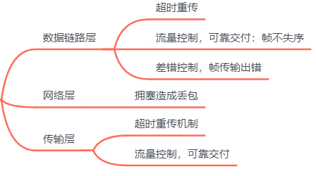

### 数据链路层的差错控制和运输层可靠传输的区别

#### 干什么角度

#### 提供的服务

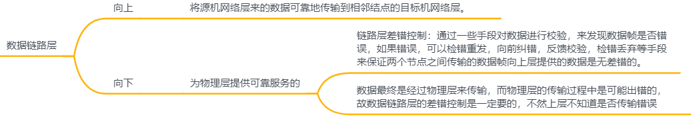

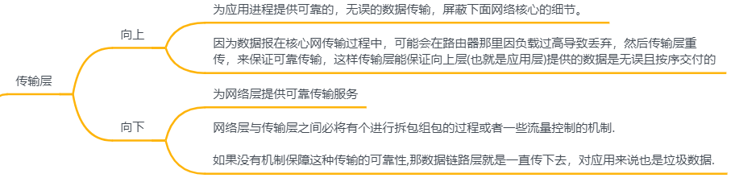

#### 干到什么程度

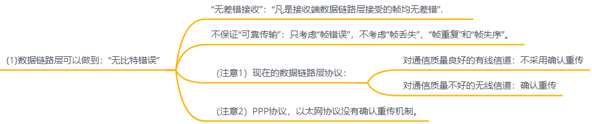

