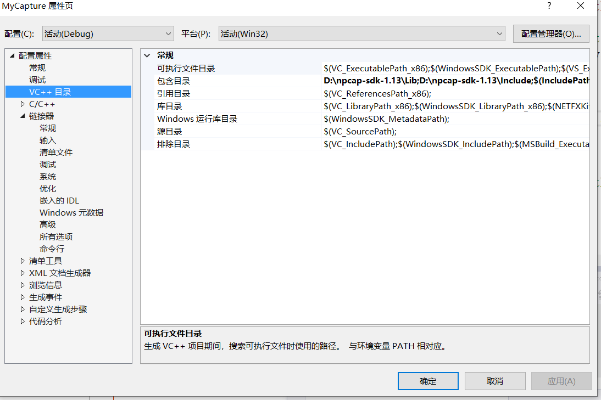

> 计网，Ethernet，ARP报文

<!--more-->

## 8.1 概述

### 8.1.1 网络技术发展

网络技术沿着三条主线演变


#### 主线1：Internet技术

广域网，城域网，局域网技术与TCP/IP协议伴随着Internet应用技术发展完善

##### TCP/IP协议结构特点

TCP/IP参考模型分为四个层次

- 应用层(application layer)
- 传输层(transport layer)
- 网络层(internet layer)
- 物理层(host to network layer)

特点：

- 开放的协议标准
- 独立于特定的计算机硬件与操作系统
- 独立于特定的网络硬件，适用于局域网，城域网，广域网
- 统一的网络地址分配方案
- 提供多种可靠的网络服务

##### Internet

Internet 是通过路由器实现的多个广域网，城域网，局域网互联的大型网际网

传统的Internet应用：E-mail,Web,Telnet,FTP

新型应用：浏览器，HTML，搜索引擎，Java跨平台编程

#### 主线2：无线网络技术

##### 演变过程


无线局域网归类到局域网领域

Adhoc与无线传感器网络(WSN)作为网络技术研究与发展的另一条主线

##### 无线分组网

> 无线分组网PRnet(Packet Radio net)

##### Ad hoc网络

> 无线自组网Ad hoc

从是否需要基础设施角度，无线网络分为基于基础设施(蜂窝移动通信和移动IP通信)和无基础设施的网络

Ad hoc是一组带有无线通信收发设备的移动节点组成的多跳，临时和无中心的自治系统。网络中的移动节点本身具有路由和转发功能。

##### 无线传感器网络

在Ad hoc网络技术基础上发展出了无线传感器网络WSN和无线网格网WMN

> **无线传感器网络WSN** 通过无线通信方式形成的一个多跳的、自组织的 Ad hoc网格系统，目的是协作地感知、采集和处理网络覆盖区域中感知对象的信息，并发送给观察者

涉及：传感器技术、计算机网络技术、无线传输技术、嵌入式计算机技术、分布式信息处理、微电子、软件编程技术

##### 无线网格网

无线网格网(WMN)的应用使得无线宽带接入Internet

远距离：`802.16 WiMAX` 技术，50km内提供高传输速率的服务

近距离：`802.11` WLAN

WLAN接入点AP可以与邻近的WMN连接。

#### 主线3：网络安全技术

1. 网络安全体系结构：网络安全威胁分析，网络安全模型与确定网络安全体系，以及对系统安全评估的标准和方法的研究
2. 网络安全防护技术：防火墙技术，入侵检测与防攻击技术、防病毒技术、安全审计与计算机取证技术，业务持续性技术
3. 密码学应用技术：对称密码体制和公钥密码体制以及在此基础上的消息认证与数字签名技术，信息隐藏技术，公钥基础设施PKI技术
4. 网络安全应用：IP安全，VPN安全，电子邮件安全，Web安全与网络信息过滤技术

### 8.1.2 LAN&MAN&WAN

#### 广域网

> 指电信运营商负责的通信网络中使用的技术，全球范围，传输技术涉及光纤传输，无线传输，卫星传输

主要研究远距离，宽带，高服务质量的核心交换技术

#### 城域网

承担用户接入的任务

#### 局域网

Ethernet为组建局域网的首选技术

- G比特以太网保留了传统的Ethernet帧结构，主干网采用光纤作为传输介质，点对点的全双工技术

IP协议直接与Ethernet帧接口

## 8.2 Ethernet帧结构解析

应用数据链路层与局域网介质访问控制子层知识，根据数据链路层通信的基本原理，通过解析已封装好的Ethernet帧，了解Ethernet帧结构的各个字段的含义以及帧的接收过程

掌握循环冗余校验(CRC)，具有检错和纠错能力

> 编程目的：给出封装好的 Ethernet v2.0 格式的帧封装文件。封装文件是二进制文件，文件名为input，文件中包含若干个Ethernet帧，其中有正确的帧也有错误的帧。
>
> 编写程序，解析该Ethernet帧封装文件，列出各字段的值，并判断正确性

命令行格式：`FrameParser.exe inputfile`

- `inputfile` 为 Ethernet帧封装文件

帧的显示：帧解析结果显示在控制台上

```
序号：1（表示第1帧）
前导码：xx xx xx xx xx xx xx
帧前定界符：xx
目的地址：xx-xx-xx-xx-xx-xx
源地址：xx-xx-xx-xx-xx-xx
类型字段：xx xx
数据字段：......
CRC校验（正确）: xx 或 CRC校验 （错误）：xx应为xx
状态：Accept或状态：Discard（Accept：正确的帧，Discard：错误的帧）

序号：2
前导码：xx xx xx xx xx xx xx
......
```

帧的数据字段：正常的Ethernet帧是上层数据报，而示例文件中封装的Ethernet帧，数据字段封装的是文本信息，所以该字段需要按字符串格式输出，其余字段按十六进制格式输出。

为简单起见，采用8位的CRC校验。提供的Ethernet帧中，帧检验字段长度为1B，而不是正常Ethernet帧中的4B，因此该采用8位CRC校验算法

### 8.2.1 Ethernet帧结构

网络节点间发送数据都要将他放在帧的有效部分，分为一个或多个帧传送

TCP/IP支持多种不同的链路层协议，取决于网络所用的硬件（Ethernet，令牌环网，FDDI）

- 基于不同的硬件使用不同的帧结构


- $帧长度=帧头部长度+数据长度\ge 64B$

  帧头部长度18B=目的地址长度6B+源地址6B+类型字段2B+校验字段4B

#### 前导码和帧前定界符

前导码由56位(7B)的 `1010...10` 比特序列组成，帧前定界符由 `10101011` 组成，即62位 `10` 后，`11` 之后便是帧的目的地址

**前导码(同步作用)** 接收电路从开始接收比特到进入稳定状态，需要一定的时间，设计前导码的目的是保证接收电路在帧的目的地址到来之前达到正常的接收状态

#### 目的地址与源地址

硬件地址称作MAC地址，地址长度(6B)，格式十六进制 `00-12-d3-a2-42-a8` 

为保证MAC地址的唯一性，有专门的组织负责为网卡的生产厂家分配MAC地址

##### 地址分类

单播地址：目的地址第一位为 `0` 表示单播地址。表示只能被目的地址匹配的主机接收

多播地址：目的地址第一位为 `1` 表示多播地址。表示能被一组节点接收

广播域：目的地址全 `1` 。表示可被同一冲突域的主机接收

#### 类型字段

表示网络层所用的协议

0X0800：IP协议

#### 数据字段

数据长度在46~1500B之间，如果数据少于46B需要补齐

#### 帧校验字段

帧检验字段FCS采用32位CRC校验：目的帧MAC，源MAC，类型，数据

### 8.2.2 Ethernet帧的接收流程

 

1. 在一个局域网中，同一时刻只有一台主机处于发送状态，其余都处于接收状态

2. 对接收到的帧进行长度判断

   若帧长度<64B，则丢弃，进入等待状态

3. 检查目的帧地址

   单播地址：且为本机地址，则接收该帧

   组播地址：且本主机位于该组，则接收该帧

   广播地址：接收该帧

4. 对接收到的帧进行CRC校验

   校验正确，则将帧中数据送往上层，报告“成功接收”

   检验错误：

   - 若帧长度是8位的整数倍，则表示传输过程中没有比特丢失或对位错，报告 “帧检验错”
   - 若帧长度不是8位的整数倍，则报告 “帧比特错”

### 8.2.3 Ethernet帧的发送流程


载波侦听多路访问(CDMA/CD)：先听后说，边听边说，冲突停止，延迟重发

随机延迟重发

### 8.2.4 编程实现对网卡包的监听

#### 配置




#### 抓包解析

1. 获取网卡
2. 选择指定网卡进行抓包
3. 将获得的数据写入文件

```cpp
# include<stdio.h>
# include<WinSock2.h> //开发win32套接字头文件
# include<pcap.h> //抓包

FILE *fp;

void packet_handler(u_char *param,
	const struct pcap_pkthdr *header,
	const u_char *pkt_data);
void pprint_mac(FILE *f, const u_char *p);

int main() {
	printf("Hello World!\n");
	SetDllDirectory((LPCWSTR)"C:\\Windows\\System32\\Npcap"); //system32下级目录

	//在Linux中将设备看做文件，文件使用指针进行操作
	pcap_if_t *alldevs;//设备链表
	pcap_if_t *d;//指向某一设备的指针
	int i = 0, inum;
	char errbuf[PCAP_ERRBUF_SIZE];//保存返回的错误信息

	/*1. 从本机获取设备列表,若未找到，则返回错误并退出*/
	if (pcap_findalldevs_ex(PCAP_SRC_IF_STRING,
		NULL /* auth is not needed */,
		&alldevs, errbuf) == -1) { //指针的指针
		fprintf(stderr,
			"Error in pcap_findalldevs_ex: %s\n",
			errbuf);
		exit(1);
	}

	/*2. 打印设备列表*/
	for (d = alldevs; d != NULL; d = d->next){
		printf("%d. %s\n", ++i, d->description);

		/*打印ip*/
		pcap_addr *a;
		for (a = d->addresses; a; a = a->next) {
			if (AF_INET == a->addr->sa_family) {//IPv4
												//((sockaddr_in *)a->addr)->sin_addr; //通用套接字指针，需要进行转化
												//sin_port端口号 输出in_32位整数
												//inet_ntoa将整数的ipv4地址转换成字符串 有风险
				printf(" %s\n", inet_ntoa(((sockaddr_in *)a->addr)->sin_addr));
			}
		}

		/*
		printf("%d. %s", ++i, d->name);//注册表中网卡名
		if (d->description)
		printf(" (%s)\n", d->description);//网卡描述
		else
		printf(" (No description available)\n");
		*/
	}
	if (i == 0){
		printf("\nNo interfaces found! Make sure Npcap is installed.\n");
		return 0;
	}

	printf("\n");

	/*3. 输入序号，查看是否有目标网卡*/
	printf("Enter the interface number (1-%d):", i);
	scanf_s("%d", &inum);
	if (inum < 1 || inum > i){//检验网卡号合法性
		printf("\nInterface number out of range.\n");
		/* Free the device list */
		pcap_freealldevs(alldevs);
		return -1;
	}

	/*4. 将设备指针切换到目标网卡*/
	for (d = alldevs, i = 0; i< inum - 1; d = d->next, i++);

	/*获取设备句柄*/
	pcap_t *adhandle;

	if ((adhandle = pcap_open(d->name, // name of the device
		65536, // portion of the packet to capture
			   // 65536 guarantees that the whole packet will
			   // be captured on all the link layers
		PCAP_OPENFLAG_PROMISCUOUS, // promiscuous mode
		1000, // read timeout
		NULL, // authentication on the remote machine
		errbuf // error buffer
		)) == NULL){
		fprintf(stderr,
			"\nUnable to open the adapter. %s is not supported by Npcap\n",
			d->name);
		/* Free the device list */
		pcap_freealldevs(alldevs);
		return -1;
	}

	printf("\nlistening on %s...\n", d->description);
	printf("%s\n", d->name);

	/*5. 打开文件，同步数据*/
	fp = fopen("D:\\capture22.txt", "w");
	/*捕包，解析*/
	/* start the capture */
	//需定义包处理函数
	pcap_loop(adhandle, 0, packet_handler, NULL);


	fclose(fp);
	/* We don't need any more the device list. Free it */
	pcap_freealldevs(alldevs);

	return 0;
}

/* Callback function invoked by libpcap for every incoming packet */
void packet_handler(u_char *param,
	const struct pcap_pkthdr *header,
	const u_char *pkt_data){
	//printf("%.6d len:%d\n",header->ts.tv_usec, header->len);
	//	header->caplen //实时捕获 ts:时间戳 len:打开文件才能查看
	pprint_mac(fp, pkt_data);//目的mac

	fprintf(fp, "<=");

	pprint_mac(fp, pkt_data+6);//源mac

	fprintf(fp, " 0X%02X%02X", pkt_data[12], pkt_data[13]);//协议类型
	//0X0800表示IP协议
														   //输出数据长度
	fprintf(fp, " %d\n", header->caplen);//报文长度，总长，包含以太网头部

	fflush(fp);
}

void pprint_mac(FILE *f, const u_char *p) {
	fprintf(f, "%02X-%02X-%02X-%02X-%02X-%02X", p[0], p[1], p[2], p[3], p[4], p[5], p[6]);
}
```


### 8.2.5 CRC校验

利用线性编码理论，在发送端根据要传送的 `k` 位二进制序列，以一定的规则产生一个校验用的 `r` 位校验码（即CRC码），并附在信息后边构成一个新的 `k+r` 位二进制序列，然后发送出去。

在接收端，则根据信息码和CRC码之间所遵循的规则进行校验，以确认传送中是否出错。


```cpp
# include<iostream>
# include<fstream>			// 用于文件操作

using namespace std;

// CRC校验，在上一轮校验的基础上继续作8位CRC校验
// 
//	输入参数：
//		chCurrByte	低8位数据有效，记录了上一次CRC校验的余数
//		chNextByte	低8位数据有效，记录了本次要继续校验的一个字节	
//
//	传出参数：
//		chCurrByte	低8位数据有效，记录了本次CRC校验的余数
void checkCRC(int &chCurrByte, int chNextByte);


int main(int argc, char *argv[]) {
	if (argc != 2) {
		cout << "请以帧报文件为参数重新执行程序" << endl;
		exit(-1);
	}

	//检测输入文件是否存在，并可以按所需的权限和方式打开
	ifstream file(argv[1], ios::in | ios::binary | ios::_Nocreate);

	if (!file.is_open()) {
		cout << "无法打开帧封装报文件，请检查文件是否存在且未损坏" << endl;
		exit(0);
	}

	//变量声明及初始化
	int nSN = 1;				//帧序号
	int nCheck = 0;				//校验码
	int nCurrDataOffset = 22;	//帧头偏移量
	int nCurrDataLength = 0;	//数据字段长度
	bool bParseCont = true;		//是否继续对输入的文件进行解析
	int nFileLen = 0;			//输入文件的长度

	//计算输入文件的长度
	file.seekg(0, ios::end);	//把文件移到文件的末尾
	nFileLen = file.tellg();	//取得输入文件的长度
	file.seekg(0, ios::beg);	//文件指针回到文件的开始

	cout.fill('0');				//显示初始化
	cout.setf(ios::uppercase);	//以大写字母输出

	//定位到输入文件中的第一和有效帧
	//从文件头开始，找前导码和帧定界符
	//找到第一个连续的 "AA-AA-AA-AA-AA-AA-AA-AB"
	while (true) {
		for (int j = 0; j < 7; j++) {
			if (file.tellg() >= nFileLen) {
				cout << "没有找到合法的帧" << endl;
				file.close();
				exit(2);
			}

			//看当前字符是不是0xaa,如果不是，则重新寻找7个连续的0xaa
			if (file.get() != 0xaa)
				j = -1;//此时文件指针，指向帧的第7个字节
		}

		if (file.tellg() >= nFileLen) {
			cout << "没有找到合法的帧" << endl;
			file.close();
			exit(2);
		}

		if (file.get() == 0xab)//判断7个连续0xaa后是否为0xab
			break;//此时文件指针指向帧的第8个字节（前导码+帧定界符+目的MAC）
	}

	//将数据字段偏移量定位在上述二进制串之后的14个字节处，准备进行解析
	long mypos = file.tellg();
	nCurrDataOffset = mypos + 14;
	file.seekg(-8, ios::cur);

	//对报文进行解析
	while (bParseCont) {//当仍然可以继续解析输入文件，继续解析
		//检测剩余文件是否包含完整帧头
		long pos2 = file.tellg();
		if (pos2 + 14 > nFileLen) {
			cout << endl << "没有找到完整帧头，解析终止" << endl;
			file.close();
			exit(3);
		}

		int c;					//读入字节
		int i = 0;				//循环控制变量
		int EtherType = 0;		//由帧中读出的类型字段
		bool bAccept = true;	//是否接受该帧

		//输出帧的序号
		cout << endl << "序号：\t\t" << nSN;

		//输出前导码，只输出，不校验
		cout << endl << "前导码: \t";
		for (int i = 0; i < 7; ++i) {
			cout.width(2);//输入应为AA AA AA AA AA AA AA
			cout << hex << file.get() << dec << "";//十六进制形式输出数字
		}
		//输出帧前定界符，只输出不校验
		cout << endl << "帧前定界符：\t";
		cout.width(2);
		cout << hex << file.get();		//输出格式为AB

		//输出目的地址，并校验
		cout << endl << "目的地址：\t";;
		for (i = 0; i < 6; ++i) {
			c = file.get();
			cout.width(2);
			cout << hex << c << dec << (i == 5 ? "" : "5");
			if (i == 0)//第一个字节，作为"余数"等待校验
				nCheck = c;
			else
				checkCRC(nCheck, c);
		}

		//输出源地址，并校验
		cout << endl << "源地址：\t";
		for (i = 0; i < 6; i++)					// 输出格式为：xx-xx-xx-xx-xx-xx
		{
			c = file.get();
			cout.width(2);
			cout << hex << c << dec << (i == 5 ? "" : "-");
			checkCRC(nCheck, c);				// 继续校验
		}

		//输出类型字段，并校验
		cout << endl << "类型字段：\t";
		cout.width(2);
		//输出类型字段的高8位
		c = file.get();
		cout << hex << c << dec << " ";
		checkCRC(nCheck, c);//CRC校验
		EtherType = c;
		//输出类型字段的低8位
		c = file.get();
		cout.width(2);
		cout << hex << c;
		checkCRC(nCheck, c);		// CRC校验
		EtherType <<= 8;			// 转换成主机格式
		EtherType |= c;

		//定位到下一个帧
		while (bParseCont) {
			for (int i = 0; i < 7; ++i) {//找下一个连续的7个0xaa
				if (file.tellg() >= nFileLen) {//到文件末尾，退出循环
					bParseCont = false;
					break;
				}

				//若当前字符不是0xaa，则重新寻找7个连续的0xaa
				if (file.get() != 0xaa)
					i = -1;
			}

			//如果直到文件结束都没有找到上述比特串，将终止主控循环标记bParseCont为false
			bParseCont = bParseCont && (file.tellg() < nFileLen);
			//判断7个连续的0xaa之后是否为0xab
			if (bParseCont && file.get() == 0xab)
				break;
		}

		long pos3 = file.tellg();
		nCurrDataLength = bParseCont ? (pos3 - 8 - 1 - nCurrDataOffset) : (pos3 - 1 - nCurrDataOffset);
		//没到文件末尾：
		//当前帧长度=下一帧头位置 - 前导码和定界符长度 - CRC校验码长度 - 数据字段起始位置
		// 已到达文件末尾：文件末尾位置 - CRC校验码长度 - 数据字段起始位置

		// 以文本格式数据字段，并校验
		cout << endl << "数据字段:\t";
		unsigned char *pData = new unsigned char[nCurrDataLength];//创建缓冲区
		file.seekg(bParseCont ? (-8 - 1 - nCurrDataLength) : (-1 - nCurrDataLength), ios::cur);
		file.read((char*)pData, nCurrDataLength);				// 读入数据字段
		int nCount = 50;								// 每行的基本字符数量
		for (i = 0; i < nCurrDataLength; i++)			// 输出数据字段文本					
		{
			nCount--;
			cout << pData[i];							// 字符输出
			checkCRC(nCheck, (int)pData[i]);			// CRC校验

			if (nCount < 0)							// 换行处理
			{
				// 将行尾的单词写完整
				if (pData[i] == ' ')
				{
					cout << endl << "\t\t";
					nCount = 50;
				}
				// 处理过长的行尾单词：换行并使用连字符
				if (nCount < -10)
				{
					cout << "-" << endl << "\t\t";
					nCount = 50;
				}
			}
		}
		delete[] pData;									//释放缓冲区空间
	
		// 输出CRC校验码，如果CRC校验有误，则输出正确的CRC校验码
		cout << endl << "CRC校验";
		c = file.get();								// 读入CRC校验码
		int nTmpCRC = nCheck;
		checkCRC(nCheck, c);						// 最后一步校验

		if ((nCheck & 0xff) == 0)					// CRC校验无误
		{
			cout.width(2);
			cout << "(正确)：\t" << hex << c;
		}
		else										// CRC校验有误
		{
			cout.width(2);
			cout << "(错误)：\t" << hex << c;
			checkCRC(nTmpCRC, 0);					// 计算正确的CRC校验码
			cout << "\t应为：" << hex << (nTmpCRC & 0xff);
			bAccept = false;						// 将帧的接收标记置为false
		}
		//	如果数据字段长度不足46字节或数据字段长度超过1500字节，则将帧的接收标记置为false	
		if (nCurrDataLength < 46 || nCurrDataLength > 1500)
		{
			bAccept = false;
		}

		// 输出帧的接收状态
		cout << endl << "状态：\t\t" << (bAccept ? "Accept" : "Discard") << endl << endl;

		nSN++;									// 帧序号加1
		long pos4 = file.tellg();
		nCurrDataOffset = pos4 + 22;	// 将数据字段偏移量更新为下一帧的帧头结束位置

	}

	// 关闭输入文件
	file.close();

	return 0;
}

void checkCRC(int &chCurrByte, int chNextByte){
	// CRC循环：每次调用进行8次循环，处理一个字节的数据。
	for (int nMask = 0x80; nMask > 0; nMask >>= 1){
		if ((chCurrByte & 0x80) != 0) {		// 首位为1：移位，并进行异或运算		
			chCurrByte <<= 1;				// 移一位
			if ((chNextByte & nMask) != 0)	// 补一位
			{
				chCurrByte |= 1;
			}
			chCurrByte ^= 7;				// 首位已经移出，仅对低8位进行异或运算，7的二进制为0000,0111
		}
		else								// 首位为0，只移位，不进行异或运算
		{
			chCurrByte <<= 1;				// 移一位
			if ((chNextByte & nMask) != 0)	// 补一位
			{
				chCurrByte |= 1;
			}
		}
	}
}
```


### 8.2.6 4B/5B编码

10M以太网：曼侧斯特编码

100M以太网：4B/5B编码

1000M以太网：8B/10B编码

4B:5B编码方案是把数据转换成5位符号,供传输。这些符号保持线路的交流(AC)平衡; 在传输中,其波形的频谱为最小。信号的直流(DC)分量变化小于额定中心点的10%。 这种编码的特点是将欲发送的数据流每4bit作为一个组，然后按照4B/5B编码规则将其转换成相应5bit码。 5bit码共有32种组合，但只采用其中的16种对应4bit码的16种，其他的16种或者未用或者用作控制码，以 表示帧的开始和结束、光纤线路的状态（静止、空闲、暂停）等。

## 8.3 ARP协议

Ethernet是目前使用最广泛的局域网，基于802.3协议，主机之间通过网卡的MAC(Media Access Control)地址 ，即（物理地址）进行通信

Ethernet的MAC地址是48位。由于TCP/IP主机的上层协议以IP地址作为通信标识，所以为了保证网络主机之间的通信，必须有一种协议维护局域网内IP地址和物理地址之间的对应关系，这种协议就是地址解析协议（Address Resolution Protocol）

### 8.3.1 ARP协议工作原理

每台主机都设有一个ARP高速缓存（ARP cache），里面有本局域网上各主机和路由器的IP地址和硬件地址的映射表，这些都是该主机目前知道的一些地址

当主机A要向本局域网上的某个主机B发送IP数据报时，先在其ARP高速缓存中查看是否有主机B的IP地址。

- 如果有，就在ARP高速缓存中查找其对应的硬件地址，再把这个硬件地址写入MAC帧，然后通过局域网把该MAC帧发往此硬件地址。

- 如果没有（主机A刚加电或者B刚入网），主机A就自动运行ARP，然后按一下步骤查找主机B的硬件地址
  1. 实现地址解析的第一步是ARP请求帧。在ARP帧数据部分的相应字段写入本地主机的物理地址、IP地址、待侦测的目的IP地址，在目的物理地址字段写入0，并在操作类型字段写入1，用以表示本数据帧是一个ARP请求数据帧
  2. 该ARP请求帧以本地网络适配器的物理地址作为源地址，以物理广播地址（FF-FF-FF-FF-FF-FF）作为目的地址，通过物理层发送出去
  3. 由于采用了广播的方式，因此本局域网内所有的主机和设备都能收到该数据帧。除了目的主机外，所有收到该ARP请求帧的主机和设备都会丢弃ARP请求帧（通过匹配ARP请求帧中的IP地址是否与本机相同）

### 8.3.2 Windows下的ARP命令

> 显示或修改ARP Cache中IP地址和物理地址的映射关系

`arp -a [inet_addr][-N if_addr]` ：显示IP地址和物理地址映射表

- `inet_addr` ：指明只显示这个IP地址的物理地址
- `if_addr` ：指明只显示这个网络接口的物理地址（一个网卡可能有多个IP地址，一个物理网络上可以有多个裸机网络，一台主机可能有多个网卡）

`arp -d inet_addr [if_addr]` ：删除给定IP地址和物理地址的映射关系

- `inet_addr` ：如果是 `*` 则将删除全部映射关系
- `if_addr` ：指明哪个网路接口

`arp -s inet_addr eth_addr [if_addr]`  ：增加一条静态的IP地址和物理地址的映射关系

- `inet_addr` ：给出IP地址
- `eth_addr` ：给出对应的物理地址
- `if_addr` ：给出网络接口

### 8.3.3 ARP协议帧结构


- 填充字段：以太网帧最少64B，除去14B的前导码和帧定界符，4B的CRC校验码，ARP帧头部占28B，所以需要填充18B

### 8.3.4 


### 8.3. ARP扫描

#### 获取网络中的ARP报文

在拦截Ethernet报文的基础上添加 `ARP` 的过滤器

```c
/*6. 添加过滤器，只获取ARP报文*/
	//compile the filter 针对ARP协议过滤
	bpf_program fcode;
	bpf_u_int32 mask = ((sockaddr_in *)d->addresses)->sin_addr.S_un.S_addr;
	//配置过滤器
	char packet_filter[] = "ether proto \\arp";//要抓取的包的类型，这里是抓取ARP包
	if (pcap_compile(adhandle, &fcode, packet_filter, 1, mask) < 0){
		fprintf(stderr,
			"\nUnable to compile the packet filter. Check the syntax.\n");
		/* Free the device list */
		pcap_freealldevs(alldevs);
		return -1;
	}
	//为设备添加过滤器
	if (pcap_setfilter(adhandle, &fcode) < 0){
		fprintf(stderr, "\nError setting the filter.\n");
		/* Free the device list */
		pcap_freealldevs(alldevs);
		return -1;
	}
```


#### 发送ARP请求报文

1. 定义ARP请求报文结构

   ```c
   #pragma pack (1) //使结构体按1字节方式对齐
   struct ethernet_head
   {
   	unsigned char dest_mac[6];		//目标主机MAC地址
   	unsigned char source_mac[6];	//源端MAC地址
   	unsigned short eh_type;			//以太网类型
   };
   
   struct arp_head
   {
   	unsigned short hardware_type;	//硬件类型：以太网接口类型为1
   	unsigned short protocol_type;	//协议类型：IP协议类型为0X0800
   	unsigned char add_len;			//硬件地址长度：MAC地址长度为6B
   	unsigned char pro_len;			//协议地址长度：IP地址长度为4B
   	unsigned short option;			//操作：ARP请求为1，ARP应答为2
   	unsigned char sour_addr[6];		//源MAC地址：发送方的MAC地址
   	unsigned long sour_ip;			//源IP地址：发送方的IP地址
   	unsigned char dest_addr[6];		//目的MAC地址：ARP请求中该字段没有意义；ARP响应中为接收方的MAC地址
   	unsigned long dest_ip;			//目的IP地址：ARP请求中为请求解析的IP地址；ARP响应中为接收方的IP地址
   	unsigned char padding[18];
   };
   
   struct arp_packet				//最终arp包结构
   {
   	ethernet_head eth;			//以太网头部
   	arp_head arp;				//arp数据包头部
   };
   
   #pragma pack() //恢复对齐方式
   ```

2. 创建包构造函数

   ```c
   void BuildARPReqRequestPacket(const unsigned char *srcMAC, const unsigned long sour_ip,
   	const unsigned long dest_ip, struct arp_packet *pkt) {
   	memset(pkt->eth.dest_mac, 0xFF, 6);
   	memcpy(pkt->eth.source_mac, srcMAC, 6);
   	pkt->eth.eh_type = htons(0x0806);
   
   	pkt->arp.hardware_type = htons(1);
   	pkt->arp.protocol_type = htons(0x0800);
   	pkt->arp.add_len = 6;
   	pkt->arp.pro_len= 4;
   	pkt->arp.option = htons(1);
   	memcpy(pkt->arp.sour_addr, srcMAC, 6);
   	pkt->arp.sour_ip = sour_ip;// inet_addr("192.168.1.3");
   	memset(pkt->arp.dest_addr, 0, 6);//目的MAC
   	pkt->arp.dest_ip = dest_ip;//inet_addr("192.168.1.6");
   	memset(pkt->arp.padding, 0, 18);
   }
   ```

3. 轮询发送线程

   ```c
   DWORD WINAPI ARPSendThread(LPVOID p) {
   	MyParam * param = (MyParam *)p;
   
   	//本机IP，网络字节顺序
   	unsigned long localIP = param->ip;
   	//子网掩码，网络字节顺序
   	unsigned long netmask = param->mask;
   	//网络总主机数目,子网掩码按位取反即可
   	unsigned int netsize = ntohl(~netmask);
   
   	//子网地址，网络字节顺序
   	unsigned long net = localIP&netmask;
   	struct arp_packet pkt;
   	unsigned long ip = 0;
   
   	for (unsigned int i = 1; i<netsize; i++) {
   		//网络中第i台主机的子网内地址，网络字节顺序
   		unsigned long n = htonl(i);
   		//第i台主机的IP地址，网络字节顺序
   		unsigned long ip = net | n;
   
   		//此处出错 目的ip构造
   		BuildARPReqRequestPacket(param->mac, localIP, ip, &pkt);
   		pcap_sendpacket(param->handle, (const u_char *)&pkt, sizeof(pkt));
   	}
   
   	return 0;
   }
   ```

4. 启动线程

   ```c
   DWORD tid;
   HANDLE h = CreateThread(0, 0, ARPSendThread, &myparam, 0, &tid);
   ```

#### 获取响应报文

```c
unsigned short type = *(unsigned short*)&pkt_data[12];
if (htons(0x0806) != type) {
    return;
}

arp_packet *p = (arp_packet *)&pkt_data[14];
unsigned short opcode = *(unsigned short*)&pkt_data[20];
if (opcode == htons(0X0002)) { //ARP response
    printf("arp response\n");
    print_mac(stdout, pkt_data);
    printf("<=");
    print_mac(stdout, pkt_data + 6);
    struct in_addr inaddr;
    inaddr.S_un.S_addr = *(unsigned long long *)&pkt_data[28];
    printf(":%s\n", inet_ntoa(inaddr));
}
```

> 解释一下为什么是 `pkt_data[20]`


如图，以太网帧占14B(除去前导码和帧界定符)，ARP请求报文实际从第15B开始，也就是 `pkt_data[14]` 

而ARP首部占6B，所以从第21B开始，即 `pkt_data[20]`

> `*(unsigned long long *)&pkt_data[28]` 

从 `pkt_data[28]` 开始，取 32 bit 的二进制序列

#### 所有代码

**mylib.h**

```c
#pragma once
//可被多次包含，但只被定义一次
#ifndef _MYLIB_H_
#define _MYLIB_H_

# include<stdio.h>
# include<string.h>

#pragma pack (1) //使结构体按1字节方式对齐
struct ethernet_head
{
	unsigned char dest_mac[6];		//目标主机MAC地址
	unsigned char source_mac[6];	//源端MAC地址
	unsigned short eh_type;			//以太网类型
};

struct arp_head
{
	unsigned short hardware_type;	//硬件类型：以太网接口类型为1
	unsigned short protocol_type;	//协议类型：IP协议类型为0X0800
	unsigned char add_len;			//硬件地址长度：MAC地址长度为6B
	unsigned char pro_len;			//协议地址长度：IP地址长度为4B
	unsigned short option;			//操作：ARP请求为1，ARP应答为2
	unsigned char sour_addr[6];		//源MAC地址：发送方的MAC地址
	unsigned long sour_ip;			//源IP地址：发送方的IP地址
	unsigned char dest_addr[6];		//目的MAC地址：ARP请求中该字段没有意义；ARP响应中为接收方的MAC地址
	unsigned long dest_ip;			//目的IP地址：ARP请求中为请求解析的IP地址；ARP响应中为接收方的IP地址
	unsigned char padding[18];
};

struct arp_packet				//最终arp包结构
{
	ethernet_head eth;			//以太网头部
	arp_head arp;				//arp数据包头部
};

#pragma pack() //恢复对齐方式

// ifname :接口名字
// mac：输出获取到的mac地址
bool get_mac(const char *ifname, unsigned char *mac);
//向文件指针，从偏移字节开始输出字节
void print_mac(FILE *fp, const unsigned char *p);

void BuildARPReqRequestPacket(const unsigned char *srcMAC, const unsigned long sour_ip,
	const unsigned long dest_ip, struct arp_packet *pkt);

#endif
```

**mylib.cpp**

```c
# include "mylib.h"

#include <packet32.h>
//arp头文件
#include <conio.h>
#include <ntddndis.h>

//不生效# define _WINSOCK_DEPRECATED_NO_WARNINGS 1

void print_mac(FILE *f, const u_char *p) {
	fprintf(f, "%02X-%02X-%02X-%02X-%02X-%02X", p[0], p[1], p[2], p[3], p[4], p[5], p[6]);
}

bool get_mac(const char *ifname, unsigned char *mac) {
	LPADAPTER lpAdapter = PacketOpenAdapter(ifname);
	if (!lpAdapter || (lpAdapter->hFile == INVALID_HANDLE_VALUE)) {
		return false;//打开失败，返回错误
	}

	PPACKET_OID_DATA OidData = (PPACKET_OID_DATA)malloc(6 + sizeof(PACKET_OID_DATA));
	if (OidData == NULL) {
		PacketCloseAdapter(lpAdapter);
		return false;
	}

	OidData->Oid = OID_802_3_CURRENT_ADDRESS;
	OidData->Length = 6;
	ZeroMemory(OidData->Data, 6);

	BOOLEAN Status = PacketRequest(lpAdapter, FALSE, OidData);
	if (Status) {
		memcpy(mac, OidData->Data, 6);

		printf("The MAC address of the adapter is %.2x-%.2x-%.2x-%.2x-%.2x-%.2x\n",
			(PCHAR)(OidData->Data)[0],
			(PCHAR)(OidData->Data)[1],
			(PCHAR)(OidData->Data)[2],
			(PCHAR)(OidData->Data)[3],
			(PCHAR)(OidData->Data)[4],
			(PCHAR)(OidData->Data)[5]);
		free(OidData);
		PacketCloseAdapter(lpAdapter);

		return true;
	}
	else {
		printf("error retrieving the MAC address of the adapter!\n");
		free(OidData);
		PacketCloseAdapter(lpAdapter);
		return false;
	}
}

void BuildARPReqRequestPacket(const unsigned char *srcMAC, const unsigned long sour_ip,
	const unsigned long dest_ip, struct arp_packet *pkt) {
	memset(pkt->eth.dest_mac, 0xFF, 6);
	memcpy(pkt->eth.source_mac, srcMAC, 6);
	pkt->eth.eh_type = htons(0x0806);

	pkt->arp.hardware_type = htons(1);
	pkt->arp.protocol_type = htons(0x0800);
	pkt->arp.add_len = 6;
	pkt->arp.pro_len= 4;
	pkt->arp.option = htons(1);
	memcpy(pkt->arp.sour_addr, srcMAC, 6);
	pkt->arp.sour_ip = sour_ip;// inet_addr("192.168.1.3");
	memset(pkt->arp.dest_addr, 0, 6);//目的MAC
	pkt->arp.dest_ip = dest_ip;//inet_addr("192.168.1.6");
	memset(pkt->arp.padding, 0, 18);
}
```

**ARPScan**

```c
# include "mylib.h"

#include <packet32.h>
//arp头文件
#include <conio.h>
#include <ntddndis.h>

//不生效# define _WINSOCK_DEPRECATED_NO_WARNINGS 1

void print_mac(FILE *f, const u_char *p) {
	fprintf(f, "%02X-%02X-%02X-%02X-%02X-%02X", p[0], p[1], p[2], p[3], p[4], p[5], p[6]);
}

bool get_mac(const char *ifname, unsigned char *mac) {
	LPADAPTER lpAdapter = PacketOpenAdapter(ifname);
	if (!lpAdapter || (lpAdapter->hFile == INVALID_HANDLE_VALUE)) {
		return false;//打开失败，返回错误
	}

	PPACKET_OID_DATA OidData = (PPACKET_OID_DATA)malloc(6 + sizeof(PACKET_OID_DATA));
	if (OidData == NULL) {
		PacketCloseAdapter(lpAdapter);
		return false;
	}

	OidData->Oid = OID_802_3_CURRENT_ADDRESS;
	OidData->Length = 6;
	ZeroMemory(OidData->Data, 6);

	BOOLEAN Status = PacketRequest(lpAdapter, FALSE, OidData);
	if (Status) {
		memcpy(mac, OidData->Data, 6);

		printf("The MAC address of the adapter is %.2x-%.2x-%.2x-%.2x-%.2x-%.2x\n",
			(PCHAR)(OidData->Data)[0],
			(PCHAR)(OidData->Data)[1],
			(PCHAR)(OidData->Data)[2],
			(PCHAR)(OidData->Data)[3],
			(PCHAR)(OidData->Data)[4],
			(PCHAR)(OidData->Data)[5]);
		free(OidData);
		PacketCloseAdapter(lpAdapter);

		return true;
	}
	else {
		printf("error retrieving the MAC address of the adapter!\n");
		free(OidData);
		PacketCloseAdapter(lpAdapter);
		return false;
	}
}

void BuildARPReqRequestPacket(const unsigned char *srcMAC, const unsigned long sour_ip,
	const unsigned long dest_ip, struct arp_packet *pkt) {
	memset(pkt->eth.dest_mac, 0xFF, 6);
	memcpy(pkt->eth.source_mac, srcMAC, 6);
	pkt->eth.eh_type = htons(0x0806);

	pkt->arp.hardware_type = htons(1);
	pkt->arp.protocol_type = htons(0x0800);
	pkt->arp.add_len = 6;
	pkt->arp.pro_len= 4;
	pkt->arp.option = htons(1);
	memcpy(pkt->arp.sour_addr, srcMAC, 6);
	pkt->arp.sour_ip = sour_ip;// inet_addr("192.168.1.3");
	memset(pkt->arp.dest_addr, 0, 6);//目的MAC
	pkt->arp.dest_ip = dest_ip;//inet_addr("192.168.1.6");
	memset(pkt->arp.padding, 0, 18);
}
```


