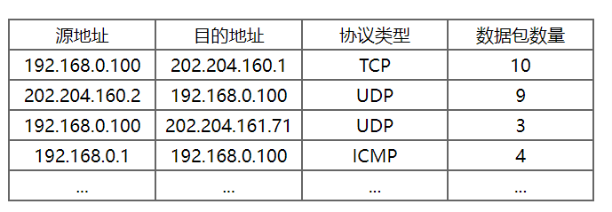
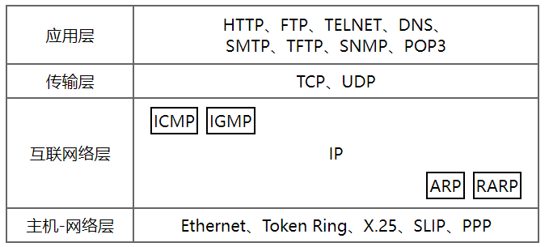
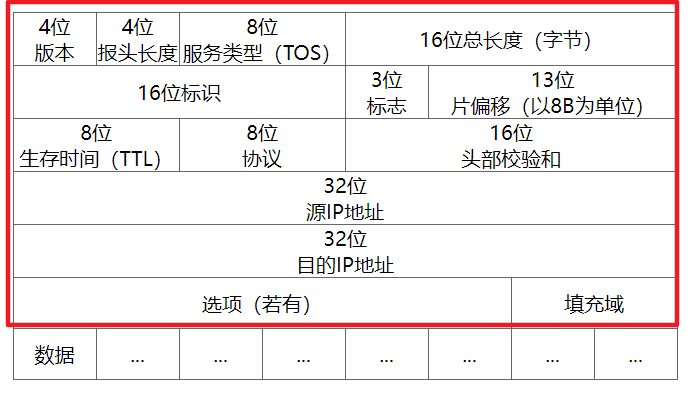
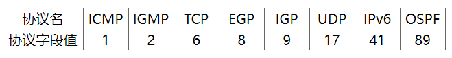

> IP协议与IP流量包检测

<!--more-->

## 9.1 概述

### 9.1.1 编程目标

> 捕获一段时间内以本机为源地址或目的地址的IP数据包（不包括广播形式发出的数据包），统计IP数据包的信息，列出本机与其他主机之间不同协议类型的IP数据包的数量

### 9.1.2 TCP/IP协议族

TCP/IP协议族的分层结构包括应用层，传输层，网络层，链路层

### 9.1.3 IP协议

> IP协议主要负责IP寻址，路由选择，IP数据包的分割与组装，目前常用的是IPv4

IP协议直接位于数据链路层之上，负责将源主机的报文分组发送到目的主机，源主机与目的主机可以位于同一子网

**IP协议特点**

- IP协议直接位于数据链路层上，负责将源主机的报文分组发送到目的主机，源主机与目的主机可以位于同一子网内，也可以位于不同子网。
- IP协议是一种不可靠的、无连接的数据报传送服务协议，它提供的是尽力而为的服务
- 不可靠：不能保证IP数据包一定能成功到达目的节点。若发生错误，则丢弃该数据报，然后向源主机发送ICMP报文报告错误。可靠性由上层协议提供
- 无连接：IP协议并不维护数据报发送后的任何状态信息，每个数据报的处理都是相互独立的。不同数据报到达目的节点时可以走不同的路径，IP协议不保证数据传输顺序的正确性

IP协议为了应对各种异构的物理网络，向传输层屏蔽通信子网的差异，IP协议制定了同一的IP数据报格式

### 9.1.4 IP数据报格式

IP数据报的长度是可变的，它分为报头和数据两个部分。基本的IP报头为20B，选项字段的长度范围是0~40B，所以IP数据报报头的长度范围是20~60B。

> **版本**：4位，表示所使用的IP协议的版本。通信双方使用的IP协议的版本必须已知。版本值为4表示IPv4，版本值为6表示IPv6

> **报头长度**：4位，以4B为单位指定了IP数据报报头长度，该长度不包含数据部分。由于大多数IP报头都不包含选项字段，因此报头长度最少为20B。若报头长度不是4B，则必须利用填充域“填0” 来补充

> **服务类型**：8位，服务类型（type of service，TOS）字段指示了路由器应如何处理该数据包。

4位TOS子字段分别表示：最小延迟（D）、最大吞吐量（T）、最高可靠性（R）和最小费用（C）。每个位都有0或1两个值，但4位中最多只能有一个位的值为1。如果所有4位均为0，那么就意味着是一般服务。由于目前大多数路由器都不支持TOS特性，因此此处填充0即可。

> **总长度** ：16位，总长度域以字节为单位说明包括报头在内的整个IP数据报的总长度。

- 利用报头长度字段和总长度字段，就可以知道IP数据报中数据内容的起始位置和长度
- 该字段有16位，所以IP数据包的最大长度可达65535B，但由于以太网MTU（1500B），会进行分片。数据报被分片后，总长度字段的值会发生变化

> **标识** ：16位，用来唯一标识主机发送的每一份数据报，通常每发送一个报文，会加一

当IP数据报必须进行分片时，这个标识域的值会加1。当IP数据报必须进行分片时，这个标识域的值将被复制到所有数据报分片的标识域中。相同的标识域值使各数据报分片后能正确的组装为原始数据报

> **标志** ：3位

- 第一位保留，并设0

- 第二位：进制分片标志DF，标识报文是否允许被分片

  0：可以被分片

  1：表示不允许被分片

- 第三位：分片标志 

  只有 `DF=0` 时该字段才有意义，`MF=1` 表示后面还有分片的数据报 。`MF=0` 表示这是若干数据报分片中的最后一个

> **片偏移** ：13位，给出了每一个分片在完整IP数据报中的相对位置。以8B为偏移单位，因此分片的报文，。除了最后一片外，都应是8B的倍数

> **生存时间** ：8位，TTL（time-to-live） 设置了数据报可以经过的最多路由器数。

- 由源主机设置，一旦经过一个处理它的路由器，其值减1
- 当TTL=0时，数据报就被对齐，并发送ICMP报文通知源主机

> **协议** ：8位，指出此IP数据报的高层协议类型，以便目的主机的IP层将数据部分上交给那个高层协议处理

> **头部校验和** ：16位，保证数据的完整性，校验不包括数据部分。

- 每经过一个路由器，就需要重新计算头部校验和（TTL，标志，片偏移）。
- 为进一步减少计算，校验和不采用复杂的CRC校验码而采用网际校验和算法

> 源IP地址：32位

> 目的IP地址：32位

> 选项：0~40B