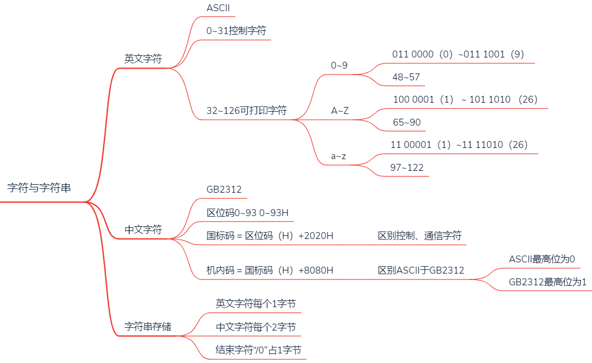
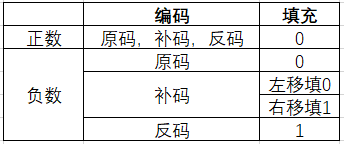
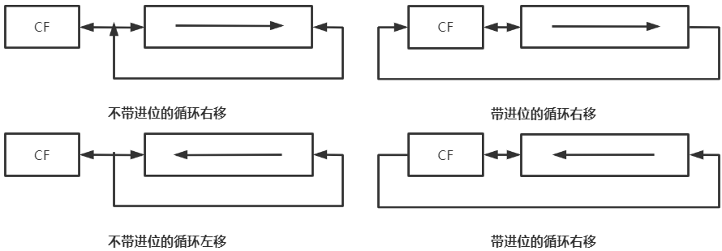
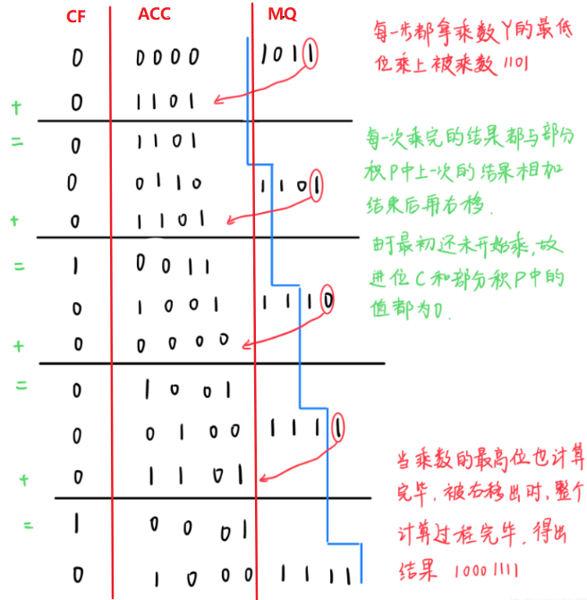
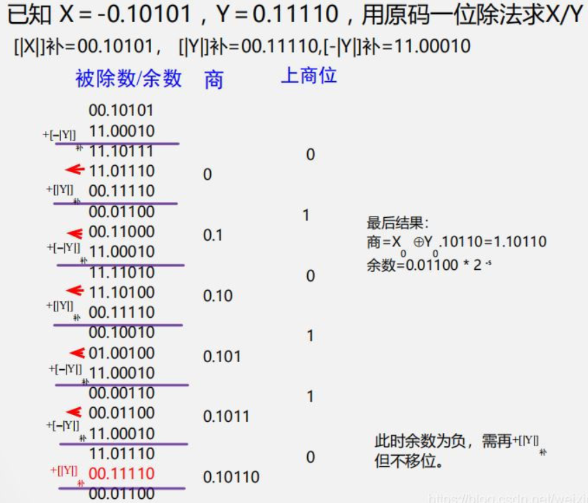
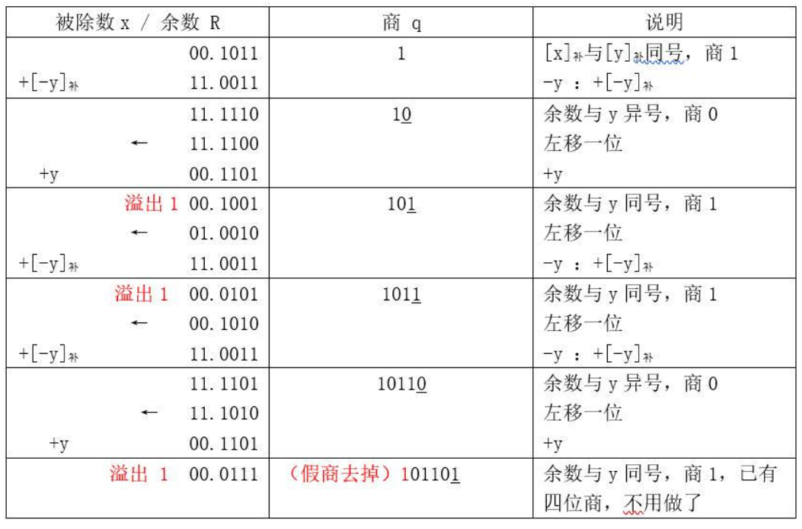
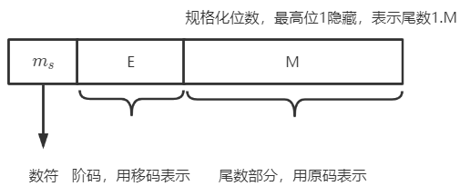
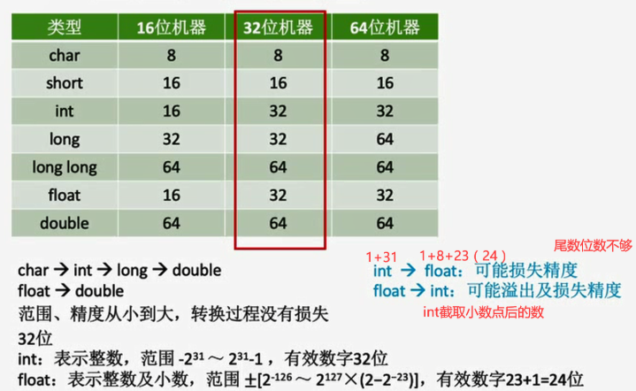
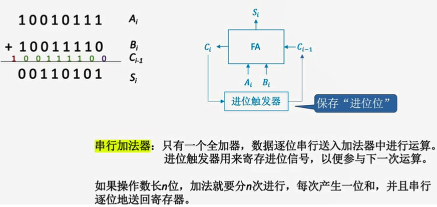
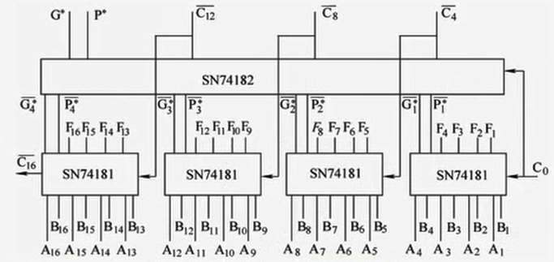

> 计算机中数的表示与运算
>
> ALU构造

<!--more-->

## 1.1 字符和字符串

## 1.2 数据存储与排列

### 1.2.1 存储模式

> 多字节数据在内存中一定占连续的字节

大端模式：高字节(MSB)低地址

小端模式：低地址(LSB)低字节

一个多字节数据，必须存放在连续的地址单元

### 1.2.2 边界对齐

> 这里的字：指计算机一次可同时处理的二进制位数，即 `机器字长` 

边界对齐：访问一个字/半字只需一次访存

边界不对齐：访问一个字/半字可能需要两次访存

若假设机器字长为4字节，分别采用边界对齐方式和边界不对齐方式存储三个数据

- 分别为3字节，两个半字，一个字
  

- 边界对齐方式，每个数据从新字开始，(低2位地址线引脚接地)
- 边界不对齐方式，每个数据从上个数据结尾开始

## 1.3 二进制

### 1.3.1 计算机采用二进制原因

- 可行性：二进制只有01两个状态，能标识01两种状态的电子器件很多。
- 运算简易性：二进制运算法则少，运算简单，简化硬件结构
- 有逻辑代数的理论基础：二进制0和1正好和逻辑代数的真假对应

### 1.3.2 编码（二进制的解释方式）

#### 原码

n+1位定点整数 $1\underbrace{1\cdots11}_{n}.\sim 0\underbrace{11\cdots1}_n.$ :范围 $-2^n-1\sim2^n-1$  

n+1位定点小数 $1.\underbrace{11\cdots 11}_{n}\sim 0.\underbrace{11\cdots 11}_n$ 范围 $-1+2^{-n}\sim 1-2^{-n}$ 

- 字长足够，则可表示任意整数
- 不能表示任意小数，只能是2的整数次幂
- 真值0不唯一，可表示数少1

#### 反码

真值0不唯一：+0，-0

表示数值的范围和原码相同

#### 补码

$n+1$ 位二进制数可表示

- 定点整数 $1\underbrace{00\cdots 00}_n.\sim 0\underbrace{11\cdots 11}.$ ：$-2^n \sim 2^n-1$
- 定点小数 $1.\underbrace{00\cdots00}_n\sim 0.\underbrace{11\cdots11}_n$ ： $-1\sim 1-2^{-n}$

**补码特点**(机内码)

- 真值0的补码唯一
- 正数的补码二进制表示的无符号数，小于负数的补码表示的无符号二进制数
  - 如：127：0111 1111，-1；
- 数值位1越多表示数字越大
  - 0同侧编码值越大，真值越大
  - 正数的2进制编码小于负数的二进制编码 1000(-8) <0111(7) 

**原码变为补码**：从右到左，找到第一个1，其左边取反，其右边不变
$$
\begin{aligned}
&原码：0111 0100\\
&补码：1000 1100
\end{aligned}
$$

- 正数补码等于原码（什么编码都不变）
- 负数补码等于原码取反加一

##### 编码方式与范围

n位2进制编码

| 编码方式       | 最小值编码                    | 最小值      | 最大值编码                       | 最大值      | 数值范围                      |
| -------------- | ----------------------------- | ----------- | -------------------------------- | ----------- | ----------------------------- |
| 无符号定点整数 | $\underbrace{00...00}_n.$     | 0           | $\underbrace{11...11}_n.$        | $2^{n+1}-1$ | $0\le x\le 2^{n+1}-1$         |
| 无符号定点小数 | $.\underbrace{00...00}_n$     | 0           | $0.\underbrace{11...11}_n$       | $1-2^{-n}$  | $0\le x\le 1-2^{-n}$          |
| 原码定点整数   | $1\underbrace{1...11}_{n-1}.$ | $-2^n+1$    | $0\underbrace{1\cdots11}_{n-1}.$ | $2^n-1$     | $-2^n+1\le x \le 2^n-1$       |
| 原码定点小数   | $1.\underbrace{1...11}_{n-1}$ | $-1+2^{-n}$ | $0.\underbrace{1...11}_{n-1}$    | $1-2^{-n}$  | $-1-2^{-n}\le x \le 1-2^{-n}$ |
| 补码定点整数   | $1\underbrace{0...00}_{n-1}.$ | $-2^n$      | $0\underbrace{1...11}_{n-1}.$    | $2^n-1$     | $-2^n\le x \le 2^n-1$         |
| 补码定点小数   | $1.\underbrace{0...00}_{n-1}$ | $-1$        | $0.\underbrace{1...11}_{n-1}$    | $1-2^{-n}$  | $-1\le x \le 1-2^{-n}$        |

#### 移码

> 真值加一个常数

$$
\begin{aligned}
&[x]_移=2^n+x（-2^n\le x \le 2^n，机器字长为n+1）\\
&x_1=+10101，x_2=-10101，字长8位，则其移码表示为：\\
&[x_1]_移=2^7+10101=1,0010101,[x_2]_移=2^7+(-10101)=0,1101011
\end{aligned}
$$

- 只能表示整数
- 真值0唯一
- 移码大小与数值的大小一致
  - 移码大，真值大
  - 移码小，真值小

**n位二进制能表示 $2^n$ 个数字**

### 1.3.3 无符号整数

> 用于表示内存地址信息 

表示范围 $0\sim 2^n-1$

若寄存器位数小于无符号定点整数，**舍去高位** 发生上溢出

### 1.3.4 定点数运算

#### 移位

##### 逻辑移位

**无符号数**，空位填0

##### 算术移位

**有符号数**

##### 循环移位

丢弃位会存在 `CF` 中

适用情况：高低字节数据互换

#### 加法

##### 原码

符号位相同：绝对值相加，符号位不变

符号位不同：符号等于绝对值大者

机内实现两种策略

- 转换为补码后，用补码加减法实现，结果再转回原码
- 直接用原码进行加减，符号与数值分开运算

##### 补码

符号位和尾数一起运算

补码运算结果为补码

补码加减运算：

- 当参加运算的数是定点小数时，模 $M=2$
- 当参加运算的数是定点整数时，模 $M=2^{n+1}$

$$
[A+B]_补=[A]_补+[B]_补(mod\quad M)\\
[A-B]_补=[A]_补+[-B]_补(mod\quad M)
$$

##### 溢出判断

> 只有 “正数+正数” 才可能 **上溢** —— 正+正=负
>
> 只有 “负数+负数” 才可能 **下溢** —— 负+负=正

**采用一位符号位** (模2补码)

设 A 的符号位为 $A_s$ ，B的符号位为 $B_s$ ，运算结果符号位为 $S_s$ ，则溢出表达式为 $V=\underbrace{A_sB_s\overline{S_s}}_{001}+\underbrace{\overline{A_s}\overline{B_s}S_s}_{110}$ 

- $V=1$ ，表示无溢出
- $V=0$ ，表示有溢出

如：
$$
\begin{aligned}
&[A+B]_{补}=0,0001111+0,1111100=1,0001011 真值-117 V=0，溢出\\
&[B-C]_补=1,1101000+1,0000100=0,1101100 真值+108，V=1，溢出
\end{aligned}
$$
**根据进位情况判断**

|      | 符号位进位 $C_S$ | 最高数值位进位 $C_1$ |
| ---- | ---------------- | -------------------- |
| 上溢 | 0                | 1                    |
| 下溢 | 1                | 0                    |

即：$C_s$ 与 $C_1$ 不同时有溢出

溢出判断表达式为 $V=C_s\oplus C_1$

- $V=0$ ，表示无溢出
- $V=1$ ，表示有溢出

**双符号位** （模4补码）

正数符号00，负数符号11
$$
\begin{aligned}
&[A+C]_补=00,0001111+00,1111100=\underbrace{0}_{本来符号位}\underbrace{1}_{实际符号位},0001011 \quad 上溢\\
&[B-C]_补=11,1101000+11,0000100=10,1101100\quad 下溢
\end{aligned}
$$
记两个符号位为 $S_{s1}S_{s2}$ ，则 $V=S_{s_1}\oplus S_{s_2}$ 

- $V=0$ ，表示无溢出
- $V=1$ ，表示有溢出

上溢：超出表示范围的上边界

下溢：低于表示范围的下边界

注意：

- 实际存储时只存一位符号位，在运算时复制
- 双符号位，算术移位只有低位符号位参与（由于实际只存1位）

#### 乘法

##### 原码一位乘

结果的符号位通过 **异或** 确定

- 符号位不参与运算，可以省略
- 原码一位乘可以只用单符号位

数值部分通过被乘数和乘数绝对值的n轮 **加法、移位** 完成

根据当前乘数中参与运算的位确定 (ACC) 加什么

- 为0，则 $(ACC)+0$
- 为1，则 $(ACC)+[\mid x\mid]_原$

每轮加法后，ACC，MQ的内容统一 **逻辑右移 **

###### 如

设机器字长5位（1位符号位，4位数值位），$x=(13)_{10}=+1101,y=(-11)_{10}=-1011$ ，采用原码一位乘法求 $x\times y$

- 符号位 $P_s = x_s\oplus y_s=0\oplus 1=1$

- $\mid x\mid = 1101,\mid y\mid = 1011$ ，原码一位乘法的求解过程如下

	

- 最后结果为 $P_s+(ACC)+(MQ)=1.1000\quad1111=-0.1000\quad1111$

还不懂的话去看：https://blog.csdn.net/qq_46077337/article/details/112401439

##### 补码一位乘(Booth法)

> 增加一位辅助位，补充到最低位，初始值为 $0$

- n轮加法，加法规则 

  

- 补码的算数右移，符号位不动，数值位右移

  符号位是什么就补什么

###### 如

设机器字长5位（1位符号位，4位数值位），$x=(-13)_{10}=-0.1101,y=(11)_{10}=+0.1011$ ，采用补码一位乘法求 $x\times y$

- $[x]_补=11.0011,[-x]_{补}=00.1101$

- 计算过程
  

- 结果：$[x·y]_{补}=11.0111\quad 0001$，即 $x·y=-0.1000\quad 1111$

还不懂的话去看：https://zhuanlan.zhihu.com/p/367308695

#### 除法

##### 原码一位除

符号位 $Q_s = x_s\oplus y_s$

> 恢复余数法：当余数为负时，上商0，并 $+除数$ ，再左移，再 $-除数$
>
> 加减交替法：当余数为负时，上商0，并左移，再 $+除数$

##### 补码一位除

- 符号位参与运算，除数和被除数均用双符号位表示

1. 被除数与除数同号，被除数减去除数；

   被除数与除数异号，被除数加上除数

2. 余数和除数同号，商为1，余数左移一位，下次减除数；

   余数和除数异号，商为0，余数左移一位，下次加除数。

3. 重复步骤2，包括符号在内，工作n+1步

###### 如

已知 x=0.1011，y=0.1101，用补码加减交替法求 $\frac{x}{y}$

$[x]_补=00.1011,[y]=00.1101,[-y]_补=11.0011,n=4$

商 $[Q]_补=0.1101$，余数 $[R]_补=0.0111$

#### 强制类型转换

##### 等字长无符号数与有符号数

位值不变，改变解释方式

##### 不同字长整数之间转换

###### 大字长到小字长

将多余高位字长部分截断，低位赋值

###### 小字长到大字长

数值相等，高位进行符号位填充

###### 填充规则

- 定点整数：在原符号位和数值位中间添加新位

  正数加0

  负数：原码加0；反，补码加1

- 定点小数：在原数值位后面添加新位

  正数都加0

  负数：原、补码加0，反码加1

### 1.3.5 浮点数运算

#### 引入目的

- 在二进制位数不变的前提下，扩展可表示范围
- 定点数精度比浮点数大

#### 格式

浮点数数值： $N=r^E\times M$

##### 阶码

阶码反映浮点数表示范围及小数点位置

> 阶码是用**补码或移码**表示的定点整数

阶码的表示算数左移位数

##### 尾数

尾数反映精度

> 尾数是用**原码或补码**表示的定点小数

尾数越少，可表示的精度越低

##### 如

7位阶码，1位数符，8位尾数。若阶码用移码，尾数用补码表示，则浮点数所能表示数的范围

- 阶码最大 $2^7-1=63$

  尾数范围 $-1\sim 1-2^{-8}$

  $-2^{63}\sim (1-2^{-8})\times2^{63}$

##### 规格化

没有隐含1，尾数最小值为-1

有隐含1，尾数最小值 $-(2-2^n)$

#### 尾数规格化

规格化浮点数：规定位数的最高数值位必须是一个有效值

左规：当浮点数运算的结果为非规格化时要进行规格化处理，将 **尾数算数左移一位，阶码减一**

右规：当浮点数运算的结果位数出现溢出（双符号位为01或10）时，将 **尾数算数右移一位，阶码加一**

##### 用原码表示的尾数进行规格化

正数 $0.1XXX..XX$ 的形式。其最大值表示为 $0.11..1$ ，最小值表示为 $0.10..0$ 。尾数的表示范围为 $\frac{1}{2}\le M\le (1-2^{-n})$ 

负数为 $1.1XXX..XX$ 的形式。 其最大值表示为 $1.10..0$ ，最小值表示为 $1.11..1$ 。位数的表示范围为  $-(1-2^{-n})\le M\le-\frac{1}{2}$

##### 用补码表示的位数进行规格化

正数 $0.1XX..X$ 的形式。其最大值表示为 $0.11...1$ ，最小值表示为 $0.10..0$。尾数的表示范围为 $\frac{1}{2}\le M\le (1-2^{-n})$ 。

负数 $1.0XX..X$ 的形式。其最大值表示为 $1.01...1$ ，最小值表示为 $1.00..0$ 。尾数的表示范围为 $-1\le M\le -(\frac{1}{2}+2^{-n})$

#### 浮点数可表示范围

阶码和尾数均用补码表示，阶码部分共 $K+1$ 为(含1位阶符)，位数部分共 $n+1$ 位(含1位数符)，则这样的浮点数的表示范围是多少

| 浮点数           | 阶码         | 尾数            | 真值                              |
| ---------------- | ------------ | --------------- | --------------------------------- |
| (规格化)最大正数 | $01\cdots 1$ | $0.11\cdots 11$ | $(1-2^{-n})\times 2^{2^k-1}$      |
| 最小正数         | $10\cdots 0$ | $0.00\cdots 01$ | $1-2^{-n}\times 2^{-k}$           |
| 规格化最小正数   | $10\cdots 0$ | $0.10\cdots 0$  | $2^{-1}\times 2^{-2^{k}}$         |
| (规格化)最小负数 | $01\cdots 1$ | $1.00\cdots 00$ | $(-1)\times 2^{2^k-1}$            |
| 最大负数         | $10\cdots 0$ | $1.11\cdots 11$ | $-2^{-n}\times 2^{-2^k}$          |
| 规格化最大负数   | $10\cdots 0$ | $1.01\cdots 11$ | $-(2^{-n}+2^{-1})\times 2^{-2^k}$ |

#### IEEE754

引入目的：增加数据的表示精度

##### 格式

规格化的单精度浮点数：$(-1)^s\times 1.M\times 2^{E-127}$ 

> IEEE754浮点数表示与符号位表示类似，将各部分分别表示后，添加符号位 

- 尾数实际位数为24bit——隐含1

| 类型                 | 数符s位数 | 阶码E位数         | 尾数M位数 | 总位数 | 阶码偏移值$(2^{阶码位数}-1)$ |
| -------------------- | --------- | ----------------- | --------- | ------ | ---------------------------- |
| 单精度浮点数(float)  | 1         | 8$(-126\sim 127)$ | 23        | 32     | 127                          |
| 双精度浮点数(double) | 1         | 11                | 52        | 64     | 1023                         |

##### IEEE754阶码

> $E-127=E的二进制表示+1000 0001$ 
>
> 阶码真值=阶码无符号整数值-阶码偏移值

| 阶码      | 无符号整数 | 阶码真值(IEEE偏移值$-(2^{n-1}-1)$) |
| --------- | ---------- | ---------------------------------- |
| 0000 0001 | 1          | -126                               |
| 0000 0010 | 2          | -125                               |
| ...       | ...        | ...                                |
| 0111 1111 | 127        | 0                                  |
| 1000 0000 | 128        | 1                                  |
| ...       | ...        | ...                                |
| 1111 1110 | 254        | 127                                |

##### IEEE754浮点数范围

| 格式   | 规格化的最小绝对值                                   | 规格化的最大绝对值                                           |
| ------ | ---------------------------------------------------- | ------------------------------------------------------------ |
| 单精度 | E=1；M=0；$1.0\times 2^{1-127}=1.0\times 2^{-126}$   | E=254；M=.11...1；$1.11...1\times 2^{254-127}=(2-2^{-23})\times 2^{127}$ |
| 双精度 | E=1；M=0；$1.0\times 2^{1-1023}=1.0\times 2^{-1022}$ | E=2046；M=.11...1；$1.11...1\times 2^{2046-1023}=(2-2^{1023})\times 2^{1023}$ |

阶码E全为0，尾数不是非规格化小数

- 尾数M不全为0——非规格化小数
- 尾数M全为0——真值0

阶码E全为1，尾数M全为0——无穷大

阶码E全为1，尾数M不全为0——非数值

##### 溢出

#### 加减运算

#### 强制类型转换

- IEEE754尾数默认省略最高位1
- 当 `int` 类型转浮点数类型，若整数位数>24位，会有舍入误差

##### 举例

> 若 `i` 是一个 `int` 型整数，`f` 和 `d` 分别为 `float` 型(32位) 和 `double` (64位) 实数。判断各布尔表达式的布尔值

1. `i==(int)((double)i)` 

   `true` : int 32位有效数字，double为52+1=53位有效数字，所以强制转化为 double 类型后在转回去不会 发生精度损失

2. `f == (float)((int)f)`

   `false`: float 型有小数部分，转为int后可能没有小数部分

   float转为int有32位有效数字，再转回float后，可能丢失有效数字

3. `f == (float)((double)f)`

   `true`: double比float精度高，float转为double不会丢失精度

4. `d == (double)((float)f)`

   `false`: float尾数有效位数小于double，所以 `(float)f` 会丢失精度，再转回 double后，不相等

## 1.4 运算器构造与功能

## 1.5 加法器

### 1.5.1 一位全加器FA

> 作用：求本位和、进位

### 1.5.2 串行加法器

> 作用：完成两个n位二进制数的加法

### 1.5.3 并行加法器

$$
\begin{aligned}
&C_i=A_iB_i+(A_i\oplus B_i)C_{i-1}\\
&C_{i-1}=A_{i-1}B_{i-1}+(A_{i-1}\oplus B_{i-1})C_{i-2}
\end{aligned}
$$

根据进位计算公式，发现当前公式中进位是上一公式计算得出的，而上一公式中的进位是由其上一位公式计算的出的。最终可以展开到 $C_0$ ，这样 $C_i$ 就不需要等待 $C_{i-1}$ 计算完成后再进行计算。

#### 串行连接

> 将n个并行全加器串接起来，就可进行两个n位数相加

串行进位又称行波进位，每一级的进位直接依赖于前一级的进位，即进位信号是逐级形成的

- 运算的速度取决于进位产生和传递速度 

#### 并行连接

> 并行进位的并行加法器（先行进位，同时进位）：各级进位信号同时生成

$$
\begin{aligned}
&G_i=A_iB_i\quad P_i=A_i\oplus B_i\\
&C_i=A_iB_i+(A_i\oplus B_i)C_{i-1}=G_i+P_iC_{i-1}\\
\\
&C_1=G_1+P_1C_0\\
&C_2=G_2+P_2C_1=G_2+P_2(G_1+P_1C_0)\\
&C_3=G_3+P_3C_2=G_3+P_3(G_2+P_2(G_1+P_1C_0))\\
&\dots
\end{aligned}
$$

- $G_i$ 为进位产生函数，当 $G_i==1$ 时，一定会产生进位
- 进位传递函数：当 $A_i$ 与 $B_i$ 只有一个1，会把 $C_{i-1}$ 传递到高位 $C_i$

根据进位函数，构造 **先行进位电路CLA**

#### ALU

### 1.5.4 分组并行进位加法器

#### 单级先行进位

> 组内并行、组件串行

由于并行加法器在计算进位时，越高位用到的逻辑门元件越多，而 $C_1\sim C_4$ 的产生速度很快， 所以将一个4位CLA作为一个组，组内进位可同时得出，产生一个组进位
$$
\begin{aligned}
&C_1=G_1+P_1C_0\\
&C_2=G_2+P_2C_1=G_2+P_2(G_1+P_1C_0)\\
&C_3=G_3+P_3C_2=G_3+P_3(G_2+P_2(G_1+P_1C_0))\\
&C_4=G_4+P_4C_3=G_4+P_4(G_3+P_3(G_2+P_2(G_1+P_1C_0)))\\
\end{aligned}
$$
只有得到前一组的进位信号，本组才可以计算

##### ALU

#### 多级先行进位

> 组内并行，组件并行

多个组的进位信号同时产生

##### ALU

