> 完成某一个功能需要在转化成计算机可识别的指令集去执行，需要我们深入了解一条指令的执行过程
>
> 针对不同的需求设计了不同的指令寻址方式
>
> 一台计算机的全部指令构成了该计算机的指令集系统

<!--more-->

## 3.1 指令

### 3.1.1 概念

机器指令：计算机执行某种指令的命令；计算机运行的最小功能单位

指令系统（指令集）：一台计算机所有指令的集合

计算机表示：一条指令为一组二进制代码

---

引入指令系统

- 避免用户直接与二进制代码接触，方便编写

- 指令系统表征计算机系统性能

  指令格式直接影响机器的硬件结构

  直接影响系统如安妮剪

  影响机器的适用范围

### 3.1.2 指令结构

#### 操作码+地址吗

操作码：操作类型及功能

- 识别指令
- 区分操作数地址内容的组成和使用方法

地址码：给出被操作的信息（指令和数据）

- 地址指定方式

  大端方式：高字节，低地址

  小端方式：低字节，低地址


#### 定长操作码，变长指令码

##### 指令码最短

- 寄存器寻址
- 隐含寻址
- 寄存器间接寻址

##### 指令码最长

- 立即寻址
- 直接寻址
- 简介寻址

若指令码过短，则无法表示范围较大的立即数地址

##### 执行速度最快

- 寄存器寻址
- 定长则立即数寻址最快：立即数寻址一般需要较多二进制位，取指时不止一次访存

##### 执行速度最慢

- 间接寻址

### 3.1.3 分类

#### 按地址码数目分类

##### 零地址指令


1. 不需要操作数：如空操作、停机、关中断
2. 堆栈计算机，两个操作数隐含存放在栈顶和次栈顶，计算结果压回栈顶

##### 一地址指令


> $A_i$ 指某个主存地址，$(A_i)$ 指 $A_i$ 所指向的地址中的内容

1. 只需单操作数，如：加1、减1、取反、求补等

   $OP(A_i)\rightarrow A_i$ ，完成一条指令需要3次访存：$取指\rightarrow 读A_i\rightarrow 写A_i$

2. 需要两个操作数，但其中一个操作数隐含在某个寄存器（如隐含在ACC）

   $(ACC)OP(A_i)\rightarrow ACC$ ，完成一条指令需要两次访存：$取指\rightarrow 读A_i$

##### 二地址指令


常用于需要两个操作数的算术运算、逻辑运算

$(A_1) OP (A_2)\rightarrow A_1$ ，完成一条指令需要访存四次： $取指\rightarrow 读A_1\rightarrow A_2\rightarrow 写A_1$

##### 三地址指令


常用于需要两个操作数的算术运算、逻辑运算相关指令

$(A_1)OP(A_2)\rightarrow A_3$ ，完成一条指令需要访存四次：$取指\rightarrow 读A_1 \rightarrow 读A_2 \rightarrow A_3$

##### 四地址指令


$(A_1)OP(A_2)\rightarrow (A3),A_4=下一条将要执行指令的地址$

完成一条指令需要访存四次 $取指\rightarrow 读A_1\rightarrow A_2\rightarrow 写A_3$

正常情况下：取指令之后，$PC+1$ 指向下一条指令

四地址指令：执行指令后，将PC的值修改为 $A_4$ 所指的地址

#### 按指令长度分类

> 机器字长&指令字长&存储字长

- 机器字长：CPU一次处理二进制位数

  与ALU有关

- 指令字长：一条指令总长度

  指令不同，指令格式不同，则长度不同

  指令字长为字节的整数倍

- 存储字长：一个存储单元位数

  与MDR位数有关

设机器字长为32位，一个容量为16MB的存储器，CPU按半字寻址，其寻址单元数是

- 存储器容量为 $2^{24B}$ ，即内存地址为24位，CPU按半字寻址，即16位为一个寻址单元，故寻址单元数为$\frac{24}{2}=2^{23}$ 个

##### 定长指令字结构

所有指令长度相同

##### 变长指令字结构

#### 按操作码长度分类

##### 定长操作码

n位操作码，可以有 $2^n$ 条指令

特点：控制器移码电路设计简单，灵活性较低

##### 变长操作码

控制器移码电路设计复杂，灵活性较高

#### 按操作类型分类

##### 数据传送类

CPU(Reg)-内存间的数据传送

```
LOAD：把存储器中的数据放到寄存器中
STORE：把寄存器中数据放到存储器中
```

##### 运算类

> 算数运算符

加、减、乘、除、自增、自减、求补、浮点运算、十进制运算

> 逻辑运算

与、或、非、异或、位操作

- 算数移位
- 逻辑移位
- 循环移位

##### 程序控制类

- 无条件转移
- 条件转移
- 调用和返回
- 陷阱指令

##### 输入输出类

CPU-IO端口（IO接口中的寄存器）

### 3.1.4 扩展操作码

> 定长指令字结构+可变长操作码
>
> 地址长度为n，上一层留出m种状态，下一层可扩展出 $m*2^n$ 种状态

特点

- 在指令字长有限的前提下仍保持比较丰富的指令种类
- 增加了指令移码和分析的难度，使控制器的设计复杂

#### 举例

指令字长为16位，每个地址码4位，前四位为基本操作码字段OP，另外三个4位长的地址字段$A_1,A_2,A_3$


4位基本操作码若全部用于三地址指令，则有16条，但至少需将 $A_1 = 1111$ 作为扩展操作码之用，即三地址指令15条

$A_1=1111\quad A_2=1111$ 留作扩展码之用，二地址指令为15条

$A_1=1111 \quad A_2=1111\quad A_3=1111$ 留作扩展码之用，一地址指令为15条

零地址指令为 $2^4=16$ 条

## 3.2 指令寻址

### 3.2.1 寻址方式

指令寻址：下一条欲执行指令的地址

数据寻址：本条指令的数据地址

- 指令中的地址码：形式地址A
- 有效地址：操作数在存储器中的真实地址EA
- (A):表示从主存中取地址A的内容

### 3.2.2 指令寻址

#### 顺序寻址

(PC)+"1"$\rightarrow$PC："1"表示指令字长

- 存储器按字编址：PC+1
- 存储器按字节编址：PC+一字长字节数

**下指令地址时钟由PC指出，PC长度取决于存储器字数；IR用于存储指令，取决于指令字长**

#### 跳跃寻址

> 下指令地址由本条指令给出

##### 执行过程

1. PC+1指向当前跳跃指令

2. 跳跃指令给出下条地址

   修改PC中的值

3. 接下来CPU执行PC中给出的指令

##### 结果

PC中的值为跳跃后的地址

##### 跳跃到的地址

- 绝对地址
- 相对地址

### 3.2.3 数据寻址

#### 获得操作数地址的方法

- 获得存储单元段内偏移地址的方法

- 段基址常用默认方式获得

  DS

  BP默认段基址为SS

- 指令存放于CS中，数据可放于ES，SS

#### 指令格式

> 增加寻址特征字段，指明寻址方式

- 寻址方式不同，地址码A的解读方式不同


#### 分类

##### 立即寻址

> 形式地址A就是操作数本身，又称立即数，一般用补码形式，寻址特征为`#`


- 操作数获取便捷，但指令长度一般很长，常用语寄存器赋值

##### 直接寻址

> 指令中的形式地址A就是操作数的真是地址EA，即EA=A

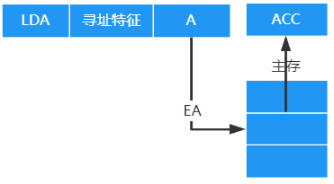

访存2次：取指令——一次，执行指令——访存一次

优点：

- 简单
- 缩短了指令长度
- 指令执行阶段只访问一次主存，不需要专门计算操作数地址

缺点：A的位数决定了该指令操作数的寻址范围，操作数的地址不易修改

##### 间接寻址

> A给出操作数有效地址的地址，(A)=EA

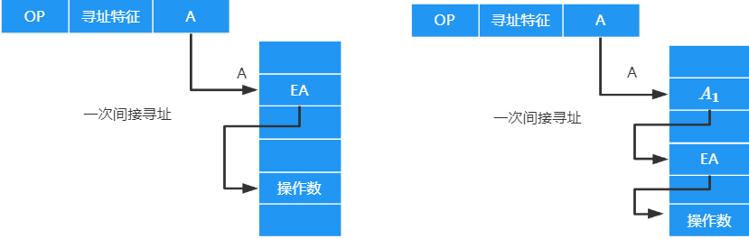

优点：

- 可扩大寻址范围

  有效地址EA的位数大于形式地址A的位数

- 便于编制程序

  用间接寻址可以方便地完成子程序返回

缺点：

- 指令执行阶段需要多次访存

##### 寄存器寻址

> 在形式地址中直接给出操作数所在的寄存器编号，即 $EA=R_i$ ，其操作数在由 $R_i$ 所指的寄存器中 

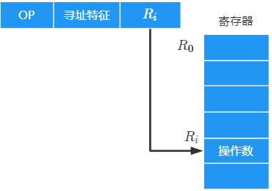

一条指令的执行访存一次：取指令（访存一次），执行指令（不访存）

优点：

- 指令字短
- 运行速度快：指令在执行阶段不访问主存，只访问寄存器

缺点：

- 寄存器价格昂贵，计算机中寄存器个数有限

##### 寄存器间接寻址

> 寄存器 $R_i$ 中给出的不是一个操作数，而是操作数所在主存单元的地址，即 $EA=(R_i)$

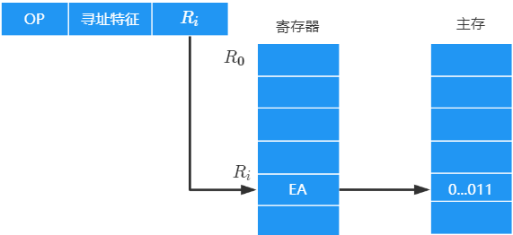

一条指令的执行访存两次：取指令一次，执行指令访存一次

特点：

- 与一般间址寻址相比速度更快，但指令的执行阶段（取操作数）需要访问主存
- 扩大了寻址范围

##### 隐含寻址

> 不是明显地给出操作数的地址，而是在指令中隐含着操作数的地址，$EA由程序指定$

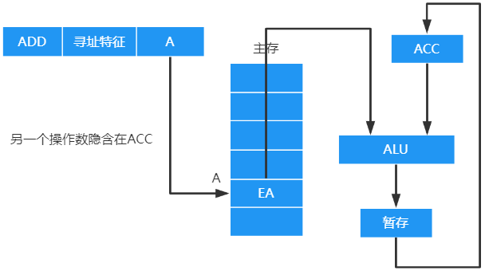

优点：

- 有利于缩短指令字长

缺点：

- 需增加存储操作数或隐含地址的硬件

##### 堆栈寻址

*堆栈是存储器中按 “后进先出” 原则管理的存储区，该存储区中被读/写单元的地址用一个特定的寄存器给出的——堆栈指针（SP）*

> 操作数存放在堆栈中，隐含使用堆栈指针（`SP`）作为操作数地址，$入栈和出栈时EA确定方式不同$
>
> **特殊的隐含寻址**

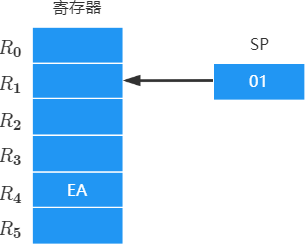

**硬堆栈**

- 寄存器堆栈：成本高，不适合做大容量堆栈
- 不访存

**软堆栈**

- 从主存中划出一段区域作为堆栈：最常用且划算
- 访存一次

##### 偏移寻址

###### 相对寻址

> 把 `程序计数器(PC)` 的内容加上指令格式中的形式地址A而形成操作数的有效地址，即 $EA=(PC)+A$ ,其 A是相对于PC的偏移量

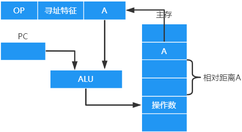

优点：

- 操作数的地址不是固定的，它随着PC值的变化而变化，并且与指令地址之间总是相差一个固定值，因此 **便于程序浮动** ，相对寻址广泛应该用与转移指令

作用：**改变程序执行顺序**

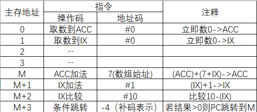

###### 基址寻址

程序运行前，CPU将BR的值修改为该段程序的其实地址（存在操作系统PCB中）

> **以程序起始存放地址为“起点”**：将CPU中基址寄存器（BR）的内容加上形式地址A，形成操作数的有效地址（EA），即 $EA=(BR)+A$
>
> 基址寄存器：程序起始存放地址

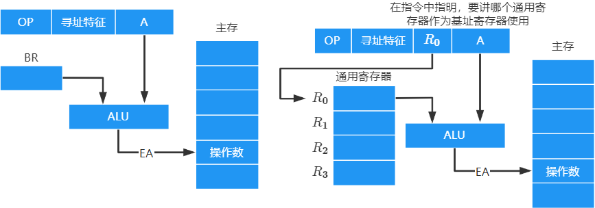

优点：

- 便于程序浮动（改变程序在内存中的位置），实现多道程序并发运行

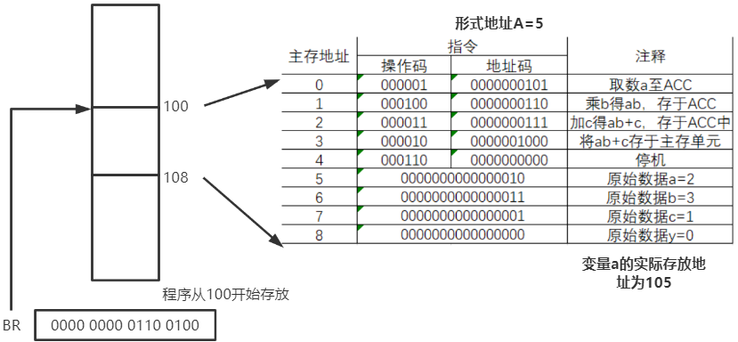

**基址寄存器是面向操作系统**的，其**内容由操作系统或管理程序确定** 。在程序执行过程中，基址寄存器的内容不变（作为基地址），形式地址可变（作为偏移量）。

当采用通用寄存器作为基址寄存器时，可由 **用户决定** 哪个寄存器作为基址寄存器，但其内容仍有操作系统确定

###### 变址寻址

> 程序员自己决定起点，即 $EA=(IX)+A$

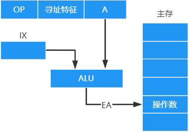

变址寻址是 **面向用户** 的，在程序执行过程中，**变址寄存器的内容可由用户改变** ，(IX)作为偏移量，形式地址A不变

特点：

- 用于数组处理：可设定A为数组的首地址，不断改变变址寄存器的内容，便可很容易形成数组中任一数据的地址
- 适合编制循环程序

###### 偏移寻址的对比

|                  | 基址寻址                         | 变址寻址                | 相对寻址               |
| ---------------- | -------------------------------- | ----------------------- | ---------------------- |
| 面向             | 操作系统                         | 用户                    |                        |
| 应用             | 为多道程序分配内存空间           | 处理数组问题            | 转移指令               |
| 内容             | 由操作系统和管理程序决定         | 由用户设定              |                        |
| 基址寄存器执行时 | 不可变                           | 可变                    |                        |
| 指令字A执行时    | 可变                             | 不可变                  |                        |
| 寻址范围         | $(BR)\sim(BR)+2^{形式地址A位数}$ | $(A)\sim(A)+2^{IX位数}$ | 在PC附近的 $2^{A位数}$ |

## 3.3 指令执行

### 3.3.1 指令周期

> 从主存中取出并执行一条指令的时间

**一个指令周期必须有取指与执行周期** 

- 译码时间相对于访存时间很短

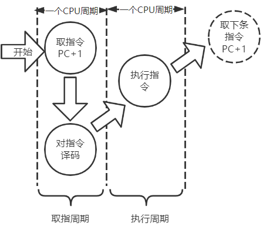

- 取指周期
- 间址周期
- 执行周期
- 中断周期

#### 指令周期涉及的关系

> **每个指令周期内有若干不定长机器周期，每个机器周期由若干定长时钟周期**

时钟周期：一个微操作占一个时钟周期

- 节拍：CPU操作的最基本单位

机器周期：指令周期中相对完整的一步所需时间

- 机器周期=主存周期：通过一次总线事务访问一次主存或I/O的时间

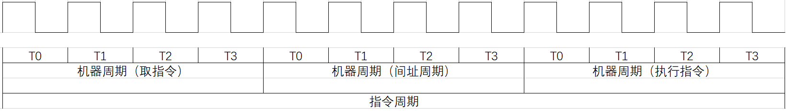

#### 四个周期执行过程

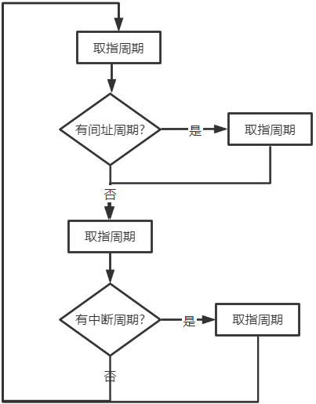

四个工作周期都有CPU访存操作，只是访存的目的不同

- 取指周期是为了 **取指令**
- 间址周期是为了 **取有效地址**
- 执行周期是为了 **取操作数**
- 中断周期是为了 **保存程序断点**

CPU如何区分指令和数据？

- 从时间上讲：CPU根据指令周期的不同阶段判断从存储器中取出的二进制代码是指令还是数据
- 从空间上讲：指令流向控制器（IR），数据流向运算器（通用寄存器）

##### 取指周期

> 根据PC内容访问主存或Cache，取指到IR

取指结束后，需要进行指令译码

- 硬布线型：OP(IR)送至指令译码器ID
- 微程序型：OP(IR)送至微命令形成部件

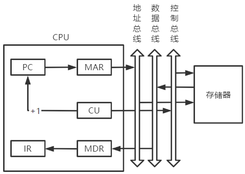

1. *当前指令地址* 送至 `存储器地址寄存器(MAR)` ：

   `(PC)->MAR`

2. `CU` 发出 *控制信号* ，经 `控制总线` 传送到主存

   `1->R`

3. 将 `MAR` 所指主存中的内容经 `数据总线` 传送到 `MDR`

   `M(MAR)->MDR`

4. 将 `MDR` 中的内容送入 `IR`

   `(MDR)->IR`

5. `CU` 发出 *控制信号* ，形成下一条指令地址

   `(PC)+1->PC`

##### 间址周期

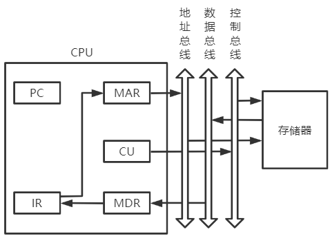

0. MDR中数据为操作数有效地址

1. 将指令的地址码送入MAR

   `Ad(IR)->MAR` 或 `Ad(MDR)->MAR`

2. CU发出控制信号，启动主存做 *读操作* 

   `1->R`

3. 将MAR所指主存中的内容经数据总线送入MDR

   `M(MAR)->MDR`

4. 多次间址：将有效地址送至指令的地址码字段

   `(MDR)->Ad(IR)` 

##### 执行周期

> 不同指令的执行周期操作不同，没有统一的数据流向

##### 中断周期

> **本质上是将断点存入某个存储单元**
>
> 中断：暂停当前任务去完成其他任务
>
> 为了能恢复当前任务，需要保存断点
>
> 一般用堆栈保存断点，SP指向栈顶元素

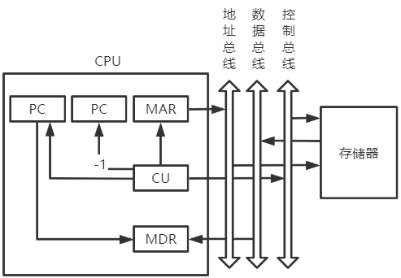

1. CU控制SP减1，修改后的地址送入MAR

   `(SP)-1->SP,(SP)->MAR`

   堆栈寄存器自减，不占用总线，所以在一个节拍内，SP减1，同时将SP中内容传送到MAR中

2. CU发出控制信号，启动主存做写操作

   `1->W`

3. 将断点(PC内容)送入MDR

   `(PC)->MDR`

4. CU控制将 *中断服务程序(向量地址)* 的入口地址送入PC

   `向量地址->PC`

### 3.3.2 指令流水

#### 指令的执行方案

> 一个指令周期通常要包括几个时间段（执行步骤），每个步骤完成指令中的一部分，几个依次执行的步骤完成这条指令的全部功能

1. 单指令周期

   对**所有指令都选用相同的执行时间**，**指令之间串行执行**

   指令周期取决于执行时间最长指令的执行时间

2. 多指令周期

   对不同类型的指令选用不同执行步骤完成，即**不同指令不同的执行时间**

   **指令间串行执行**，可选用不同个数的时钟周期来完成不同指令的执行过程

3. 流水线方案

   在每一个时钟周期启动一条指令，尽量让**多条指令同时执行**，各自出在不同的执行步骤中

---

#### 理想情况（前提）

指令执行的各个阶段

- 所用时间相同

- 执行结束后能立即进入下一阶段
- 所需的硬件资源不同且相互独立
- 一个机器周期只含一个时钟周期

#### 定义

##### 一条指令执行分为相互独立的阶段

> 每个子过程与其他子过程并行执行，提高系统吞吐率

取指：根据PC内容访问主存或Cache，取指到IR

分析：对指令译码

- 形成操作数的有效地址
- 从有效地址EA中取出操作数

执行：根据操作码字段，完成规定功能

##### 处理器执行多条指令的方式

**串行执行方式**

任何时刻只有一条指令在执行，各功能部件利用率低

**一次堆叠方式**

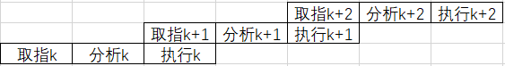
$$
总耗时T=3t+(n-1)\times 2t=(1+2n)t
$$


优点：程序的执行时间缩短了 $\frac{1}{3}$

缺点：需要付出硬件上较大的代价；控制过程也比顺序执行复杂

**二次堆叠方式**

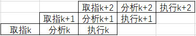
$$
总耗时T=3t+(n-1)\times t=(n+2)\times t
$$
一条指令分为三个阶段的理想情况是二次堆叠

理想情况下，处理机中同时有三条指令在执行

#### 流水线表示方式

##### 指令执行过程图

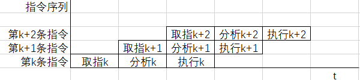

##### 时空图

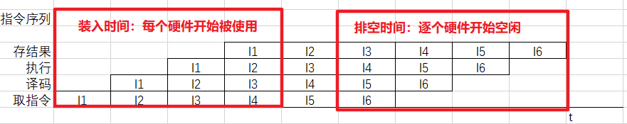

#### 性能指标

##### 吞吐率TP

> 在单位时间内流水线所完成的任务数量，或是输出结果的数量
>
> 设完成n个任务所需时间为 $T_k$ ，则该流水线吞吐率 $TP=\frac{n}{T_k}$

理想情况下（n个任务n-1次堆叠），一条指令的执行分为k个阶段，每个阶段耗时相同为 $\triangle t$ ，一般情况下 $\triangle t=一个时钟周期$ 

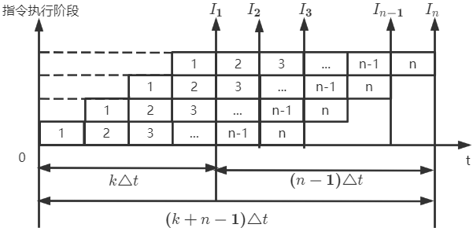

所以流水线完成n条指令耗时 $T_k=k\triangle t+(n-1)\triangle t$ ，实际吞吐率为 $TP=\frac{n}{T_k}=\frac{n}{(k+n-1)\triangle t}$

当连续输入n个任务($n\rightarrow \infty$)，则该流水线的最大吞吐率 $TP_{max}=\frac{1}{\triangle t}$

##### 加速比S

> 完成同样一批任务，不使用流水线所用时间与使用流水线所用时间之比
>
> 设 $T_0$ 表示不适用流水线的执行时间（多条指令顺序执行所用的时间）；$T_k$ 表示使用流水线时所用的执行时间，则流水线加速比 $S=\frac{T_0}{T_k}$ 

理想情况下（n个任务n-1次堆叠），一条指令的执行分为k个阶段，每个阶段耗时相同为 $\triangle t$ ，一般情况下 $\triangle t=一个时钟周期$


顺序完成n个任务耗时 $T_0=nk\triangle  t$ ，使用流水线执行n条指令耗时 $T_k=(k+n-1)\triangle t$

实际加速比 $S=\frac{T_0}{T_k}=\frac{nk\triangle t}{(k+n-1)\triangle t}$

当连续输入n个任务($n\rightarrow \infty$)，则该流水线的最大加速比 $S_{max}=k$

##### 效率

> 流水线的设备利用率

理想情况下（n个任务n-1次堆叠），一条指令的执行分为k个阶段，每个阶段耗时相同为 $\triangle t$ ，一般情况下 $\triangle t=一个时钟周期$

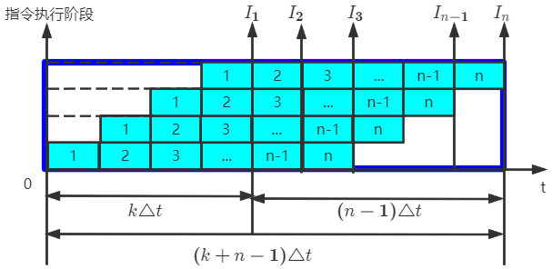

在时空图中，流水线效率定义为
$$
E=\frac{n个任务占用k时空区有效面积}{n个任务占用k时空区围成的总面积}=\frac{T_0}{kT_k}
$$
当连续输入n个任务($n\rightarrow \infty$)，则该流水线的最大加速比 $E_{max}=1$

#### 五段式指令流水线

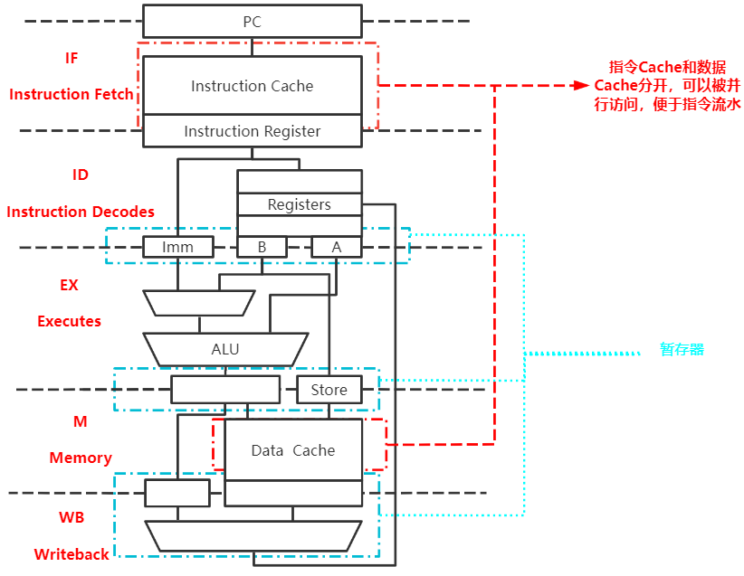

流水线每一个功能部件后面都要有一个缓冲寄存器（锁存器），用于保存本流水段的执行结果，提供给下一流水段使用

- 因为段执行用时不同，所以需要暂存器统一各阶段用时

##### 运算类指令执行过程

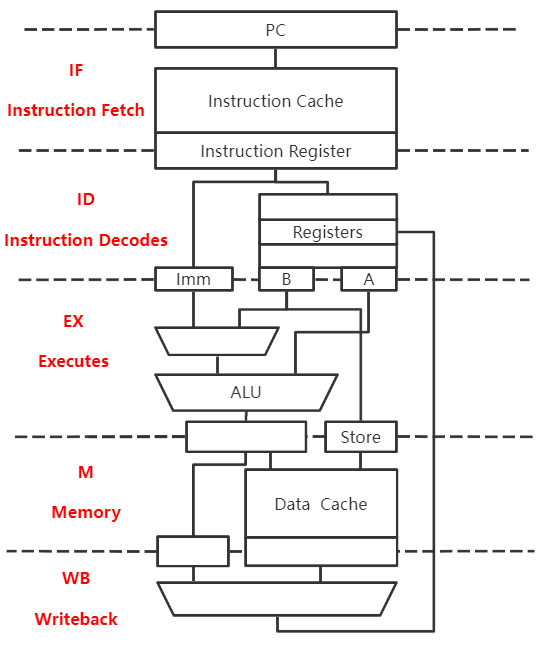

IF：根据PC从指令Cache取指令到IF段的 `锁存器` 

ID：取出操作数至 `ID段锁存器`

- 不同寻址方式，操作数存放的位置不同

EX：运算，将结果存入 `EX锁存器`

M：空段（运算类指令不涉及该段）

WB：将运算结果写回指定寄存器

---

举例：

| 含义               | 汇编格式    | 功能          |
| ------------------ | ----------- | ------------- |
| 两个寄存器相加     | ADD Rs,Rd   | (Rs)+(Rd)->Rd |
| 寄存器与立即数相加 | ADD #966,Rd | #966+(Rd)->Rd |

##### LOAD指令执行过程


IF：根据PC从指令Cache取指令到IF段的锁存器

ID：将基址寄存器的值放到锁存器A，将偏移量的值存放到Imm

EX：运算，得到有效地址EA

M：从数据Cache中取数到锁存器

WB：将取出的数写回寄存器

---

举例

| 含义                           | 汇编            | 功能           |
| ------------------------------ | --------------- | -------------- |
| 将数据从源寄存器存入目的寄存器 | LOAD Rd,966(Rs) | (966+(Rs))->Rd |
| 将数据从主存放入目的寄存器     | LOAD Rd,mem     | (mem)->Rd      |

只有在写回阶段才将数据写到数据寄存器，可能引起**数据相关问题**

- 运算指令需要等待数据都就位才能开始运算

##### STORE指令执行过程


IF：根据PC从指令Cache取指令到IF段锁存器

ID：将基址寄存器的值放到锁存器A，将偏移量的值放到Imm，将要存的数放到B

EX：运算得到存数的有效地址，并将锁存器B的内容放到锁存器Store

M：将数据写入主存或Cache

WB：空段

---

举例

| 含义                 | 汇编             | 功能          |
| -------------------- | ---------------- | ------------- |
| 将数据存入目的寄存器 | STORE Rs,966(Rd) | Rs->(966(Rd)) |
| 将数据存入主存       | STORE Rs,mem     | Rs->(mem)     |

只有在数据就位后才能将数据写到数据寄存器，所以也会存在 **数据相关问题**

##### 条件指令的执行过程


IF：根据PC从指令Cache取指令至IF段的锁存器

ID：进行比较的两个数放入锁存器A，B；偏移量放入Imm

EX：运算，比较两个数

M：将目标PC值写回PC

WB：空段

---

举例：

| 含义                                    | 汇编              | 功能                                                         |
| --------------------------------------- | ----------------- | ------------------------------------------------------------ |
| 两数相等，PC+偏移量，两数不等，顺序执行 | beq Rs,Rt,#偏移量 | 若(Rs)\==(Rt)，则 $(PC)+指令字长+(偏移量\times 指令字长)\rightarrow PC$<br />否则$(PC)+指令字长\rightarrow PC$ |
| 两数不等，PC+偏移量，两数相等，顺序执行 | bne Rs,Rt,偏移量 | 若(Rs)!=(Rd)，则 $(PC)+指令字长+(偏移量\times 指令字长)\rightarrow PC$否则$(PC)+指令字长\rightarrow PC$ |

- 相对寻址：PC+“1”+“1偏移地址”

  $(PC)+指令字长+(偏移量\times 指令字长)\rightarrow PC$

要尽快写回PC，避免 **控制相关问题** 

##### 无条件转移指令


IF：根据PC从指令Cache取指令到IF段锁存器

ID：偏移量放入Imm

EX：将目标PC值写回PC

M：空段

WB：空段

- 在写回PC时，耗时比执行段短，所以可以理解为在EX段内完成
- 越早写回PC，越能 **避免控制冲突问题**

---

举例

| 含义       | 汇编        | 功能                                                  |
| ---------- | ----------- | ----------------------------------------------------- |
| 无条件跳转 | `jmp #偏移量` | $(PC)+指令字长+(偏移量\times 指令字长)\rightarrow PC$ |

#### 流水线影响因素

##### 机器周期的设置

>  为方便流水线的设计，将每个阶段耗时取成一样，以最长耗时为准

源于ID阶段和WB阶段对寄存器的读写

##### 资源冲突(互斥问题)

> 由于多条指令在同一时刻争用同一资源而形成的冲突称为 **结构相关**

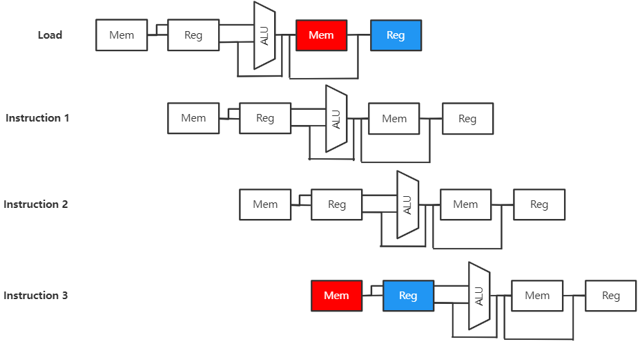

解决方法：

1. 后一相关指令暂停一周期

2. 资源重复配置

   数据存储器+指令存储器

##### 相关(同步问题)

**数据相关**

> 下一条指令用到前一条指令的计算结果，*对流水线性能影响最严重的因素*

解决方法

1. 等

   硬件阻塞

   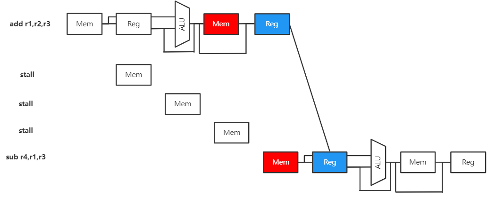

   软件插入NOP

   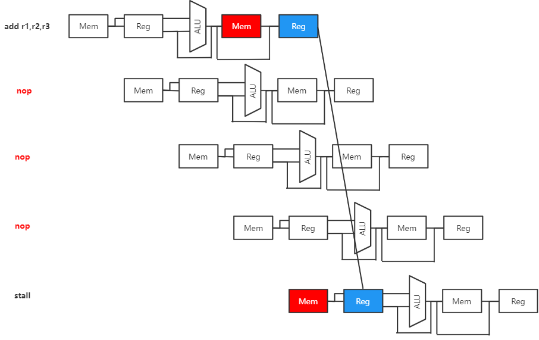

   由于数据相关会发生阻塞，不相邻指令可能由于阻塞消除数据相关

2. 数据旁路技术：设置专用通路

   ALU的计算结果通过专用通路成为下一指令的输入数据

3. 编译优化：通过编译器调整指令顺序解决数据相关问题

---

**控制相关**

> 一条指令确定下一条指令的位置，流水线遇到`转移指令`和`其他改变PC值的指令`造成断流，引起控制相关问题

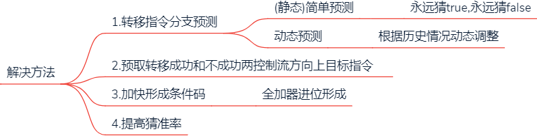

#### 分类

##### 部件功能级、处理机级和处理机间流水线

> 按流水线使用的级别

- 部件功能级流水：将复杂的逻辑运算组成流水线工作方式，如：将浮点数加法操作分成：阶差、对阶、位数相加、结果规格化四个子过程
- 处理机级流水：把一条指令解释过程分成多个子过程，如：取指、译码、执行、访存及写回 
- 处理机间流水：每一个处理机完成某一专门指令，各个处理机所得到的结果需存放在下一个处理机所共享的存储器中

##### 单功能流水线和多功能流水线

> 按指令完成的功能分类

- 单功能流水线：只能实现一种固定的专门功能的流水线
- 多功能流水线：通过各段间的不同连接方式可以同时或不同时地实现多种功能的流水线

##### 动态流水线和静态流水线

> 按同一时间内各段之间的连接方式分类

- 静态流水线：同一时间内，流水线各段只能按同一种功能的连接方式工作
- 动态流水线：同一时间内，当某些段实现某种运算时，另一些段正在进行了另一种运算

##### 线性流水线和非线性流水线

> 各个功能段之间是否有反馈信号

- 线性流水线：从输入到输出，每个功能段只允许经过一次，不存在反馈回路
- 非线性流水线：从输入到输出过程中，某些功能段将数次通过流水线，这种流水线适合进行线性的递归运算

### 3.3.2 超标量流水线

**流水线越多，指令执行速度不一定越快**

- 流水段缓冲之间的额外开销增大

  每个流水段有一些额外开销用于流水段之间的数据准备与传送，增加以一条指令的整体执行时间

- 流水段间控制逻辑变多变复杂

  用于流水线优化和存储器冲突处理的控制逻辑增多

  导致流水段间控制逻辑比段本身的控制逻辑复杂

#### 超标量技术

> `空分复用技术` ： 通过编译优化，使可并行执行的指令搭配起来

每个时钟周期内可 **并发多条独立指令** 

不能调整指令的执行顺序

**靠配置多个功能部件解决问题**

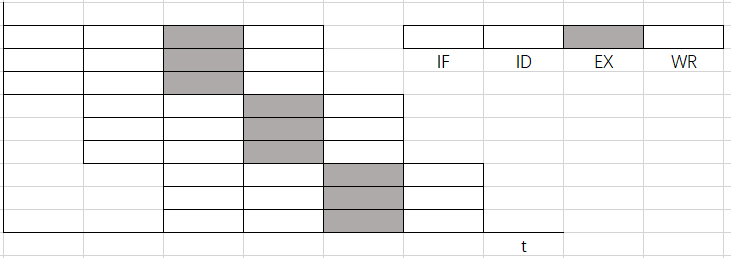

#### 超流水技术

> `空分复用技术` ：将一个机器钟周期再分段（3段）
>
> 理想情况：机器周期=时钟周期

- 一个时钟周期内一个功能部件可以使用多次（3次）

不能调整指令的执行顺序

**靠编译程序解决优化问题**


#### 超长指令字

> 具有 **多个操作码字段** 的 **超长指令段**

由编译程序挖掘出指令间潜在的并行性

将 **多条** 能 **并行操作** 的指令组合成一条

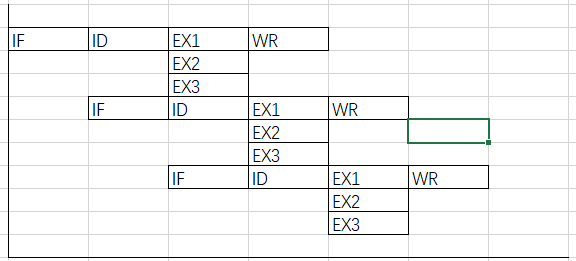

## 3.4 指令集系统

> 二八定律：程序中80%的语句仅仅使用处理机中20%的指令

|            | CISC(Complex Instruction System Computer) | RISC(Reduced Instruction System Computer)                    |
| ---------- | ----------------------------------------- | ------------------------------------------------------------ |
| 设计思路   | 一条指令完成一个复杂的基本功能            | 一条指令完成一个基本“动作”<br />多条指令组合完成一个复杂的基本功能 |
| 指令系统   | 复杂，庞大                                | 简单，精简                                                   |
| 指令字长   | 不定长                                    | 定长                                                         |
| 可访存指令 | -                                         | 只有 `Load/Store` 指令                                       |
| 执行时间   | 相差较大                                  | 大多数能在一个指令周期内完成                                 |
| 控制方式   | 绝大多数为微程序控制                      | 绝大多数为组合逻辑                                           |
| 指令流水线 | 可以实现                                  | 必须实现                                                     |
| 代表       | X86架构，用于笔记本、台式机               | ARM架构，用于手机、平板                                      |
|            |                                           | 减少和简化指令功能，提高指令执行速度，复杂指令功能由简单指令组合实现 |

### 简答题

1. RISC更能充分利用超大规模集成电路芯片的面积。CISC的控制器大多采用微程序控制，其控制存储器在CPU芯片内所占面积达50%以上。RISC采用组合逻辑控制，其硬布线逻辑占CPU芯片面积的10%左右
2. RISC更能提高运算速度。RISC的指令数。寻址方式和指令格式种类少，又舍友多个通用寄存器，采用流水线技术，大多数指令能在一个时钟周期内完成。
3. RISC指令系统简单，逻辑简单，便于设计，可降低成本，提高可靠性
4. RISC有利于编译程序代码优化。RISC指令类型少，寻址方式少，使编译程序更容易选择有效的指令和寻址方式，并适当调整指令顺序，使得代码执行更高效。
