<!--more-->

## 5.1 概述

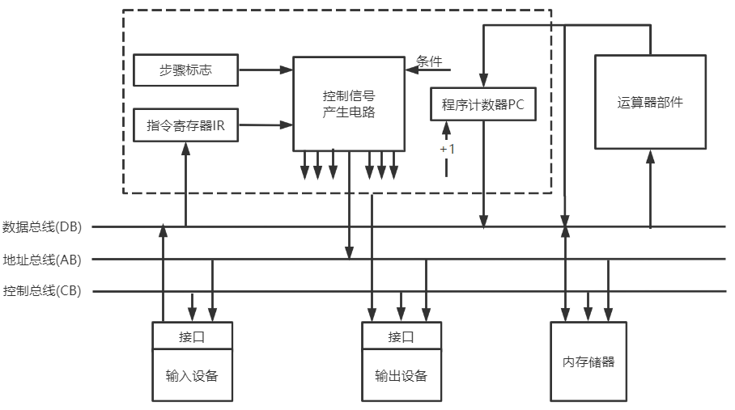

### 5.1.1 基本概念

#### 引入总线的目的

优点：

- 简化系统结构
- 减少连线数量，便于布线，提高系统可靠性
- 便于接口设计
- 便于系统扩充，易于实现系统模块化
- 便于设备的软件设计，所有接口软件对不同的接口地址操作
- 便于故障诊断，降低成本

问题：多个设备同时请求总线，导致总线冲突

问题解决：采用总线仲裁机构

#### 特性

机械特性：芯片设计

电气特性

- 传输方向：相对于CPU的方向
- 电平范围：高低电平界定

功能特性：每个传输线的功能

时间特性：信号的失序关系

#### 总线设备

- 主设备：取得总线控制权的设备
- 从设备：只能响应主设备发来的各种控制信号

#### 与数据通路区别

数据通路

- 描述数据流动方向的逻辑概念
- 只要有数据流过就有通路

总线

- 总线是数据通路的物理媒介

相对于专线结构，降低了信息传输的并行性及信息的传输速度

### 5.1.2 总线分类

#### 按数据传输格式

##### 串行总线

> 一个传输线(USB)

优点：

- 成本低
- 抗干扰能力强，可用于长距离传输
- 节省布线空间

缺点：

- 有数据拆卸和转配问题
- 需要考虑串-并转换问题

##### 并行总线

优点：

- 逻辑实现简单，电路简单

缺点：

- 占用布线空间

- 不适合远距离传输

- 传送频率低

  传输频率高时，存在信号干扰，产生电平跳变

#### 按总线功能

##### 片内总线

> CPU内部寄存器、控制器、运算器之间的数据通路

##### 系统总线

> 计算机系统内各个功能部件间连接的总线

**三种系统总线**

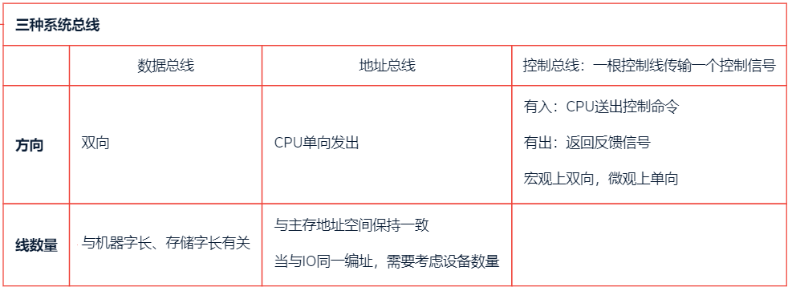

##### 通信总线(外部总线)

> 用于计算机系统之间与其他系统的通信

### 5.1.3 系统总线的结构

#### 单总线结构

> CPU、主存、I/O设备(通过I/O接口)都连接在一组总线上，允许I/O设备之间、I/O设备和CPU之间、I/O设备与主存之间直接交换信息
>
> - 单总线并不是指只有一个信号线，系统总线按传送信息的不同可以细分为地址总线、数据总线和控制总线

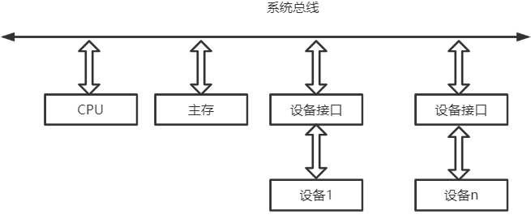

优点：

- 结构简单
- 成本低
- 易于接入新的设备

缺点：

- 带宽低

- 负载重

- 多个部件只能争用唯一的总线，且不支持并发传送操作

  并行传送：同一时刻多个部件传送数据

  并发传送：同一时刻有一个部件传送数据；一段时间有多个部件传送数据

#### 双总线结构

> 两条总线：
>
> 主存总线：用于CPU、主存和通道之间的数据传送
>
> I/O总线：用于多个外部设备与通道之间的数据传送

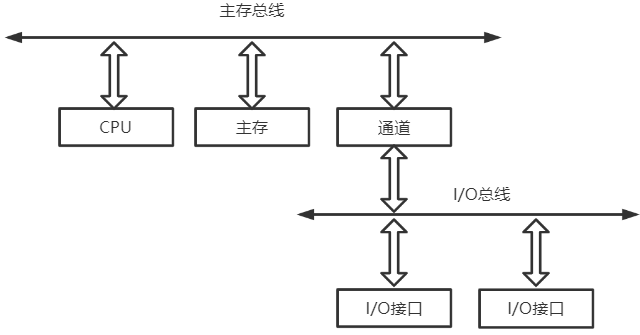

- 通道是具有特殊功能的处理器：能对I/O设备进行统一观念里，通道程序放在主存中

---

优点：将较低速的I/O设备从单总线上分离出来，实现存储器总线和I/O总线分离

- 支持突发(猝发)传送：送出一个地址，收到多个地址连续的数据

缺点：需要增加通道等硬件设备

#### 三总线结构

> 在计算机系统各部件之间采用3条各自独立的总线来构成信息通路
>
> - 主存总线
> - I/O总线
> - DMA总线：(Direct Memory Access)直接内存访问

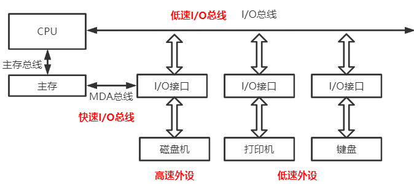

优点：提高了I/O设备的性能，使其更快速地响应命令，提高系统吞吐量

缺点：系统工作效率较低

#### 四总线结构(线代计算机系统总线结构)

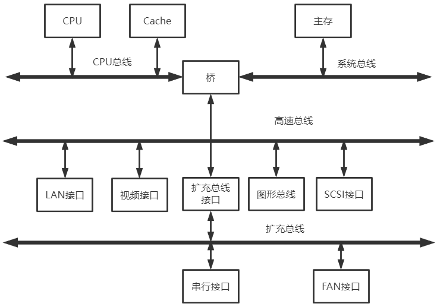

桥接器：用于连接不同的总线，具有数据缓冲、转换和控制功能

靠近CPU的总线速度快

数据缓冲：速度匹配

转换：串-并行转换

控制：总线仲裁

### 5.1.4 总线性能指标

#### 总线传输周期

> 一次总线操作需要的时间

分为四个阶段：

- 申请阶段：总线仲裁
- 寻址阶段：主设备向从设备发出地址信息
- 传输阶段
- 结束阶段

总线传输周期由若干总线时钟周期组成

- 一对多
- 多对一：一个时钟周期可多次传送
- 一对一

#### 总线工作频率

> 总线周期的倒数：1s内传送几次数据

#### 总线时钟周期

> 机器的时钟周期：现代计算机由桥接器发出时钟信号

#### 总线的时钟频率

> 总线时钟周期倒数

#### 总线宽度

> 总线上可并行传输的数据位数=数据总线的根数

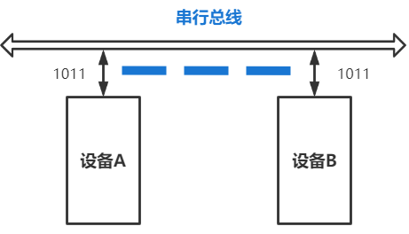

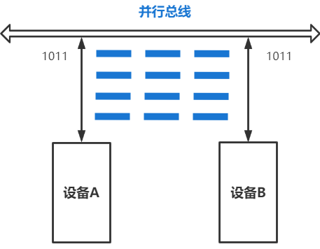

#### 总线带宽

> 单位时间内总线可传输数据的位数，`B/s`

$$
总线带宽=总线工作频率*(\frac{总线带宽}{8})B/s
$$

- 总线工作频率相等时，串行总线传输速度比并行传输速度慢
- 并行总线的总做频率无法持续提高，而串行总线可以通过不断提高工作频率来提高串行传输速度，最终超过并行总线

区分：

- $有效数据传输率=\frac{实际传输数据量}{耗时}$

---

例：某同步总线采用数据线和地址线复用方式，其中地址/数据线有32根，总线时钟频率为66MHz，每个时钟周期传送两次数据（上升沿和下降沿各传送一次数据）

1. 该总线的最大数据传输率（总线带宽）

   每个时钟周期传送两次数据，总线工作频率是时钟频率的两倍

   $总线工作频率=2\times 66MHz=132MHz$

   $总线宽度=32bit=4B$

   $总线带宽=总线工作频率\times 总线宽度=132\times 4MB/s=528MB/s$

2. 该总线支持突发（猝发传输方式），传输一个地址占用一个时钟周期，则一次“内存写”总线事务传输128位数据所需要的时间至少是多少、

   突发(猝发)传输方式，一次总线事务中，主设备只需给出一个首地址，从设备就能从首地址开始的若干连续单元读出或写入多个数据

   发送首地址占用1个时钟周期，传送128位数据需传送4次，占用2个时钟周期，所以至少需要3个时钟周期才能传输完这些数据

#### 总线复用

> 一种信号线在不同时间传输不同的信息

- 一般情况，低地址线与数据总线复用

- 总线总数=DB数量+CB数量+AB数量

## 5.2 总线传输

> 占用总线设备的一组数据传输过程

### 5.2.1申请阶段（总线仲裁）

> 传输申请：总线的主设备提出请求
>
> 总线仲裁：总线使用权的授予，解决多个设备争用总线的问题

#### 集中仲裁

##### 工作过程

1. 主设备发出请求信号

2. 多个主设备要使用总线，则由控制器判优，仲裁逻辑一定按一定优先级排序，确定哪个主设备能使用总线

   总线控制器发出时钟信号

   总线控制器集成于CPU内或桥接器内

3. 获得总线使用权的主设备传送数据

> **总线忙** 由获得总线使用权的主设备发出

##### 链式查询方式

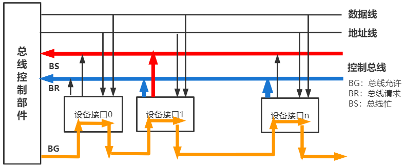

1. 主设备发出请求信号
2. 若多个主设备同时要使用总线，则由总线控制器的判优、仲裁逻辑按一定的优先级顺序确定哪个主设备能使用总线
3. 获得总线使用权的主设备开始传送数据

---

控制线数量=3：BS、BR、BG各一条

优点

- **总线忙** 由主设备发出
- 只需少数控制总线就能实现总线控制，结构简单，易于扩充

缺点

- 对硬件电路故障敏感，一个故障整体故障

- 部件优先级固定

  优先级高的部件频繁使用总线，造成优先级较低的部件长期不能使用总线

  离总线控制器越近的部件，优先级越高

##### 计数器查询

> 用一个计数器控制总线使用权，相当于链式查询方式多了一组设备地址线，少了一个总线响应线BG，它仍共用一个总线请求线

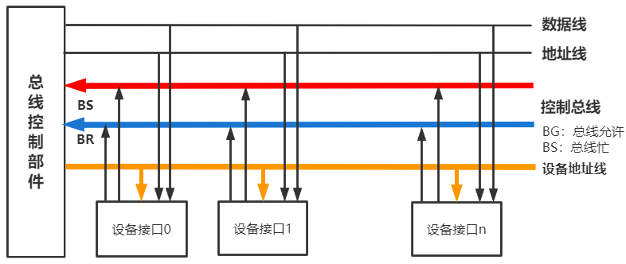

1. 主设备发出总线请求信号

2. 当总线控制器收到总线请求信号，判断总线空闲时，计数器开始计数，计数值通过设备地址线发向各个部件

3. 当设备地址线上的计数值与请求总线的设备地址一致时，该设备获得总线控制权

   同时，中止计数器的计数及查询

---

控制线数量=$\lceil logn \rceil+2$ ：BS，BR各一根

- 一组设备总线数量 = $\lceil logn \rceil$

优点

- 优先级可变

  每次从 “0” 的开始，相当于链式查询

  计数从上一次的开始，**设备的优先级相等**

  计数器可由程序设置

- 对电路故障没有链式查询方式敏感

缺点

- 增加控制线数
- 控制相对复杂

##### 独立请求方式

> 每一个设备均有一堆总线请求线BR和总线允许线BG

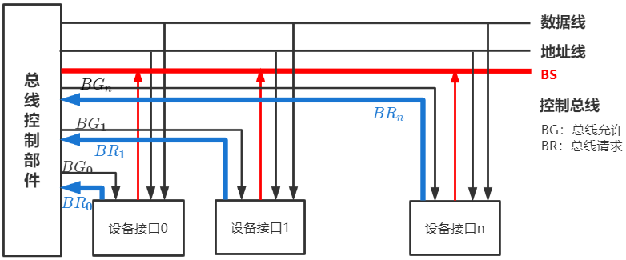

1. 当总线上的部件需要使用总线时，经各自的总线请求发送总线请求信号，在总线控制器中排队

2. 当总线控制器按一定的优先次序决定批准某个部件的请求时，则给该部件发送总线响应信号

---

控制线数量=$2n+1$

- BR、BG每个部件各一根
- BS共用一根总线：主设备想总线控制器反馈是否正在使用总线

优点

- 响应速度快：BG直接传到相关主设备
- 优先级设置灵活

缺点

- 控制线数很多
- 总线控制逻辑复杂

#### 分布式仲裁

> 不需要中央仲裁器，每个潜在的主设备都有自己的仲裁器和仲裁号

- 当设备有总线请求时，它们就把各自唯一的仲裁号发送到共享的仲裁总线上
- 每个仲裁器将从仲裁总线上得到的仲裁号与自己的仲裁号进行比较
- 如果仲裁总线上的号优先级高，则它的总线请求不予相应，并撤销它的仲裁号
- 最后获胜者的仲裁号留在仲裁总线上

### 5.2.2 寻址阶段

> 主设备发出要访问的从设备地址及相关命令
>
> 启动本次传输的从模块

### 5.2.3 传输阶段

> 从设备进行数据的单向或双向传输

### 5.2.4 结束阶段

> 从总线上撤销主设备信息，让出使用权

## 5.3 总线定时(通信)

> 定时：总线在双方交换数据的过程中需要时间上配合关系的控制

- 通信双方的协议或规则

### 5.3.1 同步定时(通信)方式

> 总线控制器采用一个**统一的时钟信号**协调双方的传送定时关系

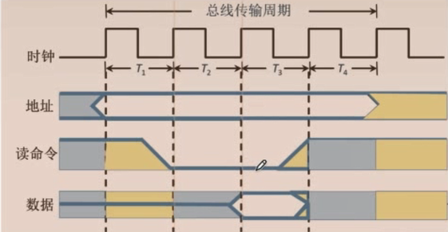

时钟产生相等的时间间隔，每个时间间隔构成一个总线周期

在一个总线周期中，发送方和接收方可进行一次数据传送

- **发送方** ：用系统 **时钟前沿** 发信号
- **接收方** ：用系统 **时钟后沿** 判断、识别

因为采用同一的时钟，每个部件（设备）发送或接收信息都在固定的总线传送周期中，一个总线的传送周期结束，下一个总线传送周期开始

---

优点

- 传送速度快，具有较高的数据传输速率

- 总线控制逻辑简单

缺点

- 主从设备强制同步

- 不能及时进行数有效性校验，可靠性差

适用于

- 总线长度较短

- **总线上的主从设备存取时间比较接近**

  当从设备速度低于主设备时，无法在传输时给出数据

### 5.3.2 异步定时(通信)方式

> 主从设备间的数据传送完全依靠双方相互制约的 **握手信号** 来实现定时控制

主设备提出交换信息的 **请求信号** ，经接口传送到从设备；从设备接到主设备的请求后，通过接口向主设备发送 **回答信号**

根据 **请求** 和 **回答** 信号的撤销是否互锁，分为：

1. 不互锁方式
2. 半互锁方式
3. 全互锁方式

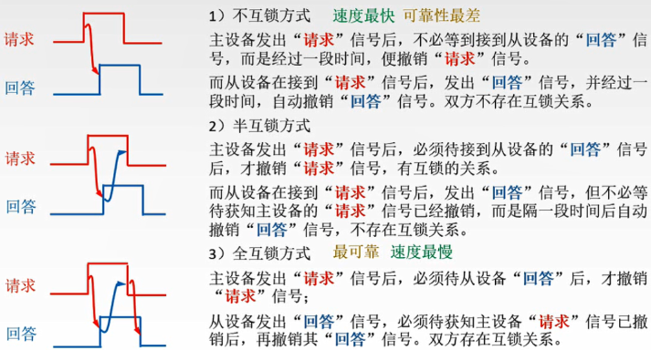

---

优点

- 总线周期长度可变，能保证两个工作速度读相差很大的部件或设备之间可靠地进行信息交换，自动适应时间的配合

缺点

- 比同步控制方式稍复杂一些
- 速度毕同步定时方式慢

---

数据传输率：

在 异步串行方式下，起始位为1位，数据位为7位，偶校验位为1位，停止位为1位，如果波特率为1200bit/s，求此时的有效数据传输率为多少?
$$
\begin{aligned}
&波特率：单位时间内传送的二进制数据的位数，单位bps，记为波特\\
&比特率：单位时间内传送二进制有效数据的位数，单位而bps\\
&\frac{比特率}{波特率}=\frac{数据位数}{数据位数+其他附加位位数}
\end{aligned}
$$
有效数据传输率为 = $波特率\times \frac{数据位数}{数据位数+其他附加位位数}=1200\times \frac{7}{1+7+1+1}=840bit/s$

### 5.3.3 半同步通信

> 在同一时钟的基础上，增加一个 `等待` 响应信号 $\overline{WAIT}$

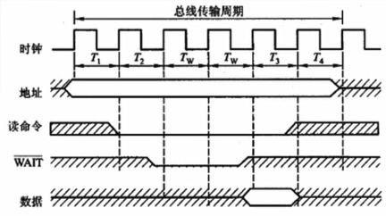

### 5.3.4 分离式通信

上述三种通信共同点

- 主模块发送地址、命令：使用总线
- 从模块准备数据：不使用总线——总线空闲
- 从模块向主模块发数据：使用总线

---

分离式通信的一个总线传输周期

- 子周期1：主模块申请占用总线，使用完后放弃总线的使用权
- 子周期2：从模块申请占用总线，将各种信息发送到主线上

特点：

- 各模块都有权申请总线
- 采用同步通信，不等对方回答
- 各模块准备数据不占用总线
- 总线利用率高

## 5.4 总线标准

> 实现系统的模块化设计

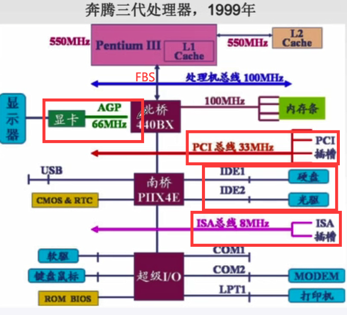

系统总线：与CPU直接连接

- FBS、QPI用于连接CPU与北桥
- CPU与Cache

局部总线：不与CPU连接

- 连接高速北桥：显卡，高速网卡等高速外设

设备总线，通信总线

- 南桥
- PC与PC
- PC与外部I/O

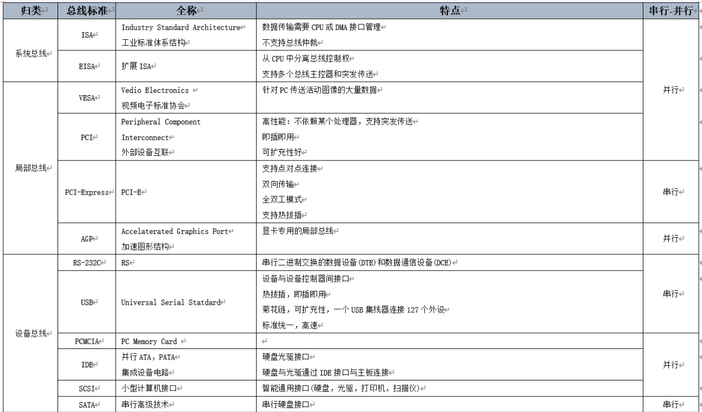

USB

- 差模信号：两个输入电压高低确定01
- 一次只能传输1bit数据

连接外设总线标准

- RS232C
- USB
- PCMCIA
- IDE

---

串行代替并行原因

并行总线：用m根线每次传送m个比特，用 **高/低电平表示1/0** ，通常采用同步定时方式，

- 由于线间信号干扰，所以 **并行总线工作频率不能太高**
- 各条线不能有长度差，长距离并行传输时工艺难度大

串行总线：用两根线每次传送1bit，采用 **差模信号表示1/0** ，通常采用异步定时方式，总线 **工作频率可以很高** 。现在的串行总线通常采用 **包传输**
