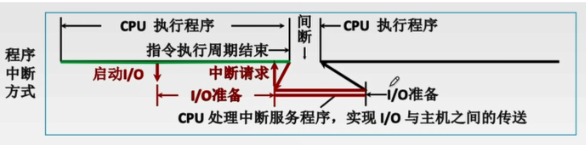

> 相对于主机的输入输出
>
> 输入：信息从外设传送到主机
>
> 输出：信息从主机传送到外设

<!--more-->

## 6.1 I/O硬件

> 通过设备控制器来控制I/O设备的具体动作，通过I/O接口与主机(总线)相连
>
> 共享设备必须可寻址，可随机访问

### 6.1.1 外部设备(机械部件)

#### 输入设备(低速I/O)

- 键盘

  查出按哪个键

  翻译出主机中的编码

  将编码传送到主机

- 鼠标

#### 输出设备

##### 显示器

**分类**

---

**性能指标**

- 性能指标：以对角线长度表示，常用有12~29英寸

- 分辨率：所能表示的像素个数，屏幕上的每一个光点就是一个像素，以宽、高的像素的乘积表示

- 灰度级：灰度级是指黑白显示器中所显示的像素电脑的亮暗差别；

  在彩色显示器中表现为颜色不同，灰度级越多，图像层次越逼真

  n位可以表示 $2^n$ 种不同的亮度或颜色

- 刷新：光点只能保存极短时间，为此必须在光点消失之前再重新扫描显示一遍

  刷新频率：单位时间内扫描整个屏幕内容的次数

- 显示存储器（VRAM）：为了不断提高刷新图像的信号，必须把一帧图像信息存储在刷新存储器中。

  $VRAM容量=分辨率\times灰度级位数$

  $VRAM带宽=分辨率\times灰度级位数\times 帧频$

##### 打印机

**按工作方式**

针式打印机

- 原理：在联机状态下，主机发出打印命令，经接口、检测和控制电路，间歇驱动纵向送纸横向移动，同时驱动打印机间歇冲击色带，在纸上打印出所需内容

- 特点：

  针式打印机擅长 **多层复写打印** ，实现各种票据或蜡纸等打印。

  工作原理简单，造价低廉，耗材便宜

  打印分辨率和打印速度不够高

喷墨式打印机

- 原理：带电的喷墨雾点经过电极偏转后，直接在纸上形成所需字形。彩色喷墨打印机基于三基色原理，按一定比例同时喷射3中颜色的墨滴

- 特点：

  打印噪声少，可实现高质量彩色打印，通常打印速度比针式速度快

  防水性差，高质量打印需要专用打印纸

激光打印机

- 原理：计算机输出的二进制信息，经过调制后的激光束扫描，在感光鼓上形成潜像，再经过显影、转印和定影，便在纸上得到所需的字符或图像

- 特点：

  打印质量高、速度快、噪声小、处理能力强

  耗材多，价格贵，不能复写打印多份，且对纸张的要求高。

#### 外存(辅存)

##### 磁表面存储器

######  原理

> 一次1bit的读写，需要串/并行转化

- 写线圈加电流，改变磁场方向
- 磁层产生磁场，读线圈切割磁感线产生电流

###### 特点

优点

- 存储容量大，价位低
- 记录介质可重复使用
- 记录信息长期保存不丢失
- 非破坏性读出

缺点

- 存取速度慢
- 机械结构复杂
- 对工作环境要求高

- **串行机械设备**

  从磁道读写数据时，每次只能读写1bit

  不能在同一时刻既读又写

  不能在同一时刻读两组或写两组数据

###### 组成

**存储区域**

**硬盘存储器**

- 磁盘驱动器

  磁头组件：移动磁头

  盘片组件：旋转盘片

- 磁盘控制器（磁盘与主机的接口）

  IDE——ATA

  SATA——串行ATA

  SCSI

###### 性能指标

**容量**：可存放的字节数

---

**记录密度**：

- 道密度：沿磁盘半径方向单位长度上的磁道数
- 位密度：磁道单位长度上能记录的二进制位数
- 面密度：位密度 *道密度

---

**平均存取时间**
$$
平均存取时间=寻道时间+延迟时间+传输时间\\
平均存取时间=磁头移动到目标磁道+磁头定位到目标扇区+数据传输
$$

---

**数据传输率**

> 单位时间内向主机传送的字节数

###### 工作过程

- 寻址
- 读盘
- 写盘

###### 磁盘地址

###### 存储阵列

> RAID(Redundant Array of Inexpensive Disks，廉价冗余磁盘阵列)，将多个独立的物理磁盘组成一个独立的逻辑盘，数据在多个物理硬盘上分割交叉存储，并行访问

RAID0：无冗余和无校验的磁盘阵列

- 提高传输率：把连续多个数据块交叉地存放在不同物理磁盘邻近扇区中，几个磁盘交叉并行读写
- 提高存储系统的数据吞吐量：不仅扩大了存储容量，且提高了磁盘数据存取速度
- **RAID0没有容错能力**

RAID1：镜像磁盘阵列

- 提高传输率：把连续多个数据块交叉地存放在不同物理磁盘邻近扇区中，几个磁盘交叉并行读写
- 提高存储系统的数据吞吐量：不仅扩大了存储容量，且提高了磁盘数据存取速度
- 可靠性：使两个磁盘同时进行读写，互为备份
- 一个磁盘出现故障，可从另一个磁盘中读出数据
- 两个磁盘当一个磁盘使用，相当于**减少一半容量**

RAID2：采用纠错的海明码的磁盘阵列

RAID3：位交叉奇偶校验的磁盘阵列

RAID4：块交叉奇偶校验的磁盘阵列

RAID5：无独立校验的奇偶校验磁盘阵列

##### 光盘

> 支持随机存取

##### 固态硬盘SSD

> 利用闪存作为硬盘记录数据

### 6.1.2 I/O接口(电子部件)

> I/O控制器、设备控制器，实现CPU对IO设备控制

#### 功能

> 接收和识别CPU发出的命令

- 控制寄存器：存放参数和命令

> 错误或状态检测：通过状态寄存器反馈设备的各种错误、状态信息，供CPU查用

- 状态寄存器

> 数据缓冲：暂存数据

- 通过数据缓冲寄存器（DBR）达到主机与外设工作速度的匹配

> 地址译码与设备选择：I/O接口对CPU送来的地址进行译码以产生设备选择信息

- 设备选择信息

  一个设备对应一组端口

  地址总线，分两次传输：指明读写的端口，指明要操作的设备编号

> 与主机和设备通信：实现主机-I/O接口-I/O设备间的通信

> 控制和定时：接收从控制总线发来的控制信息，时钟信息

> 数据格式转换：串行-并行，并行-串行的数据格式转换

- 磁盘一次只能读出1bit，总线一次传输1字长

#### 组成与原理

> **I/O端口**：I/O控制器中的各种寄存器称为I/O端口

> 数据线：读写数据、状态字、控制字、中断类型号
>
> 地址线：传送I/O端口
>
> 控制线：读/写IO端口的信号、中断请求的信号
>
> 状态/控制寄存器：在使用时间上是错开的，因此有的I/O接口中将二者合并

1. CPU通过数据线发送命令字到I/O控制寄存器，向设备发送命令（需要驱动程序协助）
2. 读状态：从状态寄存器读取状态字，获得设备或I/O控制器的状态
3. 读/写数据：从数据缓冲寄存器发送或读取数据

---

##### 不同的I/O控制器有不同标准

> 控制不同类型的设备

- 有的I/O接口可接入多种设备(USB)
- 有的I/O接口只能接一个设备(SATA)

##### I/O逻辑

接收识别CPU的各种命令：CPU通过控制线发出I/O指令(读/写)

对设备发出命令

##### 控制器与设备接口

> 实现控制器与设备通信

##### CPU与控制器接口

> 实现CPU与控制器之间的通信

#### 端口编址

> I/O端口为接口中的寄存器

|                   | 统一编址                                                     | 独立编址                                                     |
| ----------------- | ------------------------------------------------------------ | ------------------------------------------------------------ |
| 定义              | 把I/O端口当做存储器的单元进行地址分配，用**统一的访存指令**就可以访问I/O端口——**存储器映射方式** | I/O端口地址与存储器地址无关，独立编址CPU需要设置 **专门的输入/输出指令** 访问端口——**I/O映射方式** |
| 区分内存和I/O设备 | 靠不同的**地址码** - **I/O地址要求固定在地址的某部分，不可随机存放** | 靠不同的指令区分内存和I/O设备                                |
| 优点              | 不需要专门的输入/输出指令，所有访存指令都可直接访问端口，程序设计灵活性高 端口有较大的编址空间 读写控制逻辑电路简单 | 使用专用的I/O指令，程序编制清晰 I/O端口地址位数少，地址译码速度快 I/O端口的地址不占用主存地址 |
| 缺点              | 端口占用了内存地址空间，使内存地址空间变小 外设寻址时间长（地址位数多，地址译码速度慢） | I/O指令类型少，一般只能对端口进行传送操作，程序设计灵活性差 需要CPU提供存储器地址，增加了IO设备读/写两组控制信号，增加了控制逻辑实现的复杂性 |

### 6.1.3 I/O总线

## 6.2 I/O方式

### 6.2.1 程序查询方式

> CPU不断查询I/O控制器中的 `状态寄存器` ，在等待IO完成的过程中CPU需要不断轮询检查

优点：实现简单

缺点：CPU和IO设备只能串行工作，CPU需要一直轮询检查，长期处于 **忙等** 状态，CPU利用率低

---

#### 定时查询

频率：CPU的时钟频率为50MHz，即每秒 $50\times 10^6$ 个时钟周期

**鼠标**

每秒查询鼠标占用的时钟周期数为 $30\times 100=3000$ 

查询鼠标所花费的时间比率= $\frac{3000}{50\times 10^6}=0.006\%$

所以对鼠标的查询基本不影响CPU性能

**硬盘**

每秒需要查询 $\frac{2\times2^{20}B}{4B}=2^{19}$ 次

每秒查询硬盘占用的时钟周期数 $2^{19}\times100=5.24\times 10^{7}$

查询硬盘所花费的时间比率=$\frac{5.24\times10^7}{50\times 10^6}=105\%$

CPU将全部时间都用于对硬盘的查询也不能满足磁盘传输的要求

#### 数据通路

外设->IO接口中数据寄存器->数据总线->CPU寄存器->主存

传输单位为字节

### 6.2.2 程序中断方式

#### 工作流程

##### 中断请求

> 中断源向CPU发送中断请求

中断请求分类：内中断和外中断

##### 中断响应

> 在每个指令周期末尾检查中断

响应中断的条件

- 中断源有中断请求
- CPU开中断
- 一条指令执行完成，无其余紧急任务

中断判优

优先级设置

- 硬件故障>访管指令>外部中断
- 硬件故障>软件中断
- 非屏蔽中断> 可屏蔽中断
- 高速设备> 低速设备：DMA请求高于IO设备传送数据的中断请求
- 输入设备> 输出设备
- 实时设备>普通设备

##### 中断处理

###### 中断隐指令

> 由硬件实现，一系列操作，不是指令
>
> - 保存当前PC的值
> - 将PC的值修改位指向中断服务程序的第一条指令

**操作**

1. 关中断：实现原子操作

2. 保存断点：

   保存当前程序的断点PSW

   存入内核堆栈或指定内存单元

3. 引出中断服务程序：实质为将PC值修改为中断服务程序的入口地址

---

中断向量

- 由硬件找到 **中断向量地址**
- **中断向量地址** 为中断服务程序的入口地址
- 通过数据总线传给CPU

---

**实现**

硬件向量法

软件查询法

###### 中断服务程序

- 保护现场

  保存PSW，中断屏蔽寄存器和通用寄存器中的内容

  堆栈

- 中断服务

- 恢复现场

  通过出栈或取数指令将信息写回寄存器中

##### 中断返回

> 中断服务程序的最后一条指令——中断返回指令

#### 单重中断

> 指令中断过程不响应新的中断请求

#### 多重中断

**中断优先级次序决定CPU响应次序**

- 中断优先级决定哪个先开始

**中断屏蔽字决定是否可打断当前进程**

- 中断屏蔽字决定那个先结束

##### 中断屏蔽技术

> 在中断服务程序中提前设置开中断指令
>
> 优先级高的中断源有权中断优先级低的中断源

##### 特点

- **每个中断源一定要屏蔽自身**
- 所有屏蔽触发器组合成屏蔽字寄存器
- 屏蔽字寄存器中的内容称为屏蔽字 

一般用 “1” 表示屏蔽，“0” 表示正常申请

每个中断源对应一个屏蔽字（在处理该中断源的终端服务程序时，屏蔽寄存器中的内容为该中断源对应的屏蔽字）

屏蔽字中“1”越多，优先级越高。每个屏蔽字中至少有一个 “1” （至少要屏蔽自身的中断）

---

设某主机有4个中断源A、B、C、D，其硬件排队优先次序为 A>B>C>D，现要求将中断处理次序改为 D>A>C>B

(1)写出每个中断源对应的屏蔽字

(2)按下图所示的时间轴给出四个中断源的请求时刻，画出CPU执行程序的轨迹。

#### 程序中断方式

**CPU与外设并行工作，数据传输与主程序串行工作**

##### 工作流程

等待IO设备数据同时，CPU可先去执行其他程序

IO完成后，IO控制器向CPU发出中断请求

CPU响应中断，从IO接口数据寄存器取出数据

##### 子程序调用与中断区别

|              | 子程序调用                           | 中断             |
| ------------ | ------------------------------------ | ---------------- |
| 发生时间     | 已知，固定                           | 随机             |
| 产生         | 程序设计者实现安排                   | 硬件电路产生     |
| 与主程序关系 | 主从关系 子程序完全为主程序服务 | 无关             |
| 硬件参与     | 软件处理过程                         | 软/硬结合的系统  |
| 嵌套级       | 受限于堆栈大小                       | 由中断优先级决定 |

##### 特点

CPU需要花费大量时间处理中断服务程序，CPU的利用率下降

### 6.2.3 DMA方式

#### 数据传输单位

一个数据块或多个连续的数据块

- 若是多个数据块，必须是连续的数据块，且在内存中必须连续存放

#### DMA过程

##### 预处理（CPU参与）

- 测试IO设备状态

- 向DMA控制器的有关寄存器置初值（指明主存，磁盘位置等参数）

- 设置传送方向，启动设备

  数据量

  数据在主存中的位置

  数据在外设中的位置

- 发出上述指令后，继续执行原来程序

- **IO设备就绪**后（将一块数据写入数据缓冲寄存器），**向DMA控制器发出MDA请求**

- DMA控制器向CPU发出总线请求

##### 数据传送（CPU不参与）

- DMA传送数据，以字节或数据块为基本单位
- 完全由DMA控制

##### 后处理（CPU参与）

- **完成一个数据块传输**，DMA控制器**向CPU发出中断请求**
- CPU执行中断服务程序做DMA结束处理

---

##### 以数据输入为例

#### DMA控制器

##### 组成

DMA请求触发器：每当I/O设备准备好数据后给一个控制信号，使DMA请求触发器置位

- DMA每次传送以**数据块**为单位

控制/状态逻辑：由控制和时序电路及状态标记组成，用于指定传送方向，修改传送参数，并对DMA请求信号和CPU响应信号进行协调和同步

数据缓冲寄存器：用于暂存每次传送的数据

- 串行外设每次读/写1bit数据

DC（数据计数器）：剩余读/写字节数

CR（命令状态寄存器）：CPU发来的IO命令和设备状态

主存地址寄存器：存放要交换数据的主存地址

传送长度计数器：用于记录传送数据的长度，计数器溢出时，数据即传送完毕，自动发中断请求信号

中断机构：当一个数据块传送完毕后触发中断机构，向CPU提出中断请求

---

- 当`传送长度计数器` 达到阈值后，发出溢出信号，中断机构向CPU发出中断请求，表示一个数据块传输完成

- DMA数据传送期间，CPU无法使用总线，DMA优先使用

##### 功能

#### DMA特点

1. 它使主存与CPU的固定联系脱钩，主存既可被CPU访问，又可被外设访问
2. 在数据块传送时，主存地址的确定、擦混送数据的计数等都是由硬件电路直接实现
3. 主存中要开辟专用缓冲区，及时供给和接收外设的数据
4. DMA传送速度快，CPU和外设并行工作，提高了系统效率
5. DMA在传送开始前要通过程序进行预处理，结束后要通过中断方式进行后处理

IO与主机并行工作，程序和传送并行工作

每个机器周期结束后，CPU可响应DMA请求

**缺点**

- 若要读/写离散区域的数据块，CPU要发出多条IO指令，进行多次中断才能完成

#### DMA传送方式

> 采用三总线结构，主存与DMA接口间有一直接数据通路，存在CPU与DMA的访存冲突

DMA传送方式解决访存仲裁问题

- 周期窃取指DMA占用存取周期

##### 停止CPU访问主存

CPU处于不工作状态或保持状态

未能充分发挥CPU对主存的利用率

控制简单

##### DMA与CPU交替访存

不需要总线使用权的申请、建立和归还过程	

硬件逻辑更为复杂

##### 周期挪用

DMA此时有三种可能

- 若CPU不访存，则DMA直接访存

- 若CPU正访存，结束后CPU让出总线

- CPU与DMA同时请求，IO访存优先

  数据缓存寄存器中的数据若不及时传送会造成数据丢失

#### DMA请求与中断请求

|          | 中断请求（CPU为核心）                    | DMA请求（存储器为核心）                           |
| -------- | ---------------------------------------- | ------------------------------------------------- |
| 数据传送 | 程序控制 程序的切换->保存和恢复现场 | 硬件控制 CPU只需进行预处理和后处理           |
| 中断请求 | 传送数据                                 | 后处理                                            |
| 响应     | 指令执行周期后响应中断                   | 每个机器周期结束后均可，总线空闲时即可响应DMA请求 |
| 场景     | CPU控制，低速设备                        | DMA控制器控制，高速设备                           |
| 优先级   | 优先级低于DMA                            | 优先级高于中断                                    |
| 异常处理 | 能处理异常事件                           | 仅传送数据                                        |

### 6.2.4 通道控制方式

**通道是一种硬件技术，CPU只在启动通道时参与**

1. CPU向通道发出I/O指令，指明通道程序在内存中的位置，并指明要操作的是哪个I/O设备，之后CPU就切换到其他进程执行了

2. 通道执行内存中的通道程序指明了要读入/写出多少数据，读写数据应放在内存的什么位置等信息

   通道程序：通道指令集合

3. 通道执行完规定任务后，向CPU发出中断信号，之后CPU对中断进行处理

#### 特点

优点：CPU，通道，IO设备并行工作，CPU利用率高

缺点：实现复杂，需要专门通道硬件支持

#### DMA方式与通道方式对比

**每个DMA控制器对应一台设备与内存传送数据**

**每个通道对应多个设备与内存进行数据交换**

#### IO指令与通道指令

