> 计算机组成原理概述

<!--more-->

## 0.0 计算机发展历程

### 0.0.1 计算机系统

> 计算机系统=硬件+软件

计算机五大功能

- 数据传送
- 数据存储
- 数据处理
- 操作和控制
- 操作判断

### 0.0.2 硬件的发展

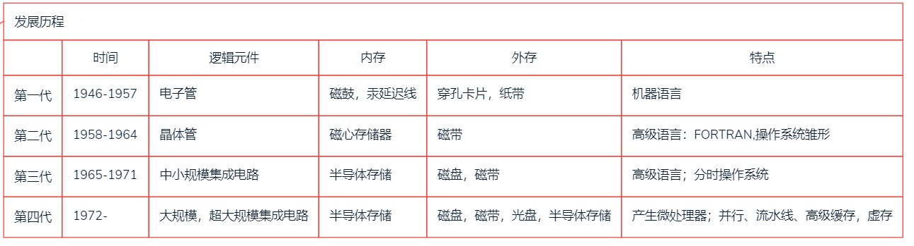

微处理器：摩尔定律

半导体存储：AMD

### 0.0.3 编程语言的发展

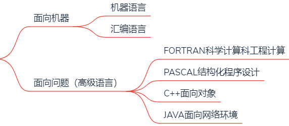

### 0.0.4 单片机

> 采用超大规模集成电路技术集成到一块硅片上的卫星计算机系统

## 0.1 计算机系统层次结构

###  0.1.1 计算机多级层次结构

> 上层是下层的扩展，下层是上层的基础

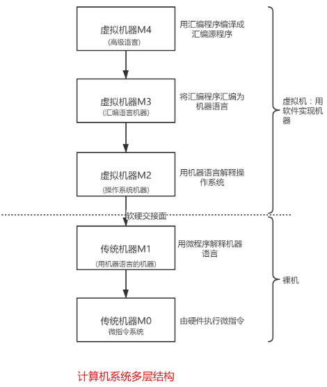

- 指令系统向后兼容：新机器兼容以前机器的指令系统

- 硬件和软件在逻辑上等效，但不等价

#### M0

> 微指令

- 取指
- 分子
- 执行

#### M1

- 取数指令
- 乘法指令

### 0.1.2 硬件的基本组成

#### 冯诺依曼机

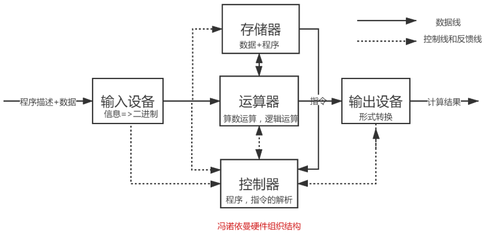

> 基本工作方式为控制流驱动方式

##### 特点

1. 计算机由五大部件组成：运算器为中心，控制器，存储器，输入输出设备

2. 指令由操作码和地址码组成

3. 指令和数据

   指令和数据在计算机中都是以二进制表示

   指令和数据以同等地位存储在存储器中，按地址寻址

   指令顺序存储在存储器中

4. 数据在控制器控制下经过运算器传送给输入输出设备

##### 程序存储

指令以代码的形式实现存储在存储器中，然后按其在存储器中的首地址执行程序的第一条指令，以后按照该程序规定顺序执行其他指令，直至程序结束

#### 现代计算机组织结构

> 以存储器为核心，使I/O操作尽可能绕过CPU，直接在I/O设备和存储器之间完成，提高系统的整体效率

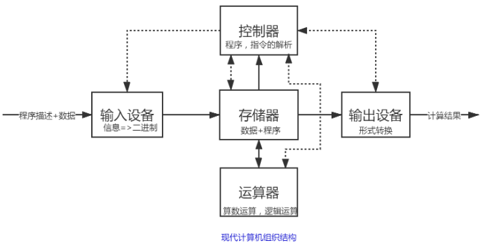

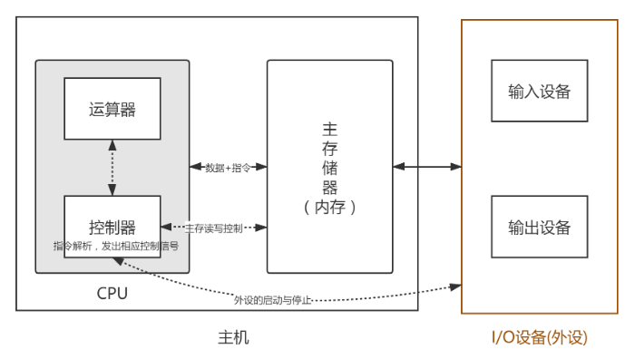

MAR与MDR集成与CPU中，但不集成于CU和运算器中

对各类程序员都透明的寄存器：IR、MAR、MDR、指令存储器

##### 计算机体系结构与组成

- 结构研究属性
- 组成原理研究属性实现

指令系统属于结构

- 当两台机器 指令系统相同时，只能说具有相同的结构

  指令实现可以不同（组成方式）

#### 五大功能部件

##### 运算器

###### 功能

- 逻辑运算
- 算数运算

###### 组成

核心：ALU

若干寄存器

- ACC：累加器
- MQ：乘商寄存器
- X：操作数寄存器

程序状态字PSW

- 标志寄存器
- 存放ALU运算得到的标志信息或处理机状态信息

##### 控制器

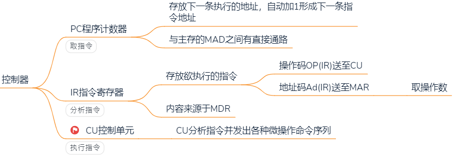

##### 主存储器

> 存放程序，存放数据
>
> - CPU可直接访问主存，辅存信息需要调入内存才可被CPU访问

###### 工作方式

按存储单元地址进行存取

###### 概念组成

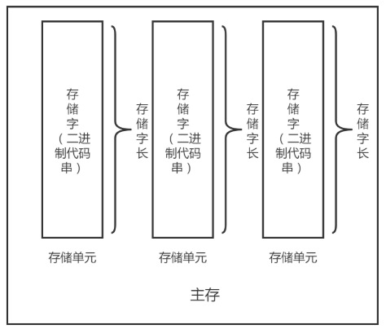

每个地址对应一个存储单元

###### 硬件组成

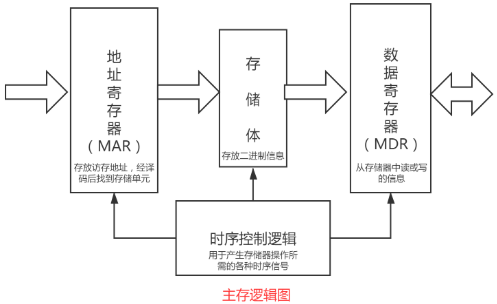

MAR：地址寄存器

MDR：数据寄存器

##### 输入设备

将程序和数据以计算机可表示的形式输入

##### 输出设备

将计算机处理结果以人可识别的形式输出

#### 硬件组成概述

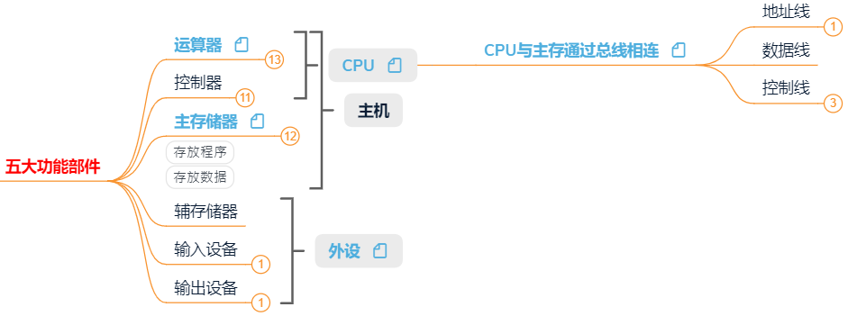

- 地址线：CPU发出的地址信息首先存放在MAR中，MAR中的地址信息直接送到地址总线上，从该地址指向的存储单元进行读/写操作

- 读/写信号线指明

  MDR中数据的流向

### 0.1.3 软件系统

> 程序+数据+文档

#### 软件分类

##### 系统软件

> 是保证计算机系统运行的基础软件，作为系统资源提供计算机使用

常见的系统软件

- 操作系统(OS)
- 数据库管理系统(DBMS)
- 语言处理系统

- 网络软件系统
- 标准库程序
- 服务性程序

##### 应用软件

#### 语言分级

##### 机器语言

- 二进制代码
- 计算机可唯一识别和执行的语言

##### 汇编语言

- 符号化的机器指令
- 需要经过汇编程序转化为机器语言

##### 高级语言

- 经编译程序变为汇编程序
- 汇编程序经汇编得到机器语言

## 0.2 计算机工作过程

### 1. 将程序和数据装入主存

### 2. 程序翻译

#### 汇编程序

#### 编译程序

> 高级语言->机器语言

- 同一高级语言在不同体系结构下，编译成的目标程序不一样

##### 编译过程

`.c` --> `.exe`

###### 预处理

> `.c` --> `.i`

预处理器执行宏替换、条件编译以及对包含的指定文件进行替换

###### 编译

> `.i` --> `.s` （汇编文件）

用编译器(ccl)进行编译

每条语句以文本格式描述一条低级机器语言指令

###### 汇编

> `.s` --> `.o` （可重定位文件）

汇编器将 `.s` 翻译为机器语言

打包为一个可重定位的目标文件 `.o`

###### 链接

> `.o` --> `.exe` （二进制文件）

链接器将多个 `.o` 文件和标准库函数所在的 `.o` 模块合并，生成 `.exe` 文件

#### 解释程序

### 3. 可执行文件逐条执行指令

> 间接寻址指令 执行过程

计算机如何区分指令和数据：

- 取指阶段访存的是取指令
- 执行阶段访存的是取数据

#### 取指

##### (PC)->MAR

##### M(MAR)->MDR

- MAR中国内容送至地址线同时，CPU将 `读` 信号送至控制线
- 主存根据地址线与控制线上信息，从指定单元读取信息，送到数据线

##### (MDR)->IR

##### (PC)+1->PC

#### 分析

`OP(IR)->CU`

CU根据IR中的操作码，生成相应的控制信号，送至不同执行部件

#### 执行

##### Ad(IR)->MAR

##### M(MAR)->MDR

## 0.3 计算机性能指标

### 0.3.1 主存容量

$$
存储容量 = \frac{2^{MAR位数}*MDR位数}{8}字节
$$

#### MAR位数

> 描述主存最多有多少个存储单元

- 表示可寻址的最大地址范围 $2^{MAR位数}=存储单元个数$

#### MDR

> 位数和存储字长相等

### 0.3.2 CPU性能

#### 指令条数

#### 主频

描述计算机速率——10的幂次

描述计算机容量——2的幂次

#### 运算速度

##### 时钟周期(clock)

完成一个动作(微指令)至少需要一个时钟周期
$$
时钟周期=\frac{1}{主频}
$$

##### 主频

单位时间有多少时钟周期数

- 数字脉冲振动频率

主频与运算速度无直接关系，受各方面因素影响

- 架构
- 缓存
- 指令集
- CPU位数
- Cache大小

##### CPI

> 执行每条指令需要的时钟周期数（Clock Per Instruction）

$$
一条指令执行时间=CPI*CPU时钟周期时间=\frac{CPI}{f}
$$

主频高的CPU一定比主频低的CPU运算快吗？

- 不一定，两个CPU，A的主频2GHZ，平均CPI=10；B的主频1GHZ，平均CPI=1

A，B两个CPU平均CPI相同，哪个更快

- 与指令系统相关，如A不支持乘法指令，需要多次加法实现乘法，而B支持乘法指令

##### CPU执行时间

$$
\begin{aligned}
CPU执行时间&=\frac{CPU总时钟周期数}{主频}=\frac{指令条数*CPI}{主频}\\
&= \frac{n*CPI}{f} = n*CPI*T
\end{aligned}
$$

缩短CPU执行时间措施

- 提高主频
- 优化数据通路，可有效提高系统的吞吐量
  - 数据通路：实现CPU内部的运算器及寄存器之间的数据交换
- 对程序进行编译优化，得到更优的指令序列

##### IPS

> 1s执行的指令数

$$
\begin{aligned}
IPS&=\frac{指令条数}{执行时间}=\frac{时钟周期数}{一条指令所需时钟周期数}=\frac{主频}{CPI}\\
&=\frac{f}{CPI}=\frac{1}{T*CPI}
\end{aligned}
$$

MIPS：衡量标量机性能

MFLOPS：衡量向量机性能；用于科学计算的计算机主要评估指标

### 0.3.3 系统整体性能

#### 机器字长

计算一次整数运算所能处理的二进制位数

与数据寄存器位数有关

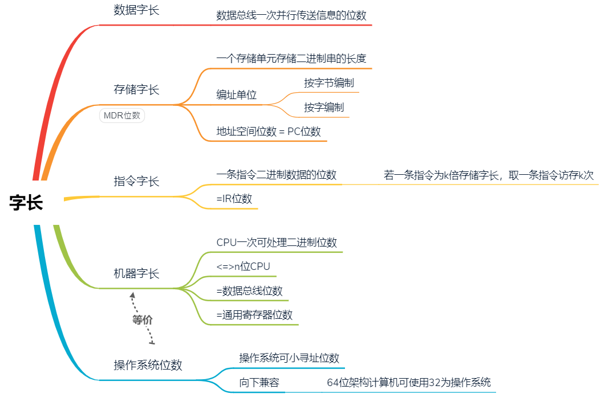

#### 数据通路带宽（数据字长）

数据总线一次性并行传送二进制的位数

#### 吞吐量

> 单位时间内完成事务的数量

系统在单位时间内处理请求的数量

#### 响应时间

> 从发起请求到做出相应的时间

