> 计算机的存储器系统

<!--more-->

## 2.1 存储器层次化结构

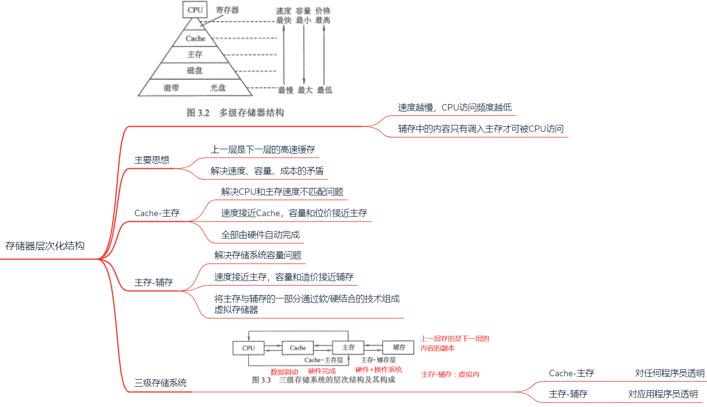

## 2.2 存储器分类

### 2.2.1 存储器在计算机中的作用

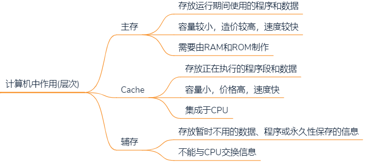

### 2.2.2 按存储介质分类

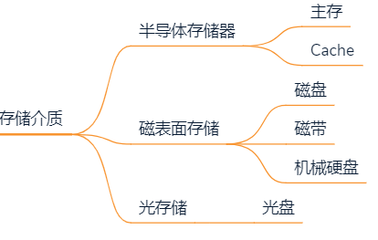

### 2.2.3 按存取方式分类

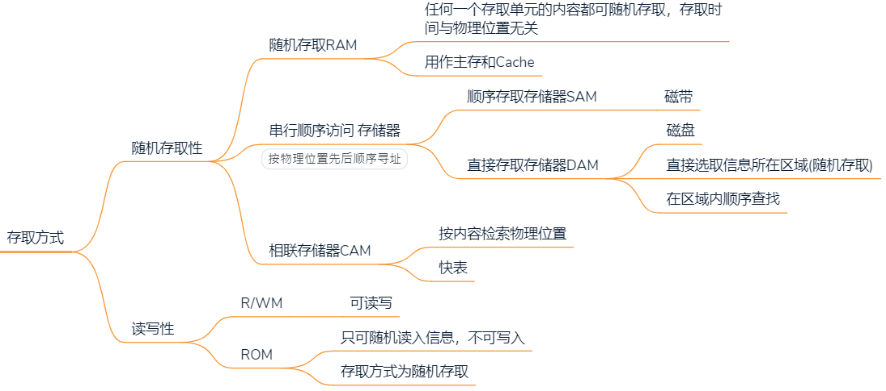

### 2.2.4 按信息保护性

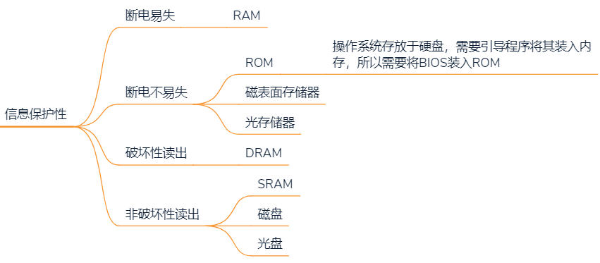

## 2.3 存储器性能指标

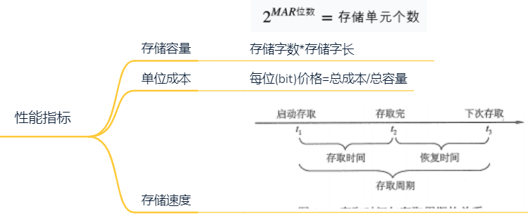

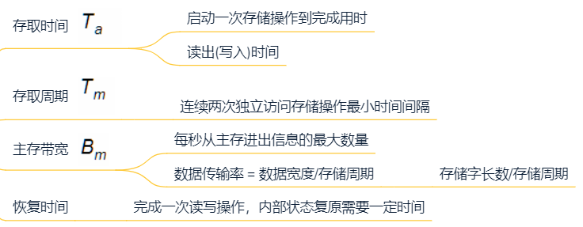

## 2.4 主存

### 2.4.1 半导体元件

#### 基本概念

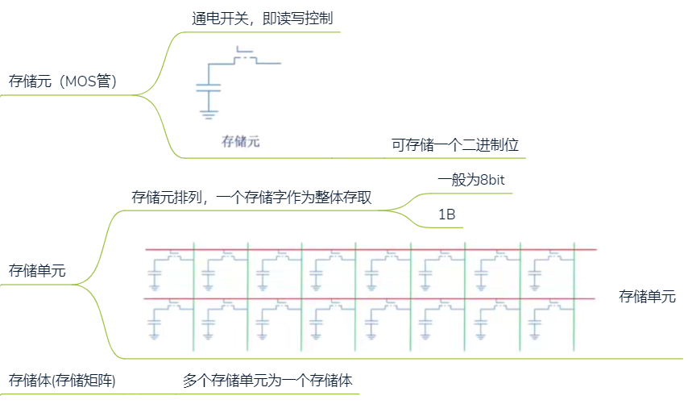

#### ROM

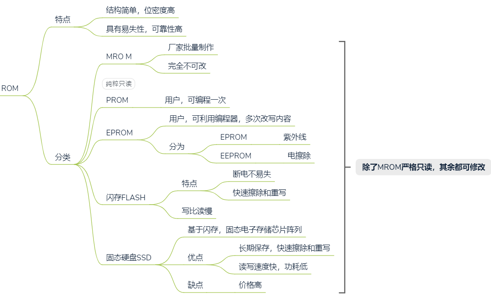

#### RAM

> SRAM&DRAM都属于断电易失存储器

##### 核心区别

**存储元件的不同导致元件特性差异**

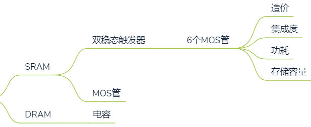

##### DRAM与SRAM对比

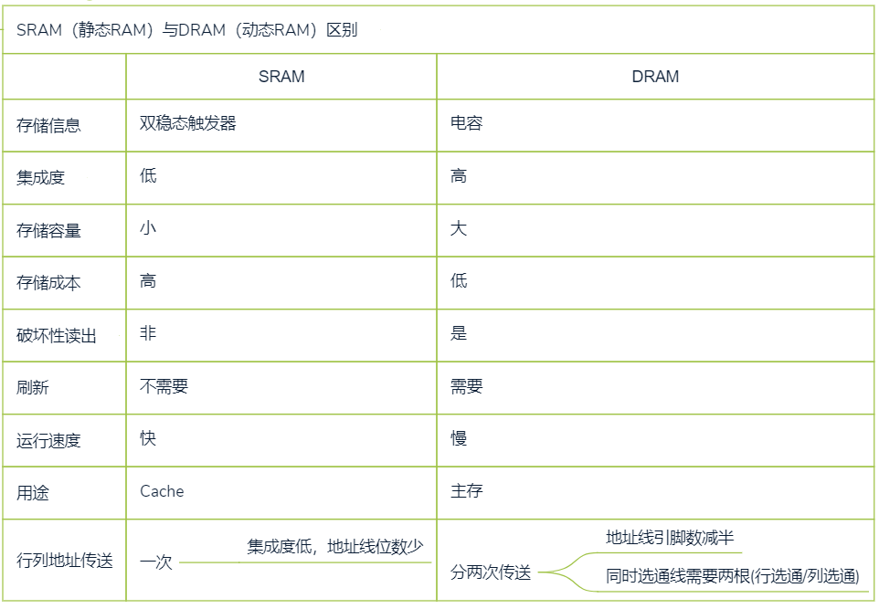

##### DRAM刷新

> 每次以行为单位刷新

仅需行地址

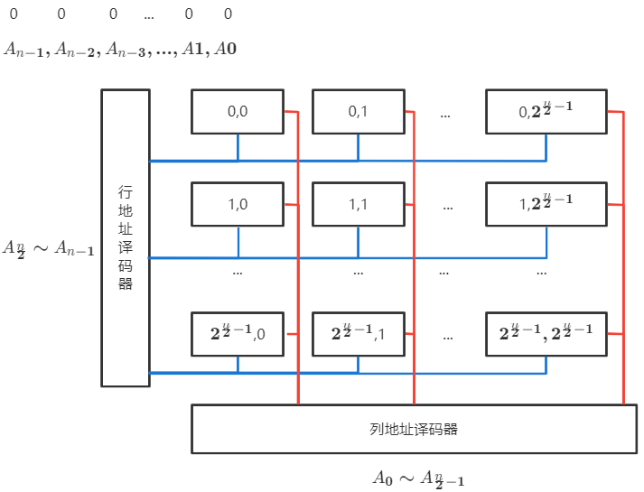

- 行与列信号同时存在才能
- 地址线复用，分时  传送行地址与列地址，地址线减半

> 刷新周期：2ms

由于电容中电荷只能维持2ms，需要通过刷新充电，每隔2ms需要把一行电容刷新一遍

> 刷新方式

刷新一行：读出一行信息，重新写入，占一个读写周期

刷新由硬件支持，无需CPU参与

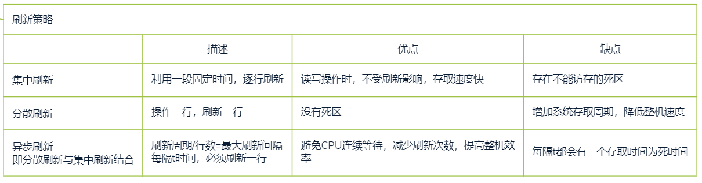

采用异步刷新，可实现“透明传输”

- 在不需访存时间刷新（译码阶段）
- 对于使用者，不增加存取周期，也不存在死时间

#### BIOS

主存由RAM和ROM组成，BIOS存储在ROM中

BIOS存储的是操作系统引导程序地址的部件，在计算机启动时，会将引导程序从硬盘载入到RAM，引导程序将操作系统从硬盘载入到RAM

### 2.4.2 内存硬件组成

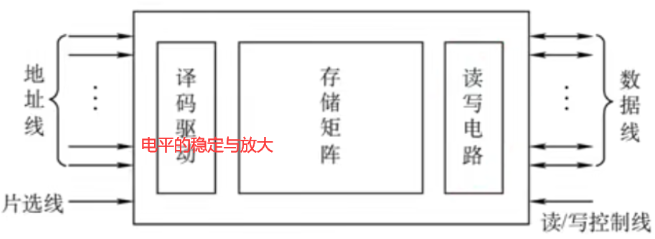

#### 译码驱动电路

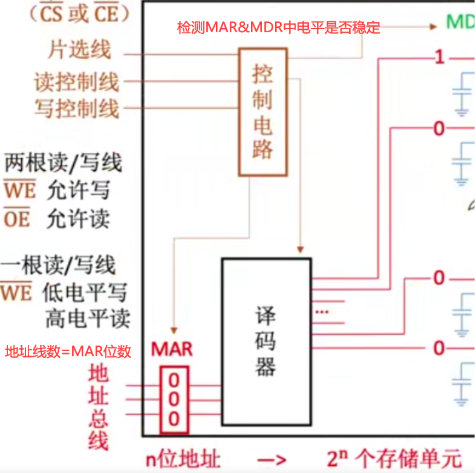

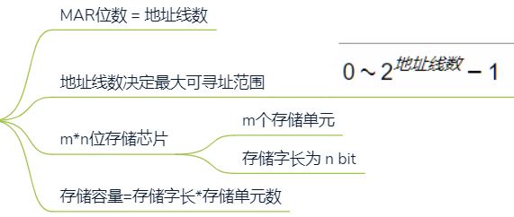

#### 存储矩阵(存储体)

> 存储单元的组合方式

##### 原理

存取周期=存储时间+恢复时间

CPU速度远大于主存速度，同时从存储器中取出多条指令，提高运行速度

##### 单体多字存储器

##### 多体并行存储器

> 高位交叉编址

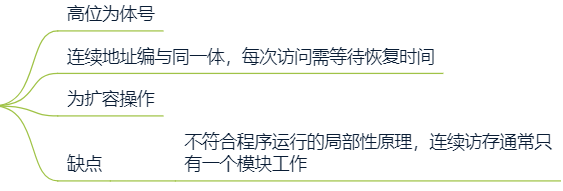

> 低位交叉编址

$$
模块号=单元地址\%模块数
$$

连续地址编与不同体，连续访问跨体，不许等待

比单体多字更精准命中某个存储单元

采用流水线式并行读取，提高存储器带宽

- 模块数

  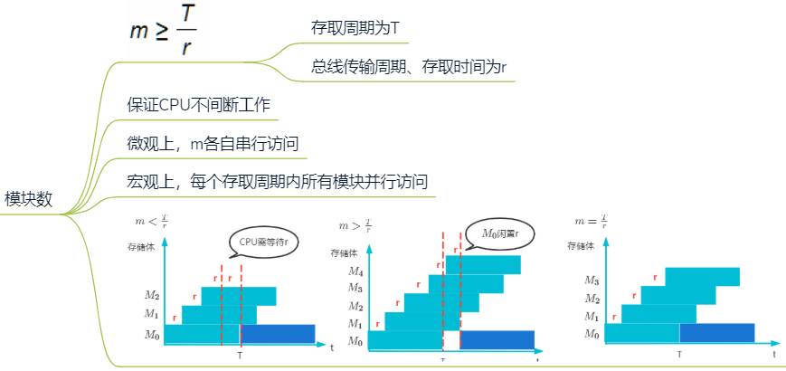

- 存储体号计算

  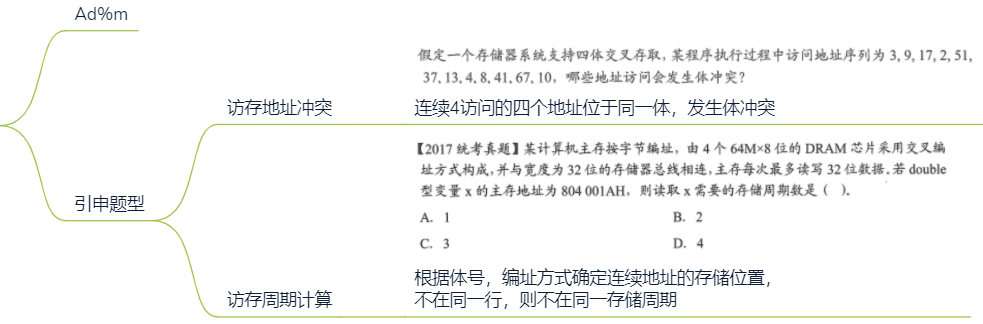

- 周期：连续两次相同操作的时间间隔

> 访存流水计算

每个存储体存取周期为T，存取时间为r，假设T=4r
连续访问：
00000
00001
00010
00011
00100
两种方式耗时

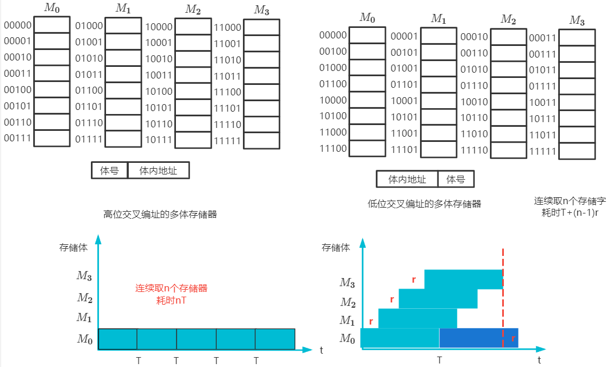

#### 读写电路

> 每次读写一个存储器

#### 引脚

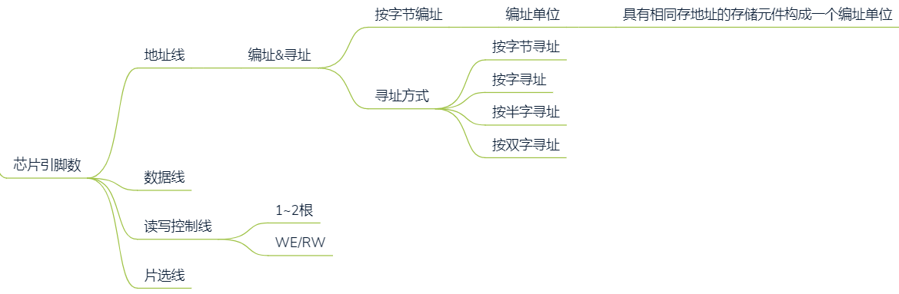

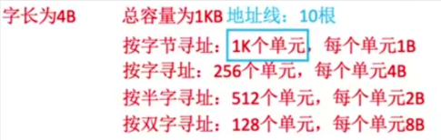

### 2.4.3 访存过程

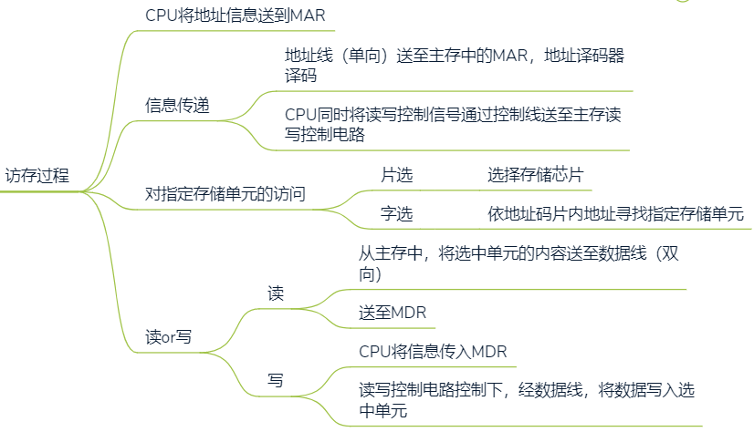

### 2.4.4 提升访存速度

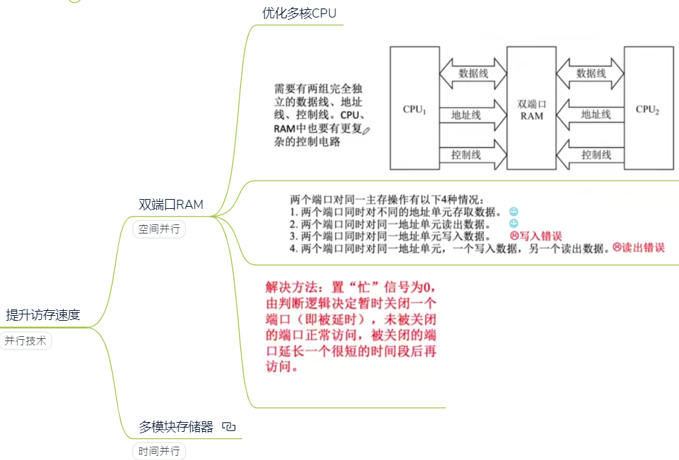

## 2.5 CPU与主存连接

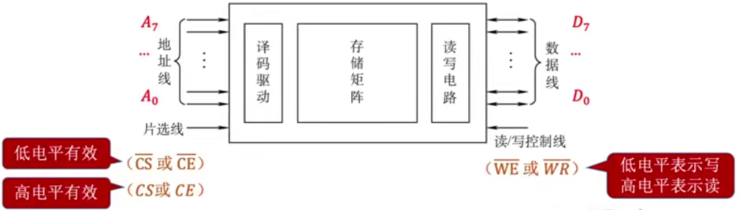

主存与CPU通过总线连接

- 地址线数决定最大可寻址空间

- 控制线指出总线周期类型(读/写 )

- 数据总线数=可并行传输的bit数=MDR位数

  $数据总线数*f=数据传输率$

### 2.5.1 连接方式

#### 位扩展

> 计算机在 $数据总线数=存储字长$ 时，能更好发挥总线性能

数据线位数与存储芯片数据位数不相等时，需要进行 **位扩展**

##### 连接方式

#### 字扩展

> 扩充寻址空间范围

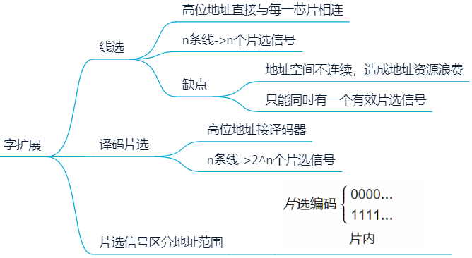

#### 字位同时扩展

### 2.5.2 连接原则

#### 合理选择芯片

芯片类型

- ROM：存放系统程序，标准子程序，各类常数
- RAM：用户编程

芯片数量

#### 地址线连接

- 低位：字选，芯片的片内逻辑完成
- 高位：片选

#### 数据线连接

存储芯片数据位位数=数据线总数

不等，则进行位扩展

#### 读/写控制线

直接连接

#### 片选线连接

CPU访存控制信号 $\overline{MREQ}$ 为片选有效信号

CPU要求访存，才会选中存储芯片

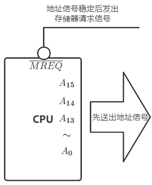

如：用一个 $16K\times 4$ 位的Flash芯片组成一个 $64K\times 8$ 位的半导体只读存储器，存储器按字编址

由于该存储芯片数据位数为 8 ，所以需要用 $\frac{64K}{16K}\times (\frac{8}{4}-1)=4$ 片Flash芯片进行位扩展

该存储器的数据线数为 $8$ 位，地址线数为 $16$ ，片内地址线数  $14$ ，剩余 $2$ 为片选信号，即

$A_{0}\sim A_{13}$：片内地址

$A_{14}\sim A_{15}$ ：片选地址

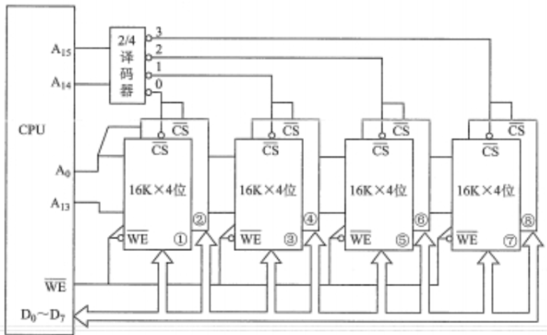

位扩展的一组芯片，共用同一组地址信号

## 2.6 Cache

### 2.6.1 理论依据：局部性原理

> 程序访问局部性原理包括时间局部性和空间局部性
>
> 时间局部性：在最近的未来要是用的信息，很可能是现在正在使用的信息（循环的存在）
>
> 空间局部性：在最近的的未来要用到的信息，很可能与现在正在使用的信息在存储空间上是邻近的，因为指令通常是顺序存放、顺序执行的，数据一般也是以数组、向量的形式存储在以

高速缓存技术就是利用程序访问的存储性原理，将程序中正在使用的部分放在一个高速，容量较小的Cache中，使CPU的访存操作大多数针对Cache进行，从而提高程序的执行速度

- CPU和Cache以字节为单位进行数据交互

- Cache 与主存交互以块为单位

- 将主存中的某些数据块 **复制** 到Cache中，提高数据访问的速度

  Cache中保存的是主存中数据的副本

#### Cache块

##### CPU和主存分为大小相等的块

块内有多个存储单元

- 用 `块内地址` 标记具体的存储单元地址
- `块号` 标记当前块地址

Cache块大小划分要适当

- 过大：Cache行变少，命中率降低
- 过小：Cache行过多，未命中需要话费更多时间从主存读块

##### Cache总容量

> Cache总容量=存储阵列总容量+数据块总容量

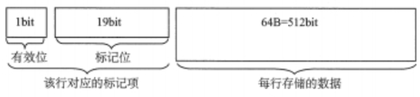

> 数据块总容量=数据块数*块大小

> 存储阵列总容量=映射表总容量=标记项位数*Cache块数

每个Cache块对应一个Cache标记项，用于标记相应Cache块的数据状态

- 有效位：当前块的数据存放的是否为主存信息的副本
- 标记位Tag：主存中块的编号
- 一致性维护位：是否被修改
- 替换算法控制位：Cache满时，替换算法

匹配Cache块，就是查找阵列的标记项是否符合要求

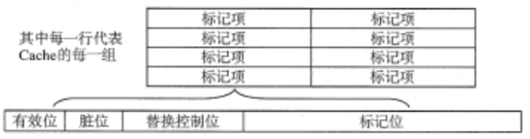

---

如：某存储系统中，主存容量是Cache容量的4096倍，Cache被分为64个块，当主存地址和Cache地址采用直接映射方式时，地址映射表的大小应为
$$
\begin{aligned}
&4096=2^{12}即用12bit标识主存地址，1bit作为有效位\\
&由于有64个Cache块，所以需要64\times 13bit
\end{aligned}
$$

##### 将指令Cache与数据Cache分离

> 取指和区数分别在不同的Cache中寻找，指令流水线中取指部分和取数部分可以很好地避免冲突，减少了指令流水线的冲突

允许CPU在同一存储周期内取指令和数据，保证不同的指令同时访存

> Cache取指缺失，处理过程

- PC恢复当前指令值
- 对主存进行读操作
- 将读入的指令写入Cache中，更改有效位和标记位
- 重新执行当前指令

#### 访存思路

Cache命中：将访存地址变为Cache地址，直接对Cache进行读操作，访存结束

未命中，则访存

1. 将访存字所在的块一次性调入Cache
2. 若Cache满，则使用 `替换算法` ，不管哪种替换算法，都是对数据所在块操作

#### 命中率

> 访存过程，Cache地址匹配后，主存地址匹配，即Cache命中

命中率H：CPU欲访问的信息已在Cache中的比率

缺失率(未命中)：M=1-H

Cache——主存 系统的平均访问时间：$t = Ht_c+(1-H)(t_c+t_m)$

- 先访问Cache，若Cache未命中再访问主存

或$t = Ht_c+(1-H)t_m$

- 同时访问Cache和主存，若Cache命中则停止访问主存

### 2.6.2 Cache主存映射关系

> 地址映射：把存放在主存中的信息按照某种规则装入Cache

#### 全相联映射

##### 地址划分

> 区分Cache地址与主存地址：主存地址去掉主存标记为Cache地址

$$
主存块号=二进制地址\%块大小\\
Cache块与主存块映射：随便
$$

假设某个计算机的主存地址空间有256MB，按字节编址，其数据Cache有8个Cache块，块大小为64B

$256MB=2^{28}B,主存地址28位$ ，其中一个块 $64=2^{6}$ 字节，需要6bit块内地址表示，主存地址的剩余22位为主存地址

##### 访存过程

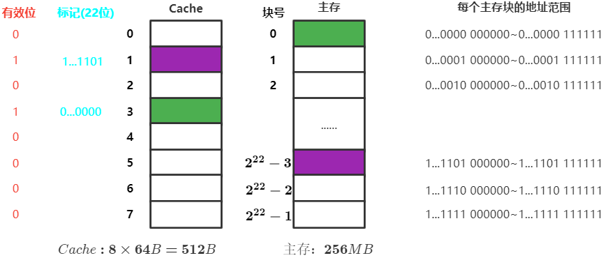

1. CPU访问主存地址 `1...1101 001110`
2. 主存地址的前22位为主存地址，对比 `Cache标记阵列` 的 `主存地址(标记项)` 是否为 `1...1101`
3. 若标记匹配且有 `有效位=1` ，则 **Cache命中** ，访问该Cache块中块内地址为 `001110` 的存储单元
4. 若 **Cache未命中** 或 `有效位=0` ，则正常访问

##### 优点

Cache存储空间利用率充分

##### 缺点

- 标记速度慢，成本高
- 查找 `标记` 最慢

#### 直接映射

##### 主存地址格式

将 `主存块号` 的末尾几位作为 `Cache行号` ，即 `i` 号Cache块只能保存主存块号后几位为 `i` 的主存块数据 
$$
\begin{aligned}
&主存块号=主存地址\%块大小\\
&Cache块号=主存块号 \%Cache总块数
\end{aligned}
$$

假设某个计算机的主存地址空间有256MB，按字节编址，其数据Cache有8个Cache块，块大小为64B

采用直接映射，，$256MB=2^{28}B,主存地址共28位$ ，其中Cache有 $8=2^3$ 个块，所以块号占3位，一块有 $64=2^{6}$ 字节，需要6位块内地址表示，主存地址的剩余19位为主存地址

##### 访存过程

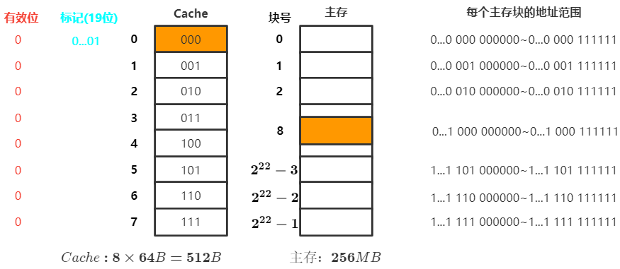

1. CPU访问地址 `0...01 000 001110`
2. 根据主存块号的后3位确定Cache行
3. 若 `主存块号的前19位` 与Cache `标记` 匹配且 `有效为=1` ，则 **Cache命中** ，访问块内地址为 `001110` 的单元
4. 若 **Cache未命中** 或 `有效为=1` ，则正常访问主存

##### 优点

查找速度快，只需对比一个标记

##### 缺点

主存块只能放到固定的Cache位置，造成空间浪费，命中率降低

#### 组相联映射

##### 主存地址格式

n路组相联，每n块为一组，属于同一组的主存块在Cache中该组的n块随便放

$$
主存块号=主存地址\%块大小\\
Cache块号=主存块号\%分组数
$$

假设某个计算机的主存地址空间有256MB，按字节编址，其数据Cache有8个Cache块，块大小为64B，采用组相联系映射，分为4组

$256MB=2^{28}B,主存地址共28位$ ，分为 $2^2=4$ 个组，所以组号占2位，有 $8=2^3$ 个块，一块有 $64=2^{6}$ 字节，需要6位块内地址表示，主存地址的剩余20位为主存地址

##### 访存过程

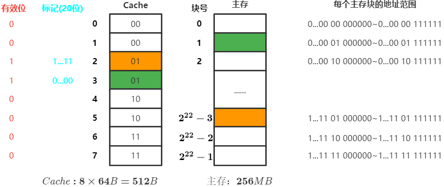

1. 根据 `主存块号的后2位` 确定所属 `分组号`
2. 若主存块号的前20位与分组内的某个标记匹配且  `有效位=1`，则 **Cache命中** ，访问
3. 若 **Cache未命中** 或 `有效位=0` ，则正常访问主存

#### 对比

三种映射方式中，直接映射的每个主存块只能映射到Cache中的某一固定行；全相联映射可以映射到所有Cache行；N路组相联映射可以映射到N行。

1. 直接映射的命中率最低，全相联映射的命中率最高
2. 直接映射的判断开销最小、所需时间最短；全相联映射的判断开销最大、所需时间最长
3. 直接映射标记所占额外空间最小；全相联映射标记所占的额外空间开销最大

### 2.6.3 Cache替换算法

#### 替换条件

直接映射无需考虑替换算法

全相联映射：Cache满

组相联映射：分组满

#### 替换算法

##### 随机算法(RAND)

> 实现简单，但为依据程序访问的局部性原理，所以会造成Cache命中率较低

##### 先进先出算法(FIFO)

> 若Cache已满，则替换最先被调入Cache的块

假设共有4个Cache块，初始整个Cache为空。采用全相联映射，依次访问主存块 (1,2,3,4,1,2,5,1,2,3,4,5)

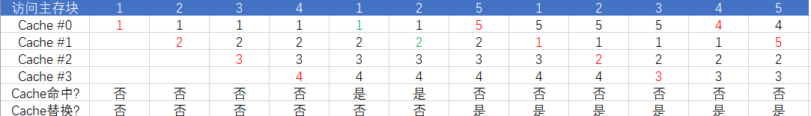

优点：

- 实现简单

缺点：

没有考虑局部性原理，最先被调入Cache的块也有 可能被频繁访问

##### 最近最少使用算法(LRU)

1. 命中时，所命中块的计数器清零，比其低的计数器加1，其余不变
2. 未命中且还有空闲块时，新装入的块计数器置0，其余全加1,
3. 未命中且无空闲块时，计数器值最大的块被淘汰，新装入的块计数器置0，其余块计数器加1

> 若 $Cache块的总数=2^n$ ，则计数器只需n位

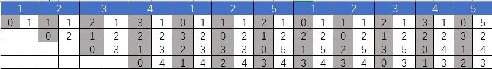

优点：

- 基于局部性原理，近期被访问过的主存块，在不久的将来很可能被再次访问，淘汰最近最久未被使用的块是合理的

> 被频繁访问的主存数量>Cache块数，可能发生抖动现象

##### 最不经常使用算法(LFU)

为每一个Cache块设置一个 **计数器** ，用于记录每个Cache块被访问过几次。当Cache满后，替换 **计数器最小的** 。新调入的块计数器=0，之后每被访问一次，计数器+1

缺点：曾经经常被访问的不一定将来经常被访问，不符合局部性原理

### 2.6.4 Cache写策略

#### Cache写命中

##### 写回法(写直达)

> 当CPU对Cache写命中时，只修改Cache的内容，而不立即写入主存，只有此块被换出时才写回主存

减少了访存次数，但存在数据不一致的隐患

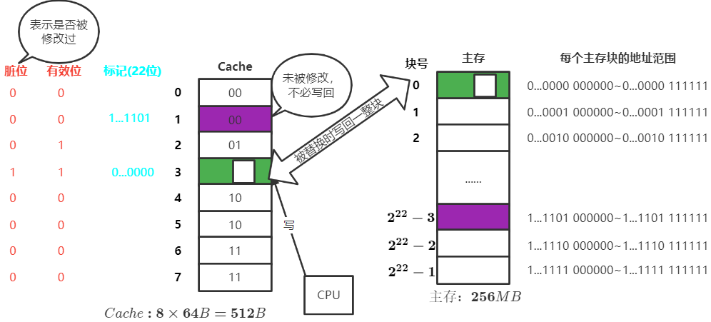

适用于Cache替换不频繁的情况

##### 全写法(写直通法)

> 当CPU对Cache写命中时，必须把数据同时写入Cache和主存，一般使用写缓冲

增加了访存次数，但能保证数据一致性

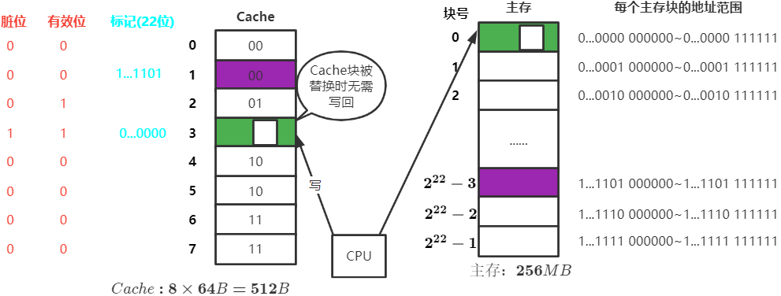

适用于Cache块频繁换进换出的情况

#### Cache写不命中

##### 非写分配法

> 当CPU对Cache写不命中时，只写入内存，不调入Cache，搭配 **全写法** 使用
>
> 全写法：当CPU对Cache写命中时，必须把数据同时写入Cache和主存

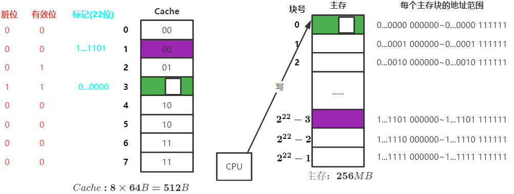

##### 写分配法

> 当CPU对Cache写不命中时，把主存中的块调入Cache，在Cache中修改，搭配 **写回法** 使用
>
> 写回法：当CPU对 Cache写命中时，只修改Cache的内容，只有当此块被换出Cache时才写回主存

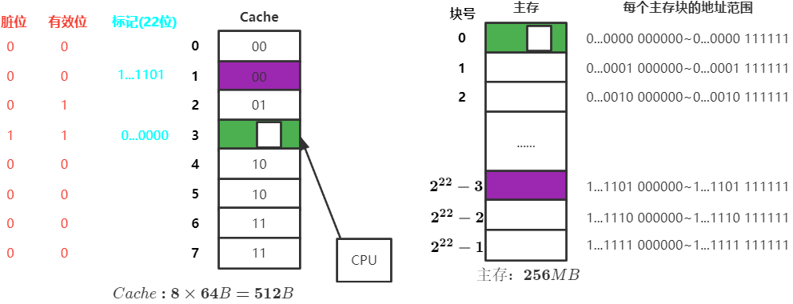
