> 一条 **指令的执行过程** ，会产生数据流，即 **形成数据通路** 。数据的通断需要 **由不同布线方式的CU** 产生的 **控制信号** 控制。
>
> 多条指令的执行采用 **指令流水线** 方式并行工作

<!--more-->

## 4.1 CPU功能

### 4.1.1 ALU功能

对数据加工：对数据进行算术和逻辑运算

### 4.1.2 CU功能

#### 指令控制

确保程序的顺序执行

- 取指：自动形成指令地址，自动发出取指令的命令
- 分析 ：操作码移码；产生操作数的有效地址‘
- 执行：根据分析阶段得到的”操作命令“ 和 ”操作数地址“ 形成操作信号控制序列，控制各个部件完成相应操作
- 中断处理 ：管理总线及输入输出，处理异常情况（断电）和特殊请求（打印机请求打印一行字符）

#### 操作控制

> 一条指令的执行需要若干操作先后组合实现

CPU管理并产生每条指令的操作信号，将各操作信号送至相应部件，并控制这些部件完成相应动作

#### 时间控制

为每条指令按时间按顺序执行提供时钟信号

#### 中断处理

对运行过程中的异常情况和特殊请求进行处理

## 4.2 CPU结构

### 4.2.1 运算器

> 接收从CU送来的命令并执行相应动作，对数据进行算术运算和逻辑运算

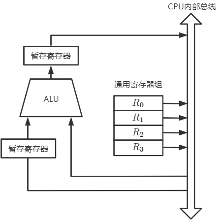

#### 算术逻辑单元——ALU

> 进行算术或逻辑运算

ALU内部没有存储功能的部件——ALU的两个输入端需要同时有效时，需要一个暂存器存储一个数据，再通过总线将数据直接传送到ALU另一输入端上

- **ALU与暂存寄存器有专用通路** ：数据传输总线周期

#### 通用寄存器组——X

> 存放操作数、地址信息

包括AX，BX，CX，DX，SP（堆栈栈顶指针）

累加寄存器-ACC：存放ALU运算结果，作为加法运算的输入端

**寄存器位数=机器字长** ：一次可以处理的二进制位数

#### 暂存寄存器

> 从主存中读来的数据，对应用程序员透明

#### 程序状态字——PSW

PSW中的二进制位参与并决定微操作的形成

#### 移位器

移位运算

#### 计数器

乘除运算的操作步数

### 4.2.2 控制器

> 整个系统的指挥中枢
>
> 指令执行阶段——每条指令的执行有CU发出一组微操作控制

#### 功能

- 从主存中取出一条指令，指出下条指令在主存中的位置
- 对指令进行译码或测试
- 产生相应的操作控制信号，指挥并控制CPU、主存、IO设备之间的数据流动信号

#### 组成部件

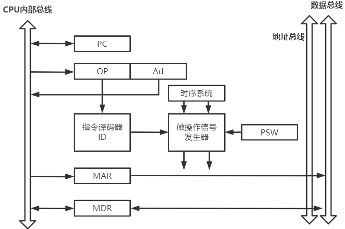

##### 程序计数器PC

> 存放下一条指令在主存中存放的地址

**CPU根据PC的内容去主存中取指令**

程序中指令顺序执行，所以**PC有自增功能**

##### 指令寄存器IR

> 用于存放当前正在执行的指令

##### 指令译码器

> 仅对操作码字段进行移码，向控制器提供特定的操作信号

##### 微操作信号发生器

> 根据`IR的内容(指令)`、`PSW的内容(状态信息)`及 `时序信息`，产生计算机系统所需的各种控制信号

|          | 微程序控制器                                                 | 硬布线控制器                                                 |
| -------- | ------------------------------------------------------------ | ------------------------------------------------------------ |
| 工作原理 | 微操作控制信号以微程序的形式存放在 控制存储器中，执行指令时读出即可 | 微操作控制信号由组合逻辑根据 当前的指令码、状态和时序即时产生 |
| 执行速度 | 慢                                                           | 快                                                           |
| 规整性   | 较规整                                                       | 繁琐，不规整                                                 |
| 应用场合 | CISC CPU                                                     | RISC CPU                                                     |
| 易扩充性 | 易扩充修改                                                   | 困难                                                         |

##### 时序信号

> 用于产生各种时序信号，由统一时钟分频得到

##### 存储器地址存储器MAR

> 用于存放索要访问的主存单元的地址

##### 存储器数据寄存器MDR

> 用于存放主存写入的信息或从主存读出的信息

#### 硬布线控制器(组合逻辑型)

##### 原理

> 根据 `指令操作码` 、`目前的机器周期`、`节拍信号`、`机器状态` 即可确定当前节拍应该发出哪些 **微命令**

- 用四个触发器标记指令的四个周期

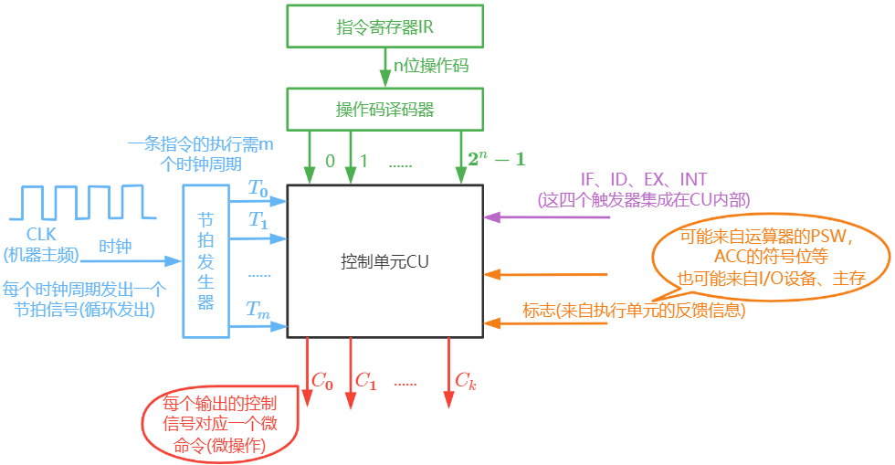

---

如：(PC)->MAR的微命令

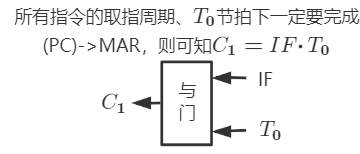

此时将 $C_1$ 接到 $PC_{out}$ 、$MAR_{in}$ 即可

##### 特点

- 及时产生控制信号，执行速度快：由纯硬件实现控制，控制信号由组合逻辑电路产生
- 扩充指令困难：如果扩充一条指令，则需要修改与优化逻辑表达式，进而修改电路设计
- 指令越多，设计与实现越复杂，因此一般用于RICS

##### 设计步骤

1. 分析每个阶段的微操作序列（取值、间址、执行、中断）

   确定哪些指令在什么阶段

   什么条件下会使用到微操作

2. 选择CPU的控制方式

   采用定长机器周期还是不定长机器周期

   每个机器周期安排几个节拍

3. 安排微操作时序

   如何用3个节拍完成整个机器周期内的所有操作

   哪些微操作可以同时执行

4. 电路设计

   确定每个微操作命令的逻辑表达式，并用电路实现

---

**1. 分析指令系统中每个指令所需的微操作**

罗列出所有指令在各个阶段的微操作序列，就可以知道在什么情况下用到某个微操作

根据指令操作码、目前机器周期、节拍信号、机器状态条件即可确定现在这个节拍下发出哪些"微操作"

- 取指周期

$$
\begin{aligned}
&PC\rightarrow MAR\\
&M(MAR)\rightarrow MDR\\
&MDR\rightarrow IR\\
&OP(IR)\rightarrow ID\\
&(PC)+1\rightarrow PC
\end{aligned}
$$

- 间址周期

$$
\begin{aligned}
&Ad(IR)\rightarrow MAR\\
&1\rightarrow R\\
&M(MAR)\rightarrow MDR\\
&MDR\rightarrow Ad(IR)
\end{aligned}
$$

---

**2. CPU控制方式-机器周期的确定**

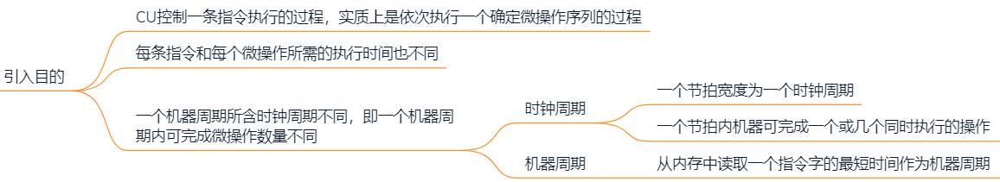

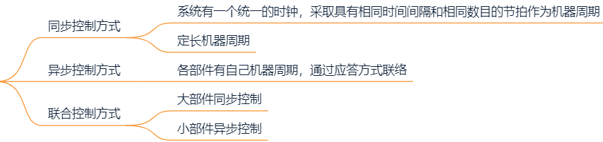

---

**3. 微操作时序的确定**

原则：

- 微操作的**先后顺序不能随意更改**
- **被控对象不同的微操作**，尽量安排在一个节拍内完成
- 占用时间较短的微操作，尽量安排在 **一个节拍内完成** ，并允许有先后顺序

$$
\begin{aligned}
&T_0\quad (1)(PC)\rightarrow MAR\\
&T_0\quad (2)1\rightarrow R &存储器空闲即可\\
&T_1\quad (3)M(MAR)\rightarrow MDR &在(1)之后\\
&T_1\quad (6)(PC)+1\rightarrow PC &在(1)之后\\
&T_2\quad (4)MDR\rightarrow IR &在(3)之后\\
&T_2\quad (5)OP(IR)\rightarrow ID &在(4)之后
\end{aligned}
$$

$M(MAR)\rightarrow MDR$ 从主存取用数据，用时较长，因此必须占用一个时钟周期才能保证微操作的完成

$MDR\rightarrow IR$ 是CPU内部寄存器的数据传送，速度很快，因此在一个时钟周期内可以紧接着完成 `OP(IR)->ID` 

- 将操作码送至译码器，产生执行周期微命令

---

**4. 电路设计**

- 列出操作时间表
- 确定最简逻辑表达式
- 画电路图

#### 微程序控制器(存储控制型)

##### 设计思路

> 微程序：由微指令序列组成，每一种指令对应一个微程序
>
> 程序：由指令序列组成

- 指令是对程序执行步骤的描述
- 微指令是对指令执行步骤的描述

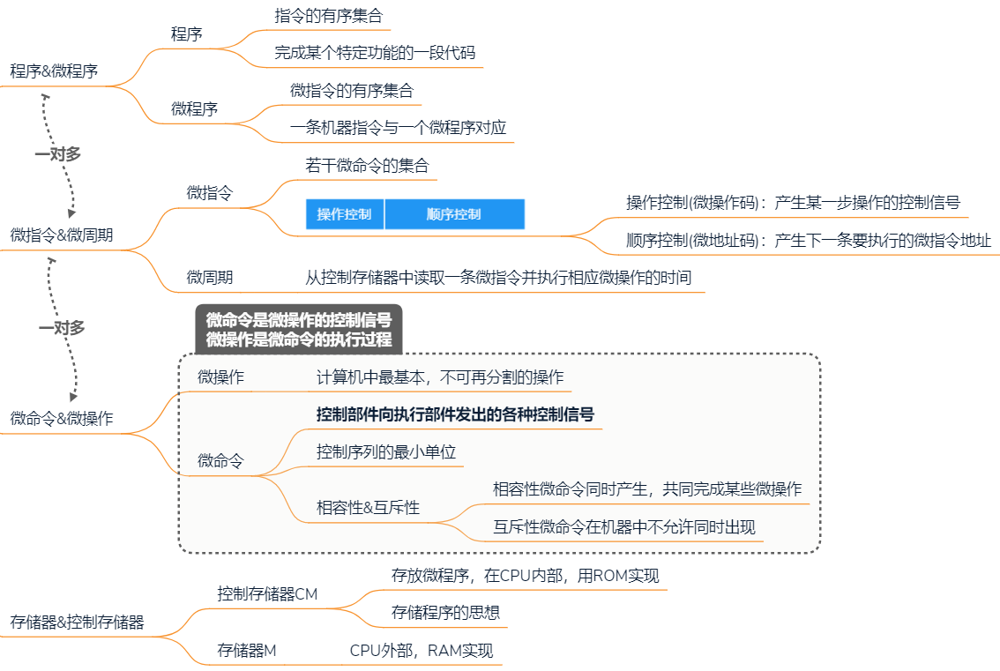

互斥型微命令：不允许并行完成的微命令

相容性微命令：可以并行完成的微命令

##### 微程序CU结构

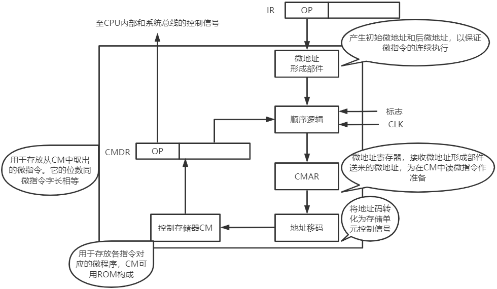

`CMAR`：对应CPU的MAR于PC

`微地址形成部件` ：根据操作码确定微程序的起始地址

`顺序逻辑` ：调整微指令执行顺序

`CM` ：控制存储器，厂家会将该CPU支持的所有机器指令对应的微程序写入CM中

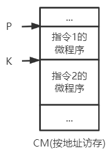

- CM中最少微程序数=机器指令数+1（取微指）

- 若多条指令的 *取指周期* 、 *间址周期* 、*中断周期* 的微操作都相同，可将这些微指令编为一个微程序

- CM容量的计算

  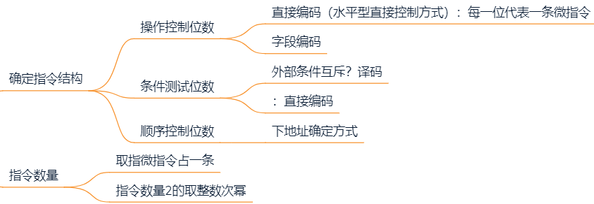

##### 工作原理

一条机器指令执行周期工作过程：

1. 取微指令

   机器运行时，自动将 *取指微程序入口地址* 送往 `CMAR`

   从 `CM` 中读出相应的微指令送入 `CMDR`

   取指微程序执行完后，当前机器指令存入 `IR`

2. 指令操作码字段通过 `微地址形成部件` 产生该机器指令对应的 *微程序入口地址* ，并送往 `CMAR`

3. 从 `CM` 中逐条取出微指令并执行

1. 执行完一条机器指令的微程序后，回到 *取指微程序入口地址*

##### 微程序控制单元的设计

> 编写各条机器指令所对应的微程序

1. 分析每个阶段的微操作序列

2. 写出机器指令对应的微操作命令及节拍安排

   写出每个周期所需要的微操作

   补充微程序控制器特有的微操作

   - 取指周期

     `Ad(CMDR)->CMAR` ：每条微指令结束之后都需要进行

     `OP(IR)->微地址形成部件->CMAR` ：取指周期的最后一条微指令完成后，要根据指令操作码确定其执行周期的微程序首地址

   - 执行周期

     `Ad(CMDR)->MAR` ：每条微指令结束之后都需要进行

3. 确定微指令格式

4. 编写微指令码点

---

###### **1. 分析每个阶段微操作序列**

$$
\begin{aligned}
取指周期&(硬布线控制器的节拍安排)：\\
&T_0\quad PC\rightarrow MAR\\
&T_0\quad 1\rightarrow R\\
&T_1\quad M(MAR)\rightarrow MDR\\
&T_1\quad (PC)+1\rightarrow PC\\
&T_2\quad MDR\rightarrow IR\\
&T_2\quad OP(IR)\rightarrow ID\\
取指周期&(微程序控制器的节拍安排)：\\
&T_0\quad PC\rightarrow MAR\\
&T_0\quad 1\rightarrow R\\
&T_1\quad M(MAR)\rightarrow MDR\\
&T_1\quad (PC)+1\rightarrow PC\\
&T_2\quad MDR\rightarrow IR\\
&IR\quad OP(IR)\rightarrow 微地址形成部件
\end{aligned}
$$

---

###### **2. 写出机器指令对应的微操作命令及节拍安排**

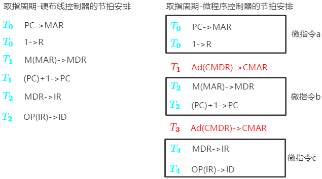

确定

- 微操作对应的微指令

- 微指令下地址的形成

  第一条微指令地址由硬件形成

  其余微指令由上一条微指令的下地址字段直接给出

  最后一条微指令，其后继微指令地址由微地址形成部件形成，与操作码有关

---

###### **3. 确定微指令格式**

根据微操作个数决定采用何种编码格式——确定 *操作控制字段* 的位数

根据 `CM` 中存储的微指令总数，确定微指令的 *顺序控制字段* 的位数

按 *操作控制字段* 位数和 *顺序控制字段* 位数就可确定微指令字长

---

**水平型微指令**：一条微指令能定义多个可并行的微命令

优点：微程序短，执行速度快

缺点：微指令长，编写微程序比较麻烦

1. 某微程序控制器中，采用水平型直接控制（编码）方式的微指令格式，后续微指令地址由微指令的下地址字段给出。已知机器共有28个微命令，6个互斥的可判定的外部条件，控制存储器容量为521*40位，设计微指令格式

   

2. 某机共有52个微操作控制信号，构成5个互斥的微命令组，各组分别包含5,8,2,15,22个微命令、已知可判定的外部条件有两个，微指令字长28位，按水平型微指令格式设计微指令，微指令的下地址字段直接给出后继微指令地址

   

---

垂直型微指令：一条微指令只能定义一个微命令，由微操作码字段规定具体功能

优点：微指令短，简单，规整，便于编写微程序

缺点：微程序长，执行速度慢，工作效率低

###### **4. 编写微指令码点**

根据 *操作控制字段* 每一位代表一个微操作命令，编写每个微指令码点

##### 微指令的设计

- 微指令的具体格式
- 如何根据微指令发出相应微命令

> 微命令与微操作一一对应，一个微操作对应一个控制信号输出线
>
> 有的微操作可以并行执行，一条微指令可以包含多个微命令

---

**微操作字段(微指令的控制方式)**

a. 直接编码(直接控制)方式

> 在微指令的操作控制字段中，`每一位代表一个微操作命令`

某位为 `1` 表示该控制信号有效

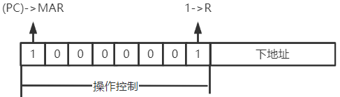

优点：简单直观；执行速度快；操作并行性好

缺点：微指令字长过长（n个微命令要求微指令的操作字段有n位），造成CM容量极大

b. 字段直接编码方式

> 将微指令的控制字段分成若干段，`每段经译码后发出控制信号`

分段原则

- 互斥性微命令分在同一段内，相容性微命令分在不同段内
- 每个小段中包含的信息不能太多，否则将增加译码线路的复杂性和译码时间
- 一般每个小段还要留出一个状态，表示本段不发出任何微命令。因此某字段的长度为3位时，最多只能表示7个互斥的微命令，`000`表示不操作

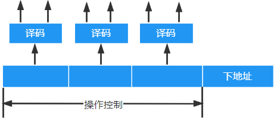

某计算机的控制器采用微程序控制方式，共有33个微命令，构成5个互斥类，分别包括7,3,12,5和6个微命令，则操作控制字段有多少位

- 直接编码方式：33种微命令，操作控制字段需要33位
- 字段直接编码方式：3+2+4+3+3=15位，操作控制字段需要15位

c. 字段间接编码方式

一个字段的某些微命令需由另一字段中的某些微指令来解释

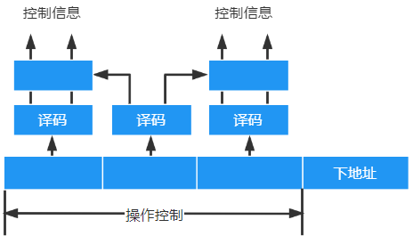

---

**微地址码字段(微指令地址形成方式)**

1. 微指令的 `下地址字段`  指出：

   微指令格式中设置一个下地址字段，直接指出后继微指令的地址

2. 根据机器指令的 `操作码` 形成

   当机器指令取至指令寄存器后，微指令的地址由操作码经微地址形成部件形成

3. 增量计数器法

   (CMAR)+1->CMAR

4. 分支转移

   

5. 由硬件产生微程序入口地址

   第一条微指令地址 由专门硬件产生（用专门的硬件记录取指周期微程序首地址）

   中断周期：由硬件产生 中断周期微程序首地址（由专门的硬件记录）

---

某计算机采用微程序控制器，共32条指令，公共的取指指令微程序包含2条微指令，各指令对应的微程序平均由4条微指令组成，采用下地址字段法确定下调微指令地址，则微指令下地址字段的位数是多少位？

总共需要存储 $32\times 4+2=130$ 条微指令，标注130条微指令需要 $\lceil log_2{130}\rceil  = 8$ 个二进制位

## 4.3 数据通路

### 4.3.1 概念

数据通路：数据在各功能部件之间传送的路劲

数据通路部件：数据通路上的部件

执行部件/功能部件：数据通路中进行数据运算的部件

**控制部件产生的控制信号建立数据通路**

- 数据通路的每个部件都需要控制信号

  三态门（单选）：一个控制信号，通断控制

  多路选择器（多选一）：一个控制信号，条件控制

内部总线：同一部件内的总线，如CPU内总线

系统总线：同一台计算机系统各个部件间的总线，如CPU、内存、通道、IO接口

### 4.3.2 功能

实现CPU内部的数据交换

- ALU-Reg
- Reg-Reg
- Reg-主存

### 4.3.3 结构

#### 专用数据通路

##### 只要与ALU有数据/地址流动，就排线

若直接用导线相连，相当于寄存器组同时与ALU传送数据，故需要进行 `选择控制部件`

- 多路选择器MUX，选择一路输出

  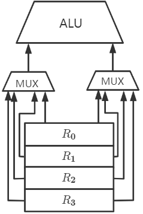

- 三态门控制每一路是否有输出

  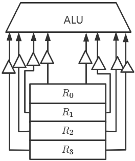

  

特点：

- 性能高，不存在数据冲突

  多个专用数据通路可同时工作

- 结构复杂，硬件量大，不易实现

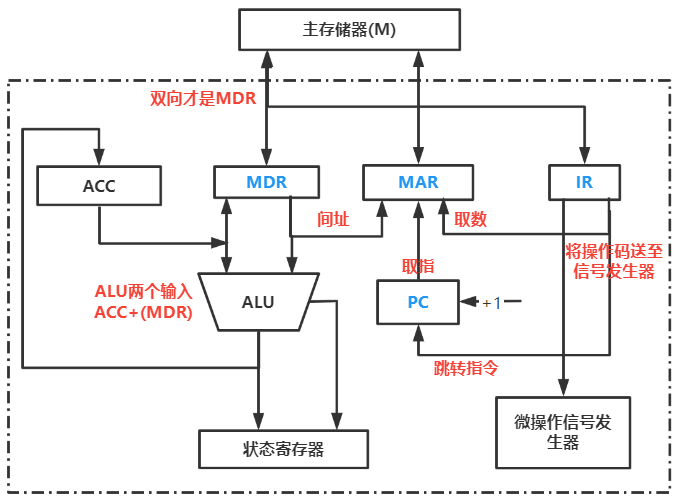

- PC是自增寄存器
- PC内容是地址，所以送往MAR
- 与微操作信号发生器相连的是IR
- 与主存相连的寄存器时MAR和MDR

#### 内总线

> 内部总线：同一部件，如CPU内部连接各个寄存器和运算部件之间的总线
>
> 系统总线：指同一台计算机系统的各部件，如CPU、内存、通道和各类I/O接口间互相连接的总线

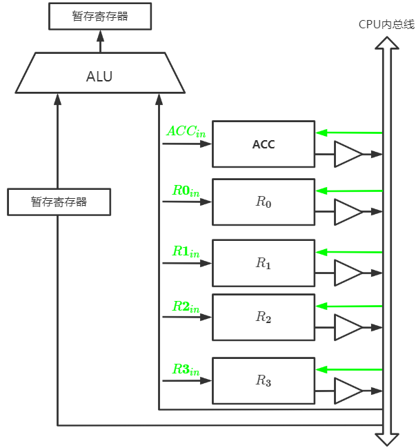

特点

- 结构简单，容易实现
- 数据传输出在数据冲突现象
- 内总线除了ALU与暂存器（输入&输出）有专用数据通路外，其余全部通过总线连接，包括IR与PC

##### CPU内单总线方式

- 同一时刻只允许一组功能部件进行数据传输
- 每完成一个微操作，都需要撤销之前的控制信号，解除对总线的占用

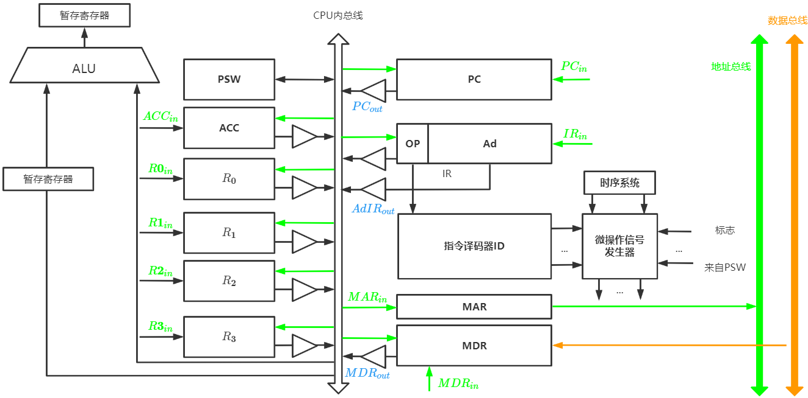

---

**Reg-Reg间数据传送**

比如把PC内容送至MAR，实现传送操作的流程及控制信号为
$$
\begin{aligned}
(PC)\rightarrow Bus \quad &PC_{out}有效，PC内容送总线\\
Bus\rightarrow MAR \quad &MAR_{in}有效,总线内容送MAR
\end{aligned}
$$
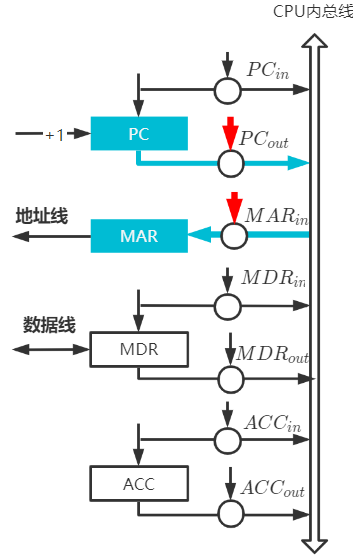

---

**CPU-主存**

CPU从主存读取指令，实现传送操作的流程及控制信号为：
$$
\begin{aligned}
(PC)\rightarrow  MAR\quad &PC_{out}和MAR_{in}有效,\\&当前指令地址\rightarrow MAR\\
1\rightarrow R\quad &CU发读命令(通过控制总线发出)\\
M(MAR)\rightarrow MDR\quad &MDR_{in}有效\\
MDR\rightarrow IR\quad &MDR_{out}和IR_{in}有效,当前指令\rightarrow IR
\end{aligned}
$$
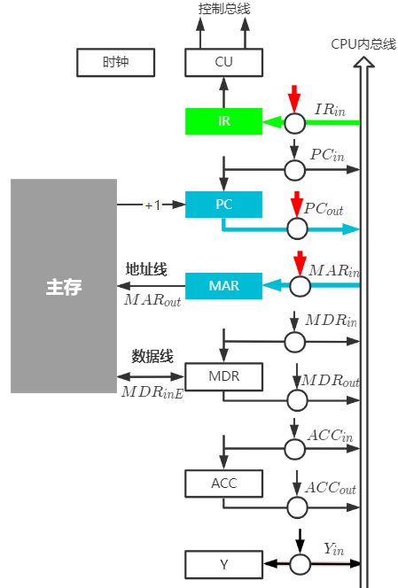

---

**ALU-Reg（执行算术或逻辑运算）**

一条加法指令，微操作序列及控制信号为：
$$
\begin{aligned}
Ad(IR)\rightarrow MAR\quad & MDR_{out}和MAR_{in}有效\\
1\rightarrow R\quad &CU发出读命令\\
M(MAR)\rightarrow MDR\quad &MDR_{in}有效\\
MDR\rightarrow Y\quad &MDR_{out}，操作数\rightarrow Y\\
(ACC)+Y\rightarrow Z\quad &ACC_{out}和ALU_{in}有效,\\
&CU向ALU发出加命令\\
Z\rightarrow ACC\quad &Z_{out}和ACC_{in}有效，结果\rightarrow ACC
\end{aligned}
$$
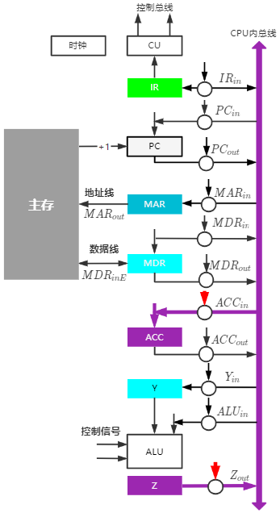

- 暂存寄存器Y与CPU之间有专用数据通路，数据传输不占用总线周期

---

分析指令 `ADD (R0),R1` 的指令流程和控制信号

1. 分析指令功能和指令周期

   功能：((R0))+(R1)->(R0)

   取指周期、**间址周期** 、执行周期

2. 写出各阶段的指令流程

   取指周期：公共操作

   | 时序 | 微操作                  | 有效控制信号               |
   | ---- | ----------------------- | -------------------------- |
   | 1    | $(R0)\rightarrow MAR$   | $R_{out},MAR_{in}$         |
   | 2    | $M(MAR)\rightarrow MDR$ | $MemR,MAR_{out},MDR_{inE}$ |
   | 3    | $(MDR)\rightarrow Y$    | $MDR_{out},Y_{in}$         |
   | 4    | 指令译码                | -                          |

   间址周期：完成取数操作，被加数在主存中，加数已经放在寄存器R1中

   | 时序 | 微操作                  | 有效控制信号               |
   | ---- | ----------------------- | -------------------------- |
   | 1    | $(R0)\rightarrow MAR$   | $R0_{out},MAR_{in}$        |
   | 2    | $M(MAR)\rightarrow MDR$ | $MemR,MAR_{out},MDR_{inE}$ |
   | 3    | $(MDR)\rightarrow Y$    | $MDR_{out},Y_{in}$         |

   执行周期：完成相加操作

   | 时序 | 微操作                    | 有效控制信号                             |
   | ---- | ------------------------- | ---------------------------------------- |
   | 1    | $(R1)+(Y)\rightarrow Z$   | $R1_{out},ALU_{in},CU向ALU发ADD控制信号$ |
   | 2    | $(Z)\rightarrow MDR$      | $Z_{out},MDR_{in}$                       |
   | 3    | $(MDR)\rightarrow M(MAR)$ | $MemW,MDR_{outE},MAR_{out}$              |

---

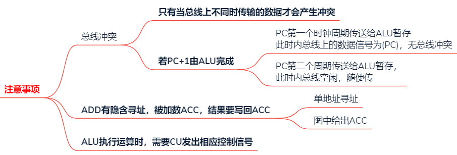

##### CPU内多总线方式
