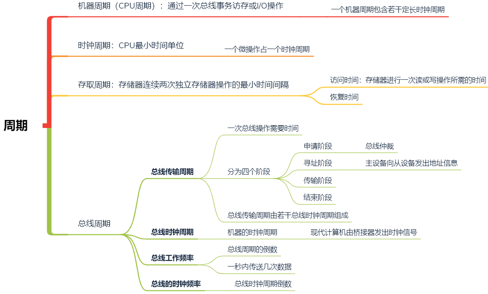

> 周期与字长

<!--more-->

## 7.1 字长

```mermaid
graph LR;
A["字长"]-->B["数据字长：数据总线一次并行传送信息的位数"]
A-->C["存储字长：一个存储单元存储二进制串的长度"]
C-->W["编址单元"]
W-->按字节编制
W-->按字编制
C-->地址空间位数=PC位数
A-->D["指令字长：一个指令二进制数据的位数"]
D-->X["若一条指令为k倍存储字长，取一次指令访存k次"]
D-->=IR位数
A-->E["机器字长：CPU一次可处理的二进制位数"]
E-->Y["=CPU位数=数据总线位数=通用寄存器位数"]
A-->F["操作系统位数：操作系统最小可寻址位数"]
F-->Z["向下兼容，64位架构计算机可使用32位OS"]
```

## 7.2 周期



