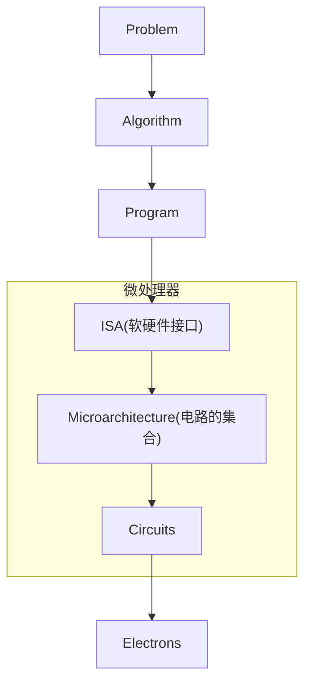

# 一、指令集体系结构（ISA）和折衷

## 1. 指令集体系结构 (ISA)

### (a) 将下边的高级语言片段翻译成前述5种结构适用的代码序列。一定要确保将A、B、D 的值存回内存，但是不能修改内存中任何其它的数值。

```
A = B + C;
B = A + C;
D = A - B;
```

#### 1. 零地址

零地址的机器是一种基于栈的机器，它的所有操作都通过存储在操作数栈上的值进行。对于这种
结构，可以假设它允许以下操作:
• PUSH M – 将位于内存地址M 处的值压入操作数栈
• POP M – 弹出操作数栈并将值存入内存地址M 处
• OP – 从操作数栈中弹出两个值，对这两个值执行二进制操作OP，结果压回到操作数栈

| 高级语言   | 指令                        |
| ---------- | :-------------------------- |
| A = B + C; | PUSH B,PUSH C, ADD , POP A  |
| B = A + C; | PUSH A, PUSH C, ADD , POP B |
| D = A - B; | PUSH A, PUSH B, SUB , POP D |

#### 2. 一地址

• LOAD M – 将存储在内存地址为M 处的值载入累加器
• STORE M – 将累加器中的值存入内存地址为M 处
• OP M – 对内存地址为M 处存储的值和当前在累加器中的值执行二进制操作OP，结果存进累加器 (ACCUM=ACCUM OP M)

| 高级语言   | 指令                    |
| ---------- | :---------------------- |
| A = B + C; | LOAD B,  ADD C, STORE A |
| B = A + C; | ADD C, STORE B          |
| D = A - B  | LOAD A, SUB B, STORE D  |

#### 3. 二地址

双地址的机器有两个操作数来源，对这两个来源的操作数执行操作并将结果存回其中一个源。对这种结构，可以假设它的ISA 允许以下操作：
• OP M1, M2 – 对存储在内存地址为M1 和M2 的值进行二进制操作OP，将结果存回内存地址
M1 处 (M1 = M1 OP M2)

```
ADD B,C		#B:B+C
SUB A,A		#A:0
ADD A,B	 	#A:B+C
ADD C,A		#C:B+2C
SUB B,B 	#B:0
ADD B,C		#B:B+2C
SUB	C,A		#C:C
SUB D,D		#D:0
SUB	D,C		#D:-C
```

#### 4. 三地址

##### (a)对于一台操作数和结果目的地址都是内存地址的三地址机器，可以假设它的ISA 允许如下操作：

- OP M3, M1, M2 – 对存储在内存地址为M1 和M2 处的值执行二进制操作OP，结果存回内存地址为M3 处 (M3 = M1 OP M2)

```
ADD A,B,C
ADD B,A,C
SUB	D,A,B
```

##### (b)对于一台源和目的都是寄存器的三地址机器，使用内存操作将值载入寄存器 (MIPS 就是这种机器的例子)。对于这种结构，可以假设它的ISA 允许如下操作：

- OP R3, R1, R2 – 对寄存器R1 和R2 中的值执行OP 操作，将结果存回寄存器 R3 (R3 = R1 OP R2).
- LD R1, M – 将内存地址为M 处的值取出存入寄存器 R1
- ST R2, M – 将寄存器R2 中的值存入内存地址M 处

```
LD 	R1,B 		#R1:B
LD 	R2,C 		#R2:C
ADD R3,R1,R2	#R3:B+C
ST	R3,A		#A:B+C
ADD	R1,R3,R2	#R1:B+2C
LD	R1,B		#B:C+2C
SUB	R2,R3,R1	#R2:-C
ST	R2,D		
```

### (b) 请计算这5 种结构对应的指令序列在执行时的取指令字节数和内存数据访问（读和写）字节数。

代码的大小：每条指令都有一个操作码和一组操作数，

- 所有的操作码均为 1 字节 (8 bits)
- 所有的寄存器操作数均为 1 字节(8 bits)
- 所有的内存地址均为 2 字节(16 bits)
- 所有的数据操作数均为 4 字节(32 bits)
- 所有指令的长度均为字节的整数倍

#### 1. 零地址

| 指令                        | 取指/B       | 取内存数/B |
| --------------------------- | :----------- | :--------- |
| PUSH B,PUSH C, ADD , POP A  | (1+2)*3+1=10 | 3*4        |
| PUSH A, PUSH C, ADD , POP B | (1+2)*3+1=10 | 3*4        |
| PUSH A, PUSH B, SUB , POP D | (1+2)*3+1=10 | 3*4        |
|                             | 30           | 36         |

#### 2. 一地址

| 指令                    | 取指/B    | 取内存数/B |
| ----------------------- | :-------- | :--------- |
| LOAD B,  ADD C, STORE A | (1+2)*3=9 | 3*4        |
| ADD C, STORE B          | (1+2)*2=6 | 2*4        |
| LOAD A, SUB B, STORE D  | (1+2)*3=9 | 3*4        |
|                         | 24        | 32         |

#### 3. 二地址

```
ADD B,C 	#B:B+C
SUB A,A		#A:0
ADD A,B	 	#A:B+C
ADD C,A		#C:B+2C
SUB B,B 	#B:0
ADD B,C		#B:B+2C
SUB	C,A		#C:C
SUB D,D		#D:0
SUB	D,C		#D:-C
```

取指：$(1+2*2)*9=45B$

取数：$(2*4+4)*9=108B$

#### 4. 三地址

##### (a) 三内存地址

| 指令         | 取指/B    | 取内存数/B |
| ------------ | :-------- | :--------- |
| ADD A,B,C    | (1+3*2)=7 | 3*4=12     |
| ADD B,A,C    | (1+3*2)=7 | 3*4=12     |
| SUB	D,A,B | (1+3*2)=7 | 3*4=12     |
|              | 21        | 36         |

##### (b) 三寄存器地址

```
LD 	R1,B 		#1+(1+2)=4B	
LD 	R2,C 		#1+(1+2)=4B	
ADD R3,R1,R2	#1+3*1=4B
ST	R3,A		#1+(1+2)=4B	
ADD	R1,R3,R2	#1+3*1=4B
LD	R1,B		#1+(1+2)=4B
SUB	R2,R3,R1	#1+3*1=4B
ST	R2,D		#1+(1+2)=4B
```

取指：$4*8B=32B$
取数：$4*5B=20B$

### 综上

|      | 取指/B | 取内存数/B |
| ---- | ------ | -------- |
| 1    | 30     | 36       |
| 2    | 24     | 32       |
| 3    | 45     | 108      |
| 4(a)    | 21     | 36       |
| 4(b)    | 32     | 20       |

### (c) 从代码尺寸的角度哪一种结构最高效?

在代码尺寸下，`4(a)` 最高效

### (d) 从内存总带宽的需求（代码+数据）角度哪一种结构最高效?

内存带宽消耗=传输的代码量（代码大小）+ 传输的数据量
传输的数据量=涉及的数据数量x 4 Bytes

|      | 取指/B | 取内存数/B |内存总带宽/B|
| ---- | ------ | -------- |----|
| 1    | 30     | 36       |66|
| 2    | 24     | 32       |56|
| 3    | 45     | 108      |153|
| 4(a)    | 21     | 36      | 57|
| 4(b)    | 32     | 20       |52|

故从内存总带宽角度，$4(b)$ 的结构最高效。

## 2. 性能指标

### (a) 如果在具有更高主频的处理器上运行给定程序，是否意味着相比主频较低的处理器而言它总是能够在单位时间(比如 1 秒钟)内执行更多的指令?

不一定，还与`IPC`有关

高频处理器执行一条指令需要多个 `clock` 

低频处理器执行一条指令只需要一个 `clock`

### (b) 如果一个处理器执行给定程序时每秒钟能够执行更多的指令，是否意味着相比每秒执行较少指令的 处理器而言它总是能够更快地执行完这个程序。

正确

相同程序（编译代码也相同）情况下，单位时间执行执行指令越多，可以越快完成程序。

## 3. 性能评价

同一基准程序
| | ISA A |ISA B |
| --- | --- | --- |
| 主频| 500MHz | 600MHz |
|IPC| 10 | 2 |

### (a) ISA A处理的指令条数

$500MHz *10IPC=5000M条指令$

### (b) ISA B处理的指令条数

$600MHz * 2IPC=1200M条指令$

### (c) 性能评价

ISA A 的处理器性能更高，因为在基准程序下，A处理器单位时间内执行指令更多

## 4. 固定长度和可变长度ISA

```
ADD r3, r1, r2 // r3 = r1+r2
SLL r3,0x2//r3=r3<<2
MOV r5,0xa//r5=0x0a
STW r3, (r5) // MEMORY[r5] = r3
```

### (a) 对于以上两种ISA，这段汇编代码的代码尺寸分别是多少

#### 定长指令

定长指令一条指令 $4B$ ，一共四条指令，共 $4*4=16B$

#### 不定长指令

不定长指令共 $13B$

### (b) 对以上两种 ISA，执行这一段代码序列分别需要多少时钟周期?

定长指令下，一条 `STORE` 指令，三条其余指令，故共 $7$ 个时钟周期

可变长指令，共 $15$ 个时钟周期

### (c) 那种ISA的代码尺度更小，为什么？

第2种代码尺寸更小，因为指令变长，部分指令可以省去第三个操作数

### (d) 哪种ISA的执行时间更短，为什么？

第2种执行时间更短，因为编译简单，所需时钟周期少。

## 5. 可寻址性

假如我们有 64MB 的内存，请计算要获得以下寻址能力所需地址的长度: 

### (a) 位寻址

共有 $64MB=2^{29}$ 个地址空间，故地址需 $29$ 位

### (b) 字节寻址

$64MB=2^{26}B$ ，故地址需 $26$ 位

### (c) 8字节寻址

$64MB=2^{23}\times 8B$，故地址需 $23$ 位

### (d) 32字节寻址

$64MB=2^{21}\times 2^{5}B$ ，故地址需要 $21$ 位

## 6. 微体系结构与ISA

### (a) 简要叙述微体系结构和 ISA 之间的区别。编译器需要知道微体系结构的什么信息才能正确的编译程序?

微体系结构是硬件构成的电路，位于 `ISA` 之下，目的是实现 `ISA` 规定的操作；
`ISA` 是一种规约，他规定了如何使用硬件，是硬件的抽象。

编译器仅需知道 `ISA` 就能正确编译程序，但了解微体系结构可以更好的调优。例如 `GCC` 支持 `-march` 和 `-mtune` 两个参数。前者用于指定指令集，后者用于制指定调优。

### (b) 判别一台机器的以下性质是微体系结构的属性还是 ISA 的属性:

| 序号 | 判断 | ISA/微体系结构 |
| --- | :--- |: --- |
| 1 | 这台机器没有减法指令 | ISA |
| 2 | 这台机器的ALU没有减法单元|微体系结构 |
| 3 | 这台机器没有状态码 | ISA |
| 4 | 在加法指令种可以致命一个5位立即数 | ISA |
| 5 | 执行一条加法指令需要 `n` 个时钟周期 | 微体系结构 |
| 6 | 有8个通用寄存器 | ISA和微体系结构 |
| 7 | ALU的一个输入需要一个2选1多路选择器 | 微体系结构 |
| 8 | 寄存器堆有一个输入端口和2个输出端口| 微体系结构 |

## 7. 研究论文摘要

首先这是一篇综述类文章，主要讲述了微处理器的历史，并展望了未来。

### 一. 基本框架

#### 计算机体系结构——A Science of Tradeoffs

#### 抽象层次结构



**微处理器**

取指：
- 一次取多条
- 指令缓存不命中
- 取指令中断
- 条件分支预测错误

取数：
- 处理器快/访存慢
- 层次存储

处理：
- 运算依赖

**微处理器设计与应用的权衡(`trade off`)**

### 二. 进展动因

新的需求，瓶颈，技术革新

### 三. 发展: 1971 - 2001

- 流水线
- 片上缓存
- 分支预测
- 片上浮点单元
- 额外的专门功能单元
- 乱序处理
- 集群技术
- 片上多处理器 `CMP`
- 同步多线程 `SMT`
- 快速核心

### 四.10亿晶体管芯片的未来展望

Patt倾向：用高集成度发展高性能但处理器，使其更好地处单指令流应用。

展望：

#### A.新的处理器
#### B. 新的数据通路
#### C.内在的容错机制
#### D. 异步和同步单元共存
#### E. 不同功能单元对应不同时钟周期
#### F. 新材料
#### G. 微指令的扩展使用
#### H. 可重构的逻辑
#### I. 作者的期待：
- `trace cache` 的扩展使用
- 片上微指令调试硬件结构
- 动态重编译
- 多级缓存，附加 `ISA` 指令
- 积极的值预测硬件
- 性能监控硬件
- 片上能源使用检测