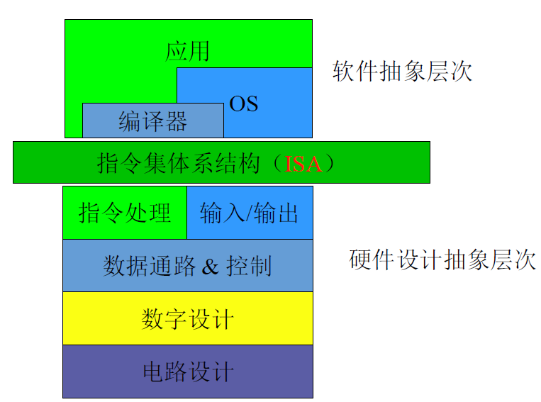
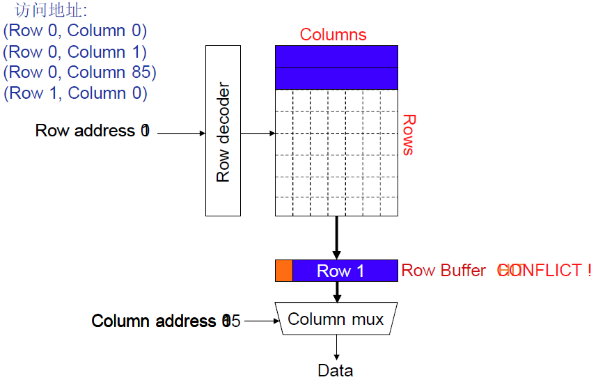

[TOC]

<!--more-->

## 1.1 计算机系统

计算机在不同用户严重的角色

- 从程序员角度：计算机提供多种计算模式：算数运算与逻辑运算
- 从硬件设计者角度：计算机是数字逻辑的组合

**在体系架构师/微机构是角度**：如何构建一台满足系统设计要求的计算机

- 汇编程序最终如何按照数组逻辑方式执行

### 1.1.1 计算机系统的层次结构

可进一步抽象为软件抽象层与硬件设计层

计算机体系结构研究的是ISA与微体系结构

分层系统产生了**抽象思想**：

- 上层只需要知道相邻下层的接口，不需要知道下层如何实现

通过抽象提高了效率：

- 抽象的同时伴随着封装，不需要考虑底层所做出的决策

理解计算机层次结构以及每个层次完成的工作可以：

- 理解处理器如何工作在软件层面之下
- 硬件的决策如何影响软件性能与程序员的开发

### 1.1.2 多核环境下性能下降

现代计算机体系结构的现状之一是：多核向着更多核转变。

理想状况下，核越多，计算机的性能应该越好。但实际情况并不是，多核环境下系统的性能会出现下降

假设有matlab和gcc的基准程序，分别对比其在单核和多核环境下的运行性能。

可该计算机系统抽象为

DRAM共享两个核Core1和Core2

- matlab想DRAM传输十分密集且miss L2-Cache很多，流式访问内存。
- gcc 很少请求内存中数据

故可知性能下降的原因会受**内存访问机制**的影响

对DRAM的操作进行抽象：内存由多个存储体bank组成，每个bank包含多个块block

通过 (片号,片内偏移) 唯一标识某个块，记为(row,column) 

当有访存请求时，先将地址号通过译码器得到row，将该row的所有块放入 Row Buffer中，将Column信号作为多选器的选择信号输入，可以得到目标block

**共性原则**：访存时，行不命中miss的访存时间远远大于行命中hit时的访存时间

**通常采用的两种策略** —— 最大化DRAM吞吐率

- 行缓冲命中优先：局部性原理
- 先来先服务

可知DRAM的调度策略是 `线程不公平` 的

- 行缓冲命中优先：导致对于具有 高行缓冲局部性的线程 优先
- 先来先服务：导致对于内存密集型线程 优先

 

多核环境下性能下降问题必须回归到ISA以及微体系结构层面才能解决

### 1.1.3 学习目标

- 理解处理器如何在软件层面之下工作
- 理解硬件层面的决策如何影响软件性能和程序员的开发
- 解决问题时的批判性思维
- 在不同层次间的全局性思维
- 理解在计算机系统设计时如何分析并且做出折衷(tradeoff)

## 1.2 计算机体系结构

> 通过硬件组件的设计、选择、互连以及软硬件接口的设计来创造计算机系统的科学，使得创造出来的计算机系统能够满足功能，性能，能耗，成本以及其他特定目标

对计算机体系结构的优化：

- 向下：利用底层技术的进步提供更好的系统，使计算机更快，更便宜，集成度更高，更可靠
- 向上：进而产生更新的应用，如：三维可视化，虚拟现实，个人基因组
- 对实际应用，解决因计算机性能不足而引起的问题

### 1.2.1 计算机体系结构的现状

- 多核-更多核的转变

驱动因素与约束：

- 功耗/能耗约束
- 设计的复杂性
- 技术扩展的困难
- 存储gap
- 可靠性issues
- 可编程性problem

### 1.2.2 计算机三要素

- 计算
- 存储(内存)
- 通信

### 1.2.3 两种计算机执行序

#### 控制流模型——冯·诺依曼模型

`存储程序计算机`

**存储程序**：指令存储在一个线性的存储阵列中；内存统一的存储指令和数据

- 根据控制信号实现对存储值的解释

  指令周期的不同其控制信号也不同

**指令顺序处理**：一次处理一条指令（取指，执行）；程序计数器表示当前指令；程序计数器按顺序推进，控制转移指令除外

对于控制流模型：指令的获取和执行按照控制流的顺序

- 由指令指针IR指定
- 顺序推进，除非遇到明确的控制转移指令

#### 数据流模型

对于数据流模型：指令的获取和执行按照数据流的顺序

- 指令的获取不需要指定，无指令指针
- 当操作数准备好时进行指令的获取与执行
- 指令的顺序依赖于数据流
  - 每条指令指定结果的接受者
  - 一条指令在获得所有操作数后即可执行

多条指令可并行执行

在数据流机中，程序由数据流结点构成

- 数据流结点在所有的输入都准备好时发射（取指和执
  行）

**如何选择计算机模型**

判断依据：指令的执行序

- 顺序执行——控制驱动
  - 需要PC：当PC指向该指令时被执行
    - PC按顺序修改，控制转移指令除外
- 并行执行——数据驱动
  - 当所有操作数就位，执行指令

不管采用哪种ISA，微体系结构可以按照任意的序来执行指令，只要按照ISA确定的语义将结果呈现即可。

- 在软件的一次执行过程中，程序员看到的是ISA确定的序

### 1.2.4 主流冯诺依曼模型与微体系结构

冯诺依曼结构：X86,ARM,MIPS,Alpha,POWER,SPARC

微体系结构

- 流水线执行：intel 80486
- 多指令并发：Pentium
- 乱序执行：Pentium Pro
- 指令和数据Cache分离

## 1.3 ISA与微体系结构

ISA：ISA是软件和硬件之间接口的一个完整定义，定义了一台计算机可以执行的所有指令的集合。规定的内容包括本地数据类型、指令格式、 寄存器 、地址模式、内存架构、中断和意外处理和外部 I/O 等。

- 程序如何以指令的形式执行
- 在一次程序运行中，指令运行的序是确定的
- ISA及其改变将影响编译器和程序员

微体系结构：ISA 在具体设计约束和目标之下的具体实现，任何在硬件层面没有暴露给软件的部分

- 汇编程序如何按照数字逻辑的方式执行
- 微体系结构可以按照任意的序执行指令，只要保证按照ISA确定的语义将指令呈现给软件即可
- 微体系结构本身及其各种改变对编译器和程序员是透明的（除了性能方面的影响）

计算机体系结构=ISA+微架构+电路

### 1.3.1 与ISA相关的概念

指令

- 操作码，寻址方式，数据类型
- 指令类型和格式
- 寄存器，状态码

存储（内存）

- 地址空间，寻址能力，对齐
- 虚存管理

调用，中断/异常

访问控制，优先级/特权

IO：内存映射&指令

任务/线程管理

功耗和温度管理

多线程支持，多处理器支持

### 1.3.2 与微体系结构相关的概念

- 流水线
- 指令按序或者乱序执行
- 访存调度策略
- 投机执行
- 超标量处理(多指令发射)
- 时钟门控
- 高速缓存：级数, 大小, 关联方式, 替换策略
- 预取
- 电压/频率调节
- 差错修正

### 1.3.3 与ISA和微体系结构都相关的属性

- 加法指令的操作码
- 通用寄存器的个数
- 寄存器堆的端口数
- 执行乘法指令需要几个周期
- 机器是否采用流水线指令执行

## 1.4 计算机体系结构的设计要点

> 由“问题”空间(应用)或者面向的用户/市场决定

关注：

- 成本
- 性能
- 最大功耗限制
- 能耗（电池寿命）
- 可用性
- 可靠性和正确性
- 上市时间