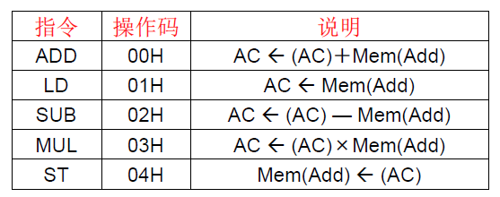

[TOC]

<!--more-->

## 2.1 指令执行过程

指令基本构成：操作码(opcode)+操作数(operand)


### 2.1.1 示例

字长2B，内存按字节编址。ISA采用定长指令，统一译码



计算 $Y=ax^2+bx-c$ ，其中a,b,c存放在内存中


PC自动累加，由于字长为2B，$PC\leftarrow PC+2$ 


### 2.1.2 指令周期设计到的内容


### 2.1.3 指令系统的演变


### 2.1.4 指令集中的位引导

> 位引导bit steering：指令中的某一位决定其他位的含义


## 2.2 ISA设计要素

### 2.2.1 指令的执行序

- 控制流
- 数据流

### 2.2.2 数据类型

> 定义操作数的编码方式

- 整型、浮点数、字符
- 二进制、十进制、十六进制、BCD

###  2.2.3 指令格式

- 更多的可执行操作
- 更大的操作数

#### 操作类型

**操作类指令**

- 数据处理：算数和逻辑操作
- 存取操作
- 隐式的顺序控制流

**数据移动类指令**

- 在内存、寄存器、IO设备间移动数据
- 隐式的顺序控制流

**控制类指令**

- 改变指令的执行顺序

#### 操作数个数

0,1,2,3地址的机器

0地址：栈

1地址：累加器

2地址：双操作数(其中一个操作数既是源又是目的)

3地址：源和目的分离

##### 栈机器(0地址)

优点：

- 指令短小(不带操作数)
- 高效的过程调用：所有参数都在栈中
  - 不需要额外的时钟周期做参数传递

缺点：

- 对计算模式有要求
  - 不能同时对多个值进行操作
  - 不灵活


##### 双地址

缺点：

- 其中一个源操作数会被指令的执行结果覆盖

#### 指令长度

##### 固定长度

> 所有指令的长度都一样

优点：

- 硬件对单条指令译码容易
- 同时对多条指令编译容易

缺点：

- 浪费指令中的某些位
- 不容易扩展

##### 可变长度

> 指令长度不同——由操作码和子操作码决定

优点：

- 紧凑的编码，节省空间

缺点：

- 译码逻辑复杂
- 同时对多条指令译码很难

##### 权衡

- 代码尺寸（内存空间，带宽，时延）&硬件复杂性
- ISA的扩展性

### 2.2.4 统一译码

#### 统一译码

> 每条指令的相同位代表的意思相同

操作码、操作数说明符、立即数等总是在相同的位置

- 大多数RISC ISA采用：Alpha，MIPS，SPARC

优点：

- 更容易译码
- 支持并行

缺点：

- 严格的指令格式，浪费空间

#### 非统一译码

X86

优点：

- 更紧凑也更强大的指令格式

缺点：

- 更复杂的译码逻辑


#### 长度与统一

统一译码常伴随着固定长度

对于可变长ISA，相同长度的指令也可以进行统一译码

### 2.2.5 寻址方式

形式地址：指令中直接给出的地址编码

有效地址：根据形式地址与寻址方式计算出的操作数在内存单元中的地址

寻址方式：根据形式地址计算到操作数的有效地址的方式(算法)

- 直接寻址：立即数作为有效地址
- 寄存器间接寻址：用寄存器中的值作为有效地址
- 基址寻址：用基址寄存器加形式地址作为有效地址
  - 用于程序浮动
- 变址寻址：用变址寄存器加形式地址作为有效地址
  - 用于数组访问
- 内存间接寻址：寄存器中的值指向的内存单元中的值作为有效地址
- 自增/自减寻址：每次将该寄存器值增加或减少一个量

---

采用不同的寻址方式：

优点：

- 具有更好的向高层映射的能力，能有效减少指令数量和代码尺寸

  数组的随机访问：

  - 自增模式
  - 间接寻址：指针相关的jiegou

缺点：

- 编译器，微体系结构会变得复杂

---

正交的ISA：所有的寻址方式对所有指令都有效

### 2.2.6 寄存器个数

寄存器减少访存次数的理论依据：数据局部性原理

- 最近产生或者访问的值可能会被多次使用(时间局部性)

#### 寄存器结构的演进

累加器

累加器+地址寄存器

- 寄存器间接寻址：使用地址寄存器的值作为内存地址值(只可加载一个地址)
- 支持地址运算

通用寄存器堆(GPR)

#### 寄存器个数影响

在寄存器堆中保存的值的个数

用于译码的寄存器的位数

影响寄存器的大小、访问时间、功耗

#### 较多寄存器个数优缺

优点：

- 编译器可以更好的分配和优化寄存器；
- 更少的访存操作

缺点：

- 更大的指令尺寸
- 更大的寄存器堆

### 2.2.7 内存架构

#### 访存方式

##### Load/Store架构

操作类指令只操作寄存器

- 大多数RISC：MIPS，ARM

##### Memory架构

操作类指令可以操作内存

- 大多数CISC：X86

#### 对齐访问

> 按变量的内存地址值是否为其大小的整数倍分为对齐访问和非对齐访问

机器字长4B，内存按字节编址

- 字大小的对齐访问：地址可为0x0000,0x0004,...,0x1004
- 半字大小的对齐访问：地址可为0x0000,0x0002,...,0x1002,0x1004


**对齐访问**

提高了存取速度

- 现代计算机都是用了Cache，每个Cache块包含以字节对齐的一段内存副本。如果采用非对齐访问，在一次访存中，可能会涉及两个Cache块，从而降低程序速度

**非对齐访问**

节省存储空间

---

**C中的字节对齐**

三个原则：

- 结构体的起始地址能被机器字长整除  
- 每个数据成员的起始地址能被该成员的字节数整除，若不够则在前一个数据成员前补空白字节
- 结构体的总大小是结构体最大成员体的整数倍，不够则在最后补

```cpp
struct Mystruct1{
   int a;
   bool b; 
   bool c;
};
```

a相对于结构体的起始地址，偏移量为0，int占4字节，可以被4整除

b,c分别栈一字节

所以这个结构体实际占用4+1+1=6字节，但要填充为8字节(设机器字长为4B)

```cpp
struct Mystruct1{
   bool a;
   int  b;
   bool c;
};
```

a相对于结构体的起始地址，偏移量为0，bool占1字节，可以被1整除

b占4字节，起始地址的偏移量应该为4，所以a需要补足3字节

c占1字节，存入偏移量为8的内存地址

故实际占用4+4+1=9字节

但需要补足为4的倍数，总的空间为12B

#### 内存的组织

##### 地址空间

> 内存中有多少可以唯一标识的位置

##### 寻址能力

> 每个可唯一标识的位置能存多少bit数据

- 位寻址
- 字节寻址
- 4B寻址
- 8B寻址

###### 操作数存储方式——大小端

大端模式：高字节(MSB最高有效位)低地址

小端模式：低字节(LSB)低地址

如：

`a=0x12345678` （MSB-LSB）


##### 对虚存的支持

### 2.2.8 与IO设备的接口

#### 内存映射IO

内存的一个区域映射到IO设备

通过对这一内存区域的存取完成IO操作

#### 特殊的IO指令

X86有专用的IN和OUT指令来处理IO

### 2.2.9 特权模式

- 用户
- 超级管理员

分别可执行哪些指令

### 2.2.10 异常和中断

- 当一条指令出现问题后发生什么——异常
- 当一个外部设备请求CPU发生什么——中断

### 2.2.11 指令的复杂性

#### 复杂指令

> 一条指令可以完成很多操作

- 插入一个双向链表
- 串的复制

优点：

- 编码密度大，代码尺寸小，更好的内存利用率，节省片外带宽，更好的Cache命中率
- 更简单的编译器

缺点：

- 更大的功能块，编译器优化余地小
- 更复杂的硬件
  - 从高层到底层控制信号和优化的转换需要硬件完成

#### 简单指令

> 一条指令只完成很少的工作，可以用来构建复杂操作的原语

- XOR
- ADD

与复杂指令优缺互换

### 2.2.12 ISA位置限制——语义鸿沟

- ISA靠近高级语言：语义鸿沟小，指令复杂——CISC
- ISA靠近低级语言：语义鸿沟大，指令简单——RISC

语义鸿沟的极限

- 极大的语义鸿沟
  - 数据类型少
  - 每条指令指令一整套的控制信号
  - 编译器生成控制信号
  - 编译器优化余地大
- 极小的语义鸿沟
  - 数据类型多
  - ISA几乎就是高级语言

#### 语义相关权衡——RISC&CISC

CISC：复杂指令集计算机(Complex Instruction Set Computer)

RISC：精简指令集计算机(Reduced Instruction Set Computer)

| CISC       | RISC       |
| ---------- | ---------- |
| 指令复杂   | 指令简单   |
| 可变长度   | 固定长度   |
| 非统一译码 | 统一译码   |
| 寻址方式多 | 寻址方式少 |

##### RISC

**RISC产生动机**：

- 存储器停顿
- 简化硬件，更低的成本，更高的使用频率
- 编译器可以更好的优化代码

**RISC基本设计目的**：减少CPI，进而减少CPU时间
$$
\begin{aligned}
&一类指令CPU时间=每条指令执行次数\times CPI\times 时钟周期时间\\
&CPU时间=\frac{(IC\times CPI)}{时钟频率}
\end{aligned}
$$
**RISC设计基本思想**

- 保留最常用的指令，去除复杂的，使用频率不高的指令
- 采用Load/Store架构：统一内存访问方式，减少指令格式
- 采用硬布线控制代替微程序控制

**RISC特点**

- CPI接近1
- Load/Store架构
- 寻址方式少，指令格式少且规整，指令长度统一，可统一译码
- 编译优化余地大
- 硬布线控制器

#### ISA转换

目前的ISA几乎已经可以反映所有系统需要关注的特性

通过ISA转换（在硬件和软件层面上），使得不管哪种ISA设计都可以采用类似的底层实现，进而改变语义鸿沟的折衷

- Intel 和AMD 的x86 实现在硬件层面将x86指令转换成程序员不可见的微操作(简单的指令)
- Transmeta的x86 实现在软件层面将x86 指令转换成VLIW 指令(代码变形软件)


