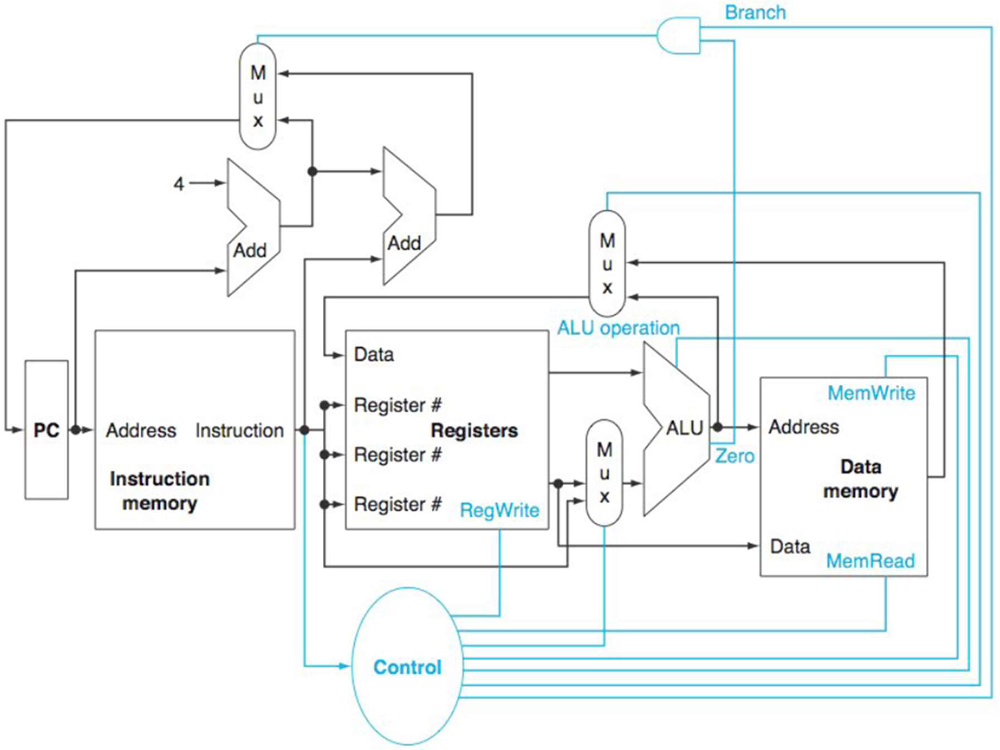
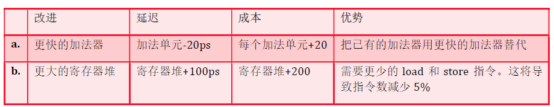

# 二、单周期vs多周期微体系结构

## 1. MIPS单周期微体系结构分析

### 1.1 不同单元有不同的延迟时间。在图1 中有七种主要单元。对一条指令而言，关键路径(产生最长延迟的那条路径)上各个单元的延迟时间决定了该指令的最小延迟。假设个单元的延迟时间如下表所示，回答下列3个问题



#### (a) 对一条MIPS的指令 `AND` 而言，关键路径是什么

```
And 
	R[rd]=R[rs]&R[rt]
```

关键路径是：
$$
指令存储器\rightarrow 寄存器堆\rightarrow MUX\rightarrow ALU\rightarrow MUX\rightarrow 寄存器堆
$$

#### (b) 对一条MIPS 的装载指令(LW)而言，关键路径是什么？

```
LW 
	R[rt] = M[R[rs]+signExtImm]
```

关键路径是：
$$
指令存储器\rightarrow 寄存器堆\rightarrow MUX\rightarrow ALU\rightarrow 数据存储器\rightarrow MUX\rightarrow 寄存器堆
$$

#### (c) 对一条MIPS 的相等则分支指令(BEQ)而言，关键路径是什么？

```
BEQ
	if(R[rs]==R[rt])
		PC = PC+4+BranchAddr
```

关键路径是：
$$
\begin{aligned}
指令存储器\rightarrow 寄存器堆\rightarrow MUX\rightarrow ALU\rightarrow\rightarrow MUX\rightarrow PC
\end{aligned}
$$

### 1.2 图1 中基本的单周期MIPS 实现仅能实现某些指令。可以在这个指令集中加入新的指令，但决定是否加入取决于给处理器的数据通路和数据通路增加的复杂度。对于下表中的新指令而言，试回答下列3 个问题

```
add3 Rd,Rs,Rt,Rx
	Reg[Rd]=Reg[Rs]+Reg[Rt]+Reg[Rx]
```

#### (a) 对上述指令而言，哪些已有的单元还可以被使用？

```
指令存储器、寄存器堆、MUX、ALU
```

#### (b) 对上述指令而言，还需要增加哪些功能单元？

```
寄存器堆增加一个寄存器 Rx 及其读写，加法器(或ALU)
```

#### (c) 为了支持这些指令，需要在控制单元增加哪些信号？

```
控制MUX选择新增加法器的输出到 Rd
```

#### 当设计者考虑改进处理器数据通路时，往往要考虑性能与成本的折中。假设我们从图1 的数据通路出发，试根据表中的改进分别回答下列问题

|      | 指令存储器 | 加法器 | 多选器 | ALU   | 寄存器堆 | 数据存储器 | 控制单元 |
| ---- | ---------- | ------ | ------ | ----- | -------- | ---------- | -------- |
| 延迟 | 400ps      | 100ps  | 30ps   | 120ps | 200ps    | 350ps      | 100ps    |
| 成本 | 1000       | 30     | 10     | 100   | 200      | 2000       | 500      |



#### (d) 改进前后的时钟周期分别是多少？

**改进前：**
`BEQ指令`
$$
\begin{aligned}
&指令存储器\rightarrow 寄存器堆\rightarrow MUX\rightarrow ALU\rightarrow 加法器\rightarrow 加法器\rightarrow MUX\rightarrow PC\\
&时长：400+200+30+120+30ps=780ps
\end{aligned}
$$
`lw指令` 
$$
\begin{aligned}
&指令存储器\rightarrow 寄存器堆\rightarrow MUX\rightarrow ALU\rightarrow 数据存储器\rightarrow MUX\rightarrow 寄存器堆\\
&时长：400+200+30+120+350+30+200ps=1330ps
\end{aligned}
$$
`sw指令`
$$
\begin{aligned}
&指令存储器\rightarrow 寄存器堆\rightarrow MUX\rightarrow ALU\rightarrow 数据存储器\\
&时长：400+200+30+120+350ps=1100ps
\end{aligned}
$$
指令周期最长的是 `lw指令` ，故时钟周期应为 **1330ps** ，

a 改进：由于 `lw 指令` 不涉及加法器，所以时钟周期无变化为 **1330ps**

b改进：$$1330ps+100\times 2ps=1530ps$$
#### (e) 改进后将获得多大的加速比？

a改进：$1$

b改进：$\frac{1330ps}{95\%\times 1530ps}\times 100\%\approx 91.5\%$

#### (f) 比较改进前后的性能/价格比，进行这样的改进是否有意义？

原价格：$1000+200+500+100+2000+30\times 2+10\times 3=3890$
$$
\frac{加速比}{价格比}
$$
a改进： 不经过加法器，所以加速比为1

b改进：$\frac{b加速比}{b价格比}=\frac{0.915}{\frac{(3890+200)}{3890}}=0.871$

a 改进在性能上无变化，增加了成本但保持相同性能，没有意义

b 改进降低了性能，且增加了成本，无改进意义

### 1.3 本题讨论数据通路中不同的单元延迟对整个数据通路时钟周期的影响，以及指令如何利用不同的数据通路单元。根据下面的两种延迟情况，分别回答下列问题

| 指令存储器 | 加法器 | 多选器 | ALU   | 寄存器堆 | 数据存储器 | 符号扩展 | 左移两位 |
| ---------- | ------ | ------ | ----- | -------- | ---------- | -------- | -------- |
| 500ps      | 150ps  | 100ps  | 180ps | 220ps    | 1000ps     | 90ps     | 20ps     |

#### (a) 如果仅需支持ALU 类指令(如add、and 等)，处理器的时钟周期是多少？

数据通路为：$$指令存储器\rightarrow寄存器堆\rightarrow MUX\rightarrow ALU\rightarrow MUX\rightarrow 寄存器堆$$
时钟周期为：$500+220+100+180+100+220ps=1320ps$

#### (b) 如果仅需支持lw 类指令，时钟周期是多少？

`sw` 数据通路： $指令存储器\rightarrow 寄存器堆\rightarrow MUX\rightarrow ALU\rightarrow数据存储器$

`lw` 数据通路为：$指令存储器\rightarrow 寄存器堆\rightarrow MUX\rightarrow ALU\rightarrow 数据存储器\rightarrow MUX\rightarrow 寄存器堆$

时钟周期为：$500+220+100+180+1000+100+220ps=2320ps$ 

#### (c) 如果必须支持add、beq、lw 和sw 指令，时钟周期是多少？

`beq` 数据通路：$指令存储器\rightarrow 寄存器堆\rightarrow MUX\rightarrow ALU\rightarrow 加法器\rightarrow 加法器\rightarrow MUX\rightarrow PC$

`beq`指令周期为 $500+220+100+180+150\times 2+100ps=1400ps$ 

`lw指令` 是指令周期最长的，故时钟周期为 **2320ps** 

### 假设各类型指令所占比例如下表所示，试根据下表的情况分别回答下列问题

| add  | addi | not  | beq  | lw   | sw   |
| ---- | ---- | ---- | ---- | ---- | ---- |
| 30%  | 15%  | 5%   | 20%  | 20%  | 10%  |

#### (d) 数据存储器平均用了多少时钟周期？

`lw指令` 与 `sw指令` 共占用 $20\%+10\%=30\%$  

#### (e) 符号扩展电路的输入平均用了多少时钟周期？在未用到该输入的其他时间，符号扩展电路在做什么？

符号扩展涉及 `addi` ,`beq` ,`lw` , `sw` 

$15\%+20\%+20\%+10\%=65\%$

符号扩展电路一直有信号，但它的输出在 `add` 与 `not` 指令中被忽略

#### (f) 如果可以将数据通路上某个单元的延迟减少10%，应该减少哪个单元的延迟？改进后整个处理器的加速比是多少？

指令周期最长的指令为 `lw` ，故而时钟周期为 $2320ps$ 

其中数据存储器延迟最大，故应将数据存储器延迟减少 $10\%$

改进后加速比 $\frac{2320}{2320-1000\times 10\%}=1.05$

### 1.4 本题讨论处理器时钟周期与控制单元设计之间的相互影响。根据下表的数据通路单元延迟情况分别回答下列问题

| 指令存储器 | 加法器 | 多选器 | ALU   | 寄存器堆 | 数据存储器 | 符号扩展 | 左移两位 | ALU控制 |
| ---------- | ------ | ------ | ----- | -------- | ---------- | -------- | -------- | ------- |
| 500ps      | 150ps  | 100ps  | 180ps | 220ps    | 1000ps     | 90ps     | 20ps     | 55ps    |


#### (a) 为了避免增加图4 中数据通路的关键路径长度，留给控制单元产生MemWrite 信号的时间有多少？

所有指令的关键路径 `lw指令` 的关键路径，
$$
指令存储器\rightarrow MUX\rightarrow 寄存器堆\rightarrow MUX\rightarrow ALU\rightarrow数据存储器\rightarrow MUX\rightarrow 寄存器堆
$$
时钟周期是 $500+220+100+180+1000+100+220=2320ps$

`MemWrite` 信号需要在访问数据存储器前产生，除去取指的 $500ps$ 与 数据寄存器存数 $1000ps$，即 $2320-500-1000ps=820ps$ 

#### (b) 图4 中哪个控制信号最不关键，控制单元需要在多长时间内产生该信号以避免其成为关键路径？

所有的指令都需要先取指再分析需要哪个控制信号，且访问指令存储器时间为 $500ps$ ，故最多有 $2320-500ps=1820ps$ 产生相应的控制信号。

时钟周期结尾，才需要 `RegDst` 写回信号，所以有 $1820-100-220ps=1500ps$ 产生控制信号
同理，
`Jump` 只作用在一个MUX上：$1820-100ps=1720ps$ 
`Branch` 作用在一个MUX上，但后续还通过一个MUX：$1820-100-100ps=1620ps$
`MemRead` 时钟周期结束前需要从数据存储器取数($1000ps$) ，通过一个MUX($100ps$)，将数据存入寄存器堆($220ps$)：$1820-1000-100-220ps=520ps$
`MemToReg` ：$1820-100-220ps=1500ps$
`ALUOp` ：$1820-55-180-1000-100-220ps=265ps$
`ALUSrc` ：$1820-100-180-1000-100-220ps=220ps$
`RegWrite` ：$1820-220ps=1600ps$ 

分析可见， `Jump` 指令最不关键，需要在 $1720ps$ 产生该信号即可避免成为关键路径

#### (c) 图4中哪个控制信号最关键，控制单元需要在多长时间内产生该信号以避免其成为关键路径？
 
`ALUSrc` 最关键，需要在 `220ps` 内产生才能避免成为关键路径

#### 假设控制单元产生控制信号的时间如下表所示，试根据表中的情况回答下列问题(各部件的延迟与前面相同)。

| 指令存储器 | 加法器 | 多选器 | ALU   | 寄存器堆 | 数据存储器 | 符号扩展 | 左移两位 | ALU控制 |
| ---------- | ------ | ------ | ----- | -------- | ---------- | -------- | -------- | ------- |
| 500ps      | 150ps  | 100ps  | 180ps | 220ps    | 1000ps     | 90ps     | 20ps     | 55ps    |

| RegDst | Jump   | Branch | MemRead | MemtoReg | ALUOp | MemWrite | ALUSrc | RegWrite |
| ------ | ------ | ------ | ------- | -------- | ----- | -------- | ------ | -------- |
| 1600ps | 1600ps | 1400ps | 500ps   | 1400ps   | 400ps | 1500ps   | 400ps  | 1700ps   |

#### (d) 处理器的时钟周期为多少？

分析 `lw` 指令：已知 `lw` 的指令周期为 $2320ps$ 。
- 取指令后，分别送达控制单元和寄存器堆，到需要用到 `ALUSrc` 控制信号时耗费 $220ps$ ，而控制单元产生 `ALUSrc` 控制信号需要 $400ps$ ，故由于产生 $ALUSrc$ 信号会比之前分析慢 $180ps$ 。
- 需要用到`ALUOp` 指令时刻为 $400+100ps=500ps$ ，但控制信号到达 `ALU` 需要 $400+55ps=455ps$ ，故不会有延迟；
- 产生 `MemRead` 控制信号需要 $500ps$ ，到达数据存储器之前已经消耗 $500+180ps=680ps$ ，不会有延迟
- 产生 `MemtoReg` 需要 $1400ps$ ，到达MUX之前有 $680+1000ps=1680ps$ ，不会有延迟；
- 需要 `RegWrite` 信号为 `1780ps` 时刻， 产生该信号需要 $1700ps$ ，故不会有延迟。
故 `lw` 指令周期为 2320+180ps=2500ps 。

分析 `sw` 指令：在时钟周期为 `2320ps` 前提下。
- 取指令后，分别送达控制单元和寄存器堆，到需要用到 `ALUSrc` 控制信号用时 $220ps$ ，而控制单元产生 `ALUSrc` 信号需要 $400ps$ ，所以会产生 $180ps$ 延迟；
- 需要用到 $ALUOp$ 信号的时刻为 $500ps$ ，$ALUOp$ 作用到 ALU 需要 $400+55ps=455ps$ ，故不会产生延迟；
- 需要用到 `MemWrite` 信号为 $500+180ps=680ps$ ，产生该信号需要 $1500ps$ ，但等待 $1500-680ps=820ps$ 再加上数据存储器消耗的时间 $1000ps$ ，共计 $1500+1000ps=2500ps$ ，与上述 `lw` 指令周期相等

综上，时钟周期为 $2500ps$ 

#### (e) 如果你可以加速控制信号的产生，但加快一个控制信号 5ps 的代价是处理器成本增加 1 元。那么为了最大化性能你会加速哪些控制信号?这种性能改进的最小代价是多少?

最大化性能是指某一部件处理完数据的时刻，下一部件所需的控制信号已经产生。
即不管怎么加速控制信号的产生，时钟周期不会低于  $2320ps$ 

上述由于控制信号产生的延迟，时钟周期变为 $2500ps$ ，所以可通过加速控制信号产生而优化性能的时间为 $2500-2320ps=180ps$ ，故最小代价为 $\frac{180ps}{5ps}\times 1元=36元$ 。

由题 (d) 分析可知，加速 `ALUSrc` 控制信号即可

#### (f) 如果一个处理器的成本已经很高，那么我们需要在维持处理器性能的同时降低其成本，而不是像第(e)问中所作的那样为提高它的性能而买单。如果你可以使用更慢的逻辑来实现对信号的控制， 并且单个控制信号每减慢 5ps，处理其成本就可以节省 1 元，那么在保持处理器性能的同时，你会减慢哪些控制信号，并且减慢多少来降低成本?

此时是时钟周期为 $2500ps$ ，结合题1.4(c)，只需计算产生控制信号的最长时间与实际产生该控制信号的时间的差值，可知该控制信号可减慢多长时间。

控制信号的可减慢时长

- `RegDst` ： $1500+180-1600ps=80ps$
- `Jump` ：$1720+180-1600ps=300ps$
- `Branch` ：$1620+180-1400ps=400ps$
- `MemRead` ：$520+180-500ps=200ps$
- `MemtoReg` ：$1500+180-1400ps=280ps$ 
- `RegWrite` ：$1600+180-1700ps=80ps$

故 成本可减少 $\frac{80+300+400+200+280+80}{5ps}\times 1元=\frac{1340}{5}元=268元$

## 2. MIPS 多周期微体系结构分析

### 2.1 假设在多周期 MIPS 处理器的下列控制信号中存在固定为 0 缺陷，那么哪些指令将会失效?为什么?(数据通路参考图 5，其中不包含 j 指令;图 5 中控制器的内部结构如图 6 ) 12 分

#### (a) MemtoReg 

`lw` 指令失效，因为 `MemtoReg` 控制是 ALU 运算结果写回存储器或者数据存储器写到寄存器。当固定为0缺陷时，多选器只选择ALU结果写回

#### (b) ALUOp0 

部分指令失效

`ALUOp` 共两位，第0位失效，固为0，则原本需要 `ALUOp` 为01 ,11 的指令失效，即 `ALU控制器` 的部分失效，ALU在部分情况下无法进行正确操作。

#### (c) PCSrc

部分跳转指令失效，因为只能获取前一周期的ALU结果
例如 `BEQ` ，3个周期需要用3次ALU，
1. PC+4
2. PC+4+Imm
3. rs比rt要等3结束才能选择是否要把暂存的 `2.PC+4+Imm` 写回PC
而 `PCSrc` 固0，使得无法跳转到 `PC+4+Imm`

### 2.2 在多周期 MIPS 处理器上运行下面的程序需要多少个周期?这个程序的 CPI 是多少? 4 分

```
	addi $s0,$0,5 #sum=5  
while:
	beq $s0, $0, done # if result > 0, execute the while block  ### 4个周期
	addi $s0, $s0, -1 # while block: result = result - 1       ### 3个周期
	j while                                                    ### 3个周期
done:
```

故周期数为 $4+5\times(4+3+3)+3=57$ 个时钟周期

CPI ：$\frac{57}{(1+15+1)}=3.353$
