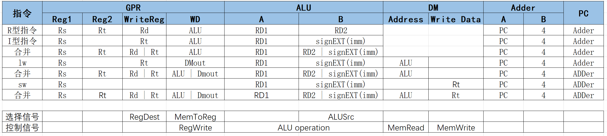
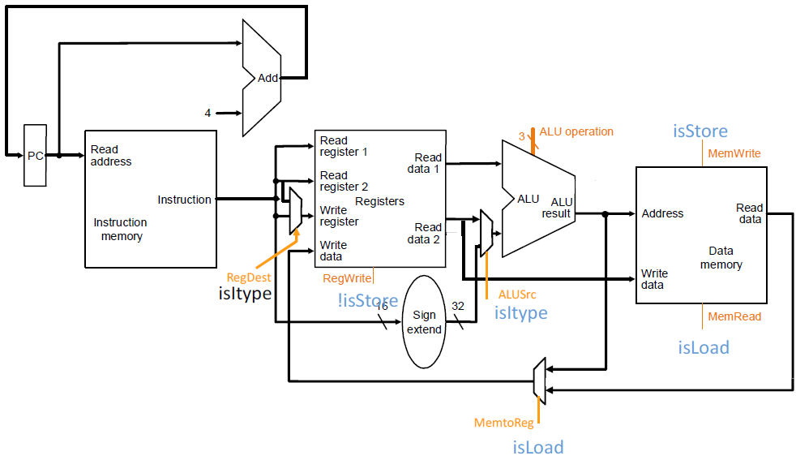
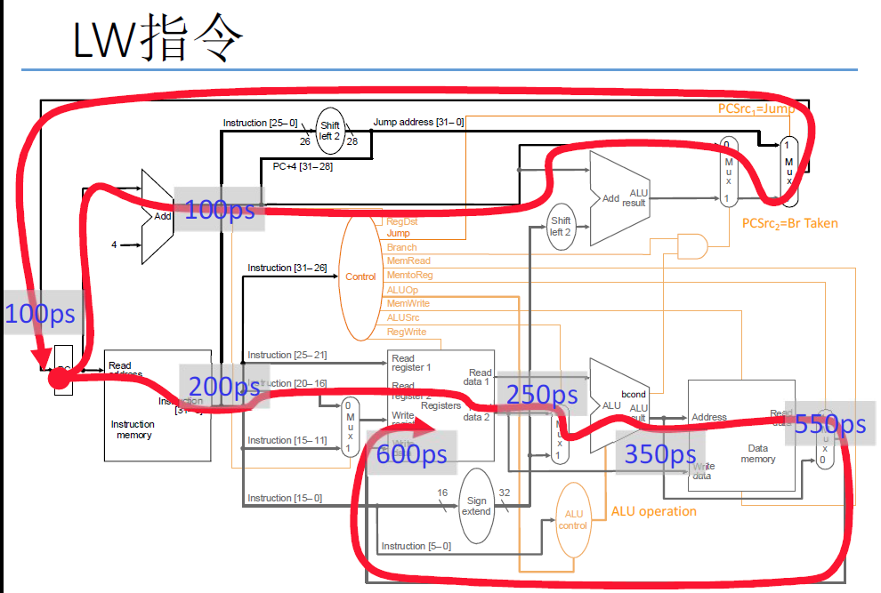

[TOC]

<!--more-->

## 3.1 机器如何处理指令

### 3.1.1 有限状态机角度

#### 体系结构状态可见性

##### 程序员可见状态

内存：用地址索引到存储位置

寄存器：在ISA中会给寄存器命名

- 分为通用寄存器和专用寄存器

程序计数器PC：表示当前指令的内存地址

---

指令(程序)指定如何转换程序员可见的状态值

##### 程序员不可见状态

微体系结构的状态

- Cache状态
- 流水线寄存器

#### 有限状态机处理指令的步骤

ISA **抽象**地说明给定一条指令和一个状态A，完成状态转换后的状态A'应该是什么

- 在ISA层面上看，指令处理过程中A和A'之间没有 中间状态
- 一条指令对应一个状态转换

**微体系结构** 实现A到A'的转换有多种思路

- $A\rightarrow A'$ : 在一个时钟周期内完成状态转换，没有中间状态
- $A\rightarrow A+MS1\rightarrow A+MS2\rightarrow A'$ : 使用多个时钟周期完成A到A'的状态转换

#### 单周期机器与多周期机器

##### 单周期机器

每条指令用一个时钟周期执行——CPI为1

组合逻辑实现指令的执行

- 由当前输入决定输出，没有程序员不可见的状态更新

所有状态更新在指令执行结束时刻完成

**最慢的指令决定时钟周期的长度** ，时钟周期时间长 (Clock Cycle Time,CCT)

##### 多周期机器

指令处理分为多个阶段完成——CPI大于1，每条指令CPI不同

时序逻辑实现指令的执行

指令执行过程中会更新状态

体系结构的状态更新只能在指令执行完成时刻完成

**最慢的阶段决定时钟周期长度** ，CCT短

#### 指令周期&机器时钟周期

指令周期：指令处理的步骤序列

- 指令在控制单元的指示下一步一步地处理

- 大致分为六个阶段：取指IF，译码ID，寻址，取数DF，执行EX，写回WB

单(时钟)周期机器：指令周期的所有阶段都在一个机器时钟周期中完成

多(时钟)周期机器：指令周期的每个阶段都可以在多个机器时钟周期中完成

### 3.1.2 控制与数据角度

指令将数据AS转换成数据AS'

**数据通路** ：由处理和转换数据信号的硬件部件组成

- 功能单元：操作数据
- 存储单元：存储数据
- 数据流相关硬件结构：使数据流能流入功能单元和存储单元的硬件结构（如：连线和多选器）

**控制逻辑** ：由决定控制信号的硬件部件组成

- 控制信号决定了数据通路上的部件如何操作数据

#### 单周期&多周期

**单周期机器**

- 数据操作的同时产生控制信号

**多周期机器**

- 下一周期需要的控制信号可以在前一周期产生
- 数据通路上的延迟可以和控制处理的延迟重叠

#### 设计方法

数据通路和控制逻辑的设计方法很多

- 单周期，多周期，流水线
- 单总线，多总线
- 硬布线逻辑/组合逻辑——微码/微程序
  - 硬布线逻辑：由组合逻辑电路产生控制信号
  - 微程序：在存储器结构中存储控制信号

### 3.1.3 初步性能分析

$指令执行时间=CPI\times CCT$ 

$程序执行时间=\sum (CPI_i\times CCT)=指令数\times 平均CPI\times CCT$

##  3.2 单周期微体系结构

### 3.2.1 MIPS简介

MIPS典型特点：

- 32位固定长度指令
- 32个32位GPR
- 算数指令：3地址，寄存器-寄存器
- 寻址模式简单
  - Load/Store访存
  - 基址寻址
  - 无间接寻址
- 直接跳转和条件跳转

#### 理想化的内存和寄存器堆

组合读：Address端口提供读内存/寄存器堆地址，ReadDate端口输出指定地址中的数据

同步写：被选中的存储器在时钟信号的上升沿更新

#### 指令处理

五个阶段：

- IF：取指令
- ID/RF：指令译码、取寄存器操作数
- EX/AG：执行、生成内存地址
- MEM：取数
- WB：写回结果

### 3.2.2 单周期数据通路

#### R型指令

- 控制信号：ALU操作信号，寄存器写RegWrite信号

#### I型指令

#### 数据移动类指令

##### Load

##### Store

#### 控制流指令

##### J型指令——无条件跳转

- 末尾补2个0

##### 条件分支指令

#### 数据通路整合

### 3.2.3 控制逻辑

| 选择信号 | 无效=0                              | 有效=1                               | 判断条件                                                     | 指令类型    |
| -------- | ----------------------------------- | ------------------------------------ | ------------------------------------------------------------ | ----------- |
| RegDest  | Rt作为写入地址,inst[20:16]          | Rd作为写入地址,inst[15:11]           | opcode==0                                                    | R \| I      |
| ALUSrc   | ALU的第二个输入来自GPR的RD2         | ALU的第二个输入来自立即数扩展        | $(opcode\neq 0)\&\&\\(opcode\neq BEQ)\&\&\\(opcode\neq BNE)$ | R \| I      |
| MemToReg | ALU的输出结果写入GPR的WriteData端口 | 内存的ReadData写入GPR的WriteData端口 | opcode==lw                                                   | R I \| LW   |
| PCSrc2   | PC=PC+4                             | $PC=PC+4+\\signEXT(imm)<<2$          | opcode=BXX                                                   | I型跳转指令 |
| PCSrc1   | 由PCSrc2决定                        | $PC=\\\{PC[32:28],imm[25:0],0\}$     | opcode==J                                                    | J型跳转指令 |

| 使能信号 | 无效=0     | 有效=1             | 判断条件                                                     | 指令类型 |
| -------- | ---------- | ------------------ | ------------------------------------------------------------ | -------- |
| RegWrite | GPR写无效  | GPR写有效          | $(opcode\neq sw)\&\&\\(opcode\neq BXX)\&\&\\(opcode\neq JXX)\&\&\\$ | R\|I     |
| MemRead  | 内存读无效 | 内存读端口返回lw值 | opcode==lw                                                   |          |
| MemWrite | 内存写无效 | 内存写使能         | opcode==sw                                                   |          |

**ALU控制信号**

opcode==0：按照指令的funct字段决定执行的操作

opcode==ALUI：按照指令的opcode字段决定执行的操作

opcode==LW：加法

opcode==SW：加法

opcode==BXX：由bcond决定

其他：不用考虑

#### 控制逻辑的设计

组合逻辑——硬布线控制器

- 基于指令用组合逻辑生成控制信号

时序逻辑——时序/微程序控制器

- 用一个存储结构保存指令的控制信号

### 3.2.4 性能分析

每条指令占用一个时钟周期——CPI=1

微体系结构中的时钟周期长度由完成最慢的指令所需要的时间决定

- 关键路径

#### 关键路径

PC变化与指令执行阶段是并行的

#### 单周期缺点

低效

- 所有指令执行和最慢的指令一样慢
- 必须为所有指令提供最坏情况下的资源
  - 对于一条指令执行周期中不同阶段访问同一资源，必须为其提供该资源的副本

- 不一定是实现ISA的最简单方法
- 不容易优化/提升性能

#### 单周期设计原则

关键路径设计：找到时延最大的组合逻辑，尽量减少它的时延
基本设计：

- 在重要的地方花时间和资源

平衡设计

- 平衡流过硬件部件的指令/数据流
- 平衡完成工作需要的硬件

## 3.3 多周期微体系结构

### 3.3.1 设计思路

目标：使每条指令执行只花费它必须花费的时间

思路：

- 时钟周期的确定独立于指令处理时间
- 一条指令的执行有多个状态转换

#### 多周期设计的好处

关键路径设计：可以独立地针对每条指令的最糟糕情况优化关键路径

基本设计：通过优化占用大量执行时间的指令所需的状态数达到需要的设计目标

平衡设计：不需要提供比实际需求更多的资源或能力

- 一条指令多次使用同一个资源不代表需要多个资源
- 使硬件更高效，一条指令可以多次重用硬件部件

#### 性能角度分析原理

$CPU时间=\sum CPI_i\times CCT=IC\times CPI\times CCT$

CPI：平均指令时钟周期

CCT：时钟周期时间

对于一条指令，减少一个的会增加另一个

**多周期机器的原理：通过并发处理使平均CPI减少(被平摊)**

#### 有限状态机角度

整个处理器的行为被定义为一个有限状态机：将指令执行周期划分为多个状态，每个阶段都可以有多个状态，状态机最终回到“取指令”状态

多周期微体系结构通过状态到状态的序列处理指令

- 当前状态下机器的行为由控制该状态下的信号决定
- 下一状态的控制信号由当前状态决定

#### 微程序控制器

微指令：与当前状态相关的控制信号序列

微序列：决定下一状态及下一状态的微指令

---

控制存储：为每个状态存储相应的控制信号

微序列控制器：决定下一个状态(下一时钟周期)将会用到的控制信号序列(微指令)

##### 微程序控制优点

可以把任何程序序列化为微程序序列

- 程序=指令序列，指令=微程序，微程序=微指令序列

通过微程序控制，可以用非常简单的数据通路实现强有力的计算

使得ISA易于扩展，升级/打补丁

##### 微程序设计

设计者需要提供

- 实现目标操作所需的微指令序列
- 其他必须附加的数据通路控制信号
- 具有正确驱动微指令序列的控制逻辑

#### 单总线数据通路

> 任何时候只能有一个数值被放到总线上

优点：只有一条总线，硬件成本低

缺点：降低了并发性

- 如果同一指令因不同事用总线两次，需要在不同的状态中完成

### 3.3.2 一个时钟周期的工作

数据通路和微序列控制器并发操作

- 当前状态的微指令控制数据在数据通路中推进
- 微序列器为下一状态生成微指令

若在当前周期生成当前所需的控制信号，会使得时钟周期延长

