[TOC]

<!--more-->

## 4.1 多周期到流水线

### 4.1.1 多周期机器的局限性

**有限的并发** ：在指令处理周期的不同阶段一些资源会被闲置

- 指令的译码或者执行阶段，取指逻辑会被闲置

- 当发生访存时，绝大多数数据通路会被闲置

### 4.1.2 流水线基本思想

目标：改善多周期机器的并发，提高吞吐量(一个周期内完成更多的工作)

- $吞吐量BW=\frac{1}{CPI}$

思路：当一条指令在他的处理阶段使用某些资源的同时，使用该指令不需要的闲置资源完成其他指令

实现前提：

- 指令处理周期切分为多个不同的处理阶段
- 保证每个阶段有足够的硬件资源处理指令
- 同一时间段处理不同指令

### 4.1.3 流水线

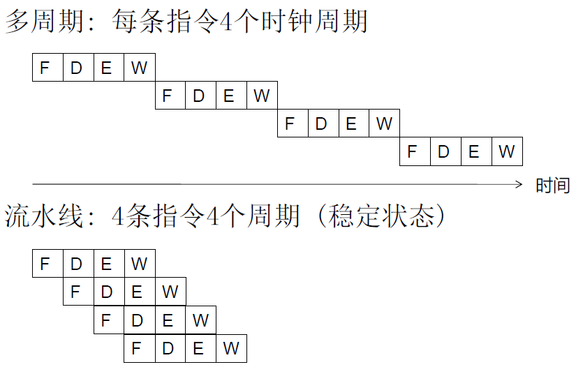

- 同一条指令的各个阶段是顺序相关的，但所有指令都被划分为相同的执行阶段
- 不同指令相互独立
- 不同的阶段不共享资源

---

则，

- 多条指令并行执行
- 不需要额外的资源
- 吞吐量是原来的4倍
- 每个指令延迟不变
- 最慢的阶段决定吞吐量

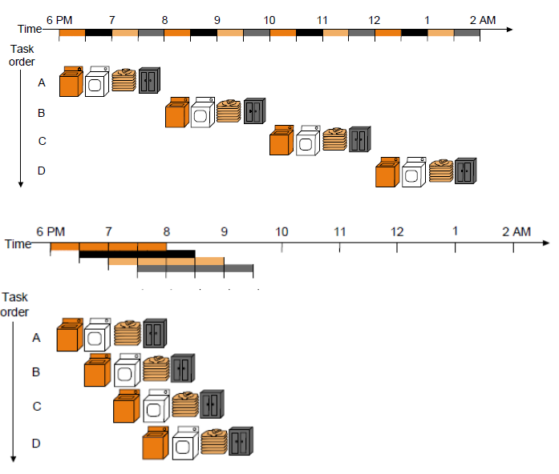

- $BW_1=\frac{1}{CPI_1}=\frac{1}{4}$
- $BW_2=\frac{4}{4+(4-1)}=\frac{4}{7}=\frac{1}{CPI_1}$

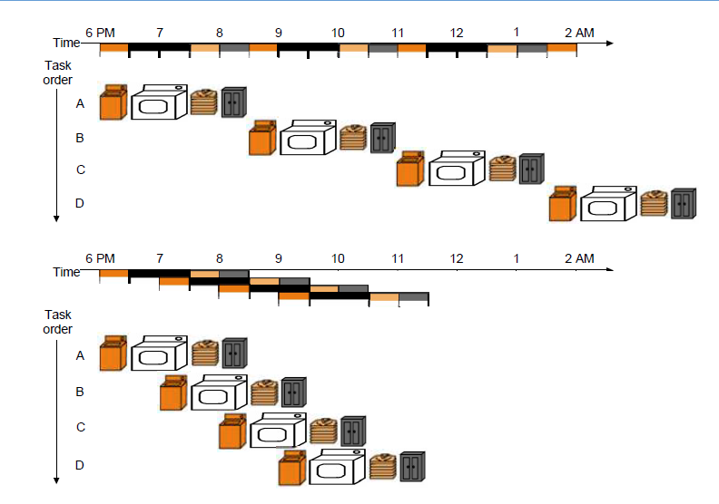

- $BW_1=\frac{1}{CPI_1}=\frac{1}{5}$
- $BW_2=\frac{4}{5+(4-1)\times 2}=\frac{4}{11}=\frac{1}{CPI_2}$

改进方法：增加最慢的阶段需要的硬件资源

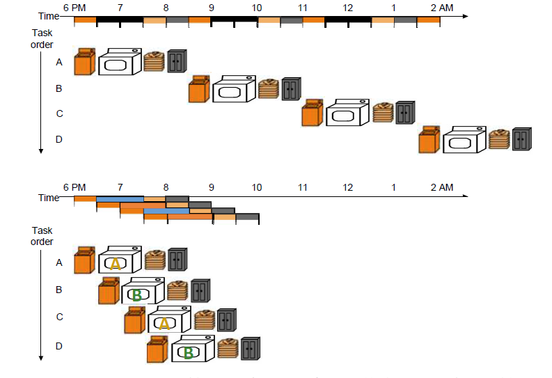

## 4.2 理想流水线设计

### 4.2.1 目标

增加少量成本（硬件资源开销），提高吞吐量

### 4.2.2 阶段划分

根据数据通路，将流水线分为5段

- IF：取指
- ID/RF：指令译码/取寄存器数
- EX/AG：执行/内存地址生成
- MEM：取内存数
- WB：写回

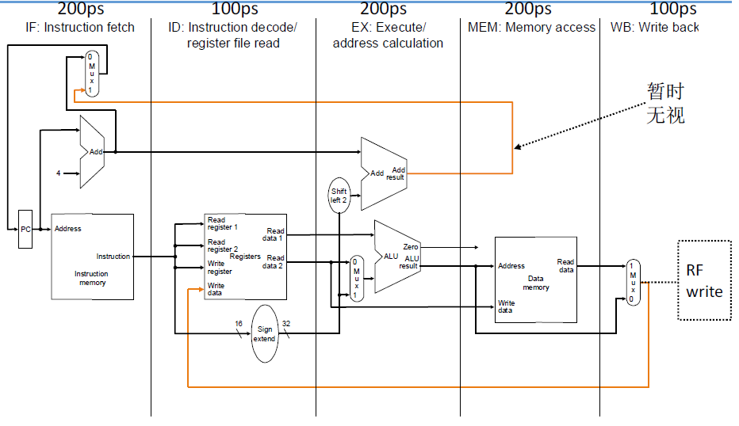

理想流水线，k段流水执行n条指令，则加速比为k，平均$\overline{CPI}=\frac{T}{k}$ ，$BW=\frac{1}{\overline{CPI}}=\frac{k}{T}$ 

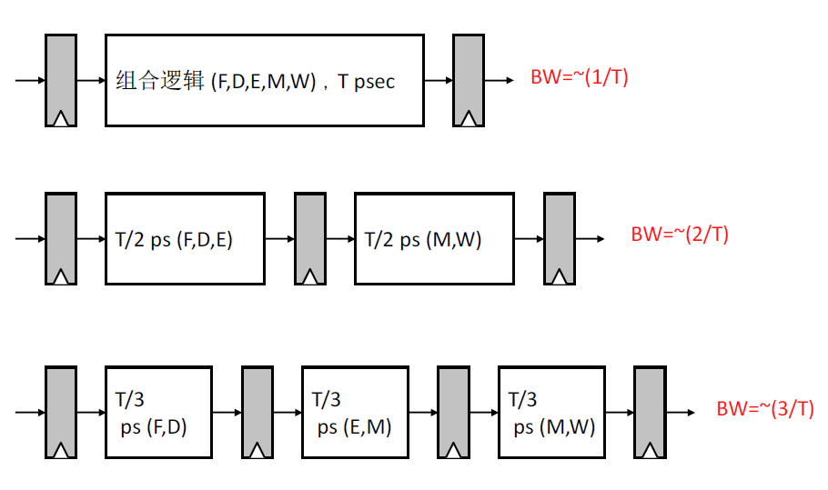

但实际上，对于一条指令，每增加一个流水段，会增加一次锁存开销

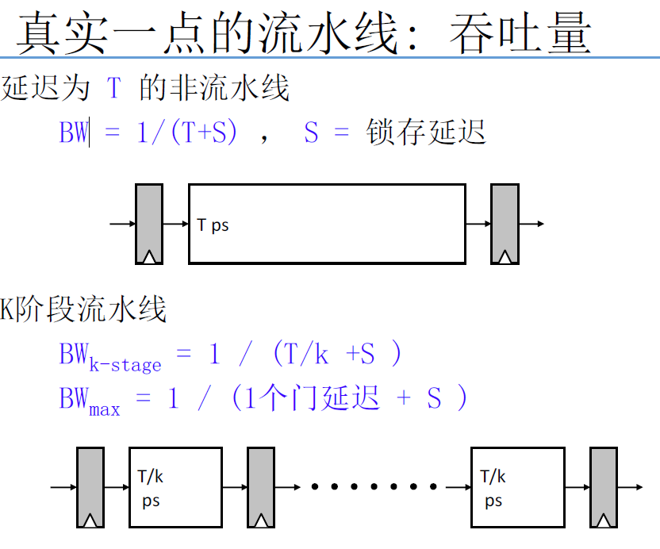

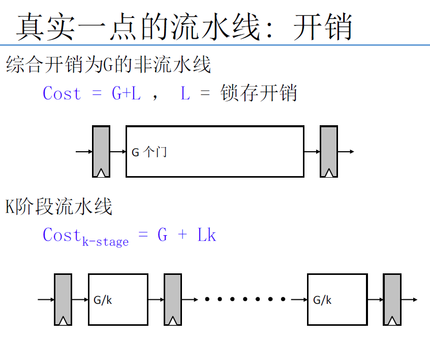

### 4.2.3 理想流水线吞吐

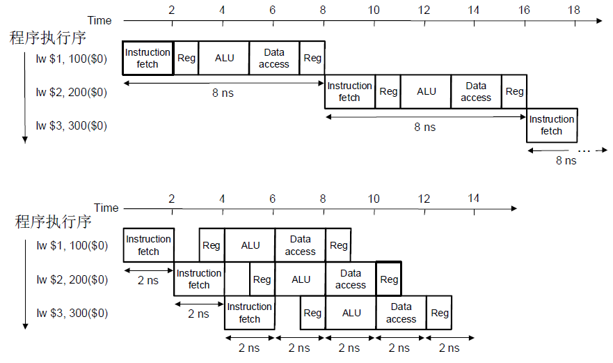

加速比：$\frac{8n}{9+2\times(n-1)}=\frac{8n}{2n+7}\overset{n\rightarrow \infty}{=}4$

理想流水线：划分为k段流水，每个阶段执行时间为 $\Delta t$，n条指令的加速比为k

$\frac{nk\Delta t}{k\Delta t+(n-1)\Delta t}=\frac{nk}{n+k-1}\overset{n\rightarrow \infty}{=}\frac{k}{1+\frac{k}{n}=\frac{1}{n}}=k$

所以，理想流水线的一个重要特点，就是 **指令处理被平均地划分为相同时延的阶段**  

### 4.2.4 理想流水线特点

- 统一的阶段划分：指令处理被 **平均** 地划分为相同时延的阶段(不共享资源)
- 重复相同操作：不同指令划分为相同执行阶段
- 重复独立操作：不同指令的相同阶段没有相关性
- 硬件资源独占式：所有硬件资源被某条指令的某个阶段独占式使用

### 4.2.5 图解流水线

操作视图：

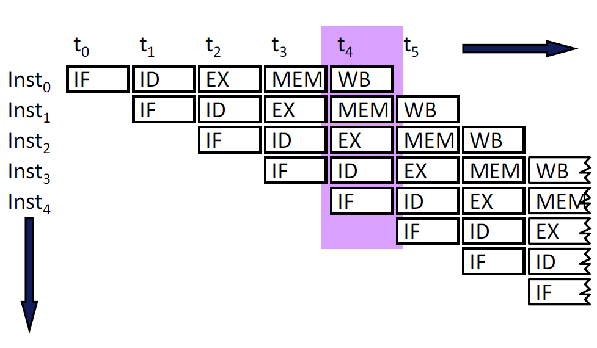

资源视图：

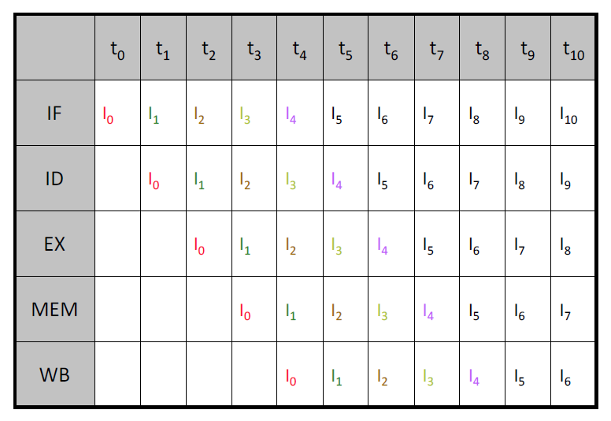

### 4.2.6 流水线中的控制信号

流水线中的控制信号和单周期中的控制信号相同

但控制信号要根据所处阶段获取

- 用与单周期相同的逻辑进行一次译码，然后缓存控制信号，直至被使用

  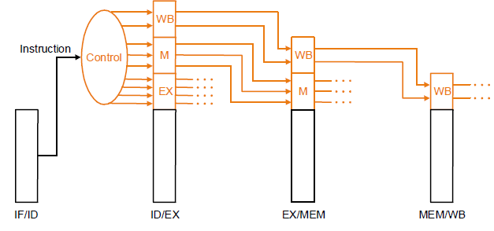

  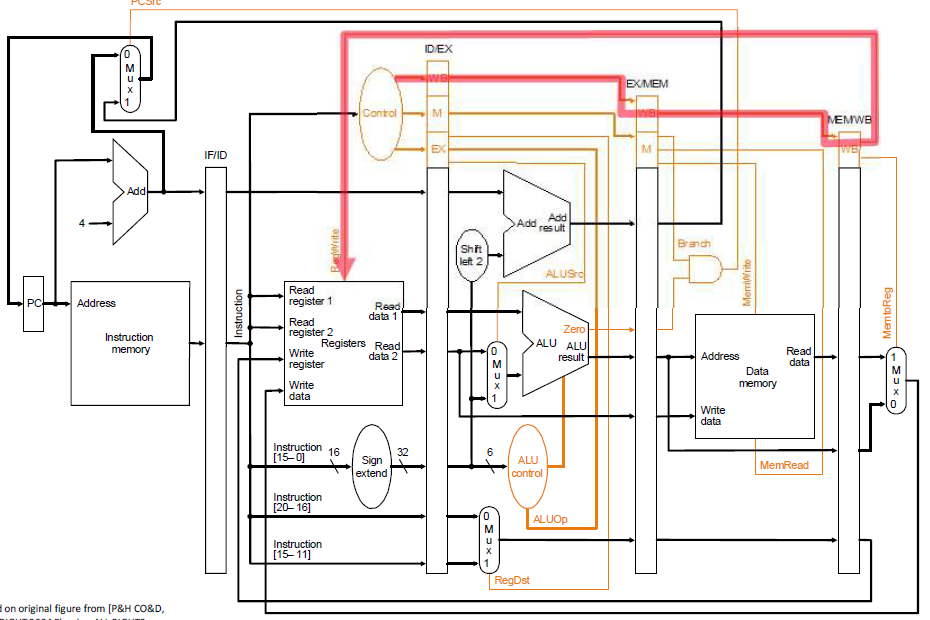

- 携带相关的 "指令字/字段"流经流水段，在每个流水段内部译码

## 4.3 非理想流水线设计

指令流水线并非理想的流水线

| 理想流水线     | 实际指令流水线                                               |
| -------------- | :----------------------------------------------------------- |
| 统一的阶段划分 | 很难平衡不同的流水段 - 内部碎片：有些流水段工作量少，完成的较快，但仍需要同样的时钟周期时间 |
| 重复相同操作   | 不同指令不一定需要所有的操作 - 外部碎片：某些指令有些流水段会闲置 |
| 重复独立的操作 | 指令之间不是独立的 - 需要检测指令之间的相关性确保流水线操作的正确性 - 流水线会有停顿 |

### 4.3.1 实际指令流水线设计中的问题

流水线平衡：需要多少流水段，每段完成什么任务

有影响流水线的事件——**停顿** 时，保持流水线正确、满负荷

- 处理相关性
  - 数据
  - 控制
- 处理资源争用
- 处理长时延(多个周期)

处理异常、中断

#### 处理资源争用

当两个流水段的指令需要同一资源时，会发生争用

1. 消除争用的起因

   - 复制资源或者提高资源的吞吐能力
     - 如：将指令Cache与数据Cache分开
     - 为存储结构设计多个端口

2. 检测资源争用，使其中一个争用流水段 **停顿**

   - 停顿：产生相关的指令等待源数据就绪

     - 排空所有下游阶段
     - 暂停所有下游阶段

     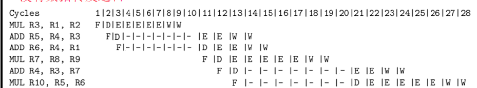

#### 相关性

相关性表明指令之间关于 “序”的需求

- 数据相关
- 控制相关

### 4.3.2 数据相关

#### 数据相关类型

- 流相关——写后读（真正的数据相关）
- 反相关——读后写
- 输出相关——写后写

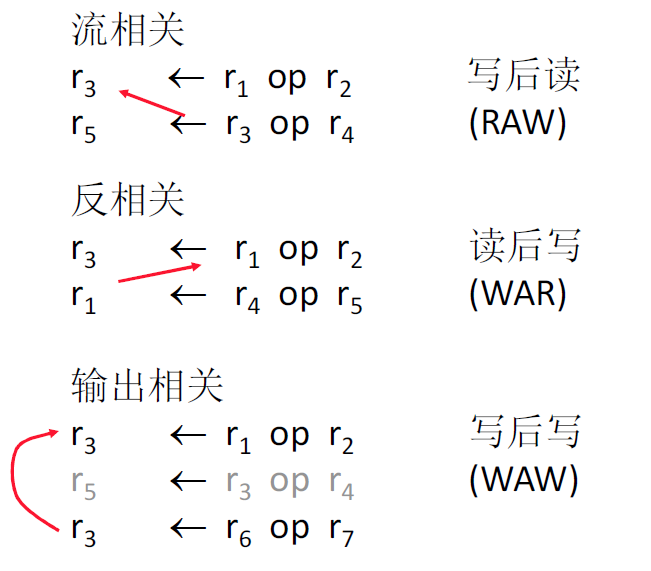

#### 相关性的检测方法

##### 计分板

每个寄存器中设置一个有效位

一条指令在译码阶段会检查所有相关源寄存器和目的寄存
器是否有效

- 是：无需停顿，没有相关
- 否：该指令停顿

优点：简单

缺点：所有类型的相关都会导致停顿，不止流相关

##### 相关性检查逻辑（组合逻辑）

特殊组合逻辑检查 是否有任何前序指令写当前译码指令的源操作寄存器（检查写后读）

- 是，该指令/流水线停顿
- 否，无需停顿，没有流相关

优点：反相关和输出相关不会造成停顿

缺点：

- 逻辑比计分板复杂

#### 处理数据相关

反相关与输出相关(X后写)的存在是由于寄存器数量有限

- 读后写：`Ia` 读R1，`Ib` 写R1，会发生反相关

  但若增加一个寄存器，`Ia` 仍读R1，但 `Ib` 写入R6，`Ib` 关于R1的操作都由R6替换，可以消除反相关（读后写）

- 写后写：也可以通过增加寄存器数量消除相关性

流相关总是需要处理，因为写后读构成了对一个值的真正相关，

##### 五种处理流相关的基本方法

- 检测并**消除**相关性：在**软件层面**，不需要硬件检测相关性
- 检测并**等待**：立即使相关指令**停顿**，直到值在寄存器中可以访问
- 检测并在必要时停顿相关指令，**转发/旁路数据**给相关指令
- 预测需要的值，“投机”，并且验证
- 细粒度多线程

##### 数据转发/旁路

**问题**：消费者指令不得不等待在译码阶段直到生产者指令将值写回寄存器堆

**目的**：不希望让流水线做不必要的停顿

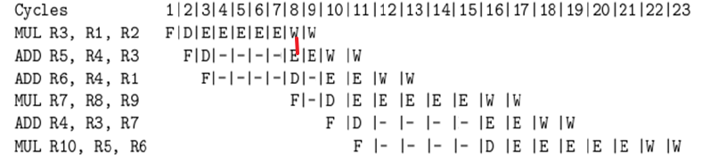

**观察到**：消费者指令需要的数据可以直接由流水线上的前序阶段提供（不止能来自寄存器堆）

**思路**：增加额外的相关性检查逻辑和数据转发通路(数据总线)，将生产者产生的值立即提供给消费者

- 从数据通路上而不是RF中取回数据
- 当有多个未完成的操作数定义时，取回最新产生的一个

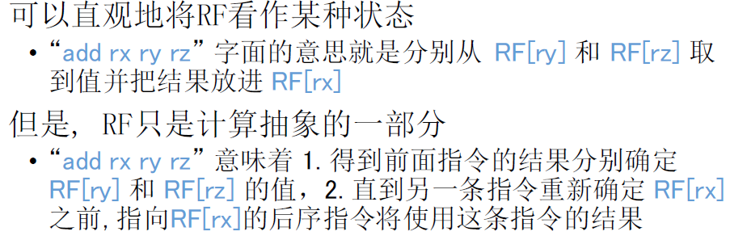

**好处**：减少停顿——消费者可以在流水线上流动，直到数据相关的点

**即使采用数据转发，如果与紧邻的前序LW存在RAW相关，也需要停顿**

##### 流水线停顿

寄存器相关性

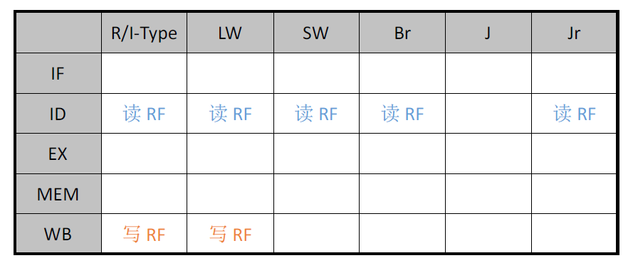

有些情况下，直接将转发/旁路数据是不安全的，只能通过流水线停顿处理数据相关

**流水线上的不安全移动**

指令间距大于执行阶段间距，则可以进行转发/旁路数据

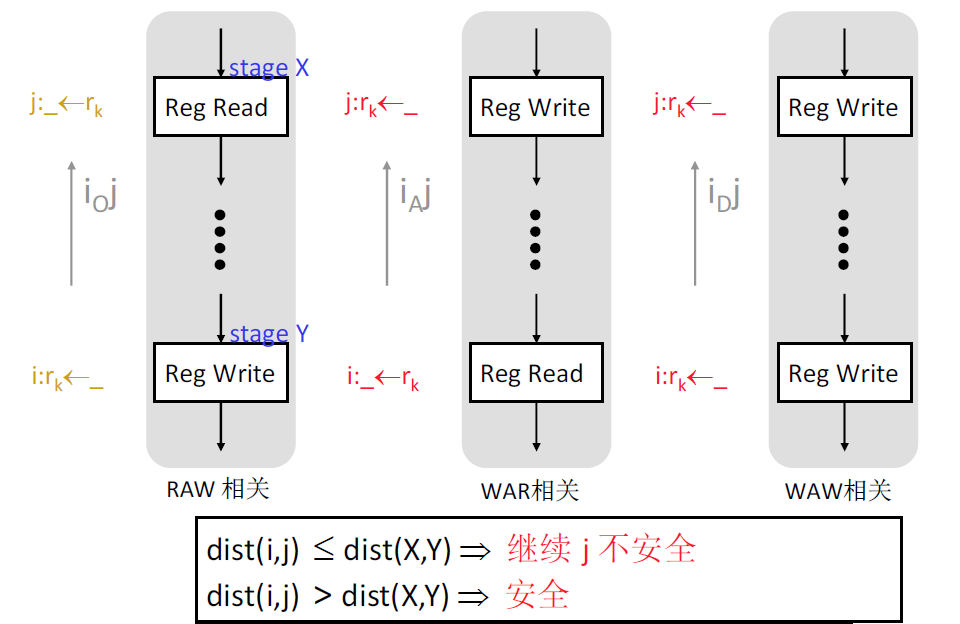

**停顿条件**

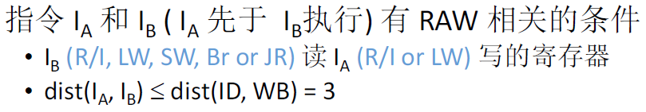

当处于ID阶段的指令 $I_b$ 需要读寄存器被处于EX，MEM，WB阶段的指令 $I_a$ 写入时，指令 $I_b$ 需要停顿

**停顿实现**

- 禁用PC和IR的触发：确保被停顿的指令停在它当前阶段
- 在被停顿指令的停顿阶段后插入"非法"指令/nops
- 处于EX，MEM,WB阶段的前序指令继续向前执行

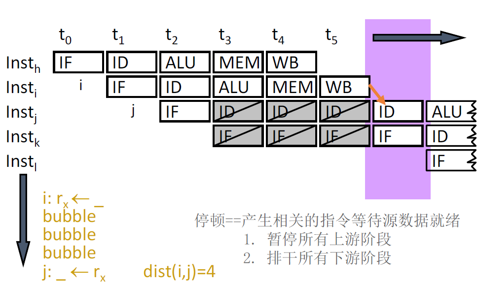

**停顿对性能的影响**

每个停顿周期实际上对应浪费一个ALU周期

对于一个有N条指令和S个停顿周期的程序而言，$\overline{CPI}=\frac{N+S}{N}=1+\frac{S}{N}$ 

S个数依赖于：

- 出现RAW的频率
- 出现相关指令的间隔

#### 例题

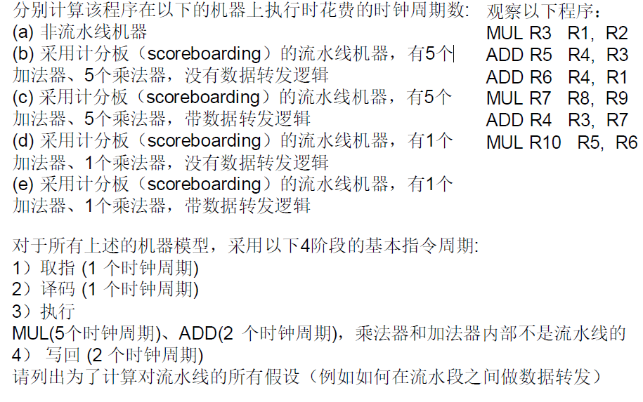

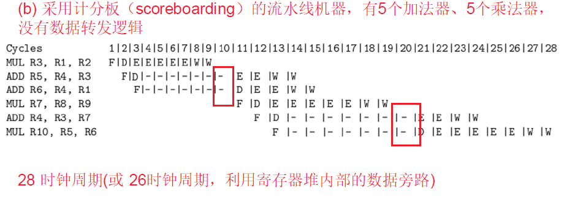

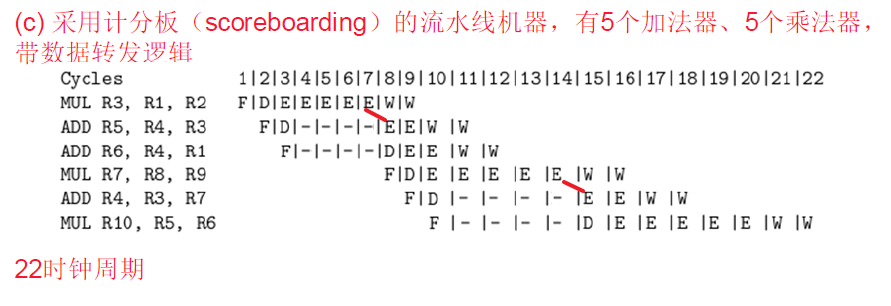

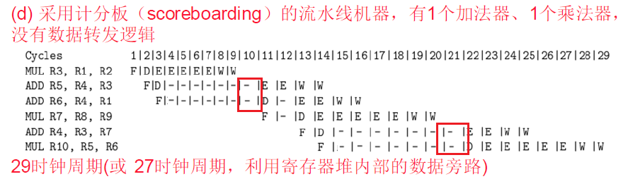

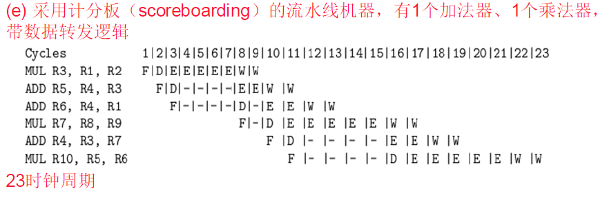

### 4.3.3 控制相关

PC中存储的内容是下一条指令的内存地址

- 所有指令都和他们之前的指令存在控制相关

问题：

- 如何判断取到的指令是不是一个控制指令
  - 是，则如何决定PC值
  - 否，下一次取的PC是顺序执行的指令
