[TOC]

<!--more-->

## 设计目标

设计单周期MIPS处理器，支持：`addu`，`subu`，`ori`，`lw`，`sw`，`beq`，`lui`

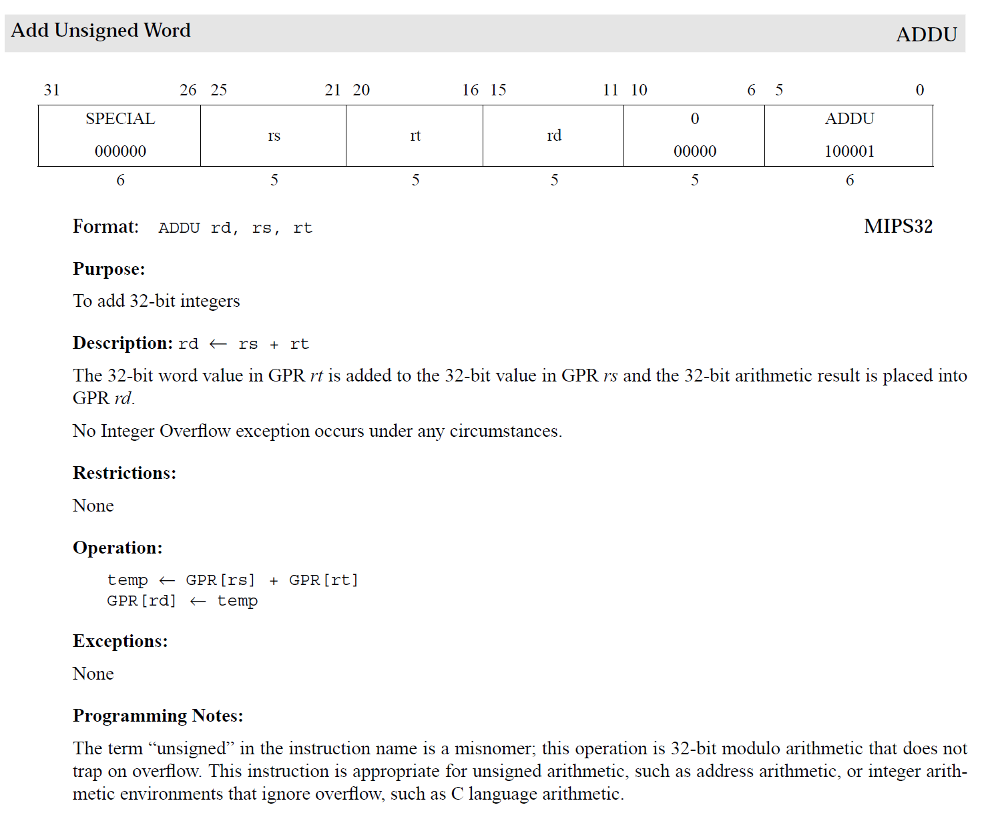

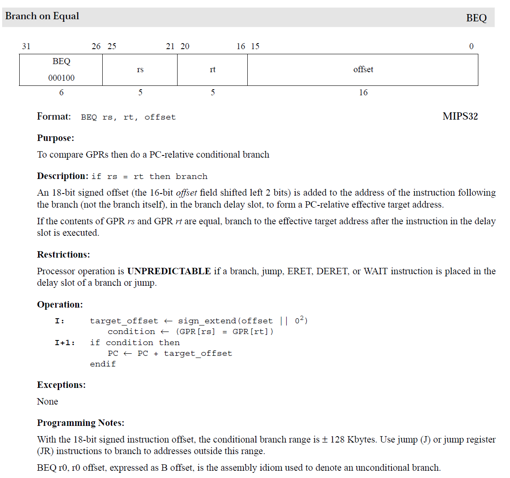

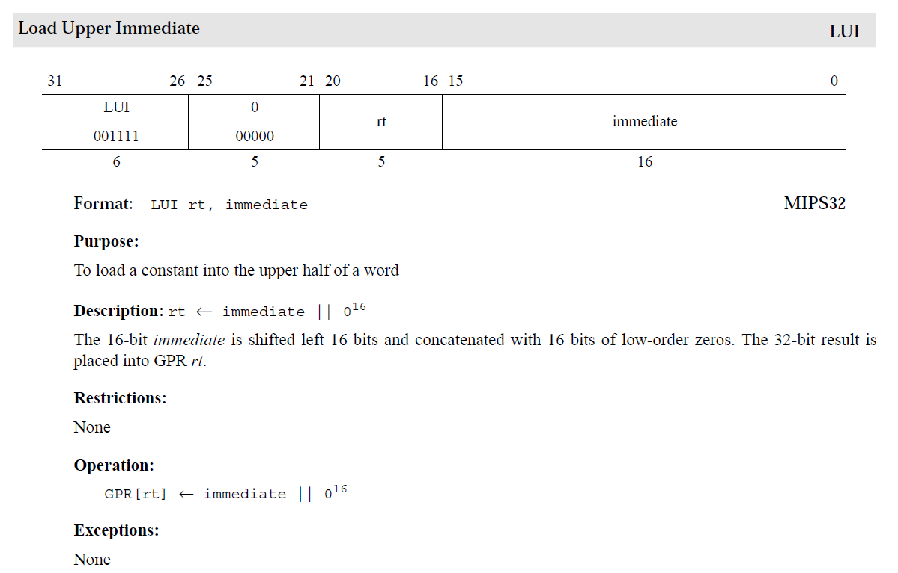

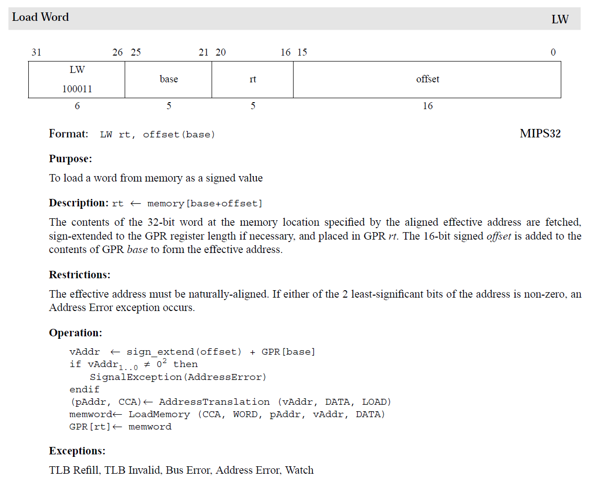

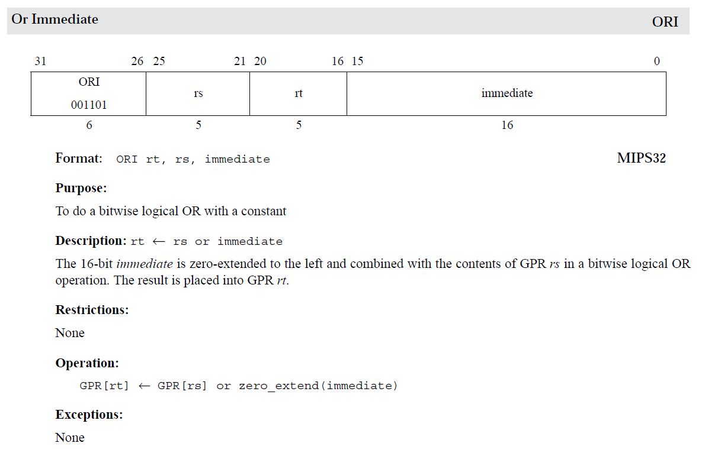

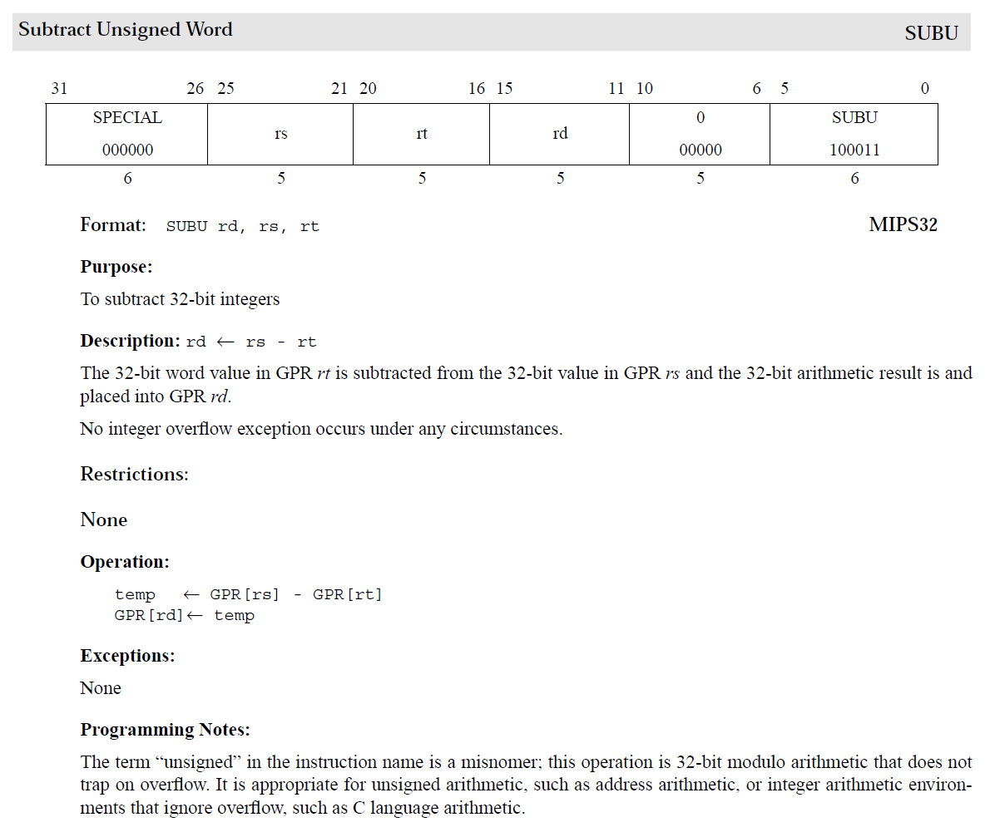

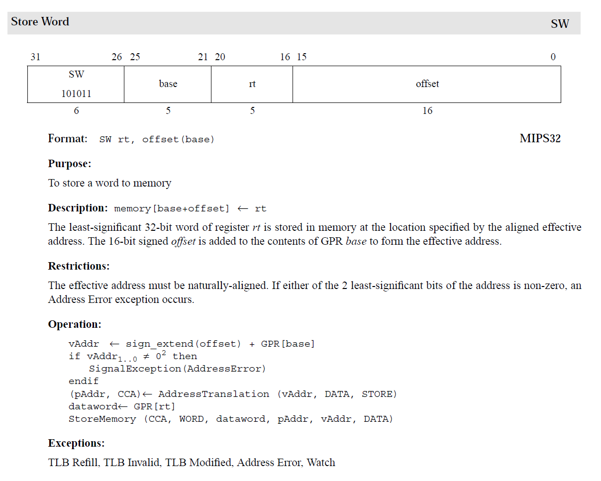

## 要求

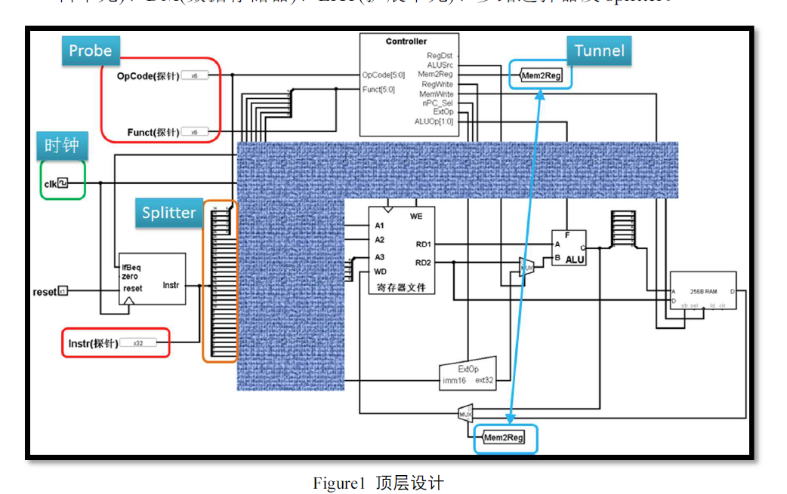

- Figure1 中Tunnel 的用途是将具有相同name 的tunnel 连接在一起。Tunnel可以避免将图画的很乱。
- Probe 的用途是显示被probed 信号的值，便于调试。
- Splitter 的用途是从某组信号中提取其中部分信号。例如，IFU 输
  出32位指令，需要提取高6位(OpCode)和低6位(Funct)分别输入controller。
  - splitter是有位序的！但字号太小，需要放大设计图(界面左下有比例设置)。
  - 建议高位永远在上，低位永远在下
- 建议先在MARS中编写测试程序并调试通过。
- 片选信号就是对存储器地址的高位分析。
  - 假设DM有256MB容量，并且映射在0x3000_0000～0x3FFF_FFFF区间。那么只需要把高4 位地址与0x3 进行比较，比较结果就是DM的片选信号。
  - 为了实现片选，你需要用基本逻辑门搭2 个片选信号生成逻辑，一个输出至IM，一个输出至DM。
  - Logisim 内置的RAM 有片选信号！
- 你可以考虑增加7 段数码管等输入输出设备来让你的测试结果更加直观。
  - 7 段数码管也需要类似片选等信号，其工作原理与上一项类似。

### 部件

Controller(控制器)、IFU(取指令单元)、GPR(通用寄存器组，也称为寄存器文件、寄存器堆)、ALU(算术逻辑单元)、DM(数据存储器)、EXT(扩展单元)、多路选择器及splitter

### 有效驱动信号

#### clk

即如Figure1中绿圈所示。

只有设置了时钟源，系统才能自动运行，从而让程序连续运行。

#### reset

### 模块化

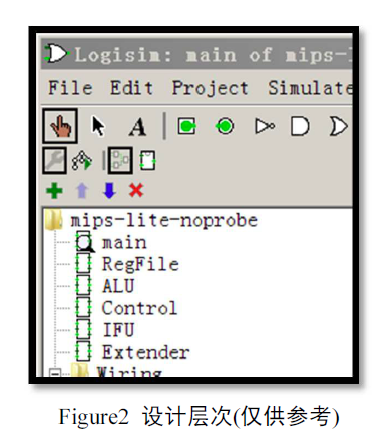

#### IFU——取指令单元

> 内部包括PC、IM(指令存储器)及相关逻辑。

- PC：用寄存器实现，宽度为30 位。PC 应具有复位功能。

  PC 复位后初值为0x0000 3000，目的是与MARS 的Memory Configuration相配合。

  - 教师用测试程序将通过MARS 产生，其配置模式如Figure3 所示。因此你也需要用MARS 编写测试程序并生成能够在Logisim 中运行的代码。

    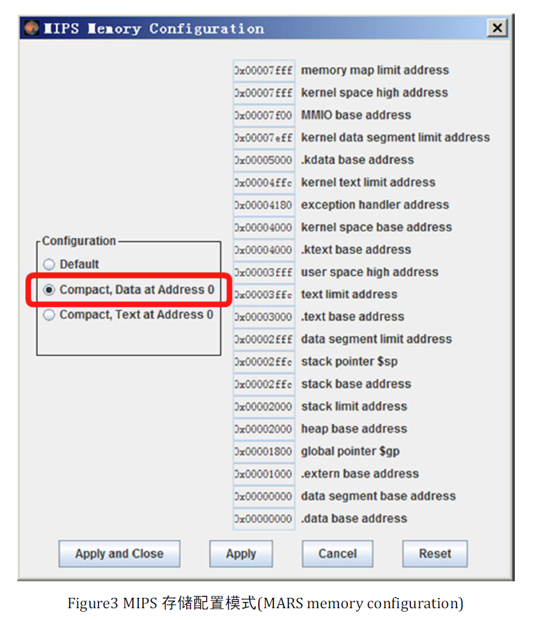

- IM：容量为32bit×32 字，用ROM 实现。

  说明：由于IM 地址仅为5 位，因此需要用Splitter 连接PC 低位地址与IM地址。

#### GPR——通用寄存器

> 以32 个32 位具有写使能的寄存器为基础，辅以多路选择器。

#### ALU

> 实现加法及减法时，允许使用Logisim 内置的Adder 及Subtractor。也欢迎以门电路为基础自行开发。

#### EXT

> 可以使用Logisim 内置的Bit Extender

#### DM——内存

> 容量为32bit×32 字，用RAM 实现。

- DM应采用双端口模式，即设置RAM 的“Data Interface”属性为“Separate load and store ports”。

## 模块定义

**1.仿照下面给出的 IFU 模块定义，自行给出所有功能部件的模块定义**。

- IFU、GPR、ALU、EXT、DM、Controller。 

### IFU 模块定义(参考样例)

#### 基本描述

IFU 主要功能是完成取指令功能。IFU 内部包括PC、IM(指令存储器)以及其他相关逻辑。IFU 除了能执行顺序取值令外，还能根据BEQ 指令的执行情况决定顺序取值令还是转移取值令。

#### 模块接口

|   信号名    | I/O  | 描述                                                         |
| :---------: | ---- | :----------------------------------------------------------- |
|    IfBeq    | I    | 当前指令是否为beq指令标志。 1：当前指令为beq 0：当前指令非beq |
|    Zero     | I    | ALU计算结果为0标志。 1：计算结果为0 0：计算结果非0   |
|     clk     | I    | 时钟信号                                                     |
|    Reset    | I    | 复位信号。 1：复位 0：无效                           |
| Instr[31:0] | O    | 32 位MIPS指令                                                |

#### 功能定义

| 序号 | 功能名称           | 功能描述                                                     |
| ---- | ------------------ | :----------------------------------------------------------- |
| 1    | 复位               | 当复位信号有效时，PC被设置为0x00003000。                     |
| 2    | 取指令             | 根据PC从IM 中取出指令。                                      |
| 3    | 计算下一条指令地址 | 如果当前指令不是beq 指令，则 $PC\leftarrow PC+1$ 如果当前指令是beq指令，并且zero为0，则$PC\leftarrow PC+1$ 如果当前指令是beq 指令， 并且zero 为1 ， 则 $PC\leftarrow PC+sign\_ext(当前指令15..0)$ [注]PC取地址为4 字节，固低2位地址可以去除。 |

### MIPS寄存器组

#### 基本描述

32位寄存器，两个读端口，一个写端口

寄存器组包含32个寄存器及相关逻辑电路，每个寄存器有相应编号

- 给定两个读出寄存器编号，可以得到两个寄存器值
- 给定一个写入寄存器编号，可以将数据写入指定寄存器中

#### 模块接口

| 信号名 | I/O  | 位宽 | 描述                                              |
| :----: | ---- | ---- | :------------------------------------------------ |
|  R1#   | I    | 5    | 第2个读寄存器的编号                               |
|  R2#   | I    | 5    | 第2个读寄存器的编号                               |
|   W#   | I    | 5    | 写入寄存器编号                                    |
|  Din   | I    | 32   | 写入数据                                          |
|   WE   | I    | 1    | 写使能信号，为1时在CLK下降沿将Din数据写入W#寄存器 |
|  CLK   | I    | 1    | 时钟信号，上升沿生效                              |
|  RD1   | O    | 32   | R1#寄存器的值，0号寄存器值恒0                     |
|  RD2   | O    | 32   | R2#寄存器的值                                     |

#### 功能定义

|      |      |      |
| ---- | ---- | :--- |
|      |      |      |
|      |      |      |
|      |      |      |

### 控制器设计

#### **2. 请仿照下图给出MIPS-Lite1 指令集的单周期控制器真值表**

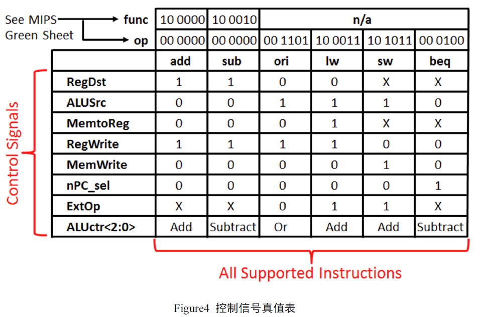

- 结合真值表，请给出数据通路每个功能部件的每个控制信号的布尔表达式。

- 表达式中只能使用“与、或、非”3 种基本逻辑运算。
- 每个控制信号的表达式应该是指令opcode 域与funct 域的函数。
- 对于多位的控制信号(如ALUCtr)，应诸位给出其逻辑表达式。

#### 在Logisim 中完成控制器设计

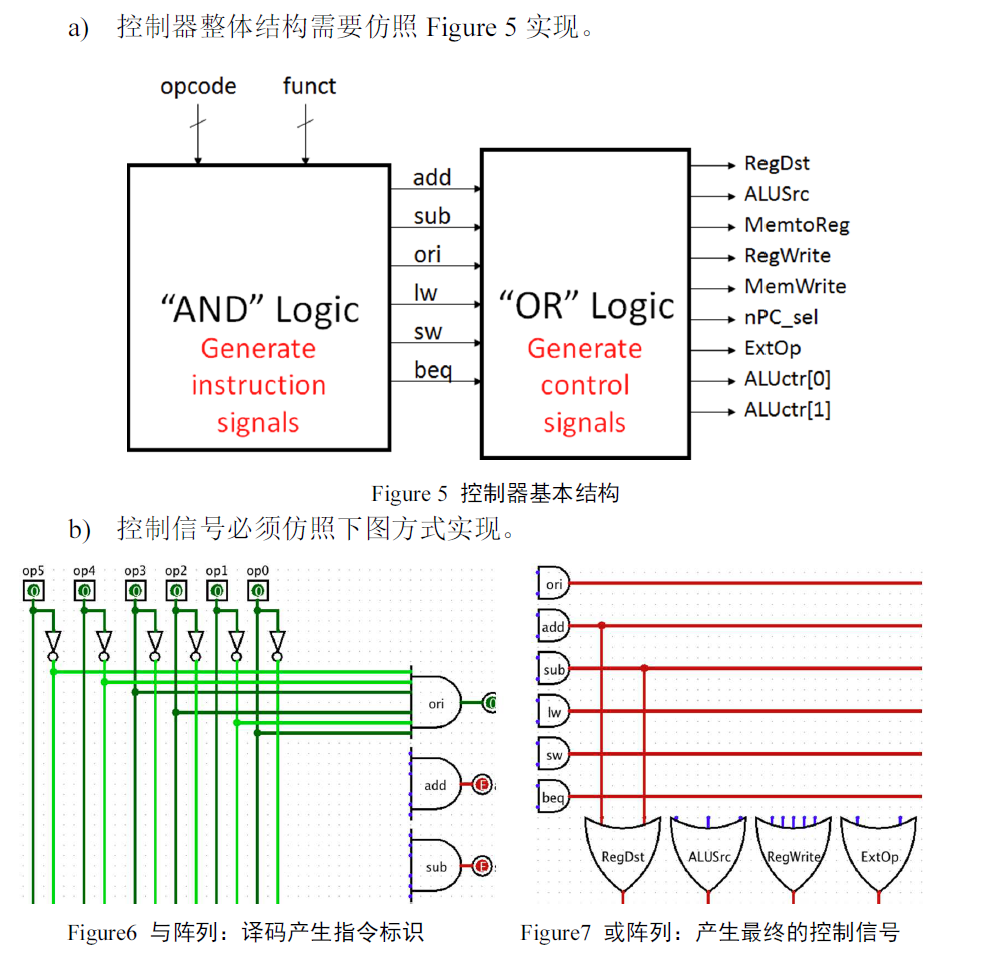

## 测试要求

构造1 个至少20 条以上指令的测试程序，并加载至IFU 中运行通过。

- MIPS-Lite1 定义的每条指令至少出现1 次以上。

**3. 详细说明你的测试程序原理**

- 应明确说明测试程序的测试期望，即应该得到怎样的运行结果。
- 每条汇编指令都应该有注释。

## **4. 问答**

- 请充分利用Figure4 中的X 可以将控制信号化简为最简单的表达式
- 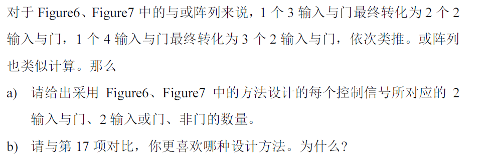

## 实验报告

打包文件：Logisim 工程文件、测试程序、测试程序二进制文件、项目报告。

- 本实验要求文档中凡是出现了【WORD】字样，就意味着该条目需要在实验报告中清晰表达。

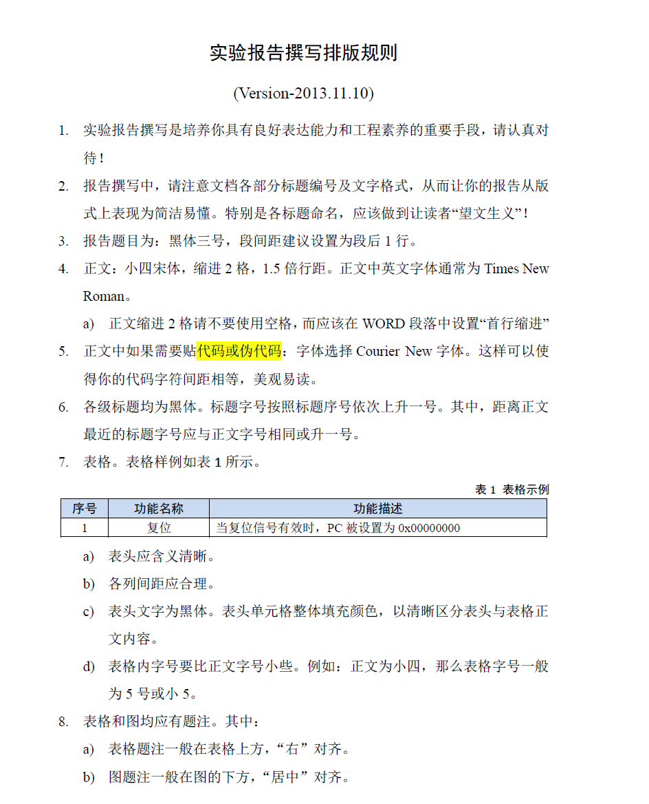