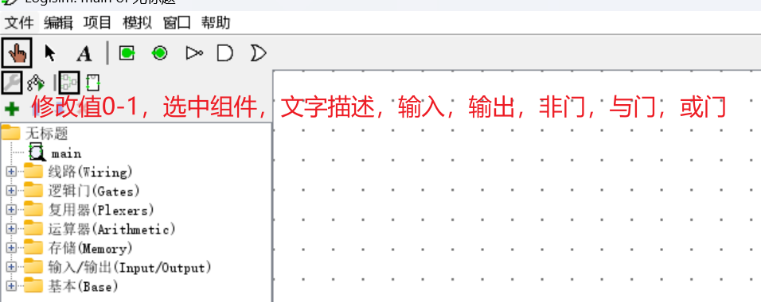
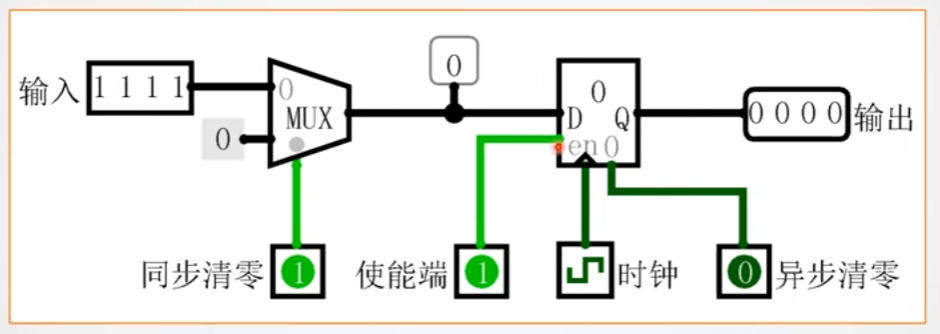

[TOC]

<!--more-->

# 计算机仿真实验

## 目标——从逻辑门到流水CPU

- 组合逻辑电路-同步时序逻辑电路-小型数字系统

- 运算器，存储器，控制器，处理各种冲突冒险的五段流水CPU

设计课程

- 数字逻辑

  - 正向计数——运动码表

    

    组合逻辑电路设计

    同步时序电路设计

    寄存器数据传输

- 计算机组成原理

  - 硬布线控制器&微程序控制器——MIP单周期，多周期CPU

    

    运算器

    存储器

    控制器

- 计算机体系结构

  - 处理冲突冒险——五段流水CPU

    

    资源相关，分支相关，数据相关

    中断

    动态分支预测

- 逻辑与计算机系统设计基础

## logisim

> 采用原理图方式对电路图进行仿真

### 工作区

点阵（显示消除）：

工作区（放大缩小）：

### 工具栏

组件的调用关系

### 侧边栏为组件库

#### 引脚

方向键，决定组件的引脚方向

- 左键，则引脚在左

数据位宽，决定引脚输入位数

- Alt+数字键
- 按住 Alt+3+2表示32位输入

标签：

- 引脚文字说明

#### 与门

输入：

- 数字键切换引脚数，3+2表示32位引脚 

#### 数据选择器（多选一）

> 复用器-数据选择器

输入端：长边引脚

输出端：一个

使能端：长线

控制端：短线

#### 探针

用于查看线路当前值

#### 线路颜色

约定：

- 亮绿：高电平

- 深绿：低电平

- 蓝色：未知状态

  尽量消除

- 灰色：飞线

  两端并未连接

- 红色：信号冲突

  

- 黑色：多位总线

- 橙色：数据宽度不兼容

  

### 封装

**子电路布局**

**封装子电路外观**

- 引脚朝向决定芯片上的位置

- 拖动可以改变引脚位置

### 电路工程

点击电路工程可以复用到其他电路工程

- 点击组件，悬浮会得到电路相应标签

### 菜单栏

#### 分析电路

可以通过表达式修改电路组件

##### 电路简化——最小式

#### 选项

##### 仿真

- 振荡频率

- 对于未定义的引脚如何处理

##### 工具栏

工具栏项目

#### 模拟

##### 信号模拟

直接输出最终结果

##### 重置模拟器

将电路中所有带有存储状态的组件复位为0

##### 时钟前进一步

时钟信号前进

- 关闭信号模拟，可以用于单步调试

##### 启用时钟模拟

自动完成时钟的翻转

##### 时钟频率

指定时钟模拟的翻转频率 

##### 记录器

对所有引脚，探针做日志记录

#### 自动生成电路

logisim

- 只能自动生成组合逻辑电路
- 输入引脚只能是一位
- 输入引脚的个数最多只有8个

##### 一位全加器

输入：x y cin

输出：sum(求和) cout(进位)

表达式：

- `sum = x ^ y ^ cin`
- `cout=x y + x cin + y cin` 

### logisim组件有延迟

> logisim不能精准仿真所有组件的延迟，在系统中所有硬件延迟都是相等的

如图所示的电路，由于与门的两个输入端有差异，一个输入端存在一个非门的硬件延迟，会造成计数器累计——输出端险像

#### 解决

1. 增加一个缓冲器，使各个输入端信号的传播路径一致，消除信号的竞争

   

2. 反转与门引脚（实际不可取）

   

### logisim中的震荡现象

> 电路由于反馈回路的存在，无法进入稳态

- logisim的一种保护机制，避免仿真系统进入死循环

#### 解决

- 修改引脚值
- 排除法：断开一些关键路径，若震荡消失，则这一路径中存在反馈回路

### 工具库

**组件公共属性**

| #    | 属性     | 描述                             | 快捷键     |
| ---- | -------- | -------------------------------- | ---------- |
| 1    | 朝向     | 组件在画布中放置的方向           | 方向键     |
| 2    | 数据位宽 | 引脚对应的数据宽度               | Alt+数字键 |
| 3    | 引脚数   | 逻辑门电路输入的引脚数           | 数字键     |
| 4    | 外观     | 调整组件外观                     |            |
| 5    | 尺寸     | 逻辑门电路可以设置组件大小       |            |
| 6    | 标签     | 与组件相关联的标签文字，用于注释 |            |
| 7    | 标签位置 | 标签在组件上的显示位置           |            |
| 8    | 标签字体 | 组件标签文字的字体               |            |

#### 线路库

##### 分线器

> 将多位宽线路中的某些位分离出来，也可以将多位数据合成一个数据

- 无时间延迟
- 无方向特性

| 属性       | 功能                          |
| ---------- | ----------------------------- |
| 朝向       | 分线端的期间方向              |
| 输出fanout | 分线端端口数                  |
| 位宽       | 汇聚端位宽                    |
| 外观       | 外观选择                      |
| 位x        | 汇聚端第x位映射至分线端端口号 |

- 默认将汇聚端位宽平均分配到每一个输出端口

##### 引脚

> 子电路输入输出接口

- 输入端口：子电路封装的左侧
- 输出端口：子电路封装的右侧

| 属性       | 功能                                 |
| ---------- | ------------------------------------ |
| 朝向       | 期间方向                             |
| 输出       | 输入/输出                            |
| 数据位宽   | 引脚的数据bit数                      |
| 三态       | 是否有三态值(0-1-x高阻)              |
| 未定义处理 | 未连接时的默认值 不变/上拉/下拉 |

##### 探针

> 动态检测线路值

- 用于调试

##### 隧道

> 远程线路连接，具有相同标签名的隧道，逻辑上是连接在一起的

##### 上/下拉电阻

> 处理线路中的悬浮态、不确定值
>
> - 强制将所有x变为电阻相应的方向

- 无位宽属性

##### 时钟

> 提供时钟源

启用时钟模拟后，会按照设定的时钟频率自动跳变

##### 常量

> 可定义位宽

##### 电源，接地

##### 位扩展器

> 数据位宽扩展（输入位宽小于输出位宽，则扩展）或截断（输入位宽大于输出位宽，则截断）

输入位宽：

输出位宽：

扩展方式：

#### 逻辑门库

##### 与或非，与非，或非，异或，异或非

##### 奇偶校验

##### 三态门、三态非门

> 控制开关，用于总线传输方向控制

#### 复用器库

##### 多路选择器

> 从多路输入中选择一路输出

选择数据宽度：选择信号宽度为2，表示有从 $2^2=4$ 个输入中选一个

数据位宽：每个输入的位宽

- 使能端默认为1

选择端不能使用多路选择器

##### 解复用器

> 将一路输入选择某一路输出——与多路选择器功能相反

选择数据长度：选择信号宽度为2，表示有从 $2^2=4$ 个输出中选一个

##### 解码器

> 用于地址译码，将选择端的输入，转变为一位的输出

##### 优先编码器

> 获得输入信号的编码——与解码器相反

- 输出最高位1的最大输入引脚编号
- 通常用于中断请求的中断优先判断

#### 运算器库

##### 带进位加法器

##### 带借位减法器

##### 无符号乘法器

##### 无符号除法器

##### 求补码器

> 符号位取反，其余位取反加一

##### 比较器

##### 移位器

#### 存储库

##### 触发器

异步：电平敏感

- 异步置位：当变为1时，所有触发器Q端为1
  - 此时异步清零端需为0（失效）
- 异步清零：当变为0时，所有触发器Q端为0
  - 此时异步置位端需为0（失效）

##### 寄存器

> 多个D触发器并行构成

当时钟信号到来时，可以将数据锁存在Q端

清零：

- 异步信号：在异步清零信号为1时，将寄存器清零

- 同步信号：在时钟信号到来时，将寄存器清零

  

  当异步清零失效，且同步清零有效时，通过多路选择器，将0输入到D端，时钟信号到来时，Q端锁存为0

##### 计数器

- 异步清零：电平为1，则清零
- Carry：当计数器达到最大值，则进位1

##### 随机数生成器

##### RAM

- 通常使用输入输出分离同步模式

双向输入输出同步模式

- 写使能失效，三态门输出端无数据，待写数据不能写入D端

  在非门作用下，读信号有效，寄存器中值从D端输出

输入输出端分离同步模式

##### ROM

#### 输入输出库

##### 键盘，哑终端

- 键盘预设输入，并转化为ASCII

  当一个时钟信号来时，将一个8bit的ASCII数据输出

  文字终端进行显示

#### 数码管

### logisim应用实验

#### 1

- 自动生成电路

任务：

- LED计数电路
- 构建一个数据编码器
- 设计7段数码管显示电路板

#### 2

> 编码器

Out1: `In5+In3&~In4&~In5+In1&~In2&~In3&~In4&~In5`

## MIPS

### CPU设计

#### 概念

##### CPU类型

单周期：定长指令周期

- 所有指令在一个时钟周期内完成，CPI=1
- 性能取决于最慢的指令，时钟周期过长

多周期：变长指令周期

- 缩短时钟周期，复用器件和数据通路

##### 指令格式

##### 数据通路

**取指**

$Mem[PC++]\rightarrow IR$

- 单周期不能设计 `AR` , `DR` ，`IR` 寄存器

  由于一个时钟周期内完成取指操作，所以直接用PC内容取内存内容

- 程序和数据分开存放——哈佛结构

  由于取指令与取操作数都要访问主存，存在资源冲突

- 运算器和PC累加器分离‘

## 实验

### 设计目标

设计单周期MIPS处理器，支持：`addu`，`subu`，`ori`，`lw`，`sw`，`beq`，`lui`

#### 要求

- Figure1 中Tunnel 的用途是将具有相同name 的tunnel 连接在一起。Tunnel可以避免将图画的很乱。
- Probe 的用途是显示被probed 信号的值，便于调试。
- Splitter 的用途是从某组信号中提取其中部分信号。例如，IFU 输
  出32位指令，需要提取高6位(OpCode)和低6位(Funct)分别输入controller。
  - splitter是有位序的！但字号太小，需要放大设计图(界面左下有比例设置)。
  - 建议高位永远在上，低位永远在下
- 建议先在MARS中编写测试程序并调试通过。
- 片选信号就是对存储器地址的高位分析。
  - 假设DM有256MB容量，并且映射在0x3000_0000～0x3FFF_FFFF区间。那么只需要把高4 位地址与0x3 进行比较，比较结果就是DM的片选信号。
  - 为了实现片选，你需要用基本逻辑门搭2 个片选信号生成逻辑，一个输出至IM，一个输出至DM。
  - Logisim 内置的RAM 有片选信号！
- 你可以考虑增加7 段数码管等输入输出设备来让你的测试结果更加直观。
  - 7 段数码管也需要类似片选等信号，其工作原理与上一项类似。

#### 部件

Controller(控制器)、IFU(取指令单元)、GPR(通用寄存器组，也称为寄存器文件、寄存器堆)、ALU(算术逻辑单元)、DM(数据存储器)、EXT(扩展单元)、多路选择器及splitter

#### 有效驱动信号

##### clk

即如Figure1中绿圈所示。

只有设置了时钟源，系统才能自动运行，从而让程序连续运行。

##### reset

#### 模块化

##### IFU——取指令单元

> 内部包括PC、IM(指令存储器)及相关逻辑。

- PC：用寄存器实现，宽度为30 位。PC 应具有复位功能。

  PC 复位后初值为0x0000 3000，目的是与MARS 的Memory Configuration相配合。

  - 教师用测试程序将通过MARS 产生，其配置模式如Figure3 所示。因此你也需要用MARS 编写测试程序并生成能够在Logisim 中运行的代码。

    

- IM：容量为32bit×32 字，用ROM 实现。

  说明：由于IM 地址仅为5 位，因此需要用Splitter 连接PC 低位地址与IM地址。

##### GPR——通用寄存器

> 以32 个32 位具有写使能的寄存器为基础，辅以多路选择器。

##### ALU

> 实现加法及减法时，允许使用Logisim 内置的Adder 及Subtractor。也欢迎以门电路为基础自行开发。

##### EXT

> 可以使用Logisim 内置的Bit Extender

##### DM——内存

> 容量为32bit×32 字，用RAM 实现。

- DM应采用双端口模式，即设置RAM 的“Data Interface”属性为“Separate load and store ports”。

### 模块定义

**1.仿照下面给出的 IFU 模块定义，自行给出所有功能部件的模块定义**。

- IFU、GPR、ALU、EXT、DM、Controller。 

#### IFU 模块定义(参考样例)

##### 基本描述

IFU 主要功能是完成取指令功能。IFU 内部包括PC、IM(指令存储器)以及其他相关逻辑。IFU 除了能执行顺序取值令外，还能根据BEQ 指令的执行情况决定顺序取值令还是转移取值令。

##### 模块接口

|   信号名    | I/O  | 描述                                                         |
| :---------: | ---- | :----------------------------------------------------------- |
|    IfBeq    | I    | 当前指令是否为beq指令标志。 1：当前指令为beq 0：当前指令非beq |
|    Zero     | I    | ALU计算结果为0标志。 1：计算结果为0 0：计算结果非0   |
|     clk     | I    | 时钟信号                                                     |
|    Reset    | I    | 复位信号。 1：复位 0：无效                           |
| Instr[31:0] | O    | 32 位MIPS指令                                                |

##### 功能定义

| 序号 | 功能名称           | 功能描述                                                     |
| ---- | ------------------ | :----------------------------------------------------------- |
| 1    | 复位               | 当复位信号有效时，PC被设置为0x00003000。                     |
| 2    | 取指令             | 根据PC从IM 中取出指令。                                      |
| 3    | 计算下一条指令地址 | 如果当前指令不是beq 指令，则 $PC\leftarrow PC+1$ 如果当前指令是beq指令，并且zero为0，则$PC\leftarrow PC+1$ 如果当前指令是beq 指令， 并且zero 为1 ， 则 $PC\leftarrow PC+sign\_ext(当前指令15..0)$ [注]PC取地址为4 字节，固低2位地址可以去除。 |

#### MIPS寄存器组

##### 基本描述

32位寄存器，两个读端口，一个写端口

寄存器组包含32个寄存器及相关逻辑电路，每个寄存器有相应编号

- 给定两个读出寄存器编号，可以得到两个寄存器值
- 给定一个写入寄存器编号，可以将数据写入指定寄存器中

##### 模块接口

| 信号名 | I/O  | 位宽 | 描述                                              |
| :----: | ---- | ---- | :------------------------------------------------ |
|  R1#   | I    | 5    | 第2个读寄存器的编号                               |
|  R2#   | I    | 5    | 第2个读寄存器的编号                               |
|   W#   | I    | 5    | 写入寄存器编号                                    |
|  Din   | I    | 32   | 写入数据                                          |
|   WE   | I    | 1    | 写使能信号，为1时在CLK下降沿将Din数据写入W#寄存器 |
|  CLK   | I    | 1    | 时钟信号，上升沿生效                              |
|  RD1   | O    | 32   | R1#寄存器的值，0号寄存器值恒0                     |
|  RD2   | O    | 32   | R2#寄存器的值                                     |

##### 功能定义

|      |      |      |
| ---- | ---- | :--- |
|      |      |      |
|      |      |      |
|      |      |      |

#### 控制器设计

##### **2. 请仿照下图给出MIPS-Lite1 指令集的单周期控制器真值表**

- 结合真值表，请给出数据通路每个功能部件的每个控制信号的布尔表达式。

- 表达式中只能使用“与、或、非”3 种基本逻辑运算。
- 每个控制信号的表达式应该是指令opcode 域与funct 域的函数。
- 对于多位的控制信号(如ALUCtr)，应诸位给出其逻辑表达式。

##### 在Logisim 中完成控制器设计

### 测试要求

构造1 个至少20 条以上指令的测试程序，并加载至IFU 中运行通过。

- MIPS-Lite1 定义的每条指令至少出现1 次以上。

**3. 详细说明你的测试程序原理**

- 应明确说明测试程序的测试期望，即应该得到怎样的运行结果。
- 每条汇编指令都应该有注释。

### **4. 问答**

- 请充分利用Figure4 中的X 可以将控制信号化简为最简单的表达式
- 

### 实验报告

打包文件：Logisim 工程文件、测试程序、测试程序二进制文件、项目报告。

- 本实验要求文档中凡是出现了【WORD】字样，就意味着该条目需要在实验报告中清晰表达。

