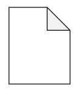
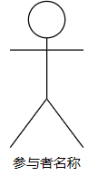
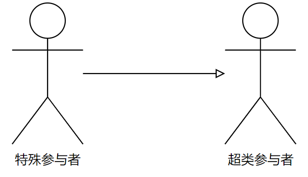
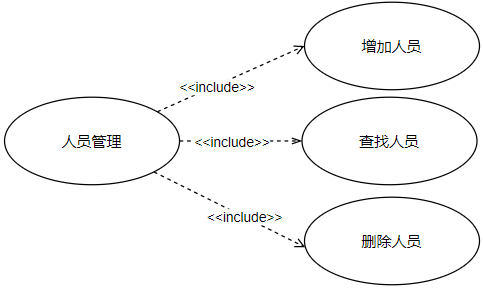
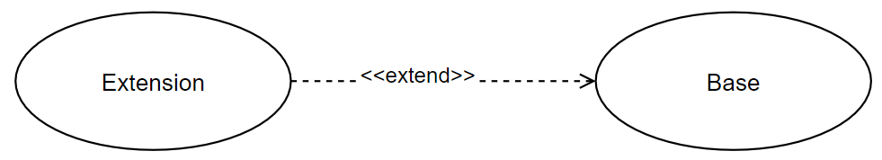
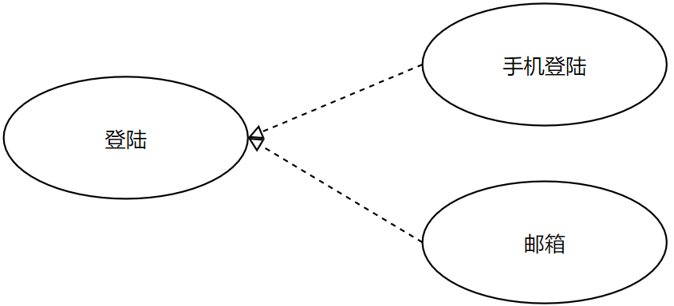

> 什么是用例图，构成用例图的要素，用例之间的关系，如何创建用例图

<!--more-->

## 用例图定义

> 由参与者(Actor)、用例(Use Case)以及它们之间的关系构成的用于描述系统功能的视图称为用例图

### 用例图作用

主要用于描述参与者和用例之间的关系，帮助开发人员可视化的了解系统的功能。借助用例图、系统分析人员、系统设计人员、领域专家能够可视化的方式对问题进行探讨，减少了大量交流上的障碍，便于对问题达成共识。

> 用例图可视化的表达了系统的需求，具有直观、规范等优点，克服了纯文字性说明的不足。

> 用例方法是完全从外部来定义系统功能，他把需求与设计完全的分离开。我们不用关系系统内部如何实现各种功能。

### 用例图绘制

用例：椭圆，然后将用例的名称放在椭圆的中心或椭圆下方中间位置

参与者：人形符号，指在使用系统或与系统交互中所扮演的角色

参与者与用例之间的关系：使用带箭头或者不带箭头的线段描述

- 箭头尾部表示启动交互的一方
- 箭头头部表示被启动一方

边界：用于区别系统内外，一般画图可省略

注释：

## 用例图的构成要素

### 参与者

> 存在于系统外部并直接与系统进行交互的人、系统、子系统或类的外部实体的抽象

每个参与者可以参与多个用例，每个用例也可以有多个参与者

在用例图中，使用一个人形图标来表示参与者，参与者的名称写在人形图标下面

### 参与者间的关系

参与者实质上也是类，所以拥有与类相同的关系描述，即参与者之间的关系主要是 **泛化** 关系(继承)

泛化关系：把某些参与者的共同行为提取出来表示成通用行为，并描述成超类。

### 系统边界

系统被认为是一系列相互作用的元素形成的具有特定功能的有机整体

一个系统本身又可以是另一更大系统的组成部分，因此系统与系统之间需要使用系统边界进行区分。把系统边界之外的同系统相关联的其他部分，称之为系统环境

### 用例规约

简要说明：对用例作用和目的做简要的描述

事件流：包括基本流和备选流。基本流描述的是用例的基本流程，指用例 **正常** 运行时的场景

用例场景：同一用例在实际执行时有很多不同情况发生，称之为用例场景，或者说 用例的实例

特殊需求：一个用例的非功能性需求和设计约束。包括可靠性、性能、可用性和可扩展性等

前置条件：执行用例之前系统必须处于的状态。例如：前置条件要求用户有访问的权限或者某个用例必须执行完成

后置条件：用例执行之后系统可能处于的一组状态

### 用例之间的关系

#### 包含

> 用例可以简单地包含其他用例具有的行为，并把它所包含的用例行为作为自身行为的一部分。

将复杂用例 `Base` 所表示的功能分解为较小步骤 `Inclusion`

**绘制**

箭头指向分解出来的功能用例

#### 扩展

> 在一定条件下，把 **新的行为** 加入到已有的用例中，获得新用例，叫做 扩展用例（`Extension`）
>
> **功能扩充**

扩展用例指向基础用例

#### 泛化

> 继承关系：一个父用例可以被特殊成多个 **子用例** ，父用例和子用例之间的关系就是泛化关系
>
> **同一功能的不同实现方式**

子用例还可以添加、覆盖、改变继承的行为。在UML中，用例的泛化关系通过一个三角箭头从子用例指向父用例来表示。

**绘制**

箭头指向父用例

