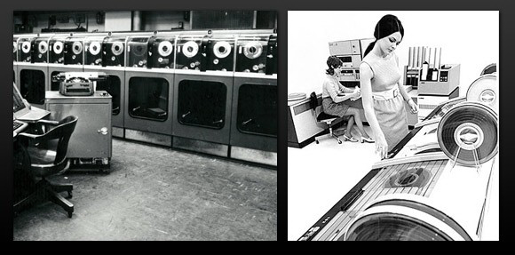
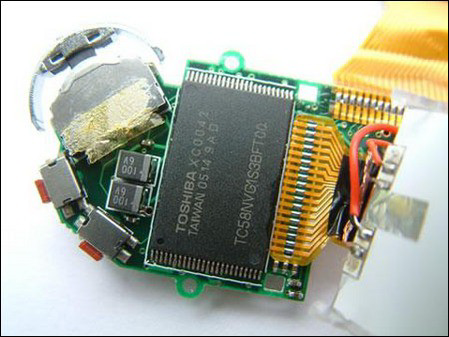
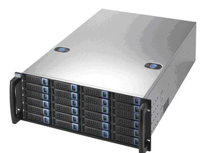

> https://blog.csdn.net/wtt2020/article/details/131723551

[TOC]

<!--more-->

## 0.1 信息、数据与存储技术史

### 0.1.1 数据

> 数据是对所有事物的数字表示

分为：

- 结构化数据：表
- 半结构化数据：带标签的数据，HTML
- 非结构化数据：图像、视频信息

#### 数据处理过程

> 人或机器对数据进行重组或重新排序，以增加其特定的价值

分为以下基本步骤：

1. 输入
2. 处理
3. 输出

#### 信息与数据

$$
数据=信息+数据冗余
$$

数据经过加工处理产生信息，可以理解为信息是对数据的解释

数据包含了信息：读入数据，相当于读入信息，产生另一种信息

数据可以保存在某种介质上，这些介质对计算机的刺激就产生了数字信息，对人脑刺激就产生了人类可感知的信息

### 0.1.2 信息

> 信息：理解为对大脑的一种刺激形式
>
> 物质通过信息机制被感知：任何物质都可以被表现为一种信息，只要信息存在，世界就存在，即世界可被认知
>
> 物质或者非物质，最后都是通过信息来表现。世界在生物眼中就是信息，世界通过信息来反映
>
> - 物质不可被感知不代表该物质不存在，只不过收不到该物质的信息，所以无法被感知

整个世界，就是信息之间的相互作用，信息影响着信息

随着人类相互之间交流的愿望越来越迫切，逐渐形成了通用的象形文字。有了文字之后，人们对每个文字加上了声音的表达，就形成了语言

- 也就是将一种形式的信息，转换成另一种形式的信息：人们用文字作为交流工具，将自己大脑产生的信息，通过这种方式传递给其他人。人类将大脑中的数据，变成语言编码然后通过声带的振动，通过空气这个大广播网，传递给网内的每个人

后来，人们将信息保存在介质上，如纸张、书本（活字印刷术）、激光打印机、纸带、软盘、硬盘、光盘

**信息经过数字化转变为数据才能被存储和传输**

#### 信息生命周期管理

- 数据创建：从客户端产生到保存到存储设备的过程
- 数据保护：与存储设备、存储方法、相关策略有关
- 数据访问：与客户端与存储设备相关
- 数据迁移：与存储设备相关
- 数据归档：对数据进行长期保存，并提供查询功能
- 数据销毁

### 0.1.3 数据管理与存储技术史

**信息存储是信息跨越时间的传递**，也是人类传承知识的主要手段。

在信息存储技术上，人类有超过万年的发明创造史。

- 早期人类利用石刻、泥板、竹简和羊皮等来记录信息
- 后来发明了纸张和活字印刷来保存和传播信息
- 近代发明了照相、录音和录像技术来存储信息。

利用这些发明和创造，人类留下了极为丰富的文字、绘画、图像、语音和视频信息。

#### 人工管理

早期的计算机，存储系统是纸带。纸带上时一些按一定规则排列的小孔，当这些小孔被银针穿过之后，银针便会接触到纸带下放置的水银槽，从而导通计算机上的电路，进行电路逻辑运算

- 选数管：1946年开发，电子存储装置，一种由直观存储转向机器存储的产物，256-4096bit

  

- 穿孔卡：用于输入数据和程序

  

  

- 穿孔纸带：用于输入和输出数据，一行代表一个字符

  

#### 数字化

从计算机的发明为开端，人类的信息技术进入了一个以 **数字化** 为特征的历史性新阶段。

- 各种形式的信息被转换成数字后，以容易的方式进行处理、传输和存储，然后再转换为各种形式的信息被人们所利用，使得数字化的信息呈爆炸性增长
- 特别是互联网的普及，大大加快了信息的流通过程，使得数字化信息加速产生，且进入生成式AI的大模型时代，计算机自身也会产生大量数据

计算机存储领域的一些虚拟化产品，本身就模拟了二级智能功能，可以连接任何不同型号品牌的存储设备，从这些设备上提取信息然后传输给主机

##### 文件系统管理

磁存储技术被发明出来后，首先出现的是软盘，其速度很慢，程序存储在磁盘后，计算机启动，CPU按照ROM中的指令一条一条执行，先是检查硬件。检查完毕之后，ROM中最后一条指令就是让CPU跳转到磁盘的0磁道来执行存储在磁盘中的程序。这些初始化程序直接以二进制的形式存储在磁盘上，载入执行之后，就启动了程序内核。每个程序都必须独立完成在该计算机上运行的所有代码

在磁盘技术上发明出来的是文件系统，目的是为了方便应用程序管理磁盘上的数据产生。实际上是操作系统的代码模块，

- 这段代码本身也是信息，也要存储在磁盘上。而且文件系统的代码也需要读取一些信息，才能完成功能
- 文件系统的元数据：用于描述文件系统结构的数据，这些元数据以文件的形式放在磁盘上

当代的科学家和工程师在最近的几十年中发明了磁存储、光存储、半导体存储等多种存储技术，其中大容量的硬盘在海量信息存储中扮演了主要的角色。硬盘的密度在短短几十年中增长了一百万倍以上。

- 磁带：1951年作为数据存储设备使用，20世纪70年代后期到80年代，出现小型盒式磁带，长度为90分钟的磁带每一面可以记录大约660KB的数据

  

  

- 磁鼓存储器：1932年，通常作为内存，大约10KB

  

- 硬盘：1956年

  

  

- 软盘：IBM在1971年引入，目前已被淘汰

  

- 光盘：1987年，存储密度不断提高，目前已经出现了CD-ROM、DVD、D9、D18、蓝光技术

  

- Flash芯片和卡式存储：集成电路的发展，固态硅芯片出现，其代表有专用数字电路芯片，通用CPU芯片，RAM芯片，Flash芯片（永久存储数据的芯片）1

  可以将Flash芯片用USB接口接入主机总线网络，这种集成USB接口的小型便携存储设备就是U盘，或者说叫闪存

  

##### 传统数据库系统管理

由**硬盘为基本单元**，通过各种 **总线、网络将硬盘连接** 成不同层次和规模的存储系统，就构成了我们目前的 **网络存储系统**。通过包含硬盘的大规模集群和文件系统形成的海量存储系统成为大型网站和数据中心新的存储架构。

人们发明了各种技术来提高存储系统的**容量、性能、效率、可用性、安全性和可管理性** ，如：存储虚拟化、归档存储、集群存储、云存储、绿色存储等新名词不断涌现，SSD固态存储、重复数据删除、连续数据保护、数据备份与容灾、数据生命周期管理等新技术

- 磁盘阵列：随着数据量爆炸增长，硬盘容量也不断爆炸，SATA硬盘目前一个盘体以达到TB级，机械硬盘：西数(22TB)，希捷(20TB)，SSD：Nimbus的ExaDrive DC，3.5寸规格的SSD，最大容量100TB

  同时硬盘的单碟容量也在不断增加，目前也达到TB级(2023)

  然而，单块磁盘目前所能提供的存储容量和速度已经远远无法满足需求，所以磁盘阵列就应运而生

  

- 大型网络化磁盘阵列：随着磁盘阵列技术的发展和IT系统需求的不断升级，大型网络化磁盘阵列出现了

  

##### 大数据管理

分布式存储设备

### 0.1.4 数据存储应用

## 0.2 数据的组织方式和访问类型

### 0.2.1 块存储

> 将数据分割为固定大小的块，每个块有一个唯一的地址，通过地址访问块。

- 采用“控制器+磁盘柜”的方式，基于专用的硬件和软件，支持块级别的读写操作
- 操作对象是磁盘
- 不提供文件系统功能，由主机或客户端进行文件系统格式化后才能进行数据管理(文件读写)

适用于：对性能、稳定性、数据一致性要求高的场景

- 核心数据库、金融/医疗等应用

### 0.2.2 文件存储

> 将数组织为文件和目录形式的层次结构，每个文件有一个唯一的路径，通过路径来访问文件

- 采用“x86+存储软件”的方式，基于通用的硬件和软件，支持文件级别的读写操作
- 操作对象的文件和文件夹
- 提供文件系统，可直接进行文件读写
- 支持多主机或客户端共享数据

适用于：对扩展性、吞吐率、存储功能要求高的场景

- 海量非结构化数据、云原生/容器/超融合等应用

### 0.2.3 对象存储

> 将数封装为对象，每个对象包含数据、元数据和全局唯一标识符，通过标识符来访问对象

- 采用“x86+存储软件”的方式，基于通用的硬件和软件，支持对象级别的读写操作
- 操作对象是Object
- 不提供文件系统功能，也不能随机访问和修改数据，只支持整体读写对象

适用于：对规模可扩展、容量巨大、成本低廉要求高的场景

- 图片、视频、音频等多媒体数据、云备份/归档等

### 0.2.4 区别

|              | 块存储                                                     | 文件存储                                                     | 对象存储                                     |
| ------------ | ---------------------------------------------------------- | ------------------------------------------------------------ | -------------------------------------------- |
| 数据存储方式 | 块                                                         | 文件                                                         | 对象                                         |
| 元数据       | 无                                                         | 部分元数据                                                   | 大量元数据                                   |
| 访问方式     | SCSI/FC等协议                                              | NFS或SMB等协议                                               | API或HTTP等协议                              |
| 识别方式     | 被操作系统识别为本地硬盘，并在其上创建文件系统             | 被操作系统识别为网络共享，并在其上创建文件夹和文件           | 不能被操作系统识别，并且无法创建文件系统     |
| 性能         | 最高性能，高速和低延迟的数据传输，实现数据的随机访问和修改 | 中等性能，实现数据的顺序访问和修改                           | 最低性能，实现数据的顺序访问和修改           |
| 成本         | 最高，需要专用光纤和专业知识                               | 中等，现有以太网基础设施和标准化设备，无需额外投资或专业技术人员 | 最低，利用云服务和底端设备实现，只需按需付费 |
| 可扩展性     | 最高，数百台服务器和数千台存储设备                         | 中等，数十台服务器和数百个存储设备                           | 无限的存储容量，但性能受限于网络带宽和延迟   |

### 0.2.5 相似点

|          | 块存储                                                     | 文件存储                                                     | 对象存储                                                     |
| -------- | ---------------------------------------------------------- | ------------------------------------------------------------ | ------------------------------------------------------------ |
| 数据共享 | 通过光纤扩展器或网桥实现远程或异地备份和恢复               | 通过互联网或VPN实现远程或异地访问                            | 通过API或HTTP等协议实现全球范围的对象访问和共享              |
| 数据冗余 | 使用RAID或镜像等技术实现数据冗余，提高数据的可靠性和可用性 | 使用复制或快照等技术实现数据冗余，提高数据的恢复能力和一致性 | 使用多副本或纠删码技术实现数据冗余，提高数据的持久性和容错性 |

## 0.3 存储基本概念

### 0.3.1 关注点

计算机存储领域研究的就是 **怎么样为计算机又快又高效地提供数据以便辅助其运算** 

- 高速：将多块磁盘做成RAID（Redundant Array of Independent Disks）系统，将每个独立的磁盘组成阵列，联合存储数据，加快存储速度

- 容量：传统的将硬盘放到计算机主机箱内的做法已经不能满足现代应用程序对存储容量的需求，就催生了网络存储技术

  将存储系统扩展到网络上，使存储设备成为了网络上的一个结点，以供其他结点访问。计算机可以通过网络来存取网络设备上的数据，关注的是如何通过网络向其他结点提供数据流服务。进而产生了相关联的技术：IT系统容灾技术等

### 0.3.2 基本概念

#### 存储硬件

存储介质：用于存放数据的物理材料，如磁带、磁盘、光盘、闪存等

- 冷数据(访问频度低)=大数据(成本+能耗)+长数据(介质寿命)

- 目前光盘发展现状：国际最高500GB/盘，国家重点研发1TB/盘

- 新一代冷存储

  - 全息光存储，2TB-8TB

  - 突破衍射极限的双光束超分辨技术

  - 玻璃多维永久光存储

    华科光电实验室[张静宇]，永久存储介质为玻璃，属于光存储

    目前微软大型玻璃存储光盘库已经量产，但读写速度有待提高，国内通过原理创新，实现旋转读写，提升读写速度(写入速度降到ps以下)，理论实验研究已经全部完成，等待量产

存储设备：用于读写存储介质上数据的机械或电子装置，如磁带机、磁盘驱动器、光驱、固态硬盘等

连接设备：HBA卡，交换机，连接线缆

#### 存储软件

- 存储管理软件
- 快照、镜像软件
- 备份软件
- 多路径软件

存储系统：由多个存储设备组成的逻辑单元，提供数据的存取服务，如：磁盘阵列RAID、文件服务器、对象存储设备等

存储网络：存储系统与计算机系统之间的链接方式和通信协议，如：直接连接(DAS)、网络连接(NAS)、块连接(SAN)等

#### 存储解决方案

存储架构：集中式存储和分布式存储

容灾解决方案

备份解决方案

## 0.4 存储架构

### 0.4.1 存储架构历程

- 外挂存储：存储于主机分离，DAS，使用JBOD(Just Bunch of Disks)

### 0.4.1 集中式存储

> 集中式存储：由硬盘组加上冗余纠错技术构成磁盘阵列，再将磁盘阵列通过局部高速网络连接形成存储区域网，将数据集中在存储局域网上，由控制器(机头)负责对存储局域网中的数据进行处理和控制，客户端只负责数据的输入和输出

**特点**

- 采用”控制器+磁盘柜“的方式，基于专用的硬件和软件
- 数据组织和访问方式为：块存储和文件存储

人们发明了各种技术来提高存储系统的**容量、性能、效率、可用性、安全性和可管理性**

- 存储虚拟化、归档存储、集群存储、云存储、绿色存储等新名词不断涌现，SSD固态存储、重复数据删除、连续数据保护、数据备份与容灾、数据生命周期管理等新技术

#### RAID

RAID (Redundant Array of Independent Disks) 是数据存储虚拟化技术，将多个物理磁盘驱动器组合成一个或多个逻辑单元，用于数据冗余、性能提升或二者兼得。

|        | 含义                                                         | 优点                                                         | 缺点                                                         | 适用                                                         | 建议               |
| ------ | ------------------------------------------------------------ | ------------------------------------------------------------ | ------------------------------------------------------------ | ------------------------------------------------------------ | ------------------ |
| RAID0  | **磁盘条带化技术** ：将数据分块，平均分布在多个磁盘上，没有冗余数据 | 可同时访问多个磁盘，提升数据的读写速度和利用率               | 没有容错能力，一旦某个磁盘故障，整个阵列都会失效，导致数据丢失 | **高性能，低成本** ：对数据安全要求低的场景，如视频编辑、游戏等 | 至少1块盘，建议2块 |
| RAID1  | **磁盘镜像技术** ：将两个或多个磁盘完全镜像，存储相同数据，实现一对一存储 | 提高数据的可靠性和可用性：任何一个磁盘出现故障，另一个磁盘仍然可以正常工作，并且可以快速恢复 | 降低数据的利用率和写入速度：需要同时写入多个磁盘             | **高安全，不计成本** ：对数据安全要求高，但对性能要求不高的场景，如文件服务器、数据库服务器等 | 最少两块盘         |
| RAID5  | **基于奇偶校验的数据冗余技术**： 将数据分成块，分布在三个或多个磁盘上，并且在每个磁盘上存储一部分奇偶校验信息（校验信息用于恢复磁盘故障丢失的数据） | 提高数据的读取速度和容错能力：可以同时访问多个磁盘，并且可以容忍一个磁盘的故障 允许一个磁盘故障 | 降低了写入速度和利用率：需要计算和写入奇偶校验信息，并且牺牲了一个磁盘的空间 | **均衡，成本优先** 对读取性能要求高，但对写入性能要求不高的场景，如文件服务器、邮件服务器等 | 至少三块盘         |
| RAID6  | RAID6在RAID5上增加了一层校验信息，分布在4个以上的磁盘上      | 允许两个磁盘故障 进一步提高数据的可靠性和可用性         | 降低了写入速度和磁盘利用率：需要计算和写入两层奇偶校验信息，并且牺牲了两个磁盘的空间 | **极安全，性能不高** 对数据安全要求极高，但对性能要求不高的场景，如备份服务器、归档服务器等。 | 至少四块盘         |
| RAID10 | 将RAID1和RAID0结合，将两个或多个RAID1的镜像阵列条带化        | 提供最佳的性能和可靠性：提高数据读写速度和容错能力，可以同时访问多个磁盘，并且可以容忍一个或多个磁盘损坏 | 需要大量的磁盘和成本：至少需要四个磁盘，并且牺牲了一半的空间 | 对性能和数据安全要求都很高，且盘足够的场景，如数据库服务器、交易服务器 | 至少四块盘         |

##### RAID硬盘要求

硬盘的兼容性：确保硬盘和主板或RAID卡是兼容的，否则可能会出现无法识别或性能下降

硬盘的规格：选择相同或相近规格的硬盘做RAID(容量、转速、缓存等)。若使用不同规格的硬盘，RAID性能和容量会受影响。

- RAID容量等于最小容量的硬盘成盘数
- RAID性能等于最慢的硬盘

硬盘质量：质量可靠、寿命长、故障率低的硬盘做RAID，提高数据安全性和稳定性

#### 网络存储架构

由**硬盘为基本单元**，通过各种 **总线、网络将硬盘连接** 成不同层次和规模的存储系统，就构成了我们目前的 **网络存储系统**。

传统存储系统指集中式存储，主要经历了三个发展阶段：直接附加存储(Direct-Attached Storage,DAS)、网络附加存储(Network-Attached Storage,NAS)、存储区域网络(Storage Area Network,SAN)。NAS是将存储设备连接到网络上，通过网络共享协议向主机提供数据和文件服务；DAS指存储设备与使用存储服务的服务器通过总线适配器或SCSI/FC线进行连接，也被称为近线存储，由于接口速率、数量、铜缆长度等问题，DAS所支持的主机数量少，并且DAS的性能瓶颈在于服务器，在数据访问时，所有的数据都需要经过服务器转发；SAN是一种高可用、高性能的存储网络，用于连接服务器与存储设备，SAN向主机提供块存储，主机访问块存储(LUN)、然后在其中创建文件系统，文件系统由主机端维护。

存储网络架构按服务器类型分为开源存储系统和闭源存储系统

- 闭源存储系统：主要指大型专用计算机系统
- 开源存储系统：基于Windows、Linux等操作系统的服务器

对于开源存储系统，按照存储连接方式分为：

- 内置存储：直接与计算机CPU或主板相联的存储设备，如：内存、Cache等
- 外置存储：分为DAS直连式存储和FAS(Fabric-Attached Storage)网络接入存储

网络接入存储根据网络传输协议分为NAS和SAN

##### DAS-直连附加存储

> 存储设备与使用存储服务的服务器通过总线适配器或SCSI/FC线缆连接的技术

**内置DAS**：存储设备通过服务器机箱内的并/串行总线与服务器相联(IDE、SATA)

**外置DAS** ：存储设备与服务器通过总线直接相联，通过FC、SCSI协议通信

- 将JBOD（Just bond of disks,磁盘簇）做RAID，通过服务器连接，提高数据安全性

**分析**

优点：本地数据优势明显、成本低、见效快、系统可靠性高

缺点：数据传输距有限、存储所能连接设备数有限、资源共享受限、数据备份操作负载、依赖的服务器本身容易称为系统瓶颈、设备设备分散不便管理

##### NAS-网络附加存储

> 文件共享服务，存储系统有自己的文件系统：将存储设备通过网络连接到服务器上，通过网络共享协议向服务器提供数据和文件服务
>
> - 常用网络共享协议：CIFS(Windows)、NFS(Linux)、FTP、HTTP、NDMP等

文件系统由存储设备维护，用户访问文件系统，不直接访问底层存储

优点：

- 共享性：拥有所有服务器上文件与底层存储的映射，利于共享
- 集成了存储设备、网络接口和以太网技术，通过网络直接访问数据，快速实现部门级存储容量的需求和文件传输需求
- 灵活性：具有自己的操作系统和存储空间，兼容各种操作系统

缺点：

- 易受网络影响：
  - 存储数据通过网络传输，易产生数据泄露等安全问题
  - 使用用户的业务网络传输数据，当网络上有大数据流量时，影响业务传输
- 存储只能以文件形式访问，不能像普通文件系统一样直接访问物理数据块，某些情况下严重影响系统效率

##### SAN-存储区域网络

> 存储设备通过光纤连接到服务器上，实现块级共享
>
> SAN是一种高可用高性能的存储网络，用于连接应用服务器与存储设备的存储架构，这个网络专用于主机和存储设备之间的访问

SAN向主机提供块存储，主机访问块存储(LUN)、然后在其中创建文件系统，文件系统由主机端维护

优点：

- 提供高速、高可靠、高安全的数据传输网络
- 支持数百个磁盘，提供海量存储空间
- 易于扩展

缺点：

- 需要单独建立光纤网络
- 异地扩展困难
- SAN阵列柜和SAN必须的光线通道、交换机价格昂贵

主机与主机间的文件系统并不同步，即不支持文件共享

- 当用户1与用户2访问存储数据时，对于用户2来说，他不知道用户1使用的哪些存储资源，那用户2就有可能写入资源覆盖了用户1的资源
- 解决方案：使主机之间使用的存储资源进行同步，称为集群文件系统。通过在主机上安装相应的软件来实现。集群文件系统支持主机同步的最大数量为128台左右

###### IP SAN与FC SAN对比

FC SAN和IP SAN是两种存储区域网络(SAN)的技术

**相同点**：

- 数据存储方式都是块级存储，提高数据的访问速度和效率
- 支持多种文件系统和操作系统
- FC SAN和IP SAN都可以实现存储的集中化、虚拟化和管理，提供高可用性、高可靠性和高可扩展性

**差异**：

本质上是网络协议与硬件设备的不同，因此二者在性能，成本，兼容性等方面也有所不同

- FC SAN使用
- IP SAN使用

|            | IP SAN                                                       | FC SAN                                                       |
| ---------- | ------------------------------------------------------------ | ------------------------------------------------------------ |
| 硬件       | 互联网协议和以太网设备，如网卡、路由器、交换机、磁盘阵列等   | 光纤通道协议和光纤设备，如光纤卡、光纤交换机、光纤盘阵等     |
| 网络       | IP网络                                                       | 单独的光纤网络和HBA卡                                        |
| 传输距离   | 理论上没有距离限制                                           | 受光纤传输距离的限制                                         |
| 性能       | 较低性能：需要在TCP/IP层上封装SCSI命令，增加开销；受限于以太网速率，1Gbps或10Gbps | 高性能：低延迟和高吞吐量；可提供32Gps带宽                    |
| 成本       | 性价比高：可使用现有的以太网基础设备和标准化的设备           | 购买、维护(人员、系统设置与监测等)成本高                     |
| 兼容性     | 高：可使用任何兼容IP协议的网络设备和软件，无需考虑厂商和版本差异 | 差：需要使用符合FC标准的设备或软件，并且存在不同厂商或版本差异 |
| 管理、维护 | 简单                                                         | 复杂                                                         |
| 容灾       | 可实现低成本的本地和异地容灾                                 | 容灾的硬件、软件成本高                                       |
| 安全性     | 较低                                                         | 较高                                                         |

#### 传统存储存在问题

- 性能瓶颈：传统集中式存储系统都使用专用的存储设备，存在明显的性能瓶颈。专用存储设备主要由控制单元和存储单元组成：控制单元中直接与外界交互的机头，会有数据吞吐量的限制，产生性能瓶颈；存储单元中RAID卡或总线的带宽也都有一个上限，这个上限在一定程度上也会影响集中存储的性能瓶颈。
- 不同厂家传统存储之间具有差异性，不方便同一管理
- 专用存储设备的成本高（远高于x86服务器价格）
- 传统的SAN、NAS扩展能力受限，不能满足大规模存储应用的需要

### 0.4.2 分布式存储

> 将数据分散存储在多台网络计算机上，每台计算机都可提供数据的读写服务，计算机之间通过消息传递来通信和协调

**特点**

- 采用“标准X86服务器+存储软件”
- 数据组织和访问方式为：块存储、文件存储、对象存储

分布式存储的基本原理是存储资源虚拟化：通过在服务器（称之为存储服务器）上安装相应软件（如FusionStorage），将各个服务器上的HDD、SSD等存储介质资源虚拟成一个大的存储资源池，将分散的存储资源整合到一起，在保证可靠性的同时提供多种存储服务。

为保证数据存储的性能与高可用性，传统存储提出诸如RAID0、RAID1、RAID5、RAID2.0等机制，而RAID在分布式存储中并不可用，因此提出了多副本和纠删码等新的数据保护方式。

### 0.4.3 集中存储与分布式存储对比

**集中存储**

优势：

- 架构简单，无需考虑多节点间的分布式协作问题

- 技术成熟，对高IOPS、低延时、数据强一致性有很好支持

  I/O路径短，访问延迟小

  性能高，稳定性好

- 通过RAID+电池保护、双活、容灾等技术保障数据安全性和业务连续性

劣势：

- 扩展性差：无法很好支撑高并发访问性能和海量数据场景
- 专用硬件成本高，TCO成本高
- 存在单点问题，一旦主机出现故障，整个系统将不可用
- 市场份额越来越小，人才培养成本高

**分布式存储**

优势：

- 可扩展性高：可扩展至上千个节点，容量扩展到上百PB甚至EB级，性能随容量线性提升
- 性能高：多个节点同时提供读写服务，具有很高的吞吐率
- 可靠性：使用多副本或纠删码技术实现数据保护
- 成本低：使用标准化硬件搭建存储平台，降低硬件采购和维护成本
- 支持三种存储功能（块、文件、对象），能够打造统一的数据存储平台

劣势：

- 部署复杂，需要考虑多节点间的分布式写作问题

- 技术不够成熟，较集中式存储，稳定性差，对低延时、数据强一致性支持不好

  I/O路径长，访问延迟高，性能低

  需要处理分布式并发、缺乏全局时钟、故障总是会发生等问题

### 0.4.4 适用场景

- **集中式存储适合**：核心数据库、金融/医疗等对性能、稳定性、数据一致性要求高的场景。
- **分布式存储适合**：海量非结构化数据、云原生/容器/超融合等对扩展性、吞吐率、存储功能要求高的场景。

