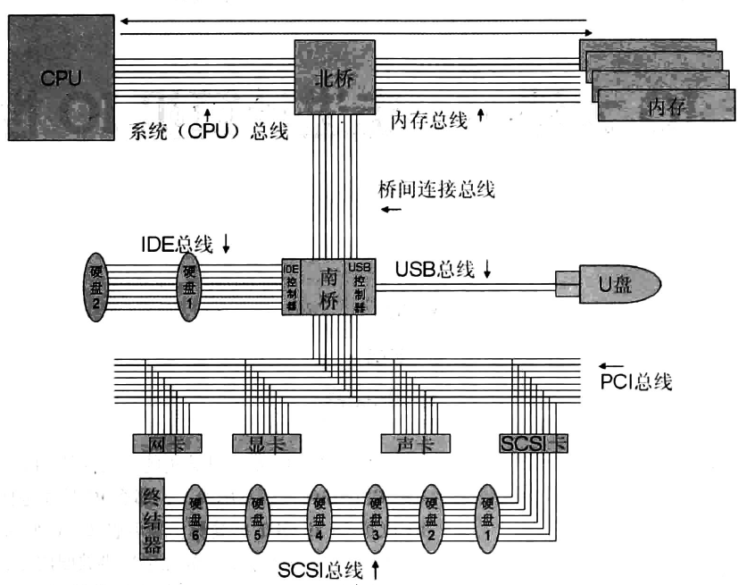

> 学习资料：大话存储 存储系统底层架构原理极限剖析  终极版 张冬编著——清华大学出版社 2015.01

[TOC]

<!--more-->

## 0.1 序

书中内容涉及：

- 计算机IO基本概念

- 硬盘物理结构、盘片数据结构和工作原理；
- 七种常见的RAID原理详析以及性能细节对比，
- 虚拟磁盘、卷和文件系统原理
- 磁盘阵列系统
- OSI模型
- FC模型
- 众多磁盘阵列架构

同时也涉及很多新兴技术：

- 机械硬盘
- SSD
- FC/SAS协议
- HBA卡
- 存储控制器
- Thin Provision自动精简配置
- 数据容灾
- 应用容灾
- 业务容灾
- 性能优化
- 存储系统IO路径
- 云计算与云存储

## 0.3 IO

IO就是IN和OUT建成。CPU需要从内存中提取数据来运算，运算完毕后再放回内存，或者直接将电信号发向一些针脚以操作外部设备

- 对于CPU来说，从内存提取数据，叫做IN；运算完后将数据直接发送给某些针脚或放回内存，叫做OUT
- 对于磁盘来说，IN指数据写入磁盘的过程，OUT是指数据从磁盘读出来的过程

数据在每个部件不断进行IO过程，传递给CPU由其运算处理，再经过IO过程，最终到达输出设备

### 0.3.1 三种总线

当代计算机中，IO通过共享 **数据总线** 的方式来实现。

> 总线是一条或多条物理上的导线，每个部件连接到这些导线上，导线上的电位每个时刻都相等，这样总线上的所有部件都会收到相同的信号

**半双工工作模式** ：同一时刻只能有一个部件在接收或者发送

**仲裁总线** 或 **中断总线** 上给出的信号来判断某个时刻总线由哪个部件来使用

- CPU运行操作系统内核的设备管理程序，产生控制信号

### 0.3.2 网络三元素模型

> 网络：将所有要通信的节点 **连** 起来，然后 **找** 到目标，找到后就 **发** 送数据

1. 连

   将网络上各部件连接起来，可以通过HUB总线，以太网，电话交换，无线，直连，中转等。每个网络点到其他网络点总有通路

2. 找：编址+映射

   通过命名建立区分机制。任何节点，不管所在的环境使用什么命名方式，到了网络层，都需要使用IP地址根据TCP/IP协议，实现节点与节点无障碍的通信

3. 发

   传输层需要保证发送数据。

### 0.3.3 计算机网络系统

#### 连

CPU和内存时一个冲突域，IO总线是一个冲突域，桥接芯片将这两个冲突域桥接起来

##### 多层PCB

主板上每个部件都是通过总线连接起来的，总线的条数与位宽相关（CPU按其内部寄存器到运算单元之间的总线数目来确定位数）。

- 部件交换数据的 **数据总线**
- 确认通信时目标设备的 **地址总线**
- 互相传递控制信号的 **控制总线**
- 中断与仲裁用的 **仲裁总线**

导线之间很密集，在高频振荡时会产生很大干扰，所以人们将这些导线印刷到不同电路板上，然后再将这些电路板压合起来，形成一块板——**多层印刷电路PCB**

每块板上的导线数量降低，板与板之间的信号屏蔽性更好

##### 北桥

> CPU和内存速度很快，他们之间单独用一条总线连接。这个总线和慢速IO之间通过一个桥接芯片连接——主板上的 **北桥芯片**
>
> - 北桥芯片连接了CPU、内存和IO总线

CPU和北桥之间的连线叫 **系统总线(前端总线)** 

- CPU自身频率表则表示CPU运算时电路的频率
- 总线频率相当于CPU向外部存取数据时的数据传输速率

##### 南桥

> 由于北桥速度太快，IO总线速度相对于北桥很慢，所以北桥和IO总线之间往往要增加一个网桥，叫 **南桥** 
>
> - 在南桥上，集成了众多外设的控制器，如磁盘控制器，USB

###### PCI总线

> PCI总线：目前计算机、服务器普遍使用的一种南桥与外设连接的总线技术

用于传递外设的数据信号，可以终结在一个插槽，用于将PCI接口的板卡插入PCI总线，也可以直接与外设连接（一般用于集成在主板上的设备）

**PCI总线的地址总线和数据总线是分时复用的**

- 节省接插件的管脚数
- 便于实现突发数据传输

**数据传输**

数据传输时，一个PCI设备作为发起者（主控，Initiator，Master），另一个PCI设备作为目标（从设备，Target，Slave）。总线上所有时序的产生与都由Master发起

由于是总线式，所以同一时刻只能有一对设备完成数据传输，需要 **总裁机构** 决定总线使用优先级

1. 当PCI总线进行操作时，Master先置 `REQ#` 信号，用来请求总线使用权，当得到仲裁器的许可( `GNT#` 信号)，会将 `FRAME#` 信号（传输开始或结束信号）置低，并在地址总线(分时复用数据总线)上放置Slave地址，同时 `C/BE#` （命令信号）放置命令信号，说明接下来的传输类型
2. 所有PCI总线上的设备都需要对此地址译码，被选中的设备要置 `DEVSEL#` （被选中信号）以声明自己被选中。当 `IRDY#` （Master可以发送信号）和 `TRDY#` （Slave可以发送信号）都置低时，可以传输数据。
3. 当Master数据传输结束前，将 `FRAME#` 置高位表明只剩最后一组数据要传输，并在传送数据后放开 `IRDT#` 以释放总线控制权

**PCI总线的中断共享**

PCI总线可以实现中断共享，即不同设备使用同一中断而不发生冲突

- 对外之可见PCI上有中断请求

硬件上，采用电平触发：中断系统一端接高电阻，在要产生中断的板卡上用三极管的集电集将信号拉低。不管有几块板产生中断，中断信号都是低电平；当所有办卡上的中断都得到处理后，中断信号才恢复高电平

软件上，采用中断链方式：系统启动时，扫描所有板卡，若板卡 A 使用了中断7，则将中断7的内存区指向板卡 A 的中断服务程序入口 `ISR_A` ，若还有板卡B也使用了中断7，则将 `ISR_B` 头插入中断7链表。当中断发生时，系统跳转到中断7对应的内存，轮询中断7的中断链，直至找到板卡相应的中断服务程序

#### 找

主机总线中的设备地址映射。每个IO设备启动时，都要向内存中映射一个或多个地址，地址8bit，称为IO端口。

被北桥芯片重定向到总线上世实际的设备上

#### 发

1. CPU将IO地址放到系统总线上，北桥收到后，会等待CPU发送第一条针对这个外设的指令，CPU会发送三条指令：

   - 第一条：指令包含了表示当前指令是读还是写的位，以及其他选项(操作完成是否需要中断通知CPU处理，是否启用磁盘缓存等)
   - 第二条：指明应该读取的硬盘逻辑块号（LBA）
   - 第三条：给出读取出来的内容应该存放到内存中哪个地址

   这3条指令被北桥依次发送到IO总线上的磁盘控制器执行

2. 磁盘控制器接收到第一条指令，知道是读/写指令，且知道一些相应的操作选项

   等待下一条指令，即逻辑块号

   接收到逻辑块号后，会进行映射，一个逻辑块会对应多个扇区。定位完成后，等盘体转到扇区后，控制器会驱动磁头寻道，磁头开始读取数据

   在读取数据的同时，会接收到第三条指令，数据读出后，可以直接通过DMA技术（磁盘控制器可以直接对内存寻址并执行写操作，不需要CPU参与）

   数据存入内存后，CPU就从内存中取数据，进行其他运算

CPU实际是对 南桥上集成 或 通过PCI接入IO总线 的控制器发出对磁盘的指令，控制器再将这些指令翻译成内部指令执行操作。CPU只需要知道待操作设备的设备号、逻辑地址与对逻辑地址的操作，这些信息都由磁盘控制器驱动程序产生

