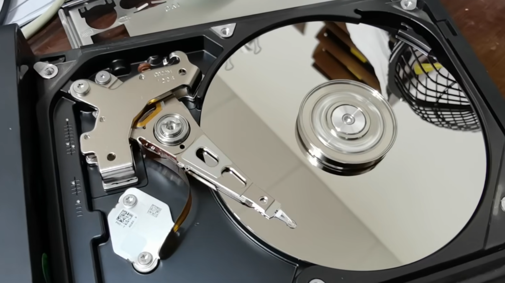
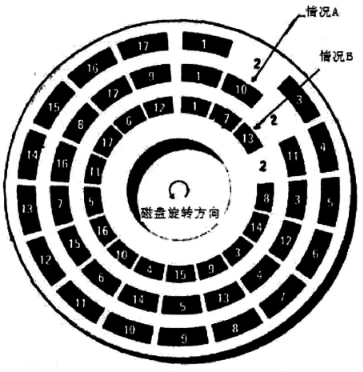

[TOC]

<!--more-->

## 1.0 磁存储器

### 1.0.1 磁存储器分为磁带和磁盘

磁带存储流式记录

- 流式：数据连续不断地存储在介质上。流之间有间隙，便于磁头快进定位到这个位置，但定位速度比块式慢
- 记录的数据是模拟数据
- 磁带的设计是为了满足大容量数据存储的需要，磁带存储容量大于磁盘。同等容量的磁带造价比磁盘低
- 磁带被用来做数据备份

磁盘存储块式记录

- 块式：将数据分为一块一块地存储在介质上，支持随机读写
- 记录的是数字信号
- 定位某个块的速度比流式记录快，可以直接选择读写某一块数据
- 磁盘可以作为实时存储，因为可以定位到某个数据块

### 1.0.2 磁盘

**硬盘存储原理** ：将数据用其控制电路通过硬盘读写头（Read Write Head）去改变磁盘表面上极细微的磁性粒子簇的N、S极加以存储，并人为定义1、0

- 软盘：将布满磁性粒子的一片圆形软片包裹在一个塑料壳中，中间开孔，将软盘插入驱动器，电机就会带着这张磁片旋转，同时磁头也夹住磁片进行数据读写。
- 硬盘

## 1.1 硬盘结构与数据组织

### 1.1.1 硬盘结构

> 硬盘主要由盘片，读写磁头组，马达，底座，电路板，步进电机组成

#### 盘片

盘片的基板由金属或玻璃材质制成，为达到 *高密度，高稳定性* 的要求，基板要求表面光滑平整，不能有任何瑕疵，然后将 **不含杂质，细微的** 磁粉 **均匀溅镀** 到基板表面，然后涂上保护润滑层。

- 盘片不能有任何污染，制造全程必须在高洁净度的无尘室中进行

- 必须在无尘室中才能拆解维修

  磁头利用气流漂浮在盘片上，如果磁头距离盘片太高，读取到的信号太弱，太低又会磨损盘片表面。硬盘驱动器磁头的飞行悬浮高度低，速度快，任何异物和小的尘埃进入硬盘密封腔内或者磁头与盘体发生碰撞，就可能造成数据丢失形成坏块，甚至造成磁头和盘体损坏

磁盘为了存储更多的数据，必须将磁性粒子簇溅镀到磁头可定位的范围内，并且磁性粒子制作的越小越好（密度大）

#### 磁头

磁盘读写头为了能在磁盘表面高速移动，需要漂浮在磁盘表面上，不能接触盘面

早期的硬盘在每次关机前，都需要运行一个 `Parking` 程序，其作用是让磁头回到盘片的最内圈的一个不含磁粒子的区域，称为 **启停区** 。硬盘不工作时，磁头停留在启停区，当需要从硬盘读写数据时，盘片先开始旋转，旋转速度达到额定速度后，磁头就会因盘片旋转产生的气流抬起来，这时磁头才向盘片中存放数据的区域移动。

- 完全是靠磁盘旋转时产生的气流，利用空气动力学使磁头悬浮于磁片上方

磁头在盘片上方的距离，要避免擦伤磁性涂层，更重要的是不能让磁性涂层损伤磁头，也不能离盘面太远，否则不能使盘面达到足够强的磁化，难以读取盘上的信息

- 漂浮距离越小，磁头读写数据的灵敏度越低，对硬盘各部件的要求也越高

- 硬盘驱动器磁头的寻道伺服电机采用音圈式旋转或直线运动步进电机，在伺服跟踪的调节下精确地跟踪盘片的磁道，所以硬盘工作时，不能有冲击碰撞，搬运也需要轻拿轻放

#### 步进电机

为了让磁头精确定位到每个磁道，（精度要求高）必须使用步进电机，利用精确的齿轮组或者音圈，每次旋转可以仅仅使磁头作微米级径向移动，用以变换磁道

**齿条传动的步进电机传动装置** ：固定推算的传动定位器

**音圈电机传动装置** ：采用伺服反馈返回到正确的位置

### 1.1.2 数据组织方式

每个盘片的每个面都有一个读写磁头，磁头起初停在盘片最内圈不存放任何数据，称为 **启停区（着陆区）** 。启停区外是数据区，在最外圈，离主轴最远的地方就是0磁道，硬盘数据存放从最外圈开始。

- 0磁道检测器：0磁道存放这用于操作系统启动所必需的程序代码，因为PC启动后，BIOS程序在加载任何操作系统或其他程序时，总是默认从磁盘的0磁道来读取程序代码运行

#### 柱面Cylinder

##### 磁道

磁道格式化时划分为很多同心圆，这些同心圆轨迹称为磁道。

磁道从最外圈向最内圈从0开始顺序编号。

这些磁道角速度相同，可知外圈磁道比内圈磁道线速度快，因此外圈磁道的读写速度比内圈快

所有盘面上的同一磁道，在竖直方向上构成一个圆柱，称为柱面

- 柱面从0开始编号

**选取磁头只需要电子切换**，**选取柱面需要机械切换** ——**寻道** 

电子切换相当快，比使用机械将磁头向相邻磁道移动快，所以数据的读写按柱面进行，这样可以减少寻道的频率，提高硬盘的读写效率

**柱面数(磁道密度)**

一个硬盘驱动器上的柱面数既取决于每条磁道的宽窄，也取决于磁头决定的磁道间步距大小。

- 磁头足够精细，定位距离足够系哦啊，则会获得更高的磁道数和存储容量（原子探针）
- 磁头太大，则磁道数需要相应将降低以容纳这个磁头，这样磁道和磁道之间的磁粉无法利用

#### 盘面Header

每个盘片有两个盘面，每个盘面都能用于存储数据，成为有效盘面。每个有效盘面都有一个盘面号，按从上到下的顺序从0开始依次编号。

盘面号又称为磁头号：每个有效盘面都有一个对应的读写磁头

#### 扇区Sector

数据在同一磁道上不是连续存储，而是将一条磁道等距离地划分为多个扇区，每条磁道上的扇区从1开始编号

每个扇区中的数据作为一个单元同时读出或写入，是读写的最小单位，在一个扇区内的数据是流式记录的

- 对于磁盘来说，一次磁头的连续读或写叫做一次IO。而一次连续读或写的过程，不断占用多少扇区，即使有剩余部分，下次IO会开辟新的扇区开始读写

  广义上的IO：计算机体系结构中，不同层次需要有交互，将每次通过接口在不同层之间的交互称为广义的IO 

  上层IO可能对应多次下层IO，即越向下，越密集、复杂

  如：OS的一次文件系统内核调用，对应卷的N个IO，对应卷到控制器驱动的 $N\times N$ 个IO

划分磁道和扇区的过程，称为 **低级格式化** 

- 高级格式化是对磁盘上所存储的数据进行文件系统的标记
- 低级格式化可能会破坏磁道上的全部数据，现在极少采用

每个扇区分为两部分：

- 扇区头标：存放扇区信息的标识符

- 数据段：存放数据

- ECC码：

  读数据，控制电路会先计算此数据的ECC码，然后把ECC码与已记录的ECC码相比较

  写数据时，控制电路会计算出此数据的ECC码，存储在数据部分的末尾

##### 扇区头标

**扇区地址**

CHS：

- 柱面号Cylinder $10$ bit ——0-1023

- 磁头(盘面)号Header： $8$ bit——0-255

- 扇区Sector：$6$ bit——1-64 

  一个扇区容量一般为 $512$ B，由于目前很多大型磁盘阵列使用的硬盘需要校验信息之类的特殊存储，这些磁盘被格式化为 $520$ B

磁头通过读取当前扇区头标中的CHS地址，可以知道磁头当前处于盘片上的位置
$$
容量=柱面数\times 磁头数\times 扇区数\times 扇区容量\\
理论最大容量=\frac{1024\times 256\times 64\times 512}{2^{20}} B=8024MB
$$

- 实际情况，一个磁盘不可能放下256个磁头，一般情况有1,2,4盘片，对应的2,4,8个磁头，通过增加扇区数量来抵消磁头数减少的影响。但CHS编址方式会达到极限容量，所以产生了LBA编址

---

LBA：磁盘对外提供的地址全部为线性地址

在后续的发展中，每个磁道的扇区数也不同，外圈可以容纳的扇区可以更多，这时CHS地址不再适用，采用了LBA（Logical Block Adderss,顺序编址）

磁盘中的控制电路要找到某个LBA地址对应的物理地址，这种映射关系保存在磁盘控制电路的ROM芯片中，磁盘初始化的时候载入缓存以便随时查询

- LBA1表示0号盘片0号柱面的1号扇区

**其余信息**

- 可用字段，表示扇区是否能可靠存储数据，或者是已发现某个故障因而不能使用的标记
- 指示字：在原扇区出错时指引磁头跳转到替换扇区或磁道
- CRC校验值：控制器检验扇区头标的准确情况
- 交叉因子，磁头扭斜

##### 扇区编号和交叉因子

若扇区编号采用连续编号的方式，磁盘控制器电路在处理一个扇区的数据期间，可能因为磁盘转速过快，磁头已经进入下一扇区的头标部分，只能等下一圈才能读写下一扇区

**交叉因子** ：$n:1$ 表示连续两个编号之间相隔 $n-1$ 个扇区

- 即读完一个磁道盘片转 $n$ 圈

- 情况A：$1:1$
- 情况B：$2:1$

交叉因子的确定是一个系统级问题

- 取决于磁盘控制器速度、主板的时钟速度、与控制电路相联的输出总线的操作速度

在早期的硬盘管理工作中，设置交叉因子需要用户自己完成。用BIOS中的低级格式化程序对硬盘进行低级格式化时，需要指定交叉因子

- 每个磁道都可以有各自的交叉因子，设置不同的值比较性能，最佳交叉因子的磁道比其他磁道的工作速度快
- 现在的硬盘BIOS已经有了自己自己解决了，不再提供这一设置选项

##### 读写过程

系统将文件存储到磁盘上时，按 $柱面\rightarrow 磁头(盘面)\rightarrow扇区$ 的方式进行

- 首先是第1磁道的第1磁头下的所有扇区，然后是同一柱面下的下一磁头，直至整个柱面存满。只有在同一柱面下的所有磁头全部读写完毕后，才转移到下一柱面

读数据时，告诉磁盘控制器要读出数据所在的柱面号，磁头号和扇区号进行读取。磁盘控制电路将磁头部件步进到相应的柱面，选中相应的磁头，然后立即读取磁头下所有扇区头标，然后将头标中的地址信息与期望的磁头号、扇区号做对比，直至相同后，磁盘控制电路让磁头立刻开始读写数据

##### 换道与磁头扭斜

> 从同一盘面的一个磁道转到另一磁道，称为换道

假定情况，大文件，写满一个柱面后要写下一柱面，且设置了最佳交换因子，机械切换时间超时，导致换道完成后越过了目标扇区，需要以原先磁道所在的位置为基准，将新的磁道上全部扇区号移动几个扇区的位置，称为 **磁头扭斜**

- 只在极特殊情况下发挥作用：大文件，超过磁道结尾进行读出或写入
- 扭斜设置不正确所带来的期望损失比采用不正确的扇区交叉因子带来的损失小得多
- 一般由厂家设置，不需要更改

交叉因子与扭斜可用专用工具软件来修改和测试，

### 1.1.3 磁盘控制电路

**磁性分子** ：指磁头可以感应到磁性的最小区域

所以从磁盘原理上看，磁盘和磁带都是利用线性中的段，根据这一区域上的一片分子式N极还是S极，然后将其转换成电信号，也就产生了字节，从而记录了数据。

需要控制部件确保数据可以稳定和快速读出

实际上不会有这么多独立的芯片，硬盘厂家在设计电路时选取高度集成的IC芯片

## 1.2 磁盘性能

### 1.2.1 影响因素

**磁盘在每一个时刻只允许从一个磁头上读写数据**

- 盘体内磁头数量不能提高磁盘的吞吐量和IO性能，只能提高容量

#### 转速

> 盘片转的越快，数据传输时间就越短，在连续IO情况下，磁头臂寻道次数就很少

#### 寻道速度

随机IO情况下，磁头臂需要频繁更换磁道，用于数据传输的时间相对于换到消耗的时间来说都很少，不在一个数量级

##### 队列技术

磁头的电子切换比机械换道速度快很多，对于磁盘的IO请求，可以通过排队提高读写效率

###### 基于队列的磁头扫描算法

负载不高：SSTF性能最佳，但会存在IO饿死情况

负载高：SCAN，C-SCAN,C-LOOK

**FCFS** 先来先服务

在随机IO的环境中严重影响IO效率

**SSTF** 最短寻道时间优先

控制器会优先跳到磁头位置最近的一个IO磁道去读写

**SCAN** （电梯模型）

磁头从最内圈磁道依次向最外圈磁道寻道，从一端到另一端，然后折返，循环往复

- 不会饿死任何IO

**C-SCAN** （单项扫描模式）

C-SCAN总是从内圈到外圈扫描，到达外圈之后迅速返回内圈，返回图中不接受任何IO

**LOOK** （智能监察扫描模式）和 **C-LOOK** （只能单向检查扫描模式）

LOOK模式相对于SCAN模式，磁头到达两端的IO即可返回

C-LOOK模式相对于C-SCAN模式，磁头到达最外圈IO即可返回

###### 硬件支持

实现队列功能的程序控制代码放在磁盘控制电路的芯片中，主板上的磁盘控制器发给磁盘的IO指令，由磁盘内部的DSP固化电路或者由磁盘上的微处理器载入代码执行指令排队功能

**磁盘控制器的支持**

（磁盘外）控制器发送给磁盘的读写数据指令，可能有先后顺序，如果磁盘擅自排队，将后发送的指令首先执行，那么读出的数据就算传送给了磁盘控制器，也会造成错乱

- 磁盘控制器电路中固化代码处理排队与磁盘控制电路达成一致
- 修改磁盘控制器驱动程序，加入处理排队的功能从而配合磁盘驱动器

#### 单碟容量

单碟容量越高，证明相同空间内的数据量越大，数据密度越大，在相同的转速和寻道速度条件下，具有高数据密度的硬盘会显示出更高的性能

#### 接口速度

不重要因素，目前的接口速度在理论上都已经满足了磁盘所能达到的最高外部传输带宽

#### 其余影响磁盘性能的技术

##### 无序传输技术

控制器发出一条指令要求读取某些扇区中的内容，可以不从数据所在的初始扇区开始读，而是采取就近原则

采取能读多少就读对少原则，从磁头当前位置读取，发送给控制器，控制器立即通过DMA将数据放到内存，等磁盘转到数据块头部再读出剩余部分

- 需要磁盘控制器支持

  控制器硬件

  驱动程序

- 磁盘加速技术原则：把麻烦留给控制器，把简单留给磁盘

  控制器的电子处理速度永远比磁盘的机械运动块

##### 磁盘缓存

> 用于接收指令和数据，还可以被用来预读。

**磁盘缓存时刻处于打开状态** ，缓存在磁盘上表现为一块电路板上的RAM芯片

SCSI指令中，两个参数对缓冲起作用：

- DPO（Disable Page Out）：禁止缓存中的数据页被换出，被置了这个参数位的数据在缓存空间不够时不能覆盖缓存中的其他数据
- FUA（Force Unit Access）：强制盘片访问，对于写操作，磁盘必须收到数据写入盘片的信号才返回成功信号，对于读操作，磁盘收到指令后，直接去盘上读取数据，不搜索缓存

当DPO和FUA两个参数值被置1，相当于完全不使用缓存提速功能，但指令和数据依然会先到达缓存中

ATA指令不支持

### 1.2.2 性能指标

## 1.3 硬盘接口技术

> 解决怎么向磁盘发送需要写入的数据

人们抽象出一套接口系统，专门用于计算机和外设交换数据

- 完成了访问磁盘过程的虚拟化和抽象，屏蔽了磁盘内部结构和逻辑，使得控制器只需要知道存取地址（LBA地址）即可，不必关心数据什么时候写入，写入到哪个物理地址

ATA指令系统

- IDE
- SATA

SCSI指令系统

- SCSI
- 串行SCSI（SAS）
- IBM专用串行SCSI（SSA）
- 串行FC接口（FCP）

### 1.3.1 串行/并行传输

Skip Mask IO模式

发送Mask帧，包含了一串比特流，每一bit表示一个扇区，为1，则进行该扇区的IO，为0表示跨过该扇区，用于队列中，同一磁道的多次IO合并，剩下一轮额外的IO开销

