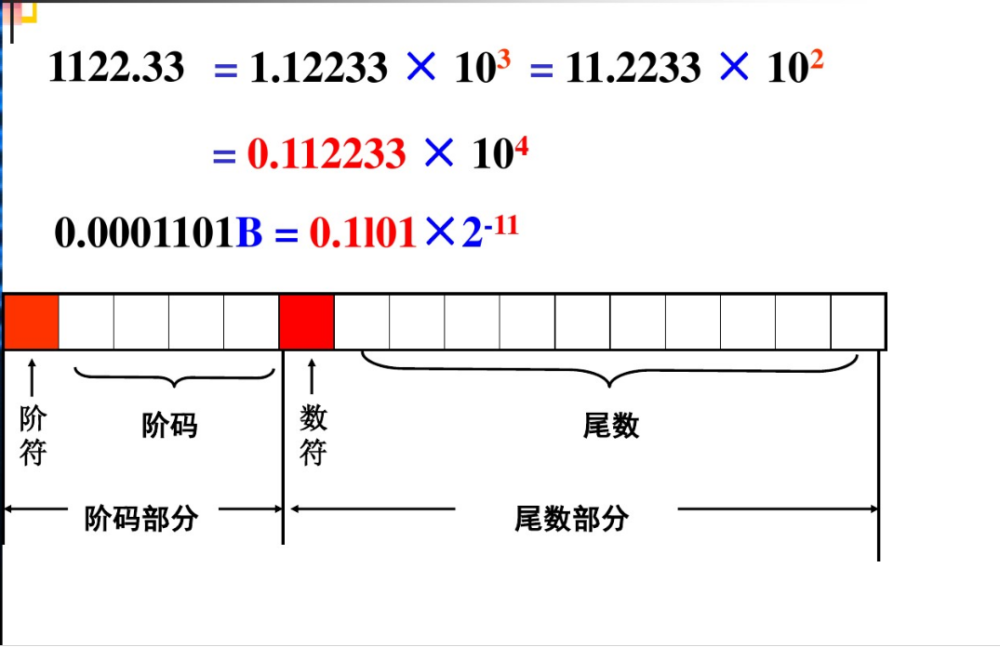
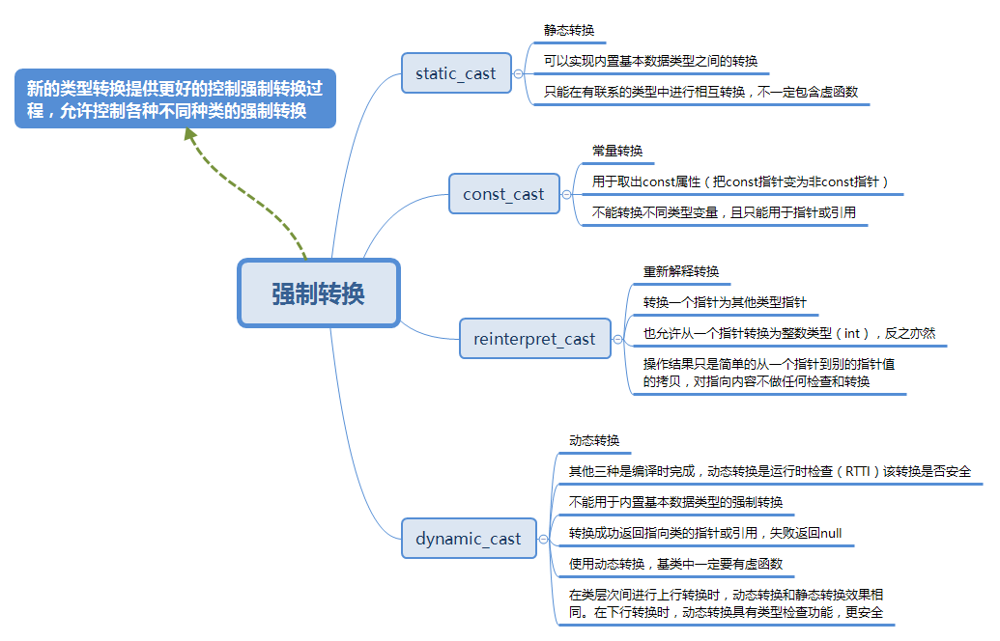

>   C++基本语法

<!--more-->

# C++

## 绪论

计算机软件：包括使计算机运行所需的各种程序 及其文档资料

指令：计算机能够识别的所有指令的集合

指令系统：一台计算机硬件系统能识别的所有指令的集合

机器语言：计算机硬件系统能识别的二进制指令组成的语言

结构化程序设计

-   自定向下，逐步求精；
    按功能将其划分为若干基本模块，形成树状结构，各模块之间功能
-   相互独立；各模块之间的关系尽可能简单；
    每一模块内都是由顺序，选择、循环三种基本结构组成；
-   模块化实现的具体方法是使用子程序。

### 信息的存储和表示

#### 信息

-   控制信息：指令、控制字

-   数据信息

    数值信息：定点数，浮点数
    非数值信息:字符数据，逻辑数据

#### 采用二进制的优点

-   易于物理实现
-   二进制运算简单
-   机器可靠性高
-   通用性强

#### 进制转换

十进制转R进制整数：除基取余、逆序输出

十进制转R进制小数：乘积取整、正序输出

二、八、十六进制相互转换：以二进制为中转，八取三位，十六取四位

#### 信息的存储单位

8 bit 一个字节（Byte）
字长：计算机一次可以处理的二进制位数

#### 码制

正数的原码，反码，补码一致

负数的补码由反码末尾加1

#### 浮点数的表示

>   阶码用补码表示，尾数为原码



#### 数的表示范围

有符号正数比负数小1，由于0的唯一性
1000 0000 与 0000 0000  分别表示 $2^{-7}$ 和 0

#### 各种程序

**源程序**：用各种语言写出的文本文件；

**目标程序**：源程序通过翻译加工后生成的程序，机器语言或低级语言；

**翻译程序**：用来把源程序翻译成目标程序的程序；

-   汇编程序
-   编译程序
-   解释程序

## 简单程序设计

### 变量命名规则

>   C命名规则

- 以字母下划线开头

- 区分大小写

- 由大小写字母、数字、下划线组成

### 符号常量

>   符号常量定义时一定要赋初值，程序中间不能修改

```cpp
const 常量名 = 常量值;
```

### 位运算

`&`：按位取与
`|`：按位或
`^`：按位异或【反与，不同取1，相同取0】
`~`：取反
`<<` `>>`：移位

-   左移时：低位补0 高位舍弃
-   右移时：移除位舍弃，无符号位高位补0；有符号数，高位补符号位或补0

### 隐含转换

逻辑运算操作数必须为bool

-   非0转换为true、0转换为false

位运算操作数必须是整数

-   低转高类型
-   赋值运算一律将右值转换为左值

### 显式类型转换



去const属性用const_cast，`只能用于指针或常引用`

```cpp
const int a= 0;
int b = const_cast<int>(a);//不对
const int *pi = &a;
int * pii = const_cast<int *>pi;//去除指针中的常量性，也可以添加指针的常量性;
```

基本类型转换用static_cast

```cpp
int a = 6;
double b = static_cast<int>(a);
```

多态类之间的类型转换用daynamic_cast

不同类型的指针类型转换用reinterpreter_cast

```cpp
/*
*reinterpret_cast它可以把一个指针转换成一个整数，也可以把一个整数转换成一个指针（先把一个指针转换成一个整数，在把该整数转换成原类型的指针，还可以得到原先的指针值）。
*/
int *ip;
char *pc = reinterpret_cast<char*>(ip);
```

### I/O格式控制 

| 操作符名          |              含义              |
| :---------------- | :----------------------------: |
| dec               |     数值类型采用十进制表示     |
| hex               |    数值类型采用十六进制表示    |
| oct               |     数值类型采用八进制表示     |
| ws                |           提取空白符           |
| endl              |       插入换行符并刷新流       |
| ends              |           插入空字符           |
| setw(int)         |            设置域宽            |
| setprecision(int) | 设置浮点数小数位数(包含小数点) |

```cpp
cout << setw(5) << setprecision(3) << 3.1415 << endl;
//设置域宽为5，小数点后保留两位有效小数
```

**源代码中为变量规定的数据类型，通过编译器在编译各个操作时所选择的具体指令来体现在目标代码中**

CPU所执行的指令并不对操作数的类型加以区分，对各个操作数都执行相同的操作，编译器根据变量的数据类型选择合适的指令

符号扩展：有符号数据类型，用符号位扩展

0扩展：无符号数据类型，用0填充

## 函数

```cpp
/*求x的n次方*/
# include<iostream>

using namespace std;

double power(int x,int n)
{
    double val = 1.0;
    while(n--)
    {
        val *= x;
    }

    return val;
}

int main()
{
    int x,n;

    cin >> x >> n;
    cout << x << " power " << n << " is " << power(x,n)<<endl;  
    return 0;
}
```

```cpp
/*二进制转十进制*/
# include<iostream>

using namespace std;

double power(int x,int n)
{
	double value = 1.0;
	
	while(n--)
	{
		value *= x;
	}
	
	return value;
}

int main()
{
	int value = 0;
	char ch;
	
	for(int i = 8;i >= 0;--i)
	{
		cin >> ch;
		if('1' == ch)
		{
			value += static_cast<int>(power(2,i));
		}
	}

	cout << value;
	
	return 0;
}
```


