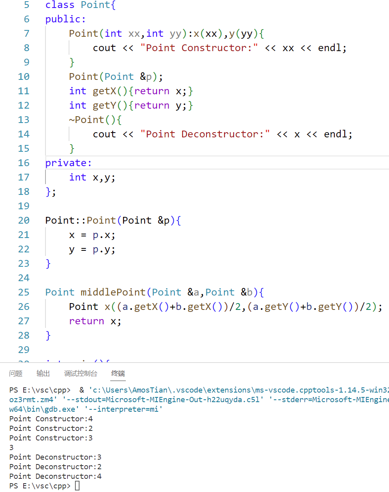
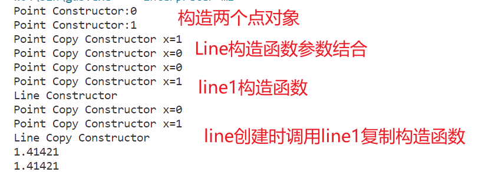

[TOC]

<!--more-->

## 3.1 类与对象

**对象**：用于描述客观事物的实体，用于构成系统的一个基本单位

- 由一组属性和行为构成

**类**：具有相同属性和行为的一组对象集合

- 类中的数据只能通过本类的方法进行处理
- 类通过一个简单的 `外部接口` 与外界发生关系
- 对象和类之间通过消息进行通信

**抽象**：对一些具体问题进行概括，抽出一类可以描述这些问题的公共性质的过程

**面向对象方法** ：

- 将数据和对数据的操作封装在一起，作为一个相互依存、不可分离的整——对象
- 对同类型的对象抽象出其共性形成类
- 特性：
  - 封装：将抽象得到的性质结合称为一个整体
    - 将数据和操作数据的行为进行结合，形成类
  - 继承与派生
  - 多态性：

```c++
class Name{
    ElemType data;
    ReturnType op(){
        return xx;
    }
}
```

**面向对象的语言**：程序模块是由类构成的

**面向对象的软件开发**

- 面向对象分析：OOA
- 面向对象设计：OOD
- 面向对象编程：OOP
- 面向对象测试：OOT
- 面向对象软件维护：OOSM

### 3.1.1 类成员的访问控制

`public` ：类外可访问

`private`：只允许本类成员函数访问

`protected` ：在本类中具有 `private` 属性，在派生类中可以被访问，不可被外部使用者访问

### 3.1.2 类的成员函数

#### 对象的访问方式

```c++
对象名.数据成员名
对象名.函数成员(参数表)
```

#### 成员函数的实现

```c++
/*类中只保留函数声明，在类外实现函数的定义*/
返回值类型 类名::函数成员名(参数表){
	/*函数体*/
}
```

#### 内联成员函数

隐式声明：将函数体放在类定义中；也可以使用 `inline` 

### 3.1.3 构造函数

> 实现对象的初始化

- **存在自定义的构造函数**，会覆盖默认的无参构造函数，**定义对象时必须初始化**

```c++
# include<iostream>
using namespace std;

/*构造函数与类名相同*/
class Clock{
public:
	Clock(int newH,int newM,int newS);
	
	/*若没有无参构造函数，在主函数中不能定义未初始化的对象*/
	Clock(){
		hour = 0;
		minute = 0;
		second = 0;
	}
	
	void setTime(int newH,int newM,int newS);
	void showTime();

private:
	int hour,minute,second;
};//记住加分号

Clock::Clock(int newH,int newM,int newS)
{
	hour = newH;
	minute = newM;
	second = newS;
}

inline void Clock::showTime()
{
	cout << hour << ":" << minute << ":" << second << endl;
}

int main()
{
	Clock c2;//相当于Clock c2(0,0,0)
    Clock(1,2,3);//输出为0:0:0
    //1. 无类变量
    //2. 封装性，只能通过成员函数操作成员变量
    c2.showTime();
	
	return 0;
}
```

#### 复制构造函数

> 用已知的对象初始化另一同类对象

##### 调用复制构造函数的三种情况

- 用类的一个对象 初始化另一对象

- 函数的实参与形参结合时

- 函数返回值是对象，赋值给调用者时

  先赋值给临时对象，待执行完语句后，临时对象消失

```c++
class Point{
public:
	Point(int xx,int yy):x(xx),y(yy){}
	Point(Point &p);
	int getX(){return x;}
	int getY(){return y;}
private:
	int x,y;
};

Point::Point(Point &p){//复制构造函数
	x = p.x;
	y = p.y;
}

Point middlePoint(Point &a,Point &b){
    Point x((a.getX()+b.getX())/2,(a.getY()+b.getY())/2);//复制
    return x;
}

int main(){
    Point a(4,4);
    Point b(2,2);

    cout << middlePoint(a,b).getX() << endl;//复制构造函数，执行完本语句，临时变量销毁
}
```

##### 深复制与浅复制

#### 析构函数

> 清理功能

析构函数在对象的生存期即将结束时被自动调用

- 析构函数执行顺序与构造函数的执行顺序相反

```c++
~ 类名(){}
```



#### 类的组合

> 一个类可以嵌套其他类对象，包含与被包含关系

如果这个类具有内嵌对象成员，内嵌对象成员先被创建

- 存在多个内嵌对象成员时，构造函数调用顺序与其被声明次序有关，与初始化列表的顺序无关。

```c++
#include<iostream>
#include<cmath>
using namespace std;

class Point{
	public:
		Point(int xx = 0,int yy = 0):x(xx),y(yy){
            cout << "Point Constructor:" << xx << endl;
        }
		Point(Point &p);
		int getX(){return x;}
		int getY(){return y;}	
	private:
		int x,y;
};

Point::Point(Point &p){
	x = p.x;
	y = p.y;
    cout << "Point Copy Constructor x=" << x << endl;
}

class Line{
	public:
		Line(Point xp1,Point xp2);
		Line(Line &l);
		double getLen()
		{
			return len;
		}	
	private:
		Point p1,p2;
		double len;
};

Line::Line(Point xp1,Point xp2):p1(xp1),p2(xp2){
	double x = static_cast<double>(p1.getX() - p2.getX());
	double y = static_cast<double>(p1.getY() - p2.getY());
    
	len = sqrt(x*x + y*y);
    cout << "Line Constructor" << endl;
}

Line::Line(Line &l):p1(l.p1),p2(l.p2){
	len = l.len;
    cout << "Line Copy Constructor" << endl;
}

int main()
{
	Point myp1(0,0),myp2(1,1);
	Line line1(myp1,myp2);
	Line line2(line1);
	
	cout << line1.getLen() << endl;
	cout << line2.getLen() << endl;
		
	return 0;
}
```



### 3.1.4 前向引用声明

> 在被引用类未定义前，将被引用类的名称放在调用者前

```c++
class B;//只告诉编译器B表示一个类，占用多少字节及内部成员等全不知道，故仅可作为形参，引用，指针，不可作为对象
class A{
	public:
    	void f(B b);//在A类中，可使用B类形参，使用B类的对象错误
		void method();		
	private:
		B &b;//使用对象的引用或指针正确
};

void A::method(){
	b.b_method();//错误，此时b_method 未定义
}

class B{
	public:
		void b_method();
};

void  B::b_method(){}
/*可将A中 method 方法放在 b_method 定义之后*/
```

### 3.1.5 结构体与类对比

结构体和类：

- 未指定访问控制的成员，类中为私有，结构体为公有

联合体：

- 全部数据成员共用同一内存单元

- 不能自定义构造函数，析构函数，重载赋值运算符
- 不能被继承，不支持多态

### 3.1.6 UML类图

在UML类图中，使用包含类名，属性 `field` 和方法 `method` 且有分割线的矩形表示类

#### 属性表示

```
[访问控制] 属性名 [重数] : 类型 [默认值] [约束特征]
```

- `+` ：`public`
- `-` ：`private`
- `#` ：`protected`


#### 方法表示

```
[访问控制] 函数名 (参数列表):返回类型 [约束特征]
```


#### 类关系表示

##### 关联关系

**单向关联**


顾客(Customer)拥有地址(Address)，则Customer类与Address类具有单向关联关系

**多重性关联**


一个界面(Form)可以拥有零个或多个按钮(Button)，但是一个按钮只能属于一个界面

| 表示方法 | 多重性说明                                   |
| -------- | -------------------------------------------- |
| 1..1     | 本类对象与另一类对象之间是一对一关系         |
| 0..*     | 本类一个对象与另一类对象的零个或多个有关系   |
| 1..*     | 本类一个对象与另一类对象的一个或多个有关系   |
| 0..1     | 本类一个对象与另一类对象的零个或一个有关系   |
| m..n     | 本类一个对象与另一类最少m个最多n个对象有关系 |

##### 包含关系

**聚合**

> 聚合(Aggregation)关系表示整体与部分关系
>
> 在聚合关系中，成员对象是整体对象的一部分，但是成员对象可以脱离整体对象独立存在


汽车发动机(Engine)是汽车(Car)的组成部分，但是汽车发动机可以独立存在，因此，汽车和发动机是聚合关系

**构成**

> 构成(Composition)关系也表示类之间整体和部分的关系
>
> 但是在组合关系中整体对象可以控制成员对象的生命周期，一旦整体对象不存在，成员对象也将不存在


##### 泛化

> 泛化(Generalization)关系也就是继承关系，用于描述父类与子类之间的关系


Student类和Teacher类都是Person类的子类，Student类和Teacher类继承了Person类的属性和方法，Person类的属性包含姓名(name)和年龄(age)，每一个Student和Teacher也都具有这两个属性

另外Student类增加了属性学号(studentNo)，Teacher类增加了属性教师编号(teacherNo)，Person类的方法包括行走move()和说话say()，Student类和Teacher类继承了这两个方法，而且Student类还新增方法study()，Teacher类还新增方法teach()

##### 注释


### 3.1.7 临时对象

```c++
cout << Line(Point(1),Point(4)).getLen <<endl;
cout << Line((Point)1,(Point)4).getLen << endl;
cout << Line(static_cast<Point>1,static_cast<Point>4) << endl;

cout << Line(1,4).getLen << endl;

explict Point(int xx = 0,yy = 0):x(xx),y(yy){}
//以此构造函数定义的类型转换只能通过显式完成，在声明处添加关键字，第四种类型转换失效
```

## 3.2 继承与派生

> 继承：派生类通过继承得到基类的特性
>
> **用于解决复用问题**
>
> - 不继承默认构造函数和析构函数


### 3.2.1 派生类定义及生成

#### 派生类定义

```c++
class 派生类名:继承方式 基类1，继承方式 基类2,...{
    /*成员声明*/
};

class Derived:public Base1,private Base2{
	public:
		Derived();
		~Derived();
};
```

- 单继承：只继承于一个基类
- 多继承：继承于多个基类

#### 派生类生成过程

1. 吸收基类成员函数

2. 改造基类

3. 添加新成员

   同名隐藏：若派生类声明了与基类同名的成员函数（不管参数列表是否相同）或成员属性，则隐藏基类同名成员

   - 被隐藏的同名函数，仍存在。`对象名.基类名:: func();`

```c++
#include<iostream>
using namespace std;

class Point{
	public:
		Point(int xx = 0,int yy = 0):x(xx),y(yy){
            cout << "Point Constructor:" << xx << endl;
        }
		Point(Point &p);
		int getX(){return x;}
		int getY(){return y;}	
	private:
		int x,y;
};

Point::Point(Point &p){
	x = p.x;
	y = p.y;
    cout << "Point Copy Constructor x=" << x << endl;
}

class PPoint:public Point{
	public:
		PPoint(int xx = 0,int yy = 0):x(xx),y(yy){
            cout << "PPoint Constructor:" << xx << endl;
        }
		int getX(){return x+1;}
		int getY(){return y+1;}	
	private:
		int x,y;
};

int main(){
	PPoint pp(1,1);

	cout << pp.getX() << endl;

	return 0;
}
```


#### 继承方式

> **用于控制复用部分的访问权限**
>
> 默认的继承方式是私有继承

- public
- protected
- private

**类族中或类族外都无法访问基类的私有成员**

##### 公有继承

基类的公有成员和保护成员在派生类中访问属性不变

- 在类族之外只能通过派生类的对象访问从基类继承的公有成员，不可访问保护成员

```cpp
# include<iostream>
using namespace std;

class Base{
    public:
        Base(int a,int b,int c):basePublic(a),baseProtected(b),basePrivate(c){}
        int basePublic;
    protected:
        int baseProtected;
    private:
        int basePrivate;
};

class PublicDerived:public Base{
    public:
        PublicDerived(int a,int b,int c):Base(a,b,c){
            cout << basePublic << endl;
            cout << baseProtected << endl;
            cout << basePrivate << endl;
        }
};

int main(){
    PublicDerived son1(1,2,3);
    cout << son1.basePublic << endl;
    cout << son1.baseProtected << endl;
    cout << son1.basePrivate << endl;
}
```


##### 私有继承

公有成员和保护成员都以私有成员身份出现在派生类中，不可再向下派生

- 类族外不能访问基类的成员

```cpp
# include<iostream>
using namespace std;

class Base{
    public:
        Base(int a,int b,int c):basePublic(a),baseProtected(b),basePrivate(c){}
        int basePublic;
    protected:
        int baseProtected;
    private:
        int basePrivate;
};

class ProtectedDerived:protected Base{
    public:
        ProtectedDerived(int a,int b,int c):Base(a,b,c){
            cout << basePublic << endl;
            cout << baseProtected << endl;
            cout << basePrivate << endl;
        }
};

int main(){
    ProtectedDerived son1(1,2,3);
    cout << son1.basePublic << endl;
    cout << son1.baseProtected << endl;
    cout << son1.basePrivate << endl;
}
```


##### 保护继承

基类的公有成员和保护成员以保护成员身份出现在派生类中

- 类族外无法通过派生类对象访问

```cpp
# include<iostream>
using namespace std;

class Base{
    public:
        Base(int a,int b,int c):basePublic(a),baseProtected(b),basePrivate(c){}
        int basePublic;
    protected:
        int baseProtected;
    private:
        int basePrivate;
};

class ProtectedDerived:protected Base{
    public:
        ProtectedDerived(int a,int b,int c):Base(a,b,c){
            cout << basePublic << endl;
            cout << baseProtected << endl;
            cout << basePrivate << endl;
        }
};

class DoubleProtectedDerived:protected ProtectedDerived{
    public:
        DoubleProtectedDerived(int a,int b,int c):ProtectedDerived(a,b,c){
            cout << basePublic << endl;
            cout << baseProtected << endl;
            cout << basePrivate << endl;
        }
};


int main(){
    ProtectedDerived son1(1,2,3);
    cout << son1.basePublic << endl;
    cout << son1.baseProtected << endl;
    cout << son1.basePrivate << endl;
}
```


**在孙子代，私有继承无法访问间接继承基类，保护继承可以间接继承基类**

```cpp
# include<iostream>
using namespace std;

class Base{
    public:
        Base(int a,int b,int c):basePublic(a),baseProtected(b),basePrivate(c){}
        int basePublic;
    protected:
        int baseProtected;
    private:
        int basePrivate;
};

class ProtectedDerived:protected Base{
    public:
        ProtectedDerived(int a,int b,int c):Base(a,b,c){
            cout << basePublic << endl;
            cout << baseProtected << endl;
            cout << basePrivate << endl;
        }
};

class PrivateDerived:private Base{
    public:
        PrivateDerived(int a,int b,int c):Base(a,b,c){
            cout << basePublic << endl;
            cout << baseProtected << endl;
            cout << basePrivate << endl;
        }
};

class PublicProtectedDerived:public ProtectedDerived{
    public:
        PublicProtectedDerived(int a,int b,int c):ProtectedDerived(a,b,c){
            cout << basePublic << endl;
            cout << baseProtected << endl;
            cout << basePrivate << endl;
        }
};

class PublicPrivateDerived:public PrivateDerived{
    public:
        PublicPrivateDerived(int a,int b,int c):PrivateDerived(a,b,c){
            cout << basePublic << endl;
            cout << baseProtected << endl;
            cout << basePrivate << endl;
        }
};

int main(){
    ProtectedDerived son1(1,2,3);
    cout << son1.basePublic << endl;
    cout << son1.baseProtected << endl;
    cout << son1.basePrivate << endl;
}
```


### 3.2.2 派生类的构造函数和析构函数

> 派生类的构造函数只负责对新增成员初始化，基类成员的初始化由基类构造函数完成

#### 派生类构造函数

```c++
派生类名::派生类名(参数表)::基类名1(基类1初始化参数列表),...基类名n(基类n初始化参数列表),派生类新增成员对象(派生类新增成员对象参数列表){
    /*派生类构造函数函数体*/
};
```

**执行顺序**

1. 调用基类的构造函数，调用顺序按他们在被继承时声明的顺序
2. 对派生类新增成员对象初始化，调用顺序按其在类中的声明顺序
3. 执行派生类的构造函数体中内容
   - 对于构造函数中未显示列出的基类，系统会调用默认构造函数

#### 复制构造函数

```cpp
/*由于类型兼容规则，可以用派生类的对象去初始化基类的引用*/
Derived::Derived(Derived &v):Base(v){}
```

#### 析构函数

> 派生类的析构函数只需要负责清理新增的成员，系统会自动调用基类的析构函数

**析构函数调用顺序**

1. 执行析构函数的函数体
2. 对派生类新增的成员进行清理
3. 对所有从基类继承来的成员清理

```cpp
# include<iostream>

using namespace std;

class Base1{
	public:
		Base1(int i){
            cout << "Constructing Base1 " << i << endl;
        }
		~Base1(){
            cout << "Destructing Base1 " << endl;
        }
};

class Base2{
	public:
		Base2(int j){
            cout << "Constructing Base2 " << j << endl;
        }
		~Base2(){
            cout << "Destructing Base2" << endl;
        }
};

class Base3{
	public:
		Base3(){
            cout << "Constructing Base3 * " << endl;
        }//声明为默认构造函数
		~Base3(){
            cout << "Destructing Base3 " << endl;
        }
};

class Derived:public Base2,public Base1,public Base3{
	public:
		Derived(int a,int b,int c,int d):Base1(a),member2(d),member1(c),Base2(b){}
	private:
		Base1 member1;
		Base2 member2;
		Base3 member3;
};

int main(){
	Derived obj(1,2,3,4);
	
	return 0;
}


/*运行结果*/
Constructing Base2 2//先调用父类的三个构造函数
Constructing Base1 1
Constructing Base3 *
Constructing Base1 3//派生类新增三个成员，按照声明顺序调用相应的构造函数
Constructing Base2 4
Constructing Base3 *
Destructing Base3 //析构函数调用顺序与构造函数调用顺序相反，3-2-1,3-1-2
Destructing Base2
Destructing Base1
Destructing Base3
Destructing Base1
Destructing Base2
```

### 3.2.3 类型兼容

没有设置虚基类，则一定会发生类型兼容

> 在**任何需要基类对象的地方**都可以使用派生类的对象来代替——相当于隐式类型转换

- 派生类对象(指针) 都可以隐式转换为基类对象(指针)

  转换之后，派生类只能发挥基类功能——只能调用基类成员

- 派生类对象可以初始化基类对象

```cpp
# include<iostream>

using namespace std;

class Base1{
	public:
		void display(){
			cout << "Base1::display" <<endl;
		}
};

class Base2:public Base1{
	public:
		void display(){
			cout << "Base2::display" <<endl;
		}
};

class Derived:public Base2{
	public:
		void display(){
			cout << "Derived::display" <<endl;
		}
};

void fun(Base1 *ptr){
	ptr->display();
}

int main(){
	Base1 base1;
	Base2 base2;
	Derived derived;

	fun(&base1);
	fun(&base2);
	fun(&derived);

	return 0;
}

/*由于类型兼容规则，派生类的dispaly函数并未隐藏基类的同名函数*/
/*运行结果*/
Base1::display
Base1::display
Base1::display
```

### 3.2.4 派生类成员的表示与控制

作用域分辨符`::`

- `类名::成员名`

- `类名:成员函数(参数列表)`

**同名隐藏**：如果派生类中声明了与基类同名的新函数，即使参数列表不同，从基类继承的同名函数的所有重载形式都会被隐藏

- `派生类对象名.成员名` `派生类对象指针->成员名` 唯一表示派生类成员

- 同名隐藏不同于重载，重载发生与同一级的类，同名隐藏发生于父类与子类之间

#### using关键字

> **解决同名隐藏问题** 
>
> `using` 的作用是将一个作用域名引入到另一个作用域中

将 `using` 用于基类中的函数名，派生类中定义同名但参数列表不同的函数，派生类也不会发生同名隐藏

```cpp
/*既可以使用无参数fun，也可以使用带参数的fun*/
class Derived:public Base{
	public:
		using Base::fun;//引用Base类中的fun();
		void fun(int i){}
};
```


- 即多个路径上的派生类对同一基类处理，**使用 `using ::` 会形成多个基类副本**——不一定是一件好事，**通过虚基类解决**

### 3.2.5 虚基类

将共同基类设为虚基类

- 通过继承同一虚基类的所有派生类，访问基类的数据与函数成员时，会访问同一份映射

> 虚基类关键字作用范围和继承方式只对紧随其后的基类起作用

```cpp
class 派生类名:virtual 继承方式 基类名{};
```


```cpp
# include<iostream>
using namespace std;

class Base0{
    public:
        int var0;
        void fun0(){
            cout << "Member of Base0" << endl;
        }
};

class Base1:virtual public Base0{
    public:
        int var1;
        void fun0(){
            cout << "Member of Base1" << endl;
        }
};

class Base2:virtual public Base0{
    public:
        int var2;
        void fun0(){
            cout << "Member of Base2" << endl;
        }
};

class Derived:public Base1,public Base2{
    public:
        int var;
        using Base0::fun0;
        void fun0(){
            cout << "Member of Derived" << endl;
        }
};

int main(){   
    Derived d;

    d.var0 = 2;
    cout << d.var0 << endl;
    d.fun0();

    return 0;
}
/*运行结果*/
2//因为在父类，派生类中都没有同名成员，所以从虚基类中继承了唯一var0
Member of Derived//出现同名隐藏
//若将派生类的fun0删除，而不引入Base0中的fun0()，会导致fun0()调用的二义性
//若删除派生类新增成员函数fun0()，引入Base0的fun0()，则会调用Base0的fun0()
```

#### 虚基类及派生类的构造函数

只保证了虚基类只有一份成员数据，并不消除类型兼容

- 在整个继承关系中，**直接或间接继承的所有派生类都必须在构造函数的初始化列表中对虚基类的成员初始化**

- **只有最远派生类的构造函数会真正调用虚基类的构造函数**，该派生类的其他基类对虚基类构造函数调用都会被忽略

```cpp
#include<iostream>
using namespace std;

class Furniture{
	public:
		Furniture(){};
		Furniture(double weight);
		void show(void);		
	protected:
		double weight;
};

Furniture::Furniture(double weight){
	this->weight = weight;
}
void Furniture::show(){
	cout << "家具重量为:" << weight << endl;
}

class Sofa:virtual public Furniture{
	public:
		Sofa(){};
		Sofa(double weight);
		void show(void);
};
Sofa::Sofa(double weight):Furniture(weight){  //派生类的构造函数应该去初始化基类的数据成员
	this->weight = weight;
}
void Sofa::show(){
	cout << "沙发重量为:" << weight << endl;
}

class Bed :virtual public Furniture{
	public:
		Bed(){};
		Bed(double weight);
		void show(void);
};

Bed::Bed(double weight):Furniture(weight)  //派生类的构造函数应该去初始化基类的数据成员{
	this->weight = weight;
}
void Bed::show(){
	cout << "床重量为:" << weight << endl;
}

class SofaBed:public Sofa,public Bed{
	public:
		SofaBed(){};
		SofaBed(double weight);
		void show(void);
};
SofaBed::SofaBed(double weight) :Furniture(weight),Sofa(weight), Bed(weight){
	this->weight = weight;
}
void SofaBed::show(){
	cout << "沙发床重量为：" << weight << endl;
}

//=========================================
int main(){
	Furniture furniture(1);
	Sofa sofa(2);
	Bed bed(3);
	SofaBed sofabed(3.5);
    //此处发生同名隐藏
	sofabed.show();//沙发床重量为：3.5
	
    /*类型兼容*/
	Furniture *p;
	p = &furniture;
	p->show();//家具重量为:1
	p = &sofa;
	p->show();//家具重量为:2
	p = &bed;
	p->show();//家具重量为:3
	system("pause");
	
	return 0;
}
```

### 3.2.6 类对象的构造顺序

1. 该类有直接或间接的虚基类，则先执行虚基类的构造函数
2. 按照基类在派生类中的声明顺序执行构造函数
3. 按照声明顺序对新增成员初始化
4. 执行构造函数的函数体

## 3.3 多态性

指允许不同类的对象对同一消息做出响应。即同一消息可以根据发送对象的不同而采用多种不同的行为方式。（发送消息就是函数调用）

### 3.3.1 多态及其实现

#### 多态分类

专用多态

- 重载多态：普通函数和成员函数，运算符重载
- 强制多态：变量的类型变化

通用多态

- 包含多态：同一类族中，不同类的同名函数的多态行为
- 参数多态

---

- 编译时多态：函数重载，运算符重载
- 运行时多态：虚函数机制

绑定：计算机程序自身相互关联的过程：一条消息和一个对象方法相结合的过程

- 静态绑定：发生在编译期间
- 动态绑定：发生在程序运行期间，根据在执行期间判断所引用对象的实际类型调用相应的方法 

#### 运行时多态

> 运行期多态的实现依赖虚函数机制。当某个类声明了虚函数时，编译器将为该类对象声明一个虚函数表指针，并为该类设置一张唯一的虚函数表，虚函数表中存放的是该类虚函数的地址。运行期间通过虚函数表指针与虚函数表确定该类虚函数的真正实现


```cpp
class Animal{
    public :
        virtual void shout() = 0;
};
class Dog :public Animal{
    public:
        virtual void shout(){ cout << "汪汪！"<<endl; }
};
class Cat :public Animal{
    public:
        virtual void shout(){ cout << "喵喵~"<<endl; }
};
class Bird : public Animal{
    public:
        virtual void shout(){ cout << "叽喳!"<<endl; }
};

int main(){
    Animal *anim1 = new Dog;
    Animal *anim2 = new Cat;
    Animal *anim3 = new Bird;
     
   //借由指针（或引用）调用的接口，在运行期确定指针（或引用）所指对象的真正类型，调用该类型对应的接口
    anim1->shout();
    anim2->shout();
    anim3->shout();
 
    //delete 对象
    ...
   return 0;
}
```

### 3.3.2 运算符多态(编译时多态)

> 与函数重载一样，都是通过在编译时静态绑定

限制：

- 只能重载C++已有的运算符
- 不能改变运算符操作数数量，至少有一个自定义类型
- 重载之后，优先级和结合性不变
- 不能用于重载的运算符：
  - 类属性访问符 `.` 
  - 指针访问符 `->` , `*` 
  - 作用域  `::` 
  - 三目运算符  `?:`

```cpp
返回类型 operator 运算符(形参表){
    /*函数体*/
}
```

```cpp
# include<iostream>

using namespace std;

class Complex{
	public:
		Complex(double r = 0.0,double i = 0.0):real(r),imag(i){}
    	//声明为友元函数，可以在类外调用类中成员
		friend Complex operator+(const Complex &c1,const Complex &c2);
		friend Complex operator-(const Complex &c1,const Complex &c2);
		friend ostream & operator << (ostream &out,const Complex &c);
		
	private:
		double real;
		double imag;
};

Complex operator+ (const Complex &c1,const Complex &c2){
	return Complex(c1.real + c2.real,c1.imag + c2.imag);
}

Complex operator- (const Complex &c1,const Complex &c2){
	return Complex(c1.real - c2.real,c1.imag - c2.imag);
}

ostream & operator << (ostream &out,const Complex &c){
	out << "(" << c.real << "," << c.imag << ")";
	
	return out;
}

int main(){
	Complex c1(5,4),c2(2,10),c3;
	
	cout << "c1 = " << c1 << endl;
	cout << "c2 = " << c2 << endl;
	c3 = c1 - c2;
	cout << "c3 = c1 - c2 = " << c3 << endl;
	c3 = c1 + c2;
	cout << "c3 = c1 + c2" << c3 << endl;
	
	return 0;
}
```

#### 类的运算符重载成员函数

> 运算符重载形参表会少一个，第一个操作数为调用该函数的对象，函数体可以通过 `this` 指针访问调用对象

- 双目运算符左操作数为调用函数对象本身的数据，由 `this` 指出
- 若为单目运算符，则为调用对象本身，不需要传递参数

##### 单目运算符重载

**前置单目运算符**

```cpp
class A{
    A& operator运算符(){
        /*函数体*/
    }
};

A oprand;//声明一个A类的操作数
++operand;
//<==>调用
//operand.operator++()
```

**后置单目运算符**

```cpp
class A{
    A operator运算符(int){
        //与前置单目运算符从形参列表上做形式上区分
        /*函数体*/
    }
};

A operand;//定义A类操作数
operand++;
operand--;
//<==>调用operand.operator++(int)、operand.operator--(int)
//由于需要返回执行前操作数，所以需要以参数形式保存
```

---

```cpp
/*对单目运算符++的重载*/
# include<iostream>
using namespace std;

class Clock{
	public:
		Clock(int hour = 0,int minute = 0,int second = 0);
		void showTime();
		Clock& operator++();//前置
		Clock operator++(int);//后置
	
	private:
		int hour,minute,second;
};

Clock::Clock(int hour,int minute,int second){
	if(0 < hour && hour <= 24 && 0 < minute && minute <= 60 && 0 < second && second <= 60){
		this->hour = hour;
		this->minute = minute;
		this->second = second;
	}
	else{
		cout << "Time Error !!" << endl;
	}
}

void Clock::showTime(){
	cout << hour << ":" << minute << ":" << second << endl;
}

Clock& Clock::operator++(){
	second++;
	if(second >= 60){
		second -= 60;
		minute++;
		if(minute >= 60){
			minute -= 60;
			hour = (hour + 1) % 24;
		}
	}
	return *this;
}

Clock Clock::operator++(int){
	Clock old = *this;//后置++先输出在运算，所以要保留原有值
	++(*this);//调用前置++函数
	return old;
}

int main(){
	Clock myClock(23,59,59);
	cout << "First time:";
	myClock.showTime();
	cout << "Show myTime++:";
	(myClock++).showTime();
	cout << "++Show myTime:";
	(++myClock).showTime();
	
	return 0;
}

/*运行结果*/
First time:23:59:59
Show myTime++:23:59:59
++Show myTime:0:0:1
```

##### 双目运算符重载

```cpp
class A{
    A operator 运算符(DataType B){
        /*函数体*/
    }
};
class C{};

A operand1;
C operand2;

operand1 运算符 operand2;//在A类中定义运算符重载
//<==>相当于调用函数operand1.operator运算符(operand2)
```

---

```cpp
/*对双目运算符+的重载*/
# include<iostream>
using namespace std;

class Complex{
	public:
		Complex(double r = 0.0,double i = 0.0):real(r),imag(i){}
		Complex operator+(const Complex &c2)const;
		Complex operator-(const Complex &c2)const;
		void display() const;
		
	private:
		double real,imag;
};

Complex Complex::operator+(const Complex &c2) const{
	return Complex(real + c2.real,imag + c2.imag);
}

Complex Complex::operator-(const Complex &c2) const{
	return Complex(real - c2.real,imag - c2.imag);
}

void Complex::display() const{
	cout << "(" << real << "," << imag << ")" << endl;
}

int main(){
	Complex c1(5,4),c2(2,10),c3;

	cout << "c1 = ";c1.display();
	cout << "c2 = ";c2.display();
	c3 = c1 - c2;
	cout << "c3 = c1 - c2 = ";c3.display();
	c3 = c1 + c2;
	cout << "c3 = c1 + c2 = ";c3.display();
	
	return 0;
}

/*运行结果*/
c1 = (5,4)
c2 = (2,10)
c3 = c1 - c2 = (3,-6)
c3 = c1 + c2 = (7,14)
```

### 3.3.3 虚函数(运行时多态)

```cpp
virtual 函数名(参数列表);//使用virtual关键字声明为虚函数
```

虚函数不能是构造函数，不能是静态的成员函数

带默认值的形参函数，不能在派生类中重新定义，属于静态绑定

除声明为内联函数的虚函数，其余虚函数都是动态绑定的

**如何确定派生类的成员函数为虚函数** ：相同函数名、相同形参列表、返回值一致的成员函数确认为虚函数

**基类含有的虚函数，其派生类必须覆盖基类虚函数及所有同名重载函数**

```cpp
/*在派生类中，隐式声明为虚函数，也可以在派生类中同名函数前加 virtual*/
#include<iostream>
using namespace std;

class Furniture{
	public:
		Furniture(){};
		Furniture(double weight);
		virtual void show(void);		
	protected:
		double weight;
};

Furniture::Furniture(double weight){
	this->weight = weight;
}
void Furniture::show(){
	cout << "家具重量为:" << weight << endl;
}

class Sofa:virtual public Furniture{
	public:
		Sofa(){};
		Sofa(double weight);
		void show(void);
};

Sofa::Sofa(double weight):Furniture(weight){  //派生类的构造函数应该去初始化基类的数据成员
	this->weight = weight;
}
void Sofa::show(){
	cout << "沙发重量为:" << weight << endl;
}

class Bed:virtual public Furniture{
	public:
		Bed(){};
		Bed(double weight);
		void show(void);
};

Bed::Bed(double weight):Furniture(weight){  //派生类的构造函数应该去初始化基类的数据成员
	this->weight = weight;
}
void Bed::show(){
	cout << "床重量为:" << weight << endl;
}

class SofaBed:public Sofa,public Bed{
	public:
		SofaBed(){};
		SofaBed(double weight);
		void show(void);
};

SofaBed::SofaBed(double weight) :Furniture(weight),Sofa(weight), Bed(weight){
	this->weight = weight;
}
void SofaBed::show(){
	cout << "沙发床重量为：" << weight << endl;
}

//=========================================
int main(){
	Furniture furniture(1);
	Sofa sofa(2);
	Bed bed(3);
	SofaBed sofabed(3.5);
	sofabed.show();
	
	Furniture *p;
	p = &furniture;
	p->show();
	p = &sofa;
	p->show();
	p = &bed;
	p->show();
	system("pause");
	
	return 0;
}
/*运行结果*/
沙发床重量为：3.5
家具重量为:1
沙发重量为:2
床重量为:3
请按任意键继续. . .
```

可以用 `基类名::函数名()` 调用基类被隐藏的函数

基类构造函数 `Base::Base()` 中调用 `virtual` 修饰的虚函数，被调用的是基类 `Base::` 中的虚函数

- 基类被构造时，派生类还为构造

析构函数类似

#### 虚析构函数

**不能声明构造函数，但可以声明虚析构函数**

**适用情况：** 如果有可能通过基类指针调用对象的析构函数，就需要让基类的析构函数为虚函数

```cpp
virtual ~类名();
```

### 3.3.4 抽象类(运行时多态)

#### 纯虚函数

```cpp
virtual 函数类型 函数名(参数表) = 0;
```

声明为纯虚函数后，不能给出函数定义部分，**带纯虚函数的类不能进行实例化**

- 如果将**析构函数**声明为纯虚构函数，必须给出定义

对基类纯虚函数的调用，必须通过 `基类名::函数名(参数列表)`

#### 抽象类

带纯虚函数的类为抽象类

抽象类不能被实例化，但可以使用指针、引用

若其派生类给出纯虚函数的定义，不再是抽象类，可以进行实例化

- 若未给出定义，仍为抽象类

```cpp
# include<iostream>
using namespace std;

class Base1{
	public:
		virtual void display() const = 0;
};

class Base2:public Base1{
	public:
		void display() const;
};

void Base2::display() const{
	cout << "Base2::display" <<endl;
}

class Derived:public Base2{
	public:
		void display() const;
};

void Derived::display() const{
	cout << "Derived::display" <<endl;
}

void fun(Base1 *ptr){
	ptr->display();
}//只能使用指针或引用，若改为对象，则有类型兼容

int main(){
	Base2 base2;
	Derived derived;

	fun(&base2);
	fun(&derived);

	return 0;
}

/*运行结果*/
Base2::display
Derived::display
```

### 3.3.5 多态性总结

#### 动态类型与非动态类型声明原则

如果一个函数的执行方式十分明确，则将他声明为非虚函数；

如果一个类族中所有类都有这个函数特点，则将这个函数声明为虚函数；

如果一个类需要被其他类对其进行继承，就需要设计为多态，至少设计为虚析构函数

#### 多态的三个条件

- 继承：多态性体现在基类与派生类的继承关系中
- 重写：父类中定义方法，子类中有对方法的重写
- 类型兼容：父类的引用指向子类的对象

#### 多态的实现——重写

#### 重写与重载

前提：方法名一致

**重载**

发生在同一类中，

方法名相同

参数列表不同：参数个数，类型，顺序

- 参数类型不同时，顺序不同也可以理解为参数列表不同
- 参数类型相同时，顺序不同不构成重载

重载与返回类型无关

**重写**

发生在父子类之间，

参数列表相同（参数个数，类型，顺序）

子类返回值类型和抛出的异常要是父类的子类

子类的访问控制权限比父类更高或相等


 
