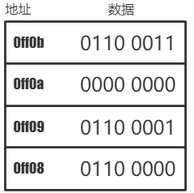
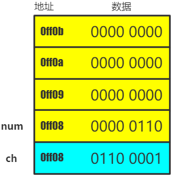
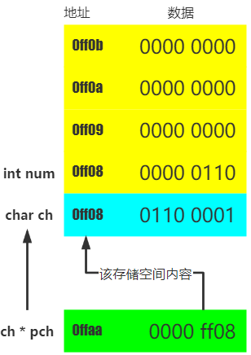
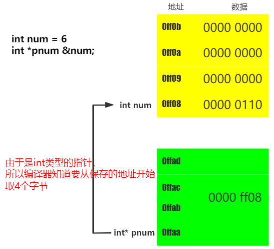
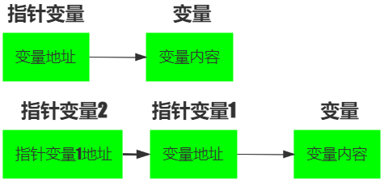
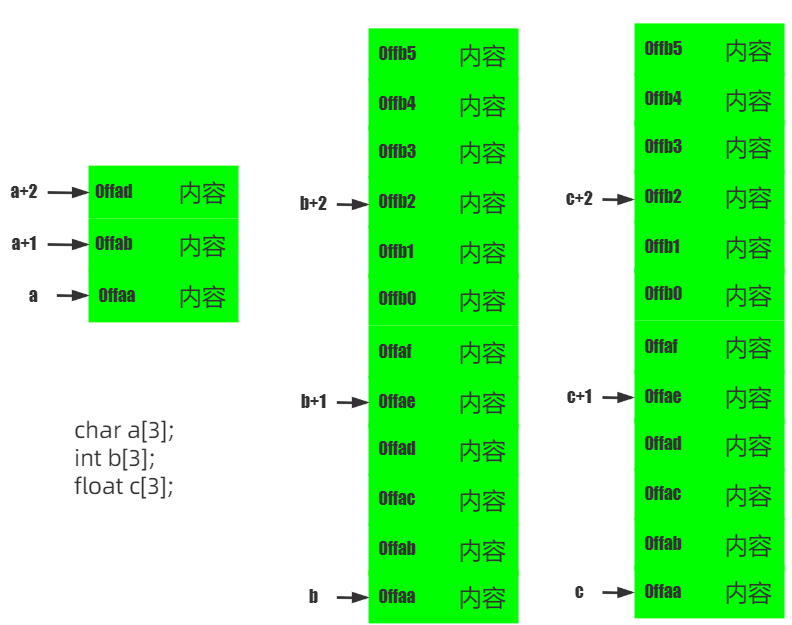

[TOC]

<!--more-->

第一部分同 [C语言->2-数据类型->指针类型](https://amostian.github.io/posts/1037565863/)

## 5.1 指针变量与内存

在计算机中，所有数据都存储在内存单元，每个内存单元都有唯一对应的地址，只要通过这个地址就能找到内存单元中的数据

### 5.1.1 内存地址与存储空间

内存地址：门牌号——指明当前存储空间在内存中的位置

存储空间：房间——实际放数据的地方



>   一个指针就是**一个内存单元的地址**
>
>   变量地址：系统分配给变量的 “内存单元” 的**起始地址**



### 5.1.2 指针变量

在C语言中，允许用一个变量来存放其它变量的地址，即指针变量



## 5.2 指针运算符

### 5.2.1 &

 `& 变量名`：获取变量的首地址（指针）

### 5.2.2 *

在定义变量时，`*` 是一个类型说明符，说明定义的变量是一个指针变量

```c
int *p = NULL;
```

在变量名前，且不是定义时，表示访问指针指向的存储空间

```c
int a = 5;
int *p = &a;
printf("%d",*p);
```

在表达式中，`*` 表示乘法

## 5.3 数据类型——指针

在同一编译器环境下，所有指针变量占用的内存空间是固定的

- 但不同类型的变量所占存储空间是不同的

指针变量：

- 16位编译器：2字节
- 32位编译器：4字节
- 64位编译器：8字节

指针变量需要通过所指向变量的数据类型判断后续要访问的存储单元个数



### 5.3.1 指针变量声明

指针变量：用一个变量存放其他变量的地址

```cpp
int age;// 定义一个普通变量
int *pnAge; // 定义一个指针变量
pnAge = &age;
```

`指针指向的数据类型 *指针变量名`

### 5.3.2 指针变量的初始化

- 指针变量只能存储地址, 不能存储其它类型
- 指针没有初始化里面是一个垃圾值，称为 **野指针**
- 指针必须初始化才可以访问其所指向存储区域

#### 定义同时初始化

```c
int a = 5;
int *p = &a;
```

#### 先定义后初始化

```c
int a = 5;
int *p;
p=&a;
```

#### 注意

- 指针没有初始化，里面是一个垃圾值，称为野指针

- 指针的指向可以改变

  ```c
  int a = 5;
  int *p = &a;
  int b = 10;
  p = &b; // 修改指针指向
  ```

- 多个指针变量可以指向同一个地址

### 5.3.3 二级指针

指针的指针，间接寻址



```c
char c = 'a';
char *cp;
cp = &c;
char **cp2;
cp2 = &cp;
printf("c = %c", **cp2);
```

### 5.3.4 常量的指针

不能通过指针改变所指对象的值

1. 如果一个变量被声明为常变量，只能通过指向常量的指针指向他，不能用一般指针(指向非const型变量的指针)指向它

2. 指向常变量的指针除了可以指向常变量外，也可指向非变量。此时不能通过指针改变变量内容

   ```cpp
   int a;
   const int* p = &a;//const修饰int，不能通过指针修改值
   //等价于 int const *p
   int b;
   p = &b;//正确
   *p = 1;//错误
   ```

3. 如果函数的形参是指向非const型变量的指针，实参只能用指向非const变量的指针，不能用指向const变量的指针

### 5.3.5 指针常量

指针的值不能改变，即指针变量存储的内容不能改变，指针的指向不能变，但指针指向地址的内容可以改变

```cpp
#include <iomanip>
#include <iostream>

using namespace std;

int main(void) {
    int a = 1;
    int b = 2;
    int *const p = &a;

    *p = 3;
    cout << *p << endl;
    p = &b;//错误，p2为指针常量，不能修改值

    return 0;
}
```

指针关系运算

- 定义指针，未初始化时一定要赋 `NULL`

- 0专用于表示空指针

- 指针的加减运算适合数组运算

## 5.4 数组的指针

获取元素地址，使用取内容符 `&val`【视为一维数组】

### 5.4.1 数组元素的指针

一个数组由若干个数组元素组成，每个数组元素占用一段存储空间，**数组元素的指针**指向这段存储空间的首地址

```c
int a[10] = {1,2,3,4,5,6,7,8,9,10};

//将数组的首元素地址赋值给指针变量 p
// 以下两种写法等价
int *p = a;
int *p = &a[0];
```

#### 指针访问数组元素

访问数组元素的两种方法：

- 下标，`a[i]`
- 指针，`*p = a; *(p+i)`



- 指针都可通过 `p+=1;` 或 `p++;` 后移指向下一个存储单元，这里的 `+1` 指的是后移一个存储单元

- **数组名** 是一个指针，但**不能被修改**

  ```c
  int x[10];
  x++;  //错误
  int* p = x;
  p++; //正确
  ```

### 5.4.2 指针数组

> 相当于一维数组的元素是指针
>

`数据类型 *数组名[数组长度]`

数组名中存的是首地址

```cpp
/*一维数组*/
int line1[] = {1,0,0};
int line1[] = {0,1,0};
int line1[] = {0,0,1};

int *pLine[3] = {line1,line2,line3};

pLine[i][j] //==>*(pLine[i] + j)//=>*(*(Lines + i) + j)
```

```cpp
char *str[3] = {"one","two","program"}
/=>
/*
* char *str[3];
* char str[0] = "one";
* char str[1] = "two";
* char str[2] = "program";
*/
```

```cpp
int array[3][3] = {11,12,13,21,22,23,31,32,33};
array[i][j] //=> *(*(array + i) + j)
```

## 5.5 字符指针

### 5.5.1 字符数组定义

#### 字符数组

```c
char string[]=”Amos Tian”;
printf("%s\n",string);
```

#### 字符指针指向字符串

```c
// 数组名保存的是数组第0个元素的地址, 指针也可以保存第0个元素的地址
char *str = "abc"
```

### 5.5.2 通过指针获取字符串的某个字符

```c
char *str = "Amos";
for(int i = 0; i < strlen(str);i++){
  printf("%c-", *(str+i)); // 输出结果:A-m-o-s
}
```

- **不可修改字符串内容**

  使用 `字符数组` 来保存的字符串是保存 `栈` 里的，保存栈里面东西是**可读可写**，所以可以修改字符串数组中的字符

  使用 `字符指针` 来保存字符串，它保存的是 `字符串常量地址` ，常量区是**只读** 的 ，所以我们不可以修改字符串中的字符

- 未分配内存空间的指针，不能直接接收键盘输入

  ```c
  # 错误写法
  char *str;
  scanf("%s", str);
  ```

## 5.6 函数与指针

函数作为一段程序，在内存中也要占据部分存储空间，这部分存储空间有一个起始地址（函数名可理解为一个函数指针），所以可以用一个指针指向这个起始地址。

### 5.6.1 指向函数的指针

`返回值类型 (*指针变量名)(形参1类型, 形参2类型, ...);`

```c
# include<stdio.h>

/*函数指针可指向多个函数*/
int add(int x,int y){
	return x+y;
}
int max(int x,int y){
	return x > y ? x : y;
}
int min(int x,int y){
	return x < y ? x : y;
}

int main(){
	int (*p)(int,int),addRes,a,b;
    
	p = add;
	addRes = (*p)(a,b);
	p = max;
	maxRes = (*p)(a,b);
	p = min;
	minRes = (*p)(a,b);
    
    return 0;
}
```

**注意**

- 这类指针变量存储的是一个函数的入口地址，所以对他们加减运算无意义
- 要求：定义指向函数的指针时，括号不能省略，否则报错：无法修改的左值
- 约定：通过函数指针调用函数时，括号不省略，即 `(函数变量名);` ，只是作为一种语法约定，表示通过函数指针调用函数

### 5.6.2 函数指针作为形参

```c
/*函数指针可指向多个函数*/
int add(int x,int y){
	return x+y;
}

int max(int x,int y){
	return x > y ? x : y;
}

int min(int x,int y){
	return x < y ? x : y;
}

int funp(int (*p)(int,int),int x,int y){
	return (*p)(x,y);
}

int main(){
	int (*p)(int,int),res,a,b;
	p = max;
	res = funp(p,a,b);
}
```

## 5.7 指针与对象

### 5.7.1 对象的指针

```cpp
类名 *对象指针名;
对象指针名->成员名;//=>(*对象指针名).成员名
```

### 5.7.2 this指针

> 用于指向正在被成员函数操作的对象

```cpp
return x;//=>return this->x;
```

### 5.7.3 指向类的非静态成员的指针

> 定义指针后，所有对象可通过该(别名)指针访问特定成员

#### 指向数据成员

**声明与定义**

```cpp
/*数据成员*/
类型 类名::*指针名;//声明语句
//不能对类的私有数据成员取地址、赋值，由于未实例化，不能访问数据
指针名 = &类名::数据成员名;
```

**调用方式**

```cpp
对象名.*类成员指针名;//实例化，通过类来访问数据
对象名->*类成员指针;
```

#### 指向函数成员

**声明与定义方式**

```cpp
类型说明符 (类名::指针名)(参数列表);
指针名 = &类名::函数成员名;
```

**调用方式**

```cpp
(对象名.*类成员指针名)(参数表);
(对象名->*类成员指针名)(参数表);
```

```cpp
int main(){
	Point(4,5);
	Point *p1 = &a;
	int (Point::*funnptr)()const = &Point::getX();

	cout << (a.*funptr)() << endl;
	cout << (p1->funptr)() << endl;
	
	return 0;
}
```

### 5.7.4 指向类的静态成员的指针

> 对静态成员的访问不依赖于对象

```cpp
类型说明符 类名::*指针名;//声明语句
指针名 = &类名::数据成员名;//不能对类的私有数据成员取地址,赋值，由于未实例化，并不能访问数据

类型说明符 (类名::*指针名)(参数表);	
指针名 = &类名::函数成员名;	
```
