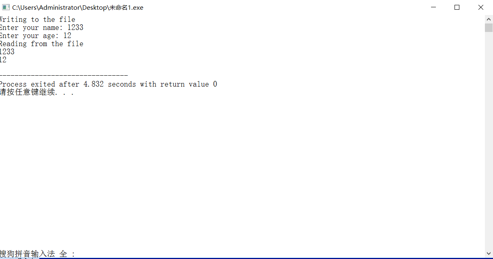

[TOC]

<!--more-->

## 2.1 数组

`new` 是C++的一个关键字，它通常用来在堆上创建数组或对象，但会返回一个指向这个对象的指针

`类名 数组名[常量表达式]` 

`数组名[下标].成员名`

初始化就是调用成员的构造函数

```cpp
class Location{
    public:
    	Location():x(0),y(0){}
    	Location(int xx,int yy):x(xx),y(yy){}
    private:
    	int x,y;
};

Location a[2] = {Location(1,2)};//a[1]调用默认构造函数
```

### 数组名作为形参

以数组名为形参传递参数，被调函数体中对数组内容的改变会影响主调函数的数组值——数组名为连续地址的首地址(指针)

```cpp
# include<iostream>
using namespace std;

void rowsum(int a[][4],int row){
	for(int i = 0;i < row;++i)
		for(int j = 0;j < 4;++j)
			a[i][0] += a[i][j];
}

int main(){
	int table[3][4] = {1,2,3,4,2,3,4,5,3,4,5,6};
	for(int i = 0;i < 3;++i){
		for(int j = 0;j < 4;++j)
			cout << table[i][j] << " ";
		
		cout << endl;
	}
	
	rowsum(table,3);
	for(int i = 0;i < 3;++i)
		cout << "sum of row" << i << " is " << table[i][0] << endl;
		
	return 0;
}
/*运行结果*/
1 2 3 4
2 3 4 5
3 4 5 6
sum of row0 is 11
sum of row1 is 16
sum of row2 is 21
```

## 2.2 指针

### 2.2.1 常量指针

不能通过指针改变所指对象的值

1. 如果一个变量被声明为常变量，只能通过指向常量的指针指向他，不能用一般指针(指向非const型变量的指针)指向它

2. 指向常变量的指针除了可以指向常变量外，也可指向非变量。此时不能通过指针改变变量内容

   ```cpp
   int a;
   const int* p = &a;//const修饰int，不能通过指针修改值
   //等价于 int const *p
   int b;
   p = &b;//正确
   *p = 1;//错误
   ```

3. 如果函数的形参是指向非const型变量的指针，实参只能用指向非const变量的指针，不能用指向const变量的指针

### 2.2.2 指针常量

指针的值不能改变，即指针变量存储的内容不能改变，指针的指向不能变，但指针指向地址的内容可以改变

```cpp
#include <iomanip>
#include <iostream>

using namespace std;

int main(void) {
    int a = 1;
    int b = 2;
    int *const p = &a;

    *p = 3;
    cout << *p << endl;
    p = &b;//错误，p2为指针常量，不能修改值

    return 0;
}
```

指针关系运算

- 定义指针，未初始化时一定要赋 `NULL`

- 0专用于表示空指针

- 指针的加减运算适合数组运算


## 数组、指针与字符串

### 指针

#### **指针数组**

>相当于多维数组降一维

```cpp
/*一维数组*/
int line1[] = {1,0,0};
int line1[] = {0,1,0};
int line1[] = {0,0,1};

int *pLine[3] = {line1,line2,line3};

pLine[i][j] //==>*(pLine[i] + j)//=>*(*(Lines + i) + j)
```

```c
int array[3][3] = {11,12,13,21,22,23,31,32,33};
array[i][j] //=> *(*(array + i) + j)
```

**指针型函数 **

>使用指针型函数将大量数返回主调函数

```cpp
数据类型 *函数名(形参表)
{
	/*函数体*/
}
```

#### **指向函数的指针**

>类型名，形参数，形参类型相同使用函数指针

```cpp
数据类型 (*函数指针名)(形参表)

/*使用typedef简化函数指针名*/
typedef int (*DoubleIntFunction)(double);//声明DoubleIntFunction为“形参为double，返回类型是int的函数的指针”类型的别名
DoubleIntFunction pfun;//声明为该类型的函数指针
```

```cpp
void printStuff(float)
{
	cout << "This is the print Stuff function" << endl;
}

void printMessage(float data)
{
	cout << "This is the print Message function" << data << endl;
}

void printFloat(float data)
{
	cout << "This is the print Float function" << data << endl;
}

void (*functionPointer)(float);
functionPointer = &printFloat;
printPointer(PI);
functionPointer = &printMessaage;
printPointer(PI);
```

#### 对象指针

```cpp
类名 *对象指针名;
对象指针名->成员名;//=>(*对象指针名).成员名
```

#### this指针

>用于指向正在被成员函数操作的对象

```cpp
return x;//=>return this->x;
```

#### 指向类的非静态成员的指针

```cpp
类型说明符 类名::*指针名;//声明语句
指针名 = &类名::数据成员名;//不能对类的私有数据成员取地址,赋值，由于未实例化，并不能访问数据
对象名.*类成员指针名;//实例化，通过类来访问数据
对象名->*类成员指针;

类型说明符 (类名::*指针名)(参数表)
指针名 = &类名::函数成员名;	
(对象名.*类成员指针名)(参数表);
(对象名->*类成员指针名)(参数表);
```

```cpp
int main()
{
	Point(4,5);
	Point *p1 = &a;
	int (Point::*funnptr)()const = &Point::getX();

	cout << (a.*funptr)() << endl;
	cout << (p1->funptr)() << endl;
	
	return ;
}
```

#### 指向类的静态成员的指针

>对静态成员的访问不依赖于对象

```cpp
类型说明符 类名::*指针名;//声明语句
指针名 = &类名::数据成员名;//不能对类的私有数据成员取地址,赋值，由于未实例化，并不能访问数据

类型说明符 (类名::*指针名)(参数表);	
指针名 = &类名::函数成员名;	
```

### 动态分配内存

#### 建立，删除堆对象:new,delete

```cpp
new 数据类型(初始化参数列表);//申请成功，返回首地址
int *point;
point = new int(2);//*point = 2;
point = new int();//*point = 0;
point = new int;//不初始化
```

声明对象内存空间时
若定义默认构造函数，new T 和 new T();相同
为定义，对该函数的基本数据类型和指针类型成员都会被以0赋值

```cpp
delete 指针名;//一块内存空间使用一次delete
```

#### 创建、删除数组类型对象

```cpp
new 类型 [数组长度];
delete[] 数组名//加方括号区分普通类型

/*多维数组的申请*/
float (*)p[25][10];//指针数组
p = new float[10][25][10]
```

```cpp
/*动态数组类*/
class ArrayOfPoints
{
	public:
		ArrayOfPoints(int size):size(size)
		{
			points = new Point[size];
		}
		~ArrayOfPoints(){delete[] Points;}
		Point &element(int index)
		{
			assert(index >= 0 && index < size);//在编译模式下起作用，表达式true，继续执行；false，程序终止
			return Points[index];
		}
	private:
		Point *points;
		int size;
}
```

#### 用vector创建数组对象

```cpp
vector<元素类型>数组对象名(数组长度,元素初值)//只能指定相同初值
数组对象名[下标表达式]
```

`vector创建数组对象，并不是数组，数组名不代表数组首地址`
`所有元素都会被初始化，只能初始化为相同初值`

>基本数据类型为0
>类类型，调用默认构造函数

```cpp
# include<iostream>
# include<vector>

using namespace std;

double average(const vector<double>&arr)//引用arr 数组
{
	double sum = 0.0;
	
	for(int i = 0;i < arr.size();++i)
	{
		sum += arr[i];
	}

	return sum / arr.size();
}

int main()
{
	int n;
	cin >> n;

	vector<double>arr(n);
	for(int i = 0;i < n;++i)
	cin >> arr[i];

	cout << "Average is:" << average(arr) << endl;
	
	return 0;
}
```

#### 深复制与浅复制

使用默认构造函数，实现浅复制，复制前后使用同一块内存空间,在程序结束时，此空间被释放两次，出现错误
深复制申请一块新的内存存储数据

```cpp
# include<iostream>
# include<cassert>

using namespace std;

class Point
{
	public:
		Point():x(0),y(0){cout << "Default Constructor called" << endl;}
		Point(int xx,int yy):x(xx),y(yy){cout << "Constructor called" << endl;}
		int getX(){return x;}
		int getY(){return y;}
		~Point(){cout << "Destructor called" << endl;}
		void move(int newX,int newY)
		{
			x = newX;
			y = newY;
		}
		
	private:
		int x,y;
};

class ArrayOfPoints
{
	public:
		ArrayOfPoints(int size):size(size)
		{
			points = new Point[size];
		}
		ArrayOfPoints(const ArrayOfPoints &v);
		~ArrayOfPoints(){delete[] points;}
		Point &element(int index)
		{
			assert(index >= 0 && index < size);//在编译模式下起作用，表达式true，继续执行；false，程序终止
			return points[index];
		}
	private:
		Point *points;
		int size;
};

ArrayOfPoints::ArrayOfPoints(const ArrayOfPoints &v)
{
	size = v.size;
	points = new Point[size];
	for(int i = 0;i < size;++i)
	{
		points[i] = v.points[i];
	}
}

int main()
{
	int count;

	cin >> count;
	ArrayOfPoints pointsArray1(count);
	pointsArray1.element(0).move(5,10);
	pointsArray1.element(1).move(15,20);
	
	ArrayOfPoints pointsArray2 = pointsArray1;

	cout << "Copy of pointsArray1:" << endl;
	cout << "Point_0 of arrary2:" << pointsArray2.element(0).getX() << "," 
	<< pointsArray2.element(0).getY()  << endl;
	cout << "Point_1 of arrary2:" << pointsArray2.element(1).getX() << "," 
	<< pointsArray2.element(1).getY()  << endl;

	pointsArray1.element(0).move(25,30);
	pointsArray1.element(1).move(35,40);
	cout << "After the moving of pointsArray1:" << endl;
	cout << "Point_0 of arrary2:" << pointsArray2.element(0).getX() << "," 
	<< pointsArray2.element(0).getY()  << endl;
	cout << "Point_1 of arrary2:" << pointsArray2.element(1).getX() << "," 
	<< pointsArray2.element(1).getY()  << endl;
	
	return 0;
}

/*DEV运行结果*/
2
Default Constructor called
Default Constructor called
Default Constructor called
Default Constructor called
Copy of pointsArray1:
Point_0 of arrary2:5,10
Point_1 of arrary2:15,20
After the moving of pointsArray1:
Point_0 of arrary2:5,10
Point_1 of arrary2:15,20
Destructor called
Destructor called
Destructor called
Destructor called
```

### 字符串

#### string类

`类的构造函数原型`

```cpp
string();//默认构造函数，建立长度为0的字符串
string(const string &rhs);//复制构造函数
string(const char *s);//用指针s所指向的字符串常量初始化string类的对象
string(const string &rhs,unsigned int pos,unsiged int n);//从rhs的第pos个位置开始取n个字符，用来初始化string类的对象
string(const char *s,unsigned int n);//用指针s所指向的前n个字符初始化
string(unsigned int n,char c);//用c重复n次初始化
```

`string类操作符`
运算符

>+,=,+=

关系运算

>==,!=,<,>,>=,<=

s[i] ------------------------访问下标为i的元素

`常用成员函数`

```cpp
string append(const char *s);//将s追加在尾
string assign(const char*s);//赋值
int compare(const string &str)const;//比较本串与str的大小

string &insert(unsigned int p0,const char *s);//将s指向的字符串插入在本串中p0位置
string substr(unsigned int pos,unsigned int n) const;
//取本串中pos开始的n个字符，返回新串

void swap(string &str);//与str字符串交换
unsigned int find(const basic_string &str) const;//查找并返回str在本串中第一次出现的位置
unsigned int length() const;//返回串的长度
```

`getline(cin,串名,分隔符)`

>输入字符串，至行末，不以空格为分隔符，以分隔符为终止符

## 数据的共享与保护

### 标识符的作用域和可见性

>作用域讨论的是标识符的有效范围，可见性讨论的是标识符是否可被使用

(一)作用域

> + 函数原型作用域：函数声明时形参的作用范围就是函数原型的作用域
> + 局部作用域：函数形参列表中形参的作用域，从形参列表中声明处开始，到整个函数体结束之处为止
>
> >函数声明的变量，从声明处开始，一直到声明所在的块结束的大括号为止
>
> + 类的作用域：
>
> > + 在成员函数中没有声明同名标识符，在该函数中可直接访问
> > + 通过类访问对象成员的方法访问 x.m  x::m
> > + 通过 ptr->m 指向类的指针
>
> + 命名空间的作用域
>
> >命名空间：凡是在该命名空间之内声明的、不属于前面所述的各个作用域的标识符，都属于该命名空间作用域
>
> ```cpp
> using 命名空间::标识符名;//指定标识符暴露在当前作用域中
> using namespace 命名空间名;//使该命名空间中的所有标识符暴露在当前作用域中
> ```
>
> >匿名命名空间：需要显示声明的
> >`在匿名空间中声明的变量和函数，都不会暴露在其他编译单元`

```cpp
namespace
{
	int n;
	void f()
	{
		n++;
	}
}
```

（二）可见性

>程序运行到某一点，能够引用的标识符
>
>>标识符声明在前，引用在后
>>在同一作用域中，不能声明同名的标识符
>>两个或多个具有包含关系的作用域中声明了同名标识符，外层标识符在内层不可见
>>`局部作用域 > 类作用域 > 命名空间作用域`

### 对象的生存期

#### 静态生存期

>对象的生存期与程序的生存期相同，则有静态生存期
>
>加`static`使局部变量具有动态生存期
>
>当一个函数返回后，下次调用时，该变量还会保持上一变量的值
>
>`默认初始值为0`

#### 类的静态成员

>静态成员是解决同一类的不同对象之间数据和函数的共享问题
>
>+ `类属性`
>
>>静态成员在每个类中只有一个副本，由本类的所有对象共同维护
>>可通过“ `类名::标识符`”访问
>>`类的静态数据成员在类外定义和初始化，需要专门为其分配内存空间`

```cpp
class Point
{
	private:
		int x,y;
		static int count;
		
	public:
		Point(int x = 0,int y):x(x),y(y){count++;}
		Point(Point &p):x(p.x),y(p.y){count++;}
		static void showCount()
		{
			cout << "count:" << count <<endl;
		}
		~Point(){count--;}
}

int Point::count = 0;

int main()
{
	Point a(1,0);
	Point::showCount();
}
```

---

>+ `静态函数成员`
>
>>静态函数成员可以直接访问该类的静态数据成员和函数成员，对非静态数据成员和函数成员的访问需要通过对象
>>在函数前加声明`static`，
>>`可通过类名和对象名访问，为区分，使用类名调用`

```cpp
class Point
{
	private:
		int x,y;
		static int count;
		
	public:
		Point(int x = 0,int y):x(x),y(y){count++;}
		Point(Point &p):x(p.x),y(p.y){count++;}
}

int Point::count = 0;
```

#### 动态生存期

>局部生存期诞生于声明开始，结束于声明所在的块执行完成之时

```cpp
# include<iostream>

using namespace std;

int i = 1;//全局变量，具有静态生存周期

void other()
{
	static int a = 2;//a,b静态局部变量，局部可见，全局寿命
	static int b;
	int c = 10;//c为局部变量，动态生存周期，局部可见
	
	a += 2;
	i += 32;
	c += 5;
	
	cout << "---OTHER---" << endl;
	cout << "i:" << i << " a:" << a << " b:" << b << " c:" << c << endl;
}

int main()
{
	static int a;//a是静态局部变量，局部可见，具有全局寿命
	int b = -10;
	int c = 0;//b,c是局部变量，局部可见，动态生存周期

	cout << "---MAIN1---" << endl;
	cout << "i:" << i << " a:" << a << " b:" << b << " c:" << c << endl;
	/*运行结果
	 *---MAIN1---
	 *i:1 a:0 b:-10 c:0
	 */
	 
	c += 8;
	other();
	/*运行结果
	 *---OTHER---
	 *i:33 a:4 b:0 c:15
	 */
	 
	cout << "---MAIN2---" << endl;
	cout << "i:" << i << " a:" << a << " b:" << b << " c:" << c << endl;
	/*运行结果
	 *---MAIN2---
	 *i:33 a:0 b:-10 c:8
	 */
	 
	 i += 10;
	 other();
	 /*运行结果
	 *---MAIN1---
	 *i:75 a:6 b:4 c:15
	 */

	return 0;
}
```

### 类的友元

>友元关系提供了不同类或对象的成员函数之间、类的成员函数与一般函数之间进行数据共享的机制

#### 友元函数

>类中用“friend”关键字修饰的非成员函数
>在类外可以通过对象名访问类的私有和保护成员

```cpp
class Point
{
	private:
		int x,y;
		
	public:
		Point(int x = 0,int y):x(x),y(y){}
		Point(Point &p):x(p.x),y(p.y){}
		int getX(){return x;}
		int getY(){return y;}
		friend float dist(Point &p1,Point &p2);
}；

float dist(Point &p1,Point &p2)
{
	double x = p1.x - p2.x;
	double y = p1.y - p2.y;
	
	return static_cast<double>(sqtr(x * x + y * y));
}
```

#### 友元类

>若A类为B类的友元类，则A类中的所有成员函数都是B的友元函数，都可以访问B类的私有和保护成员
>
>+ `友元关系不能传递`
>+ `友元关系是单向的`
>+ `友元关系不能被继承`

### 共享数据的保护

>常成员函数可以引用const数据成员，也可以引用非const的数据成员；
>const数据成员可以被const成员函数引用，也可以被非const的成员函数引用；
>常成员函数不能调用另一个非const成员函数。
>`记住定义为const后，其值不能改变即可。对于常对象、常成员函数，肯定也不能调用能改变其他值的函数`
>####常对象
>常对象必须被初始化，不能被更新
>
>`常量对象只能调用类的常量成员函数,不能调用非静态成员函数`

```cpp
class A
{
	/*类声明*/
}

A const a(3,4);
const A a(3,4);//也正确
```

#### 常对象成员

**常成员函数**

`类型说明符 函数名(参数表)const;`

>+ const是函数类型的组成部分，在定义时候也要带const
>+ const可用于重载函数的区分
>
>>
>
>+ 常成员函数可以访问常对象中的数据成员，常成员函数不能修改目的对象的数据成员的值
>
>>例外：用`mutable`修饰的数据成员可以被常成员函数修改
>>被mutable修饰的常成员对象在任何时候都不会被视为常对象
>>
>>```cpp
>>#include<iostream>
>>using namespace std;
>>class Student
>>{
>>public:
>>    Student(int n,float s):num(n),score(s){}
>>    void change(int n,float s) const{num=n;score=s;}
>>    void display() const{cout<<num<<"\t"<<score<<endl;}
>>private:
>>    mutable int num;
>>    mutable float score;
>>} ;
>>```
>
>>int main()
>>{
>>  Student const stud(101,78.5);
>>   stud.display();
>>   stud.change(101,80.5);
>>   stud.display();
>
>>        return 0;
>>        } 
>>        /*运行结果*/
>>        101 78.5
>>        101 80.5
>
>>        ```
>>        
>>        ```

```cpp
class R
{
	void printf() const;
}

void R::printf() const{}
```

**常数据成员**

>`常数据成员只能通过构造函数赋值`
>类成员的常量和静态变量都应在类外定义
>`每个构造函数都要初始化常数据成员`
>
>>特例：类的静态常量如果是整型或枚举，则可以直接在类中定义
>>
>>

```cpp
class A
{
	public:
		A(int i);
	private:
		const int a;
		static b;
}；
const int A::b = 10;

A::A(int i):a(i){}
```

**常引用**

>常引用被引用的对象不能被更新
>`const 类型说明符 &引用名`
>一个常引用，无论是绑定普通对象还常对象，通过该应用访问该对象时都将该对象看做常对象
>对于 基本数据类型的常引用，不能修改值；对类类型的常引用,不能修改类的数据成员，也不能调用其非const的成员函数

### 多文件结构和编译预处理指令

#### C++程序的一般组织结构

>+ `类定义文件`[.h]
>+ `类实现文件`[.cpp]
>+ `类的使用文件`[.cpp]
>  `决定一个生命放在源文件还是头文件的原则：`
>
>>将需要分配内存的函数定义放在源文件中；不需要内存空间的放在头文件
>>特殊的，将内联函数放在 头文件【使多个源文件可见】
>
>自定义文件""；库函数<>；

####  外部变量和外部函数

##### 外部变量

>外部变量是多个源文件可见的全局变量

```cpp
//源文件1
int i = 3;//定义性声明
void next();

int main()
{
	i++;
	next();

	return 0;
}

void next()
{
	i++;
	other();
}

//源文件2
extern int i;//声明一个在其他文件中定义的外部变量；引用性声明
void other()
{
	i++;
}
```

>`定义性声明和引用性声明`
>在声明的同时定义的外部变量为定义性声明
>在命名空间作用域中不适用`extern`声明的变量，都是定义性声明；
>用`extern`声明，同时指定了初值，是定义性声明，否则是引用性声明

##### 外部函数

>所有在类外声明的非成员函数，都具有全局命名空间作用域，只要在调用前进行引用性声明即可
>
>加不加`extern`效果一样

####标准C++库

>输入输出类
>容器类和ADT（抽象数据类型）
>存储管理类
>算法
>错误处理
>运行环境支持

####编译预处理

##### #include指令

>将另一个源文件嵌入到当前源文件中该点
>
>`# include<文件名>`
>
>>文件位于系统目录下的include子目录中
>
>`# include"`
>
>>先在当前目录搜索，如没有 ，再按标准搜索

##### #definne和# undef

>"# undef" 的作用是删除由 #define 定义的宏，使之不再起作用

##### 条件编译指令

```cpp
（1）形式一
# if 常量表达式
	程序段
# endif

（2）形式二
# if 常量表达式
	程序段1
# else 
	程序段2
#endif

（3）形式三
# if 常量表达式1
 程序段1
# elif 常量表达式2
	程序段2
...
# else
	程序段n
# endif

（4）形式四
# ifdef 标识符 //# ifndef 标识符
	程序段1
# else
	程序段2
# endif
```

##### defined 操作符

```cpp
# ifndef MYHEAD_H
# define MYHEAD_H
...
# endif

/*等价于*/
# if!defined(MYHEAD_H)
# define MYHEAD_H
...
# endif
```

---

```cpp
//main.cpp
# include"file1.h"
# include"file2.h"

int main()
{}

//file1.h
# include"head.h"
...

//file2.h
# include"head.h"
...

//head.h
# ifndef HEAD_H//避免重复定义Point类
# define HEAD_H
class Point
{
	...
};
```

## 流类库与输入输出

### I/O流类 

>流是一种抽象，负责建立数据之间的联系，并操作数据的流动
>程序将流对象看做文件对象对象的化身
>数据从一个地方传输到另一个地方都是流操作
>提取:读操作；插入：写操作
>
>|                   类名                    |                   说明                    | 包含文件 |
>| :---------------------------------------: | :---------------------------------------: | :------: |
>|                抽象流基类                 |                                           |          |
>|                    ios                    |                  流基类                   |   ios    |
>|                 输入流类                  |                                           |          |
>|                  istream                  |     通用输入流类和其他输入流类的基类      | istream  |
>|                 ifstream                  |               文件输入流类                | fstream  |
>|               istringstream               |              字符串输入流类               | sstream  |
>|                 输出流类                  |                                           |          |
>|                  ostream                  |     通用输出流类和其他输出流类的基类      | ostream  |
>|                 ofstream                  |               文件输出流类                | fstream  |
>|               ostringstream               |              字符串输入流类               | sstream  |
>|               输入输出流类                |                                           |          |
>|                 iostream                  | t通用输入流输出类和其他输入输出流类的基类 | istream  |
>|                  fstream                  |             文件输入输出流类              | fstream  |
>|               stringstream                |            字符串输入输出流类             | sstream  |
>|  |                                           |          |

### 使用插入运算符和操纵符

>很多操纵符在`ios_base`和`iomanip`头文件都有定义，使用时包含`<iostream><iomanip>`头文件即可

**1.输出宽度 **

>使用`setw`或调用`width`成员函数，`对紧随 其后的一个域产生影响`

```cpp
# include<iostream>
# include<iomanip>

using namespace std;

int main()
{
	cout.width()//=>cout<<setw()
	cout.fill('')//设置填充字符
}
```

**2.对齐方式**

>默认为右对齐
>`setiosflags`

```cpp
# include<iostream>
# include<iomanip>

cout << setiosflags(ios_base::left) << <<resetiosflags(ios_base::left);
//setiosflags的影响是持久的，直到遇到resetiosflags
//需要使用iostream基类的类，需要作用域分辨符::
//setiosflags的其他成员可以由 “|” 自由组合
```

|         参数         |                       说明                       |
| :------------------: | :----------------------------------------------: |
|   ios_base::skipws   |                     跳过空白                     |
|  ios_base::internal  | 在规定宽度，指定填充字符后，在数值前添加填充字符 |
|    ios_base::left    |                    设置左对齐                    |
|   ios_base::right    |                    设置右对齐                    |
|    ios_base::dec     |                      十进制                      |
|    ios_base::oct     |                      八进制                      |
|    ios_base::hex     |                     十六进制                     |
| ios_base::uppercase  |                十六进制的字母大写                |
|  ios_base::showbase  |             插入前缀符号表示整数数制             |
| ios_base::showpoint  |             浮点数显示小数点和末尾0              |
|  ios_base::showpos   |                    显示正负号                    |
| ios_base::scientific |              科学计数格式显示浮点数              |
|   ios_base::fixed    |              定点格式显示浮点数的值              |

**3.精度**

```cpp
int i = 3466.9768;//默认显示为34666.98
cout << setprecision(6) << i << endl;//计数有小数点3466.976800
cout << setiosflags(ios_base::fixed);//定点标记，输出小数点后一位
cout << setiosflags(ios_base::scientific);//科学计数法
cout << resetiosflags(ios_base::fixed);
cout << resetiosflags(ios_base::scientific);
```

### 输出流

>输出到流对象
>三个输出流：
>ostream：向标准设备输出
>cout：标准输出流
>cerr：不经过缓冲区直接向显示器输出有关信息
>clog：先把信息放在缓冲区，缓冲区满后或遇上endl时向显示器输出

ofstream：支持磁盘文件输出
ostringstream

#### 构造文件输出流对象

（1）使用默认构造函数，然后调用open成员函数

```cpp
ofstream myfile;
mfile.open("filename");
```

（2）调用构造函数时初始化

```cpp
ofstream myFile("fliename");
```

（3）同一个流可以打开不同文件

```cpp
ofstream file;
file.open("File1");
...
file.close();
file.open("File2");
...
file.close();
```

#### 文件输出流成员函数

**输出流open（）函数**

```cpp
ofstream flie("filename",ios_base::out|ios_base::binary);
```

|       标志       |                             功能                             |
| :--------------: | :----------------------------------------------------------: |
|  ios_base::app   |                  打开输出文件在末尾添加数据                  |
|  ios_base::ate   |                   打开现存文件并查找到结尾                   |
|   ios_base::in   |                       打开一个输入文件                       |
|  ios_base::out   |                 打开一个输出文件,默认此模式                  |
| ios_base::trunc  | 打开文件并格式化；若制定了ios_base::out并为指出ios_base::ate,ios_base::app,ios_base::in，则默认此模式 |
| ios_base::binary |                      以 二进制打开文件                       |

**输出流close()函数**

>关闭与一个文件输出流关联的文件

**put函数**
精确输出

```cpp
cout.put('A');
cout << 'A';
```

**write函数**

>将一个内存中的一块内容写到文件输出流中，长度为参数指出；
>`遇空格不停止`

```cpp
# include<fstream>

using namespace std;

struct Data
{
	char month,day,year;//会出现乱码
};

int main()
{
	Data dt = {'6','10','92'};
	ofstream file("data.doc",ios_base::binary);
	
	file.write(reinterpret_cast<char*>(&dt),sizeof(dt));//使用指针转换，不保证全部内容都输出到文件中
	file.close();
	
	return 0;
}
```

**错误处理函数**

| 函数 |                  功能及返回值                  |
| :--: | :--------------------------------------------: |
| bad  |         出现不可恢复的错误，返回非0值          |
| fail | 出现不可恢复 的错误或者一个预期条件，返回非0值 |
| eof  |              遇文件尾，返回 非0值              |

**二进制输出文件**

>使用二进制模式，所写的字符是不转换的

```cpp
#include <fstream>
#include <iostream>
using namespace std;
 
int main ()
{
    
   char data[100];
 
   // 以写模式打开文件
   ofstream outfile;
   outfile.open("afile.dat",ios_base::binary);
 
   cout << "Writing to the file" << endl;
   cout << "Enter your name: "; 
   cin.getline(data, 100);
 
   // 向文件写入用户输入的数据
   outfile << data << endl;
 
   cout << "Enter your age: "; 
   cin >> data;
   cin.ignore();
   
   // 再次向文件写入用户输入的数据
   outfile << data << endl;
 
   // 关闭打开的文件
   outfile.close();
 
   // 以读模式打开文件
   ifstream infile; 
   infile.open("afile.dat"); 
 
   cout << "Reading from the file" << endl; 
   infile >> data; 
 
   // 在屏幕上写入数据
   cout << data << endl;
   
   // 再次从文件读取数据，并显示它
   infile >> data; 
   cout << data << endl; 
 
   // 关闭打开的文件
   infile.close();
 
   return 0;
}
```




**字符串输出流**

>ostringstream表示一个字符串输出流

```cpp
/*有一个形参的构造函数，表示打开方式*/
/*两个形参，第一个表示用这个字符串内容初始化，第二个形参表示打开方式*/

#include<iostream>
#include <sstream> 
using namespace std;
int main()
{
	string test = "-123 9.87 welcome to, 989, test!";
	istringstream iss;//istringstream提供读 string 的功能
	iss.str(test);//将 string 类型的 test 复制给 iss，返回 string对象
	string s;
	cout << "按照空格读取字符串:" << endl;
	while (iss >> s){
		cout << s << endl;//按空格读取string
	}
	cout << "*********************" << endl;
 
	istringstream strm(test); 
	//创建存储 test 的副本的 stringstream 对象
	int i;
	float f;
	char c;
	char buff[1024];
 
	strm >> i;
	cout <<"读取int类型："<< i << endl;
	strm >> f;
	cout <<"读取float类型："<<f << endl;
	strm >> c;
	cout <<"读取char类型："<< c << endl;
	strm >> buff;
	cout <<"读取buffer类型："<< buff << endl;
	strm.ignore(100, ',');
	int j;
	strm >> j;
	cout <<"忽略‘，’读取int类型："<< j << endl;
 
	system("pause");
	return 0;
}
```

### 输入流

>从流中输入

```cpp
ifstream myFile;
myFile("filename");

ifstream myFile("filename");
```

**>>**

>以空白符为分隔

#### 输入流相关函数

**get()**

>单个读入，包含空白符

```cpp
# include<iostream>

using namespace std;

int main()
{
	char ch;

	while((ch = cin.get()) != EOF)
	{
		cout.put(ch);
	}
		
	return 0;
}
```

**getline()**
getline(输入流,char *s,char ch);

>读取至分隔符，读取完后删除分隔符

```cpp
# include<iostream>

using namespace std;

int main()
{
	string line;
	char t;

	cin >> t;
	getline(cin,line,t);
	cout << line << endl;
		
	return 0;
}
```

**open()**

|       格式       | 功能             |
| :--------------: | :--------------- |
|   ios_base::in   | 打开文件用于输入 |
| ios_base::binary | 以二进制文件打开 |

**close()**

>关闭输入文件

**read()**

>从文件中读字节到指定存储器；给出长度，遇文件结束或在文本模式遇到结束标识符，读入结束

```cpp
# include<iostream>
# include<fstream>
# include<cstring>

using namespace std;

struct SalaryInfo
{
	char id[10];
	char salary[10];
};

int main()
{
	SalaryInfo employee1 = {'60001','8000'};
	ofstream os("Payroll.txt",ios_base::out|ios_base::binary);
	os.write(reinterpret_cast<char *>(& employee1),sizeof(employee1));
	os.close();	
	
	ifstream is("Payroll.txt",ios_base::in|ios_base::binary);
	if(is)
	{
		SalaryInfo employee2;
		is.read(reinterpret_cast<char *>(& employee2),sizeof(employee2));
		cout << employee2.id << " " << employee2.salary << endl;
	}
	else
	{
		cout << "Error" << endl; 
	}
	is.close();
	
	return 0;
}
```

**字符串输出流**

>字符串转换为数值

```cpp
# include<iostream>
# include<sstream>
# include<string>

using namespace std;

template<class T>//函数模板，出现<内容>的地方都用T代替 
inline T fromString(const string &str)
{
	istringstream is(str);
	T v;
	is >> v;

	return v;
}

int main()
{
	int v1 = fromString<int>("5");
	cout << v1 << endl;

	double v2 = fromString<double>("1.2");
	cout << v2 << endl;
	
	return 0;	
}
```

```cpp
/*数值转字符串*/
# include<iostream>
# include<sstream>
# include<string>

using namespace std;

template<class T>
inline string toString(const T &v)
{
	ostringstream os;
	os << v;

	return os.str();
}

int main()
{
	string str1 = toString(5);
	cout << str1 << endl;
	string str2 = toString(1.2);
	cout << str2 << endl;
	
	return 0;
}
```

**seekg,tellg**

>在文件输入流中，保留着一个指向文件中下一个将读入数据的位置的内部指针，用`seekg`设置指针

```cpp
# include<iostream>
# include<fstream>

using namespace std;

int main()
{
	int values[] = {3,7,0,5,4};
	ofstream os("integers",ios_base::out|ios_base::binary);
	os.write(reinterpret_cast<char* >(values),sizeof(values));
	os.close();
	
	ifstream is("integers",ios_base::in|ios_base::binary);
	if(is)
	{
		is.seekg(3*sizeof(int));
		int v;
		is.read(reinterpret_cast<char*>(&v),sizeof(int));
		cout << "4th is:" << v << endl;
 	}
	
	return 0;
}
/*5*/
```


