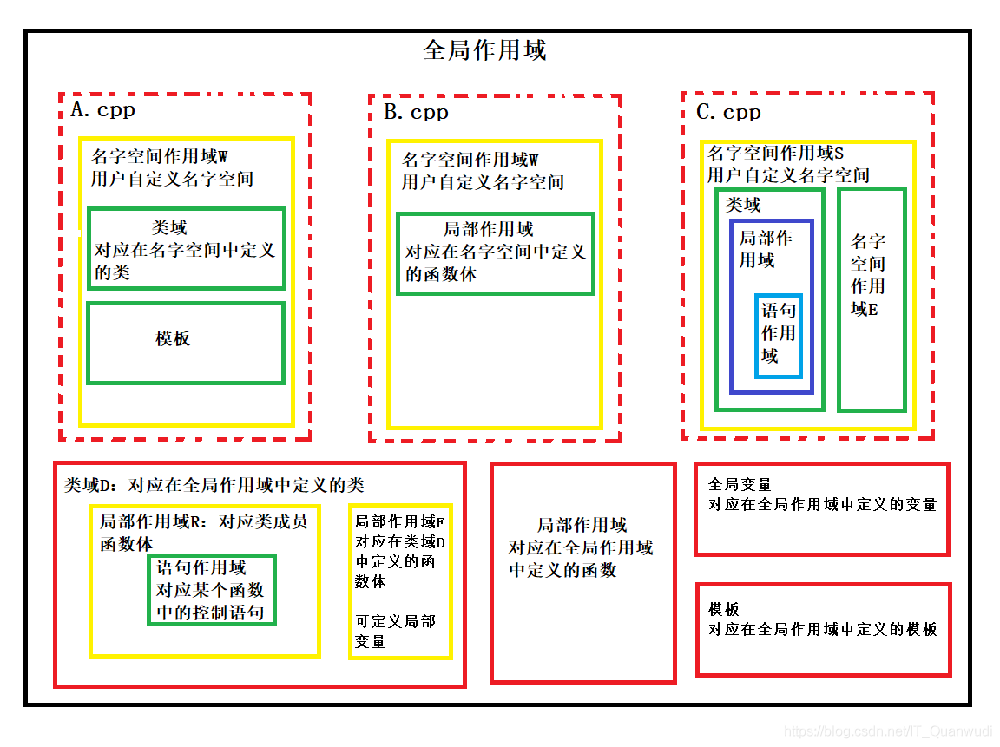
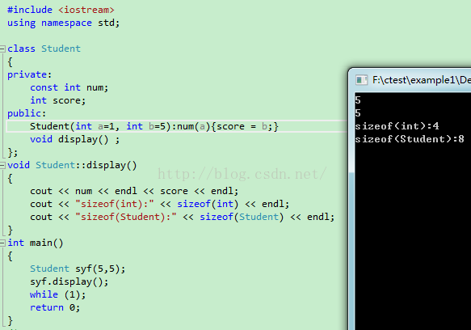
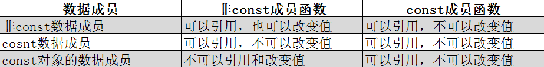

[TOC]

<!--more-->

## 7.1 命名空间

工程中会出现同名重定义问题，为避免多个 `.cpp` 链接时报错，引入命名空间的概念。

>  命名空间：利用命名空间，在C++程序中划分出来的一块比较大的程序区段。在该程序区段内部，可以定义类型，函数，模版，变量。

```cpp
namespace A{
  int tmp = 1;  
};

namespace B{
  int tmp = 2;  
};
```

在不同命名空间中的变量会有各自的程序区段，故不会发生编译错误

### 7.1.1 匿名命名空间

- 在匿名空间中声明的变量和函数，都不会暴露在其他编译单元中

```cpp
namespace{
	int n;
	void f(){
		n++;
	}
}
```

### 7.1.2 命名空间使用

全局作用域符：`::`

命名空间作用域符：`命名空间::name`

类作用域符：`类名::name` 

**同一命名空间的成员会进行合并**

### 7.1.3 命名空间中变量的声明

```cpp
namespace A{
    int a = 10;
    int sum(int a,int b){
        return a+b;
    }
}
```

#### `using namespace 命名空间标识符;`

> 将命名空间A 中的全部内容引入到所在作用域中

```cpp
void fun(){
    using namespace A;
    int tmp = sum(a,10);
    std::cout << tmp << std::endl;
}
```

#### `namespace::成员标识符`

```cpp
void fun(){
    int tmp = A::a;
    int sum = A::sum(a,10);
    std::cout << sum << std::endl;
}
```

## 7.2 标识符的作用域与可见性

作用域：规定标识符的有效范围

可见性：标识符是否可被使用

### 7.2.1 作用域

#### 函数原型作用域

> 程序中最小的作用域

生存周期最短：从形参定义处到原型声明结束

```cpp
int fun(int i);
```

i为参数，其作用域开始于 `(` ，结束于 `)` ,`i` 不可用于程序的其他地方

函数原型声明并不关心形参名，等价于

```cpp
int fun(int);
```

#### 局部作用域

> 从定义开始，到 `}` 为止或者遇到 `return` 为止

 块指的是用一对花括号括起来的代码区域，花括号括起来就是块

```cpp
void fun(int arg){
    /*块*/
    int x;
    for(int i;i < 10;i++){
        /*块*/
        int p;
    }
}
```

块作用域的范围是从变量的定义处到包含该定义所在的块末尾

- arg：作用域为函数块
- x：作用域为函数体
- i：作用域为for循环块
- p：作用域为函数体内

局部作用域中新声明的变量会覆盖全局作用域中的同名变量

#### 类作用域

每个类都有自己作用域，一个类就是一个作用域

在类外定义的成员函数必须同时提供类名和函数名(指定特定的类作用域)

```cpp
class A{
    public:
    	void swap(int x,int y);
    private:
    	int x,y;
};

void A::swap(int x,int y){
    int tmp = x;
    x = y;
    y = x;
}
```

在类作用域外，普通数据成员和函数成员只能通过对象、引用或指针访问

- 访问控制权限为 `public` 的成员，在类外访问

  ```cpp
  成员：
      对象.公有成员;
  	对象::公有成员;
  	ptr->公有成员
  ```

###### 类的编译顺序

1. 从上到下一次编译变量，类型别名，函数声明及返回值和形参
2. 当上一步完成才编译函数成员的函数体

所以，

- 类中重命名尽量放在类的最开始处
- 函数成员可以访问所有的数据成员

###### 类中变量名的查找顺序

```cpp
typedef int Height;
Height h = 5;
struct Node {
    void func(Height h) {
        h = 3;          // 1. 成员函数func 中的形参 h = 3
        this->h = 3;    // 2. 成员变量 h = 3
        Node::h = 3;    // 3. 成员变量 h = 3
        ::h = 3;        // 4. 全局范围中 h = 3
    }
private:
    Height h;
};
```

变量名的查找顺序：从包含该变量的最小作用域开始查找，找不到则迭代向上层查找，直至全局作用域

1. 成员函数中的局部变量
2. 类变量
3. 全局变量

#### 命名空间作用域

- 命名空间作用域可以跨越多个 `*.cpp` 文件而存在。
- 命名空间作用域是可以互相嵌套的

#### 全局作用域

作用域范围：从定义开始到源文件结束，在整个函数执行期间保持有效

生命周期：程序一启动就会分配存储空间，直到程序退出，由系统回收内存空间

存储位置：静态存储区

```cpp
#include

int a,b;//全局变量

void function1(){
    //fun1属于a,b的作用域
    //此时x,y未定义，在fun1中无效
}

float x,y;

void function2(){
    //fun2属于a,b,x,y的作用域，
    //在fun2(),main()中不声明就可以使用
}

int main(int argc,char * argv[]){

	return 0;
}
```

- 全局变量只能被定义一次

  全局变量的内存分配是在编译过程中完成的，在程序的整个执行过程都要占用存储空间，而不是在需要的时候才开辟内存空间



### 7.2.2 可见性

> 程序运行到某一点，能够引用的标识符

标识符声明在前，引用在后

在同一作用域中，不能声明同名标识符

两个或多个具有包含关系的作用域中声明了同名标识符，外层标识符在内层不可见

**可见性** ：`局部作用域 > 类作用域 > 命名空间作用域`

## 7.3 对象的生存周期

### 7.3.1 静态生存周期

对象的生存期与程序的生存周期相同

加 `static` 使局部变量具有静态生存周期

当一个函数返回后，下次调用时，该变量的值保持不变

- 默认初值为 `0`

#### 类的静态成员

> 静态成员是解决同一类的不同对象之间的成员(数据和函数)的共享问题

##### 静态数据成员——类属性

静态成员在每个类中只有一个副本，由本类的所有对象共同维护

可通过 `类名::标识符` 访问

累的静态数据成员在类外定义和初始化，需要为其分配单独的内存空间

```cpp
class Point{
	private:
		int x,y;
		static int count;
		
	public:
		Point(int x = 0,int y):x(x),y(y){count++;}
		Point(Point &p):x(p.x),y(p.y){count++;}
}

int Point::count = 0;
```

##### 静态函数成员

静态函数成员可以直接访问该类的静态数据成员和函数成员

对非静态成员的访问需要通过对象

可通过类名和对象名调用，一般约定用类名调用

```cpp
class Point{
	private:
		int x,y;
		static int count;
		
	public:
		Point(int x = 0,int y):x(x),y(y){count++;}
		Point(Point &p):x(p.x),y(p.y){count++;}
		static void showCount(){
			cout << "count:" << count <<endl;
		}
		~Point(){count--;}
}

int Point::count = 0;

int main(){
	Point a(1,0);
	Point::showCount();
}
```

#### 动态生存周期

从声明开始，到所在块执行完成时结束

```cpp
# include<iostream>

using namespace std;

int i = 1;//全局变量，具有静态生存周期

void other(){
	static int a = 2;//a,b静态局部变量，局部可见，全局生存周期
	static int b;
	int c = 10;//c为局部变量，动态生存周期，局部可见
	
	a += 2;
	i += 32;
	c += 5;
	
	cout << "---OTHER---" << endl;
	cout << "i:" << i << " a:" << a << " b:" << b << " c:" << c << endl;
}

int main(){
	static int a;//a是静态局部变量，局部可见，具有全局生存周期
	int b = -10;
	int c = 0;//b,c是局部变量，局部可见，动态生存周期

	cout << "---MAIN1---" << endl;
	cout << "i:" << i << " a:" << a << " b:" << b << " c:" << c << endl;
	/*运行结果
	 *---MAIN1---
	 *i:1 a:0 b:-10 c:0
	 */
	 
	c += 8;
	other();
	/*运行结果
	 *---OTHER---
	 *i:33 a:4 b:0 c:15
	 */
	 
	cout << "---MAIN2---" << endl;
	cout << "i:" << i << " a:" << a << " b:" << b << " c:" << c << endl;
	/*运行结果
	 *---MAIN2---
	 *i:33 a:0 b:-10 c:8
	 */
	 
	 i += 10;
	 other();
	 /*运行结果
	 *---MAIN1---
	 *i:75 a:6 b:4 c:15
	 */

	return 0;
}
```

## 7.4 类的友元

> 友元：提供了不同类的成员函数之间，类的成员函数与一般函数之间进行数据共享的机制

### 7.4.1 友元函数

类中通过 `friend` 关键字修饰非成员函数

在类外可以通过对象名访问类的私有和保护成员

```cpp
class Point{
	private:
		int x,y;
		
	public:
		Point(int x = 0,int y):x(x),y(y){}
		Point(Point &p):x(p.x),y(p.y){}
		int getX(){return x;}
		int getY(){return y;}
		friend float dist(Point &p1,Point &p2);
}；

float dist(Point &p1,Point &p2){
	double x = p1.x - p2.x;
	double y = p1.y - p2.y;
	
	return static_cast<double>(sqtr(x * x + y * y));
}
```

### 7.4.2 友元类

若A类为B类的友元类，则A类中的所有成员函数都是B类的友元函数，都可以访问B类的私有和保护成员

+ 友元关系是单向的
+ 友元关系不能传递
+ 友元关系不能被继承

## 7.5 共享数据的保护

### 7.5.1 常对象

> 常对象必须被初始化，不能被更新

常量对象只能调用类的常量成员函数，不能调用非常量成员函数

```cpp
class A{
    /*类声明*/
};

A const a(3,4);
const A a(3,4);
```

### 7.5.2 常对象成员

#### 常成员函数

`类型说明符 函数名(参数列表) const;`

```cpp
class R{
	void printf() const;
};

void R::printf() const{}
```


常成员函数可以引用 `const` 数据成员，也可以引用非 `const` 的数据成员，但不能修改数据成员的值

- 常成员函数不能调用另一个非常成员函数

```cpp
#include <iomanip>
#include <iostream>
#include<cstdio>

using namespace std;

class A{
	private:
    	int w,h;
    public:
    	int getValue() const{
            return w*h;
        }
    	int getValue(){
            return w+h;
        }
    	A(int x,int y):w(x),h(y){}
    	A(){}
};

int main(){
    A const a(3,4);
    A c(3,4);
    //常量对象只能调用常成员函数
    cout << a.getValue() << endl;//12
    //一般对象调用非常成员函数
    cout << c.getValue() << endl;//7

    return 0;
}
```

---

被 `mutable` 修饰的数据成员可以被常成员函数修改

- `mutable` 修饰的常成员对象不会被视为常成员

```cpp
#include<iostream>
using namespace std;
class Student{
    public:
        Student(int n,float s):num(n),score(s){}
        void change(int n,float s) const{num=n;score=s;}
        void display() const{cout<<num<<"\t"<<score<<endl;}
    private:
        mutable int num;
        mutable float score;
};

int main(){
	Student const stud(101,78.5);
   	stud.display();
   	stud.change(101,80.5);
   	stud.display();
    return 0;
} 
/*运行结果*/
101 78.5
101 80.5
```

### 7.5.3 常数据成员

常数据成员只能通过构造函数赋值

- 所有构造函数都需初始化常成员函数



类成员的常量和静态变量都应在类作用域外定义

- 特例：类的静态常量如果是整型或枚举，则可以直接在类中定义

```cpp
class A{
	public:
		A(int i);
	private:
		const int a;
		static int b;
};
int A::b = 10;

A::A(int i):a(i){}
```

 

### 7.5.4 常引用

`const 类型说明符 &引用名`

- 被引用的对象不能被更新

一个常引用，无论绑定普通对象还是常对象，通过该引用访问该对象时都将该对象看做常对象

- 对于基本数据类型的常引用，不能修改值
- 对于类的常引用，不能修改类的数据成员，也不能调用非 `const` 成员函数

## 7.6 多文件结构和编译预处理指令

### 7.6.1 C++程序的一般组织结构

- 类定义文件 `*.h`
- 类实现文件 `*.cpp`
- 工程文件 `*.cpp`

决定一个声明放在源文件还是头文件的原则：

- 需要分配内存的定义在源文件中

- 不需要分配内存的放在头文件

  内联函数放在头文件——使多个源文件可见

文件的引用

- 自定义文件 `""`
- 库函数 `<>`

### 7.6.2 外部变量和外部函数

#### 外部变量

外部变量是多个源文件可见的全局变量

```cpp
//源文件1
int i = 3;//定义性声明
void next();

int main(){
	i++;
	next();

	return 0;
}

void next(){
	i++;
	other();
}

//源文件2
extern int i;//声明一个在其他文件中定义的外部变量；引用性声明
void other(){
	i++;
}
```

##### 定义性声明和引用性声明

定义性声明：在声明的同时定义的外部变量为定义性声明

在命名空间中不使用 `extern` 声明的变量，都是定义性声明，即不引用外部变量

用 `extern` 声明，同时定义了初值，为定义性声明，否则为引用性声明

#### 外部函数

所有在类外声明的非成员函数，都具有全局命名空间作用域，只要在调用前进行引用性声明即可

### 7.6.3 编译预处理

#### `#include` 指令

将指定源文件嵌入到当前源文件的该点

`# include<文件名>` ：待引用源文件位于 include 子目录中

`# include "文件名"` ：先在当前目录搜索，如果没有，再按照标准搜索


#### 条件编译指令

```cpp
#if 常量表达式
	程序段
#endif
```

```cpp
#if 常量表达式
	程序段1
#else
    程序段2
#endif
```

```cpp
# if 常量表达式1
 程序段1
# elif 常量表达式2
	程序段2
	...
# else
	程序段n
# endif
```

```cpp
# ifdef 标识符 //# ifndef 标识符
	程序段1
# else
	程序段2
# endif
```

#### `#define` 和 `#undef`

用 `#undef` 删除由 `#define` 定义的宏，使之不再起作用

```cpp
#ifndef MYHEAD_H
#define MYHEAD_H
...
#endif
    
    
    
/*等价于*/
# if!defined(MYHEAD_H)
# define MYHEAD_H
...
# endif
```

---

```cpp
//main.cpp
# include"file1.h"
# include"file2.h"

int main(){
    
}

//file1.h
# include"head.h"
...

//file2.h
# include"head.h"
...

//head.h
# ifndef HEAD_H//避免重复定义Point类
# define HEAD_H
class Point{
	...
};
```


### 7.6.4 标准C++库

- 输入输出类
- 容器类和ADT
- 存储管理类
- 算法
- 错误管理
- 运行环境支持


