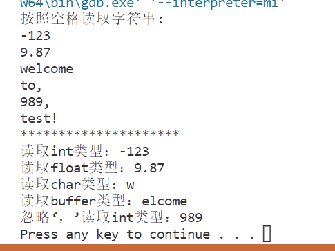

[TOC]

<!--more-->

## 8.1 IO流类

流：一种抽象，负责建立数据之间的联系，并操作数据的流动

程序将流对象看作文件对象的化身

数据从一个地方传输到另一个地方都是流操作

- 提取：读操作
- 插入：写操作


### 8.1.1 抽象流基类

| 类名  | 说明   | 所属文件 |
| ----- | ------ | -------- |
| `ios` | 流基类 | `ios`    |

### 8.1.2 输入流类

| 类名            | 说明                             | 所属文件  |
| --------------- | -------------------------------- | --------- |
| `istream`       | 通用输入流类和其他输入流类的基类 | `istream` |
| `ifstream`      | 文件输入流类                     | `fstream` |
| `istringstream` | 字符串输入流类                   | `sstream` |

### 8.1.3 输出流类

| 类名            | 说明                             | 所属文件  |
| --------------- | -------------------------------- | --------- |
| `ostream`       | 通用输出流类和其他输出流类的基类 | `ostream` |
| `ofstream`      | 文件输出流类                     | `fstream` |
| `ostringstream` | 字符串输出流类                   | `sstream` |

### 8.1.4 输入输出流类

| 类名           | 说明                                 | 所属文件  |
| -------------- | ------------------------------------ | --------- |
| `iostream`     | 通用输入输出流类和其他输出流类的基类 | `istream` |
| `fstream`      | 文件输入输出流类                     | `fstream` |
| `stringstream` | 字符串输入输出流类                   | `sstream` |

## 8.2 C++标准输出

> 很多操作符在 `ios_base` 和 `iomanip` 头文件都有定义，使用时包含二者即可

#### `>>`

默认以空白符为间隔符输出

#### `<<`

默认以空白符为间隔符输入

### 8.2.1 cout 输出流

| 操作符            | 描述                           |
| :---------------- | :----------------------------- |
| ws                | 提取空白符                     |
| endl              | 插入换行符并刷新流             |
| ends              | 插入空字符                     |
| setw(int)         | 设置域宽                       |
| setprecision(int) | 设置浮点数小数位数(包含小数点) |

```cpp
cout << setw(5) << setprecision(3) << 3.1415 << endl;
//设置域宽为5，小数点后保留两位有效小数
```

**setw()** 函数会用当前的填充字符控制对齐位置，默认的填充字符是空格

可以通过 `<iomanip>` 的 `setfill` 来设置填充字符

```cpp
#include <iomanip>
#include <iostream>

using namespace std;

int main(void) {
    cout << setfill('0') << setw(10) << 45698 << endl;//0000045698

    return 0;
}
```

CPU所执行的指令并不对操作数的类型加以区分，对各个操作数都执行相同的操作，编译器根据变量的数据类型选择合适的指令

- 符号扩展：有符号数据类型，用符号位扩展

- 0扩展：无符号数据类型，用0填充

### 8.2.2 I/O格式化输出

`cout` 是 STL 库提供的一个 `iostream` 实例，拥有 `ios_base` 基类的全部函数和成员数据

进行格式化定义可以使用 `setf` 或 `unsetf` 函数和 `flag` 函数

> `cout` 维护一个当前的格式状态
>
> `setf` 和 `unsetf` 是在当前的格式状态上追加或删除指定的格式
>
> `flag` 则是将当前格式状态全部替换成指定的格式

| 操作符名           | 含义                                                         |
| :----------------- | :----------------------------------------------------------- |
| `ios_base::skipws` | 跳过空白                                                     |
| `ios::dec`         | 数值类型采用十进制表示                                       |
| `ios::hex`         | 数值类型采用十六进制表示                                     |
| `ios::oct`         | 数值类型采用八进制表示                                       |
| `ios::showbase`    | 为整数添加一个表示其进制的前缀                               |
| `ios::internal`    | 在符号位和数值中间按需插入字符，使两端对齐                   |
| `ios::left`        | 在串的末尾插入填充字符使串左对齐                             |
| `ios::right`       | 在串的末尾插入填充字符使串右对齐                             |
| `ios::boolalpha`   | 将 `bool` 类型的值以 `true` 或 `false` 表示                  |
| `ios::fixed`       | 将浮点数按照普通定点格式处理(非科学计数法)                   |
| `ios::scientific`  | 将浮点数按科学计数法处理(带指数域)                           |
| `ios::showpoint`   | 在浮点数表示的小数中强制插入小数点(默认情况下浮点数表示的整数不显示小数点) |
| `ios::showpos`     | 强制在正数前添加 `+`                                         |
| `ios::skipws`      | 忽略前导空格，主要用于 `cin`                                 |
| `ios::unitbuf`     | 在每次输出后清空缓存                                         |
| `ios::uppercase`   | 强制大写字母                                                 |

以上每种格式都独立占用一bit，可以用 `|` 运算符组合使用，调用 `setf/unsetf` 设置输出格式一般用法 

`setf` 可接受一个或两个参数

- `cout.setf(指定格式);`
- `cout.setf(指定格式,删除的格式);`

```cpp
cout.setf(ios::right | ios::hex);//设置十六进制右对齐
cout.setf(ios::right ,ios::adjustfield);//取消其他对对齐，设置为右对齐
```

以预定义的bit组合位

- `ios::adjustifield` 对齐格式的bit组合位
- `ios::basefield` 进制的bit组合位
- `ios::floatfield` 浮点表示方式的bit组合位

**设置格式后，之后所有的 `cout` 都会按照指定的格式状态执行**

如果在一次输出过程中需要混在多种格式，使用 `cout` 的成员函数来处理就很不方便了，`STL` 提供了一套 `<iomanip>` 库可以满足这种使用方式

`<iomanip>` 库中将每一种格式的设置和删除都进行了函数级的同名封装，比如 `fixed` ，就可以将一个ostream的对象作为参数，在内部调用 `setf(ios::fixed)` 后再返回原对象。此外 `<iomanip>` 还提供了setiosflags、setbase、setfill、setw、setprecision等方便的格式控制函数。大多数示例代码都会使用到<iomanip>，因此默认包含的头文件均为：

```cpp
#include <iomanip>
#include <iostream>
```

#### 缩进

将输出内容按指定的宽度对齐

```cpp
#include <iomanip>
#include <iostream>

using namespace std;

int main(void) {
    cout.flags(ios::left); //左对齐
    cout << setw(10) << -456.98 << "The End" << endl;
    cout.flags(ios::internal); //两端对齐
    cout << setw(10) << -456.98 << "The End" << endl;
    cout.flags(ios::right); //右对齐
    cout << setw(10) << -456.98 << "The End" << endl;

    return 0;
}
```

---

```cpp
#include <iomanip>
#include <iostream>

using namespace std;

int main(void) {
    cout << left << setw(10) << -456.98 << "The End" << endl; //左对齐
    cout << internal << setw(10) << -456.98 << "The End" << endl; //两端对齐
    cout << right << setw(10) << -456.98 << "The End" << endl; //右对齐

    return 0;
}
```


#### 对齐方式

> 默认为右对齐 `setiosflags`

```cpp
# include<iostream>
# include<iomanip>

cout << setiosflags(ios_base::left) << <<resetiosflags(ios_base::left);
//setiosflags的影响是持久的，直到遇到resetiosflags
//需要使用iostream基类的类，需要作用域分辨符::
//setiosflags的其他成员可以由 “|” 自由组合
```

#### 整数

```cpp
#include <iomanip>
#include <iostream>

using namespace std;

int main(void) {
    cout.setf(ios::showpos | ios::uppercase);
    cout << showbase << hex << setw(4) << 12 << setw(12) << -12 << endl;
    cout << showbase << dec << setw(4) << 12 << setw(12) << -12 << endl;
    cout << showbase << oct << setw(4) << 12 << setw(12) << -12 << endl;
        
    cout.unsetf(ios::showpos | ios::uppercase);
    cout << noshowbase << hex << setw(4) << 12 << setw(12) << -12 << endl;
    cout << noshowbase << dec << setw(4) << 12 << setw(12) << -12 << endl;
    cout << noshowbase << oct << setw(4) << 12 << setw(12) << -12 << endl;

    return 0;
}
```


---

由于 `<iomanip>` 的 `setbase()` 函数设置整数进制反而比上述方法还复杂，所以除非特殊的代码规范要求，一般不建议使用

#### 小数

分为两种：

- 定点表示 `ios::fixed` ，不带指数域
- 科学计数法表示 `ios::scientific` 带指数域

与 `<iomanip>` 的 `setprecision` 配合使用，可以指定小数点后保留位数

```cpp
#include <iomanip>
#include <iostream>

using namespace std;

int main(void) {
    cout.setf(ios::fixed);
    cout << setprecision(0) << 12.05 << endl;
    cout << setprecision(1) << 12.05 << endl;
    cout << setprecision(2) << 12.05 << endl;
    cout << setprecision(3) << 12.05 << endl;

    cout.setf(ios::scientific, ios::floatfield);
    cout << setprecision(0) << 12.05 << endl;
    cout << setprecision(1) << 12.05 << endl;
    cout << setprecision(2) << 12.05 << endl;
    cout << setprecision(3) << 12.05 << endl;

    return 0;
}
```


有时因为机器表示浮点数的舍入误差，需要手动修正

```cpp
#include <iomanip>
#include <iostream>

using namespace std;

int main(void) {
    cout << fixed << setprecision(1) << 2.05 << endl;//2.0
    cout << fixed << setprecision(1) << 2.05 + 1e-8 << endl;//2.1

    return 0;
}
```

#### 字符串

字符串的输出处理主要是对齐，

字符串的输入方法

`getline()` 会读取屏幕上输入的字符，直至遇到换行符 `\n` 位置

- `getline(指定输入流,指定一个string对象)`
- `getline(指定输入流,指定一个string对象,指定的结束字符)`

`getline` 不会读入结束符号，读取指针会跳转至下一个非结束字符处

```cpp
#include <iomanip>
#include <iostream>
#include <string>

using namespace std;

int main(void) {
    string str1, str2;
    getline(cin, str1);

    cin >> str2;
    cout << str1 << endl << str2 << endl;

    return 0;
}
```

输入：

  abc
  abc

结果：

  abc
  abc

#### 缓冲区

由于调用系统函数在屏幕上逐个显示字符是很慢的，因此cin/cout为了加快速度使用缓冲区技术，粗略的讲就是暂时不输出指定的字符，而是存放在缓冲区中，在合适的时机一次性输出到屏幕上

如果要和C标准库的stdio库函数混合使用就必须要小心的处理缓冲区了

**如果要与scanf和printf联合使用，务必在调用cout前加上`cout.sync_with_stdio()`，设置与stdio同步，否则输出的数据顺序会发生混乱。**

flush和endl都会将当前缓冲区中的内容立即写入到屏幕上，而unitbuf/nounitbuf可以禁止或启用缓冲区。

```cpp
#include <iomanip>
#include <iostream>

using namespace std;

int main(void) {
    cout << 123 << flush << 456 << endl;
    cout << unitbuf << 123 << nounitbuf << 456 << endl;
    return 0;
}
```

## 8.3 输出流

输出到流对象

- `ostream`：向标准设备输出
- `cout`：标准输出流(向屏幕输出)
- `cerr`：不经过缓冲区直接向显示器输出提示
- `clog`：先把信息放在缓冲区，缓冲区满或遇到 `endl` 时向显示器输出

- `ofstream` ：支持磁盘文件输出
- `ostringstream`

### 8.3.1 文件输出流对象

#### 构造

使用默认构造函数，然后调用 `open()` 成员函数

```cpp
ofstream myfile;
mfile.open("filename");
```

调用有参构造函数初始化

```cpp
ofstream myFile("fliename");
```

同一个文件流对象可以打开不同文件

```cpp
ofstream file;
file.open("File1");
...
file.close();
file.open("File2");
...
file.close();
```

#### 成员函数

##### `open()`

```cpp
ofstream myfile;
myfile.open("test.txt",ios_base::out|ios_base::app);
```

|        标志        | 功能                                                         |
| :----------------: | :----------------------------------------------------------- |
| `ios_base::binary` | 以二进制打开文件                                             |
|   `ios_base::in`   | 打开一个输入文件                                             |
|  `ios_base::out`   | 打开一个输出文件,默认此模式                                  |
| `ios_base::trunc`  | <br />打开文件并格式化；<br />默认的文件打开模式：若指定了`ios_base::out` ，但未指定`ios_base::ate`、`ios_base::app` |
|  `ios_base::app`   | 打开输出文件在末尾添加数据                                   |
|                    |                                                              |
|  `ios_base::ate`   | 打开现存文件并查找到结尾                                     |

##### `close()` 

> 关闭与一个文件疏忽流关联的文件

##### `put()`

> 输出一个字符

```cpp
cout.put('A');
cout << 'A';
```

##### `write()`

> 将内存中的一块内容以字节为单位写到文件输出流中
>
> - arg1：文件写首地址
> - arg2：待写入数据的字节数
>
> 遇空格不停止

```cpp
# include<fstream>

using namespace std;

struct Data{
	char month,day,year;//会出现乱码
};

int main(){
	Data dt = {'6','10','92'};
	ofstream file("data.doc",ios_base::binary);
	
	file.write(reinterpret_cast<char*>(&dt),sizeof(dt));//使用指针转换，不保证全部内容都输出到文件中
	file.close();
	
	return 0;
}
```

#### 错误处理函数

| 函数 |                  功能及返回值                  |
| :--: | :--------------------------------------------: |
| bad  |         出现不可恢复的错误，返回非0值          |
| fail | 出现不可恢复 的错误或者一个预期条件，返回非0值 |
| eof  |              遇文件尾，返回 非0值              |

#### 二进制输出文件

> 使用二进制模式，所写的字符是不转换的

```cpp
#include <fstream>
#include <iostream>
using namespace std;
 
int main (){
   char data[100];
 
   // 以写模式打开文件
   ofstream outfile;
   outfile.open("afile.dat",ios_base::binary);
 
   cout << "Writing to the file" << endl;
   cout << "Enter your name: "; 
   cin.getline(data, 100);
 
   // 向文件写入用户输入的数据
   outfile << data << endl;
 
   cout << "Enter your age: "; 
   cin >> data;
   cin.ignore();
   // 再次向文件写入用户输入的数据
   outfile << data << endl;
 
   // 关闭打开的文件
   outfile.close();
 
   // 以读模式打开文件
   ifstream infile; 
   infile.open("afile.dat"); 
 
   cout << "Reading from the file" << endl; 
   infile >> data; 
 
   // 在屏幕上写入数据
   cout << data << endl;
   
   // 再次从文件读取数据，并显示它
   infile >> data; 
   cout << data << endl; 
 
   // 关闭打开的文件
   infile.close();
 
   return 0;
}
```


#### 文件输出流

> `ostringstream` 表示一个字符串的输出流

重载格式：

- 一个参数：表示打开方式
- 两个参数：(字符串的初始化内容,打开方式)


```cpp
#include<iostream>
#include <sstream> 
using namespace std;

int main(){
	string test = "-123 9.87 welcome to, 989, test!";
	istringstream iss;//istringstream提供读 string 的功能
	iss.str(test);//将 string 类型的 test 复制给 iss，返回 string对象
    
	string s;
	cout << "按照空格读取字符串:" << endl;
	while (iss >> s){
		cout << s << endl;//按空格读取string
	}
	cout << "*********************" << endl;
 
	istringstream strm(test); 
	//创建存储 test 的副本的 stringstream 对象
	int i;
	float f;
	char c;
	char buff[1024];
 
	strm >> i;
	cout <<"读取int类型："<< i << endl;
	strm >> f;
	cout <<"读取float类型："<<f << endl;
	strm >> c;
	cout <<"读取char类型："<< c << endl;
	strm >> buff;
	cout <<"读取buffer类型："<< buff << endl;
	strm.ignore(100, ',');
	int j;
	strm >> j;
	cout <<"忽略‘，’读取int类型："<< j << endl;
 
	system("pause");
	return 0;
}
```



### 8.3.2 输入流

> 从流对象中输入内容

```cpp
ifstream myFile;
myFile("filename");
===========================
ifstream myFile("filename");
```

#### 成员函数

##### `get()`

> 读入一个字符，包括空白符

```cpp
# include<iostream>

using namespace std;

int main(){
	char ch;

	while((ch = cin.get()) != EOF)
		cout.put(ch);
		
	return 0;
}
```

##### `getline()`

`getline(输入流,char *s,char ch)`

> 读取至分割符，读取完删除分隔符

```cpp
# include<iostream>

using namespace std;

int main(){
	string line;
	char t;

	cin >> t;//以t指定的分割符，从line中读取一行字符
	getline(cin,line,t);
	cout << line << endl;
		
	return 0;
}
```

##### `open()`

|       格式       | 功能             |
| :--------------: | :--------------- |
|   ios_base::in   | 打开文件用于输入 |
| ios_base::binary | 以二进制文件打开 |

##### `close()`

> 关闭指定输入文件

##### `read()`

> 从文件中读字节到指定存储器

`read(存储首地址,指定字节数)`

读入结束：

- 文件结束
- 在文本模式遇到结束标识符

```cpp
# include<iostream>
# include<fstream>
# include<cstring>

using namespace std;

struct SalaryInfo{
	char id[10];
	char salary[10];
};

int main(){
	SalaryInfo employee1 = {'60001','8000'};
	ofstream os("Payroll.txt",ios_base::out|ios_base::binary);
	os.write(reinterpret_cast<char *>(& employee1),sizeof(employee1));
	os.close();	
	
	ifstream is("Payroll.txt",ios_base::in|ios_base::binary);
	if(is){
		SalaryInfo employee2;
		is.read(reinterpret_cast<char *>(& employee2),sizeof(employee2));
		cout << employee2.id << " " << employee2.salary << endl;
	}
	else
		cout << "Error" << endl; 
	
	is.close();
	
	return 0;
}
```


#### 字符串输入流应用

##### 字符串转换为数值

```cpp
# include<iostream>
# include<sstream>
# include<string>

using namespace std;

template<class T>//函数模板，出现<内容>的地方都用T代替 
inline T fromString(const string &str){
	istringstream is(str);
	T v;
	is >> v;

	return v;
}

int main(){
	int v1 = fromString<int>("5");
	cout << v1 << endl;

	double v2 = fromString<double>("1.2");
	cout << v2 << endl;
	
	return 0;	
}
```

##### 数值转字符串

```cpp
# include<iostream>
# include<sstream>
# include<string>

using namespace std;

template<class T>
inline string toString(const T &v){
	ostringstream os;
	os << v;

	return os.str();
}

int main(){
	string str1 = toString(5);
	cout << str1 << endl;
	string str2 = toString(1.2);
	cout << str2 << endl;
	
	return 0;
}
```

#### seekg(),tellg()

> 在文件输入流中，保留着一个指向文件中下一个将读入数据的位置的内部指针，用`seekg`设置指针

`seekg(偏移量,基地址);`：文件定位

- 偏移量：正值表示向后偏移；负值表示向前偏移

- 基地址：

  `ios::beg`：输入流的开始位置

  `ios::cur` ：输入流的当前位置

  `ios::end`：输入流的结束位置

`tellg()` ：返回当前定位指针的位置

```cpp
#include <iostream>
#include <fstream>
#include <cassert>

using namespace std;

int main(){
    ifstream in("test.txt");
    assert(in);
   
    in.seekg(0,ios::end);//基地址为文件结束处，偏移地址为0，于是指针定位在文件结束处
    streampos sp=in.tellg(); //sp为定位指针，因为它在文件结束处，所以也就是文件的大小
    cout << "file size:" << sp << endl << "====" << endl;
	in.seekg(0,ios::beg);//基地址为文件头，偏移量为0，于是定位在文件头
    cout << in.rdbuf() << endl;//从头读出文件内容
	cout << "=========" << endl;

    in.seekg(-sp/3,ios::end);  //基地址为文件末，偏移地址为负，于是向前移动sp/3个字节
    sp = in.tellg();
    cout << "from file to point:" << sp << endl << "========";
    in.seekg(sp);
    cout << in.rdbuf() << endl; //从sp开始读出文件内容

    return 0;
}
```


