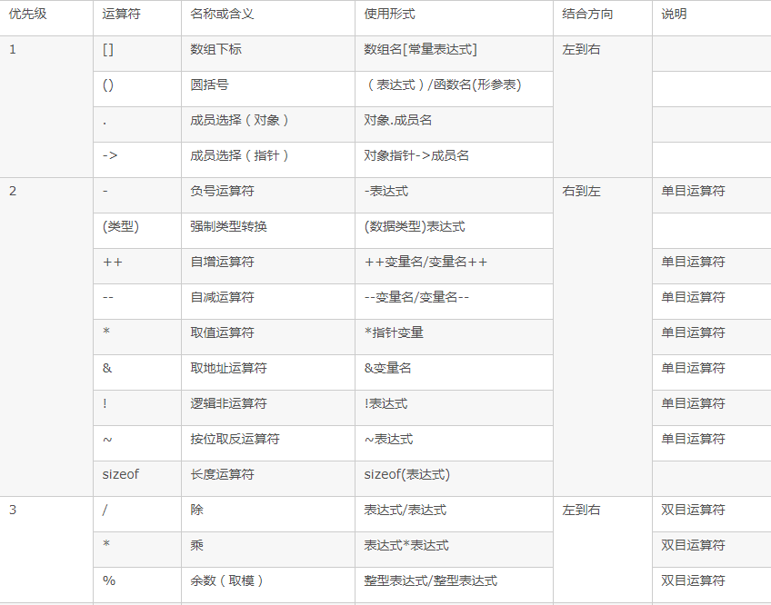
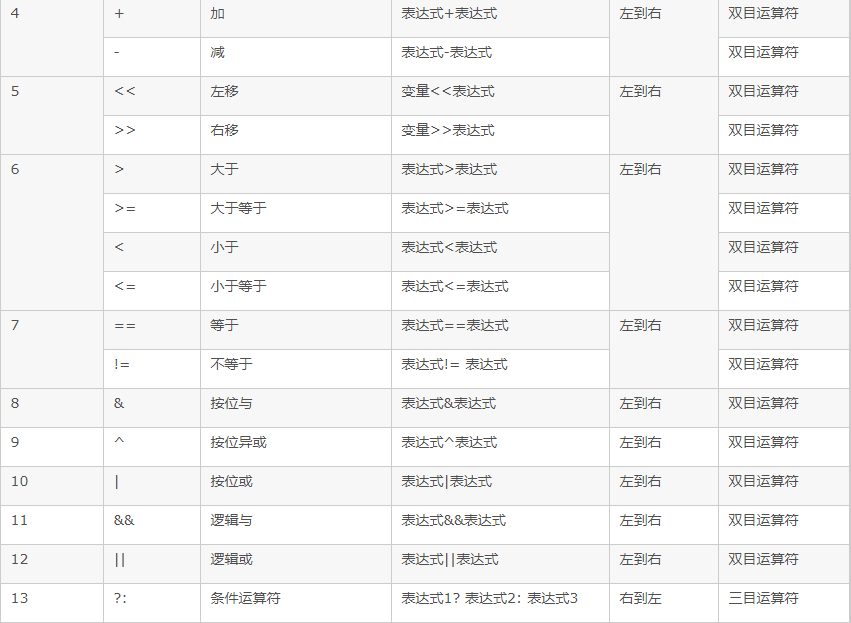
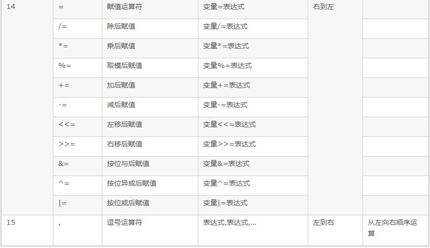
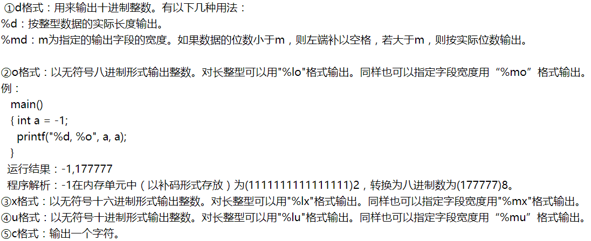
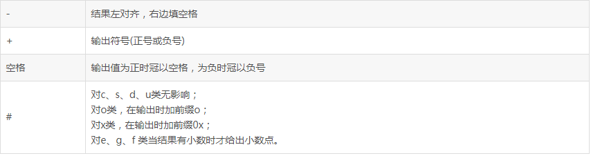

>   C语言基本语法

<!--more-->

# C

## 1. 概述

### 1.1 优点

-   简洁性：核心内容少，只有 **32** 个关键字，**9** 种控制语句、**44** 种运算符

    条件语句：if...else，switch

    循环语句：while，for，do...while

    break，continue，return，goto

-   丰富的数据类型

-   具有低级语言的特点：与汇编语相近的功能和描述方法，如地址运算和二进制数位 

    可以对硬件端口进行直接操作

-   结构化语言，适用于大型程序**模块化设计**

-   代码效率高

-   语法限制不严，程序设计自由度大

-   可移植性好

### 1.2 算法

>   通过有限步骤，明确的操作产生问题答案

**算法表示**
自然语言，传统流程图，N-S流程图，伪代码

**常用算法**：枚举，递推，递归

### 1.3 三种基本程序结构

顺序、循环、选择

## 2. 变量

### 2.1 变量命名规则

+ 首字母必须是 字母或下划线
+ 只能包含字母、数字、下划线
+ 标识符不能是关键字
+ 不能跨行书写 

### 2.2 变量的作用域及存储类别

#### 2.2.1 作用域

**全局变量任意函数都可访问、修改**

当局部变量与全局变量发生冲突时，以局部变量为主

若要扩充作用域使用`extern`

#### 2.2.2 存储类别

执行C语言程序，可用的存储区有

1.  程序区

2.  静态存储区：编译时分配内存；包括 `static,extern`

3.  动态存储区：运行时分配内存；包括 `static,auto`

##### `static`

静态局部变量

- 仅在本函数中使用，调用后不清零
- 只能赋一次初值，若不初始化 自动赋0或空字符
- 可使用静态局部变量跟踪调用次数

静态全局变量

-   仅限在定义的文件中使用，可使不同源文件中的静态全局变量独立

##### `register`

整型，字符变量，指针类型

##### `extern`

在函数外部引用变量使用 `extern` ，扩充已定义的全局变量作用域

一个C语言程序包含多个源程序，若使用同一外部变量，在一个源文件中定义，在另一个中用 `extern` 说明是外部变量。引用外部函数时，被引用函数需添加 `extern`

## 3. 运算符

结合性：单目运算符，赋值运算符，三目运算符为右结合性；
其余为左结合性（从左向右看）

```c
x = 2;
x+=x+=x-=1; //=> x = 4

y = x&1 == x%2; //=> y = 1
/*
 *设x = 10 0&1 = 0 , x % 2 = 0   y = 1
 */
 
a = b = c = 1;
++a||++b&&++c;
//a = 2,b = 1,c = 1;
```

### 3.1 算数运算符



-   “单”表示单目运算符：逻辑非(!),按位取反(~),自增(++),自减(--),取地址(&),取值(* )；
-    “算”表示算术运算符：乘、除和求余(* ,/,%)级别高于加减(+,-)；
-   “移”表示按位左移(<<)和位右移(>>)；
-   “关”表示关系运算符：大小关系(>,>=,<,<=)级别高于相等不相等关系(==,!=)；
-   “与”表示按位与(&)；
-   “异”表示按位异或(^)；
-   “或”表示按位或(|)；
-   “逻”表示逻辑运算符：逻辑与(&&)级别高于逻辑或(||)；
-   “条”表示条件运算符(? :)；
-   “赋”表示赋值运算符(=,+=,-=,*=,/=,%=,>>=,<<=,&=,^=, |=,!=)；

## 4. 基本数据

### 4.1 基本数据类型

-   整数类型，浮点类型，字符类型
-   转义字符
-   有符号数和无符号数
-   进制表示：十六进制：0X/0x、八进制：0

### 4.2 构造类型

#### 结构体

-   当结构体成员是其本身时，只能用指针
-   当初始化参数列表中参数数量少于成员个数时，其余成员自动赋0
-   对结构体成员操作，实质上是对其所在地址进行操作

##### 位域

>   特殊的结构体，以二进制位为单位，指定所占的二进制位数

-   只能用 `unsigned,int,signed int`

-   当存储单元剩下的空间不够存放一个位域时，从跳到下个存储单元，从低位开始存储

### 4.3 指针类型

>   指针就是内存地址

#### 指针访问数组

获取元素地址，使用取内容符 `&val`【视为一维数组】

#### 指针数组

`数据类型 *数组名[数组长度]`

数组名中存的是首地址

```c
char *str[3] = {"one","two","program"}
/=>
/*
* char *str[3];
* char str[0] = "one";
* char str[1] = "two";
* char str[2] = "program";
*/
```

### 4.4 空类型 `NULL`

### 4.5 类型转换

自动类型转换：将字节少的转换为字节多的

赋值类型转换：右侧表达式自动转换为左侧表达式类型，并存储在左侧变量中

强制类型转换

## 5. 函数

### 5.1 printf()函数格式

#### 数据类型符




#### 格式控制符



#### 精度格式符

`.n` ，n为十进制整数

-   如果输出数字，则表示小数的位数；
-   如果输出的是字符，则表示输出字符的个数；
-   若实际位数大于所定义的精度数，则截去超过的部分

### 5.2 switch

>   程序自动执行case后的每一个语句，直至遇到break

```c
switch(表达式)
{
  case 常量表达式1：
  语句组1;
  break;
  case 常量表达式2:
  语句组2;
  break;
  ...
  default:
  语句组n;
}
```

### 5.3 动态分配内存

```c
calloc(unsigned long,unsigned long) <==>
malloc(unsigned long * (unsigned long))

realloc(p,unsigned long)//扩充数组
free()//释放内存，使用完后必须释放内存，错误返回值为NULL
```

### 5.4 指针与函数

#### 指向函数的指针变量

`函数类型 (*指针变量名)(参数类型);`

```c
/*函数指针可指向多个函数*/
int add(int x,int y)
{
	return x+y;
}
int max(int x,int y)
{
	return x > y ? x : y;
}
int min(int x,int y)
{
	return x < y ? x : y;
}
int main()
{
	int (*p)(int,int),c,a,b;
	p = add;
	
	c = add(a,b);//=>c = (*p)(a,b);
	p = max;
	c = (*p)(a,b);
	p = min;
	c = (*p)(a,b);
}
```

#### 函数指针可作为参数

```c
/*函数指针可指向多个函数*/
int add(int x,int y)
{
	return x+y;
}
int max(int x,int y)
{
	return x > y ? x : y;
}
int min(int x,int y)
{
	return x < y ? x : y;
}
int func(int (*p)(int,int),int x,int y)
{
	return (*p)(x,y);
}
int main()
{
	int (*p)(int,int),c,a,b;
	p = max;
	c = func(p,x,y);
    p = max;
	c = func(p,x,y);
}
```

## 6. 文件

### 6.1 编译预处理

-   宏定义
-   文件包含的处理
-   条件编译

---

#### 宏

>   一般用大写，在预处理阶段，只进行代换，不做正确性检查

-   便于简化程序，修改数据

宏的定义域：从定义点开始到当前源文件结束 或 `#undef` 取消定义

#### 文件包含处理

使用 `<>` ，仅在系统指定的磁盘路径下搜索所包含的文件

使用 `""` ，现在当前工作目录中搜索，若找不到则在系统中寻找

#### 条件编译

>   通过宏定义进行条件编译

```c
# ifedf 标识符
		程序段1
# else
        程序段2
# endif
            
# if 表达式
		程序段1
# else
        程序段2
# endif            
```

### 6.2 文件分类

-   文本文件——ASCII
-   二进制文件——二进制数据

### 6.3 文件的操作

#### `FILE`

>   C语言中存放文件属性的结构体，只能通过指针访问属性

#### 打开文件

>   建立程序和文件之间的通信通道，并为文件系统建立缓冲

`FILE *fopen(char *filename,char *mode)`

```c
FILE *fp = fopen("路径","w");
```

-   filename：磁盘文件名

-   mode：指明文件使用方法

    |      |                                 |
    | ---- | ------------------------------- |
    | r    | 读的方式打开文件                |
    | w    | 写的方式打开文件                |
    | r+   | 读/写的方式打开文件             |
    | w+   | 写的方式打开新文件              |
    | a    | 写的方式向文件追加内容          |
    | a+   | 读/写的方式追加内容             |
    | rb   | 读的方式读二进制文件            |
    | rb+  | 读/写的方式二进制文件           |
    | wb   | 写的方式打开二进制文件          |
    | wb+  | 读/写二进制文件                 |
    | ab   | 向二进制文件追加内容            |
    | ab+  | 读/写的方式向二进制文件追加内容 |

#### 关闭文件

```c
int main(){
	FILE *fp;
	if(fopen("abc.txt","w")==NULL){
        exit(-1);//非0表示异常
    }
    fclose(fp);
}
```

#### 文件读写

分为

-   顺序读写
-   随机读写

需要引入 **位置指针** ：打开文件，默认指向文件开头

-   所有文件读/写，都是从 *位置指针* 只是的位置进行读/写

##### 顺序读写

###### 文件尾测试函数

`feof` ：若是文件尾，则不能读取数据

-   指向文件尾返回 非零
-   否则返回0

文件使用特殊字符 `EOF` 作为文件结束标记

###### 字符读/写函数

`fgetc(FILE *fp)`：从文件中读取一个字符，若到文件尾返回`EOF`

`fputc(int ch,FILE *fp)`：写入文件

| 从键盘读入一个字符 | 向屏幕输出一个字符 |
| ------------------ | ------------------ |
| `getchar()`        | `putchar()`        |
| `fgetc(stdin)`     | `fputc(ch,stdout)` |

###### 字符串读/写函数

`fgets(char *s,int n,FILE *fp)`

>   从 `fp` 指向的文件中**读取** `n-1` 个字符，写入s中

`fputs(char *s,FILE *fp)`

>   将s中的字符串写到 `fp` 指向的文件中

- 写完 `n-1` 个字符之前，遇到换行符或`EOF`，写入结束

###### 格式读/写

`int fscanf(FILE *fp,char *format)`

>   读/写成功返回整数

`int fprintf(FILE *fp,char *fprmat)`

###### 数据块读/写

`unsigned fread(void *ptr,unsigned size,unsigned n,FILE *fp)`

>   从文件 `fp` 中读取 `n` 个 `size` 字节的数据块，存储于 `ptr` 指向的内存空间

`unsigned fwrite(void *ptr,unsigned size,unsigned n,FILE *fp)`

>   将 `ptr` 指向的存储空间的 n 个 `size` 字节的数据块写入文件 `fp` 中

##### 随机文件读/写

###### 获取文件位置指针

`long ftell(FILE *fp)`

>   返回距文件头的字节数

###### 位置指针重定位

`void rewind()` ：使位置指针指向文件头

###### 文件定位函数

`int fseek(FILE *fp, long offset, int origin );`

>   将位置指针移动到任意位置

-   `fp`：文件的指针，指向要操作的文件

-   `offset` ：表示要移动的字节数

    offset 为正时，向后移动；

    offset 为负时，向前移动。

-   `origin`：从何处开始计算偏移量。

    | 起始点   | 常量名   | 常量值 |
    | -------- | -------- | ------ |
    | 文件开头 | SEEK_SET | 0      |
    | 当前位置 | SEEK_CUR | 1      |
    | 文件末尾 | SEEK_END | 2      |