>   C语言是一种用于和计算机交流的高级语言，既具有高级语言的特点，又具有汇编语言的特点
>
>   非常接近自然语言，程序执行效率高
>
>   学习参考：https://edu.csdn.net/course/detail/31452

<!--more-->

# 1. 概述

很多高级语言都是从C语言中衍生的

- C++、C#、Object-C、Java、Go等

很多系统软件都是C语言编写的

- 几乎所有的操作系统都是C编写的
- 几乎所有计算机底层用软件都是C编写
- 几乎所有编辑器都是C编写的

## 1.1 C语言发展历史

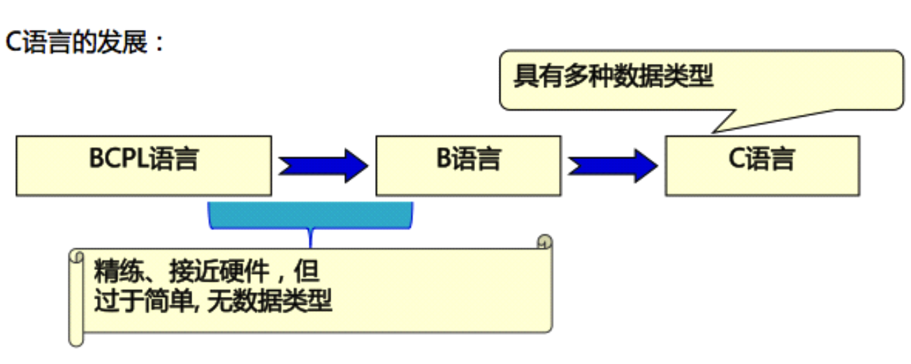

最早的高级语言：FORTRAN-->ALGOL-->CPL-->BCPL-->B-->C-->C++等

- 1963年英国剑桥大学推出了CPL(Combined Programming Langurage)语言。 CPL语言在ALGOL 60的基础上接近硬件一些,但规模比较大,难以实现
- 1967年英国剑桥大学的 Matin Richards(理查兹)对CPL语言做了简化,推出了 BCPL (Base Combined Programming Langurage)语言
- 1970年美国贝尔实验室的 Ken Thompson(肯·汤普逊) 以 BCPL 语言为基础,又作了进一步的简化,设计出了很简单的而且很接近硬件的 B 语言(取BCPL的第一个字母),并用B语言写出了第一个 UNIX 操作系统。但B语言过于简单,功能有限
- 1972年至1973年间,贝尔实验室的 Dennis.Ritchie(丹尼斯·里奇) 在 B语言的基础上设计出了C语言(取BCPL的第二个字母)。C语言即保持 BCPL 语言和B语言的优点(精练、接近硬件),又克服了他们的缺点(过于简单,数据无类型等)

## 1.2 C语言标准

- 1989年C语言标准被批准，这个版本的C语言标准通常被称为ANSI C(**C89**)
- 1999年，国际标准化组织ISO又对C语言标准进行修订，在基本保留原C语言特征的基础上，针对应该的需要，增加了一些功能，命名为**C99**
- 2011年12月，ANSI采纳了ISO/IEC 9899:2011标准。这个标准通常即**C11，它是C程序语言的现行标准**

## 1.3 优点

-   简洁性：核心内容少，只有 **32** 个关键字，**9** 种控制语句、**44** 种运算符

    条件语句：if...else，switch

    循环语句：while，for，do...while

    break，continue，return，goto

-   丰富的数据类型

-   具有低级语言的特点：与汇编语相近的功能和描述方法，如地址运算和二进制数位 

    可以对硬件端口进行直接操作

-   结构化语言，适用于大型程序**模块化设计**

-   代码效率高

-   语法限制不严，程序设计自由度大

-   可移植性好

## 1.4 算法

>   通过有限步骤，明确的操作产生问题答案

**算法表示**
自然语言，传统流程图，N-S流程图，伪代码

**常用算法**：枚举，递推，递归

## 1.5 C语言程序组成

一个C语言程序由多个函数组成，每个函数有自己的功能

一个函数有且仅有一个主函数

如果一个程序没有主函数，则这个函数不具备运行能力

程序运行时系统会自动调用主函数，而其他函数需要开发手动调用

### 主函数

```c
int main(){
    //other code...
     return 0;
}
```

- 主函数前的int可以不写或者换成 `void`
- main函数中的 return 0 可以不写

多种写法产生原因

- C语言最早的时候只是一种规范和标准（如C89，C11）
- 标准的推行需要各大厂商的支持和实施，由于各大厂商的各自实施，导致实施的标准不同

## 1.6 注释

注释可以用来解释某一段程序或者某一行代码是什么意思，方便程序员之间的交流沟通

### 注释分类

单行注释

+ // 被注释内容
+ 使用范围:任何地方都可以写注释：函数外面、里面，每一条语句后面
+ 作用范围: 从第二个斜线到这一行末尾
+ 快捷键:Ctrl+/

多行注释

+ /* 被注释内容 \*/
+ 使用范围:任何地方都可以写注释：函数外面、里面，每一条语句后面
+ 作用范围: 从第一个/\*到最近的一个*/

### 注意

- 单行注释可以嵌套单行注释、多行注释

```c
// 南哥 // 公号代码情缘
// /* 江哥 */
// 瓜哥
//公众号代码情缘
```

- 多行注释可以嵌套单行注释

```c
/*
// 作者：LNJ
// 描述：第一个C语言程序作用：这是一个主函数，C程序的入口点
 */
```

- 多行注释***不能***嵌套多行注释

```c
/* 
哈哈哈
     /*嘻嘻嘻*/
 呵呵呵 
*/
```

## 1.7 关键字

> C语言中具有特殊含义的单词

### 特点

1. 全部小写
2. 不可用作变量名、函数名等
3. C语言一共有32个关键字

| 1       | 2       | 3      | 4    | 5        | 6      | 7      | 8        |
| ------- | ------- | ------ | ---- | -------- | ------ | ------ | -------- |
| char    | short   | int    | long | float    | double | if     | else     |
| return  | do      | while  | for  | switch   | case   | break  | continue |
| default | goto    | sizeof | auto | register | static | extern | unsigned |
| signed  | typedef | struct | enum | union    | void   | const  | volatile |

### 分类

#### 基本数据类型关键字

`char`：字符类型变量

`int`：整型变量

`float`：浮点类型变量(单精度)

`double`：浮点类型变量（双精度）

#### 类型修饰符

`short`：修饰 `int` ，表示短整型

`long`：修饰 `int` ，表示长整型

`signed`：修饰整型变量数据，声明为有符号数据类型

`unsigned`：修饰整型变量数据，声明为无符号整数类型

#### 复杂类型关键字

`struct`：结构体声明

`union`：共用体声明

`enum`：枚举声明

#### 流程控制关键字

##### 分支结构

`if` ：条件语句

`else` ：条件语句的否定分支

`switch`：开关语句

`case`：开关语句的分支标记

`default`：开关语句中的其他分支

##### 循环语句

`for`：循环语句

`while`：循环语句

`do...while`：循环语句

##### 跳转语句

`continue`：跳过语句

`break`：跳出语句

`goto`：无条件跳转

`return`：返回语句，用于返回特定值

##### 存储类型关键字

`auto`：指定为自动变量

`register`：指定为寄存器变量

`static`：指定为静态变量

`extern`：指定对应变量为外部变量

`const`：指定变量为只读变量

`volatile`：指定变量为易变变量

##### 特殊用途关键字

`sizeof`：计算数据长度

`typeof`：声明类型别名

`void`：空类型

# 2. 数据类型

## 2.1 基本数据类型

-   整数类型，浮点类型，字符类型
-   转义字符
-   有符号数和无符号数
-   进制表示：十六进制：0X/0x、八进制：0

### char

char类型变量占1个字节存储空间，共8位

除单个字符以外, C语言的的转义字符也可以利用char类型存储

| 字符 | 意义                              |
| ---- | --------------------------------- |
| `\b` | 退格(BS)当前位置向后回退一个字符  |
| `\r` | 回车(CR),将当前位置移至本行开头   |
| `\n` | 换行(LF),将当前位置移至下一行开头 |
| `\t` | 水平制表(HT),跳到下一个 TAB 位置  |
| `\0` | 用于表示字符串的结束标记          |
| `\`  | 代表一个反斜线字符 \\             |
| `\"` | 代表一个双引号字符"               |
| `\'` | 代表一个单引号字符'               |

计算机只能识别0与1，所以char类型存储数据并不是存储一个字符，而是将字符转换为0和1之后再存储

ASCII码：定义了字符与01串的映射关系

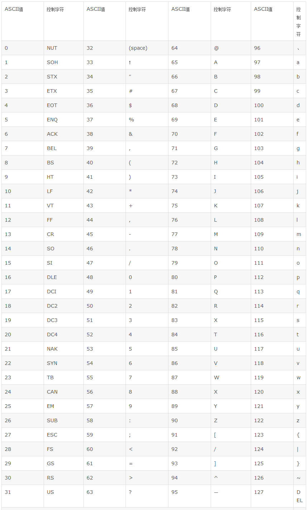

char类型占一个字节, 一个中文字符占3字节(unicode表),所有char不可以存储中文

除转义字符以外, 不支持多个字符

### int与其说明符

int 占用4字节的内存空间，C语言中提供了 **长度说明符** 和 **符号位说明** 两种类型

在 64bit 的编译器环境下，`int` 占用4字节，取值范围为 $-2^{31}-2^{31}-1$

这些类型说明符都是用于修饰 `int` 的，所以可以省略 `int`

#### short 和 long

`short` 和 `long` 可提供不同长度的整型，相应的改变整型数值的取值范围

- `short` 占用2字节，取值范围 $-2^{15}-2^{15}-1$

- `long` 占用8字节，取值范围 $-2^{63}-2^{63}-1$

`short` 的长度不能大于 `int` ，`int` 长度不能大于 `long`

`char` 一定是1字节

在64bit编译器环境下，`long` 占用4字节， `long long` 占用8字节

32bit编译器环境下，`long` 与 `long long` 占用8字节

```c
#include <stdio.h>

int main()
{
    // char占1个字节, char的取值范围 -2^7~2^7
    char num = 129;
    // num中存储的内容：1000 0001
    // 转化为十进制 1111 1111 -127
    
    // short int 占2个字节, short int的取值范围 -2^15~2^15-1 -32768~32767
    short int num1 = 32769;// -32767
    //num1中存储的内容：1000 0000 0000 0001
    //转化为十进制 1111 1111 1111 1111 = -32767

    // 由于short/long/long long一般都是用于修饰int, 所以int可以省略
    short num5 = 123;
    printf("num5 = %d\n", num5);
    long num6 = 123;
    printf("num6 = %ld\n", num6);
    long long num7 = 123;
    printf("num7 = %lld\n", num7);
    return 0;
}
```

#### signed 和 unsigned

`unsigned` 和 `signed` 的区别在于最高位是否要当做符号位，他并不会改变 `int` 的存储空间

- `signed` 等价于 `int` 等价于 `signed int` ，数值范围为 $-2^{31}-2^{31}-1$

- `unsigned` 表示无符号，最高位不当做符号位，数值范围 $0-2^{32}-1$

符号位说明符和长度说明符可以混合使用

## 2.2 指针类型

>   一个指针就是一个内存单元的地址
>
>   变量地址：系统分配给变量的 “内存单元” 的起始地址

### 指针的获取与取内容

`&变量名` ：获取变量的首地址（指针）

#### *

在定义变量时，`*` 是一个类型说明符，说明定义的变量是一个指针变量

```c
int *p = null;
```

在变量名前，且不是定义时，表示访问指针指向的存储空间

```c
int a = 5;
int *p = &a;
printf("%d",*p);
```

在表达式中，`*` 表示乘法

### 指针类型

在同一编译器环境下，所有指针变量占用的内存空间是固定的

但不同类型的变量所占存储空间是不同的

指针变量：

- 16位编译器：2字节
- 32位编译器：4字节
- 64位编译器：8字节

指针变量需要它所指向的数据类型告诉它要访问后续多少个存储单元

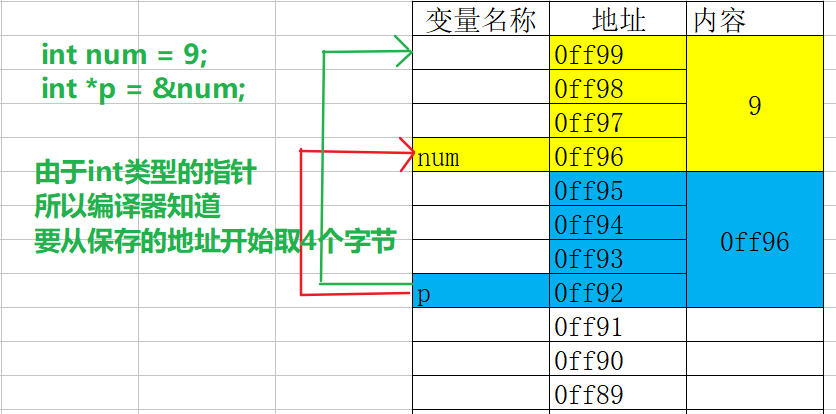

### 指针变量

指针变量：用一个变量存放其他变量的地址

```c
int age;// 定义一个普通变量
int *pnAge; // 定义一个指针变量
pnAge = &age;
```

`指针指向的数据类型 *指针变量名`

### 指针变量的初始化

指针变量只能存储地址, 不能存储其它类型

#### 定义同时初始化

```c
int a = 5;
int *p = &a;
```

#### 先定义后初始化

```c
int a = 5;
int *p;
p=&a;
```

#### 注意

- 指针没有初始化，里面是一个垃圾值，称为野指针

- 指针的指向可以改变

  ```c
  int a = 5;
  int *p = &a;
  int b = 10;
  p = &b; // 修改指针指向
  ```

- 多个指针变量可以指向同一个地址

### 二级指针

指针的指针，间接寻址

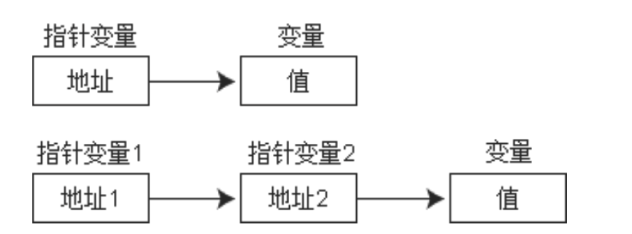

### 数组的指针

获取元素地址，使用取内容符 `&val`【视为一维数组】

#### 数组元素的指针

一个数组由若干个数组元素组成，每个数组元素占用一段存储空间，**数组元素的指针**指向这段存储空间的首地址

```c
int a[10] = {1,2,3,4,5,6,7,8,9,10};

//将数组的首元素地址赋值给指针变量 p
int *p = a;
int *p = &a[0];
```

#### 指针访问数组元素

访问数组元素的两种方法：

- 下标，`a[i]`
- 指针，`*p = a; *(p+i)`

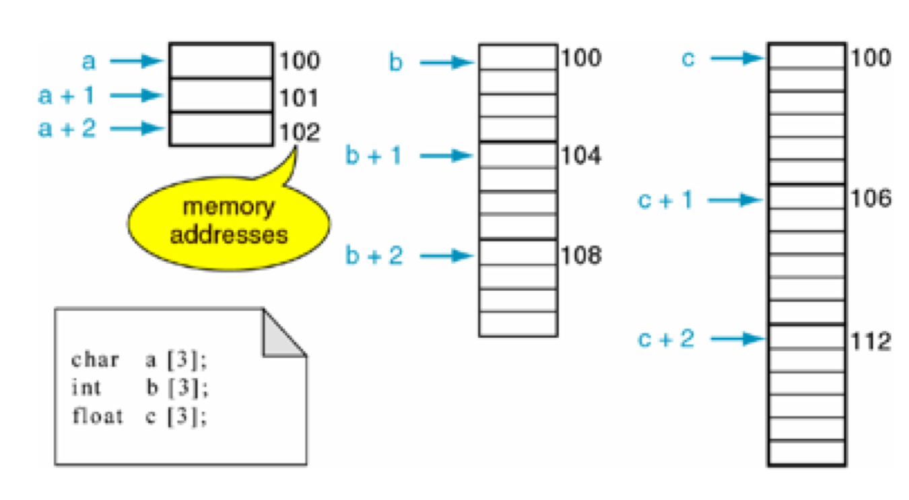

- 指针都可通过 `p+=1 p++` 后移指向下一个存储单元，这里的 `+1` 指的是后移一个存储单元

- **数组名** 是一个指针，但**不能被修改**

  ```c
  int x[10];
  x++;  //错误
  int* p = x;
  p++; //正确
  ```

### 字符串的指针


### 指针数组

`数据类型 *数组名[数组长度]`

数组名中存的是首地址

```c
char *str[3] = {"one","two","program"}
/=>
/*
* char *str[3];
* char str[0] = "one";
* char str[1] = "two";
* char str[2] = "program";
*/
```

## 2.3 构造类型

### 结构体

-   当结构体成员是其本身时，只能用指针
-   当初始化参数列表中参数数量少于成员个数时，其余成员自动赋0
-   对结构体成员操作，实质上是对其所在地址进行操作

#### 位域

>   特殊的结构体，以二进制位为单位，指定所占的二进制位数

-   只能用 `unsigned,int,signed int`

-   当存储单元剩下的空间不够存放一个位域时，从跳到下个存储单元，从低位开始存储

#### 结构体和共用体

结构体：用于将多种数据组合成一个整体。

共用体：采用覆盖技术，几个不同变量共享一段内存空间。成员的起始地址一样，都是共用体的起始地址，并在同一时刻只能使用其中的一个成员变量

区别就是：

-   结构体每一位成员都用来表示一种具体事物的属性，共用体可以表示多种属性
-   结构体的存储空间为各成员占用存储空间的和，共用体存储空间为最大成员的存储空间
-   共用体不能初始化，但结构体可以

### 数组

数组：一组 **相同数据类型** 数据的有序集合

数组名：该数组在内存中的起始地址

数组元素：构成数组的每一个数据

数组下标：数组元素位置的索引（从0开始，元素个数-1）

#### 数组定义

```c
元素名 数组名[元素个数];
```

元素个数只能写整型常量或者常量表达式

```c
 int ages4['A'] = {19, 22, 33};
 printf("ages4[0] = %d\n", ages4[0]);

  int ages5[5 + 5] = {19, 22, 33};
  printf("ages5[0] = %d\n", ages5[0]);

  int ages5['A' + 5] = {19, 22, 33};
  printf("ages5[0] = %d\n", ages5[0]);
```

#### 初始化数组

没有初始化的数组，存储的是垃圾值

##### 定义的同时初始化

指定元素个数，完全初始化

```c
int nums[3] = {1,2,3};
```

不指定元素个数，完全初始化

```c
int nums[] = {1,2,3};
```

- 不指定元素个数，部分初始化

  ```c
  int nums[] = {[4] = 3};
  ```

指定元素个数，部分初始化

- 没有显式初始化的元素，系统会自动将其初始化为0

```c
int nums[10] = {1,2};
```

- 可以指定部分索引的值

  ```c
  int nums[5] = {[4] = 3,[1] = 2};
  ```

##### 先定义后单独初始化

```c
int nums[3];
nums[0] = 1;
nums[1] = 2;
nums[2] = 3;
```

- 对于数组，只能 **定义时初始化** 或 **定义后逐个赋值** 

  ```c
  int nums[3];
  nums = {1,11,2}; // 报错
  ```

#### 数组的使用

通过 `数组名[下标]` 访问

通过首地址偏移量访问 `*(数组名+n)`

#### 数组存储空间的计算

$数组存储空间 = 一个元素占用的存储空间 * 元素个数(数组长度)$

#### 数组内存分析

数组定义：内存寻址从大到小，从高地址开辟一块连续的没有被使用的内存给数组

数组名：指向分配给数组的最小地址

初始化：

- 从该数组分配的连续存储空间中，低地址开始给元素分配一块内存
- 每个元素从高位开始存放数据（大端模式）

```c
#include <stdio.h>

main(){
    int num = 9;
    
    char cs[] = {'l','n','j'};
    
    printf("cs = %p\n", &cs);       
    // cs = 0060FEA9
    printf("cs[0] = %p\n", &cs[0]); 
    // cs[0] = 0060FEA9
    printf("cs[1] = %p\n", &cs[1]); 
    // cs[1] = 0060FEAA
    printf("cs[2] = %p\n", &cs[2]); 
    // cs[2] = 0060FEAB

    int nums[] = {2, 6};
    printf("nums = %p\n", &nums);      
    // nums = 0060FEA0
    printf("nums[0] = %p\n", &nums[0]);
    // nums[0] = 0060FEA0
    printf("nums[1] = %p\n", &nums[1]);
    // nums[1] = 0060FEA4
}
```


#### 数组越界问题

```c
char cs1[2] = {1, 2};
char cs2[3] = {3, 4, 5};

# cs1[1] cs1[0] cs2[2] cs2[1] cs2[0]
cs2[3] = 88; // cs2[3] = cs1[0]
printf("cs1[0] = %d\n", cs1[0]);
输出结果: 88
```

#### 数组与函数

数组可以作为函数参数使用

- 把数组元素作为实参
- 把数组名作为函数形参和实参

数组名作为函数参数时，实参与形参之间是 “地址传递”。

- 实参数组名将该数组的起始地址传递给形参数组，两个数组共享一段内存单元，系统不会为形参数组分配存储单元
- 在被调函数中修改形参数组内容，实参数组内容也会被修改

```c
# include<stdio.h>

void change(int array[3]){
    //等价于 void change(int array[])
    // void change(int *array)
    array[0] = 88;
}

int main(int argc, const char * argv[]){
    int ages[3] = {1, 5, 8};
    printf("ages[0] = %d", ages[0]);// 1
    change(ages);
    printf("ages[0] = %d", ages[0]);// 88
}
```

- 形参数组和实参数组类型必须一致
- 当数组名作为函数参数时，因为自动转换为指针类型，所以在函数中无法动态计算数组的元素个数

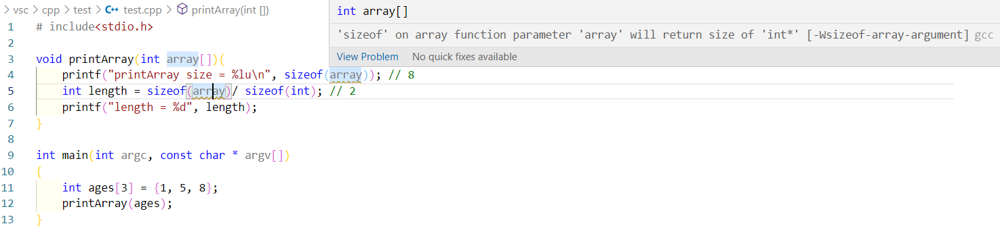

#### 二维数组

二维数组的元素是一维数组名

`数据类型 数组名[一维数组个数][一维数组元素个数]`

##### 初始化

定义同时初始化

```c
int a[2][3]={ {80,75,92}, {61,65,71}};
```

定义后逐个赋值

```c
int a[2][3];
a[0][0] = 80;
a[0][1] = 75;
a[0][2] = 92;
a[1][0] = 61;
a[1][1] = 65;
a[1][2] = 71;
```

按行分段赋值

```c
int a[2][3]={ {80,75,92}, {61,65,71}};
```

指定元素初始化

```c
int a[2][3]={[1][2]=10};
int a[2][3]={[1]={1,2,3}}
```

**注意**：行长度可以省略，但列长度不能省略

```c
int a[][3]={{1,2,3},{4,5,6}};
int a[][3]={1,2,3,4,5,6};

//部分初始化
int a[][3]={{1},{4,5}};
int a[][3]={1,2,3,4};
```

##### 二维数组的遍历

```c
char cs[2][3] = {
    {'a', 'b', 'c'},
    {'d', 'e', 'f'}
};

for(int i = 0; i < 2; i++) { // 外循环取出一维数组
    for(int j = 0;j < 3;j++) {//内循环取出一维数组的元素
        printf("%c", cs[i][j]);
    }
    printf("\n");
}
```

##### 二维数组的存储

从高地址开始给每个数组分配空间

从低地址开始给每个数组元素分配空间

从高地址给每个元素分配空间

每个元素从高位开始存放数据（大端模式）

```c
#include <stdio.h>
int main()
{
    char cs[2][3] = {
        {'a', 'b', 'c'},
        {'d', 'e', 'f'}
    };
    // cs == &cs == &cs[0] == &cs[0][0]
    printf("cs = %p\n", cs);                // 0060FEAA
    printf("&cs = %p\n", &cs);              // 0060FEAA
    printf("&cs[0] = %p\n", &cs[0]);        // 0060FEAA
    printf("&cs[0][0] = %p\n", &cs[0][0]);  // 0060FEAA
    return 0;
}
```

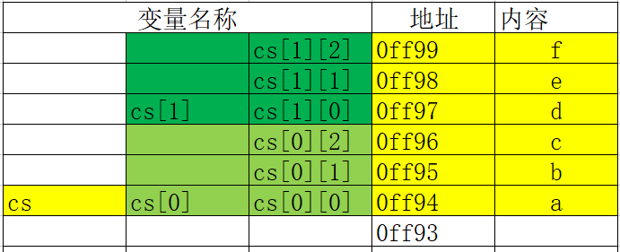

##### 二维数组与函数

**`a[i]` 表示的是一维数组首地址**

```c
#include <stdio.h>

// 和一维数组一样, 只看形参是基本类型还是数组类型
// 如果是数组类型在函数中修改形参会影响实参
void change(char ch[]){
    ch[0] = 'n';
}

int main()
{
    char cs[2][3] = {
        {'a', 'b', 'c'},
        {'d', 'e', 'f'}
    };
    printf("cs[0][0] = %c\n", cs[0][0]); // a
    change(cs[0]);
    printf("cs[0][0] = %c\n", cs[0][0]); // n
    return 0;
}
```

**二维数组列不能省略**

```c
#include <stdio.h>

void change(char ch[][3]){
    ch[0][0] = 'n';
}
int main()
{
    char cs[2][3] = {
        {'a', 'b', 'c'},
        {'d', 'e', 'f'}
    };
    printf("cs[0][0] = %c\n", cs[0][0]); // a
    change(cs);
    printf("cs[0][0] = %c\n", cs[0][0]); // n
    return 0;
}
```

**被调函数只知道数组的首地址，不知道行数，需要通过参数传入**

可以通过 `sizeof 数组名[i]` 获取行数

### 字符串

用 `""` 中的字符序列表示字符串常量

以字符数组形式存储在计算机中，在每个字符串结尾需要添加一个 `'\0'` 表示字符串结束， `\0` 在ASCII中用0表示

#### 初始化

```c
char name[9] = "lnj"; 
char name1[9] = {'l','n','j','\0'};
char name2[9] = {'l','n','j',0};
// 当数组元素个数大于存储字符内容时, 未被初始化的部分默认值是0, 所以下面也可以看做是一个字符串
char name3[9] = {'l','n','j'};
```

**一个字符串数组，若不做初始化赋值，必须指定数组长度**

比正常数组存储字符少1，`'\0'` 需要占一个空间

#### 输入输出

使用 `printf("%s",str);` 和 `scanf("%s",str);` 进行输入输出

- `%s` 本质是根据传入的 str 地址逐个去取数组中的元素输出（低地址--->高地址），直至遇到 `'\0'` 

  '\0' 引发的脏读问题：

  ```c
  char name[] = {'c', 'o', 'o', 'l' , '\0'};
  char name2[] = {'l', 'n', 'j'};
  printf("name2 = %s\n", name2); // 输出结果: lnjcool
  ```

#### 常用方法

C语言提供的字符串处理函数，大致可以分为字符串输入、输出、合并、修改、比较、替换、复制、搜索几类

- 输入输出在 `stdio.h` 中
- 其他方法在 `string.h` 中

##### 输入输出

`puts(字符数组名)` ：把字符数组中的字符串输出到显示器上

优点：

- 自动换行
- 可以是数组的任意元素地址

缺点

- 不能自定义输出格式，只能输出字符串内容

---

`gets(字符数组名)` ：从标准输入(键盘) 上输入一个字符串

```c
char ch[30];
gets(ch); // 输入:lnj
puts(ch); // 输出:lnj
```

`gets` 以回车作为输入结束，所以字符串中可以有空格

`gets` 的接收变量是预先定义的，所以会有数组越界的风险

##### 字符串长度

`sizeof` 动态计算

字符串再内存中是字符数组的形式存储，一个字符占用一个字节

字符串的结束符也占用一个存储单元

```c
char name[] = "it666";
int size = sizeof(name);// 包含\0
printf("size = %d\n", size); //输出结果:6
```

---

`strlen(字符数组名)` ：获取字符串的实际长度（不包含字符结束标志 `'\0'`） 

```c
char name[] = "it666";
int len = strlen(name2);
printf("len = %d\n", len); //输出结果:5
```

---

自定义

```c
int myStrlen(char str[]){
    int cnt = 0;
    while(str[length] != '\0')
        cnt++;
    
    return cnt;
}
```

##### 字符串连接

`strcat(destStr,newstr);`

将 `newStr` 连接到 `destStr` 后，并删去 `destStr` 后的 `\0` ，然后返回  `destStr` 的首地址

```c
char oldStr[100] = "welcome to";
char newStr[20] = " lnj";
strcat(oldStr, newStr);
puts(oldStr); //输出: welcome to lnj"
```

`destStr` 必须定义足够的长度，否则不能全部装入被连接的字符串

##### 字符串复制

`strcpy(字符数组名1,字符数组名2);` ：将字符串2的字符拷贝到字符串1中（ `'\0'` 也会一起拷贝）。

```c
char oldStr[100] = "welcome to";
char newStr[50] = " lnj";
strcpy(oldStr, newStr);
puts(oldStr); // 输出结果:  lnj // 原有数据会被覆盖
```

##### 字符串比较

`strcmp(字符数组名1,字符数组名2);` ：逐字符比较两个字符数组的ASCII码，并返回比较结果

- 字符串1 == 字符串2 ，返回值 = 0
- 字符串1 > 字符串2，返回值 > 0
- 字符串1 < 字符串2，返回值 < 0

```c
char oldStr[100] = "0";
char newStr[50] = "1";
printf("%d", strcmp(oldStr, newStr)); //输出结果:-1

char oldStr[100] = "1";
char newStr[50] = "1";
printf("%d", strcmp(oldStr, newStr));  //输出结果:0

char oldStr[100] = "1";
char newStr[50] = "0";
printf("%d", strcmp(oldStr, newStr)); //输出结果:1
```

## 2.4 空类型 `NULL`

## 类型转换

### 自动类型转换

#### 算数转换

对占用内存较少的类型做一个，先将其转换为当前算数表达式中占用内存高的类型, 然后再参与运算

```c
// 当前表达式用1.0占用8个字节, 2占用4个字节
// 所以会先将整数类型2转换为double类型之后再计算
double b = 1.0 / 2;//0.5
```

#### 赋值类型转换

右侧表达式自动转换为左侧表达式类型，并存储在左侧变量中

```c
// 赋值时左边是什么类型,就会自动将右边转换为什么类型再保存
int a = 10.6; //a=10
```

### 强制类型转换

```c
double a = (double)(1 / 2);
// 结果为0, 因为参与运算的都是整型

double b = (double)1 / 2;
// 结果为0.5, 因为1被强制转换为了double类型, 2也会被自动提升为double类型
```

类型转换并不会影响到原有变量的值

```c
#include <stdio.h>
int main(){
    double d = 3.14;
    int num = (int)d;
    printf("num = %i\n", num); // 3
    printf("d = %lf\n", d); // 3.140000
}
```

# 3. 量

> 量：表示数据

## 3.1 常量

> 常量表示一些固定的数据，也就是不能改变的数据

### 整型常量

十进制整数

八进制整数：以0开头

十六进制：以0X开头

二进制：以0b开头

### 实数常量

#### 小数形式

单精度小数：以字母f或者F结尾

双精度小数：lf结尾，默认类型

可以没有整数只有小数位，如.3、.6f

#### 指数形式

以幂的形式表示，以字母e或者字母E后跟一个10为底的幂数

如：1.23×10在C中表示为 1.23e5

- e或E后前后必须有数字
- e或E前后不能有空格

#### 字符常量

字符常量都是用 `''` 括起来的

字符常量只能有一个字符

**转义字符**

`'\n'` `'\r'`

#### 字符串常量

字符型常量都是用 `""` 括起来的

系统会自动在字符串常量末尾添加一个字符 `'\0'` 表示字符串结束标志

## 3.2 变量

只有定义了变量才会分配数据的存储空间

不同数据类型占用不同大小的存储空间，指定数据类型，则这段存储单元只能存该类型的数据

### 变量格式

```C
# 变量类型 变量名称;
int a;
float b;
char ch;

# 变量类型 变量名称,变量名称;
int a,b,c;
```

### 命名规则

+ 首字母必须是 字母或下划线
+ 只能包含字母、数字、下划线
+ 标识符不能是关键字
+ 不能跨行书写 

### 变量的初始化

> 变量的第一次赋值称为初始化

```c
# 先定义后初始化
int value;
value = 998;

# 定义用时初始化
int a = 10;
```

#### 未初始化的变量

- 随机数
- 上次程序分配的存储空间留下的 “垃圾值”
- 系统正在使用的一些数据

#### 变量之间的值传递

可以将一个变量存储的值赋给另一个变量

```c
int a = 10;
int b = a;//相当于把a中存储的10拷贝了一份给b
```

### 作用域

**全局变量任意函数都可访问、修改**

当局部变量与全局变量发生冲突时，以局部变量为主

若要扩充作用域使用`extern`

**注意** ：同一作用域范围内不能有相同名称的变量，不同作用域内可以有相同名称的变量

### 变量存储过程

一个变量所占用的存储空间，和 **定义变量时声明的类型** 以及 **编译环境** 有关

| 类型      | 16位编译器 | 32位编译器 | 64位编译器 |
| --------- | ---------- | ---------- | ---------- |
| char      | 1          | 1          | 1          |
| int       | 2          | 4          | 4          |
| float     | 4          | 4          | 4          |
| double    | 8          | 8          | 8          |
| short     | 2          | 2          | 2          |
| long      | 4          | 4          | 8          |
| long long | 8          | 8          | 8          |
| void*     | 2          | 4          | 8          |

#### 变量存储的过程

- 根据定义变量时声明的类型和当前编译环境确定需要开辟多大存储空间

- 在内存中开辟一块存储空间，开辟时从内存地址大的开始开辟

- 将数据保存到已经开辟好的内存空间内

- 变量的首地址，是变量所占存储空间字节地址(最小的那个地址 )

  小端模式：高字节高地址

## 3.3 内存分析

### 进制转换

#### 进制

> 计数的方式，数值的表示方式

十进制 0、1、2、3、4、5、6、7、8、9 逢十进一

二进制 0、1 逢二进一

- 书写格式：`0b`101

八进制 0、1、2、3、4、5、6、7 逢八进一

- 书写格式：`0`61

十六进制 0、1、2、3、4、5、6、7、8、9、A、B、C、D、E、F 逢十六进一

- 书写格式：`0x`45

#### 转二进制

整数部分：**除基取余，从下至上**

小数部分：**乘积取整，从上至下**

### 数据编码

计算机只能识别0和1的形式存储的

数据在计算机内部是以补码的形式存储，所有的运算都是以补码存储

- 正数的原码、反码和补码都是它的二进制

- 负数的原码, 是将该负数的二进制最高位变为1

  负数的反码, 是将该数的原码`除了符号位`以外的其它位取反

  负数的补码, 就是它的反码 + 1

原码的减法不正确，所以引入反码。但反码相同的数相减，得到 -0。但前面的符号没有任何意义，所以引入补码。

### 内存读写操作

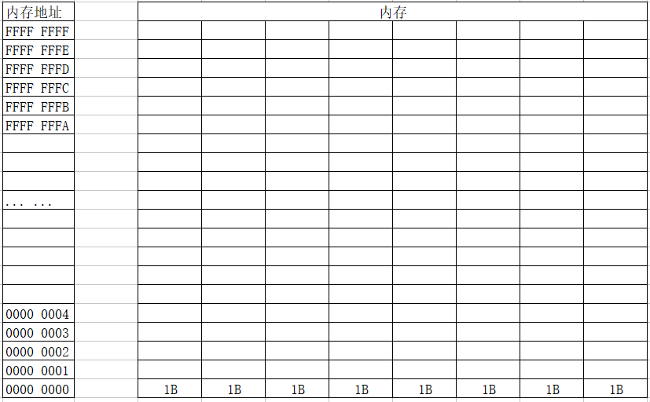

CPU在运作时要明确三件事：

- **存储单元的地址(地址信息)**

  通过地址总线找到存储单元的地址

- **器件的选择（读或写，控制信息）**

  通过控制总线发出内存读写指令

- **读写的数据（数据信息）**

  通过数据总线传输需要读写的数据

#### 写入过程

+ CPU 通过地址线将找到地址为 FFFFFFFB 的内存
+ CPU 通过控制线发出内存写入命令，选中存储器芯片，并通知它，要其写入数据。
+ CPU 通过数据线将数据 8 送入内存 FFFFFFFB 单元中

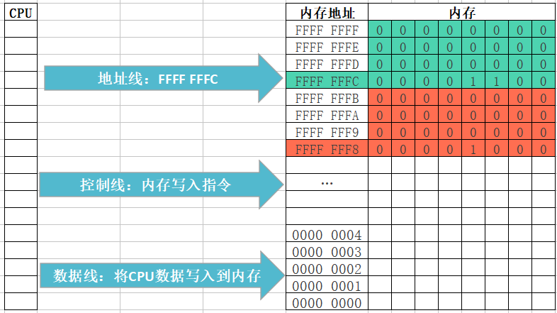

#### 读入过程

+ CPU 通过地址线将找到地址为 FFFFFFFB 的内存
+ CPU 通过控制线发出内存读取命令，选中存储器芯片，并通知它，将要从中读取数据
+ 存储器将 FFFFFFFB 号单元中的数据 8 通过数据线送入 CPU寄存器中

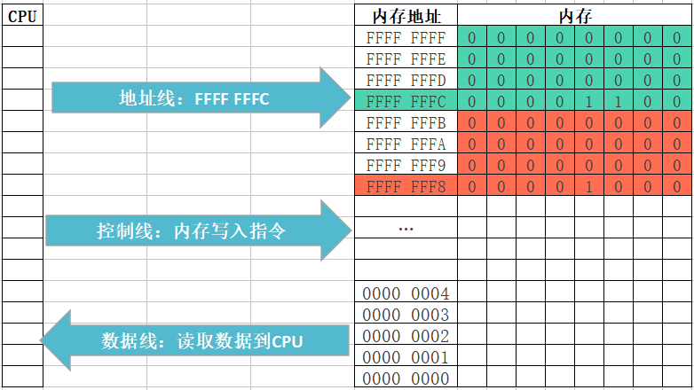

- 变量的存储原则

+ 先分配字节地址大内存,然后分配字节地址小的内存(内存寻址是由大到小)

+ 变量的首地址,是变量所占存储空间字节地址(最小的那个地址 )

+ 低位保存在低地址字节上,高位保存在高地址字节上

## 3.4 数据存储区

执行C语言程序，可用的存储区有

1.  程序区

2.  静态存储区：编译时分配内存；包括 `static,extern`

3.  动态存储区：运行时分配内存；包括 `static,auto`

### `static`

静态局部变量

- 仅在本函数中使用，调用后不清零
- 只能赋一次初值，若不初始化 自动赋0或空字符
- 可使用静态局部变量跟踪调用次数

静态全局变量

-   仅限在定义的文件中使用，可使不同源文件中的静态全局变量独立

### `register`

整型，字符变量，指针类型

### `extern`

在函数外部引用变量使用 `extern` ，扩充已定义的全局变量作用域

一个C语言程序包含多个源程序，若使用同一外部变量，在一个源文件中定义，在另一个中用 `extern` 说明是外部变量。引用外部函数时，被引用函数需添加 `extern`

# 4. 运算符

## 基本概念

> 运算符：告诉程序执行特定的算术或逻辑操作的符号
>
> 表达式：利用运算符连接在一起的有意义、有结果的语句
>
> - 表达式一定要有结果

### 分类

按功能化划分：

- 算术运算符
- 赋值运算符
- 关系运算符
- 逻辑运算符
- 位运算符

按照参与运算符的个数划分：

- 单目运算符

  如：`i++`

- 双目运算符

  如：`a+b`

- 三目运算符

  如：`a>b ? 1 : 0;`

### 优先级与结合性

> 不同优先级的运算符，运算次序按照优先级从高到低执行
>
> 相同优先级的运算符，运算次序按结合性规定的方向执行

```c
#include <stdio.h>
int main(){
    int a = 10;
    int b = 5;
    
    // 算术运算符的结合性和优先级
    // 结合性: 左结合性, 从左至右
    int c = 50;
    result = a + b + c; // 15 + c;  65;
    printf("%i\n", result);
    
    // 优先级: * / % 大于 + -
    result = a + b * c; // a + 250; 260;
    printf("%i\n", result);
}
```

**单目运算符，赋值运算符，三目运算符为右结合性；**
其余为左结合性（从左向右看）

```c
x = 2;
x+=x+=x-=1; //=> x = 4

y = x&1 == x%2; //=> y = 1
/*
 *设x = 10 0&1 = 0 , x % 2 = 0   y = 1
 */
 
a = b = c = 1;
++a||++b&&++c;
//a = 2,b = 1,c = 1;
```

---

| 优先级 | 运算符   | 名称或含义     | 使用形式                      | 结合方向 | 说明       |
| ------ | -------- | -------------- | ----------------------------- | -------- | ---------- |
| 1      | `[]`     | 数组下标       | `数组名[常量表达式]`          | 左到右   |            |
|        | `()`     | 圆括号         | `(表达式)/函数名(形参表)`     |          |            |
|        | `.`      | 成员选择(对象) | `对象.成员名`                 |          |            |
|        | `->`     | 成员选择(指针) | `对象指针->成员名`            |          |            |
| 2      | `-`      | 符号运算符     | `-表达式`                     | 右到左   | 单目运算符 |
|        | `(类型)` | 强制类型转换   | `(数据类型)表达式`            |          |            |
|        | `++`     | 自增运算符     | `++变量名/变量名++`           |          |            |
|        | `--`     | 自减运算符     | `--变量名/变量名--`           |          |            |
|        | `*`      | 取值运算符     | `*指针变量`                   |          |            |
|        | `&`      | 取地址运算符   | `&变量名`                     |          |            |
|        | `!`      | 逻辑非         | `!表达式`                     |          |            |
|        | `~`      | 按位取反       | `~表达式`                     |          |            |
|        | `sizeof` | 长度运算符     | `sizeof(表达式)`              |          |            |
| 3      | `/`      | 除             | `表达式/表达式`               | 左到右   | 双目运算符 |
|        | `*`      | 乘             | `表达式*表达式`               |          |            |
|        | `%`      | 取余           | `表达式%表达式`               |          |            |
| 4      | `+`      | 加             | `表达式+表达式`               | 左到右   | 双目运算符 |
|        | `-`      | 减             | `表达式-表达式`               |          |            |
| 5      | `<<`     | 左移           | `变量<<表达式`                | 左到右   | 双目运算符 |
|        | `>>`     | 右移           | `变量>>表达式`                |          |            |
| 6      | `>`      | 大于           | `表达式>表达式`               | 左到右   | 双目运算符 |
|        | `>=`     | 大于等于       | `表达式>=表达式`              |          |            |
|        | `<`      | 小于           | `表达式<表达式`               |          |            |
|        | `<=`     | 小于等于       | `表达式<=表达式`              |          |            |
| 7      | `==`     | 等于           | `表达式==表达式`              | 左到右   | 双目运算符 |
|        | `!=`     | 不等于         | `表达式!=表达式`              |          |            |
| 8      | `&`      | 按位与         | `表达式&表达式`               | 左到右   | 双目运算符 |
| 9      | `^`      | 按位异或       | `表达式^表达式`               | 左到右   | 双目运算符 |
| 10     | `|`      | 按位或         | `表达式|表达式`               | 左到右   | 双目运算符 |
| 11     | `&&`     | 逻辑与         | `表达式&&表达式`              | 左到右   | 双目运算符 |
| 12     | `||`     | 逻辑或         | `表达式||表达式`              | 左到右   | 双目运算符 |
| 13     | `?:`     | 条件运算符     | `表达式1？表达式2：表达式3；` | 右到做   | 三目运算符 |
| 14     | `=`      | 赋值运算符     | `变量=表达式`                 | 右到左   |            |
|        | `/=`     | 除后赋值       | `变量/=表达式`                |          |            |
|        | `*=`     | 乘后赋值       | `变量*=表达式`                |          |            |
|        | `%=`     | 取余后赋值     | `变量%=表达式`                |          |            |
|        | `+=`     | 加后赋值       | `变量+=表达式`                |          |            |
|        | `-=`     | 减后赋值       | `变量-=表达式`                |          |            |
|        | `<<=`    | 左移后赋值     | `变量<<=表达式`               |          |            |
|        | `>>=`    | 右移后赋值     | `变量>>=表达式`               |          |            |
|        | `&=`     | 按位与后赋值   | `变量&=表达式`                |          |            |
|        | `^=`     | 按位异或后赋值 | `变量^=表达式`                |          |            |
|        | `|=`     | 按位或后赋值   | `变量|=表达式`                |          |            |
| 15     | `,`      | 逗号运算符     | `表达式,表达式,...`           | 左到右   |            |

## 4.1 算数运算符

| 优先级 | 符号 | 含义 | 表达式          | 结合性 |            |
| ------ | ---- | ---- | --------------- | ------ | ---------- |
| 3      | `/`  | 除   | `表达式/表达式` | 左到右 | 双目运算符 |
|        | `*`  | 乘   | `表达式*表达式` |        |            |
|        | `%`  | 取余 | `表达式%表达式` |        |            |
| 4      | `+`  | 加   | `表达式+表达式` | 左到右 | 双目运算符 |
|        | `-`  | 减   | `表达式-表达式` |        |            |

- 如果参与运算的两个操作数都是整数，那么结果也是整数

- 如果参与运算的两个操作数有一个是浮点数，那么结果一定是浮点数

  ```c
  #include <stdio.h>
  int main(){
      // 整数除以整数, 结果还是整数
      printf("%i\n", 10 / 3); // 3
  
      // 参与运算的任何一个数是小数, 结果就是小数
      printf("%f\n", 10 / 3.0); // 3.333333
  }
  ```

- 取余运算符，参与运算的两个操作数必须是整数，不能包含浮点数

  取余运算结果的符号与被除数有关

  ```c
  #include <stdio.h>
  int main(){
      // 被除数是正数结果就是正数,被除数是负数结果就是负数
      result = 10 % 3;
      printf("%i\n", result); // 1
      result = -10 % 3;
      printf("%i\n", result); // -1
      result = 10 % -3;
      printf("%i\n", result); // 1
  }
  ```

- 取余运算符，被除数为0，结果为0

- 除法/取余运算，除数为0，没有意义

## 4.2 自增自减

+ 前缀表达式:++x, --x；表示先自增再运算
+ 后缀表达式:x++, x--；表示先运算再自增

```c
#include <stdio.h>
int main(){
    int number = 10;
    // ++在后, 先参与表达式运算, 再自增
    // 表达式运算时为: 3 + 10;
    int result = 3 + number++;
    printf("result = %i\n", result); // 13
    printf("number = %i\n", number); // 11
}

#include <stdio.h>
int main(){
    int number = 10;
    // ++在前, 先自增, 再参与表达式运算
    // 表达式运算时为: 3 + 11;
    int result = 3 + ++number;
    printf("result = %i\n", result); // 14
    printf("number = %i\n", number); // 11
}
```

自增、自减运算只能用于单个变量，只要是标准类型的变量（整型、实型还是字符型变量），但不能用于表达式或常量

- 错误用法：`++(a+b); 5++;`

```c
int i = 10;
int b = i++; // 不推荐
或者
int b = ++i; // 不推荐
或者
int a = 10;
int b = ++a + a++;  // 不推荐

int i = 10;
int b = i; // 推荐
i++;
或者;
i++;
int b = i; // 推荐
或者
int a = 10;
++a;
int b = a + a; // 推荐
a++;
```

## 4.3 sizeof

> 用于计算一个变量、或常量、数据类型占用的内存字节数

`sizeof(常量\变量);`

```c
sizeof(10); //sizeof 10;

char c = 'a';
sizeof(c); //sizeof c;
```

`sizeof(数据类型);`

```c
sizeof(float);
```

**sizeof是一个运算符，不是函数**

- `sizeof` 运算符优先级为2

```c
int a = 10;
double b = 3.14;
double res = sizeof(a+b);// sizeof a+b;
# sizeof 运算符优先级比+高，所以会先计算sizeof(a)，再利用结果和b相加
//res = 7.14
```

## 4.4 逗号运算符和括号运算符

```c
#include <stdio.h>
int main(){
    int a = 10, b = 20, c;
    // ()优先级高于逗号运算符和赋值运算符, 所以先计算()中的内容
    // c = (11, 21);
    // ()中是一个逗号表达式, 结果是最后一个表达式的值, 所以计算结果为21
    // 将逗号表达式的结果赋值给c, 所以c的结果是21
    c = (a + 1, b + 1);
    printf("c = %i\n", c); // 21
}
```

## 4.5 关系运算符

非零值都是 `true` ，只有零才是 `false`

关系运算符的运算结果只有两种：

- 条件成立，结果为 `true`
- 条件不成立，结果为 `false`

### 优先级与结合性

```c
# include<stdio.h>

int main(){
    //== 优先级小于 > ，所以先计算 > 
    int result = 10 == 5 > 3;//10 == 1 -> true
    printf("%d\n",result);
}
```

```c
# include<stdio.h>

int main(){
    // == 和 != 优先级一样，所以按照结合性
    int res = 10 == 5 != 3;// 10 == true -> true
    printf("%d\n",res);
}
```

无论是 `float` 还是 `double` 都有精度问题, 所以一定要避免利用==判断浮点数是否相等

## 4.6 逻辑运算符

| 优先级 | 符号 | 名称   | 符号             | 结合性   |            |
| ------ | ---- | ------ | ---------------- | -------- | ---------- |
| 2      | `!`  | 逻辑非 | `!表达式`        | 右结合性 | 单目运算符 |
| 11     | `&&` | 逻辑与 | `表达式&&表达式` | 左到右   | 双目运算符 |
| 12     | `||` | 逻辑或 | `表达式||表达式` | 左到右   | 双目运算符 |

### 逻辑非

`! 条件A;`

运算结果：

- `!true = false;`
- `!false = true;`

### 逻辑与

`条件A && 条件B;`

判断过程

- 条件A为真，则接着判断条件B，也真，则表达式为 `true`
- 条件A为假，则不执行B，则表达式为 `false`

### 逻辑或

`条件A || 条件B;`

判断过程

- 条件A为假，且条件B为假，则表达式为 `false`
- 条件A为假，条件B为真，则表达式为 `true`
- 条件A为真，则不会执行条件B，则表达式为 `false`

## 4.7 位运算符

程序中所有数据都是以二进制形式存储，位运算符就是直接对整数在内存中的二进制操作。

| 符号 | 名称     | 运算结果       |
| ---- | -------- | -------------- |
| &    | 按位与   | 同1为1，有0则0 |
| \|   | 按位或   | 同0位0，有1为1 |
| ^    | 按位异或 | 同0异1         |
| ~    | 按位取反 | 0变1，1变0     |
| <<n  | 按位左移 | 乘以2的n次方   |
| >>n  | 按位右移 | 除以2的n次方   |

### 按位与

```
9&5 = 1

    1001
  & 0101
    ----
    0001
```

#### 判断奇偶

任何数和1进行&操作,得到这个数的最低位

```
	1000
   &0001
    ----
    0000  // 结果为0, 代表是偶数

	1011
   &0001
    ----
    0001 // 结果为1, 代表是奇数
```

### 按位或

```
9|5 = 13

    1001
  | 0101
    ----
    1101
```

#### 权限设置

```c
enum Unix {
    S_IRUSR = 256,// 100000000 用户可读
    S_IWUSR = 128,//  10000000 用户可写
    S_IXUSR = 64,//    1000000 用户可执行
    S_IRGRP = 32,//     100000 组可读
    S_IWGRP = 16,//      10000 组可写
    S_IXGRP = 8,//        1000 组可执行
    S_IROTH = 4,//         100 其它可读
    S_IWOTH = 2,//          10 其它可写
    S_IXOTH = 1 //           1 其它可执行
};
// 假设设置用户权限为可读可写
printf("%d\n", S_IRUSR | S_IWUSR); // 384 // 110000000
```

### 按位异或

相同整数异或为0，如 `5^5=0`

多个整数相异或的结果跟顺序无关，如 `5^6^7 == 5^7^6`

- 同一数异或另外一个数异或两次，结果还是那个数

```
9^5 = 12

    1001
  ^ 0101
    ----
    1100
```

#### 交换数值

```c
b = a ^ b ^ b;
a = b ^ a ^ a;
```

### 按位取反

```
~9 = -10

原码    0000 1001
补码    1111 0110

转为十进制    0000 1001+1 = 0000 1010 = -10
```

### 按位左移

> `2<<n` ：相当于乘2的n次方

高位舍弃，低位补0，高位丢弃，但符号位也会丢弃，造成正负性改变

```c
2<<1; //相当于 2 *= 2 // 4
  0010
<<0100

2<<2; //相当于 2 *= 2^2; // 8
  0010
<<1000
```

### 按位右移

> `2>>n` ：相当于除以2的n次方

正数时，符号位为0，最高位补0

负数时，符号位为1，最高位是补0 或 是补1取决于编译系统


# 5. 流程控制

> 默认情况下，程序运行后，系统会从上到下顺序执行程序中的每一行代码。

## 5.1 顺序结构

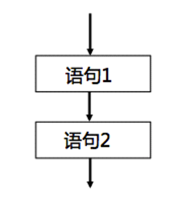

## 5.2 选择结构

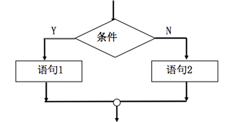

### if

```c
if(表达式){
    语句1;
}else if(表达式2){
    语句2;
}else{
    表达式3;
}
后续语句;
```

**约定**

遇到比较一个变量 等于 或 不等于 一个常量的时候，把常量写在前面

```c
#include <stdio.h>
int main(){
    int a = 8;
//    if(a == 10){// 错误写法, 但不会报错
    if (10 == a){
      printf("a的值是10\n");
    }else{
     printf("a的值不是10\n");
    }
}
```

### switch

```c
switch(表达式){
    case 常量表达式1:
        语句1;
        break;
    case 常量表达式2:
        语句2; 
        break;
    case 常量表达式n:
        语句n;
        break;
    default:
        语句n+1;
        break;
}
```

**注意**

- `switch` 的表达式 及 `case` 的值 的类型必须是整型，或者可以被提升为整型的值(`char`，`short`)

- `case` 的值不能相同

- 每个 `case` 要以 `break` 结尾，否则会出现穿透问题
- `default` 不一定要放在 `case` 最后，只有等到所有 `case` 不匹配才会执行。

## 5.3 循环结构

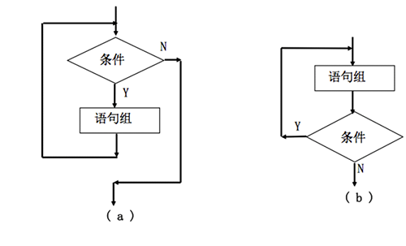

> **循环条件** 成立时，会反复执行 **循环体** ，直到条件不成立位置

### while

```c
while (循环控制条件) {
    循环体中的语句;
    能够让循环结束的语句;
    ....
}
```

循环控制条件：循环退出的主要依据，来控制循环到底什么时候退出

循环体：循环的过程中重复执行的代码段

循环终止语句(递增、递减、真、假等)：能够让循环条件为假的依据，否则退出循环

**注意**

如果 `while` 省略了大括号，则后面不能定义变量

```c
#include <stdio.h>
int main(){
    while (1)  // 死循环
         int num = 10; // 报错
         // 没有能够让循环结束的语句
}
```

### do while

```c
do {
    循环体中的语句;
    能够让循环结束的语句;
    ....
} while(循环控制条件);
```

应用场景：口令校验

```c
#include<stdio.h>
int main()
{
    int num = -1;
    do{
        printf("请输入密码,验证您的身份\n");
        scanf("%d", &num);
    }while(123456 != num);
    printf("主人,您终于回来了\n");
}
```

### for

```c
for(初始化表达式；循环条件表达式；循环后的操作表达式) {
    循环体中的语句;
}
```

对比 `while` 来说， `for` 更节约内存空间

### 循环优化

在多重循环中，应当将最长的循环放在最内存，最短的循环放在最外层，减少CPU跨循环层切换的次数

```c
for (row=0; row<100; row++) {
  // 低效率：长循环在最外层
  for ( col=0; col<5; col++ ) {
    sum = sum + a[row][col];
  }
}

for (col=0; col<5; col++ ) {
  // 高效率：长循环在最内层
  for (row=0; row<100; row++) {
    sum = sum + a[row][col];
  }
}
```

## 5.4 四大跳转

### break

立刻跳出当前语句或循环

一个 `break` 只向外跳一层

`break` 后面的语句不会执行

### continue

> 结束 **本轮** ，进入 **下一轮** 循环

### goto

> 仅在本函数内实现跳转，不能实现跨函数跳转

```c
#include <stdio.h>
int main(){
    int num = 0;
// loop:是定义的标记
loop:if(num < 10){
        printf("num = %d\n", num);
        num++;
        // goto loop代表跳转到标记的位置
        goto loop;
    }
}

#include <stdio.h>
int main(){
    while (1) {
        while(2){
            goto lnj;
        }
    }
    lnj:printf("跳过了所有循环");
}
```

### return 

结束当前函数，将结果返回给调用者

# 6. 函数

> 将一个常用的功能封装起来，方便以后调用

## 6.1 分类

同一源文件函数名称不能相同

### 库函数与用户定义函数

#### 库函数

由C语言系统提供，用户无需定义，也不必在程序中做类型说明，引入头文件后即可在程序中直接调用

#### 用户定义的函数

> 由用户按需编写的函数。对于用户自定义的函数，不仅要在程序中定义函数本身，而且在主调函数中必须对该被调函数进行声明，才能调用。

### 有返回值与无返回值函数

#### 有返回值函数

必须指定返回值类型和使用return关键字返回对应数据

```c
返回值类型 函数名(参数列表){
    函数体;
    返回值;
}
```

#### 无返回值函数

```c
void 函数名(参数列表) {
    函数体;
}
```

### 有参函数和无参函数

####  无参函数

```c
返回值类型 函数名() {
    函数体;
    return 值;
}
```

#### 有参函数

```c
返回值类型 函数名(参数类型 形式参数1，参数类型 形式参数2，…) {
    函数体;
    return 0;
}
```

## 6.2 参数与返回值

### 形参与实参

**形参**

> 定义函数时，函数名后面的 `()` 称为形参

形参变量只有在函数被调用时分配内存。在函数调用结束，释放内存单元

**实参**

> 函数调用时，传入的值称为实参

实参可以是常量、变量、表达式、函数等

在进行函数调用时，都必须具有确定的值，以便把这些值传递给形参

#### 注意

**个数**：调用函数时，传递的实参个数和函数的形参个数必须保持一致

**类型**：形参与实参类型不一致，会自动转换为形参类型

```c
void change(double number1, double number2) {//  形参
   // 传入实参  10.000000, 20.000000
   // 自动将实参转换为double类型后保存
   
}

int main() {
    change(10, 20);
    return 0;
}
```

**值传递**：当使用基本数据类型（char、int、float）作为实参时，实参和形参之间只是值传递，修改形参的值并不影响实参

### 返回值

如果没有写返回值类型，默认是 `int`

`return` 实际返回的值类型应与函数返回值类型一致，否则会进行自动类型转换。

```c
int height() {
    return 3.14; 
}

int main() {
  double temp = height();
  printf("%lf", temp);// 输出结果: 3.000000
}
```

一个函数内部可以多次使用 `return` ，但 `return` 之后的代码不再执行

## 6.3 函数的声明

默认情况下，只有后面定义的函数才可以调用前面定义过的函数

> 函数声明：在函数调用之前告诉系统，函数名称、参数列表、返回值类型
>
> 函数实现：定义具体的业务逻辑是怎么运作的

格式：`返回值类型 函数名(参数列表);`

```c
// 函数声明
void getMax(int v1, int v2);
int main(int argc, const char * argv[]) {
    getMax(10, 20); // 调用函数
    return 0;
}
// 函数实现
void getMax(int v1, int v2) {
    int max = v1 > v2 ? v1 : v2;
    printf("max = %i\n", max);
}
```

函数声明可以写在函数外面，也可以写在函数里面,，只要在调用之前被声明即可

当被调函数的函数定义出现在主调函数之前，在主调函数中也可以不在被调函数中声明

如果被调函数的返回值是整型，可以不对被调函数做声明，可以直接调用

```c
int main(int argc, const char * argv[]) {
    int res = getMin(5, 3); // 不会报错
    printf("result = %d\n", res );
    return 0;
}

int getMin(int num1, int num2) {// 返回int, 不用声明
    return num1 < num2 ? num1 : num2;
}
```

## 6.4 main函数

+ 如果main函数的执行正常, 那么就返回0
  + `main()` 默认返回0，可以不写
+ 如果main函数执行不正常, 那么就返回一个非0的数

`main(int argc,const char * argv[])` 参数列表含义

- `int argc` 系统在启动程序时传递给 `argv` 的值的个数
- `const char* argv[]` 系统在启动程序时传入的值，默认情况下只会传入一个值——`main()` 函数执行文件的路径

可以通过 命令行 或者 项目设置 给 `main()` 传入其他参数

```c
# include<stdio.h>

main(int argc,char* argv[]){
    printf("argc = %d\n",argc);
    printf("argv[0]=%s\n",argv[0]);
    printf("argv[1]=%s\n",argv[1]);
    getchar();
}
```

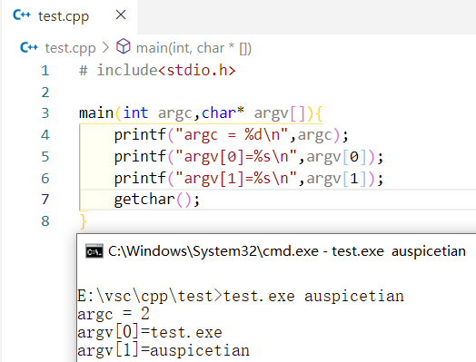

## 6.5 输入输出

### putchar()和getchar()

`putchar()`：向屏幕输出一个字符

```c
#include <stdio.h>
int main(){
    char ch = 'a';
    putchar(ch); // 输出a
}
```

`getchar()`：从键盘获取一个字符

```c
#include <stdio.h>
int main(){
    char ch;
    ch = getchar();// 获取一个字符
    printf("ch = %c\n", ch);
}
```

### scanf函数

系统会先将用户输入放入输入缓冲区，从缓冲区中逐个取数据赋值给变量，如果输入缓冲区不为空，`scanf` 会一直从缓冲区中获取

```c
#include <stdio.h>
int main(){
    int num1;
    int num2;
    char ch1;
    scanf("%d%c%d", &num1, &ch1, &num2);
    printf("num1 = %d, ch1 = %c, num2 = %d\n", num1, ch1, num2);
    char ch2;
    int num3;
    scanf("%c%d",&ch2, &num3);

    printf("ch2 = %c, num3 = %d\n", ch2, num3);
}
```

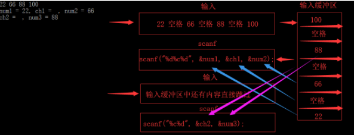

#### fflush

利用 `fflush(stdin);` 清空缓冲区

C和C++标准从未定义过，是C标准的扩充函数，不是所有平台都支持

#### setbuf

`setbuf(stdin,NULL)` 设置缓冲区为空

所有平台有效

### printf()函数格式

#### 数据类型符

| 类型    | 含义                           |
| ------- | ------------------------------ |
| %d/ %i  | 有符号十进制整型               |
| %u      | **无符号**十进制整型           |
| %o      | **无符号**八进制整型           |
| %x / %X | **无符号**十六进制整型         |
| %f      | 单、双精度浮点数               |
| %e / %E | 以指数形式输出单、双精度浮点数 |
| %c      | 字符                           |
| %s      | 字符串                         |
| %p      | 地址                           |
| %%      | 表示%本身                      |

```c
#include <stdio.h>
int main(){
    int a = 10;    
    int b = -10;
    
    // 有符号整数(可以输出负数)
    printf("a = %d\n", a); // 10
    printf("a = %i\n", a); // 10

    // 无符号整数(不可以输出负数)
    // 输出存储单元内二进制数对应的十进制整数
    printf("a = %u\n", a); // 10
    printf("b = %u\n", b); // 429496786

    // 无符号八进制整数(不可以输出负数)
    //输出存储单元内二进制数对应的十进制整数对应的八进制数
    printf("a = %o\n", a); // 12
    printf("b = %o\n", b); // 37777777766

    // 无符号十六进制整数(不可以输出负数)
    printf("a = %x\n", a); // a
    printf("b = %x\n", b); // fffffff6

    // 无符号十六进制整数(不可以输出负数)
    printf("a = %X\n", a); // A
    printf("b = %X\n", b); // FFFFFFF6

    float c = 6.6f;
    double d = 3.1415926;
    
    // 单、双精度浮点数(默认保留6位小数)
    printf("c = %f\n", c); // 6.600000
    printf("d = %lf\n", d); // 3.141593

    double e = 10.10;
    // 以指数形式输出单、双精度浮点数
    printf("e = %e\n", e); // 1.010000e+001
    printf("e = %E\n", e); // 1.010000E+001
    
    // 以最短输出宽度,输出单、双精度浮点数
    printf("e = %g\n", e); // 10.1
    printf("e = %G\n", e); // 10.1
    
    char f = 'a';
    // 输出字符
    printf("f = %c\n", f); // a
}
```

##### 实型有效位问题

- 单精度 `%f` 输出时，仅前6-7位时有效数字；双精度 `%lf` 输出时，仅前15-16位时有效数字
- 有效位数包含小数点前的非零数位

**精度与有效位**

> 有效位：指从第一个非零数字开始，误差不超过本数位半个单位的、正确的数位

原因：计算机存储浮点数时，采用IEEE754，存的是IEEE754可表示的最相近浮点数

```c
#include <stdio.h>
int main(){
    //        1234.567871093750000
    float a = 1234.567890123456789;
    //         1234.567890123456900
    double b = 1234.567890123456789;
    printf("a = %.15f\n", a); // 前8位数字是准确的, 后面的都不准确
    printf("b = %.15f\n", b); // 前16位数字是准确的, 后面的都不准确
}
```

#### 精度格式符

> 精度：小数点后位数

`.n` ，n为十进制整数

-   如果输出数字，则表示小数的位数；
-   如果输出的是字符，则表示输出字符的个数；
-   若实际位数大于所定义的精度数，则截去超过的部分

```c
#include <stdio.h>
int main(){
    double a = 3.1415926;
    printf("a = %.2f\n", a); // 3.14
}
```

##### 动态指定保留小数位数

格式：`printf("%.*f",[],a);`

```c
#include <stdio.h>
int main(){
    double a = 3.1415926;
    printf("a = %.*f", 2, a); // 3.14
}
```

#### 格式控制符

| 符号  | 含义                                                         |
| ----- | ------------------------------------------------------------ |
| %m... | m指定输出字段的宽度，如果位数小于m，则左端以空格补全；若位数大于，则按实际位数输出 |
| -     | 结果左对齐，右边补空格                                       |
| #     | 对于c,s,d,u类无印象<br />八进制，加前缀o<br />十六进制，加前缀0x<br />对于浮点数，只有当结果有小数才给出小数点 |
| 空格  | 输出值为整数，在输出值前面加上空格，为负数加上负号           |
| +     | 当输出值为正数时,在输出值前面加上一个+号, 默认不显示         |
| 0     | 右对齐时，用0填充                                            |

```c
#include <stdio.h>
int main(){
    int a = 1;
    int b = -1;
    // -号标志
    printf("a =|%d|\n", a); // |1|
    printf("a =|%5d|\n", a); // |    1|
    printf("a =|%-5d|\n", a);// |1    |
    // +号标志
    printf("a =|%d|\n", a); // |1|
    printf("a =|%+d|\n", a);// |+1|
    printf("b =|%d|\n", b); // |-1|
    printf("b =|%+d|\n", b);// |-1|
    // 0标志
    printf("a =|%5d|\n", a); // |    1|
    printf("a =|%05d|\n", a); // |00001|
    // 空格标志
    printf("a =|% d|\n", a); // | 1|
    printf("b =|% d|\n", b); // |-1|
    // #号
    int c = 10;
    printf("c = %o\n", c); // 12
    printf("c = %#o\n", c); // 012
    printf("c = %x\n", c); // a
    printf("c = %#x\n", c); // 0xa
}
```


## 5.5 动态分配内存

```c
calloc(unsigned long,unsigned long) <==>
malloc(unsigned long * (unsigned long))

realloc(p,unsigned long)//扩充数组
free()//释放内存，使用完后必须释放内存，错误返回值为NULL
```

## 5.6 指针与函数

### 指向函数的指针变量

`函数类型 (*指针变量名)(参数类型);`

```c
/*函数指针可指向多个函数*/
int add(int x,int y)
{
	return x+y;
}
int max(int x,int y)
{
	return x > y ? x : y;
}
int min(int x,int y)
{
	return x < y ? x : y;
}
int main()
{
	int (*p)(int,int),c,a,b;
	p = add;
	
	c = add(a,b);//=>c = (*p)(a,b);
	p = max;
	c = (*p)(a,b);
	p = min;
	c = (*p)(a,b);
}
```

### 函数指针可作为参数

```c
/*函数指针可指向多个函数*/
int add(int x,int y)
{
	return x+y;
}
int max(int x,int y)
{
	return x > y ? x : y;
}
int min(int x,int y)
{
	return x < y ? x : y;
}
int func(int (*p)(int,int),int x,int y)
{
	return (*p)(x,y);
}
int main()
{
	int (*p)(int,int),c,a,b;
	p = max;
	c = func(p,x,y);
    p = max;
	c = func(p,x,y);
}
```

# 6. 文件

## 6.1 编译预处理

-   宏定义
-   文件包含的处理
-   条件编译

### 宏

>   一般用大写，在预处理阶段，只进行代换，不做正确性检查

-   便于简化程序，修改数据

宏的定义域：从定义点开始到当前源文件结束 或 `#undef` 取消定义

### 文件包含处理

使用 `<>` ，仅在系统指定的磁盘路径下搜索所包含的文件

使用 `""` ，现在当前工作目录中搜索，若找不到则在系统中寻找

### 条件编译

>   通过宏定义进行条件编译

```c
# ifedf 标识符
		程序段1
# else
        程序段2
# endif
            
# if 表达式
		程序段1
# else
        程序段2
# endif            
```

## 6.2 文件分类

-   文本文件——ASCII
-   二进制文件——二进制数据

## 6.3 文件的操作

### `FILE`

>   C语言中存放文件属性的结构体，只能通过指针访问属性

### 打开文件

>   建立程序和文件之间的通信通道，并为文件系统建立缓冲

`FILE *fopen(char *filename,char *mode)`

```c
FILE *fp = fopen("路径","w");
```

-   filename：磁盘文件名
-   mode：指明文件使用方法

|      |                                 |
| ---- | ------------------------------- |
| r    | 读的方式打开文件                |
| w    | 写的方式打开文件                |
| r+   | 读/写的方式打开文件             |
| w+   | 写的方式打开新文件              |
| a    | 写的方式向文件追加内容          |
| a+   | 读/写的方式追加内容             |
| rb   | 读的方式读二进制文件            |
| rb+  | 读/写的方式二进制文件           |
| wb   | 写的方式打开二进制文件          |
| wb+  | 读/写二进制文件                 |
| ab   | 向二进制文件追加内容            |
| ab+  | 读/写的方式向二进制文件追加内容 |

### 关闭文件

```c
int main(){
	FILE *fp;
	if(fopen("abc.txt","w")==NULL){
        exit(-1);//非0表示异常
    }
    fclose(fp);
}
```

### 文件读写

分为

-   顺序读写
-   随机读写

需要引入 **位置指针** ：打开文件，默认指向文件开头

-   所有文件读/写，都是从 *位置指针* 只是的位置进行读/写

#### 顺序读写

##### 文件尾测试函数

`feof` ：若是文件尾，则不能读取数据

-   指向文件尾返回 非零
-   否则返回0

文件使用特殊字符 `EOF` 作为文件结束标记

##### 字符读/写函数

`fgetc(FILE *fp)`：从文件中读取一个字符，若到文件尾返回`EOF`

`fputc(int ch,FILE *fp)`：写入文件

| 从键盘读入一个字符 | 向屏幕输出一个字符 |
| ------------------ | ------------------ |
| `getchar()`        | `putchar()`        |
| `fgetc(stdin)`     | `fputc(ch,stdout)` |

##### 字符串读/写函数

`fgets(char *s,int n,FILE *fp)`

>   从 `fp` 指向的文件中**读取** `n-1` 个字符，写入s中

`fputs(char *s,FILE *fp)`

>   将s中的字符串写到 `fp` 指向的文件中

- 写完 `n-1` 个字符之前，遇到换行符或`EOF`，写入结束

##### 格式读/写

`int fscanf(FILE *fp,char *format)`

>   读/写成功返回整数

`int fprintf(FILE *fp,char *fprmat)`

##### 数据块读/写

`unsigned fread(void *ptr,unsigned size,unsigned n,FILE *fp)`

>   从文件 `fp` 中读取 `n` 个 `size` 字节的数据块，存储于 `ptr` 指向的内存空间

`unsigned fwrite(void *ptr,unsigned size,unsigned n,FILE *fp)`

>   将 `ptr` 指向的存储空间的 n 个 `size` 字节的数据块写入文件 `fp` 中

#### 随机文件读/写

##### 获取文件位置指针

`long ftell(FILE *fp)`

>   返回距文件头的字节数

##### 位置指针重定位

`void rewind()` ：使位置指针指向文件头

##### 文件定位函数

`int fseek(FILE *fp, long offset, int origin );`

>   将位置指针移动到任意位置

-   `fp`：文件的指针，指向要操作的文件

-   `offset` ：表示要移动的字节数

    offset 为正时，向后移动；

    offset 为负时，向前移动。

-   `origin`：从何处开始计算偏移量。

| 起始点   | 常量名   | 常量值 |
| -------- | -------- | ------ |
| 文件开头 | SEEK_SET | 0      |
| 当前位置 | SEEK_CUR | 1      |
| 文件末尾 | SEEK_END | 2      |