title: C
categories:
  - 编程语言
  - C
tags:
  - 编程语言
  - C
abbrlink: 1037565863
mathjax: true
date: 2022-03-14 07:56:41
updated: 2022-03-14 10:00:11

>   C语言是一种用于和计算机交流的高级语言，既具有高级语言的特点，又具有汇编语言的特点
>
>   非常接近自然语言，程序执行效率高
>
>   学习参考：https://edu.csdn.net/course/detail/31452

<!--more-->

# 1. 概述

很多高级语言都是从C语言衍生的

- C++、C#、Object-C、Java、Go等

很多系统软件都是由C语言编写的

- 几乎所有的操作系统都是C编写的
- 几乎所有的计算机底层应用软件都是C编写的
- 几乎所有的编辑器都是C编写的

## 1.1 C语言发展史
$FORTRAN\rightarrow ALGOL\rightarrow CPL \rightarrow BCPL\rightarrow B\rightarrow C\rightarrow C++$

BCPL与B语言：精炼、接近硬件，但过于简单，无数据类型

- 1970 年美国贝尔实验室 Ken Tompson 以BCPL为基础，设计出了很简单而且很接近硬件的B语言，并用B语言写出了第一个UNIX操作系统。但B语言过于简单，功能有限
- 1972 年至1973 年期间，贝尔实验室 Dennis Ritchie 在B语言的基础上设计出了C语言。C语言保持B语言的精炼与接近硬件的特性，又克服了他们的缺点

## 1.2 C语言标准
- 1989年C语言标准被批准，这个版本的C语言标准通常被称为ANSI C(C89)
- 1999年，国际标准化组织ISO又对C语言标准进行修订，在基本保留原C语言特征的基础上，针对应该的需要，增加了一些功能，命名为C99
- 2011年12月，ANSI采纳了ISO/IEC 9899:2011标准。这个标准通常即C11，它是C程序语言的现行标准

## 1.3 优点

- 简洁性：核心内容少，只有 32 个关键字，9 种控制语句、44 种运算符

  条件语句：if...else，switch
  循环语句：while，for，do...while
  break，continue，return，goto
- 丰富的数据类型

- 具有低级语言的特点：与汇编语相近的功能和描述方法，如地址运算和二进制数位 

  可以对硬件端口进行直接操作
  
- 结构化语言，适用于大型程序模块化设计

- 代码效率高

- 语法限制不严，程序设计自由度大

- 可移植性好

## 1.4 算法
> 通过有限步骤，明确的操作产生问题答案

**算法表示**
自然语言，传统流程图，N-S流程图，伪代码

**常用算法**：枚举，递推，递归

## 1.5 数据在计算机中的表示

### 1.5.1 进制转换

#### 进制

> 计数的方式，数值的表示方式

十进制 0、1、2、3、4、5、6、7、8、9 逢十进一

二进制 0、1 逢二进一

- 书写格式：`0b`101

八进制 0、1、2、3、4、5、6、7 逢八进一

- 书写格式：`0`61

十六进制 0、1、2、3、4、5、6、7、8、9、A、B、C、D、E、F 逢十六进一

- 书写格式：`0x`45

#### 转二进制

整数部分：**除基取余，从下至上**

小数部分：**乘积取整，从上至下**

### 1.5.2 数据编码

计算机只能识别0和1的形式存储的

数据在计算机内部是以 **补码** 的形式存储，所有的运算都是以补码存储

- 正数的原码、反码和补码都是它的二进制

- 负数的原码, 是将该负数的二进制最高位变为1

  负数的反码, 是将该数的原码 **除了符号位** 以外的 **其它位取反**

  负数的补码, 就是它的反码 + 1

#### 码制的由来

原码的减法不正确，所以引入反码。但反码相同的数相减，得到 -0。但前面的符号没有任何意义，所以引入补码。

## 1.6 C语言程序组成

一个C语言程序由多个函数组成，每个函数有自己的功能

**一个程序有且仅有一个主函数**

- 如果一个程序没有主函数，则这个函数不具备运行能力

- 程序运行时系统会自动调用主函数，而其他函数需要开发手动调用

### 1.6.1 主函数

#### a. 写法

```c
int main(){
    //other code...
     return 0;
}
```

- 主函数前的int可以不写或者换成 `void`

- main函数中的 return 0 可以不写

多种写法产生原因

- C语言最早的时候只是一种规范和标准（如C89，C11）

- 标准的推行需要各大厂商的支持和实施，由于各大厂商的各自实施，导致实施的标准不同

#### b. 执行结果

> 如果main函数的执行正常, 那么就返回0
>
> - `main()` 默认返回0，可以不写
>
> 如果main函数执行不正常, 那么就返回一个非0的数

#### c. 主函数参数

`main(int argc,const char * argv[])` 参数列表含义

- `int argc` 系统在启动程序时传递给 `argv` 的值的个数
- `const char* argv[]` 系统在启动程序时传入的值，默认情况下只会传入一个值——`main()` 函数执行文件的路径

可以通过 命令行 或者 项目设置 给 `main()` 传入其他参数

```c
# include<stdio.h>

main(int argc,char* argv[]){
    printf("argc = %d\n",argc);
    printf("argv[0]=%s\n",argv[0]);
    printf("argv[1]=%s\n",argv[1]);
    getchar();
}
```


### 1.6.2 注释

> 注释可以用来解释某一段程序或者某一行代码是什么意思，方便程序员之间的交流沟通

#### a. 注释分类

##### 单行注释

 `// 被注释内容`

- 使用范围：任何地方

- 作用范围: 从第二个斜线到这一行末尾

- 快捷键:Ctrl+/

##### 多行注释

`/* 被注释内容 \*/`

-  使用范围：任何地方

- 作用范围: 从第一个 `/*` 到最近的一个 `*/`

#### c. 注意
单行注释可以嵌套单行注释、多行注释

```c
// aa // vvvvvv
// /* asdasd */
```

多行注释可以嵌套单行注释

```c
/*
	// asdasd
 */
```

多行注释 **不能** 嵌套多行注释

```c
/* 
哈哈哈
     /*嘻嘻嘻*/
 呵呵呵 
*/
```

### 1.6.3 关键字
 > C语言中具有特殊含义的单词

#### a. 特点
1. 全部小写

2. 不可用作变量名、函数名等

3. C语言一共有32个关键字

| 1       | 2       | 3      | 4    | 5        | 6      | 7      | 8        |
| ------- | ------- | ------ | ---- | -------- | ------ | ------ | -------- |
| char    | short   | int    | long | float    | double | if     | else     |
| return  | do      | while  | for  | switch   | case   | break  | continue |
| default | goto    | sizeof | auto | register | static | extern | unsigned |
| signed  | typedef | struct | enum | union    | void   | const  | volatile |

#### b. 分类
##### 基本数据类型关键字

`char`：字符类型变量

`int`：整型变量

`float`：浮点类型变量(单精度)

`double`：浮点类型变量（双精度）

`enum`：枚举声明

##### 类型修饰符

`short`：修饰 `int` ，表示短整型

`long`：修饰 `int` ，表示长整型

`signed`：修饰 `int` ，声明为有符号数据类型

`unsigned`：修饰 `int` ，声明为无符号整数类型

##### 结构类型关键字

`struct`：结构体声明

`union`：共用体声明

##### 流程控制关键字

分支结构

`if` ：条件语句

`else` ：条件语句的否定分支

`switch`：开关语句

`case`：开关语句的分支标记

`default`：开关语句中的其他分支

---

循环语句

`for`：循环语句

`while`：循环语句

`do...while`：循环语句

---

跳转语句

`continue`：跳过语句

`break`：跳出语句

`goto`：无条件跳转

`return`：返回语句，用于返回特定值

---

存储类型关键字

`auto`：指定为自动变量

`register`：指定为寄存器变量

`static`：指定为静态存储类型

`extern`：指定对应变量为外部存储类型

`const`：指定变量为只读变量

`volatile`：指定变量为易变变量

---

特殊用途关键字

`sizeof`：计算数据长度

`typeof`：声明类型别名

`void`：空类型

# 2. 数据类型

## 2.1 空类型 `NULL`

## 2.2 基本数据类型
一个变量所占用的存储空间，和 **定义变量时声明的类型** 以及 **编译环境** 有关

| 类型      | 32位编译器 | 64位编译器 |
| --------- | ---------- | ---------- |
| char      | 1          | 1          |
| int       | 4          | 4          |
| float     | 4          | 4          |
| double    | 8          | 8          |
| short     | 2          | 2          |
| long      | 4          | 8          |
| long long | 8          | 8          |
| void*     | 4          | 8          |

### 2.2.1 char

char类型变量占1个字节存储空间，共8位

除单个字符以外, C语言的的转义字符也可以利用char类型存储

| 字符 | 意义                              |
| ---- | --------------------------------- |
| `\b` | 退格(BS)当前位置向后回退一个字符  |
| `\r` | 回车(CR),将当前位置移至本行开头   |
| `\n` | 换行(LF),将当前位置移至下一行开头 |
| `\t` | 水平制表(HT),跳到下一个 TAB 位置  |
| `\0` | 用于表示字符串的结束标记          |
| `\`  | 代表一个反斜线字符 \\             |
| `\"` | 代表一个双引号字符"               |
| `\'` | 代表一个单引号字符'               |

ASCII码：定义了字符与01串的映射关系


采用ASCII编码的字符占一个字节，一个中文字符（采用unicode）占三个字节

可见，`char` 类型变量不能存储中文内容
除转义字符外，不支持多个字符

### 2.2.2 int与其说明符

int 占用4字节的内存空间，取值范围为 $-2^{31}-2^{31}-1$

C语言中提供了 **长度说明符** 和 **符号位说明** 两种类型

这些类型说明符都是用于修饰 `int` 的，所以可以省略 `int`

#### a. short 和 long
`short` 和 `long` 可提供不同长度的整型，相应的改变整型数值的取值范围

- `short` 占用2字节，取值范围 $-2^{15}-2^{15}-1$

- `long` 占用8字节，取值范围 $-2^{63}-2^{63}-1$

`short` 的长度不能大于 `int` ，`int` 长度不能大于 `long`

在32bit编译器环境下，`long` 占用4字节， `long long` 占用8字节

64bit编译器环境下，`long` 与 `long long` 占用8字节

```c
#include <stdio.h>

int main(){
    // char占1个字节, char的取值范围 -2^7~2^7
    char num = 129;
    // num中存储的内容：1000 0001
    // 转化为十进制 1111 1111 -127
    
    // short int 占2个字节, short int的取值范围 -2^15~2^15-1 -32768~32767
    short int num1 = 32769;// -32767
    //num1中存储的内容：1000 0000 0000 0001
    //转化为十进制 1111 1111 1111 1111 = -32767

    // 由于short/long/long long一般都是用于修饰int, 所以int可以省略
    short num2 = 123;
    printf("num5 = %d\n", num5);
    long num3 = 123;
    printf("num6 = %ld\n", num6);
    long long num4 = 123;
    printf("num7 = %lld\n", num7);
    return 0;
}
```

#### b. signed 和 unsigned

`unsigned` 和 `signed` 的区别在于最高位是否要当做符号位，他并不会改变 `int` 的存储空间

- `signed` 等价于 `int` 等价于 `signed int` ，数值范围为 $-2^{31}-2^{31}-1$

- `unsigned` 表示无符号，最高位不当做符号位，数值范围 $0-2^{32}-1$

符号位说明符和长度说明符可以混合使用

### 2.2.3 枚举类型

在枚举类型的定义中，列举出所有可能的取值

枚举类型变量的取值不能超过定义的范围

#### a. 枚举类型定义
```c
enum 枚举名 {
	枚举元素1;
    枚举元素2;
    ......
};
```

```c
enum Season {
    Spring;
    Summer;
    Autum;
    Winter;
};
```

#### b. 枚举类型变量定义

先定义枚举类型，再定义枚举变量

```c
enum Season {
    Spring,
    Summer,
    Autumn,
    Winter
};
enum Season s;
```

---

定义枚举类型的同时定义枚举变量

```c
enum Season {
    Spring,
    Summer,
    Autumn,
    Winter
} s;
```

---

省略枚举名称，直接定义枚举变量

```c
enum {
    Spring,
    Summer,
    Autumn,
    Winter
} s;
```

#### c. 枚举变量的赋值与使用
```c
enum Season {
    Spring,
    Summer,
    Autumn,
    Winter
} s;

s = Spring; // 等价于 s = 0;
s = 3; // 等价于 s = winter;
printf("%d", s);
```

- C编译器将枚举类型变量的元素作为整型常量处理，称为枚举常量

- 枚举元素的值取决于定义时各枚举元素排列的先后顺序

  默认情况下，第一个枚举元素的值为0，第二个为1，递增

```c
enum Season {
    Spring,
    Summer,
    Autumn,
    Winter
};
// 默认情况下，spring的值为0，summer的值为1，autumn的值为2，winter的值为3
```

---

在定义枚举类型时可修改枚举元素的值

```c
enum Season {
    Spring = 9,
    Summer,
    Autumn,
    Winter
};
// spring的值为9，summer的值为10，autumn的值为11，winter的值为12
```

## 2.3 构造类型
### 2.3.1 结构体
> 用于保存一组不同类型的数据

-   当结构体成员是其本身时，只能用指针
-   当初始化参数列表中参数数量少于成员个数时，其余成员自动赋0
-   对结构体成员操作，实质上是对其所在地址进行操作

#### a. 结构体定义

```c
struct 结构体类型名{
    类型名1 成员名1;
    类型名2 成员名2;
    ...
    类型名3 成员名3;
};
---
struct Student{
  char *name;
  int age;
  float height;
};
```

#### b. 结构体变量

先定义结构体类型，再定义结构体变量名

```c
struct Student {
    char *name;
    int age;
};

struct student stu;
```

---

定义结构体类型的同时定义变量

```c
struct Student {
  char *name;
  int age;
} stu;
```

---

匿名结构体定义结构体变量

```c
struct {
    char *name;
    int age;
}stu;
```

#### c. 结构体成员访问

`结构体变量名.成员名`

```c
struct Student {
    char *name;
    int age;
};

struct Student stu;

// 访问stu的age成员
stu.age = 27;
printf("age = %d", stu.age);
```

#### d. 结构体成员初始化

定义的同时按顺序初始化

```c
struct Struct {
    char *name;
    int age;
};

struct Student stu = {"Amos",23};
```

---

定义的同时不按顺序初始化

```c
struct Struct {
    char *name;
    int age;
};

struct Student stu = {.age = 23, .name = "Amos"};
```

---

先定义后逐个初始化

```c
struct Student {
    char *name;
    int age;
};

struct Student stu;
stu.name = "Amos";
stu.age = 23;
```

---

先定义后一次性初始化

```c
struct Student {
     char *name;
     int age;
 };
struct Student stu;
stu = (struct Student){"Amos", 23};
```

#### e. 结构体作用域

结构体类型定义在函数内部的作用域与局部变量的作用域相同

- 从定义的那一行开始，直到遇到 `return` 或者 `{}` 为止
- 函数内部的结构体会屏蔽同名的全局结构体

结构体类型定义在函数外部的作用域与全局变量的作用域相同

- 从定义的哪一行开始，知道本文件结束为止

#### f. 结构体数组

`struct 结构体类型名称 数组名称[元素个数];`

```c
struct Student {
	char *name;
    int age;
};

struct Student stu[2];
```

##### 初始化

定义同时初始化

```c
struct Student {
    char *name;
    int age;
};
struct Student stu[2] = {{"Amos", 23},{"zz", 18}}; 
```

---

先定义后初始化

```c
struct Student {
    char *name;
    int age;
};
struct Student stu[2];
stu[0] = {"Amos", 23};
stu[1] = {"zz", 18}; 
```

#### g. 结构体指针

> 一个指针变量当用指向一个结构体变量时，称之为结构体指针变量

`struct 结构名 *结构指针变量名;`

```c
struct Student {
    char *name;
    int age;
};

// 定义一个结构体变量
struct Student stu = {"Amos", 23};
//定义一个指向结构体的指针变量
struct Student *p;
p =  &stu;

# 访问成员变量的三种方法
printf("name=%s, age = %d \n", stu.name, stu.age);
printf("name=%s, age = %d \n", (*p).name, (*p).age);
printf("name=%s, age = %d \n", p->name, p->age);
```

#### h. 结构体内存分析

给结构体变量开辟内存空间和给普通变量开辟内存空间一样，从内存的大地之开始，向小地址扩展

给结构体成员开辟内存空间和给数组元素开辟存储空间一样，会从给该变量分配的内存地址小的位置开始

结构体变量占用的内存空间是所有成员类型中最大内存占用的倍数

```c
struct Person{
    int age; // 4
    char ch; // 1
    double score; // 8
};
struct Person p;
printf("sizeof = %i\n", sizeof(p)); // 16
```

- 占用内存最大的成员是 `score` ，占8个字节。所以以8字节为单位进行内存申请。
- 第一个8字节分配给 `ch` 和 `age` ，所以一共开辟了两个8字节的存储空间
- 第二个8字节分配给 `score` 

```c
struct Person{
    int age; // 4
    double score; // 8
    char ch; // 1
};
struct Person p;
printf("sizeof = %i\n", sizeof(p)); // 24
```

- 占用内存最大的成员是 `score` ，占8个字节。所以以8字节为单位进行内存申请
- 第一个8字节分配给 `age` 
- 第二个8字节分配给 `score` ：第一个8字节只剩4字节，不够给 `age` 分配，需要重新申请
- 第三个8字节分配给 `ch` ：第二个8字节全部分配给了 `score` ，所以需要新开辟8个字节

#### i. 结构体嵌套定义

结构体成员可以是一个结构体

```c
struct Date {
    int year;
    int mouth;
    int day;
};

struct Student {
    int num;
    char *name;
    char sex;
    struct Date birthday;
    Float score;
};
```

结构体不可以嵌套同类型结构体变量

```c
# 错误写法
struct Student {
    int age;
 	struct Student stu;
};
```

对嵌套结构体成员的访问，连续使用成员运算符 `.` 访问最低一级成员

```c
struct Date {
    int year;
    int month;
    int day;
};

struct Student {
    char *name;
    struct Date birthday;
};

struct Student stu;
stu.name = "Amos";
stu.birthday.year = 2000;
stu.birthday.month = 1;
stu.birthday.day = 1;
```

#### j. 结构体和函数

> 结构体之间赋值是值拷贝 ，不是地址传递

```c
struct Person{
    char *name;
    int age;
};
struct Person p1 = {"Amos", 23};
struct Person p2;
p2 = p1;
p2.name = "Auspice"; // 修改p2不会影响p1
printf("p1.name = %s\n", p1.name); // Amos
printf("p2.name = %s\n", p2.name); //  Auspice
```

> 在函数内修改形参，不会影响外界实参

```c
#include <stdio.h>

struct Person{
    char *name;
    int age;
};

void test(struct Person p);

int main()
{
    struct Person p1 = {"Amos", 23};
    printf("p1.name = %s\n", p1.name); // Amos
    alter(p1);
    printf("p1.name = %s\n", p1.name); // Amos
    return 0;
}
void alter(struct Person per){
    per.name = "Auspice";
}
```

#### k. 位域

>   特殊的结构体，以二进制位为单位，指定所占的二进制位数

-   只能用 `unsigned,int,signed int`

-   当存储单元剩下的空间不够存放一个位域时，从跳到下个存储单元，从低位开始存储

### 2.3.2 共用体
#### a. 结构体和共用体区别

结构体：用于将多种数据组合成一个整体。

共用体：采用覆盖技术，几个不同变量共享一段内存空间。成员的起始地址一样，都是共用体的起始地址，在同一时刻只能使用其中的一个成员变量

区别：

- 结构体每一位成员表示一种具体事物的属性，共用体是多种属性的集合
- 结构体的存储空间为各成员占用存储空间的和，共用体存储空间为最大成员的存储空间
- 共用体不能初始化，但结构体可以

#### b. 共用体定义

```c
union 共用体名 {
    数据类型 成员名称;
    数据类型 成员名称;
    ...	   ....
};

union 共用体名 共用体变量名;
```

```c
union Test {
    int age;
    char ch;
};

union Test t;

t.age = 23;
printf("t.age = %d\n" ,t.age);//23
t.ch = 'a';
printf("t.ch = %c\n",t.ch);//a
printf("t.age = %d\n",t.age);//23
```

#### c. 应用场景

1. 通信中的数据包会用到共用体，因为不知道对方会发送什么样的数据包过来
2. 节约内存。两个很长的数据结构，但不会同时使用，用结构体就比较浪费内存
3. 某些应用需要大量临时变量，这些变量类型不同，且随时更换。可以使用共用体让这些变量共享一个内存空间，这些临时变量不需要长期保存

### 2.3.3 数组

数组：一组 **相同数据类型** 数据的有序集合

数组名：该数组在内存中的起始地址

数组元素：构成数组的每一个数据

数组下标：数组元素下标范围：$(0,元素个数-1)$

#### a. 数组定义

`元素名 数组名[元素个数];`

- 元素个数只能写整型常量或者常量表达式

```c
int ages4['A'] = {19, 22, 33};
printf("ages4[0] = %d\n", ages4[0]);

int ages5[5 + 5] = {19, 22, 33};
printf("ages5[0] = %d\n", ages5[0]);

int ages5['A' + 5] = {19, 22, 33};
printf("ages5[0] = %d\n", ages5[0]);

# 错误：未指定元素个数
int a[];

# 错误：只能在定义数组的时候进行一次性（全部赋值）的初始化
int ages3[5];
ages10 = {19, 22, 33};
```

#### b. 初始化数组

没有初始化的数组，存储的是随机的垃圾值

在 `{}` 中的各数据值即为各元素的初值,各值之间用逗号间隔

##### 定义的同时初始化

指定元素个数，完全初始化

```c
int nums[3] = {1,2,3};
```
---

指定元素个数，部分初始化

- 没有显式初始化的元素，系统会自动将其初始化为0

	```c
	int nums[10] = {1,2};
	```

- 可以指定部分索引的值

  ```c
  int nums[5] = {[4] = 3,[1] = 2};
  ```

---

不指定元素个数，完全初始化

```c
int nums[] = {1,2,3};
```

- 不指定元素个数，部分初始化

  ```c
  int nums[] = {[4] = 3};
  ```

##### 先定义后单独初始化

```c
int nums[3];
nums[0] = 1;
nums[1] = 2;
nums[2] = 3;
```

- 对于数组，只能 **定义时初始化** 或 **定义后逐个赋值** 

  ```c
  int nums[3];
  nums = {1,11,2}; // 报错
  ```

#### c. 数组的使用

通过 `数组名[下标]` 访问

通过首地址偏移量访问 `*(数组名+n)`

##### 数组的遍历

> 有序地查看数组的每一个元素

```c
int ages[4] = {19, 22, 33, 13};
for (int i = 0; i < 4; i++) {
    printf("ages[%d] = %d\n", i, ages[i]);
}
```

#### d. 数组长度的计算

##### 数组存储空间的计算

$数组存储空间 = 一个元素占用的存储空间 * 元素个数(数组长度)$

##### `sizeof` 关键字计算数组长度

```c
int ages[4] = {19, 22, 33, 13};
int length =  sizeof(ages)/sizeof(int);
printf("length = %d", length);
输出结果: 4
```

#### e. 数组内存分析

数组定义：从高地址开辟一块连续的没有被使用的内存给数组

数组名：指向分配给数组的最小地址

```c
# include<cstdio>

using namespace std;

int main(int argc, char const *argv[])
{
    /* code */

    int num = 9;
    printf("num 地址%p\n",&num);

    char cs[] = {'a','b','c'};
    printf("cs 地址%p\n",cs);
    printf("cs[0] 地址%p\n",cs[0]);
    printf("cs[1] 地址%p\n",cs[1]);
    printf("cs[2] 地址%p\n",cs[2]);

    int nums[] = {2, 6};
    printf("nums = %p\n", &nums);      
    printf("nums[0] = %p\n", &nums[0]);
    printf("nums[1] = %p\n", &nums[1]);
    
    return 0;
}
```


- 从该数组分配的连续存储空间中，低地址开始给元素分配一块内存
- 每个元素采用大端模式存储数据（高字节高地址）

#### f. 数组越界问题

```c
char cs1[2] = {1, 2};
char cs2[3] = {3, 4, 5};

# cs1[1] cs1[0] cs2[2] cs2[1] cs2[0]
cs2[3] = 88; // cs2[3] = cs1[0]
printf("cs1[0] = %d\n", cs1[0]);
输出结果: 88
```

#### g. 数组与函数

> 数组可以作为函数参数使用

> 把数组元素作为实参——**值传递**

> 把数组名作为函数形参和实参——**地址传递**

- 实参数组名将该数组的起始地址传递给形参数组，两个数组共享一段内存单元，系统不会为形参数组分配存储单元

- 在被调函数中修改形参数组内容，实参数组内容也会被修改

```c
# include<stdio.h>

void change(int array[3]){
    //等价于 void change(int array[])
    // void change(int *array)
    array[0] = 88;
}

int main(int argc, const char * argv[]){
    int ages[3] = {1, 5, 8};
    printf("ages[0] = %d", ages[0]);// 1
    change(ages);
    printf("ages[0] = %d", ages[0]);// 88
}
```

- 在函数形参表中,允许不给出形参数组的长度

  ```c
  void change(int array[]){
      array[0] = 88;
  }
  ```

- 形参数组和实参数组类型必须一致

- 当数组名作为函数参数时，因为自动转换为指针类型，所以在函数中无法动态计算数组的元素个数


### 2.3.4 二维数组
二维数组的元素是一维数组

`数据类型 数组名[一维数组个数][一维数组元素个数]`

- 一维数组的个数：包含多少一维数组
- 一维数组的元素个数：当前二维数组的每个一维数组元素的个数

#### a. 初始化

定义同时初始化

```c
int a[2][3]={ {80,75,92}, {61,65,71}};
```

---

定义后逐个赋值

```c
int a[2][3];
a[0][0] = 80;
a[0][1] = 75;
a[0][2] = 92;
a[1][0] = 61;
a[1][1] = 65;
a[1][2] = 71;
```
---

按行分段赋值

```c
int a[2][3]={ {80,75,92}, {61,65,71}};
```

---

指定元素初始化

```c
int a[2][3]={[1][2]=10};
int a[2][3]={[1]={1,2,3}}
```

**注意**：行长度可以省略，但列长度不能省略

```c
int a[][3]={{1,2,3},{4,5,6}};
int a[][3]={1,2,3,4,5,6};

//部分初始化
int a[][3]={{1},{4,5}};
int a[][3]={1,2,3,4};
```

#### b. 二维数组的遍历
```c
char cs[2][3] = {
    {'a', 'b', 'c'},
    {'d', 'e', 'f'}
};

for(int i = 0; i < 2; i++) { // 外循环取出一维数组
    for(int j = 0;j < 3;j++) {//内循环取出一维数组的元素
        printf("%c", cs[i][j]);
    }
    printf("\n");
}
```

#### c. 二维数组的存储
从高地址开始给每个数组分配空间

从低地址开始给每个数组元素分配空间

从高地址给每个元素分配空间

每个元素大端模式存储数据

```c
#include <stdio.h>
int main(){
    char cs[2][3] = {
        {'a', 'b', 'c'},
        {'d', 'e', 'f'}
    };
    // cs == &cs == &cs[0] == &cs[0][0]
    printf("cs = %p\n", cs);                // 0060FEAA
    printf("&cs = %p\n", &cs);              // 0060FEAA
    printf("&cs[0] = %p\n", &cs[0]);        // 0060FEAA
    printf("&cs[0][0] = %p\n", &cs[0][0]);  // 0060FEAA
    return 0;
}
```

#### d. 二维数组与函数

##### 值传递

```c
#include <stdio.h>

// 基本类型在函数中修改形参不会影响实参
void change(char ch){
    ch = 'n';
}

int main(){
    char cs[2][3] = {
        {'a', 'b', 'c'},
        {'d', 'e', 'f'}
    };
    printf("cs[0][0] = %c\n", cs[0][0]); // a
    change(cs[0][0]);
    printf("cs[0][0] = %c\n", cs[0][0]); // a
    return 0;
}
```

##### 地址传递

`a[i]` 表示的是一维数组首地址

```c
#include <stdio.h>

// 数组类型在函数中修改形参会影响实参
void change(char ch[]){
    ch[0] = 'n';
}

int main(){
    char cs[2][3] = {
        {'a', 'b', 'c'},
        {'d', 'e', 'f'}
    };
    printf("cs[0][0] = %c\n", cs[0][0]); // a
    change(cs[0]);
    printf("cs[0][0] = %c\n", cs[0][0]); // n
    return 0;
}
```

**二维数组列不能省略**
```c
#include <stdio.h>

void change(char ch[][3]){
    ch[0][0] = 'n';
}
int main(){
    char cs[2][3] = {
        {'a', 'b', 'c'},
        {'d', 'e', 'f'}
    };
    printf("cs[0][0] = %c\n", cs[0][0]); // a
    change(cs);
    printf("cs[0][0] = %c\n", cs[0][0]); // n
    return 0;
}
```

**被调函数只知道数组的首地址，不知道行数，需要通过参数传入**

可以通过 `sizeof 数组名[i]` 获取列数

- `sizeof(cs[0])` 获得列数
- `sizeof(cs)/sizeof(cs[0])` 获得行数

### 2.3.5 字符串
> 用 `""` 中的字符序列表示字符串常量

以字符数组形式存储在计算机中，在每个字符串结尾需要添加一个 `'\0'` 表示字符串结束，`\0` 在ASCII中用0表示

- 在C语言中没有专门的字符串变量，通常用一个字符数组来存放字符串

#### a. 初始化
```c
char name[9] = "Amos"; 
char name1[9] = {'A','m','o','s','\0'};
char name2[9] = {'A','m','o','s',0};
// 当数组空间大于字符个数时, 未被初始化的部分是0
char name3[9] = {'A','m','o','s'};
//上述四种写法是等价的
```

**一个字符串数组，若不做初始化赋值，必须指定数组长度**

比正常数组可用的存储空间少1个，因为字符串结束标志 `'\0'` 需要占一个空间

#### b. 输入输出

使用 `printf("%s",str);` 进行输出

- `%s` 本质是根据传入的 str 地址逐个去取数组中的元素输出（$低地址\rightarrow 高地址$），直至遇到 `'\0'` 

`'\0'` 引发的脏读问题：

```c
char name[] = {'c', 'o', 'o', 'l' , '\0'};
char name2[] = {'A', 'm', 'o', 's'};
printf("name2 = %s\n", name2); // 输出结果: Amoscool
```

name低字节与name2高字节邻接，所以从低位输出name2到高位，会将name与name2全部输出

---

使用 `scanf("%s",str);` 进行输入

```c
char ch[10];
scanf("%s",ch);
```

- 对一个字符串数组，如果不做初始化赋值， 必须指定数组长度

- `ch` 最多存放由9个字符构成的字符串，其中最后一个字符的位置要留给字符串结束标示 `‘\0’`

- 当用 `scanf` 输入字符串时，字符串中不能有空格，否则将以空格作为串的结束符

#### c. 常用方法

C语言提供的字符串处理函数，大致可以分为字符串输入、输出、合并、修改、比较、替换、复制、搜索几类

- 输入输出在 `stdio.h` 中
- 其他方法在 `string.h` 中

##### 输入输出

`puts(字符数组名)` ：把字符数组中的字符串输出到显示器上

优点：

- 自动换行
- 可以是数组的任意元素地址

缺点

- 不能自定义输出格式，只能输出字符串内容


---

`gets(字符数组名)` ：从标准输入(键盘) 上输入一个字符串

```c
char ch[30];
gets(ch); // 输入:Amos
puts(ch); // 输出:Amos
```

`gets` 以 **回车** 作为输入结束，所以字符串中可以有空格

`gets` 的接收变量是预先定义的，所以会有数组越界的风险

##### 字符串长度

`sizeof` 动态计算

字符串在内存中是字符数组的形式存储，一个字符占用一个字节

字符串的结束符也占用一个存储单元

```c
char name[] = "666";
printf("size = %d\n", sizeof(name)); //输出结果:4
// 包括 \0
```

---

`strlen(字符数组名)` ：获取字符串的实际长度（不包含字符结束标志 `'\0'`） 

```c
char name[] = "666";
printf("len = %d\n", strlen(name2)); //输出结果:3
```

---

自定义

```c
int myStrlen(char str[]){
    int cnt = 0;
    while(str[length] != '\0')
        cnt++;
    
    return cnt;
}
```

##### 字符串连接

`strcat(destStr,newstr);`

删去 `destStr` 后的 `\0` ，将 `newStr` 连接到 `destStr` 后，并，然后返回  `destStr` 的首地址

```c
char oldStr[100] = "welcome to";
char newStr[20] = " Amos";
strcat(oldStr, newStr);
puts(oldStr); //输出: welcome to Amos"
```

`destStr` 必须定义足够的长度，否则不能全部装入被连接的字符串

##### 字符串复制

`strcpy(destSrc,srcStr);` ：将 `srcStr` 拷贝到 `destSrc` 中（ `'\0'` 也会一起拷贝）

```c
char destStr[100] = "welcome to";
char newStr[50] = " Amos";
strcpy(destStr, newStr);
puts(destStr); // 输出结果:  Amos // 原有数据会被覆盖
```

##### 字符串比较

`strcmp(字符数组名1,字符数组名2);` ：逐字符比较两个字符数组的ASCII码，并返回比较结果

- 字符串1 == 字符串2 ，返回值 = 0
- 字符串1 > 字符串2，返回值 > 0
- 字符串1 < 字符串2，返回值 < 0

```c
char bgStr[2] = "0";
char smStr[2] = "1";
printf("%d", strcmp(bgStr, smStr)); //输出结果:-1

char bgStr[2] = "1";
char smStr[2] = "1";
printf("%d", strcmp(bgStr, smStr));  //输出结果:0

char bgStr[2] = "1";
char smStr[2] = "0";
printf("%d", strcmp(bgStr, smStr)); //输出结果:1
```

## 2.4 指针类型

### 2.4.1 基本概念

在计算机中，所有数据都存储在内存单元，每个内存单元都有唯一对应的地址，只要通过这个地址就能找到内存单元中的数据

#### a. 内存地址与存储空间

内存地址：门牌号——指明当前存储空间在内存中的位置

存储空间：房间——实际放数据的地方


>   一个指针就是**一个内存单元的地址**
>
>   变量地址：系统分配给变量的 “内存单元” 的**起始地址**


#### b. 指针变量

在C语言中，允许用一个变量来存放其它变量的地址，即指针变量


### 2.4.2 指针运算符

#### a. &

 `& 变量名`：获取变量的首地址（指针）

#### b. *

在定义变量时，`*` 是一个类型说明符，说明定义的变量是一个指针变量

```c
int *p = NULL;
```

在变量名前，且不是定义时，表示访问指针指向的存储空间

```c
int a = 5;
int *p = &a;
printf("%d",*p);
```

在表达式中，`*` 表示乘法

### 2.4.3 指针类型

在同一编译器环境下，所有指针变量占用的内存空间是固定的

但不同类型的变量所占存储空间是不同的

指针变量：

- 16位编译器：2字节
- 32位编译器：4字节
- 64位编译器：8字节

指针变量需要它所指向的数据类型告诉它要访问后续的多少个存储单元


### 2.4.4 指针变量定义

指针变量：用一个变量存放其他变量的地址

```c
int age;// 定义一个普通变量
int *pnAge; // 定义一个指针变量
pnAge = &age;
```

`指针指向的数据类型 *指针变量名`

### 2.4.5 指针变量的初始化

- 指针变量只能存储地址, 不能存储其它类型
- 指针没有初始化里面是一个垃圾值，称为 **野指针**
- 指针必须初始化才可以访问其所指向存储区域

#### a. 定义同时初始化
```c
int a = 5;
int *p = &a;
```

#### b. 先定义后初始化

```c
int a = 5;
int *p;
p=&a;
```

#### c. 注意

- 指针没有初始化，里面是一个垃圾值，称为野指针

- 指针的指向可以改变

  ```c
  int a = 5;
  int *p = &a;
  int b = 10;
  p = &b; // 修改指针指向
  ```

- 多个指针变量可以指向同一个地址

### 2.4.6 二级指针

指针的指针，间接寻址


```c
char c = 'a';
char *cp;
cp = &c;
char **cp2;
cp2 = &cp;
printf("c = %c", **cp2);
```

### 2.4.7 数组的指针

获取元素地址，使用取内容符 `&val`【视为一维数组】

#### a. 数组元素的指针

一个数组由若干个数组元素组成，每个数组元素占用一段存储空间，**数组元素的指针**指向这段存储空间的首地址

```c
int a[10] = {1,2,3,4,5,6,7,8,9,10};

//将数组的首元素地址赋值给指针变量 p
// 以下两种写法等价
int *p = a;
int *p = &a[0];
```

#### b. 指针访问数组元素

访问数组元素的两种方法：

- 下标，`a[i]`
- 指针，`*p = a; *(p+i)`


- 指针都可通过 `p+=1;` 或 `p++;` 后移指向下一个存储单元，这里的 `+1` 指的是后移一个存储单元

- **数组名** 是一个指针，但**不能被修改**

	```c
	int x[10];
	x++;  //错误
	int* p = x;
	p++; //正确
	```

### 2.4.8 字符串指针
#### a. 字符串定义
##### 字符数组
```c
char string[]=”Amos Tian”;
printf("%s\n",string);
```

##### 字符串指针指向字符串

```c
// 数组名保存的是数组第0个元素的地址, 指针也可以保存第0个元素的地址
char *str = "abc"
```

#### b. 查看字符串的某个字符
```c
char *str = "Amos";
for(int i = 0; i < strlen(str);i++){
  printf("%c-", *(str+i)); // 输出结果:A-m-o-s
}
```

- **不可修改字符串内容**

  使用 `字符数组` 来保存的字符串是保存 `栈` 里的，保存栈里面东西是**可读可写**，所以可以修改字符串数组中的字符

  使用 `字符指针` 来保存字符串，它保存的是 `字符串常量地址` ，常量区是**只读** 的 ，所以我们不可以修改字符串中的字符

- 未分配内存空间的指针，不能直接接收键盘输入

  ```c
  # 错误写法
  char *str;
  scanf("%s", str);
  ```

### 2.4.9 函数与指针

函数作为一段程序，在内存中也要占据部分存储空间，这部分存储空间有一个起始地址（函数名可理解为一个函数指针），所以可以用一个指针指向这个起始地址。

#### a. 指向函数的指针

`返回值类型 (*指针变量名)(形参1类型, 形参2类型, ...);`

```c
# include<stdio.h>

/*函数指针可指向多个函数*/
int add(int x,int y){
	return x+y;
}
int max(int x,int y){
	return x > y ? x : y;
}
int min(int x,int y){
	return x < y ? x : y;
}

int main(){
	int (*p)(int,int),addRes,a,b;
    
	p = add;
	addRes = (*p)(a,b);
	p = max;
	maxRes = (*p)(a,b);
	p = min;
	minRes = (*p)(a,b);
    
    return 0;
}
```

**注意**

- 这类指针变量存储的是一个函数的入口地址，所以对他们加减运算无意义
- 要求：定义指向函数的指针时，括号不能省略，否则报错：无法修改的左值
- 约定：通过函数指针调用函数时，括号不省略，即 `(函数变量名);` ，只是作为一种约定，表示通过函数指针调用函数

#### b. 函数指针作为形参

```c
/*函数指针可指向多个函数*/
int add(int x,int y){
	return x+y;
}

int max(int x,int y){
	return x > y ? x : y;
}

int min(int x,int y){
	return x < y ? x : y;
}

int funp(int (*p)(int,int),int x,int y){
	return (*p)(x,y);
}

int main(){
	int (*p)(int,int),res,a,b;
	p = max;
	res = funp(p,a,b);
}
```

### 2.4.10 指针数组

`数据类型 *数组名[数组长度]`

数组名中存的是首地址

```c
char *str[3] = {"one","two","program"}
/=>
/*
* char *str[3];
* char str[0] = "one";
* char str[1] = "two";
* char str[2] = "program";
*/
```

## 2.5 类型转换

### 2.5.1 自动类型转换

#### a. 算数转换

在同一个算数表达式中，有多个数据类型：
先将占用内存较少的类型转换为占用内存高的类型，然后再参与运算

```c
// 当前表达式中1.0占用8个字节, 2占用4个字节
// 所以会先将int类型的2转换为double类型，然后再计算
double b = 1.0 / 2;//0.5
```

#### b. 赋值类型转换

右侧表达式运算结果自动转换为左侧表达式类型

```c
// 赋值时左边是什么类型,就会自动将右边转换为什么类型
int a = 10.6; //a=10
```

### 2.5.2 强制类型转换

```c
double a = (double)(1 / 2);
// 结果为0, 因为参与运算的都是整型

double b = (double)1 / 2;
// 结果为0.5, 因为1被强制转换为了double类型, 2也会被自动提升为double类型
```
---

类型转换并不会影响到原有变量的值

```c
# include <stdio.h>
int main(){
    double d = 3.14;
    int num = (int)d;
    printf("num = %d\n", num); // 3
    printf("d = %lf\n", d); // 3.140000
}
```

# 3. 量

## 3.1 常量

> 常量表示一些固定的数据，也就是不能改变的数据

### 3.1.1 整型常量

十进制整数

八进制整数：以0开头

十六进制：以0X开头

二进制：以0b开头

#### a. 小数形式

单精度小数：以字母f或者F结尾

双精度小数：lf结尾，默认类型

0.x 可以没有整数位只有小数位，如 `.3` 、`.6f`

#### b. 指数形式

以幂的形式表示，以字母e或者字母E后跟一个10为底的幂数

如：1.23×10在C语言中表示为 `1.23e5`

- e或E后前后必须有数字
- e或E前后不能有空格

### 3.1.3 字符常量

字符常量都是用 `''` 括起来的

字符常量只能有一个字符

**转义字符**

`'\n'` `'\r'`

### 3.1.4 字符串常量

字符型常量都是用 `""` 括起来的

系统会自动在字符串常量末尾添加一个字符 `'\0'` 表示字符串结束标志

### 3.1.5 常量关键字

> `const` 是一个类型修饰符：使用 `const` 修饰变量可以让变量的值不能改变

- 用 `const` 修饰的常量不可改变

  ```c
  const int MaxSize = 10;
  int Array[MaxSize];
  ```

- 编译器知道被 `const` 修饰的常量不允许被修改

  ```c
  void fn(const int i){}
  ```

  可以避免模糊的数字的出现，防止意外修改，增加程序健壮性

- 可以很方便地进行参数的调整和修改，与宏定义一样，一个修改全部修改

- 可以节省空间，避免不必要的内存分配

  ```c
  # define PI 3.14
  
  int main(){
      double A = PI;//编译期间进行宏代换，分配一次内存
      double B = PI;//再次分配内存
      
      return 0;
  }
  // 宏定义给出的是立即数，所以调用一次需要分配一次内存
  ```

  ```c
  const double PI = 3.14;
  
  int main(){
      double A = PI;//此时为A分配内存，以后不再分配
      double B = PI;//此时不再分配内存
      
      return 0;
  }
  //const修饰的常量在程序运行中只有一份拷贝，是地址传递
  //编译器通常不为 const 变量分配存储空间，而是将它们保存在符号表中，
  //使得它称为一个编译期间的常量，没有存储与读内存的操作，提高了效率
  ```

#### a. const的使用

`const` 修饰什么看左侧邻接什么

- 左侧是 `数据类型` ，则修饰值，此时内容不可修改

  `数据类型 const` 与 `const 数据类型` 等价

- 左侧是 `*` ，则修饰指针，此时指向不能修改

##### 基本数据类型
```c
int const x = 2;
const int x = 2;
```

若想要获得可以修改的常量，用 `const` 修饰指针，改变指针指向的存储空间中的内容即可

```c
int a = 10;
// a = 5;//报错
const int *p = &a;
*p = 5;//此时不报错
```

##### 修饰常数组

```c
int const a[5] = {1,2,3,4,5};
const int a[5] = {1,2,3,4,5};

a[1] = 77;//报错
```

##### 修饰函数的形参

```c
void fn(const int a){
    //告诉编译器，函数体中不能改变形参a的值
    ...
}
```

##### 修饰函数返回值

```c
const int fn(int a){}
//告诉编译器，函数的返回值不能修改
```

##### 修饰常指针

```c
int a = 10;
int b = 5;

//const修饰指向的内容，指向可变，内容不可变
int const *A;//与 const int *A; 等价
A = &b;
*A = 5;//报错

//const修饰指针，指向不可变，内容可变
int *const A;
A = &b;//报错
*A = 5;

//const修饰指针和内容，指向和内容都不可变 
const int *const A;
A = &b;//报错
*A = 5;//报错
```

## 3.2 变量
只有定义了变量才会分配数据的存储空间

不同数据类型占用不同大小的存储空间，指定数据类型，则这段存储单元只能存该类型的数据

### 3.2.1 变量定义格式

```C
# 变量类型 变量名称;
int a;
float b;
char ch;

# 变量类型 变量名称,变量名称;
int a,b,c;
```

### 3.2.2 命名规则

+ 首字母必须是 字母或下划线
+ 只能包含字母、数字、下划线
+ 标识符不能是关键字
+ 不能跨行书写 

### 3.2.3 变量的初始化

> 变量的第一次赋值称为初始化

```c
# 先定义后初始化
int value;
value = 998;

# 定义用时初始化
int a = 10;
```

#### a. 未初始化的变量

- 随机数
- 上次程序分配的存储空间留下的 “垃圾值”
- 系统正在使用的一些数据

#### b. 变量之间的值传递

可以将一个变量存储的值赋给另一个变量

```c
int a = 10;
int b = a;//相当于把a中存储的10拷贝了一份给b
```

### 3.2.4 作用域

> 变量的可用范围

#### a. 局部变量

> 定义在函数内部的变量以及函数的形参

作用域范围：从定义开始，到 `}` 为止或者遇到 `return` 为止

生命周期：从程序运行到定义哪一行开始分配存储空间到程序离开该变量所在的作用域

存储位置：局部变量会存储在内存的栈内

注意：

- 相同作用域内不可定义同名变量
- 不同作用范围可以定义同名变量，内部作用域的变量会覆盖外部作用域的变量
- 若要扩充作用域使用`extern`

#### b. 全局变量

> 定义在函数外的变量

作用域范围：从定义开始到源文件结束

生命周期：程序一启动就会分配存储空间，直到源文件结束

存储位置：静态存储区

特点：

- 多个同名的全局变量指向同一块存储空间
- **全局变量任意函数都可访问、修改**

#### c. 只能修饰局部变量的关键字

`auto` ：只能修饰局部变量，局部变量如果没有其他修饰符，默认是 `auto`

特点：用时开辟，用完销毁

```c
auto int num; // 等价于 int num;
```

---

`register` ：只能修饰局部变量，将内存中的变量提升到CPU寄存器中存储，提高访问速度

- 通常不同平台和编译器在优化阶段会自动转换为 `auto`

```c
register int num;
```

#### d. `static`
##### 变量

> 对局部变量的作用：**延长局部变量的生命周期**(从程序启动到程序退出)，**不扩充作用域**

- 定义变量的代码在整个程序运行期间仅仅会执行一次

```c
#include <stdio.h>

int main(){
    for(int i = 0;i < 3;++i){
        static int num = 1;
        printf("%d\n",num++);
    }
    // 如果不加static输出 1 1 1
    // 如果添加static输出 1 2 3
    // printf("%d\n" ,num);

    return 0;
}
```


---

> 对全局变量的作用：**约束作用域** ，用 `static` 标注的变量不能在其他源文件中使用，且不和其他源文件的同名全局变量共享同一块存储空间

- 内部变量：只能在本源文件中访问的变量

- 外部变量：可以在其他文件中访问的变量（默认）

  默认情况下，多个同名的外部变量会共享同一块存储空间

```c
# A文件中的代码
# "a.h"
int num;

void test(){
    printf("%d\n",num);
}

---
    
# B文件中的代码
# "b.c"
# include<stdio.h>
# "a.h"
    
int main(){
    num = 10;
    test(); //10
    return 0;
}        
```

```c
# A文件中的代码
# "a.h"
static int num;

void test(){
    printf("%d\n",num);
}

---
    
# B文件中的代码
# "b.c"
# include<stdio.h>
# "a.h"
    
int main(){
    num = 10;
    test(); //0
    return 0;
}    
```

##### 函数

内部函数：只能在当前源文件中访问的函数

外部函数（默认）：在所有源文件中都可访问的函数

`static` 对于函数的作用是声明或定义一个内部函数

```c
static int sum(int n1,int n2);

static int sum(int num1,int num2){
  return n1 + n2;
}
```

#### e. `extern`

##### 变量

> `extern` 表示声明一个变量，而不是定义一个变量

 局部变量：不可作用域局部变量，会报错

全局变量：声明一个全局变量，告诉编译器在其他地方已经定义了这个变量

```c
#include <stdio.h>

int main(){
    extern int num; // 声明我们有名称叫做num变量
    num = 996; // 使用时已经有对应的存储空间
    printf("num = %i\n", num);
    return 0;
}

int num; // 全局变量, 程序启动就会分配存储空间
```

##### 函数

默认情况都是外部函数，所以省略 `extern`

```c
extern int sum(int n1,int n2);

extern int sum(int n1,int n2){
    return n1 + n2;
}
```

由于默认情况下所有的函数都是外部函数，所以 `extern` 一般会省略

如果只有函数声明添加了 `static` 与 `extern` ，而定义时没有添加，则无效

# 4. 运算符

## 4.1 基本概念

> 运算符：告诉程序执行特定的算术或逻辑操作的符号
>
> 表达式：利用运算符连接在一起的有意义、有结果的语句
>
> - 表达式一定要有结果

### 4.1.1 分类

按功能化划分：

- 算术运算符
- 赋值运算符
- 关系运算符
- 逻辑运算符
- 位运算符

---

按照参与运算符的个数划分：

- 单目运算符

  如：`i++`

- 双目运算符

  如：`a+b`

- 三目运算符

  如：`a>b ? 1 : 0;`

### 4.1.2 优先级与结合性

> **不同优先级** 的运算符，运算次序按照 **优先级从高到低执行**
>
> **相同优先级** 的运算符，运算次序**按结合性规定的方向执行**

```c
#include <stdio.h>

int main(){
    int a = 10;
    int b = 5;
    
    // 算术运算符的结合性和优先级
    // 结合性: 左结合性, 从左至右
    int c = 50;
    result = a + b + c; // 15 + c;  65;
    printf("%i\n", result);
    
    // 优先级: * / % 大于 + -
    result = a + b * c; // a + 250; 260;
    printf("%i\n", result);
}
```

**单目运算符，赋值运算符，三目运算符为右结合性**
其余为左结合性（从左向右看）

```c
x = 2;
x+=x+=x-=1; //=> x = 4

y = x&1 == x%2; //=> y = 1
/*
 *设x = 10 0&1 = 0 , x % 2 = 0   y = 1
 */
 
a = b = c = 1;
++a||++b&&++c;
//a = 2,b = 1,c = 1;
```

| 优先级 | 运算符   | 名称或含义     | 使用形式                      | 结合方向 | 说明       |
| ------ | -------- | -------------- | ----------------------------- | -------- | ---------- |
| 1      | `[]`     | 数组下标       | `数组名[常量表达式]`          | 左到右   |            |
|        | `()`     | 圆括号         | `(表达式)/函数名(形参表)`     |          |            |
|        | `.`      | 成员选择(对象) | `对象.成员名`                 |          |            |
|        | `->`     | 成员选择(指针) | `对象指针->成员名`            |          |            |
| 2      | `-`      | 符号运算符     | `-表达式`                     | 右到左   | 单目运算符 |
|        | `(类型)` | 强制类型转换   | `(数据类型)表达式`            |          |            |
|        | `++`     | 自增运算符     | `++变量名/变量名++`           |          |            |
|        | `--`     | 自减运算符     | `--变量名/变量名--`           |          |            |
|        | `*`      | 取值运算符     | `*指针变量`                   |          |            |
|        | `&`      | 取地址运算符   | `&变量名`                     |          |            |
|        | `!`      | 逻辑非         | `!表达式`                     |          |            |
|        | `~`      | 按位取反       | `~表达式`                     |          |            |
|        | `sizeof` | 长度运算符     | `sizeof(表达式)`              |          |            |
| 3      | `/`      | 除             | `表达式/表达式`               | 左到右   | 双目运算符 |
|        | `*`      | 乘             | `表达式*表达式`               |          |            |
|        | `%`      | 取余           | `表达式%表达式`               |          |            |
| 4      | `+`      | 加             | `表达式+表达式`               | 左到右   | 双目运算符 |
|        | `-`      | 减             | `表达式-表达式`               |          |            |
| 5      | `<<`     | 左移           | `变量<<表达式`                | 左到右   | 双目运算符 |
|        | `>>`     | 右移           | `变量>>表达式`                |          |            |
| 6      | `>`      | 大于           | `表达式>表达式`               | 左到右   | 双目运算符 |
|        | `>=`     | 大于等于       | `表达式>=表达式`              |          |            |
|        | `<`      | 小于           | `表达式<表达式`               |          |            |
|        | `<=`     | 小于等于       | `表达式<=表达式`              |          |            |
| 7      | `==`     | 等于           | `表达式==表达式`              | 左到右   | 双目运算符 |
|        | `!=`     | 不等于         | `表达式!=表达式`              |          |            |
| 8      | `&`      | 按位与         | `表达式&表达式`               | 左到右   | 双目运算符 |
| 9      | `^`      | 按位异或       | `表达式^表达式`               | 左到右   | 双目运算符 |
| 10     | `\|`     | 按位或         | `表达式\|表达式`              | 左到右   | 双目运算符 |
| 11     | `&&`     | 逻辑与         | `表达式&&表达式`              | 左到右   | 双目运算符 |
| 12     | `\|\|`   | 逻辑或         | `表达式\|\|表达式`            | 左到右   | 双目运算符 |
| 13     | `?:`     | 条件运算符     | `表达式1？表达式2：表达式3；` | 右到做   | 三目运算符 |
| 14     | `=`      | 赋值运算符     | `变量=表达式`                 | 右到左   |            |
|        | `/=`     | 除后赋值       | `变量/=表达式`                |          |            |
|        | `*=`     | 乘后赋值       | `变量*=表达式`                |          |            |
|        | `%=`     | 取余后赋值     | `变量%=表达式`                |          |            |
|        | `+=`     | 加后赋值       | `变量+=表达式`                |          |            |
|        | `-=`     | 减后赋值       | `变量-=表达式`                |          |            |
|        | `<<=`    | 左移后赋值     | `变量<<=表达式`               |          |            |
|        | `>>=`    | 右移后赋值     | `变量>>=表达式`               |          |            |
|        | `&=`     | 按位与后赋值   | `变量&=表达式`                |          |            |
|        | `^=`     | 按位异或后赋值 | `变量^=表达式`                |          |            |
|        | `\|=`    | 按位或后赋值   | `变量\|=表达式`               |          |            |
| 15     | `,`      | 逗号运算符     | `表达式,表达式,...`           | 左到右   |            |

## 4.2 逗号运算符和括号运算符

```c
#include <stdio.h>

int main(){
    int a = 10, b = 20, c;
    // ()优先级高于,和=, 先计算()中的内容
    // c = (11,21);
    // ()中是一个逗号表达式, 结果是最后一个表达式的值, 所以计算结果为21
    c = (a + 1,b + 1);
    printf("c = %d\n", c); // 21
}
```

## 4.3 自增自减
- 前缀表达式：++x, --x；表示先自增再运算
- 后缀表达式：x++, x--；表示先运算再自增

```c
#include <stdio.h>

int main(){
    int n = 1;
    // ++在后, 先参与表达式运算, 再自增
    // 表达式运算时为: 3 + 1;
    int res = 3 + n++;
    printf("res = %d\n", res); // 4
    printf("n = %d\n", n); // 2
}

#include <stdio.h>

int main(){
    int n = 1;
    // ++在前, 先自增, 再参与表达式运算
    // 表达式运算时为: 3 + 2;
    int res = 3 + ++n;
    printf("res = %d\n", res); // 5
    printf("n = %d\n", n); // 2
}
```

自增、自减运算只能用于单个变量，只要是标准类型的变量（整型、实型还是字符型变量），但不能用于表达式或常量

- 错误用法：`++(a+b); 5++;`

```c
int i = 10;
int b = i++; // 不推荐
或者
int b = ++i; // 不推荐
或者
int a = 10;
int b = ++a + a++;  // 不推荐

int i = 10;
int b = i; // 推荐
i++;
或者;
i++;
int b = i; // 推荐
或者
int a = 10;
++a;
int b = a + a; // 推荐
a++;
```

## 4.4 sizeof

> 用于计算一个变量、或常量、数据类型占用的内存字节数

`sizeof(常量 or 变量);`

```c
sizeof(10); //sizeof 10;

char c = 'a';
sizeof(c); //sizeof c;
```

`sizeof(数据类型);`

```c
sizeof(float);
```

**sizeof是一个运算符，不是函数**

- `sizeof` 运算符优先级为2

```c
int a = 10;
double b = 3.14;
double res = sizeof(a+b);// sizeof a+b;

# sizeof 运算符优先级比+高，所以会先计算sizeof(a)，再利用结果和b相加
//res = 7.14
```

## 4.5 算数运算符
| 优先级 | 符号 | 含义 | 表达式          | 结合性 |            |
| ------ | ---- | ---- | --------------- | ------ | ---------- |
| 3      | `/`  | 除   | `表达式/表达式` | 左到右 | 双目运算符 |
|        | `*`  | 乘   | `表达式*表达式` |        |            |
|        | `%`  | 取余 | `表达式%表达式` |        |            |
| 4      | `+`  | 加   | `表达式+表达式` | 左到右 | 双目运算符 |
|        | `-`  | 减   | `表达式-表达式` |        |            |

- 如果参与运算的两个操作数都是整数，那么结果也是整数

- 如果参与运算的两个操作数有一个是浮点数，那么结果一定是浮点数

  ```c
  #include <stdio.h>
  int main(){
      // 整数除以整数, 结果还是整数
      printf("%i\n", 10 / 3); // 3
  
      // 参与运算的任何一个数是小数, 结果就是小数
      printf("%f\n", 10 / 3.0); // 3.333333
  }
  ```

- 取余运算符，参与运算的两个操作数必须是整数，不能包含浮点数

  取余运算结果的符号与被除数有关

  ```c
  #include <stdio.h>
  int main(){
      // 被除数是正数结果就是正数,被除数是负数结果就是负数
      result = 10 % 3;
      printf("%i\n", result); // 1
      result = -10 % 3;
      printf("%i\n", result); // -1
      result = 10 % -3;
      printf("%i\n", result); // 1
  }
  ```

- 取余运算符，被除数为0，结果为0

- 除法/取余运算，除数为0，没有意义

## 4.6 关系运算符
非零值都是 `true` ，只有零才是 `false`

关系运算符的运算结果只有两种：
- 条件成立，结果为 `true`
- 条件不成立，结果为 `false`

### 4.6.1 优先级与结合性

```c
# include<stdio.h>

int main(){
    //== 优先级小于 > ，所以先计算 > 
    int result = 10 == 5 > 3;//10 == 1 -> true
    printf("%d\n",result);
}
```

```c
# include<stdio.h>

int main(){
    // == 和 != 优先级一样，所以按照结合性
    int res = 10 == 5 != 3;// 10 == true -> true
    printf("%d\n",res);
}
```

无论是 `float` 还是 `double` 都有精度问题, 所以一定要避免利用 `==` 判断浮点数是否相等

## 4.7 位运算符

程序中所有数据都是以二进制形式存储，位运算符就是直接对整数在内存中的二进制操作

| 符号 | 名称     | 运算结果       |
| ---- | -------- | -------------- |
| &    | 按位与   | 同1为1，有0则0 |
| \|   | 按位或   | 同0位0，有1为1 |
| ^    | 按位异或 | 同0异1         |
| ~    | 按位取反 | 0变1，1变0     |
| <<n  | 按位左移 | 乘以2的n次方   |
| >>n  | 按位右移 | 除以2的n次方   |

### 4.7.1 按位与

```
9&5 = 1

    1001
  & 0101
    ----
    0001
```

#### a. 判断奇偶

任何数和1进行&操作,得到这个数的最低位

```
	1000
   &0001
    ----
    0000  // 结果为0, 代表是偶数

	1011
   &0001
    ----
    0001 // 结果为1, 代表是奇数
```

### 4.7.2 按位或

```
9|5 = 13

    1001
  | 0101
    ----
    1101
```

#### a. 权限设置

```c
enum Unix {
    S_IRUSR = 256,// 100000000 用户可读
    S_IWUSR = 128,//  10000000 用户可写
    S_IXUSR = 64,//    1000000 用户可执行
    S_IRGRP = 32,//     100000 组可读
    S_IWGRP = 16,//      10000 组可写
    S_IXGRP = 8,//        1000 组可执行
    S_IROTH = 4,//         100 其它可读
    S_IWOTH = 2,//          10 其它可写
    S_IXOTH = 1 //           1 其它可执行
};
// 假设设置用户权限为可读可写
printf("%d\n", S_IRUSR | S_IWUSR); // 384 // 110000000
```

### 4.7.3 按位异或

相同整数异或为0，如 `5^5=0`

多个整数相异或的结果跟顺序无关，如 `5^6^7 == 5^7^6`

- 同一数异或另外一个数两次，结果还是那个数，如 `5^7^7=5`

```
9^5 = 12

    1001
  ^ 0101
    ----
    1100
```

#### a. 交换两个数的值

```c
a = a^b;
b = b^a; // b = b^a^a = a;
a = b^a; // a = b^a^b = a^a^b = b;
```

### 4.7.4 按位取反

```
~9 = -10

原码    0000 1001
补码    1111 0110

转为十进制    0000 1001+1 = 0000 1010 = -10
```

### 4.7.5 按位左移

> `2<<n` ：相当于乘2的n次方

高位舍弃，低位补0，高位丢弃，但符号位也会丢弃，造成正负性改变

```c
2<<1; //相当于 2 *= 2 // 4
  0010
<<0100

2<<2; //相当于 2 *= 2^2; // 8
  0010
<<1000
```

### 4.7.6 按位右移

> `2>>n` ：相当于除以2的n次方

正数时，符号位为0，最高位补0

负数时，符号位为1，最高位是补0 或 是补1取决于编译系统

## 4.8 逻辑运算符

| 优先级 | 符号   | 名称   | 符号               | 结合性   |            |
| ------ | ------ | ------ | ------------------ | -------- | ---------- |
| 2      | `!`    | 逻辑非 | `!表达式`          | 右结合性 | 单目运算符 |
| 11     | `&&`   | 逻辑与 | `表达式&&表达式`   | 左到右   | 双目运算符 |
| 12     | `\|\|` | 逻辑或 | `表达式\|\|表达式` | 左到右   | 双目运算符 |

### 4.8.1 逻辑非

`! 条件A;`

运算结果：

- `!true = false;`
- `!false = true;`

### 4.8.2 逻辑与

`条件A && 条件B;`

判断过程

- 条件A为真，则接着判断条件B，也真，则表达式为 `true`
- 条件A为假，则不执行B，则表达式为 `false`

### 4.8.3 逻辑或

`条件A || 条件B;`

判断过程

- 条件A为假，且条件B为假，则表达式为 `false`
- 条件A为假，条件B为真，则表达式为 `true`
- 条件A为真，则不会执行条件B，则表达式为 `false`

# 5. 流程控制

> 默认情况下，程序运行后，系统会从上到下顺序执行程序中的每一行代码。

## 5.1 顺序结构


## 5.2 选择结构


### 5.2.1 if
```c
if(表达式){
    语句1;
}else if(表达式2){
    语句2;
}else{
    表达式3;
}
后续语句;
```

**约定** ：`==` 或 `!=` 比较变量和值是否相等时，把常量卸载前面

```c
#include <stdio.h>

int main(){
    int a = 8;
//    if(a == 10){// 错误写法, 但不会报错
    if (10 == a){
      printf("a的值是10\n");
    }else{
     printf("a的值不是10\n");
    }
}
```
### 5.2.2 switch
```c
switch(表达式){
    case 常量表达式1:
        语句1;
        break;
    case 常量表达式2:
        语句2; 
        break;
    case 常量表达式n:
        语句n;
        break;
    default:
        语句n+1;
        break;
}
```

**注意**

- `switch` 的表达式及 `case` 的值 的类型必须是 `int` ，或者可以被提升为整型的值(`char`，`short`)

- `case` 的值不能相同

- 每个 `case` 要以 `break` 结尾，否则会出现穿透问题

- `default` 不一定要放在 `case` 最后，只有等到所有 `case` 不匹配才会执行。


## 5.3 循环结构


> **循环条件** 成立时，会反复执行 **循环体** ，直到条件不成立位置

### 5.3.1 while

```c
while(循环控制条件) {
    循环体中的语句;
    能够让循环结束的语句;
    ....
}
```

- 循环控制条件：循环退出的主要依据，来控制循环到底什么时候退出

- 循环体：循环的过程中重复执行的代码段

- 循环终止语句(递增、递减、真、假等)：能够让循环条件为假的依据，否则退出循环

**注意**

如果 `while` 省略了大括号，则后面不能定义变量

```c
#include <stdio.h>

int main(){
    while (1)  // 死循环
         int num = 10; // 报错
         // 没有能够让循环结束的语句
}
```

### 5.3.2 do while

```c
do {
    循环体中的语句;
    能够让循环结束的语句;
    ....
} while(循环控制条件);
```

#### a. 应用场景：口令校验

```c
#include<stdio.h>

int main()
{
    int num = -1;
    do{
        printf("请输入密码,验证您的身份\n");
        scanf("%d", &num);
    }while(123456 != num);
    printf("主人,您终于回来了\n");
}
```

`do...while` 和 `while` 的区别
- `do...while` 至少执行一次
- `while` 可能一次都不执行

### 5.3.3 for

```c
for(初始化表达式；循环条件表达式；循环后的操作表达式) {
    循环体中的语句;
}
```

对比 `while` 来说， `for` 更节约内存空间

### 5.3.4 循环优化
在多重循环中，应当将最长的循环放在最内存，最短的循环放在最外层，减少CPU跨循环层切换的次数

```c
for (row=0; row<100; row++) {
  // 低效率：长循环在最外层
  for ( col=0; col<5; col++ ) {
    sum = sum + a[row][col];
  }
}

for (col=0; col<5; col++ ) {
  // 高效率：长循环在最内层
  for (row=0; row<100; row++) {
    sum = sum + a[row][col];
  }
}
```

## 5.4 四大跳转
### 5.4.1 break

立刻跳出当前语句或循环

一个 `break` 只向外跳一层

同一层， `break` 后面的语句不会执行

### 5.4.2 continue

> 结束 **本轮** ，进入 **下一轮** 循环

### 5.4.3 goto

> 仅在本函数内实现跳转，不能实现跨函数跳转

```c
#include <stdio.h>

int main(){
    int num = 0;
// loop:是定义的标记
loop:if(num < 10){
        printf("num = %d\n", num);
        num++;
        // goto loop代表跳转到标记的位置
        goto loop;
    }
}

#include <stdio.h>

int main(){
    while (1) {
        while(true){
            goto out;
        }
    }
    out:printf("跳过了所有循环");
}
```

### 5.4.4 return 

结束当前函数，将结果返回给调用者

# 6. 函数

> 将一个常用的功能封装起来，方便以后调用

## 6.1 分类及定义
**同一源文件函数名称不能相同**

```c
返回值类型 函数名(参数类型 形式参数1，参数类型 形式参数2，…){
    函数体;
    返回值;
}
```

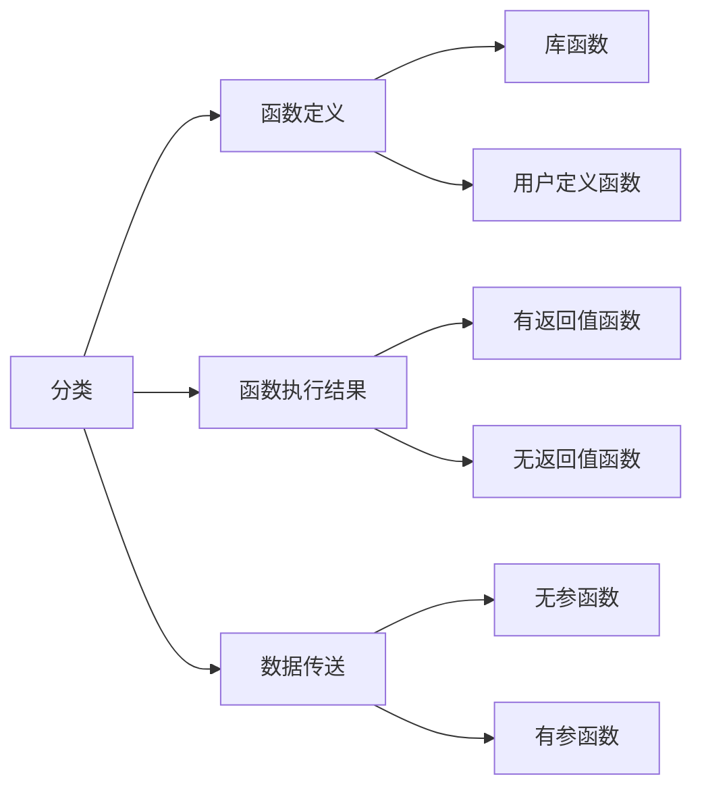

### 6.1.1 库函数与用户定义函数

#### a. 库函数

由C语言系统提供，用户无需定义，也不必在程序中做类型说明，引入头文件后即可在程序中直接调用

#### b. 用户定义的函数

> 由用户按需编写的函数。对于用户自定义的函数，不仅要在程序中定义函数本身，而且在主调函数中必须对该被调函数进行声明，才能调用


### 6.1.2 有返回值与无返回值函数

#### a. 有返回值函数

必须指定返回值类型和使用return关键字返回对应数据

```c
返回值类型 函数名(参数列表){
    函数体;
    返回值;
}
```

#### b. 无返回值函数
```c
void 函数名(参数列表) {
    函数体;
}
```

### 6.1.3 有参函数和无参函数

####  a. 无参函数

```c
返回值类型 函数名() {
    函数体;
    return 值;
}
```

#### b. 有参函数

```c
返回值类型 函数名(参数类型 形式参数1，参数类型 形式参数2，…) {
    函数体;
    return 0;
}
```

## 6.2 参数与返回值
### 6.2.1 形参与实参
> **形参** ：定义函数时，函数名后面的 `()` 称为形参

形参变量只有在函数被调用时分配内存。在函数调用结束，释放内存单元

> **实参** ：函数调用时，传入的值称为实参

实参可以是常量、变量、表达式、函数等

在进行函数调用时，都必须具有**确定的值**，以便把这些值传递给形参

#### a. 注意

**个数**：调用函数时，传递的实参个数和函数的形参个数必须保持一致

**类型**：形参与实参类型不一致，会自动转换为形参类型

```c
void change(double number1, double number2) {//  形参
}

int main() {
    change(10, 20);
    // 传入实参  10.000000, 20.000000
   // 自动将实参转换为double类型后保存
    
    return 0;
}
```

**值传递**：当使用基本数据类型（char、int、float）作为实参时，实参和形参之间只是值传递，修改形参的值并不影响实参

```c
void change(int number1, int number2) { //  形式参数
    number1 = 250; // 不会影响实参
    number2 = 222;
}

int main() {
    int a = 88;
    int b = 99;
    change(a, b);
    printf("a  = %d, b = %d", a, b); // 输出结果: 88, 99
    return 0;
}
```

### 6.2.2 返回值

如果没有写返回值类型，默认是 `int`

`return` 实际返回的值类型应与函数返回值类型一致，否则以返回值类型为准,自动进行类型转换

```c
int height() {
    return 3.14; 
}

int main() {
  double temp = height();
  printf("%lf", temp);// 输出结果: 3.000000
}
```
一个函数内部可以多次使用 `return` ，但 `return` 之后的代码不再执行

## 6.3 函数的声明

默认情况下，只有后面定义的函数才可以调用前面定义过的函数

> 函数声明：在函数调用之前告诉系统，函数名称、参数列表、返回值类型
>
> 函数实现：定义具体的业务逻辑是怎么运作的

函数声明格式：`返回值类型 函数名(参数列表);`

```c
// 函数声明
void getMax(int v1, int v2);
int main(int argc, const char * argv[]) {
    getMax(10, 20); // 调用函数
    return 0;
}
// 函数实现
void getMax(int v1, int v2) {
    int max = v1 > v2 ? v1 : v2;
    printf("max = %i\n", max);
}
```

- 函数的实现不能重复, 而函数的声明可以重复

- 函数声明可以写在函数外面，也可以写在函数里面,，只要在调用之前被声明即可

```c
int main(int argc, const char * argv[]) {
    void getMax(int v1, int v2); // 函数声明, 不会报错
    getMax(10, 20); // 调用函数
    return 0;
}
// 函数实现
void getMax(int v1, int v2) {
    int max = v1 > v2 ? v1 : v2;
    printf("max = %i\n", max);
}
```

如果被调函数的返回值是整型，可以不对被调函数做声明，可以直接调用

```c
int main(int argc, const char * argv[]) {
    int res = getMin(5, 3); // 不会报错
    printf("result = %d\n", res );
    return 0;
}

int getMin(int num1, int num2) {// 返回int, 不用声明
    return num1 < num2 ? num1 : num2;
}
```

## 6.4 输入输出
### 6.4.1 putchar()和getchar()

`putchar()`：向屏幕输出一个字符

```c
#include <stdio.h>
int main(){
    char ch = 'a';
    putchar(ch); // 输出a
}
```

---

`getchar()`：从键盘获取一个字符

```c
#include <stdio.h>
int main(){
    char ch;
    ch = getchar();// 获取一个字符
    printf("ch = %c\n", ch);
}
```

### 6.4.2 scanf函数

系统会先将用户输入放入输入缓冲区，从缓冲区中逐个取数据赋值给变量，如果输入缓冲区不为空，`scanf` 会一直从缓冲区中获取

```c
#include <stdio.h>

int main(){
    int num1;
    int num2;
    char ch1;
    scanf("%d%c%d", &num1, &ch1, &num2);
    printf("num1 = %d, ch1 = %c, num2 = %d\n", num1, ch1, num2);
    
    char ch2;
    int num3;
    scanf("%c%d",&ch2, &num3);

    printf("ch2 = %c, num3 = %d\n", ch2, num3);
}
```


#### a. fflush

利用 `fflush(stdin);` 清空缓冲区

C和C++标准从未定义过，是C标准的扩充函数，**不是所有平台都支持**

#### b. setbuf

`setbuf(stdin,NULL)` 设置缓冲区为空

**所有平台有效**

### 6.4.3 printf()函数格式

#### a. 数据类型符

| 类型    | 含义                           |
| ------- | ------------------------------ |
| %d / %i | 有符号十进制整型               |
| %u      | **无符号**十进制整型           |
| %o      | **无符号**八进制整型           |
| %x / %X | **无符号**十六进制整型         |
| %f      | 单、双精度浮点数               |
| %e / %E | 以指数形式输出单、双精度浮点数 |
| %c      | 字符                           |
| %s      | 字符串                         |
| %p      | 地址                           |
| %%      | 表示%本身                      |

```c
#include <stdio.h>

int main(){
    int a = 10;    
    int b = -10;
    
    // 有符号整数(可以输出负数)
    printf("a = %d\n", a); // 10
    printf("a = %i\n", a); // 10

    // 无符号整数(不可以输出负数)
    // 输出存储单元内二进制数对应的十进制整数
    printf("a = %u\n", a); // 10
    printf("b = %u\n", b); // 429496786

    // 无符号八进制整数(不可以输出负数)
    //输出存储单元内二进制数对应的十进制整数对应的八进制数
    printf("a = %o\n", a); // 12
    printf("b = %o\n", b); // 37777777766

    // 无符号十六进制整数(不可以输出负数)
    printf("a = %x\n", a); // a
    printf("b = %x\n", b); // fffffff6

    // 无符号十六进制整数(不可以输出负数)
    printf("a = %X\n", a); // A
    printf("b = %X\n", b); // FFFFFFF6

    float c = 6.6f;
    double d = 3.1415926;
    
    // 单、双精度浮点数(默认保留6位小数)
    printf("c = %f\n", c); // 6.600000
    printf("d = %lf\n", d); // 3.141593

    double e = 10.10;
    // 以指数形式输出单、双精度浮点数
    printf("e = %e\n", e); // 1.010000e+001
    printf("e = %E\n", e); // 1.010000E+001
    
    // 以最短输出宽度,输出单、双精度浮点数
    printf("e = %g\n", e); // 10.1
    printf("e = %G\n", e); // 10.1
    
    char f = 'a';
    // 输出字符
    printf("f = %c\n", f); // a
}
```

##### 实型有效位问题

- 单精度 `%f` 输出时，仅前6-7位是有效数字；双精度 `%lf` 输出时，仅前15-16位是有效数字
- 有效位数包含小数点前的非零数位

**精度与有效位**

> 有效位：指从第一个非零数字开始，误差不超过本数位半个单位的、正确的数位

原因：计算机存储浮点数时，采用IEEE754，存的是IEEE754可表示的最相近浮点数

```c
#include <stdio.h>
int main(){
    //        1234.567871093750000
    float a = 1234.567890123456789;
    //         1234.567890123456900
    double b = 1234.567890123456789;
    printf("a = %.15f\n", a); // 前8位数字是准确的, 后面的都不准确
    printf("b = %.15f\n", b); // 前16位数字是准确的, 后面的都不准确
}
```

#### b. 精度格式符

> 精度：小数点后位数

`%.n数据类型符` ，n为十进制整数

-   如果输出数字，则表示小数的位数；
-   如果输出的是字符，则表示输出字符的个数；
-   若实际位数大于所定义的精度数，则截去超过的部分

```c
#include <stdio.h>
int main(){
    double a = 3.1415926;
    printf("a = %.2f\n", a); // 3.14
}
```

##### 动态指定保留小数位数

格式：`printf("%.*f",[],a);`

```c
#include <stdio.h>
int main(){
    double a = 3.1415926;
    printf("a = %.*f", 2, a); // 3.14
}
```

#### c. 格式控制符

| 符号  | 含义                                                         |
| ----- | ------------------------------------------------------------ |
| %m... | m指定输出字段的宽度，如果位数小于m，则左端以空格补全；若位数大于，则按实际位数输出 |
| -     | 结果左对齐，右边补空格                                       |
| #     | 对于c,s,d,u类影响<br />八进制，加前缀o<br />十六进制，加前缀0x<br />对于浮点数，只有当结果有小数才给出小数点 |
| 空格  | 输出值为整数，在输出值前面加上空格，为负数加上负号           |
| +     | 当输出值为正数时,在输出值前面加上一个+号, 默认不显示         |
| 0     | 右对齐时，用0填充                                            |

```c
#include <stdio.h>
int main(){
    int a = 1;
    int b = -1;
    // -号标志
    printf("a =|%d|\n", a); // |1|
    printf("a =|%5d|\n", a); // |    1|
    printf("a =|%-5d|\n", a);// |1    |
    // +号标志
    printf("a =|%d|\n", a); // |1|
    printf("a =|%+d|\n", a);// |+1|
    printf("b =|%d|\n", b); // |-1|
    printf("b =|%+d|\n", b);// |-1|
    // 0标志
    printf("a =|%5d|\n", a); // |    1|
    printf("a =|%05d|\n", a); // |00001|
    // 空格标志
    printf("a =|% d|\n", a); // | 1|
    printf("b =|% d|\n", b); // |-1|
    // #号
    int c = 10;
    printf("c = %o\n", c); // 12
    printf("c = %#o\n", c); // 012
    printf("c = %x\n", c); // a
    printf("c = %#x\n", c); // 0xa
}
```

## 6.7 递归函数

> 一个函数在它的函数体内调用它自身称为递归调用
>
> - 递归常用于"回溯", "树的遍历","图的搜索"等问题

```c
void function(int x){
    function(x);
}
```

- 存在一个条件能够让递归结束

- 问题的规模能够缩小

- 能用循环实现的功能,用递归都可以实现

 但 **代码理解难度大**，**内存消耗大(易导致栈溢出)**, 所以考虑到代码理解难度和内存消耗问题, 在企业开发中一般能用循环都不会使用递归

# 7. C程序编译过程


1. 编写代码，保存后生成 `hello.c` 源文件

   ```c
   # include<stdio.h>
   
   int main(int argc, char const *argv[]){
       printf("Hello World!");
       
       return 0;
   }
   ```

   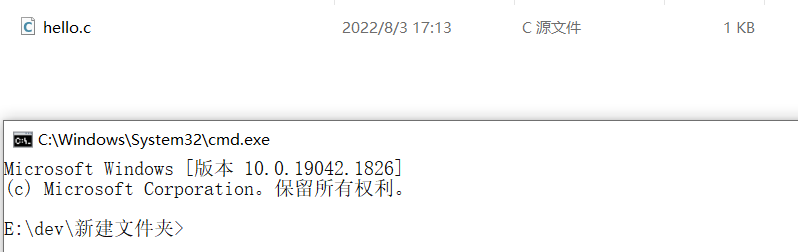

2. 对源文件 `hello.c` 进行预处理，生成预处理文件 `hello.i`

   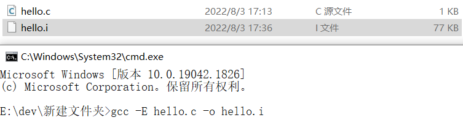

3. 对预处理文件 `hello.i` 进行编译，生成汇编文件 `hello.s`

   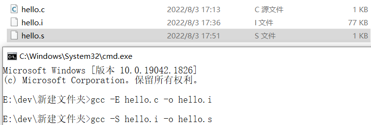

4. 对汇编文件 `hello.s` 进行汇编，生成二进制文件 `hello.o` 

   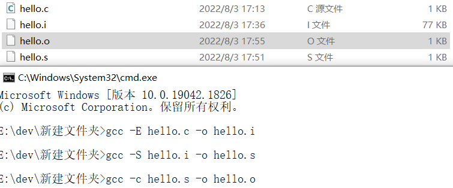

5. 对二进制文件 `hello.o` 进行链接，生成可执行文件 `hello.exe` 

   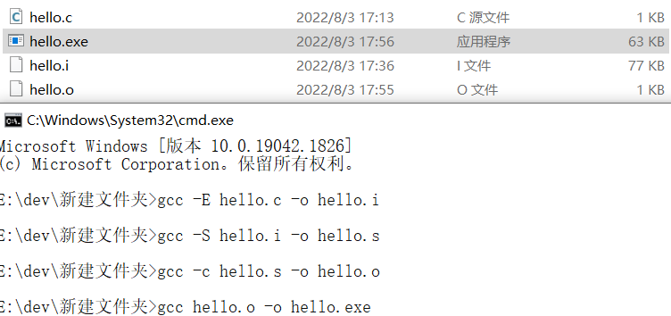

6. 运行可执行文件 `hello.exe` 

   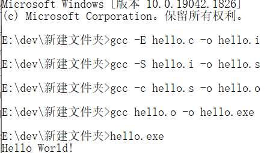

## 7.1 预处理

C编译器在对源程序进行编译前，会将一些特殊指令作解释（如 `#include`），进而产生一个新的源程序，之后再进行通常的编译

- 所有的预处理指令都以 `#` 开始，并且结尾不用分号
- 预处理指令可以出现在程序的任何位置，它的作用范围从它出现的位置到文件尾，所以尽可能将预处理指令写在源程序开头

- 包括：文件包含、宏定义、条件编译

### 7.1.1 文件包含处理

使用 `<>` ，仅在系统指定的磁盘路径下搜索所包含的文件

使用 `""` ，现在当前工作目录中搜索，若找不到则在系统中寻找

### 7.1.2 宏定义

> **宏** ：用来替换重复出现的字符串

宏名：代替该字符串的标识符

宏代换（宏展开）：在编译预处理阶段，对程序中出现的所有 `宏名` 用相应的字符串进行代换，宏代换由预处理程序自动完成

#### a. 不带参数的宏定义

`# define 标识符 字符串`

字符串可以是常数，表达式，格式串等

```c
#include <stdio.h>
#define PI 3.14

int main (){
    float S = PI * r * r;

    printf("%f", S);
    return 0;
}
```

约定：宏名一般用大写字母作为标识符，以便与变量名区别开，但用小写也没有语法错误

---

若字符串中出现了某个宏，不进行替换

```c
#define PI 3.14

char *str = "PIE";//此时不会发生宏代换
```

宏代换只是简单的 **字符串替换** ，不做语法检查。只有编译时才对源程序进行语法检查

---

宏定义的有效范围是从定义位置开始到文件结束。如果需要终止宏定义的作用域，可以用 `#undef` 

```c
#include <stdio.h>
#define PI 3.14

int main (){
    #undef PI
    float S = PI * r * r; //报错

    printf("%f", S);
    return 0;
}
```

---

宏定义之间可以相互引用

```c
#define R  3.0
#define PI 3.14
#define C  2*PI*R
#define S  PI*R*R
```

---

可以用宏定义表示数据类型

```c
# define String char*

int main(){
    String str = "The String";	
    
    return 0;
}
```

#### b. 带参数的宏定义

> 带参数的宏，在调用中，不仅要宏展开，而且要用实参数代替形参

`#define 宏名(形参列表) 字符串`

```c
# define SUM(a,b) (a+b)

int main(){
    int sum = SUM(1,2);
    
    printf("%d\n",sum);
    return 0;
}
```

- 宏标识符与形参列表之间不能有空格，否则会当被当做普通字符串

  ```c
  # define SUM (a,b) (a+b)
  
  int main(){
      int sum = SUM(1,2);//会被替换成 (a,b) (a+b)(1,2)
      //编译不通过
      
      printf("%d\n",sum);
      return 0;
  }
  ```

- 带参数的宏在宏代换时，只作简单的字符和参数的替换，不进行计算操作

- 宏定义时，要用 `()` 将形参字符串括住

  ```c
  # define Twice(a) 2*a
  
  int main(){
      int res = D(3+4);// 替换结果为：2*3+4
      
      printf("%d\n",sum);
      return 0;
  }
  ```

  ```c
  # define Twice(a) 2*(a)
  
  int main(){
      int res = D(3+4);// 替换结果为：2*(3+4)
      
      printf("%d\n",sum);
      return 0;
  }
  ```

- 宏定义时，要将计算结果也用 `()` 括住

  ```c
  #  define Pow(a) (a)*(a)
  
  int main(){
      int res = Pow(10)/Pow(2);
      //宏代换后：10*10/2*2=100
      
      return 0;
  }
  ```

  ```c
  #  define Pow(a) ((a)*(a))
  
  int main(){
      int res = Pow(10)/Pow(2);
      //宏代换后：(10*10)/(2*2)=25
      
      return 0;
  }
  ```

### 7.1.3 条件编译

> 程序中一部分代码在满足一定条件才进行编译，否则不参与编译

优点：按不同的条件去编译不同的程序部分，因而产生不同的目标代码文件，有利于程序的移植和调试。生成的目标程序较短

```c
#if 条件1
	...
#elseif 条件2
    ...
#else
    ...
#endif
```

```c
#define SCORE 67
#if SCORE > 90
    printf("优秀\n");
	code 优秀
#elif SCORE > 60
    printf("良好\n");
	code 良好
#else
    printf("不及格\n");
	code 不及格
#endif
```

## 7.2 别名`typedef` 

`typedef 原类型名 新类型名;`

- 原类型名中含有定义部分，新类型名一般用大写表示

- `typedef` 在编译时完成替换

### 7.2.1 `typedef` 的使用

#### a. 基本数据类型

```c
typedef int Integer;
typedef Integer MyInteger;
int main(){
    Integer a;//等价于int a
}
```

#### b. 数组

```c
typedef int NAME[20];
NAME a;//等价于 int a[20];
```

#### c. 结构体类型

```c
 struct Person{
    int age;
    char *name;
};

typedef struct Person Person;
```

```c
typedef struct Person{
    int age;
    char *name;
} Person;
```

```c
typedef struct {
    int age;
    char *name;
} Person;
```

#### d. 枚举类型

```c
enum Session{
    Spring,
    Summer,
    Autumn,
    Winter
};
typedef enum Session Session;
```

```c
typedef enum Session {
    Spring,
    Summer,
    Autumn,
    Winter
}Session;
```

```c
typedef enum {
    Spring,
    Summer,
    Autumn,
    Winter
}Session;
```

#### e. 指针

指向结构体的指针

```c
typedef struct {
    float x;
    float y;
}Point;

typedef Point *PP;
```

指向函数的指针

```c
int sum(int a, int b) {
    int c = a + b;
    printf("%d + %d = %d", a, b, c);
    
    return c;
}
typedef int (*Fn)(int, int);

// 定义一个指向sum函数的指针变量p
Fn p = sum;
```

## 7.3 宏定义与函数、typedef区别

### 7.3.1 宏定义与函数的区别

> 带参数宏定义与函数形式类似

- 匹配问题：宏定义不涉及存储空间的分配、参数类型匹配、参数传递、返回值
- 执行阶段：函数调用在程序运行时执行，而宏代换只在编译预处理阶段进行

- 执行效率：带参数的宏比函数具有更高的执行效率

### 7.3.2 宏定义与`typedef` 区别

> 宏定义与`typedef` 都可对数据类型进行说明

- 宏定义只是简单的字符串替换，在预处理阶段完成
- `typedef` 在编译时处理，是对类型说明符的重新命名

```c
typedef char *String;//给char *起了别名String

int main(){
    String str = "This is a String";
    return 0;
}

#define String char * //用String对char *进行宏代换

int main(){
    String str = "This is a String";
    
    return 0;
}
```

# 8. 文件

> 文件流：C语言将文件看做一个字符序列，即文件是由若干字符组成的字符流

## 8.1 文件分类

### 8.1.1 文本文件

文件内容以ASCII码格式存放，**一个字节存放一个ASCII码，代表一个字符** ，但占用存储空间较多

`.c` 文件就是以文本文件形式存放的

### 8.1.2 二进制文件

文件内容以补码格式存放，占用存储空间少。

数据按其内存中的存储形式原样存放

`.exe` 文件就是以二进制文件形式存放

### 8.1.3 示例

```c
#include <stdio.h>

int main(){
    /*
     * 以文本形式存储
     * 会将每个字符先转换为对应的ASCII,
     * 然后再将ASCII码的二进制存储到计算机中
     */
    int num = 666;
    FILE *fa = fopen("ascii.txt", "w");
    fprintf(fa, "%d", num);
    fclose(fa);

    /*
     * 以二进制形式存储
     * 会将666的二进制直接存储到文件中
     */
    FILE *fb = fopen("bin.txt", "w");
    fwrite(&num, 4, 1, fb);
    fclose(fb);

    return 0;
}
```

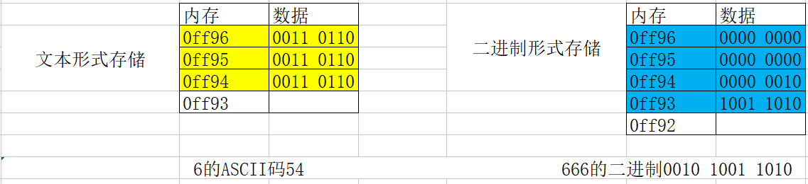

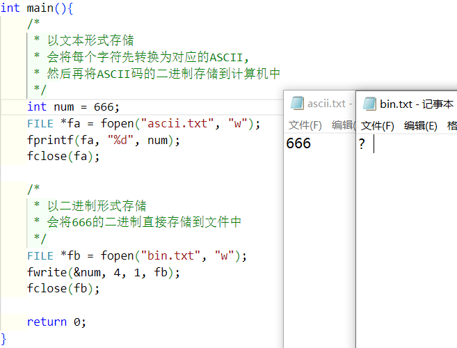

- 记事本默认按照ASCII码逐个解码文件，由于文本文件存储的是ASCII码，所以可以正常解析
- 记事本按照ASCII码解码文件，所以解析出来是乱码

## 8.2 文件的操作

### `FILE` 结构体

>   C语言中存放文件属性的结构体（缓冲区和文件读写状态），所有的文件操作都是通过 `FILE` 结构体完成的，只能通过指针访问属性

```c
struct _iobuf {
    char *_ptr;  //文件输入的下一个位置
    int _cnt;  //当前缓冲区的相对位置
    char *_base; //文件的起始位置)
    int _flag; //文件标志
    int _file;  //文件的有效性验证
    int _charbuf; //检查缓冲区状况,如果无缓冲区则不读取
    int _bufsiz; // 缓冲区大小
    char *_tmpfname; //临时文件名
};
typedef struct _iobuf FILE;
```

### 8.2.1 打开文件

>   建立程序和文件之间的通信通道，并为文件系统建立缓冲

所在文件：`stdio.h` 

#### a. 参数及返回值

```c
FILE *fopen(const char *filename,const char *mode);
//以mode的方式，打开filename命名的文件，返回一个指向该文件缓冲的FILE结构体指针
FILE *fp = fopen("路径","w");
```

| 参数/返回值      | 含义                                   |
| ---------------- | -------------------------------------- |
| `char *filename` | 要打开或者创建文件的路径               |
| `mode`           | 打开文件的方式                         |
| `FILE`           | 返回指向文件缓冲区的指针，用于操作文件 |

#### b. 文件读写方式

| mode | 文件类型   | 操作      | 文件不存在 | 文件存在     |
| ---- | ---------- | --------- | ---------- | ------------ |
| r    | 文本文件   | 读取      | 出错       | 打开文件     |
| w    | 文本文件   | 写入      | 创建新文件 | 覆盖原文件   |
| a    | 文本文件   | 追加      | 创建新文件 | 原文件后追加 |
| r+   | 文本文件   | 读取/写入 | 出错       | 打开文件     |
| w+   | 文本文件   | 读取/写入 | 创建新文件 | 覆盖原文件   |
| a+   | 文本文件   | 读取/追加 | 创建新文件 | 原文件后追加 |
| rb   | 二进制文件 | 读取      | 出错       | 打开文件     |
| wb   | 二进制文件 | 写入      | 创建新文件 | 覆盖原文件   |
| ab   | 二进制文件 | 追加      | 创建新文件 | 原文件后追加 |
| rb+  | 二进制文件 | 读取/写入 | 出错       | 打开文件     |
| wb+  | 二进制文件 | 读取/写入 | 创建新文件 | 覆盖原文件   |
| ab+  | 二进制文件 | 读取/追加 | 创建新文件 | 原文件后追加 |

### 8.2.2 关闭文件

所在文件：`stdio.h`

函数功能：`fclose()` 用来关闭之前 `fopen()` 打开的文件

函数操作：让缓冲区内的数据写入文件，并释放系统提供的文件资源

#### a. 参数和返回值

```c
int fclose(FILE *filePointer)
```

| 参数/返回值      | 含义                           |
| ---------------- | ------------------------------ |
| FILE *filePointe | 指向文件缓冲的指针             |
| int              | 成功则返回0，失败则返回EOF(-1) |

```c
int main(){
	FILE *fp;
	if(fopen("abc.txt","w")==NULL){
        exit(-1);//非0表示异常
    }
    fclose(fp);
}
```

### 8.2.3 读写文件

> 需要引入 `位置指针` ：打开文件，默认指向文件开头
>
> - 所有文件读/写，都是从 `位置指针` 指示的位置进行读/写

分为

-   顺序读写
-   随机读写

#### a. 文本文件读写

##### 文件尾测试函数

> 文件使用特殊字符 `EOF` 作为文件结束标记

`int feof(FILE *stream);` ：判断是否读到文件结尾

- 0表示未读到文件尾
- 非0表示读到文件尾，此时不能读取文件

所在文件：`stdio.h`

参数：`FILE *stream` 是指向文件缓冲的指针

注意：文件只有读了才会修改 `位置指针` ，没有打开并读取的文件无法通过 `feof(fp)` 判断是否读到文件尾，一定要 **先读在判断**

```c
# include<stdio.h>

int main(){
    //打开文件
    FILE *fp = fopen("test.txt","r+");
    
    //从文件中读取内容
    char res = EOF;
    while(res = fgetc(fp) && !feof(fp)){
        printf("%c",res);
    }
    //关闭文件  
    fclose(fp);
    
    return 0;
}
```

在使用 `feof()` 判断文件尾时，最后一行没有 `\n` 会少读一行

```c
#include <stdio.h>

int main(){
    FILE *fp = fopen("test.txt", "w+");

    fputs("asd\n", fp);
    fputs("123456", fp);
    rewind(fp);

    char str[1024];
    while(fgets(str, 1024, fp) && !feof(fp)){
        printf("str = %s", str); 
        //输出 str = asd
        //若最后一行加上 \n,则输出 
        //str = asd
        //str = 123456
    }
    
    fclose(fp);

    return 0;
}
```

##### 读/写一个字符

| 读入一个字符 | 输出一个字符   | 所在文件  |
| ------------ | -------------- | --------- |
| `getchar()`  | `putchar()`    | `stdio.h` |
| `fgetc(fp)`  | `fputc(ch,fp)` | `stdio.h` |

---

`int fgetc(FILE *fp)`：从文件中读取一个字符，若到文件尾返回`EOF`

- 正常情况返回一个int类型值
- 读到文件尾或出错，返回 `EOF`

```c
#include <stdio.h>

int main(){
    //打开文件
    FILE *fp = fopen("test.txt", "r+");

    //从文件中读取内容
    char res = EOF;
    while((res = fgetc(fp)) != EOF){
        printf("res = %c\n", res);
    }

    //关闭打开的文件
    fclose(fp);
    
    return 0;
}
```

---

`int fputc(int ch,FILE *fp)`：将ch字符写入文件

- 写入成功，返回写入的字符
- 写入失败，返回 `EOF`

```c
# include<stdio.h>

int main(){
   	//打开一个文件
    FILE *fp = fopen("test.txt","w+");
    
    //向文件中写入内容
    for(char ch = 'a';ch <= 'z';++ch){
       	char res = fputc(ch,fp);
        printf("%c",res);
    }
    
    //关闭打开的文件
    fclose(fp);
    
    return 0;
}
```

##### 读/写一行字符串

| 读入字符串  | 输出字符串    | 所在文件  |
| ----------- | ------------- | --------- |
| `getchar()` | `putchar()`   | `stdio.h` |
| `fgets(fp)` | `fputs(s,fp)` | `stdio.h` |

---

`char *fgets(char *s,int n,FILE *fp)` :从 `fp` 指向的文件中**读取** `n-1` 个字符，写入s中；如果中间遇到 `\0` 或者 `EOF` ，读入结束，且在字符串最后添加 `\0` 

- 正常，返回 `char *str` 指针
- 遇到 `\n` 或 `EOF`则停止读取
- 出错，返回空指针 `NULL` 

```c
#include <stdio.h>

int main(){
    
    FILE *fp = fopen("test.txt", "w+");

    fputs("asd\n", fp);
    fputs("123456\n", fp);
    rewind(fp);

    char str[1024];
    fgets(str, 1024, fp);//读到 \n 读取一行结束
    printf("str = %s", str); // asd

    fclose(fp);

    return 0;
}
```

```c
#include <stdio.h>

int main(){
    FILE *fp = fopen("test.txt", "w+");
    
    fputs("asd\n", fp);
    fputs("123456", fp);
    rewind(fp);
    
    char str[1024];
    
    while(fgets(str, 1024, fp)){//读到文件尾，停止读
        printf("str = %s", str);//asd123456
    }
    fclose(fp);
    return 0;
}
```

---

`int fputs(char *s,FILE *fp)` ：将 `s` 中的字符串写到 `fp` 指向的文件中

- 正常则返回0
- 出错则返回 `EOF`

```c
# include<stdio.h>

int main(){
    FILE *fp = fopen("test.txt","w+");
    
    fputs("Hello ",fp);
    fputs("World!",fp);
    
    fclose(fp);
    
    return 0;
}
```

遇到 `\0` 自动终止写入

```c
# include<stdio.h>

int main(){
    FILE *fp = fopen("test.txt","w+");
    fputs("asd\0asdasd\n",fp);
    
    fclose(fp);
    
    return 0;
}
```

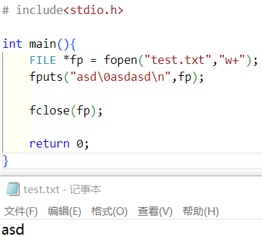

##### 格式读/写

`int fscanf(FILE *fp,char *format)`

>   读/写成功返回整数

`int fprintf(FILE *fp,char *fprmat)`

#### b. 二进制文件读/写

> 二进制文件的读写函数可以读取文本文件
>
> 文本文件的读写函数不可读取二进制文件

`unsigned fread(void *ptr,unsigned size,unsigned n,FILE *fp)`

>   从文件 `fp` 中读取 `n` 个 `size` 字节的数据块，存储于 `ptr` 指向的内存空间

- 成功，则返回 `n` 
- 出错或文件结束，则返回0

```c
#include <stdio.h>

int main(){
    // test.txt中存放的是"Hello\0 World!"
    FILE *fr = fopen("test.txt", "rb+");
    char buf[1024] = {0};
    
    int n = fread(buf, 1, 1024, fr);
    printf("%d\n", n);
    for(int i = 0; i < n; i++){
        printf("%c", buf[i]);
    }
    
    fclose(fr);
    
    return 0;
}
```

注意：读取时，`size` 取最小字节，`n` 可以随便写

- 若读取时 `size` 不是最小字节，则会引起读取失败

  如存储的 `char` 类型 0A 1E 1C 2C 66 67 68

  `size = 1` 时，`n=1024` ，会将文件中内容依次取出

  `size = 4` 时，`n=1024` ，第一个数据块 0A 1E 1C 2C 会顺利取出，但最后剩下3个字节不足一个数据块，则最后一个块读取不到

---

`unsigned fwrite(void *ptr,unsigned size,unsigned n,FILE *fp)`

>   将 `ptr` 指向的存储空间的 `n` 个 `size` 字节的数据块写入文件 `fp` 中

- 成功，则返回 `n`
- 出错或文件结束，则返回0

```c
# include<stdio.h>

int main(){
    FILE *fp = fopen("test.txt","wb+");
    char *str = "Hello\0 World!";
    
    fwrite((void *)str, 13 ,1, fp);
    
    fclose(fp);
    
    return 0;
}
```

##### 读写数组

```c
# include<stdio.h>

int main(){
    FILE *fp = fopen("test.txt","wb+");
   	int ages[4] = {1,3,5,7};
    fwrite(ages,sizeof(ages),1,fp);
    
    rewind(fp);
    
    int t;
    while(fread(&t,sizeof(int),1,fp) > 0){
        printf("data=%d\n",t);
    }
    fclose(fp);
    
    return 0;
}
```

##### 读写结构体

> 结构体中的数据类型不统一，此时最适合用二进制的方式进行读写

单个结构体

```c
# include<stdio.h>

typedef struct{
	char *name;
    int age;
    double height;
}Person;

int main(){
    Person p1 = {"A",23,1.7};
    FILE *fp = fopen("test.person","wb+");
    fwrite(&p1,sizeof(p1),1,fp);
    
    rewind(fp);
    Person p2;
    fread(&p2,sizeof(p2),1,fp);
    
    fclose(fp);
    
    return 0;
}
```

---

读写结构体数组

```c
# include<stdio.h>

typedef struct{
	char *name;
    int age;
    double height;
}Person;

int main(){
    Person ps[] = {
        {"A", 18, 1.65},
      	{"B", 21, 1.88},
      	{"C", 33, 1.9}
    };
    
    FILE *fp = fopen("test.person","wb+");
    fwrite(&ps,sizeof(ps),1,fp);
    
    rewind(fp);
    Person p;
    while(fread(&p,sizeof(p),1,fp) > 0){
        printf("name = %s,age = %d,height = %lf\n"
               ,p.name,p.age,p.height);
    }
    
    fclose(fp);
    
    return 0;
}
```

### 8.2.4 文件操作函数

#### a. 获取文件位置指针

`long ftell(FILE *fp)` ：返回距文件头的字节数

- 成功，则返回整型
- 失败，返回-1

```c
#include <stdio.h>

int main(){
    char *str = "abcedfg";
    FILE *fp = fopen("test.txt", "w+");

    long p = ftell(fp);
    printf("p = %ld\n", cp); // 0
    
    // 写入一个字节
    fputc(str[0], fp);
    p = ftell(fp);
    printf("p = %ld\n", p); // 1
    
    fclose(fp);
    
    return 0;
}
```

#### b. 位置指针重定位

`void rewind()` ：使位置指针指向文件头

#### c. 文件定位函数

`int fseek(FILE *fp, long offset, int origin );` ： 将位置指针移动到指定位置

-   `fp` ：文件的指针，指向要操作的文件

-   `offset` ：表示要移动的字节数

    offset 为正时，向后移动；

    offset 为负时，向前移动

- `origin`：从何处开始计算偏移量。

  | 起始点   | 常量名   | 常量值 |
  | -------- | -------- | ------ |
  | 文件开头 | SEEK_SET | 0      |
  | 当前位置 | SEEK_CUR | 1      |
  | 文件末尾 | SEEK_END | 2      |

```c
#include <stdio.h>

int main(){
    FILE *fp = fopen("test.txt", "w+");
    fputs("123456789", fp);
    
    // 将文件指针移动到文件结尾
    fseek(fp, 0, SEEK_END);
    int len = ftell(fp); // 计算文件长度
    printf("len = %i\n", len);
    
    fclose(fp);
    
    return 0;
}
```

```c
#include <stdio.h>

int main(){
    FILE *fp = fopen("test.txt","w+");
    
    fputs("123456789", fp);
    fseek( fp, 7, SEEK_SET );
    fputs("Hello", fp);
    
    fclose(fp);
    
    return 0;
}
```

# 9. 内存管理

## 9.1 进程空间

程序（静态）：经编译后的可执行文件可以被多次执行

进程（动态）：程序在内存中的运行状态为进程

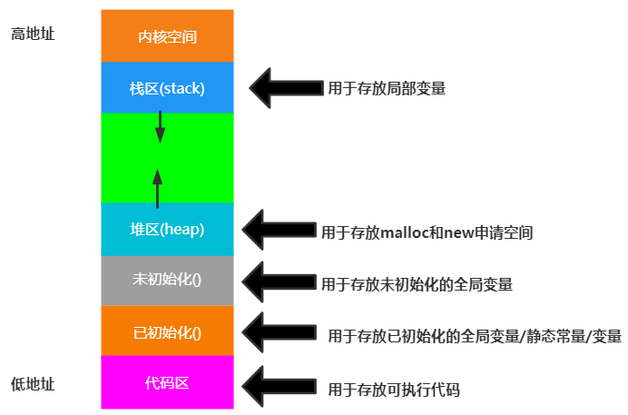

### 9.1.1 栈内存(stack)

栈中存放任意类型变量，但必须是 `auto` 类型修饰符的局部变量

随用随开，用完即销

内存的分配和销毁由系统自动完成，不需要人工干预

- 栈内存的分配：从高地址到低地址，为变量分配的内容由 `数据类型` 和 `空间首地址` 标记

栈有最大存储空间限制，超出则引起栈溢出

- 如局部变量过多，过大或递归层数太多

```c
#include <stdio.h>

int main(){
    int a = 1;
    int b = 2;
    
    printf("&a = %p\n", &a); // &a = 0ABC0FFC
    printf("&b = %p\n", &b); // &b = 0ABC0FF8

    return 0;
}
```

### 9.1.2 堆内存(heap)

堆内存可以存放任意类型的数据，但需要自己申请与释放

```c
int *p = (int *)malloc(sizeof(int)*1024*1024);
//不一定会崩溃
```

连续两次申请的内存可能不连续，但一定是从小地址开始分配内存

```c
#include <stdio.h>
#include <stdlib.h>

int main(){
    int *p1 = (int *)malloc(4);
    *p1 = 1;
    int *p2 = (int *)malloc(4);
    *p2 = 2;
   
    printf("p1 = %p\n", p1); //p1 = 00000227639268C0
    printf("p2 = %p\n", p2); //p2 = 0000022763926900

    return 0;
}
```

## 9.2 变量内存分析

### 9.2.1 变量存储过程

一个变量所占用的存储空间，和 **定义变量时声明的类型** 以及 **编译环境** 有关

| 类型      | 32位编译器 | 64位编译器 |
| --------- | ---------- | ---------- |
| char      | 1          | 1          |
| int       | 4          | 4          |
| float     | 4          | 4          |
| double    | 8          | 8          |
| short     | 2          | 2          |
| long      | 4          | 8          |
| long long | 8          | 8          |
| void*     | 4          | 8          |

#### a. 变量存储的过程

- 根据定义变量时声明的 `变量类型` 和当前 `编译环境` 确定需要开辟多大存储空间
- 在内存中开辟一块存储空间，开辟时从内存地址大的开始开辟，将最小的地址返回给变量
- 将数据保存到已经开辟好的内存空间内

> **变量名：变量的首地址**，是变量所占存储空间字节地址(最小的那个地址 )
>
> 小端模式：数据的高字节高地址

### 9.2.2 内存读写操作

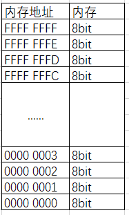

CPU在运行时要明确三件事：

- **存储单元的地址(地址信息)**

  通过地址总线找到存储单元的地址

- **对部件的操作（读或写，控制信息）**

  通过控制总线发出内存读写指令

- **数据（数据信息）**

  通过数据总线传输需要读写的数据

#### a. 写入过程

+ CPU 通过地址线将找到地址为 FFFFFFFC 的内存空间
+ CPU 通过控制线发出内存写入命令，选中存储器芯片，并通知它，要其写入数据
+ CPU 通过数据线将数据 12 送入内存 FFFFFFFC 单元中

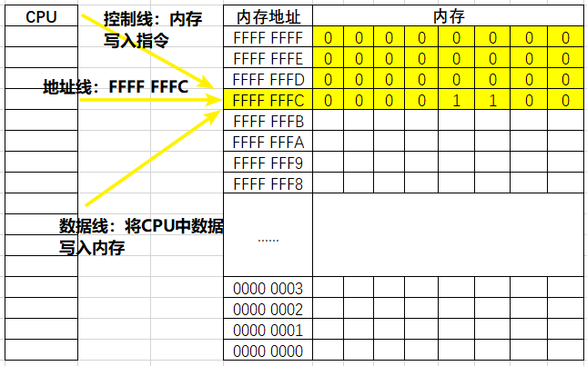

#### b. 读入过程

+ CPU 通过地址线将找到地址为 FFFF FFFC 的内存
+ CPU 通过控制线发出内存读取命令，选中存储器芯片，并通知它，将要从中读取数据
+ 存储器将 FFFFFFFC 号单元中的数据 12 通过数据线送入 CPU寄存器中

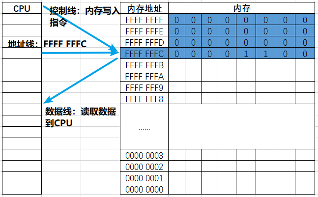

## 9.3 数据存储区

执行C语言程序，可用的存储区有

1.  程序区

2.  静态存储区：编译时分配内存；包括 `static,extern`

3.  动态存储区：运行时分配内存；包括 `static,auto`

### 9.3.1 `static`

静态局部变量

- 仅在本函数中使用，调用后不清零
- 只能赋一次初值，若不初始化 自动赋0或空字符
- 可使用静态局部变量跟踪调用次数

静态全局变量

-   仅限在定义的文件中使用，可使不同源文件中的静态全局变量独立

### 9.3.2 `extern`

在函数外部引用变量使用 `extern` ，扩充已定义的全局变量作用域

一个C语言程序包含多个源程序，若使用同一外部变量，在一个源文件中定义，在另一个中用 `extern` 说明是外部变量。引用外部函数时，被引用函数需添加 `extern`

## 9.4 动态分配内存

`stdlib.h` 

### 9.4.1 malloc

`void *malloc(size_t size);` ：在内存中申请一块连续的堆内存空间并返回，所申请的空间并未初始化

- size ：表示要申请的字符数

- 返回值：

  成功，返回非空指针，指向申请的空间

  失败，返回 `NULL`

初始化方法：`memset(指针, 初始值, 待初始化字节数)` 字节初始化

```c
#include <stdio.h>
#include <stdlib.h>

int main(){
    int *p = (int *)malloc(sizeof(int));
    printf("p = %d\n", *p); // 垃圾值
    
    memset(p, 0, sizeof(int)); // 初始化为0
    printf("p = %d\n", *p);
    
    return 0;
}
```

### 9.4.2 free

`void free(void *p);` ： 释放通过 `malloc()` 申请的堆内存空间，所以 `malloc()` 和 `free()` 总是成对出现

```c
#include <stdio.h>
#include <stdlib.h>

int main(){
    int *p = (int *)malloc(sizeof(int));
    printf("p = %d\n", *p); // 垃圾值
    
    memset(p, 0, sizeof(int)); // 初始化为0
    printf("p = %d\n", *p);
    
    free(p);
    
    return 0;
}
```

### 9.4.3 calloc

`void *calloc(size_t n,size_t size);` ：在堆内存中申请 `n` 块长度为 `size` 的空间，申请的空间自动初始化为0

- 成功，返回非空指针指向申请的空间
- 失败，返回 `NULL`

```c
#include <stdio.h>
#include <stdlib.h>

int main(){
    // 申请3块4个字节的存储空间
    int *p = calloc(3, sizeof(int));
   
    p[0] = 1;
    p[1] = 3;
    p[2] = 5;
    printf("p[0] = %d\n", p[0]);
    printf("p[1] = %d\n", p[1]);
    printf("p[2] = %d\n", p[2]);
    
    free(p);

    return 0;
}
```

### 9.4.4 realloc

`void *realloc(void *p,size_t size);` ：扩充或缩小原有内存的大小

- 参数

  `p` ：表示待扩容的空间指针

  `size` ：表示扩容后内存的大小

- 返回

  成功：返回非空指针指向申请的空间

  失败：返回 `NULL`

注意：

- 当 `p == NULL` 时，`realloc(NULL,sizeof(int))` 等同于 `malloc(sizeof(int))`

- 返回的指针，可能与 `p` 原本的值相同，也可能不同

  相同：则原空间后后续空间充足

  不同：原空间后续内存空间不足，重新申请新的连续空间后，将元数据拷贝到新空间，原有空间会被自动释放

 ```c
 #include <stdio.h>
 #include <stdlib.h>
 
 int main(){
     // 申请4个字节存储空间
     int *p = malloc(sizeof(int));
     printf("p = %p\n", p);
     
     //扩容
     p = realloc(p, sizeof(int) * 2);
     printf("p = %p\n", p);
     
     //使用申请好的空间
     *p = 666;
     printf("*p = %d\n",  *p);
     // 释放空间
     free(p);
 
     return 0;
 }
 ```

### 9.4.5 应用——动态链表

#### a. 链表与静态链表

> 链表：将零碎的内存空间组织为一组可用的内存空间

- 使用 `malloc` 申请内存空间时，若没有足够大的连续内存空间，则申请失败

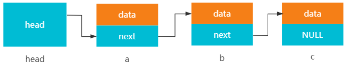

> 静态链表：链表的长度固定，链表的结点固定

```c
# include<stdio.h>
# include<stdlib.h>

//链表结点
typedef struct node{
    int data;
    struct node *next;
}Node;

int main(){
    Node a,b,c;
    
    Node *head = &a;
    a.data = 1;
    b.data = 2;
    c.data = 3;
    a.next = &b;
    b.next = &c;
    c.next = NULL;
    
    while(head != NULL){
        int cur = head->data;
        printf("%d\n",cur);
        head = head->next;
    }
    
    return 0;
}
```

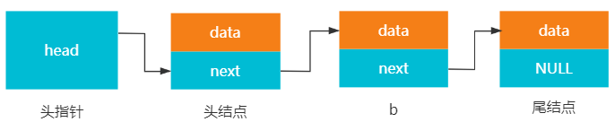

> 空链表

头指针带了一个空链表结点，空链表结点中的 `next` 指向 `NULL`

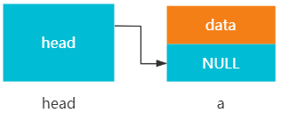

静态链表数据存储在栈上，而栈的存储空间有限。所以要实现链表存储空间的动态分配，需要申请堆里的存储空间

#### b. 动态链表的创建

##### 头插法

涉及数据结构的线性表，可自行查看：https://auspicetian.life/posts/3975030669/

```c
# include<stdio.h>
# include<stdlib.h>

//定义结点
typedef struct node {
    int data;
    struct node *next;
}Node;

//创建链表
Node *createList();
//按顺序打印链表中数据
void printNodeList();

int main(){
    Node *head = createList();
    printNodeList();
    
    return 0;
}

Node *createList(){
    //创建头结点
    Node *head = (Node *)malloc(sizeof(Node));
    if(head == NULL)
        return Null;
    head->next = NULL;
    
    //从键盘接收数据
    //-1表示输入结束
    printf("请逆序输入结点数据:\n");
    int data;
    scanf("%d",&data);
    
    while(data != -1){
        //创建新结点
        Node *cur = (Node *)malloc(sizeof(Node));
        cur->data = data;
        cur->next = head->next;
        head->next = cur;
        
        printf("请逆序输入结点数据:\n");
        scanf("%d",&data);
    }
    
    return head;
}

void printNodeList(Node *node){
    Node *head = node->next;
    
    while(head != NULL){
        int data = head->data;
        printf("%d\n",data);
        head = head->next;
    }
}
```

##### 尾插法

```c
# include<stdio.h>
# include<stdlib.h>

//定义结点
typedef struct node {
    int data;
    struct node *next;
}Node;

//创建链表
Node *createList();
//按顺序打印链表中数据
void printNodeList();

int main(){
    Node *head = createList();
    printNodeList();
    
    return 0;
}

Node *createList(){
    Node *head = (Node *)malloc(sizeof(Node));
    if(head == NULL)
        return NULL;
    head->next = NULL;
    
    //从键盘接收数据
    //-1表示输入结束
    printf("请顺序输入结点数据:\n");
    int data;
    scanf("%d",&data);
    
    Node *pre = head;
    while(data != -1){
        Node *cur = (Node *)malloc(sizeof(Node));
        cur->data = data;
        pre->next = cur;
        cur->next = NULL;
        
        pre = cur;
        scanf("%d",&data);
        
        return head;
    }
}

void printNodeList(Node *node){
    Node *head = node->next;
    
    while(head != NULL){
        int data = head->data;
        printf("%d\n",data);
        head = head->next;
    }
}
```

#### c. 插入

```c
void preInsertNode(Node *head,int data){
    Node *cur = (Node *)malloc(sizeof(Node));
    cur->data = data;
    
    cur->next = head->next;
    head->next = cur;
}

void tailInsertNode(Node *head,int data){
    Node *pre = head;
    
    while(pre != NULL && pre->next != NULL)
        pre = pre->next;
    
    Node *cur = (Node *)malloc(sizeof(Node));
    cur->data = data;
    cur->next = NULL;
    
    pre->next = cur;
}
```

#### d. 销毁

```c
void destoryList(Node *head){
    Node *cur = NULL;
    
    while(head != NULL){
        cur = head->next;
        free(head);
        
        head = cur;
    }
}
```


