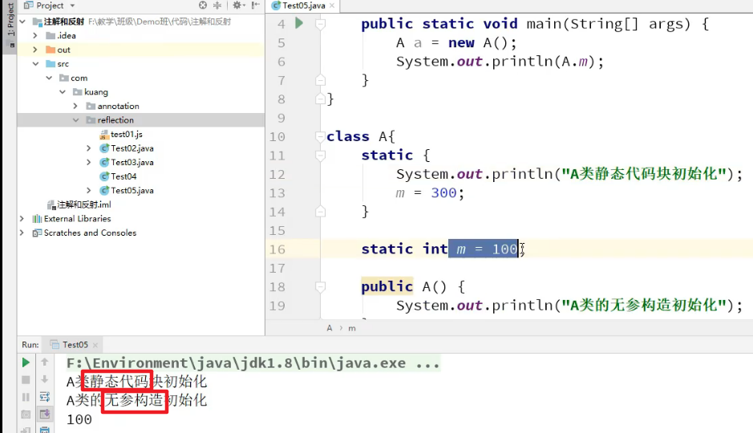
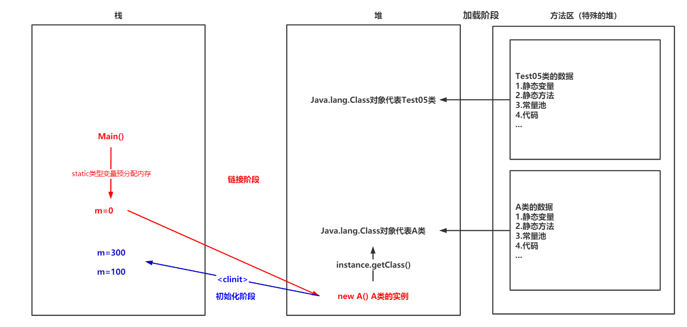
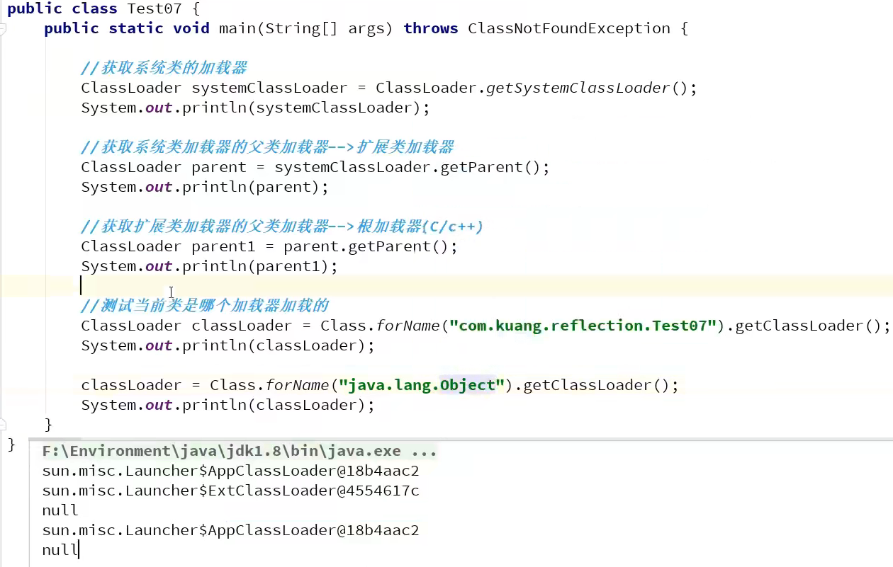
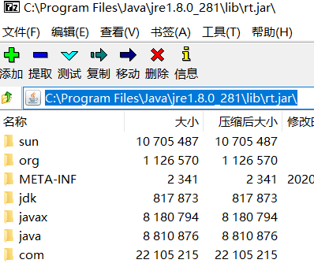
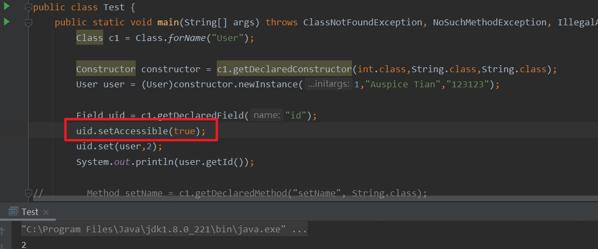
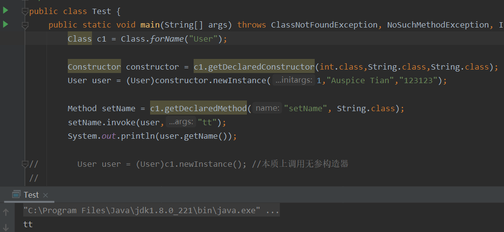
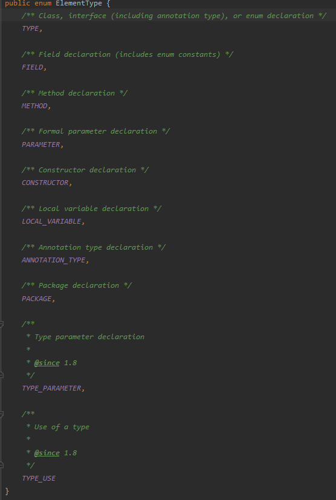
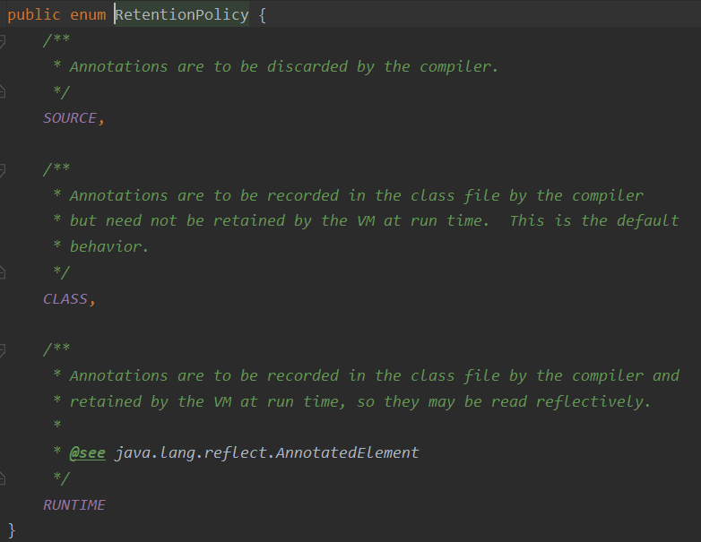
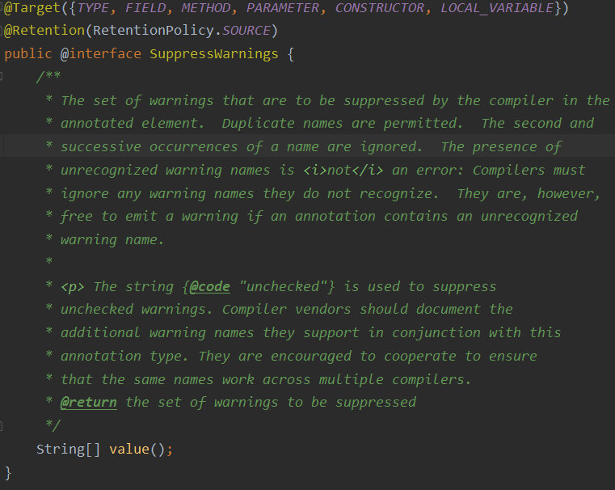
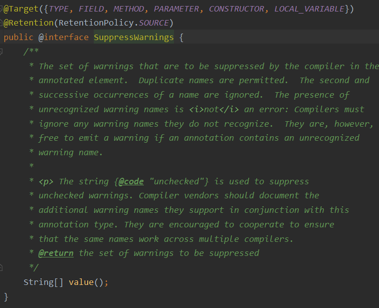

>   注解与反射机制是Spring框架的基石，所以理解反射机制很重要
>
>   学习视频：[【狂神说Java】注解和反射_哔哩哔哩_bilibili](https://www.bilibili.com/video/av55440782?from=search&seid=12737596072682491226&spm_id_from=333.337.0.0)

<!--more-->

# Java内存分析

```mermaid
graph LR

A[Java内存]-->B[栈]
B-->D["存放基本变量类型(包含这个类的具体数值)"]
B-->E["引用对象的变量(存放这个引用在堆里的物理地址)"]
A-->C[堆]
C-->存放new的对象和数组
C-->可以被所有的线程共享
A-->F["方法区(特殊的堆)"]
F-->可以被所有的线程共享
F-->G["存放了一些常量、静态变量、类的Class类型对象等"]
```

## 类的初始化过程


### Load阶段

1.  将.class文件字节码内容加载到内存中
2.  将类的静态变量、静态代码块转换成方法区的运行时数据结构
3.  生成java.lang.Class类型的对象



### Link阶段

**链接**：将Java类的二进制代码合并到JVM的运行状态的过程

1.  验证：确保加载的类信息符合JVM规范
2.  准备：正式为 `类变量(static)` 分配内存并设置类变量默认初始值，这些内存在方法区中进行分配
3.  解析：JVM常量池内的符号引用(常量名)替换为直接引用(地址)的过程



1.  加载到内存，产生类对应的java.lang.Class对象

2.  链接，链接结束后，m=0

3.  初始化

    ```java
    <clinit>(){
        System.out.print("A类的静态代码块初始化");
        m=300;
        m=100;
    }
    ```

### Initialize阶段

**初始化**

1.  JVM执行类构造器 `<clinit>()` 方法：
    +   类构造器 `<clinit>()` 由编译期自动收集类中(static)的 *所有类变量的赋值动作* 和 *静态代码块中的语句* 合并产生
2.  初始化一个类时，若其父类还未初始化，则先触发父类的初始化
3.  JVM保证一个类的 `<clinit>()` 方法在多线程环境中北正确加锁和同步

#### 什么时候发生类的初始化

**类的主动引用（一定会发生类的初始化）**

-   JVM启动，先初始化main方法所在的类，即 `main()` 所在的类一定会被初始化

-   new一个类的对象

-   调用类的静态成员和静态方法，除了 `final` 常量

-   使用 `java.lang.reflect` 包的方法对类进行反射调用

    ```java
    Class.forName("包名.类名")
    ```

-   初始化一个子类，其父类未被初始化，则先会初始化其父类

    ```java
    class Test{
    	static{
            System.out.println("Main类被加载");
        }
        
        public static main(String[] args){
            //1.主动调用
            //Son son = new Son();
            /*
                Main类被加载
                父类被加载
                子类被加载
            */
            
            //2.反射也会产生引用
            Class.forName("com.kuang.reflection.Son");
            /*
                Main类被加载
                父类被加载
                子类被加载
            */
        }
    }
    
    Class Father{
    	static int b = 2;
        static{
    		System.out.println("父类被加载");
            m = 300
        }
        
    }
    
    Class Son extends Father{
        static int m = 100;
        static final int M = 1;
        static{
            System.out.println("子类被加载");
        }
    }
    ```

**类的被动引用（不会发生类的初始化）**

-   当访问一个静态域，只有真正声明这个域的类才会被初始化（通过子类引用父类的静态变量，不会导致子类初始化，因为这些静态变量在Link阶段就已经存在常量池中）

    ```java
    //不会触发类的引用方法
    System.out.println(Son.b);
    /*
    	Main类被加载
    	父类被加载
    	2
    */
    ```

-   通过数组定义引用，不会触发此类的初始化

    ```java
    Son[] sons= new Son[5];//仅仅是声明了一块内存空间
    
    # 
        Main类被加载
    ```

-   引用常量不会触发此类的初始化（在链接阶段已被调入方法区的常量池）

    ```java
    System.out.println(Son.M);
    
    #
        Main类被加载
    ```

## 类加载器

### 作用

将.class文件字节码内容加载到缓存，并将这些静态数据转换成方法区的运行时数据结构，然后在堆中生成一个代表这个类的 `java.lang.Class` 对象作为方法区中类数据的访问入口


**类缓存**：JavaSE类加载器按要求查找类，一旦某个类被加载到类加载器中，将维持加载（缓存）一段时间；可用GC回收

### 分类




### 双亲委派机制


-   双亲委派机制：父加载器中已有的类，不可重写

    用户类加载器-->扩展类加载器-->根加载器

根加载器加载的包所在的路径



<div style="page-break-after:always" />

# 反射

## 概述

>   反射机制的作用

1.  允许程序在执行期间借助于反射 API获得任何类的内部信息；
2.  能直接操作任意对象的内部属性及方法(类名，属性，接口，方法)

>   由于反射机制，使Java由 *静态语言* 变为 *动态语言*

-   动态语言：运行时代码根据某些条件改变自身结构——解释型语言为主
    -   C#
    
    -   JavaScript
    
        ```js
        function f(){
            var x = "var a=3;var b=5;alert(a+b)";
            eval(x);//弹窗输出5，8，本来x是字符串，但是在运行过程中，执行这段字符串，这就是动态语言的特性
        }
        ```
    
    -   PHP
    
    -   Python
-   静态语言：运行时结构不可变——编译型语言为主
    -   Java（准动态语言）：通过反射机制获得类似动态语言的特性
    -   C
    -   C++

### 反射机制的流程

-   加载完类后，在 **堆内存的方法区** 中产生该类的java.lang.Class类型的对象
-   这个对象包含了类的完整结构和信息
    -   一个类被加载后，类的整个结构都会被封装在Class类的对象中
-   所以通过这个Class对象，可以得到这个类的结构信息，称为反射


### Java通过反射机制提供的功能

-   在运行时判断一个对象所属的类
-   在运行时构造任意一个类的对象
-   在运行时判断任意一个类具有的成员变量和方法
-   在运行时调用任意一个对象的成员变量和方法
-   在运行时处理注解
    -   生成动态代理

### 反射相关的API

-   java.lang.Class：类对象的类型
-   java.lang.reflect.Method：代表类的方法
-   java.lang.reflect.Field：代表类的成员变量
-   java.lang.reflect.Constructor：代表类的构造器

## Class类

### 有Class对象的数据类型

-   class:外部类，成员(成员内部类，静态内部类),局部内部类，匿名内部类
-   interface
-   []
-   enum
-   annotation
-   primitive type
-   void

```java
Class c1 = Object.class;//对象
Class c2 = Comparable.class;//接口
Class c3 = String[].class;//数组
Class c4 = int[][].class;
Class c5 = Override.class;//注解
Class c6 = ElementType.class;//枚举
Class c7 = Integer.class;
Class c8 = void.class;
Class c8 = Class.class;
```

JRE在一个类被加载后，为每个类保存一个不变的java.lang.Class类型的对象，这个对象包含了类的完整结构和信息

-   java.lang.Class本身也是类，每个对象都能标识由哪个类生成

-   Class对象只能由系统建立对象，通过反射得到

-   一个Class对象是一个加载到JVM中的一个.class文件，一个加载的类在JVM中只会有一个java.lang.Class类型的实例

    -   Class按类创建，同一数据类型、同一维度的数组也是同一个Class对象

        

### Class类的常用方法

```java
//1.返回指定类名name的Class对象
Static ClassforName(String name)
//2.调用无参构造函数，返回Class对象的一个实例
Object newInstance()
//3.返回此Class对象所表示的实体(类，接口，数组类或void)的名称
getName()
//4.返回当前Class对象的父类的Class对象
Class getSupperClass()
//5.获取当前Class对象的接口
Class[] getInterfaces()
//6.返回该类的类加载器
ClassLoader getClassLoader()
//7.返回一个包含某些Constructor对象的数组
Constructors[] getConstructors()
//8.返回一个Method对象
Method geyMethod(String name,Class )
//9.返回Field对象的一个数组
Field[] getDeclaredFields()
```

### 获取Class类的方法

#### 继承Object类

```java
class A exitends Object{
    //在Object类中定义了 getClass() 类
}
```

#### 已知类名

通过类的class属性获取，最安全可靠，程序性能最高

```java
Class clazz = Person.class;
```

#### 已知类的实例

调用实例的getClass()方法获取Class对象

```java
Class clazz = person.getClass();
```

#### 已知类的全限定名

通过Class类的静态方法forName()获取

```java
Class clazz = Class.forName("[域名倒置].包名.目标类名")
```

#### 基本内置类型的包装类

每个基本数据类型都有Type

```java
Class i = Integer.TYPE;
```

### 获取类的运行时结构

```java
public static void main(String[] args) throws ClassNotFoundException {
        Class c1 = Class.forName("com.kuang.reflection.User");

        /*获得类的名字*/
        System.out.println(c1.getName());//获得包名+类名
        
    	System.out.println(c1.getSimpleName());//获得类名

        /*获得类的属性*/
        Field[] fields = c1.getFields();//只能找到public 属性
        
    	fields = c1.getDeclaredFields();//获取全部属性
        for (Field field : fields) {
            System.out.println(field);
        }
    
    	/*获得类的指定属性*/
        System.out.println(c1.getDeclaredField("id"));
    
    	/*获得类的方法*/
        c1.getMethods(); //获得本类及其父类的全部public方法
        c1.getDeclaredMethods();//获得本类的全部方法
    
        /*获得指定方法
        * 方法存在重载，需要用参数类型加以区别
        * */
        c1.getMethod("getName",null);
        c1.getMethod("setName", String.class);
    
        /*获得全部构造器*/
        c1.getConstructors(); //获得本类的全部public构造方法
        c1.getDeclaredConstructors();//获得本类全部构造方法
    
    	/*获得指定的构造器*/
        c1.getConstructor(int.class,String.class,String.class);
    }
```

## 通过反射创建对象

### 无参

```java
Class c1 = Class.forName("User");
User user = (User)c1.newInstance(); //本质上调用无参构造器
System.out.println(user);
```

-   本质上是调用无参构造器
-   类的构造器访问权限必须足够

### 有参

1.  通过 `getDeclaredConstructor(ParamType param)` 获得本类的指定构造器
2.  向构造器的形参传递一个对象数组，里面包含了构造器所需的各个参数
3.  通过Constructor实例化对象


## 通过反射操作属性


>   修饰符为private，不能直接访问

需要关闭程序的权限检测 `xxx.setAccessible(true)`



### setAccessible

-   Method、Field、Constructor对象都有setAcccessible()方法
-   setAccessible()方法的作用是启动和禁用访问权限安全检测的开关
-   参数
    -   true:取消Java语言的访问检查
        -   使原本无法被直接访问的private成员可被访问
    -   false（默认）:进行Java的访问检查

>   反射多时，关闭安全检测，提高效率

## 通过反射调用方法



-   fun.invoke(instance,args[])：在instance上调用方法fun,参数为args[]

## 反射操作泛型

>   Java采用泛型擦除的机制引入泛型，Java中的泛型仅由编译器javac使用，确保数据的安全性和免去起那个会类型转换问题
>
>   编译完成，所有和泛型有关的类型全部擦除

-   ParameterizedType:表示一种参数化类型，Collection<String>
-   GenericArray:表示一种元素类型是参数化类型或者类型变量的数组类型
-   method.getGenericParameterTypes():获得泛型参数类型

**反射获取参数类型**

```java
public class Test {
    public static void test01(Map<String,User> map, List<User> list){
        System.out.println("test01");
    }

    public static Map<String,User> test02(){
        System.out.println("test02");

        return null;
    }

    public static void main(String[] args) throws NoSuchMethodException {
        Method test01 = Test.class.getMethod("test01",Map.class, List.class);

        Type[] genericParameterTypes = test01.getGenericParameterTypes();

        for (Type genericParameterType : genericParameterTypes) {
            System.out.println("#######获取泛型参数:"+genericParameterType);
            if(genericParameterType instanceof ParameterizedType){
                Type[] actualTypeArguments = ((ParameterizedType) genericParameterType).getActualTypeArguments();
                for (Type actualTypeArgument : actualTypeArguments) {
                    System.out.println("#泛型内参数类型:"+actualTypeArgument);
                }
            }

            System.out.println("===========================================");
        }
        
        Method test02 = Test.class.getMethod("test02",null);

        Type genericReturnType = test02.getGenericReturnType();
        System.out.println(genericReturnType);
        if(genericReturnType instanceof ParameterizedType){
            Type[] actualTypeArguments = ((ParameterizedType)genericReturnType).getActualTypeArguments();
            for (Type actualTypeArgument : actualTypeArguments) {
                System.out.println(actualTypeArgument);
            }
        }
    }
}
```

运行结果：


## 反射操作注解

```java
@Target(value= ElementType.TYPE)
@Retention(RUNTIME)
@interface TableStudent{
    String tableName();
}

@Target(value= ElementType.FIELD)
@Retention(RUNTIME)
@interface FieldStudent{
    String columnName();
    String type();
    int length();
}

@TableStudent(tableName = "db_Student")
class Student{
    @FieldStudent(columnName = "uid",type = "int",length = 10)
    private int id;
    @FieldStudent(columnName = "uname",type = "varchar",length = 10)
    private String user_name;
    @FieldStudent(columnName = "upwd",type = "varchar",length = 10)
    private String pwd;

    public Student() {
    }

    public Student(int id, String user_name, String pwd) {
        this.id = id;
        this.user_name = user_name;
        this.pwd = pwd;
    }

    public int getId() {
        return id;
    }

    public void setId(int id) {
        this.id = id;
    }

    public String getUser_name() {
        return user_name;
    }

    public void setUser_name(String user_name) {
        this.user_name = user_name;
    }

    public String getPwd() {
        return pwd;
    }

    public void setPwd(String pwd) {
        this.pwd = pwd;
    }
}
```

### 获得类注解

```java
public static void main(){
    /*获得指定类的Class对象*/
    Class c1 = Class.forName("com.kuang.reflection.Student");
    
    /* 通过反射获得全部注解 */
    Annotation[] annotations = c1.getAnnotations();
    for (Annotation annotation : annotations) {
        System.out.println(annotation);
    }

    /* 通过反射获得注解的值 */
    TableStudent tableStudent = (TableStudent)c1.getAnnotation(TableStudent.class);
    System.out.println(tableStudent.tableName());
}
```


### 获得属性注解

```java
/* 获得字段的值 */
Field field = c1.getDeclaredField("user_name");
FieldStudent annotation = field.getAnnotation(FieldStudent.class);
System.out.println(annotation.columnName());
System.out.println(annotation.type());
System.out.println(annotation.length());
```


# 注解

-   可以对程序做出解释 $\iff$ comment
-   可以被其他程序读取

## 格式

@注解(参数列表)，如：`@SuppressWarning("all")`

>   附加在package,class,method,field上，可以通过反射机制实现对元数据的访问

## 4个元注解

**元注解**：负责注解其他注解的注解

### @Target

>   描述注解的使用范围



### @Retention

>   描述注解的生命周期
>
>   SOURCE < CLASS < RUNTIME



### @Document

>   该注解是否被包含在生成的javadoc中

### @Inherited

>   子类可以继承父类中的该注解

### 内置注解

#### @Overwrite

>   java.lang.Override, *只用于修饰方法* 表示一个方法声明打算重写或覆盖超类中的方法声明


#### @Deprecated

>   java.lang.Deprecated,表示不鼓励使用的元素，通常因为存在危险或有更好的选择


#### @SuppressWarning

>   java.lang.SuppressWarnings,抑制编译时的警告信息

-   `@SuppressWarning("all")`：消除全部警告
-   `@SuppressWarning("unchecked")`：
-   `@SuppressWarning(value={"unchecked","deprecated"})`



## 自定义注解@interface

```java
//MyAnnotation.interface
@Target(value={CONSTRUCTOR, FIELD, LOCAL_VARIABLE, METHOD, PACKAGE, PARAMETER, TYPE})
//@Target(ElementType.METHOD)
public @interface MyAnnotation(){}
```

-   接口中声明的每一个方法，都是一个配置参数

    -   方法名为参数名

-   注解中定义的参数，使用时必须设值

    -   有默认值则可以不写

    

    -   返回值类型为参数类型(Class,String,enum)

-   通过default声明参数默认值

    -   经常使用空字符串，0作为默认值

        ```java
        @Target(value={})
        @Retention(RUNTIME)
        public @interface MyAnnotation{
            String name() default "";
            int age();
        }
        ```
