> Python基础——数据类型

<!--more-->

## 3.1 运算符

### 3.1.1 算数运算符

#### a. +

- 加法运算
- 字符串拼串操作

#### b. -

减法运算

#### c. *

- 乘法运算
- 对字符串进行复制操作，`*n` 则复制n次

#### d. /

- 除法运算：结果返回浮点数

#### e. //

- 整除，只会保留计算后的整数位

#### f. **

- 幂运算

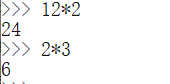

#### g. %

- 取模运算
- 当被除数是整数，模是小数是计算结果错误

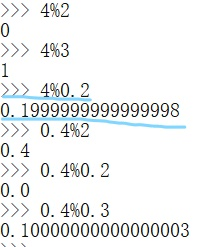

### 3.1.2 赋值运算符

| 符号 |              含义              |
| :--: | :----------------------------: |
|  =   |              赋值              |
|  +=  | $a += 5 \Rightarrow a = a + 5$ |
|  -=  |                                |
|  *=  |                                |
|  /=  |                                |
| **=  |                                |
| //=  |                                |
|  %=  |                                |

### 3.1.3 关系运算符

> 比较两个值的大小，返回 `bool`

- 不支持不同类型比较
- 两个符号串可进行关系运算
  - 逐位比较 `Unicode` 编码

|  符号  |             含义             |
| :----: | :--------------------------: |
|   >    |                              |
|   <    |                              |
|   <=   |                              |
|   >=   |                              |
|   ==   |                              |
|   !=   |                              |
|   is   | 比较两个对象是否是同一个对象 |
| is not |     比较的是对象的 `id`      |

#### 连用

```python
result = 1 < 2 < 3 # 相当于 1 < 2 and 2 < 3
res = 10 < 20 > 15 # res = true
```

### 3.1.4 逻辑运算符

> 逻辑判断

#### not

```python
a = True  #True
b = not a #False
```

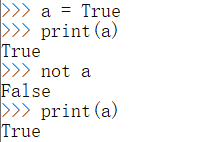

#### and

> 第一个值是 `False` ，则返回第二个值

#### or

> 第一个值是 `True` ，则返回第二个值

#### 非bool的逻辑运算

> 非bool进行与或运算，Python解释器会将其 `bool()` 后，在进行运算，返回 `bool` 类型数值

```python
result = 1 and 2 # 2
result = 1 and 0 # 0
result = 0 and None # 0
```

```python
result = 1 or 2 # 1
result = 1 or 0 # 1
result = 0 or None #None
```

### 3.1.5 条件运算符

> 三目运算符

```python
语句1 if 条件表达式 else 语句2
```

 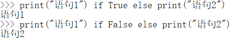


先对条件表达式进行求值判断

- 如果 `True` ，执行语句1，返回执行结果
- 如果 `False` ，执行语句2，返回执行结果

### 3.1.6 运算符优先级

#### a. 优先级

> 运算符的计算顺序

运算顺序不同，结果也会不同

```python
1 + 2 * 3
7
(1+2)*3
9
```

| 运算符                                     | 含义                   | 结合性 |
| ------------------------------------------ | ---------------------- | ------ |
| `()`                                       | 小括号                 | 无     |
| `x[i]` 或 `x[i1:i2]`                       | 索引运算符             | 左     |
| `x.attribure`                              | 属性访问               | 左     |
| `**`                                       | 乘方                   | 右     |
| `~x;+x;-x`                                 | 位非；正号；负号       | 右     |
| `*;/;%;//;`                                | 乘；除；取余；整除     | 左     |
| `+;-`                                      | 加；减                 | 左     |
| `<<;>>`                                    | 左移；右移             | 左     |
| `&`                                        | 位与                   | 右     |
| `^`                                        | 位异或                 | 左     |
| `|`                                        | 位或                   | 左     |
| `in;not in;is;is not;<;<=;>;>=;!=;==`      | 成员；身份；比较运算符 | 左     |
| `not`                                      | 非                     | 右     |
| `and`                                      | 与                     | 左     |
| `or`                                       | 或                     | 左     |
| `=;+=;-=;*=;/=;%=;%=;**=;<<=;>>=;&=;^=;|=` | 赋值运算               | 右     |

#### b. 结合性

> 决定同一优先级运算符的是从左到右还是从右到左

左结合性：从左到右开始计算

右结合性：从右到左开始计算

> 大部分运算符都是左结合性，只有下列运算符是右结合性
>
> - 乘方、单目运算符（位非、正负号、逻辑非）、位与、赋值运算符、三目运算符

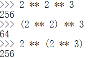

## 3.2 流程控制

Python默认自上而下顺序执行语句

通过流程控制语句可以改变执行顺序

两大类：

- 条件判断
- 循环语句

### 3.2.0 预备知识

#### a. 代码块

- 代码块以缩进开始，到恢复缩进级别结束
- `Tab键` 或 `四个空格`
- 整个代码缩进方式必须统一

#### b. input()函数

> 用于获取用户输入，返回输入值，以回车结束输入

`input(str hint)` 返回值是 字符串

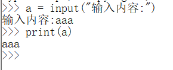

### 3.2.1 条件判断

#### a. 格式

```python
if 条件表达式:
    语句1
```

执行流程

- 条件表达式为 `True` ，执行if之后的语句/代码块
- 条件表达式为 `False` ，不执行

#### b. if...else...

```python
if 条件表达式:
    代码块1
else:
    代码块2
```

#### c. if...elif...else

```python
if 条件表达式1:
	代码块1
elif 条件表达式2:
	代码块2
else:
	代码块3
```

### 3.2.2 循环语句

- while
- for

#### a. while

```python
while 条件表达式:
	代码块1
else:
	代码块2
```

##### while嵌套循环

```python
while 表达式1:
	while 表达式2:
```

```python
# 打印乘法表
i = 1

while i <= 9:
	j = 1
	while j <= i:
		print(f'{i}*{j}={i*j} ',end='')
		j += 1
	print()
	i += 1
```

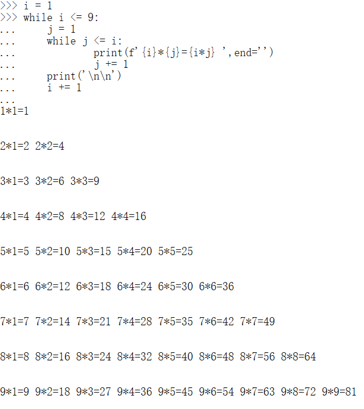

#### b. break

> 退出最近循环，包括else

```python
i = 0
while i < 5:
    if i == 3:
        break
    print(i)
    i += 1
else:
    print("循环结束")
```

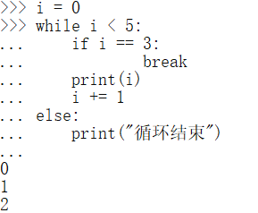

---

求质数

```python
i = 2

while i <= 10:
	flag = True
	j = 2
	t = i ** 0.5
	while j <= t:
		if i%j == 0:
			flag = False
			break
		j += 1
	if flag:
		print(i)
	i += 1
```

#### b. continue

> 退出当次循环

```python
i = 0
while i < 5:
    if i == 3:
        i += 1
        continue
    print(i)
    i += 1
else:
    print("循环结束")
```

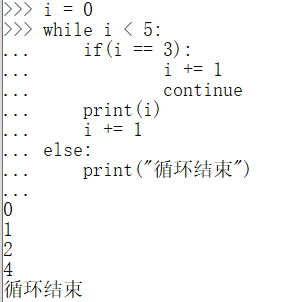

#### b. pass

> 表示占位，不做任何事情

定义一个空语句块会报错，所以可以用 `pass` 填充，使得程序可以正常运行

#### e. for

##### 语法

每执行一次就将序列中的一个元素赋值给游标

```python
for cursor in 序列:
    code block
```

##### range()——创建指定次数的for循环

> `range()` 用于生成自然数序列

三个参数：

- 起始索引(可忽略)
- 结束索引
- 步长(可忽略)

```python
i = 0
for i in range(5):
    print(i)
```

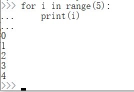

```python
i = 0
for i in range(1,5):
    print(i)
    
i = 0
for i in range(1,5,2):
    print(i)
```

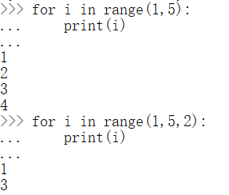

