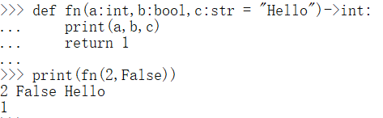
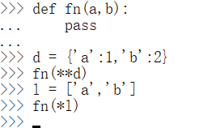
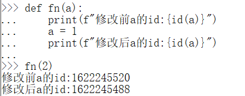
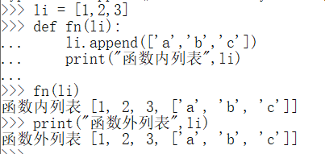
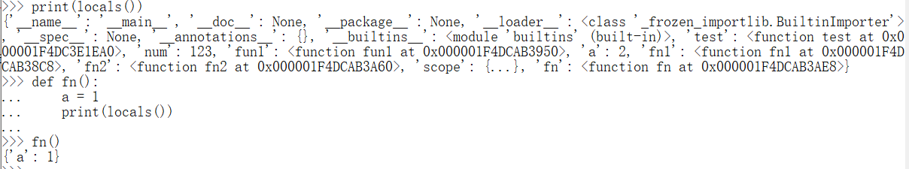
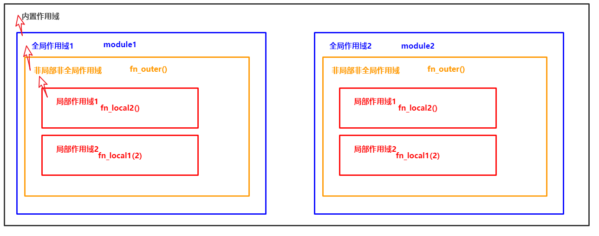

> Python进阶——函数

<!--more-->

> **函数也是对象** ：用于保存可执行代码，并可被重复调用

函数名即函数变量中保存的是内存首地址

## 7.1 函数定义与调用


```python
# function definition
def fn(形参1,形参2,...):
    pass # 代码块

# function call
fn(参数列表)
```

```python
def fn():
    print("Hello world!")

fn()
```

### 7.1.1 文档字符串

> 用于存放函数说明——可以指明参数类型及返回值类型

```python
def fn(a:int,b:bool,c:str = "Hello")->int:
    print(a,b,c)
    # 若不指定返回值，则返回 None
print(fn(1,True))
```



### 7.1.2 帮助函数

`help(fnName)` ：查询Python中函数用法

## 7.2 参数

### 7.2.1 形参

> 形参声明变量，但不赋值

- 形参可指定默认值，调用时实参不足则默认值生效

```python
def fn(a,b,c=20):
    print(c)
fn(1,2,3) # 3
fn(1,2) #20
```

#### 不定长形参

> 形参前加 `*` (元组解包)：将剩余所有实参保存至元组

1. 装包参数最好放于参数列表末尾

   ```python
   # 求任意数字的和
   def sum(*a):
   	print("a=",a,type(a))# tuple
   	result = 0
   	for i in a:
   		result += n
   	return n
   ```

   - 若装包参数位于列表中间，则后续参数必须以关键字参数形式传递

     ```python
     def fn(a,*b,c):
     	print(a,b,c)
     	# a=1,b=(2,3,4),c=5
         
     f(1,2,3,4,c=5)
     ```

2. 带 `*` 参数只能写一个，否则报错

3. `*` 参数只能接收位置参数

4. `**` 参数能接收关键字参数，保存至字典

   ```python
   def fn(**a):
   	pass
   	# a = {'a':1,'b':2,'c':3}
       
   fn(a=1,b=2,c=3)
   ```

   - 键：关键字参数名
   - 值：关键字参数值
   - `**` 参数只能写在参数列表最后，否则报错

### 7.2.2 实参

> 调用函数时，传递的参数

- 位置参数和关键字参数可以混用

  混用时，**位置参数必须在关键字前**

- 同一形参只能被赋值一次

- Python解析器不会检查实参类型

#### a. 位置参数

> 将实参按顺序赋值给形参

#### b. 关键字参数

> 根据参数名传递参数

```python
def fn(a,b,c=20):
    print(c)

# 关键字参数不需要按指定顺序赋值
fn(b = 1,c = 3, a = 2)
```

#### 实参解包

```python
def fn(a,b,c):
	pass

t = (10,11,12)
fn(*t)
```

- 序列中的元素个数与形参个数一致

  `*` ：序列解包

  `**` ：字典解包



### 7.2.3 参数传递

> 不可变对象：值传递，在函数中修改不会影响原值，新生成一个值对象



> 可变对象：地址传递，在函数中修改会影响原值



## 7.3 返回值

`return`

- 如果 `return` 之后不写或没有 `return` ，则返回空
- `return` 用于结束函数

### 7.3.1 一些例子

```python
# 返回最大值
def max(a, b):
    if a > b:
        return a
    else:
        return b 
print(max(4, 5)) # 5
```

```python
# 计算面积函数
def area(width, height):
    return width * height

print("width =", 4, " height =", 5, " area =", area(4, 5))# width = 4  height = 5  area = 20
```

### 7.3.2 递归函数

> 将大问题分解为小为题，直到不可再分
>
> 解决小问题

- 递归和循环可互相转换

```python
# 递归求阶乘
def fac(n):
	if n==1:
		return 1
	else:
		return n*fab(n-1)
```

```python
# 幂运算
# n：底数
# i：次数
def fn(n,i):
	if i == 1:
		return n
	else:
		return n*fn(n,i-1)

print(fn(2,3))
```

```python
# 回文串

def huiwen(str,beg,end):
	if beg==end:
		return True	
	if str[beg]!=str[end]:
		return False
	else:
		return huiwen(str,beg+1,end-1)

str = "abaa"
print(huiwen(str,0,len(str)-1))

def hui_wen(str):
	if len(str)<2:
		return True
	elif　str[0] != str[-1]:
		return False
	return hui_wen(str[1:-1])
```

## 7.4 命名空间

> A namespace is a mapping from names to objects.Most namespaces are currently implemented as Python dictionaries。
>
> 一个命名空间是一个 **从变量名到对象的映射** 
>
> Python中大多数命名空间由字典实现
>
> **命名空间规定了每个变量及其值的关系**

一个命名空间中的变量不能有重名

不同的命名空间中的变量可以重名

### 7.4.1 三种命名空间

- 内置命名空间：Python语言内置的名称，如：`abs` ，`char` 等关键字
- 全局命名空间：模块中定义的名称，记录了模块的变量，如：`函数` ，`类` ，`全局变量和常量` ，`其他导入的模块`
- 局部命名空间：函数中定义的名称，记录了函数的变量，如：`函数的参数` ，`局部变量`

### 7.4.2 命名空间查找顺序

> 查找变量时逐层向上，若最上层没有找到，则返回 `NameError` 异常

局部命名空间->全局命名空间->内置命名空间

### 7.4.3 命名空间生命周期

> 取决于对象的作用域，如果对象执行完成，则该命名空间的生命周期结束，因此无法从外部命名空间访问内部命名空间

### 7.4.4 获取命名空间内容

#### local()

> 获取当前作用域的命名空间



可以通过 locals() 返回的字典添加键值对，相当于新增变量

```python
scope = locals()
scope['c'] = 1000
```

#### global()

> 在任意的命名空间获取全局命名空间

## 7.5 作用域

> A scope is a textual region of a Python program where a namespace is directly accessible. "Directly accessible" here means that an unqualified reference to a name attempts to find the name in namespace.
>
> 作用域是一个Python程序可直接访问命名空间的区域
>
> **作用域限定了变量的作用范围，即超过某个边界变量则无法被访问**

在Python程序中，访问一个变量，会 **从内到外** 依次访问所有的作用域，否则会报未定义错误

- 变量访问是有向的，即外部不能访问到内部作用域的变量，返回 `NameError` 异常

### 7.5.1 四种作用域



只有模块(`module`) ，类(`Class`) 以及函数 (`def` 、`lambda`) 才会引入新的作用域

其他代码块，如(`if..elif...else`、`for` 、`while` 、`try\except`) 都不会引入新的作用域，这些语句内定义的变量，外部也可访问

#### 内置作用域

> 包含了内置的变量 / 关键字

#### 全局作用域

> 在程序执行时创建，程序结束时销毁

相当于函数之外的区域，当前模块的全局变量

#### 闭包外作用域

> 包括非局部也非全局变量

```python
global_cnt = 0 # 全局作用域

def enclosing_fn():
    enclosing_cnt = 1 # 闭包函数外的函数中
    def local_fn():
        local_cnt = 2 # 局部作用域
```

#### 函数作用域

> 在函数调用时创建，函数调用结束时销毁

每调用一次，产生新的函数作用域

函数作用域中定义的变量，是局部变量，只能在被声明的作用域内被访问

### 7.5.2 全局变量和局部变量

> 定义在函数内部的局部变量属于一个局部作用域

- 局部变量只能在其被声明的函数内部访问

> 定义在函数外的全局变量属于一个全局作用域

- 全局变量可以在整个程序范围内访问

调用函数时，所有在函数内声明的变量名称都将被加入到作用域中

```python
res = 0

def fn(a,b):
    res = a + b # res此时是一个局部变量
    print("局部变量res=",res) # 3
    return res

fn(1,2)
print("全局变量res=",res) # 0
```

### 7.5.3 作用域嵌套

同名变量

- 优先在当前作用域寻找，如果有则使用
- 当前作用域没有，去上一级作用域查找

#### 修改全局变量

若要在函数作用域中修改全局变量，需要使用 `global` 声明变量

```python
a = 1
def fn1():
    a += 1 # UnboundLocalError: local variable 'a' referenced before assignment
	print(a) # 1

def fn2():
    global a
    a += 1
	print(a) # 2
print(a) # 2
```

#### 修改非全非局部变量

若要在函数作用域中修改非全非局部变量，需要使用 `nonlocal` 声明变量

```python
def outer():
    num = 10
    def inner():
        nonlocal num   # nonlocal关键字声明
        num = 100
        print(num) # 100
    inner()
    print(num) # 100
outer()
```

## 7.6 高阶函数

### 7.6.1 函数式编程

> 函数的函数

- Python 中 ，函数是一等对象，能赋值给变量或作为数据结构中的元素

- 对象在运行时创建
- 接收一个或多个函数作为参数
- 能作为返回值返回

#### 函数作为参数

```python
def g5(a):
	# 检查是否大于5
	if a > 5:
		return True
	else:
		return False
		
def fn(fnc,a):
	# 判断a是否满足fnc
	if fnc(a):
		return True
	else:
		return False

print(fn(g5,1))
```

##### filter(fnc,iterable)

> 从可迭代对象中过滤出符合条件的元素，返回一个可迭代结构

```python
def g5(a):
	# 检查是否大于5
	if a > 5:
		return True
	else:
		return False
li = [1,3,4,5,6,7,8]
res = filter(g5,li) # [6,7,8]
```

##### map(fnc,iterable)

> 对可迭代对象做指定操作，添加到新对象中返回

```python
def list_add1(a):
    return a + 1

res = map(list_add1,li) # [2,3,4]
```

##### list.sort(key=None, reverse=False)

> If a key function is given, apply it once to each list item and sort them,ascending or descending, according to their function values.
>
> The reverse flag can be set to sort in descending order.
>
> 只能将 `list` 排序，会影响原列表
>
> `key` 函数会应用到列表的每一项，作为排序依据
>
> `reverse` 是 bool 类型，当 `True` 时，按降序，`False` 时，按升序
>
> 默认按升序，第一个元素排序

```python
li = ['b','a','c','aa']
li.sort() # ['a', 'aa', 'b', 'c']
li.sort(reverse = True) # ['c', 'b', 'aa', 'a']

li = ['pyth','p','pytho','py','python','pyt']
li.sort() # ['p', 'py', 'pyt', 'pyth', 'pytho', 'python']

li = [('AZ','abc',154),('BZ','aac',144),('AB','abd',253)]
li.sort() # [('AB', 'abd', 253), ('AZ', 'abc', 154), ('BZ', 'aac', 144)]

def fn(a):
    return a[1]
li.sort(key=fn) # [('BZ', 'aac', 144), ('AZ', 'abc', 154), ('AB', 'abd', 253)]
```

##### sorted(iterable,key=fn,reverse=bool)

> 对任一可迭代对象排序，不影响原序列，返回新对象

```python
d = {"x":2,"y":1,"z":3}

# 默认对字典中的key进行升序排序，返回key列表
sorted(d) # ['x', 'y', 'z']

# 对字典中 value进行排序，只返回value列表
sorted(d.values()) # [1, 2, 3]

# 按指定元素值排序，返回元组序列
def fn(i):
    return i[1]
sorted(d.items(),key=fn) 
# [('y', 1), ('x', 2), ('z', 3)]

# 按指定元素键排序，返回元组序列
def fn(i):
    return i[0]
sorted(d.items(),key=fn) 
# [('x', 2), ('y', 1), ('z', 3)]
```

### 7.6.2 闭包

> 将函数作为返回值返回

- 函数嵌套
- 返回内部函数
- 通过闭包创建只有当前可访问的变量

### 7.6.3 匿名函数(lambda)

> 创建一些简答函数

```python
# lambda 参数列表:返回值

def fn(a,b):
    return a + b
res = fn()

res = lambda (a,b):a+b
```

## 7.7 装饰器

> 通过装饰器可以在不修改原函数的情况下对函数进行 **扩展**

通过 `@` ，使用指定装饰器

- 可以同时为一个函数指定多个装饰器，函数 **由内向外** 

```python
def descriptor(old_fun):
	def new_fun(*args,**kwargs): 
		# *args接收所有位置参数
		# kwargs接收所有关键字参数
		print('开始执行')
        print(args,kwargs)
		res = old_fun(*args,**kwargs)
        print("后处理")
		return res
	
	return new_fun

@descriptor
def old_fun(a,b,li):
	return a+b

old_fun(1,2,li=[1,2,3])
# 开始执行
# (1, 2) {'li': [1, 2, 3]}
# 后处理
# 3
```

### 7.7.1 OCP(开闭原则)

- 开放对成都的扩展
- 关闭对程序的修改

