[TOC]

<!--more-->

# 1. 绪论

数据表示：

- NumPy：[ndarray]类型和存取数据的基本方法，介绍数据的操作方式
- matplotlib：[pyplot] 绘制数据图形
- Pandas：[series,DataFrame] 数据分析，普通二维数据与一维数据，带有时间序列数据的使用方式

数据分析：一组数据表达的一个或多个含义

摘要：有损地提取数据特征的过程

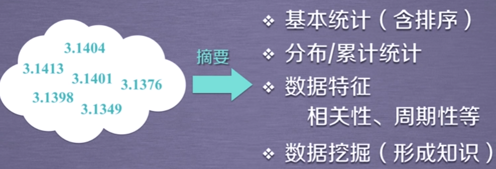

## 1.1 开发工具

文本工具

- IDLE：Python自带

  300+行内

集成工具——通用场景

- Wing：Vmware控制

  版本控制

- visual studio 微软，win

  +PTVS

- eclipse：开源IDE

  +PyDev

- Pycharm JetBrains

集成工具——科学计算，数据分析

- Anaconda 开源，集成开发框架

  800个第三方库

- Canopy 收费

  500个第三方库

### 1.1.1 Anaconda

> 一个集成各类Python工具的集成平台

#### conda

> 一个包管理和环境管理工具，将工具、第三方库、Python版本、conda都当做包同等对待

- 包管理：管理Python第三方库
- 环境管理工具：配置相关环境，允许用户使用不同版本的Python，并自由切换

```shell
conda --version 	# 获取conda版本
conda update conda 	# 升级conda
```

#### anaconda

> 一个命名空间(、环境空间，conda的一个实例)，包括conda、某版本Python、一批第三方库等

Environment信息：默认生成一个root的环境空间，可显示当前环境空间安装的包、未安装的包、待升级的包等信息


#### 交互式工具

##### Spyder

**视图调整**

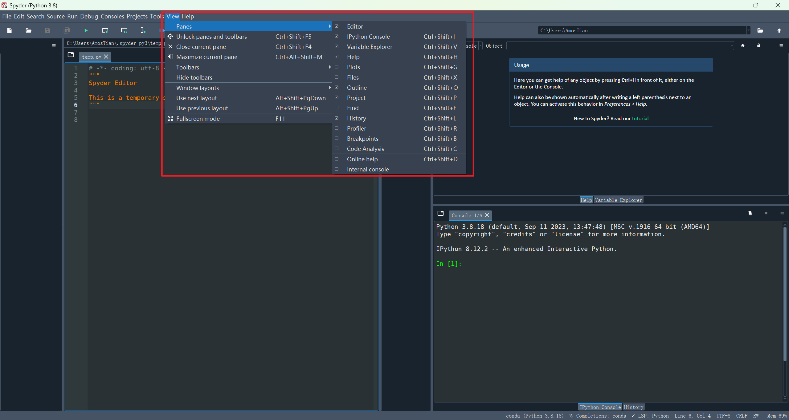

- 编辑区
- 文件导航与帮助
- IPython：对运行结果与输入做相关响应区

**首选项**

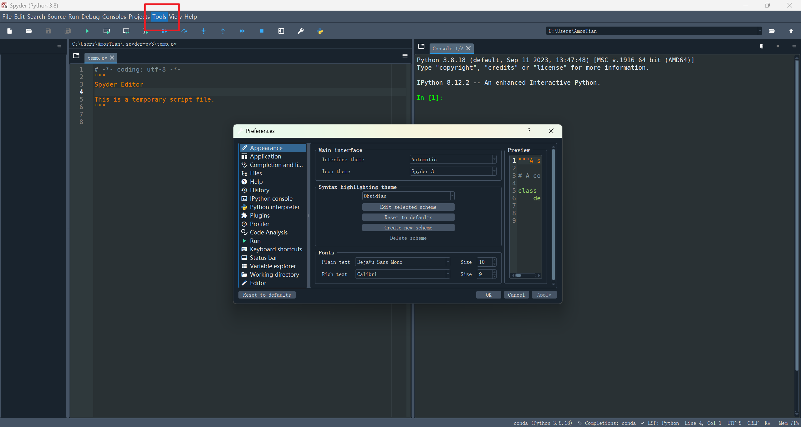

**IPython**

> Python解释器能根据输入得到输出，IPython是一个能够调用Python解释器的交互式显示脚本，能够显示图形、图像的GUI界面

在控制台输入

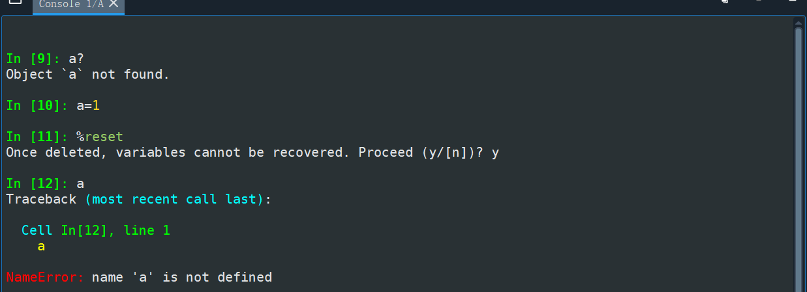

- 问号：`a?` 

  - 对于变量，获取变量的相关信息

  - 对于函数，获取函数体

- 魔术命令：`%`

  - `%magic` 显示所有魔术命令

  - `%hist` IPython命令的输入历史

  - `%pdb` 异常发生后自动进入调试器

  - `%who` 显示IPython当前命名空间中已经定义的变量

  - `%reset` 删除当前命名空间中已经定义的变量

  - `%time statement` 给出代码的执行时间，statement表示一段代码

  - `%timeit statement` 多次执行代码，计算综合平均执行时间

  - 运行：`%run 文件名`

    用于运行 .py 程序，`%run` 在一个空的命名空间执行，即文件中必须包含必要的 `import lib` ，因为其不借助现有的命名空间执行


##### jupyter notebook

> 交互式笔记本，支持40多种语言
>
> 本质是Web应用程序，便于创建和共享程序文档、实时代码，集文本、代码、图像、公式的展现于一体 

**启动**

在代码目录cmd启动 `jupyter notebook`

**jupyter模式**

绿色：编辑模式

- Tab：代码补全或缩进
- Shift：提示
- Shift+Enter：运行本单元，选中下一单元
- Ctrl+Enter：运行本单元
- Alt+Enter：运行本单元，在下方插入新单元

蓝色：执行模式

- Shift+Enter：运行本单元，选中下一单元
- **Ctrl+Enter**：运行本单元
- Alt+Enter：运行本单元，在其下插入新单元
- Y：单元转入代码状态
- M：单元转入markdown状态
- A：在上方插入新单元
- **B**：在下方插入新单元
- **DD**：删除选中单元

在JN中写markdown，插入单元格-写内容-转化为MD状态-执行单元


# 2. Numpy

## 2.1 NumPy包导入

```python
import numpy as np # 尽量使用约定别名
```

特点

- 提供N维(dim)数组对象 `ndarray`
- 广播功能函数
- 整合C/C++/Fortran 代码的工具
- 线性代数、傅里叶变换、随机数生成等功能

## 2.2 ndarray

### 2.2.1 ndarray设计需求

计算 $A^2+B^3$ ，其中 $A$ 和 $B$ 是一维数组

```python
# 使用Python基础数据类型
# 重心放在列表中每个元素的计算上
def pySum():
    a=[0,1,2,3,4]
    b=[9,8,7,6,5]
    c=[]
    
    for i in range(len(a)):
        c.append(a[i]**2+b[i]**3)
        
    return c

print(pySum())
```

```python
# 数组运算可以去掉元素间运算所需的循环，简化数据运算
# 设置专门的数组对象，经过优化，可以提升运算速度
# 数组中的元素采用相同的数据类型，有助于节省运算和存储空间
import numpy as np

def npSum():
    a=np.array([0,1,2,3,4])
    b=np.array([9,8,7,6,5])
    
    c=a**2+b**3
    return c

print(npSum())
```

### 2.2.2 ndarray介绍

> `np.array` 是numpy中 ndarray的别名

是一个多维数组对象，由两部分构成

- 实际的数据

  一般要求所有的元素类型相同（同质）

- 描述这些数据的元数据（数据维度、数据类型等）

是SciPy、Pandas的基础

#### 数据维度

> 一组数据的组织形式，在数据间形成不同关系以表示不同的数据含义

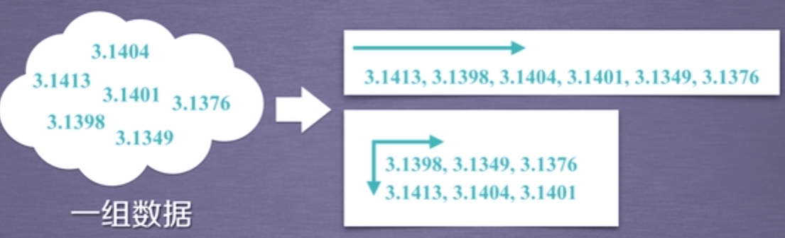

##### 一维数据

> 由对等关系的有序或无序数据构成，采用线性方式组织

- 对应 **列表和集合** 等概念，Python基本数据类型中不包括数组

  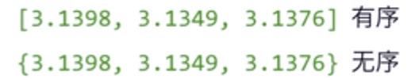

| 类型 | 数据元素要求         | eg                                     |
| ---- | -------------------- | -------------------------------------- |
| 列表 | 元素数据类型可以不同 | `[3.14,'pi',[3.1401,3.1349],'3.1376']` |
| 数组 | 元素数据类型必须相同 | `[3.14,3.1415]`                        |

##### 二维数据

> 多个一维数据组成，是一维数据的组成

**列表** 类型数据表示

##### 多维数据

> 由一维或二维数据在新维度上扩展形成

**列表类型**

区别 高维数据：仅利用基本的二元关系展示数据间的复杂结构

- **字典类型** ：键值对

- **数据表示方式** ：XML、JSON、YAML

#### numpy轴与维度

**数组维度**：数组有多少维，每一维有多少元素，在np中用元组(tuple) 表示维度

- 元组有多少元素，表示数组有多少维度——秩(rank)：也即轴的数量
- (2,3)表示第一维长度为2，第二维长度为3

**轴** ：指该数组的某个维度方向

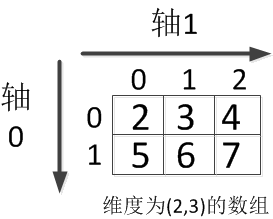

数组 `a[2][3]=[[2,3,4],[5,6,7]]` 

- 轴0方向上看有两个元素，`a=[x,y]` 

  对轴0上元素求和相当于两个元素的求和，即 sum(a,axis=0)=[2+5,3+6,4+7]=[7,9,11]

- 轴1方向上看有三个元素，`a=[x,y,z]`

  对轴1方向上求均值，相当于三个元素求均值，即 mean(a,axis=1)=[(2+3+4)/3,(5+6+7/3)]=[3,6]

这一数组表示的多维信息为：


### 2.2.3 ndarray对象属性

| 属性      | 返回类型  | 说明                             |
| --------- | --------- | -------------------------------- |
| .ndim     | int       | 秩，轴的数量或维度数量           |
| .shape    | tuple     | 对象的尺度，对于矩阵，则为n行m列 |
| .size     | int       | 元素的个数相当于 $n\times m$     |
| .dtype    | data-type | 元素类型                         |
| .itemsize | int       | 单个元素的大小，以字节为单位     |

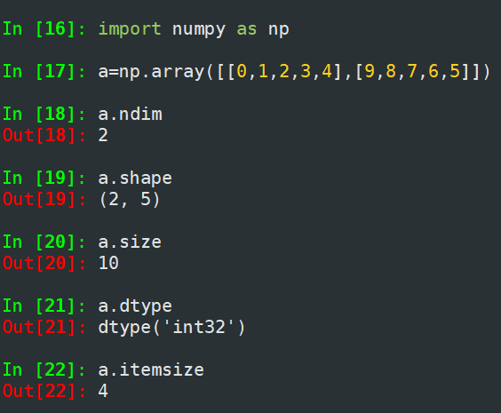

#### ndarray数据类型

Python语法仅支持整数、浮点数和复数三种类型

- 科学计算涉及数据较多，对存储和性能都有较高要求
- 对数据元素类型精细定义，有助于NumPy合理使用存储空间并优化性能
- 对于元素类型精细化定义，便于评估程序规模

**ndarray** 数组可以由非同质对象构成

非同质ndarray元素为对象类型，尽量避免使用

| 数据类型   | 说明                                                |
| ---------- | --------------------------------------------------- |
| bool       | 布尔类型，True或False                               |
| intc       | 与C语言中的int类型一致，一般是int32或int64          |
| intp       | 用于索引的整数，与C语言的ssize_t一致                |
| int8       | 字节长度的整数，取值[-128,127]                      |
| int16      | 2B长度的整数，取值[-32768,32767]                    |
| int32      | 4B长度的整数，取值 $[-2^{31},2^{31}-1]$             |
| int64      | 8B长度的整数，取值 $[-2^{63},2^{63}-1]$             |
| uint8      | 1B无符号整数，取值：$[0,255]$                       |
| uint16     | 2B无符号整数，取值：$[0,65535]$                     |
| uint32     | 4B无符号整数，取值：$[0,2^{32}-1]$                  |
| uint64     | 8B无符号整数，取值：$[0,2^{64}-1]$                  |
| float16    | 16bit半精度浮点数：1bit符号位，5bit指数，10bit尾数  |
| float32    | 32bit半精度浮点数：1bit符号位，8bit指数，23bit尾数  |
| float64    | 64bit半精度浮点数：1bit符号位，11bit指数，52bit尾数 |
| complex64  | 复数类型，实部和虚部都是32bit浮点数                 |
| complex128 | 复数类型，实部和虚部都是64bit浮点数                 |

### 2.2.4 ndarray创建

#### np.array()创建

> 从Python中的列表、元组等类型创建ndarray数组

`numpy.array(object, dtype=None, copy=True, order='K', subok=False, ndmin=0)`

- object：按一定要求将object转换为数组，支持四种类型，数组、公开数组接口的任何对象、`__array__` 方法返回数组的对象、任何(嵌套)序列
- dtype：接收data-type，表示数组所需的数据类型。若未指定，则选择保存对象所需的最小数据类型
- ndmin：接收int，表示生成数组应具有的最小维度

```python
x=np.array(list/tuple)
x=np.array(list/tuple,dtype=np.float32)
```

```shell
x = np.array([1,2,3,4]) # 从列表类型创建数组
print(x)

y = np.array((4,5,6,7)) # 从元组类型创建
print(y)

z = np.array([[1,2],[9,8],(0.1,0.2)]) #从列表和元组混合类型创建，只要列表与元组包含的数据个数相同就可混合使用
print(z)
```

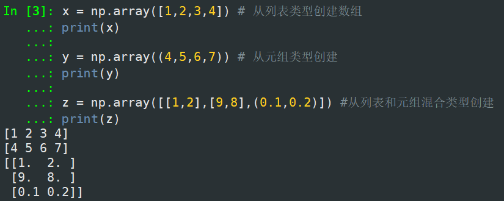

#### np.函数()

> 使用numpy中函数创建ndarray数组，如：arange,ones,zeros等

| 函数                      | 说明                                                         |
| ------------------------- | ------------------------------------------------------------ |
| `np.arange(beg,end,step)` | 元素从0到n-1，元素类型全为整数                               |
| `np.ones(shape)`          | 根据shape(元组类型)，生成值全是1的数组<br />生成类型全为float，除非用dtype指定 |
| `np.zeros(shape)`         | 根据shape(元组类型)，生成值全是0的数组<br />生成类型全为float，除非用dtype指定 |
| `np.full(shape,val)`      | 根据shape(元组类型)，生成值全是val的数组<br />生成类型全为float，除非用dtype指定 |
| `np.eye(n)`               | 创建n维单位矩阵                                              |
| `np.ones_like(a)`         | 根据数组a的shape生成全1数组                                  |
| `np.zeros_like(a)`        | 根据数组a的shape生成全0数组                                  |
| `np.full_like(a,val)`     | 根据数组a的shape生成全val的数组                              |

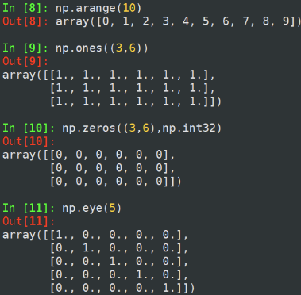

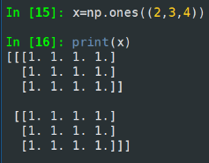

`np.linspace(start, stop, num=50, endpoint=True, retstep=False,dtype=None, axis=0,) `

- 根据起止，等间距地生成num 个数据

`concatenate((a1, a2, ...), axis=0, out=None, dtype=None,casting="same_kind") `

- 将两个或多个数组合并成一个新的数组

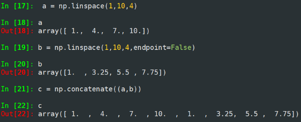

#### 字节流(raw bytes)创建

#### 文件中读取特定格式创建数组

### 2.2.5 ndarray数组变换

> 对于创建好的ndarray数组，可以对其进行维度变换和元素类型变换

#### 数组维度变换

| 方法                    | 说明                                                |
| ----------------------- | --------------------------------------------------- |
| `obj.reshape(shape)`    | 不改变数组元素，返回一个shape形状的数组，原数组不变 |
| `obj.resize(shape)`     | 与 `.reshape()` 功能一致，但修改原数组              |
| `obj.swapaxes(ax1,ax2)` | 将数组n个维度中的两个维度调换                       |
| `obj.flatten()`         | 对数组降维，折叠为一维数组，原数组                  |

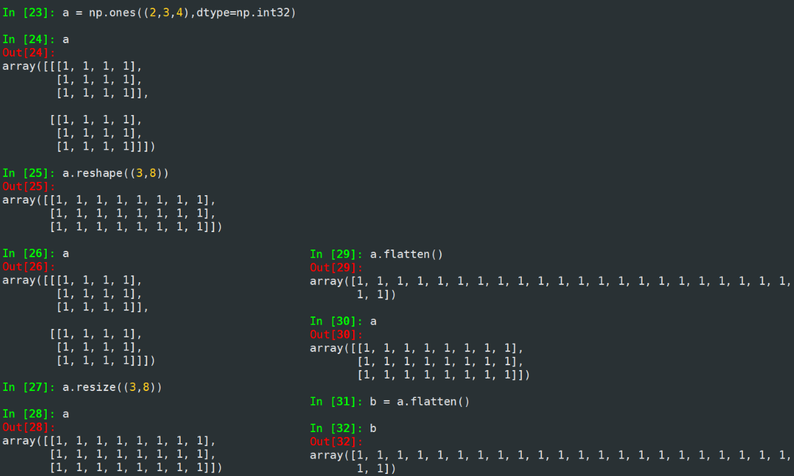

#### 数组元素类型变换

`new_a=a.astype(new_dtype)`

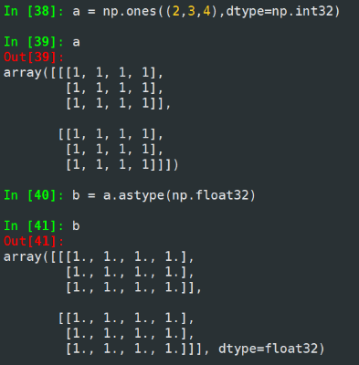

#### 数组向列表转换

`ls = a.tolist()`

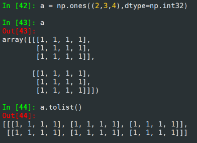

### 2.2.6 ndarray数组的操作

#### 数组的索引与切片

`[,,,]` ：表示索引

`[:::]` ：表示切片

**一维数组索引+切片**

 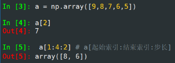

- 不含结束索引，所以相当于 `np.array([a[1],a[3]])`

**二维数组索引**

```python
In [6]: a = np.arange(24).reshape((2,3,4))

In [7]: a
Out[7]: 
array([[[ 0,  1,  2,  3],
        [ 4,  5,  6,  7],
        [ 8,  9, 10, 11]],

       [[12, 13, 14, 15],
        [16, 17, 18, 19],
        [20, 21, 22, 23]]])

In [8]: a[1,2,3]
Out[8]: 23

In [9]: a[0,2,3]
Out[9]: 11

In [10]: a[-1,-2,-3] # 从右侧向左递减方式索引 -1表示倒数第一个元素：-2表示倒数第二个元素：-3表示倒数第三个元素
Out[10]: 17
```

**二维数组切片**

```python
#第一个维度不切片，第二个维度选索引为1的元素，第二个维度选索引为倒数第三个元素
In [11]: a[:,1,-3] 
Out[11]: array([ 5, 17])

#第一个维度不切片，第二个维度切1,2个元素，第三个维度不切片
In [12]: a[:,1:3,:] 
Out[12]: 
array([[[ 4,  5,  6,  7],
        [ 8,  9, 10, 11]],

       [[16, 17, 18, 19],
        [20, 21, 22, 23]]])

#第一二维度不切片，第三个维度以步长为2切片，即a[,,0],a[,,2]
In [13]: a[:,:,::2] 
Out[13]: 
array([[[ 0,  2],
        [ 4,  6],
        [ 8, 10]],

       [[12, 14],
        [16, 18],
        [20, 22]]])
```

####  数组运算

> 对数组的运算，相当于对数组每个元素的运算

##### 逐元素运算

| 函数                                                         | 说明                                                 |
| ------------------------------------------------------------ | ---------------------------------------------------- |
| `np.abs(obj)` ，`np.fabs(obj)`                               | 计算数组各元素的绝对值                               |
| `np.sqrt(obj)`                                               | 计算数组各元素的平方根                               |
| `np.sqare(obj)`                                              | 计算数组各元素的平方                                 |
| `np.log(obj)` ,`np.log10(obj)`,`np.log2(obj)`                | 计算数组各元素的自然对数、10底对数和2底对数          |
| `np.ceil(obj)` , `np.floor(obj)`                             | 计算数组中各元素的上界值与下界值                     |
| `np.rint(obj)`                                               | 计算数组各元素的四舍五入                             |
| `np.modf(obj)`                                               | 将数组各元素的小数和整数部分以两个独立的数组形式返回 |
| `np.cos(obj)` ,`np.conh(obj)`<br />`np.sin(obj)`,`np.sinh(obj)`<br />`np.tan(obj)`,`np.tanh(obj)` | 计算数组元素的普通型和双曲型三角函数                 |
| `np.exp(obj)`                                                | 计算数组各元素的指数值                               |
| `np.sign(obj)`                                               | 计算数组各元素的符号值，1(+),0,-1(-)                 |

```python
In [22]: a = np.arange(24).reshape((2,3,4))

In [23]: np.square(a)
Out[23]: 
array([[[  0,   1,   4,   9],
        [ 16,  25,  36,  49],
        [ 64,  81, 100, 121]],

       [[144, 169, 196, 225],
        [256, 289, 324, 361],
        [400, 441, 484, 529]]])

In [24]: a = np.sqrt(a)

In [25]: a
Out[25]: 
array([[[0.        , 1.        , 1.41421356, 1.73205081],
        [2.        , 2.23606798, 2.44948974, 2.64575131],
        [2.82842712, 3.        , 3.16227766, 3.31662479]],

       [[3.46410162, 3.60555128, 3.74165739, 3.87298335],
        [4.        , 4.12310563, 4.24264069, 4.35889894],
        [4.47213595, 4.58257569, 4.69041576, 4.79583152]]])

In [26]: np.modf(a)
Out[26]: 
(array([[[0.        , 0.        , 0.41421356, 0.73205081],
         [0.        , 0.23606798, 0.44948974, 0.64575131],
         [0.82842712, 0.        , 0.16227766, 0.31662479]],
 
        [[0.46410162, 0.60555128, 0.74165739, 0.87298335],
         [0.        , 0.12310563, 0.24264069, 0.35889894],
         [0.47213595, 0.58257569, 0.69041576, 0.79583152]]]),
 array([[[0., 1., 1., 1.],
         [2., 2., 2., 2.],
         [2., 3., 3., 3.]],
 
        [[3., 3., 3., 3.],
         [4., 4., 4., 4.],
         [4., 4., 4., 4.]]]))
```

##### 数组与标量

实例：计算数组a与元素平均值的商

```python
In [14]: a = np.arange(24).reshape((2,3,4))

In [15]: a
Out[15]: 
array([[[ 0,  1,  2,  3],
        [ 4,  5,  6,  7],
        [ 8,  9, 10, 11]],

       [[12, 13, 14, 15],
        [16, 17, 18, 19],
        [20, 21, 22, 23]]])

In [16]: a_mean = a.mean()

In [17]: a_mean
Out[17]: 11.5

In [18]: a = a / a_mean

In [19]: a
Out[19]: 
array([[[0.        , 0.08695652, 0.17391304, 0.26086957],
        [0.34782609, 0.43478261, 0.52173913, 0.60869565],
        [0.69565217, 0.7826087 , 0.86956522, 0.95652174]],

       [[1.04347826, 1.13043478, 1.2173913 , 1.30434783],
        [1.39130435, 1.47826087, 1.56521739, 1.65217391],
        [1.73913043, 1.82608696, 1.91304348, 2.        ]]])
```

##### 数组间运算

> 若参与运算的两个数组中的元素类型(dtype)不同，则会将元素类型向上转换

| 函数                                                         | 说明                                                         |
| ------------------------------------------------------------ | ------------------------------------------------------------ |
| `+,-,*,/,**`                                                 | 两个数组各元素进行对应运算                                   |
| `np.maximum(x,y)` , `np.fmax()`<br />`np.minimum(x,y)` , `np.fmin()` | 元素级的最大值/最小值计算<br />fmax会忽略NAN，maximum会传播NAN |
| `np.mod(x,y)`                                                | 元素级模运算                                                 |
| `np.copysign(x,y)`                                           | 将y数组中各元素的值符号赋值给数组x对应元素                   |
| `>,<,> = ,< = ,==,! =`                                       | 算数比较，产生布尔类型数组                                   |

```python
In [35]: a = np.arange(24).reshape((2,3,4))

In [36]: b
Out[36]: 
array([[[0.        , 1.        , 1.41421356, 1.73205081],
        [2.        , 2.23606798, 2.44948974, 2.64575131],
        [2.82842712, 3.        , 3.16227766, 3.31662479]],

       [[3.46410162, 3.60555128, 3.74165739, 3.87298335],
        [4.        , 4.12310563, 4.24264069, 4.35889894],
        [4.47213595, 4.58257569, 4.69041576, 4.79583152]]])

In [37]: a = np.arange(24).reshape((2,3,4))

In [38]: b = np.sqrt(a)

In [39]: np.minimum(a,b)
Out[39]: 
array([[[0.        , 1.        , 1.41421356, 1.73205081],
        [2.        , 2.23606798, 2.44948974, 2.64575131],
        [2.82842712, 3.        , 3.16227766, 3.31662479]],

       [[3.46410162, 3.60555128, 3.74165739, 3.87298335],
        [4.        , 4.12310563, 4.24264069, 4.35889894],
        [4.47213595, 4.58257569, 4.69041576, 4.79583152]]])

In [40]: a > b
Out[40]: 
array([[[False, False,  True,  True],
        [ True,  True,  True,  True],
        [ True,  True,  True,  True]],

       [[ True,  True,  True,  True],
        [ True,  True,  True,  True],
        [ True,  True,  True,  True]]])
```

## 2.3 文件中读取数据

### 2.3.1 一/二维数据——CSV文件

> CSV文件(Comma-Separated Value，逗号分隔值)，常用于批量存储数据

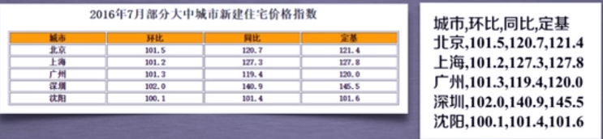

**适用数据类型**

CSV只能有效存储一维和二维数组

#### 写入csv文件

`np.savetxt(frame,array,fmt='%.18e',delimiter=None)`

- frame：文件、字符串或产生器，可以是.gz或.bz2的压缩文件

- array：存储文件的数组

- fmt：写入文件的数据格式，例如：`%d %.2f %.18e`

  `%.18e` 是科学计数法，保留18位小数

- delimiter：分割字符串，默认是任何空格

```python
In [41]: a = np.arange(100).reshape(5,20)

In [42]: a
Out[42]: 
array([[ 0,  1,  2,  3,  4,  5,  6,  7,  8,  9, 10, 11, 12, 13, 14, 15,
        16, 17, 18, 19],
       [20, 21, 22, 23, 24, 25, 26, 27, 28, 29, 30, 31, 32, 33, 34, 35,
        36, 37, 38, 39],
       [40, 41, 42, 43, 44, 45, 46, 47, 48, 49, 50, 51, 52, 53, 54, 55,
        56, 57, 58, 59],
       [60, 61, 62, 63, 64, 65, 66, 67, 68, 69, 70, 71, 72, 73, 74, 75,
        76, 77, 78, 79],
       [80, 81, 82, 83, 84, 85, 86, 87, 88, 89, 90, 91, 92, 93, 94, 95,
        96, 97, 98, 99]])

In [43]: np.savetxt('a.csv',a,fmt='%d',delimiter=',')
```

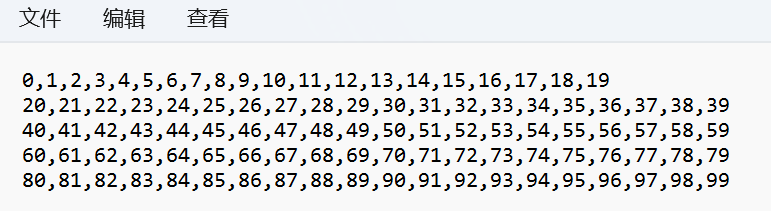

```python
In [44]: np.savetxt('a.csv',a,fmt='%.1f',delimiter=',')
```

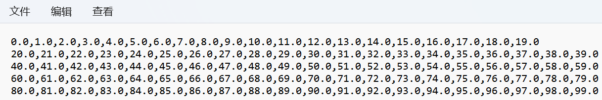

#### 读取csv文件

`np.loadtxt(frame,dtype=np.float32,delimiter=None,unpack=False)`

- frame：文件、字符串或产生器，可以是.gz或.bz2的压缩文件
- dtype：数据类型，可选
- delimiter：指定数据的分割字符串，默认是任何空格
- unpack：如果是True，读入属性将分别写入不同变量

```python
In [46]: b = np.loadtxt('a.csv',delimiter=',')

In [47]: b
Out[47]: 
array([[ 0.,  1.,  2.,  3.,  4.,  5.,  6.,  7.,  8.,  9., 10., 11., 12.,
        13., 14., 15., 16., 17., 18., 19.],
       [20., 21., 22., 23., 24., 25., 26., 27., 28., 29., 30., 31., 32.,
        33., 34., 35., 36., 37., 38., 39.],
       [40., 41., 42., 43., 44., 45., 46., 47., 48., 49., 50., 51., 52.,
        53., 54., 55., 56., 57., 58., 59.],
       [60., 61., 62., 63., 64., 65., 66., 67., 68., 69., 70., 71., 72.,
        73., 74., 75., 76., 77., 78., 79.],
       [80., 81., 82., 83., 84., 85., 86., 87., 88., 89., 90., 91., 92.,
        93., 94., 95., 96., 97., 98., 99.]])

In [49]: b = np.loadtxt('a.csv',dtype=np.int32,delimiter=',')
..\ipykernel_25716\1206317582.py:1: DeprecationWarning: loadtxt(): Parsing an integer via a float is deprecated.  To avoid this warning, you can:
    * make sure the original data is stored as integers.
    * use the `converters=` keyword argument.  If you only use
      NumPy 1.23 or later, `converters=float` will normally work.
    * Use `np.loadtxt(...).astype(np.int64)` parsing the file as
      floating point and then convert it.  (On all NumPy versions.)
  (Deprecated NumPy 1.23)
  b = np.loadtxt('a.csv',dtype=np.int32,delimiter=',')

In [50]: b
Out[50]: 
array([[ 0,  1,  2,  3,  4,  5,  6,  7,  8,  9, 10, 11, 12, 13, 14, 15,
        16, 17, 18, 19],
       [20, 21, 22, 23, 24, 25, 26, 27, 28, 29, 30, 31, 32, 33, 34, 35,
        36, 37, 38, 39],
       [40, 41, 42, 43, 44, 45, 46, 47, 48, 49, 50, 51, 52, 53, 54, 55,
        56, 57, 58, 59],
       [60, 61, 62, 63, 64, 65, 66, 67, 68, 69, 70, 71, 72, 73, 74, 75,
        76, 77, 78, 79],
       [80, 81, 82, 83, 84, 85, 86, 87, 88, 89, 90, 91, 92, 93, 94, 95,
        96, 97, 98, 99]])
```

### 2.3.2 多维数据

需要知道 **数据类型** 与 **数组维度信息**

#### 写入文件

`ndarry_obj.tofile(frame,sep='',format='%s')`

- frame：文件、字符串
- sep：数据分割字符串，如果是空串，写入文件为二进制
- format：写入数据的格式

```python
In [54]: a = np.arange(100).reshape(2,5,10)

In [55]: a
Out[55]: 
array([[[ 0,  1,  2,  3,  4,  5,  6,  7,  8,  9],
        [10, 11, 12, 13, 14, 15, 16, 17, 18, 19],
        [20, 21, 22, 23, 24, 25, 26, 27, 28, 29],
        [30, 31, 32, 33, 34, 35, 36, 37, 38, 39],
        [40, 41, 42, 43, 44, 45, 46, 47, 48, 49]],

       [[50, 51, 52, 53, 54, 55, 56, 57, 58, 59],
        [60, 61, 62, 63, 64, 65, 66, 67, 68, 69],
        [70, 71, 72, 73, 74, 75, 76, 77, 78, 79],
        [80, 81, 82, 83, 84, 85, 86, 87, 88, 89],
        [90, 91, 92, 93, 94, 95, 96, 97, 98, 99]]])

In [56]: a.tofile('a.dat',sep=',',format='%d')
```

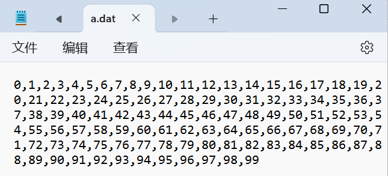

若不指定分割符 `sep`，则生成二进制文件

- 二进制文件占用空间小比文本文件小

```python
In [57]: a.tofile('a.dat',format='%d')
```

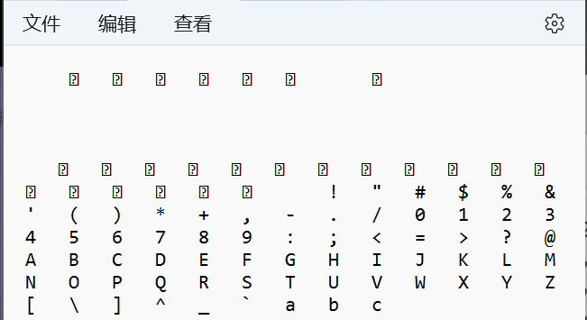

#### 读取文件

`np.fromfile(frame,dtype=float32,count=-1,sep='')`

- frame：文件、字符串
- dtype：读取文件的数据类型
- count：读元素个数，默认-1表示读入整个文件
- sep：数据分割支持字符串，如果是空串，则写入文件为二进制文件

```python
# 文本文件的读写
In [58]: a = np.arange(100).reshape(2,5,10)

In [59]: a
Out[59]: 
array([[[ 0,  1,  2,  3,  4,  5,  6,  7,  8,  9],
        [10, 11, 12, 13, 14, 15, 16, 17, 18, 19],
        [20, 21, 22, 23, 24, 25, 26, 27, 28, 29],
        [30, 31, 32, 33, 34, 35, 36, 37, 38, 39],
        [40, 41, 42, 43, 44, 45, 46, 47, 48, 49]],

       [[50, 51, 52, 53, 54, 55, 56, 57, 58, 59],
        [60, 61, 62, 63, 64, 65, 66, 67, 68, 69],
        [70, 71, 72, 73, 74, 75, 76, 77, 78, 79],
        [80, 81, 82, 83, 84, 85, 86, 87, 88, 89],
        [90, 91, 92, 93, 94, 95, 96, 97, 98, 99]]])

In [60]: a.tofile('a.dat',sep=',',format='%d') # 写入文本文件

In [61]: c = np.fromfile('a.dat',dtype=np.int32,sep=',')

In [62]: c
Out[62]: 
array([ 0,  1,  2,  3,  4,  5,  6,  7,  8,  9, 10, 11, 12, 13, 14, 15, 16,
       17, 18, 19, 20, 21, 22, 23, 24, 25, 26, 27, 28, 29, 30, 31, 32, 33,
       34, 35, 36, 37, 38, 39, 40, 41, 42, 43, 44, 45, 46, 47, 48, 49, 50,
       51, 52, 53, 54, 55, 56, 57, 58, 59, 60, 61, 62, 63, 64, 65, 66, 67,
       68, 69, 70, 71, 72, 73, 74, 75, 76, 77, 78, 79, 80, 81, 82, 83, 84,
       85, 86, 87, 88, 89, 90, 91, 92, 93, 94, 95, 96, 97, 98, 99])

In [63]: c = np.fromfile('a.dat',dtype=np.int32,sep=',').reshape(2,5,10)

In [64]: c
Out[64]: 
array([[[ 0,  1,  2,  3,  4,  5,  6,  7,  8,  9],
        [10, 11, 12, 13, 14, 15, 16, 17, 18, 19],
        [20, 21, 22, 23, 24, 25, 26, 27, 28, 29],
        [30, 31, 32, 33, 34, 35, 36, 37, 38, 39],
        [40, 41, 42, 43, 44, 45, 46, 47, 48, 49]],

       [[50, 51, 52, 53, 54, 55, 56, 57, 58, 59],
        [60, 61, 62, 63, 64, 65, 66, 67, 68, 69],
        [70, 71, 72, 73, 74, 75, 76, 77, 78, 79],
        [80, 81, 82, 83, 84, 85, 86, 87, 88, 89],
        [90, 91, 92, 93, 94, 95, 96, 97, 98, 99]]])
```

```python
# 二进制文件的读写
In [65]: a = np.arange(100).reshape(2,5,10)

In [66]: a.tofile('a.dat',format='%d')

In [67]: c = np.fromfile('a.dat',dtype=np.int32).reshape(2,5,10)

In [68]: c
Out[68]: 
array([[[ 0,  1,  2,  3,  4,  5,  6,  7,  8,  9],
        [10, 11, 12, 13, 14, 15, 16, 17, 18, 19],
        [20, 21, 22, 23, 24, 25, 26, 27, 28, 29],
        [30, 31, 32, 33, 34, 35, 36, 37, 38, 39],
        [40, 41, 42, 43, 44, 45, 46, 47, 48, 49]],

       [[50, 51, 52, 53, 54, 55, 56, 57, 58, 59],
        [60, 61, 62, 63, 64, 65, 66, 67, 68, 69],
        [70, 71, 72, 73, 74, 75, 76, 77, 78, 79],
        [80, 81, 82, 83, 84, 85, 86, 87, 88, 89],
        [90, 91, 92, 93, 94, 95, 96, 97, 98, 99]]])

In [69]: c = np.fromfile('a.dat',dtype=np.int32)

In [70]: c
Out[70]: 
array([ 0,  1,  2,  3,  4,  5,  6,  7,  8,  9, 10, 11, 12, 13, 14, 15, 16,
       17, 18, 19, 20, 21, 22, 23, 24, 25, 26, 27, 28, 29, 30, 31, 32, 33,
       34, 35, 36, 37, 38, 39, 40, 41, 42, 43, 44, 45, 46, 47, 48, 49, 50,
       51, 52, 53, 54, 55, 56, 57, 58, 59, 60, 61, 62, 63, 64, 65, 66, 67,
       68, 69, 70, 71, 72, 73, 74, 75, 76, 77, 78, 79, 80, 81, 82, 83, 84,
       85, 86, 87, 88, 89, 90, 91, 92, 93, 94, 95, 96, 97, 98, 99])
```

### 2.3.3 NumPy便捷文件存取

`np.save(frame,ndarray)` 或 `np.savez(frame,ndarray)`

- frame：文件名，以 .npy 为扩展名，压缩扩展名为 .npz
- array：数组变量

`np.load(fname)`

- fname：文件名，以 .npy 或 .npz 为扩展名

```python
In [71]: a = np.arange(100).reshape(2,5,10)

In [72]: np.save('a.npy',a)

In [73]: b = np.load('a.npy')

In [74]: b
Out[74]: 
array([[[ 0,  1,  2,  3,  4,  5,  6,  7,  8,  9],
        [10, 11, 12, 13, 14, 15, 16, 17, 18, 19],
        [20, 21, 22, 23, 24, 25, 26, 27, 28, 29],
        [30, 31, 32, 33, 34, 35, 36, 37, 38, 39],
        [40, 41, 42, 43, 44, 45, 46, 47, 48, 49]],

       [[50, 51, 52, 53, 54, 55, 56, 57, 58, 59],
        [60, 61, 62, 63, 64, 65, 66, 67, 68, 69],
        [70, 71, 72, 73, 74, 75, 76, 77, 78, 79],
        [80, 81, 82, 83, 84, 85, 86, 87, 88, 89],
        [90, 91, 92, 93, 94, 95, 96, 97, 98, 99]]])
```

npy将数组元信息写入第一行

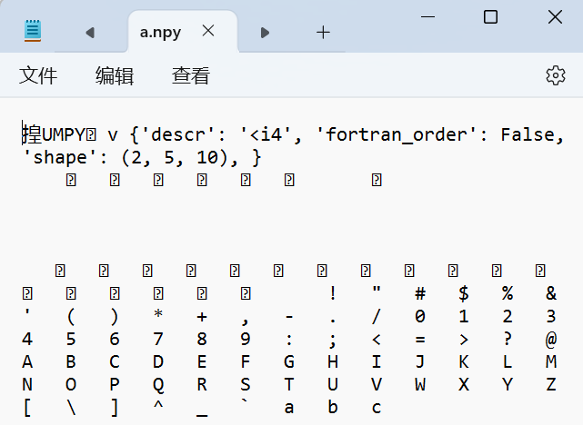

若数据只存在与py文件中，则考虑.npy文件

若数据需要与其他程序交互，则考虑csv或dat文件

## 2.4 NumPy常用函数

### 2.4.1 随机数生成

NumPy的random子库中的函数为ndarray提供随机数

`np.random.*`

| 函数                        | 说明                                                         |
| --------------------------- | ------------------------------------------------------------ |
| `rand(d0,d1,...,dn)`        | 根据维度信息d0-dn，创建随机浮点数数组，[0,1)均匀分布<br />每个元素从均匀分布总体中选取出来，即每个元素被抽取的概率相同 |
| `randn(d0,d1,...,dn)`       | 根据维度信息d0-dn创建随机数组，标准正态分布<br />每个元素从正态分布总体中选取出来 |
| `randint(low,[high,shape])` | 创建随机整数数组，范围为 [low,high)                          |
| `seed(s)`                   | 随机数种子，s是给定的种子值                                  |

```python
In [75]:  a = np.random.rand(2,3,4)

In [76]: a
Out[76]: 
array([[[0.45837884, 0.82893806, 0.18047275, 0.03248048],
        [0.93020038, 0.94885799, 0.39227657, 0.45814434],
        [0.13152265, 0.37268271, 0.22214262, 0.49515611]],

       [[0.81851534, 0.32840865, 0.07799763, 0.57159495],
        [0.58134676, 0.45702106, 0.75713087, 0.81451658],
        [0.11602932, 0.19518582, 0.53516332, 0.05679252]]])

In [78]: a = np.random.randn(2,3,4)

In [79]: a
Out[79]: 
array([[[ 1.19039369, -0.50135829, -1.34244396,  0.91445294],
        [-0.55127657, -0.36359796, -0.36445161,  1.32271641],
        [ 1.26946294,  1.40557906,  0.08226739, -0.58369293]],

       [[-0.48358501, -0.19845588,  1.48634899,  0.0732427 ],
        [ 0.74060483,  2.22572113, -0.79883423, -0.94264226],
        [-1.65189778,  1.42670806, -0.04063335, -0.99500735]]])


In [80]: b = np.random.randint(100,200,(2,3))

In [81]: b
Out[81]: 
array([[172, 106, 197],
       [179, 118, 158]])

In [82]: np.random.seed(10)

In [83]: np.random.randint(100,200,(2,3))
Out[83]: 
array([[109, 115, 164],
       [128, 189, 193]])

In [84]: np.random.seed(10)

In [85]: np.random.randint(100,200,(2,3))
Out[85]: 
array([[109, 115, 164],
       [128, 189, 193]])
```

- 当指定种子后，会生成相同的随机数序列

| 函数                           | 说明                                                         |
| ------------------------------ | ------------------------------------------------------------ |
| `shuffle(obj)`                 | 将数组obj的第0轴最外层维度进行随机排列，改变数组obj          |
| `permutation(obj)`             | 将数组obj的第0轴最外层维度随机排列，产生新的乱序数组，不改变obj |
| `choice(obj[,size,replace,p])` | 从一维数组obj中以概率p抽取元素，形成size形状的新数组，replace表示是否可重用元素，默认为True |

```python
In [86]: a = np.random.randint(100,200,(3,4))

In [87]: a
Out[87]: 
array([[129, 108, 173, 100],
       [140, 136, 116, 111],
       [154, 188, 162, 133]])

In [88]: np.random.shuffle(a)

In [89]: a
Out[89]: 
array([[140, 136, 116, 111],
       [154, 188, 162, 133],
       [129, 108, 173, 100]])
```

```python
In [94]: a = np.random.randint(100,200,(3,4))

In [95]: a
Out[95]: 
array([[112, 165, 131, 157],
       [136, 127, 118, 193],
       [177, 122, 123, 194]])

In [96]: np.random.permutation(a)
Out[96]: 
array([[177, 122, 123, 194],
       [136, 127, 118, 193],
       [112, 165, 131, 157]])

In [97]: a
Out[97]: 
array([[112, 165, 131, 157],
       [136, 127, 118, 193],
       [177, 122, 123, 194]])
```

```python
In [98]: a  = np.random.randint(100,200,8)

In [99]: a
Out[99]: array([128, 174, 188, 109, 115, 118, 180, 171])

In [100]: np.random.choice(a,(3,2))
Out[100]: 
array([[128, 109],
       [174, 180],
       [171, 109]])

In [101]: np.random.choice(a,(3,2),replace=False)
Out[101]: 
array([[180, 118],
       [109, 128],
       [188, 171]])

In [102]: np.random.choice(a,(3,2),p=a/np.sum(a)) # 元素值越大，被抽取的概率越高
Out[102]: 
array([[171, 188],
       [180, 188],
       [171, 188]])
```

| 函数                   | 说明                                                      |
| ---------------------- | --------------------------------------------------------- |
| uniform(low,high,size) | 元素服从指定均匀分布的数组,[low,high],size形状            |
| normal(loc,scale,size) | 元素服从指定正态分布的数组，loc均值,scale标准差，size形状 |
| poisson(lam,size)      | 元素服从指定泊松分布的数组，lam为随机事件发生率,size形状  |

```python
In [103]: np.random.normal(0,1,(3,4))
Out[103]: 
array([[-0.36225179, -1.12913125, -0.34971048, -1.05272652],
       [ 1.28227668, -0.17180538,  0.57765806, -1.47497488],
       [ 0.07878845,  0.91841365, -0.49269736,  0.09646237]])

In [104]: np.random.uniform(0,10,(3,4))
Out[104]: 
array([[3.57181759, 0.7961309 , 3.05459918, 3.30719312],
       [7.73830296, 0.39959209, 4.29492178, 3.14926872],
       [6.36491143, 3.4634715 , 0.43097356, 8.79915175]])
```

### 2.4.2 统计函数

> 对数组中信息进行统计

`np.*` 调用

| 函数                                | 说明                                              |
| ----------------------------------- | ------------------------------------------------- |
| `sum(a,axis=None)`                  | 计算数组a在给定轴axis上元素的和，axis整数或元组   |
| `mean(a,axis=None)`                 | 计算数组a在给定轴axis上元素的期望，axis整数或元组 |
| `average(a,axis=None,weights=None)` | 计算数组a在给定轴axis上元素的加权平均值           |
| `std(a,axis=None)`                  | 计算数组a在给定轴axis上元素的标准差               |
| `var(a,axis=None)`                  | 计算数组a在给定轴axis上元素的方差                 |

```python
In [13]: a = np.arange(15).reshape(3,5)

In [14]: a
Out[14]: 
array([[ 0,  1,  2,  3,  4],
       [ 5,  6,  7,  8,  9],
       [10, 11, 12, 13, 14]])

In [15]: np.sum(a)
Out[15]: 105

In [16]: np.sum(a,axis=(0,1))
Out[16]: 105

In [17]: np.sum(a,axis=0)
Out[17]: array([15, 18, 21, 24, 27])

In [18]: np.mean(a)
Out[18]: 7.0

In [19]: np.mean(a,axis=0)
Out[19]: array([5., 6., 7., 8., 9.])

In [20]: np.mean(a,axis=1)
Out[20]: array([ 2.,  7., 12.])

In [21]: np.average(a,axis=0,weights=[10,5,1])
Out[21]: array([2.1875, 3.1875, 4.1875, 5.1875, 6.1875])

In [22]: np.std(a)
Out[22]: 4.320493798938574

In [23]: np.var(a)
Out[23]: 18.666666666666668
```

| 函数                         | 说明                                        |
| ---------------------------- | ------------------------------------------- |
| `min(a)` , `max(a)`          | 计算数组a中元素的最小值、最大值             |
| `argmin(a)` , `argmax(a)`    | 计算数组a中元素最小值，最大值的扁平化后下标 |
| `unravel_index(index,shape)` | 根据shape将扁平化后下标index重塑为多维下标  |
| `ptp(a)`                     | 计算数组a中元素最大值与最小值的差           |
| `median(a)`                  | 计算数组a中元素的中位数                     |

```python
In [123]: b = np.arange(15,0,-1).reshape(3,5)

In [124]: b
Out[124]: 
array([[15, 14, 13, 12, 11],
       [10,  9,  8,  7,  6],
       [ 5,  4,  3,  2,  1]])

In [125]: np.max(b)
Out[125]: 15

In [126]: np.argmax(b)
Out[126]: 0

In [127]: np.unravel_index(np.argmax(b),b.shape)
Out[127]: (0, 0)

In [128]: np.ptp(b)
Out[128]: 14

In [129]: np.median(b)
Out[129]: 8.0
```

### 2.4.3 梯度函数

`np.gradient(f)` 计算数组f中元素的梯度

```python
In [130]: a = np.random.randint(0,20,(5))

In [131]: a
Out[131]: array([ 9, 12, 18, 17, 17])

In [132]: np.gradient(a)
Out[132]: array([ 3. ,  4.5,  2.5, -0.5,  0. ])
```

- 对于4.5，$\frac{(18-9)}{2}=4.5$
- 对于3，$\frac{12-9}{1=3}$

```python
In [134]: a
Out[134]: 
array([[16,  0, 31, 37,  9],
       [ 0, 38, 22, 32,  2],
       [ 3, 31, 35, 27, 18]])

In [135]: np.gradient(a)
Out[135]: 
[array([[-16. ,  38. ,  -9. ,  -5. ,  -7. ],#0轴梯度
        [ -6.5,  15.5,   2. ,  -5. ,   4.5],
        [  3. ,  -7. ,  13. ,  -5. ,  16. ]]),
 array([[-16. ,   7.5,  18.5, -11. , -28. ],#1轴梯度
        [ 38. ,  11. ,  -3. , -10. , -30. ],
        [ 28. ,  16. ,  -2. ,  -8.5,  -9. ]])]
```

## 2.5 图像与numpy

### 2.5.1 图像的数组表示

RGB色彩模式，形成三个通道，三个颜色通道的变化与叠加得到各种颜色

- R：图像上每个像素点红色通道取值范围，0-255
- G：图像上每个像素点绿色通道取值范围，0-255
- B：图像上每个像素点蓝色通道取值范围，0-255

#### PIL库

> 用于处理图像的第三方Python库，Python Image Library

安装：`pip install pillow`

导入：`from PIL import Image`

- Image为PIL库中一个图像的类

#### 图像的数组表示

图像是一个由像素组成的二维矩阵，每个元素是一个RGB值(三个字节表示一个像素点的RGB)

```python
In [32]: from PIL import Image

In [33]: import numpy as np

In [34]: im = np.array(Image.open("C:/Users/AmosTian/Pictures/1.png"))

In [35]: print(im.shape,im.dtype)
(717, 717, 3) uint8
# 高度axis=0
# 宽度axis=1
# RGB值axis=2
In [36]: im
Out[36]: 
array([#717<高>*717<宽>*3<RGB>
    [	
        [ 96, 116, 177],
        [ 94, 114, 175],
        [ 95, 115, 176],
        ...,
        [ 61,  96, 164],
        [ 62,  97, 165],
        [ 59,  94, 162]
    ],
    [	[ 97, 117, 178],
        [ 94, 114, 175],
        [ 95, 115, 176],
        ...,
        [ 60,  95, 163],
        [ 61,  96, 164],
        [ 59,  94, 162]
    ],
   ...,
    [	[ 23,  24,  22],
        [ 22,  24,  22],
        [ 23,  23,  26],
        ...,
        [ 23,  46,  88],
        [ 23,  46,  88],
        [ 23,  46,  88]
    ],
    [	[ 16,  18,  15],
        [ 19,  21,  20],
        [ 22,  23,  26],
        ...,
        [ 19,  42,  84],
        [ 20,  43,  85],
        [ 21,  44,  86]
    ]
], dtype=uint8)
```

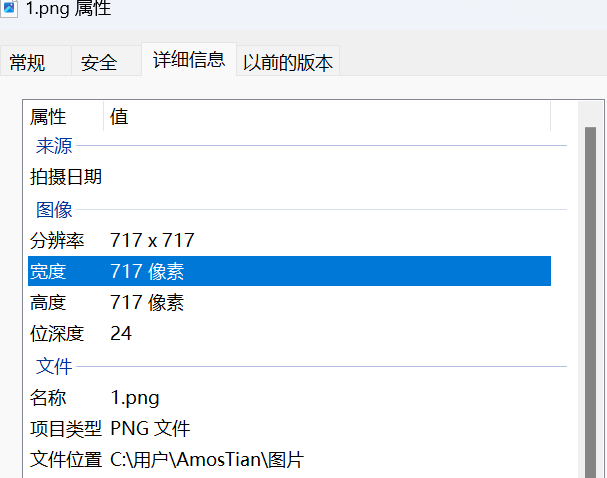

### 2.5.2 图像的变换

> 读入图像后，获取RGB值，保存为新的文件

```python
In [47]: from PIL import Image

In [48]: import numpy as np

In [49]: a = np.array(Image.open("C:/Users/AmosTian/Pictures/1.png"))

In [50]: a
Out[50]: 
array([[[ 96, 116, 177],
        [ 94, 114, 175],
        [ 95, 115, 176],
        ...,
        [ 61,  96, 164],
        [ 62,  97, 165],
        [ 59,  94, 162]],
       ...,

       [[ 19,  21,  17],
        [ 20,  22,  21],
        [ 24,  25,  27],
        ...,
        [ 23,  46,  88],
        [ 23,  46,  88],
        [ 23,  46,  88]],
       [[ 16,  18,  15],
        [ 19,  21,  20],
        [ 22,  23,  26],
        ...,
        [ 19,  42,  84],
        [ 20,  43,  85],
        [ 21,  44,  86]]], dtype=uint8)

In [51]: print(a.shape,a.dtype)
(1368, 2560, 3) uint8

In [52]: b = [255,255,255]-a

In [53]: im = Image.fromarray(b.astype('uint8'))

In [54]: im.save("C:/Users/AmosTian/Pictures/ch-1.png")
```


#### 灰度图变换

```python
In [59]: from PIL import Image

In [60]: import numpy as np

In [61]: a = np.array(Image.open("C:/Users/AmosTian/Pictures/1.png").convert("L"))# 将图像导入并转换为灰度图，并将其用数组表示

In [62]: b = 255-a

In [63]: im = Image.fromarray(b.astype('uint8'))#将数组转换为图像

In [64]: im.save("C:/Users/AmosTian/Pictures/ch-2.png")
```


```python
In [65]: c = (100/255)*a+150

In [66]: im = Image.fromarray(c.astype('uint8'))#将数组转换为图像

In [67]: im.save("C:/Users/AmosTian/Pictures/ch-3.png")
```


```python
In [68]: d = 255*(a/255)**2

In [69]: im = Image.fromarray(b.astype('uint8'))#将数组转换为图像

In [70]: im.save("C:/Users/AmosTian/Pictures/ch-4.png")
```


#### 手绘效果

特征分析：

- 黑白灰色
- 边界线重
- 相同或相近色彩趋于白色
- 略有光源效果

利用像素之间的梯度值和虚拟深度值对图像进行重构，根据灰度变换来模拟人类视觉明暗程度

```python
from PIL import Image
import numpy as np

a = np.array(Image.open("C:/Users/AmosTian/Pictures/1.png").convert("L")).astype('float')# 转换为灰度图像

depth=10.
grad = np.gradient(a) #取灰度图像的梯度值
grad_x,grad_y=grad #分别取横纵图像梯度值
grad_x = grad_x*depth/100.		#根据深度调整x和y方向的梯度值
grad_y = grad_y*depth/100.

# 构造x和y轴梯度的三位归一化单位坐标轴
A = np.sqrt(grad_x**2 + grad_y**2 + 1.)
uni_x = grad_x/A
uni_y = grad_y/A
uni_z = 1./A

# 光源效果
vec_el = np.pi/2.2 #光源的俯视角度，弧度值
vec_az= np.pi/4. #光源的方位角度，弧度值
dx = np.cos(vec_el)*np.cos(vec_az) #光源对x轴的影响
dy = np.cos(vec_el)*np.sin(vec_az) #光源对y轴的影响
dz = np.sin(vec_el)					#光源对z轴的影响
#梯度与光源相互作用，将梯度转换为灰度
b = 255*(dx*uni_x+dy*uni_y+dz*uni_z)
b.clip(0,255)

im = Image.fromarray(b.astype('uint8'))
im.save("C:/Users/AmosTian/Pictures/shouhui-1.png")
```


# 3. Matplotlib

## 3.1 介绍

> 由各种可视化类构成，`matplotlib.pyplot` 是各类可视化图形的命令子库，相当于快捷方式

导入 `import matplotlib.pyplot as plt`

```python
import matplotlib.pyplot as plt

plt.plot([3,1,4,5,2])
plt.ylabel("grade")
plt.savefig('test',dpi=600) #将图片保存为文件，默认为PNG，通过dpi修改图片质量
plt.show()
```

默认情况下，若输入是一维数组，则将其当做y轴数据，相应的x轴数据为其索引

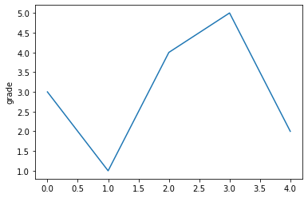

```python
# 同时控制x,y轴的值与范围

import matplotlib.pyplot as plt

plt.plot([0,2,4,6,8],[3,1,4,5,2]) #当plot()有两个参数，arg1表示X轴，arg2表示Y轴
plt.ylabel("grade")
plt.axis([-1,10,0,6]) #-1,10表示X轴区间，0,6表示Y轴区间
plt.show()
```

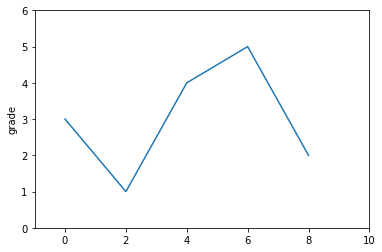

## 3.2 plot()

`plt.plot(x,y,format_string,**kwargs)`

- x：X轴数据，列表或数组

- y：Y轴数据，列表或数组

- format_string：控制曲线的格式字符串，可选

- **kwargs：第二组或更多(x,y,format_string)

  当绘制多条曲线时，各条曲线的参数x不能省略

```python
import numpy as np
import matplotlib.pyplot as plt

a = np.arange(10)

plt.plot(a,a*1,a,a*2,a,a*3,a,a*4)
plt.show()
```

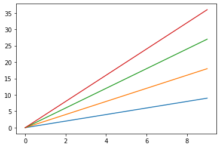

### 3.2.1 格式控制符format_string

```python
import numpy as np
import matplotlib.pyplot as plt

a = np.arange(10)

plt.plot(a,a*1,'go-',a,a*2,'rx',a,a*3,'*',a,a*4,'b-.')
plt.show()
```

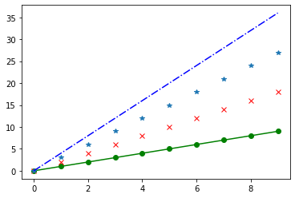

#### 颜色字符

| 颜色字符    | 说明           |
| ----------- | -------------- |
| `'b'`       | 蓝色           |
| `'g'`       | 绿色           |
| `'r'`       | 红色           |
| `'c'`       | 青绿色cyan     |
| `'m'`       | 洋红色 magenta |
| `'y'`       | 黄色           |
| `'k'`       | 黑色           |
| `'w'`       | 白色           |
| `'#008000'` | RGB颜色        |
| `'0.8'`     | 灰度值字符串   |

#### 点标记

| 标记字符 | 说明             |
| -------- | ---------------- |
| `.`      | 点标记           |
| `,`      | 像素标记(极小点) |
| `o`      | 实心圈标记       |
| `v`      | 倒三角标记       |
| `^`      | 上三角标记       |
| `>`      | 右三角标记       |
| `<`      | 左三角标记       |
| `1`      | 下花三角标记     |
| `2`      | 上花三角标记     |
| `3`      | 左花三角标记     |
| `4`      | 右花三角标记     |
| `s`      | 实心方形标记     |
| `p`      | 实心五角标记     |
| `*`      | 星形标记         |
| `h`      | 竖六边形标记     |
| `H`      | 横六边形标记     |
| `+`      | 十字标记         |
| `x`      | x标记            |
| `D`      | 菱形标记         |
| `d`      | 瘦菱形标记       |
| `|`      | 垂直线标记       |

#### 风格字符

| 风格字符 | 说明   |
| -------- | ------ |
| `'-'`    | 实线   |
| `'--'`   | 破折线 |
| `'-.'`   | 点划线 |
| `':'`    | 虚线   |
| `''''`   | 无线条 |

### 3.2.2 其他格式控制符

| 关键字参数               | 说明     |
| ------------------------ | -------- |
| `color='green'`          | 控制颜色 |
| `linestyle='dashed'`     | 线条风格 |
| `marker='0'`             | 标记风格 |
| `markerfacecolor='blue'` | 标记颜色 |
| `markersize=20`          | 标记尺寸 |

## 3.3 中文显示

> pyplot不支持中文，需要引入第三方库

### 3.3.1 改变matplot的全局字体

`matplotlib.rcParams[]` 可用于修改全局字体样式

```python
import matplotlib.pyplot as plt
import matplotlib

matplotlib.rcParams['font.family']='SimHei'
plt.plot([3,1,4,5,2])
plt.ylabel("纵轴(值)")
plt.show()
```

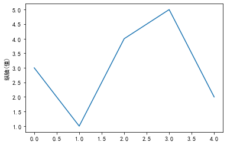

#### rcParams属性

| 属性            | 说明                                         |
| --------------- | -------------------------------------------- |
| `'font.family'` | 用于显示字体名                               |
| `'font.style'`  | 字体风格，正常 `'normal'` 或斜体 `'italic'`  |
| `'font.size'`   | 字体大小，整数字号或 `'large'` 、`'x-small'` |

##### 字体备选值

| 中文字体名   | 说明·    |
| ------------ | -------- |
| `'SimHei'`   | 黑体     |
| `'Kaiti'`    | 楷体     |
| `'LiSu'`     | 隶书     |
| `'FangSong'` | 仿宋     |
| `'YouYuann'` | 幼圆     |
| `'STSong'`   | 华文宋体 |

```python
import matplotlib.pyplot as plt
import matplotlib
import numpy as np

matplotlib.rcParams['font.family']='STSong'
matplotlib.rcParams['font.size']=20

a = np.arange(0.0,5.0,0.02)

plt.xlabel('横轴：时间')
plt.ylabel("纵轴：振幅")
plt.plot(a,np.cos(2*np.pi*a),'ro-.')
plt.show()
```

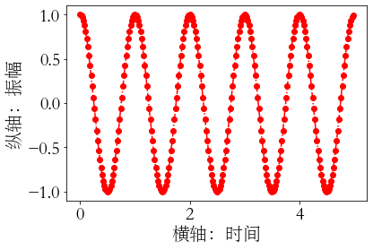

### 3.3.2 通过标签的局部属性

```python
import matplotlib.pyplot as plt
import numpy as np

a = np.arange(0.0,5.0,0.02)

plt.xlabel('横轴：时间',fontproperties='STSong',fontsize=20)
plt.ylabel("纵轴：振幅",fontproperties='STSong',fontsize=20)
plt.plot(a,np.cos(2*np.pi*a),'rx-.')
plt.show()
```

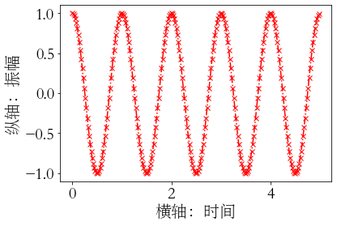

## 3.4 文本显示

| 函数             | 说明                     |
| ---------------- | ------------------------ |
| `plt.xlabel()`   | 对X轴增加文本标签        |
| `plt.ylabel()`   | 对Y轴增加文本标签        |
| `plt.title()`    | 对图形整体增加文本标题   |
| `plt.annotate()` | 在图形中增加带箭头的注解 |

```python
import matplotlib.pyplot as plt
import numpy as np

a = np.arange(0.0,5.0,0.02)

plt.plot(a,np.cos(2*np.pi*a),'r--')
plt.xlabel('横轴：时间',fontproperties='STSong',fontsize=20,color='green')
plt.ylabel("纵轴：振幅",fontproperties='STSong',fontsize=20)
plt.title(r'正弦波实例 $y=cos(2\pi x)$',fontproperties='STSong',fontsize=25)
plt.text(2,1,r'$\mu=100$',fontsize=15)

plt.axis([-1,6,-2,2])
plt.grid(True)
plt.show()
```

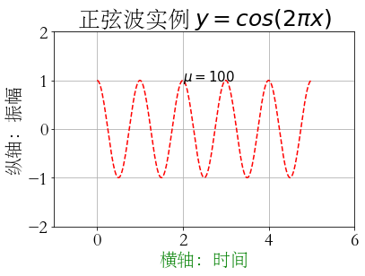

#### 带箭头注解

`plt.annotate(text,xy=arrow_crd_tuple,xytext=text_crd_tuple,arrowprops=dict())`

```python
import matplotlib.pyplot as plt
import numpy as np

a = np.arange(0.0,5.0,0.02)

plt.plot(a,np.cos(2*np.pi*a),'r--')
plt.xlabel('横轴：时间',fontproperties='STSong',fontsize=20,color='green')
plt.ylabel("纵轴：振幅",fontproperties='STSong',fontsize=20)
plt.title(r'正弦波实例 $y=cos(2\pi x)$',fontproperties='STSong',fontsize=25)
plt.annotate(r'$\mu=100$',xy=(2,1),xytext=(3,1.5),arrowprops=dict(facecolor='black',shrink=0.1,width=2))# shrink表示箭头两侧的空白间距

plt.axis([-1,6,-2,2])
plt.grid(True)
plt.show()
```

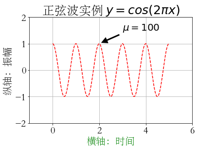

## 3.5 子绘图区域

### 3.5.1 subplot

`plt.subplot(nrows,ncols,plot_number)` ：在全局绘图区创建一个分区体系，并定位到 `plot_number` 指定的子绘图区域

`plt.subplot(3,2,4)`

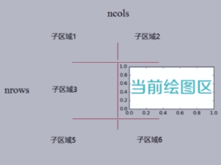

```python
import numpy as np
import matplotlib.pyplot as plt
def f(t):
    return np.exp(-t) * np.cos(2*np.pi*t)

a = np.arange(0.0, 5.0, 0.02)
plt.subplot(211)
plt.plot(a,f(a))

plt.subplot(2,1,2)
plt.plot(a, np.cos(2*np.pi*a),'r--')
plt.show()
```

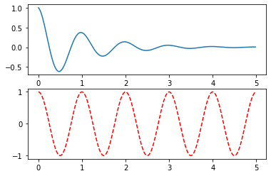

### 3.5.2 subplot2grid

> 理念：设计网格，选中网格，确定选中行列区域数量，网格编号从0开始

`plt.subplot2grid(gridSpec,CurSpec,colspan=1,rowspan=1)`

```python
plt.subplot2grid((3,3),(0,0),colspan=3) #表示将绘图区域分为3*3=9个网格，选中从(0.0)开始的网格，占3列网格
```

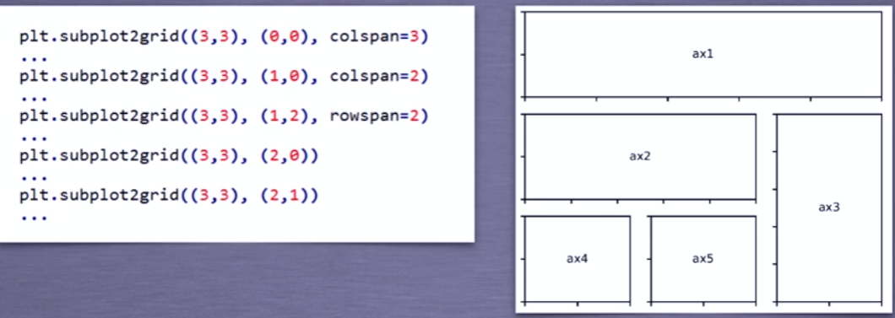

### 3.5.3 gridspec类

```python
import matplotlib.gridspec as gridspec

gs = gridspec.GridSpec(3,3)

ax1 = plt.subplot(gs[0,:])		#横向第0行，纵向全部列
ax2 = plt.subplot(gs[1,:-1])	#横向第1行，纵向到最后一列，但不包括最后一列
ax3 = plt.subplot(gs[1:,-1])	#横向第一行开始到结束，纵向最后一列
ax4 = plt.subplot(gs[2,0])		#横向第二行，纵向第1列
ax5 = plt.subplot(gs[2，1])		#横向第2行，纵向第一列
```

## 3.6 pyplot图表绘制函数

| 函数                                 | 说明             |
| ------------------------------------ | ---------------- |
| `plt.plot(x,y,fmt,...)`              | 绘制坐标图       |
| `plt.boxplot(data,notch,position)`   | 绘制箱形图       |
| `plt.bar(left,height,width,bottom)`  | 绘制条形图       |
| `plt.barh(width,bottom,left,height)` | 横向条形图       |
| `plt.polar(theta,r)`                 | 极坐标图         |
| `plt.pie(data,explode)`              | 饼图             |
| `plt.psd(x,NFFT=256,pad_to,Fs)`      | 功率谱密度图     |
| `plt.specgram(x,NFFT=256,pad_to,F)`  | 谱图             |
| `plt.cohere(x,y,NFFT=256,Fs)`        | X-Y的相关性图像  |
| `plt.scatter(x,y)`                   | 散点图，x和y相同 |
| `plt.step(x,y,where)`                | 步阶图           |
| `plt.hist(x,bins,normed)`            | 直方图           |
| `plt.contour(X,Y,Z,N)`               | 等值图           |
| `plt.vlines()`                       | 垂直图           |
| `plt.stem(x,y,linefmt,markerfmt)`    | 柴火图           |
| `plt.plot_date()`                    | 数据日期         |

### 3.6.1 饼图

```python
import matplotlib.pyplot as plt

labels = 'Frogs','Hogs','Dogs','Logs'
sizes = [15,30,45,10]
explode = (0,0.1,0,0)

plt.pie(sizes,explode=explode,labels=labels,autopct='%1.1f%%',shadow=False,startangle=90)
# sizes：各部分数据
# explode：各部分突出程度
# labels：各部分标签
# autopic：各部分百分数显示方式
# startangle：起始角度
plt.show()
```

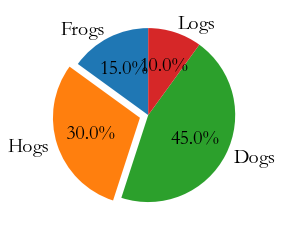

### 3.6.2 直方图

```python
import numpy as np
import matplotlib.pyplot as plt

np.random.seed(0)
mu,sigma = 100,20
a = np.random.normal(mu,sigma,size=100)
plt.hist(a,20,histtype='stepfilled',facecolor='b',alpha=0.75)
#bins：表示直方图中直方的个数，即区间等分的个数

plt.show()
```

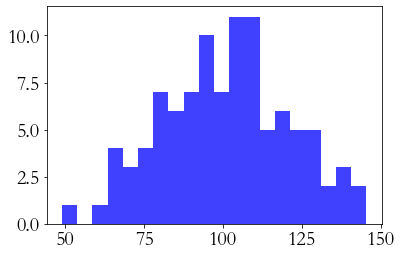

```python
import numpy as np
import matplotlib.pyplot as plt
import matplotlib.gridspec as gridspec

gs = gridspec.GridSpec(1,3)

plt.subplot(gs[0,0])
np.random.seed(0)
mu,sigma = 100,20
a = np.random.normal(mu,sigma,size=100)
plt.hist(a,20,histtype='stepfilled',facecolor='b',alpha=0.75)


plt.subplot(gs[0,1])
np.random.seed(0)
mu,sigma = 100,20
a = np.random.normal(mu,sigma,size=100)
plt.hist(a,10,histtype='stepfilled',facecolor='b',alpha=0.75)

plt.subplot(gs[0,2])
np.random.seed(0)
mu,sigma = 100,20
a = np.random.normal(mu,sigma,size=100)
plt.hist(a,40,histtype='stepfilled',facecolor='b',alpha=0.75)

plt.show()
```


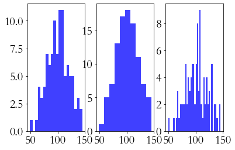

### 3.6.3 极坐标绘制

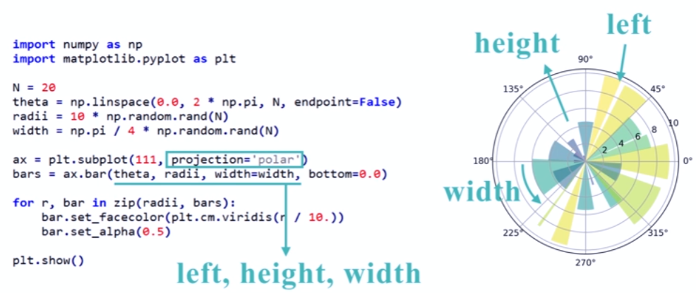

### 3.6.4 散点图

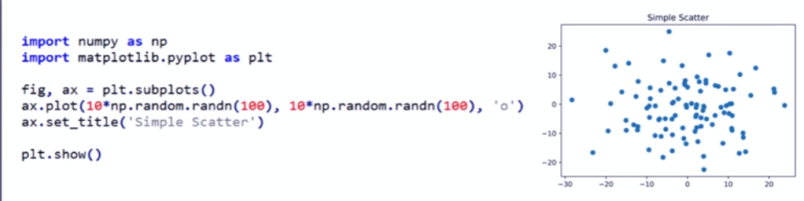

# 4. pandas

> 提供高性能易用数据类型和分析工具

- 便于操作数据的数据类型——数据表示

  基于ndarray的数据类型：Seies(一维数据类型)，DataFrame(多维数据类型)

- 提供数据的分析函数和分析工具——数据分析

  基本操作

  运算操作

  特征类操作

  关联类操作

`import pandas as pd`

- Pandas基于NumPy实现，常与NumPy和Matplotlib一起使用

| NumPy                                  | Pandas             |
| -------------------------------------- | ------------------ |
| 基础数据类型                           | 扩展数据类型       |
| 关注数据的结构表达(数据如何存储为变量) | 关注数据的应用表达 |
| 维度：数据间关系                       | 数据与索引间关系   |

## 4.1 数据类型

### 4.1.1 Series类型

Series=index+values

- index为Index类型，values为ndarray类型
- Series会为每个数据关联索引，可以是自动索引(从0开始)；也可以是自定义索引

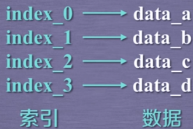

```python
In [1]: import pandas as pd

In [2]: a = pd.Series([9,8,7,6,1,2])

In [3]: a
Out[3]: 
0    9
1    8
2    7
3    6
dtype: int64
    
#左侧列为自动索引
#NumPy中的数据类型
```

**支持自定义索引**

```python
In [5]: a = pd.Series([9,8,7,6],index = ['a','b','c','d'])

In [6]: a
Out[6]: 
a    9
b    8
c    7
d    6
dtype: int64
```

####  创建

- 列表创建：index与列表元素个数一致，index缺省则生成自动索引
- 标量创建：index表述Series类型的尺寸，index不能缺省
- 字典创建：字典的“键”是index，自定义index从字典中选择值
- ndarray创建：索引和数据都可以通过ndarray类型创建

##### 标量创建

**标量创建，则索引不能省略** ：Series几个元素构成，需要由索引信息给出

```python
In [9]: s = pd.Series(5,index=['a','b','c'])

In [10]: s
Out[10]: 
a    5
b    5
c    5
dtype: int64
```

##### 字典创建

```python
In [11]: s = pd.Series({'a':9,'c':8,'e':7})

In [12]: s
Out[12]: 
a    9
c    8
e    7
dtype: int64
```

**可以通过自定义索引从字典搜索对应值**

```python
In [13]: s = pd.Series({'a':9,'c':8,'e':7},index=['a','b','c','d','e'])

In [14]: s
Out[14]: 
a    9.0
b    NaN
c    8.0
d    NaN
e    7.0
dtype: float64
```

##### ndarray创建

```python
In [16]: n = pd.Series(np.arange(5),index=np.arange(9,4,-1))

In [17]: n
Out[17]: 
9    0
8    1
7    2
6    3
5    4
dtype: int32
```

#### 基本操作

Series整体类似于字典操作，对于values的操作类似与ndarray操作 

```python 
In [18]: b = pd.Series([9,8,7,6],index=['c','a','d','b'])

In [19]: b
Out[19]: 
c    9
a    8
d    7
b    6
dtype: int64

In [20]: b.index	#获取index，输出类型为Index类型
Out[20]: Index(['c', 'a', 'd', 'b'], dtype='object')

In [21]: b.values	#获取values，输出类型为ndarray类型
Out[21]: array([9, 8, 7, 6], dtype=int64)
```

自动索引与自定义索引并存，但一个操作中不能混用两种索引方式

```python
In [28]: b[2]
Out[28]: 7

In [29]: b['d']
Out[29]: 7

In [30]: b[['c','d','a']]
Out[30]: 
c    9
d    7
a    8
dtype: int64

In [31]: b[['c','d',0]]
Traceback (most recent call last):

  Cell In[31], line 1
    b[['c','d',0]]

  File D:\anaconda3\lib\site-packages\pandas\core\indexes\base.py:5941 in _raise_if_missing
    raise KeyError(f"{not_found} not in index")

KeyError: '[0] not in index'
```

##### 类似于ndarray的操作

- 索引方式都是 `[]`
- 运算和操作可用于Series类型
- 可通过自定义索引的列表进行切片
- 可通过自动索引进行切片，若存在自定义索引，则一同被切片

```python
In [32]: b
Out[32]: 
c    9
a    8
d    7
b    6
dtype: int64

In [33]: b[3]
Out[33]: 6

In [34]: b[:3]
Out[34]: 
c    9
a    8
d    7
dtype: int64

In [35]: b[b>b.median()]
Out[35]: 
c    9
a    8
dtype: int64

In [36]: np.exp(b)
Out[36]: 
c    8103.083928
a    2980.957987
d    1096.633158
b     403.428793
dtype: float64
```

##### 类似于字典的操作

- 通过自定义索引访问
- 保留字 `in` 操作：判断键是否在自定义索引列表中
- 使用 `.get(arg1,arg2)` 方法：根据arg1(键)提取值，若不存在则返回arg2

```python
In [37]: b
Out[37]: 
c    9
a    8
d    7
b    6
dtype: int64

In [38]: b['b']
Out[38]: 6

In [39]: 'c' in b
Out[39]: True

In [40]: 0 in b
Out[40]: False

In [41]: b.get('f',-1)
Out[41]: -1
```

##### 索引对齐操作

Series+Series：在运算过程中会自动对齐相同索引的数据

```python
In [44]: a = pd.Series([1,2,3],index=['c','b','e'])

In [45]: b = pd.Series([9,8,7,6],index=['a','b','c','d'])

In [46]: a+b
Out[46]: 
a     NaN
b    10.0
c     8.0
d     NaN
e     NaN
dtype: float64
```

#### Series类型的name属性

Series对象和索引都可以有一个名字，存在 `.name` 中

```python
In [48]: b.name='Series对象'

In [49]: b.index.name='索引名'

In [50]: b
Out[50]: 
索引名
a    9
b    8
c    7
d    6
Name: Series对象, dtype: int64
```

#### 修改

Series对象可以随时修改并即刻生效

```python
In [51]: b
Out[51]: 
索引名
a    9
b    8
c    7
d    6
Name: Series对象, dtype: int64

In [52]: b.name='New name'

In [53]: b
Out[53]: 
索引名
a    9
b    8
c    7
d    6
Name: New name, dtype: int64

In [54]: b['a']=10

In [55]: b
Out[55]: 
索引名
a    10
b     8
c     7
d     6
Name: New name, dtype: int64

In [57]: b[['b','c']]=20

In [58]: b
Out[58]: 
索引名
a    10
b    20
c    20
d     6
Name: New name, dtype: int64
```

### 4.1.2 DataFrame

DataFrame=行列索引+二维数据

> 由共用相同索引的一组列组成，每列值类型可以不同

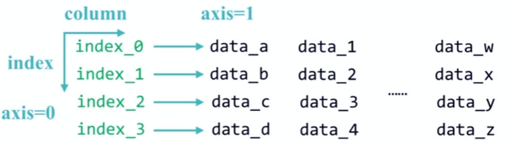

#### 创建

- 二维ndarray对象
- 由一维ndarray、列表、字典、元组或Series构成的字典
- Series类型
- 其他DataFrame类型

##### ndarray创建

```python
In [61]: d = pd.DataFrame(np.arange(10).reshape(2,5))

In [62]: d
Out[62]: 
   0  1  2  3  4
0  0  1  2  3  4
1  5  6  7  8  9 
```

生成自动行索引与自动列索引

##### 字典+Series创建

- 将字典中的键转换为列索引，index为行索引

```python
In [74]: dct={'one':pd.Series([1,2,3],index=['a','b','c']),
    ...: 'two':pd.Series([9,8,7,6],index=['a','b','c','d'])}

In [75]: d = pd.DataFrame(dct)

In [76]: d
Out[76]: 
   one  two#列索引 columns
a  1.0    9
b  2.0    8
c  3.0    7
d  NaN    6
#行索引index
```

字典中数据根据行索引index和列索引columns自动补齐

```python
In [79]: pd.DataFrame(dct,index=['b','c','d'],columns=['two','three'])
Out[79]: 
   two three
b    8   NaN
c    7   NaN
d    6   NaN
```

##### 字典+列表

```python
In [80]: dl = {'one':[1,2,3,4],'two':[9,8,7,6]}

In [81]: d = pd.DataFrame(dl,index=['a','b','c','d'])

In [82]: d
Out[82]: 
   one  two
a    1    9
b    2    8
c    3    7
d    4    6
```

#### 基本操作

```python
In [88]: dl = {"环比":[101.5,101.2,101.3,102.0,100.1],
    ...: "同比":[120.7,127.3,119.4,140.9,101.4],
    ...: "定基":[121.4,127.8,120.0,145.5,101.6]}

In [89]: d = pd.DataFrame(dl,index=["北京","上海","广州","深圳","沈阳"])

In [90]: d
Out[90]: 
       环比     同比     定基
北京  101.5  120.7  121.4
上海  101.2  127.3  127.8
广州  101.3  119.4  120.0
深圳  102.0  140.9  145.5
沈阳  100.1  101.4  101.6

In [91]: d.index
Out[91]: Index(['北京', '上海', '广州', '深圳', '沈阳'], dtype='object')

In [92]: d.columns
Out[92]: Index(['环比', '同比', '定基'], dtype='object')

In [93]: d.values
Out[93]: 
array([[101.5, 120.7, 121.4],
       [101.2, 127.3, 127.8],
       [101.3, 119.4, 120. ],
       [102. , 140.9, 145.5],
       [100.1, 101.4, 101.6]])
```

##### 索引获取数据

`DF.列索引` ：获取指定列数据

`DF.行索引` ：获取指定行索引

```python
In [114]: d["同比"]
Out[114]: 
北京    120.7
上海    127.3
广州    119.4
深圳    140.9
沈阳    101.4
Name: 同比, dtype: float64

In [115]: d.loc["上海"]
Out[115]: 
环比    101.2
同比    127.3
定基    127.8
Name: 上海, dtype: float64

In [116]: d["同比"]["上海"]
Out[116]: 127.3
```

DataFrame索引方式为，先通过列索引(键)获取某一列数据(某个Series)，再通过行索引(index)获取 Series 中的某个数据

## 4.2 数据类型操作

操作索引即操作数据

- 重新索引：增加或重排索引 `obj.reindex()`
- 数据删除：`drop`
- 算术运算 
- 比较运算

### 4.2.1 索引操作

#### 重新索引

```python
In [117]: d
Out[117]: 
       环比     同比     定基
北京  101.5  120.7  121.4
上海  101.2  127.3  127.8
广州  101.3  119.4  120.0
深圳  102.0  140.9  145.5
沈阳  100.1  101.4  101.6

In [118]: d.reindex(index=['上海','广州','北京','深圳','沈阳'])
Out[118]: 
       环比     同比     定基
上海  101.2  127.3  127.8
广州  101.3  119.4  120.0
北京  101.5  120.7  121.4
深圳  102.0  140.9  145.5
沈阳  100.1  101.4  101.6

In [119]: d.reindex(columns=["同比",'环比','定基'])
Out[119]: 
       同比     环比     定基
北京  120.7  101.5  121.4
上海  127.3  101.2  127.8
广州  119.4  101.3  120.0
深圳  140.9  102.0  145.5
沈阳  101.4  100.1  101.6
```

`obj.reindex(index,columns,fill_value,method,limit,copy)`

- index：重排后的行索引列表——Index类型
- columns：重排后的列索引列表——Index类型
- fill_value：填充缺失位置的值——int或int列表
- method："ffill"：当前值由前值填充，"bfill"：当前值由后值填充
- limit：最大填充量
- copy：默认True，生成新的对象；False，新旧相等不复制

#### 索引类型操作

DataFrame中的行索引和列索引类型都是 Index，Index对象是不可修改类型

| 方法                      | 说明                                    |
| ------------------------- | --------------------------------------- |
| `idx.append(Index)`       | 连接另一个Index对象，产生新的Index对象  |
| `idx.diff(Index)`         | 计算差集，产生新的Index对象             |
| `idx.intersection(Index)` | 计算交集                                |
| `idx.union(Index)`        | 计算并集                                |
| `idx.delete(loc)`         | 删除loc位置的元素,loc：int或list of int |
| `idx.insert(loc,e)`       | 在loc位置插入一个元素e                  |

##### 插入新列

```python
In [120]: newc = d.columns.insert(3,"新增") #生成新的Series

In [123]: newc
Out[123]: Index(['环比', '同比', '定基', '新增'], dtype='object')
    
In [121]: newd = d.reindex(columns=newc,fill_value=200)

In [122]: newd
Out[122]: 
       环比     同比     定基   新增
北京  101.5  120.7  121.4  200
上海  101.2  127.3  127.8  200
广州  101.3  119.4  120.0  200
深圳  102.0  140.9  145.5  200
沈阳  100.1  101.4  101.6  200
```

##### 删除列

```python
In [134]: newd
Out[134]: 
       环比     同比     定基   新增
北京  101.5  120.7  121.4  200
上海  101.2  127.3  127.8  200
广州  101.3  119.4  120.0  200
深圳  102.0  140.9  145.5  200
沈阳  100.1  101.4  101.6  200

In [135]: newd.columns.delete(3)
Out[135]: Index(['环比', '同比', '定基'], dtype='object')
```

##### 插入行

```python
In [165]: newdf = newd.reindex(index=newd.index.insert(5,"newrow"),columns=newd.columns.delete(1))

In [166]: newdf
Out[166]: 
           环比     定基     新增
北京      101.5  121.4  200.0
上海      101.2  127.8  200.0
广州      101.3  120.0  200.0
深圳      102.0  145.5  200.0
沈阳      100.1  101.6  200.0
newrow    NaN    NaN    NaN

In [167]: newdf.ffill()
Out[167]: 
           环比     定基     新增
北京      101.5  121.4  200.0
上海      101.2  127.8  200.0
广州      101.3  120.0  200.0
深圳      102.0  145.5  200.0
沈阳      100.1  101.6  200.0
newrow  100.1  101.6  200.0
```

##### .drop()

`.drop()` 删除Series和DataFrame指定行或列索引

```python
In [172]: a = pd.Series([9,8,7,6],index=['a','b','c','d'])

In [173]: a
Out[173]: 
a    9
b    8
c    7
d    6
dtype: int64

In [174]: a.drop(['b','d'])
Out[174]: 
a    9
c    7
dtype: int64
```

```python
In [175]: dl = {"环比":[101.5,101.2,101.3,102.0,100.1],
     ...: "同比":[120.7,127.3,119.4,140.9,101.4],
     ...: "定基":[121.4,127.8,120.0,145.5,101.6]}

In [176]: d = pd.DataFrame(dl,index=["北京","上海","广州","深圳","沈阳"])

In [177]: d
Out[177]: 
       环比     同比     定基
北京  101.5  120.7  121.4
上海  101.2  127.3  127.8
广州  101.3  119.4  120.0
深圳  102.0  140.9  145.5
沈阳  100.1  101.4  101.6

In [178]: d.drop("北京")
Out[178]: 
       环比     同比     定基
上海  101.2  127.3  127.8
广州  101.3  119.4  120.0
深圳  102.0  140.9  145.5
沈阳  100.1  101.4  101.6

In [179]: d.drop("同比",axis=1) # 删除键，则需要指定1轴
Out[179]: 
       环比     定基
北京  101.5  121.4
上海  101.2  127.8
广州  101.3  120.0
深圳  102.0  145.5
沈阳  100.1  101.6
```

### 4.2.2 数据类型运算

#### 算术运算

- 同秩数据：先进行索引对齐(NaN填充)，对齐后相同行索引才进行运算，默认产生浮点数
- 异秩数据：广播运算，低维数据会作用到高维数据的每个元素上

| 方法                      | 说明     |
| ------------------------- | -------- |
| `.add(d,fill_value,axis)` | 加法运算 |
| `.sub(d,**args)`          | 减法运算 |
| `.mul(d,**args)`          | 乘法运算 |
| `.div(d,**args)`          | 除法运算 |

##### 同秩运算

四则运算产生新的对象

```python
In [183]: a = pd.DataFrame(np.arange(12).reshape(3,4))

In [184]: a
Out[184]: 
   0  1   2   3
0  0  1   2   3
1  4  5   6   7
2  8  9  10  11

In [185]: b = pd.DataFrame(np.arange(20).reshape(4,5))

In [186]: b
Out[186]: 
    0   1   2   3   4
0   0   1   2   3   4
1   5   6   7   8   9
2  10  11  12  13  14
3  15  16  17  18  19

In [187]: a+b
Out[187]: 
      0     1     2     3   4
0   0.0   2.0   4.0   6.0 NaN
1   9.0  11.0  13.0  15.0 NaN
2  18.0  20.0  22.0  24.0 NaN
3   NaN   NaN   NaN   NaN NaN
```

**同秩但维度不同，消除NaN**

```python
In [188]:  b.add(a,fill_value=100)
Out[188]: 
       0      1      2      3      4
0    0.0    2.0    4.0    6.0  104.0
1    9.0   11.0   13.0   15.0  109.0
2   18.0   20.0   22.0   24.0  114.0
3  115.0  116.0  117.0  118.0  119.0
```

##### 异秩运算

需要调用函数进行四则运算

不同维度间广播运算，二维与一维的运算默认发生在1轴上

```python
In [192]: c = pd.Series(np.arange(4))

In [193]: c
Out[193]: 
0    0
1    1
2    2
3    3
dtype: int32

In [194]: c-10
Out[194]: 
0   -10
1    -9
2    -8
3    -7
dtype: int32

In [191]: b
Out[191]: 
    0   1   2   3   4
0   0   1   2   3   4
1   5   6   7   8   9
2  10  11  12  13  14
3  15  16  17  18  19
    
In [195]: b-c
Out[195]: 
      0     1     2     3   4
0   0.0   0.0   0.0   0.0 NaN
1   5.0   5.0   5.0   5.0 NaN
2  10.0  10.0  10.0  10.0 NaN
3  15.0  15.0  15.0  15.0 NaN
```

可以通过四则运算方法的 `axis` 指定参与运算的轴

```python
In [196]: b.sub(c,axis=0)
Out[196]: 
    0   1   2   3   4
0   0   1   2   3   4
1   4   5   6   7   8
2   8   9  10  11  12
3  12  13  14  15  16
```

#### 比较运算

只能比较相同索引的运算，不进行补齐，即必须是同尺寸比较

不同秩相同尺寸之间的运算为广播运算

采用 `>,<,> =,< =,! = ,==` 进行二元运算产生布尔对象

```python
In [199]: a
Out[199]: 
   0  1   2   3
0  0  1   2   3
1  4  5   6   7
2  8  9  10  11

In [200]: d = pd.DataFrame(np.arange(12,0,-1).reshape(3,4))

In [201]: d
Out[201]: 
    0   1   2  3
0  12  11  10  9
1   8   7   6  5
2   4   3   2  1

In [202]: a > d
Out[202]: 
       0      1      2      3
0  False  False  False  False
1  False  False  False   True
2   True   True   True   True

In [203]: a == d
Out[203]: 
       0      1      2      3
0  False  False  False  False
1  False  False   True  False
2  False  False  False  False
```

##### 异秩同尺寸

```python
In [204]: a
Out[204]: 
   0  1   2   3
0  0  1   2   3
1  4  5   6   7
2  8  9  10  11

In [205]: c = pd.Series(np.arange(4))

In [206]: c
Out[206]: 
0    0
1    1
2    2
3    3
dtype: int32

In [207]: a > c
Out[207]: 
       0      1      2      3
0  False  False  False  False
1   True   True   True   True
2   True   True   True   True

In [208]: c > 0
Out[208]: 
0    False
1     True
2     True
3     True
dtype: bool
```

## 4.3 数据操作

### 4.3.1 数据排序

- 索引排序
- 值排序

#### 索引排序

`obj.sort_index(axis=,ascending=True)` 在指定轴上进行排序，默认升序

```python
In [212]: b = pd.DataFrame(np.arange(20).reshape(4,5),index=['c','a','b','d'])

In [213]: b
Out[213]: 
    0   1   2   3   4
c   0   1   2   3   4
a   5   6   7   8   9
b  10  11  12  13  14
d  15  16  17  18  19

In [214]: b.sort_index()
Out[214]: 
    0   1   2   3   4
a   5   6   7   8   9
b  10  11  12  13  14
c   0   1   2   3   4
d  15  16  17  18  19

In [215]: b.sort_index(ascending=False)
Out[215]: 
    0   1   2   3   4
d  15  16  17  18  19
c   0   1   2   3   4
b  10  11  12  13  14
a   5   6   7   8   9

In [216]: b.sort_index(axis=1,ascending=False)
Out[216]: 
    4   3   2   1   0
c   4   3   2   1   0
a   9   8   7   6   5
b  14  13  12  11  10
d  19  18  17  16  15
```

#### 值排序

`Series.sort_values(axis=0,ascending=True)` 指定轴上的数据，默认对0轴元素升序

`DataFrame.sort_values(by,axis=0,ascending=Trye)` 指定键上0轴升序排序

```python
In [217]: b
Out[217]: 
    0   1   2   3   4
c   0   1   2   3   4
a   5   6   7   8   9
b  10  11  12  13  14
d  15  16  17  18  19

In [218]: b.sort_values(2,ascending=False)
Out[218]: 
    0   1   2   3   4
d  15  16  17  18  19
b  10  11  12  13  14
a   5   6   7   8   9
c   0   1   2   3   4

In [219]: b.sort_values('a',axis=1,ascending=False)
Out[219]: 
    4   3   2   1   0
c   4   3   2   1   0
a   9   8   7   6   5
b  14  13  12  11  10
d  19  18  17  16  15
```

**NaN统一放在排序末尾**

```python
In [227]: b
Out[227]: 
    0   1   2   3   4
c   0   1   2   3   4
a   5   6   7   8   9
b  10  11  12  13  14
d  15  16  17  18  19

In [228]: a = pd.DataFrame(np.arange(12).reshape(3,4),index=['a','b','c'])

In [229]: c = a+b

In [230]: c
Out[230]: 
      0     1     2     3   4
a   5.0   7.0   9.0  11.0 NaN
b  14.0  16.0  18.0  20.0 NaN
c   8.0  10.0  12.0  14.0 NaN
d   NaN   NaN   NaN   NaN NaN

In [231]: c.sort_values(2,ascending=False)
Out[231]: 
      0     1     2     3   4
b  14.0  16.0  18.0  20.0 NaN
c   8.0  10.0  12.0  14.0 NaN
a   5.0   7.0   9.0  11.0 NaN
d   NaN   NaN   NaN   NaN NaN

In [232]: c.sort_values('a',axis=1,ascending=False)
Out[232]: 
      3     2     1     0   4
a  11.0   9.0   7.0   5.0 NaN
b  20.0  18.0  16.0  14.0 NaN
c  14.0  12.0  10.0   8.0 NaN
d   NaN   NaN   NaN   NaN NaN
```

### 4.3.2 基本统计分析

#### 基本统计方法

| 方法                  | 说明                             |
| --------------------- | -------------------------------- |
| `.sum()`              | 计算数据的总和，按0轴算          |
| `.count()`            | 非NaN值的数量                    |
| `.mean()` `.median()` | 计算数据的算术平均值、算术中位数 |
| `.var()` `.std()`     | 计算数据的方差、标准差           |
| `.min()` `.max()`     | 计算数据的最小值、最大值         |

`.describe()` ：针对0轴的统计信息汇总

```python
In [237]: a = pd.Series(np.arange(4))

In [238]: a.describe()
Out[238]: 
count    4.000000
mean     1.500000
std      1.290994
min      0.000000
25%      0.750000
50%      1.500000
75%      2.250000
max      3.000000
dtype: float64

In [239]: type(a.describe())
Out[239]: pandas.core.series.Series

In [240]: a.describe()['count']
Out[240]: 4.0

In [241]: a.describe()['max']
Out[241]: 3.0
```

 ```python
 In [234]: b
 Out[234]: 
     0   1   2   3   4
 c   0   1   2   3   4
 a   5   6   7   8   9
 b  10  11  12  13  14
 d  15  16  17  18  19
 
 In [235]: b.describe()
 Out[235]: 
                0          1          2          3          4
 count   4.000000   4.000000   4.000000   4.000000   4.000000
 mean    7.500000   8.500000   9.500000  10.500000  11.500000
 std     6.454972   6.454972   6.454972   6.454972   6.454972
 min     0.000000   1.000000   2.000000   3.000000   4.000000
 25%     3.750000   4.750000   5.750000   6.750000   7.750000
 50%     7.500000   8.500000   9.500000  10.500000  11.500000
 75%    11.250000  12.250000  13.250000  14.250000  15.250000
 max    15.000000  16.000000  17.000000  18.000000  19.000000
 
 In [243]: b.describe().loc['max']
 Out[243]: 
 0    15.0
 1    16.0
 2    17.0
 3    18.0
 4    19.0
 Name: max, dtype: float64
 
 In [244]: b.describe()[2]
 Out[244]: 
 count     4.000000
 mean      9.500000
 std       6.454972
 min       2.000000
 25%       5.750000
 50%       9.500000
 75%      13.250000
 max      17.000000
 Name: 2, dtype: float64
 ```

#### 适用于Series类型

| 方法                    | 说明                                               |
| ----------------------- | -------------------------------------------------- |
| `.argmin()` `.argmax()` | 计算数据最大值、最小值所在位置的索引(自动索引)     |
| `.idxmin()` `.idxmax()` | 计算数据最大值、最小值所在位置的索引（自定义索引） |

### 4.3.3 累计统计分析

#### 基本方法

| 方法         | 说明       |
| ------------ | ---------- |
| `.cumsum()`  | 累加和     |
| `.cumprod()` | 累计乘     |
| `.cummax()`  | 累计最大值 |
| `.cummin()`  | 累计最小值 |

```python
In [245]: b
Out[245]: 
    0   1   2   3   4
c   0   1   2   3   4
a   5   6   7   8   9
b  10  11  12  13  14
d  15  16  17  18  19

In [246]: b.cumsum()
Out[246]: 
    0   1   2   3   4
c   0   1   2   3   4
a   5   7   9  11  13
b  15  18  21  24  27
d  30  34  38  42  46

In [247]: b.cumprod()
Out[247]: 
   0     1     2     3     4
c  0     1     2     3     4
a  0     6    14    24    36
b  0    66   168   312   504
d  0  1056  2856  5616  9576
```

#### 滚动计算

| 方法                       | 说明                                |
| -------------------------- | ----------------------------------- |
| `.rolling(w).sum()`        | 依次计算相邻w个元素的和             |
| `.rolling(w).mean()`       | 依次计算相邻w个元素的平均值         |
| `.rolling(w).var()`        | 依次计算相邻w个元素的方差           |
| `.rolling(w).std()`        | 依次计算相邻w个元素的标准差         |
| `.rolling(w).min() .max()` | 依次计算相邻w个元素的最大值和最小值 |

```python
In [248]: b
Out[248]: 
    0   1   2   3   4
c   0   1   2   3   4
a   5   6   7   8   9
b  10  11  12  13  14
d  15  16  17  18  19

In [249]: b.rolling(2).sum()
Out[249]: 
      0     1     2     3     4
c   NaN   NaN   NaN   NaN   NaN
a   5.0   7.0   9.0  11.0  13.0
b  15.0  17.0  19.0  21.0  23.0
d  25.0  27.0  29.0  31.0  33.0

In [251]: b.rolling(3).max()
Out[251]: 
      0     1     2     3     4
c   NaN   NaN   NaN   NaN   NaN
a   NaN   NaN   NaN   NaN   NaN
b  10.0  11.0  12.0  13.0  14.0
d  15.0  16.0  17.0  18.0  19.0
```

### 4.3.4 数据相关分析

#### 相关性

- 正相关
- 负相关
- 不相关

协方差判断相关性
$$
cov(X,Y)=\frac{\sum\limits_{i=1}^n\left(X_i-\overline{X}\right)\left(Y_i-\overline{Y}\right)}{n-1}
$$

- $cov(X,Y)>0$ ，X和Y正相关
- $cov(X,Y)<0$ ，X和Y负相关
- $cov(X,Y)=0$ ，X和Y独立无关

皮尔森系数判断相关性

$$
r=\frac{\sum\limits_{i=1}^n\left(X_i-\overline{X}\right)\left(Y_i-\overline{Y}\right)}{\sqrt{\sum\limits_{i=1}^n\left(X_i-\overline{X}\right)^2}\sqrt{\sum\limits_{i=1}^n\left(Y_i-\overline{Y}\right)^2}}\in[-1,1]
$$

- $r\in(0.8,1.0)$ 极强相关
- $r\in(0.6,0.8)$ 强相关
- $r\in (0.4,0.6)$ 中等相关
- $r\in (0.2,0.4)$ 弱相关
- $r\in(0,0.2)$ 极弱相关或无关

| 方法              | 说明                                               |
| ----------------- | -------------------------------------------------- |
| `obj1.cov(obj2)`  | 计算协方差                                         |
| `obj1.corr(obj2)` | 计算相关系数矩阵，Pearson、Spearman、Kendall等系数 |

```python
In [253]: hprice = pd.Series([3.04,22.93,12.75,22.6,12.33],index=['2008','2009','2010','2011','2012'])

In [254]: m2 = pd.Series([8.18,18.38,9.13,7.82,6.69],index=['2008','2009','2010','2011','2012'])

In [255]: hprice.corr(m2)
Out[255]: 0.5239439145220387
```
