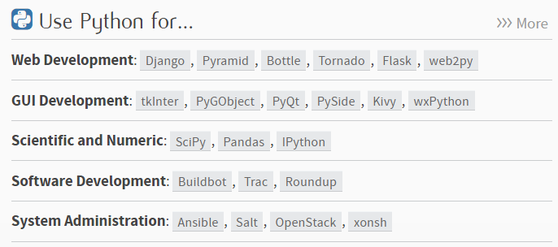
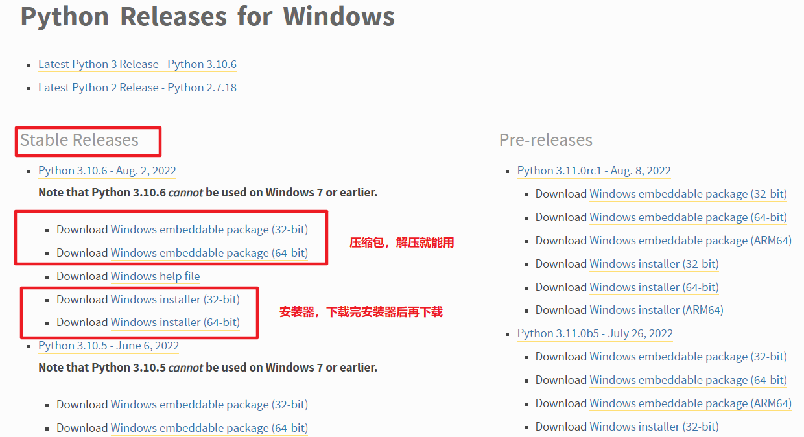
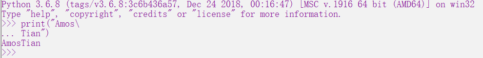

> Python基础——简介

<!--more-->

## 1.1 应用



- WEB应用
- 爬虫程序
- 科学计算
- 自动化运维
- 大数据
- 云计算
- 人工智能

## 1.2 环境搭建

### 1.2.1 解释器分类

CPython：用C语言编写的Python解释器

PyPy：用Python编写的解释器，速度比CPython块

IronPython：用 .net 编写的解释器

JPython：用Java编写的解释器

### 1.2.2 Python解释器安装

从Python官网下载Python的[安装程序](https://www.python.org/downloads/)，下载后双击运行并安装；

以 Windows版本下载为例




### 1.2.3 Python交互模式

```shell
Python 3.6.5 (v3.6.5:f59c0932b4, Mar 28 2018, 16:07:46) [MSC v.1900 32 bit (Intel)] on win32
Type "help", "copyright", "credits" or "license" for more information.
>>> #命令提示符 输入python指令，输入结束直接执行
# IDLE** 中 Tab 可以简单提醒 只适合简单测试
exit() #退出
python 文件名 # 执行 
```

## 1.3 Python程序

### 1.3.1 表达式

> 由数字、运算符、变量等以能求得数值的方法所得的组合

### 1.3.2 语句

> 语句是能对程序运行产生影响的单位

```python
print()
a = 10
```

### 1.3.3 程序(Program)

> 语句和表达式构成程序

### 1.3.4 函数(function)

函数就是语句，能够完成特定的功能

```python
xxx(参数列表)
```

分类

- 内置函数：由 Python 解释器提供的函数

  [官方文档](https://docs.python.org/3/)

- 自定义函数

## 1.4 基本语法

- 严格区分大小写

- 每行都是一个语句，以 `换行符` 结束

- 每行语句长度不要过长（80字符）

- 一行语句可多行编写，以 `\` 结束

  

- 缩进严格

  表示代码块

- 注释 `#`

## 1.5 字面量和变量

字面量：字面的值

变量(variable) ：保存字面量

### 变量和标识符

未被赋值的变量不能使用：NameError:name 'x' is not defined

#### 变量命名规范

- 下划线命名法
- 大驼峰命名法

#### 标识符规范

- 字母数字下划线
- 不能使用数字开头
- SyntaxError : invalid syntax
