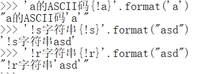
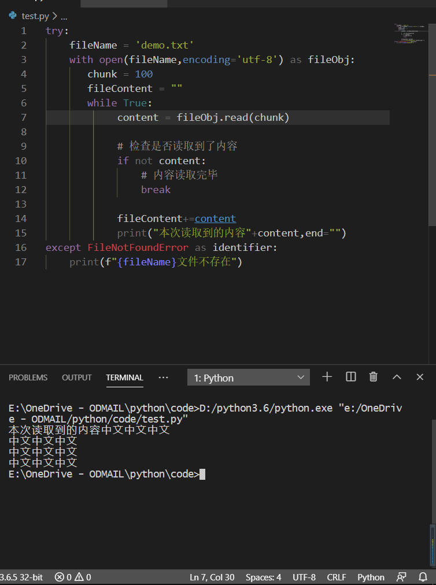
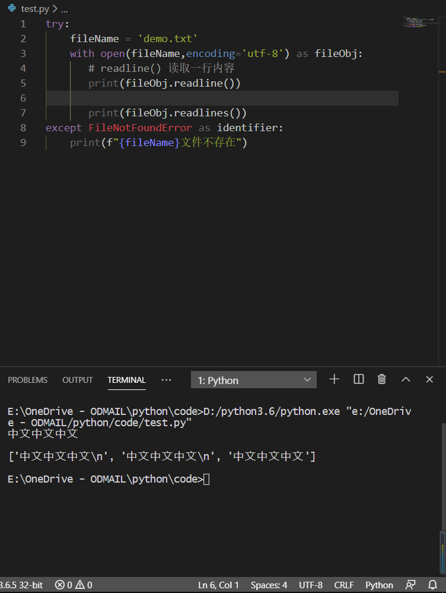
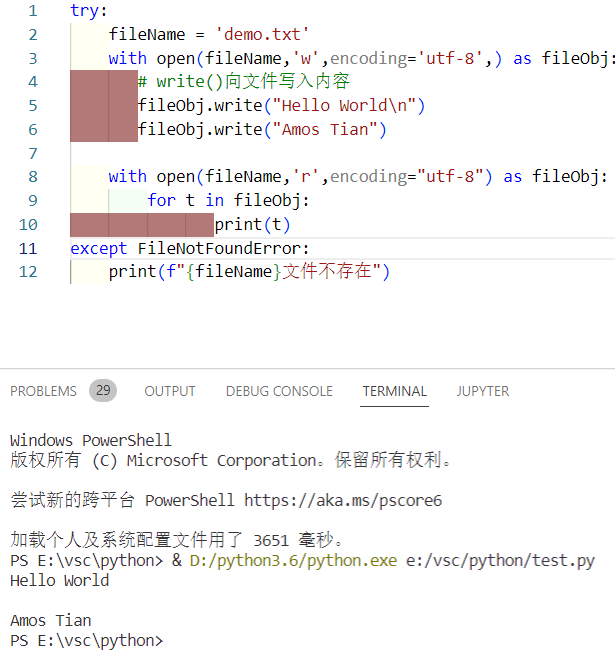

> Python-进阶-IO

<!--more-->

# 10. 标准IO

## 10.1 读取键盘输入

Python提供了 `input()` 函数从标准输入中读入一行文本，默认的标准输入是键盘

```python
ss = input("输入提示：")
```

## 10.2 标准输出

1. 表达式语句
2. print() 函数

### 10.2.1 表达式转化成字符串输出

- `str()` ：返回一个用户易读的表达式，去掉字符串标志 `''` 或 `""`

- `repr()` ：产生一个解释器易读的表达式，保留字符串标志 `''` 或 `""`

```python
s = 'Hello world'
str(s) # 'Hello world'
repr(s) # 'Hello world'

str(1/7) # '0.14285714285714285'

hello = "hello\n"
str(hello)
# hello
#
repr(hello)
# 'hello\n'
```

### 10.2.2 字符串格式化

`rjust(整数)` ：将字符串靠右，并在左边填充空格

 `ljust(整数)` ：将字符串靠左，并在右边填充空格

`center(整数)` ：将字符串居中，并在两边填充空格

```python
for x in range(1, 11):
    repr(x).rjust(2), repr(x*x).rjust(3), repr(x*x*x).rjust(4)
    
(' 1', '  1', '   1')
(' 2', '  4', '   8')
(' 3', '  9', '  27')
(' 4', ' 16', '  64')
(' 5', ' 25', ' 125')
(' 6', ' 36', ' 216')
(' 7', ' 49', ' 343')
(' 8', ' 64', ' 512')
(' 9', ' 81', ' 729')
('10', '100', '1000')

for x in range(1, 11):
    repr(x).center(4), repr(x*x).center(6), repr(x*x*x).center(8)
(' 1  ', '  1   ', '   1    ')
(' 2  ', '  4   ', '   8    ')
(' 3  ', '  9   ', '   27   ')
(' 4  ', '  16  ', '   64   ')
(' 5  ', '  25  ', '  125   ')
(' 6  ', '  36  ', '  216   ')
(' 7  ', '  49  ', '  343   ')
(' 8  ', '  64  ', '  512   ')
(' 9  ', '  81  ', '  729   ')
(' 10 ', ' 100  ', '  1000  ')    
```

`zfill(整数)` ：在数字左边添加0

```python
'12'.zfill(5)  #'00012'
'-3.14'.zfill(7) # '-003.14'
'3.14159265359'.zfill(5) # '3.14159265359'
```

### 10.2.3 `str.format()`

> `str` 中的 `{}` 会被 `format()` 中的参数替换

在 `{}` 中的数字用于指向对象在 `format()` 中的位置

- 如 `{0}` 指向 `format(a,b,c)` 中的 `a`

```python
print('{}网址： "{}!"'.format('菜鸟教程', 'www.runoob.com'))
# 菜鸟教程网址： "www.runoob.com!"
print('{0} 和 {1}'.format('Google', 'Runoob'))
# Google 和 Runoob
```

`format(name1=value1)` 中还可指定关键字参数，与 `{name1}` 同名

- 关键字参数要在位置参数之后

```python
'{name}网址： {0}'.format('www.runoob.com',name='菜鸟教程')

'菜鸟教程网址： www.runoob.com'
```

`!a` 表示使用 `ascii()` ，`!s` 表示使用 `str()` ，`!r` 表示使用 `repr()` 用于在格式化某个值之前对其进行转换



在 `:` 后 传入一个整数，可以保证该域的宽度，用于打印表格

```python
table = {'Google': 1, 'Runoob': 2, 'Taobao': 3}

for name, number in table.items():
    print('{0:10} ==> {1:10d}'.format(name, number))

#             0123456789
Google     ==>          1
Runoob     ==>          2
Taobao     ==>          3
```

`.format()` 中可以传入一个字典，可以使用 `[]` 访问键值

```python
table = {'Google': 1, 'Runoob': 2, 'Taobao': 3}
print('Runoob: {0[Runoob]:d}; Google: {0[Google]:d}; Taobao: {0[Taobao]:d}'.format(table)) # Runoob: 2; Google: 1; Taobao: 3

print('Runoob: {Runoob:d}; Google: {Google:d}; Taobao: {Taobao:d}'.format(**table)) # 解构
# Runoob: 2; Google: 1; Taobao: 3
```

# 11. 文件IO

> 标准输出文件可以用 `sys.stdout` 引用

`I/O(Input/Ouput)`

文件操作步骤

- 打开文件
- 对文件进行操作
- 保存
- 关闭文件

## 11.1 打开文件

> 使用 `open()` 函数打开文件，返回一个文件的对象
>
> `fileObj.close()` 方法关闭文件

```python
open(file, mode='r',buffering = -1,encoding=None,errors=None,newline=None,closefd=True,opener=None)
```

- file：要打开的文件路径

  需要注意相对路径与绝对路径，在 Windows 下，可以用 `/` 代替 `\` ，或者 `\\` 代替 `\` ，或者使用原始字符串 `r"str"` 

- 使用  `..` 返回上一级目录

- 如果目标文件距离当前文件较远，使用绝对路径

```python
try:
    fileName = "demo.txt"
    fileObj = open(fileName)  # 打开fileName文件
    print(fileObj.read())

    fileObj.close()
except Exception as identifier:
    print('文件不存在')
```

##  11.2 文件操作

```python
# with ... as
with open(fileName) as fileObj:
    # 在with语句中可以直接使用fileObj对文件进行操作
    pass
```

## 11.3 文件读取

`read()` 方法用来读取文件的内容，会将内容保存为一个字符串返回

默认为纯文本格式打开，编码为 `None`

```python
try:
    fileName = ''
    with open(fileName) as fileObj:
       content = fileObj.read()

       print(content)
except FileNotFoundError as identifier:
    print(f"{fileName}文件不存在")
```

### 11.3.1 文件读取格式

1. 纯文本格式，默认 `utf-8` 编写文本文件
2. 二进制文件（图片，mp3，ppt）

### 11.3.2 读取中文文件

> 指定文件编码为 `utf-8`

```python
try:
    fileName = 'demo.txt'
    with open(fileName,encoding='utf-8') as fileObj:
       content = fileObj.read()

       print(content)
except FileNotFoundError as identifier:
    print(f"{fileName}文件不存在")
```

### 11.3.3 读取大文件

指定 `size=-1` 

- 指定要读字符的数量，默认值为 `-1` ，读取文件中所有字符
- `read()` 会记录上次读取位置，若读取到文件末尾，则返回空串 `""`

```python
try:
    fileName = 'demo.txt'
    with open(fileName,encoding='utf-8') as fileObj:
       chunk = 100
       fileContent = ""
       while True:
            content = fileObj.read(chunk)

            # 检查是否读取到了内容
            if not content:
                # 内容读取完毕
                break

            fileContent+=content  
            print("本次读取到的内容"+content,end="")
except FileNotFoundError as identifier:
    print(f"{fileName}文件不存在")
```



### 11.3.4 读取一行

> `readline()` 读取一行内容 

- `readline()` 自动换行

> `readlines()` 一次读取到的内容返回，封装到一个列表中返回

```python
try:
    fileName = 'demo.txt'
    with open(fileName,encoding='utf-8') as fileObj:
       # readline() 读取一行内容
       print(fileObj.readline())

       print(fileObj.readlines())
except FileNotFoundError as identifier:
    print(f"{fileName}文件不存在")
```



### 11.3.5 直接遍历文件对象

```python
fileObj = open(fileName)
for t in fileObj:
	print(t)
```

## 11.4 文件写入

`write()` ：使用 `open()` 打开文件，需要指定要做的操作

- `r` ：表示只读

- `w` ：表示可写

  文件存在，则覆盖原文件

  文件不存在，则创建文件

- `a` ：表示追加内容

  文件存在，则向文件追加内容

  文件不存在，则创建文件，新增内容

- `+` ：表示增加权限

  `r+` ：即可读又可写，文件不存在则报错

  `w+`

  `a+`

- `x` ：表示创建文件

  不存在，则创建

  存在，则报错

```python
try:
    fileName = 'demo.txt'
    with open(fileName,'w',encoding='utf-8',) as fileObj:
       # write()向文件写入内容
       fileObj.write("Hello World\n")
       fileObj.write("Amos Tian")

    with open(fileName,'r',encoding="utf-8") as fileObj:
        for t in fileObj:
               print(t)
except FileNotFoundError:
    print(f"{fileName}文件不存在")
```



## 11.5 二进制文件

`open()` 参数

- `p` ：读取文本文件
- `b` ：以字节形式读取二进制文件

```python
# 读取filename中的文件，写入新对象中
with open(filename,'rb') as fileobj:
	with open(fileName,'wb') as fileObj:
		chunk = 1024*1024
		while True:
			content = fileObj.read(chunk)
			if not content:
				break
		
		fileObj.write(content)
```

## 11.6 seek()&tell()

- `fileObj.tell()` ：查看当前读取位置
- `fileObj.seek()` ：切换读取位置
  - arc1,切换的位置
  - arc2,计算位置方式
    - 0：从头计算，默认
    - 1：从当前位置计算
    - 2：从最后位置开始计算

## 11.7 其他操作

> 需要引入 `os`

```python
import os

# 返回列表，元素为目录中每个文件名
r = os.listdir()

# 获取当前所在的目录
r = os.getcwd()

# 切换当前目录 cd
r = os.chdir()

# 创建目录
os.mkdir()

# 删除目录
os.rmdir()

# 删除文件
os.remove()

# 重命名,移动文件
os.rename(oldName,newName)
```


